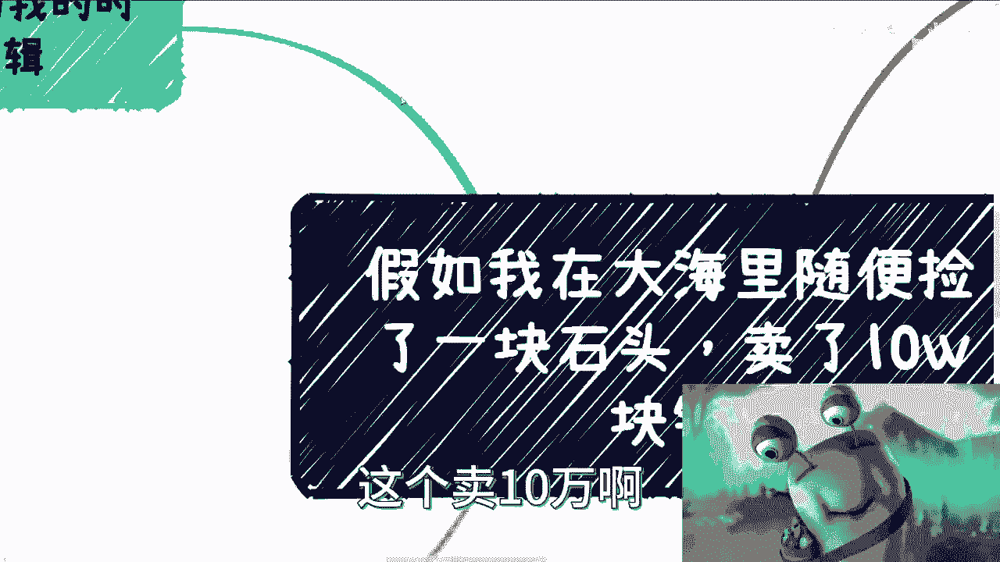
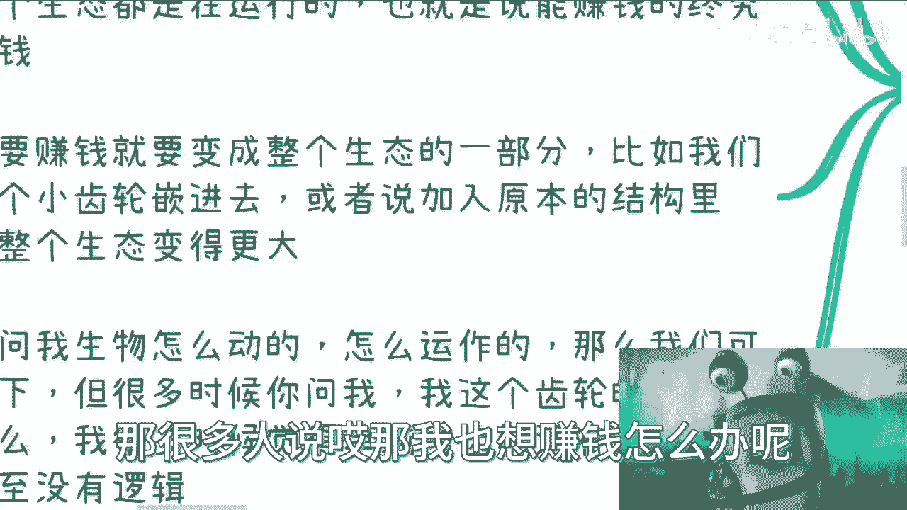
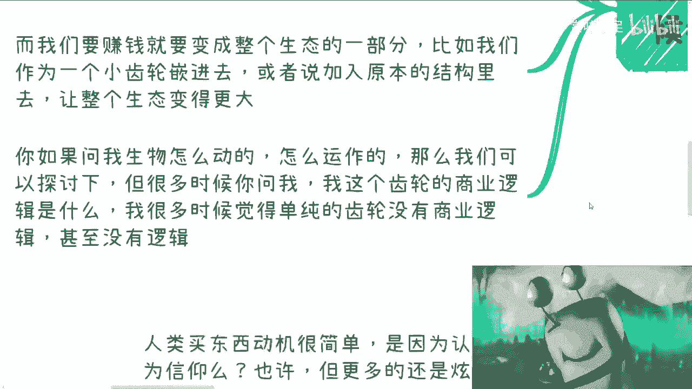
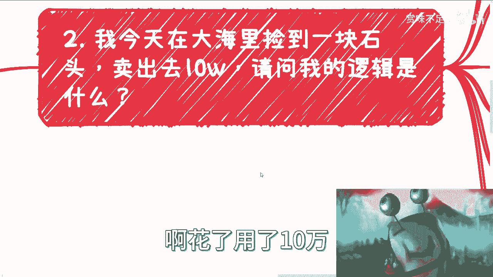

# 假如我在大海里随便捡一块石头，然后卖了10万块钱 - P1 - 赏味不足 - BV1CQ4y1W7v7

啊大家好，这个就看这个主题，他妈的，大家觉得我要来鸽了是吧，哈哈吕老师要来卖石头了，来来来来来，哎哎哎看我吐个舌头，看啊看我吐个舌头啊，这是我新发现的功能啊，我以前还真没发现。

首先啊假设我们在大海里面随便捡了块石头，什么意思，也就是说他肯定是有通用性的对吧，我不是说它有什么特殊性啊，卖了10万啊，我本来想写100万的，想想算了，还接点地气啊，这个卖10万啊。

你看啊，首先好多时候啊，好多人咨询我时候呢都在问我啊，他说有什么东西的，什么这个这个业务背后有没有商业逻辑。

首先啊商业这个东西啊，我给你打个比方，你们这么想，商业这个东西它就像一个环套着一环，它是一个就是说有内循环，外循环它可能套着无数个环，好我举个例子，整个社会就整个社会的商业对吧，它就像一个生物。

它里面有各种血管，各种骨骼，各种器官对吧，他每时每刻都在运作对吧好，那么这个运作过程呢，你们可以理解为它就是商业在运作啊，他活着就是商业在运作，他活着就大家在赚钱啊，当然我说大家。

大家并不是真正的意义上的大家啊，只是那一小撮人对吧，那么也就是说这个生物生病也好，健康也罢，整个生态都在赚钱啊，那么这是什么意思呢，意思就是说你甭管整个大环境好还是不好，能赚钱的，终究能赚钱啊。

这就是我们说的就是这么一个打比方啊，那么而我们要赚钱呢怎么办对吧，那那又回到这个问题了，那很多人说哎那我也想赚钱怎么办呢。

那你很简单啊，你想赚钱只有两种可能性，一种是你作为一个新的对吧，你说哎，我可能今天作为一个新的这个这个生态啊，作为新的一个器官或者是做的，作为一个新的新的一个细胞对吧，加入到整个的生态当中去。

对他只要接受接纳你，哎那你不是以后就跟着这个生物一直在动了嘛，对不对啊，那要么就是说你不是啊，你那是加入到原本的结构当中对吧，加入到他原本的一些血管当中啊，一些器官当中啊。

只不过使得这个生态可能变得更大，那当然了，你从外面如果以人来打架，打比方的话，你可以让它变得更肥啊，变变得更胖，变得更更瘦更高对吧，那都有可能的，但是呢你除了这两种方式，没有别的方式对吧。

那么从整个的框架来讲，我们9年制义务教育再加高等教育，再加啊这个本本科硕士博士，无论你今天读到哪边，你的整个的生态你是游离于这个生生物以外的，你知道吗，就是你看这个生物就像我们看奥特曼是一样，就你没有。

你跟他完全没有交集啊，什么意思，也就是说那不好意思，所以说你们的所有的这个过程，跟赚钱没有关系对吧，这个我们结论已经早就得出来过了，那么你们打这么个比方，可能希望让大家能够更形象的啊，能够看到这个东西。

那么你想啊，你接下来问我，你说生物怎么动的，怎么运作的，那么我们可以探讨一下对吧，但是你很多时候你问我诶，这里面这个血管啊，这个血液这个器官它怎么运作的，那你让我怎么回答。

就就我只能说我只能说这个这个生物活着，那他必须要有这个东西，那你问我，你问我这个东西单独是个什么逻辑，那那我也不知道了对吧，就就就好像有点就是呃啊，因为所以天这个科学道理对吧，那你你问我这个东西怎么样。

我怎么说呢是吧，就是说很多时候你单纯的一个齿轮，单纯的一个细胞，它没有商业逻辑，甚至他妈的他没有逻辑啊。

好那么我们往往下看啊，点题对吧，我今天在大海里捡到一块石头，当然随便捡到一块石头啊，啊花了用了10万就能卖出去。

一个人10万客单价啊，请问我的逻辑是什么好那么我们看啊，这个时候啊，这个时候有一些人呢，逻辑是开始研究这个石头的部分啊，成分对吧，是不是氪星石啊，是不是下一代钻石啊，是不是涵盖了所有元素周期表啊。

是不是超出了元素周期表啊对吧，那到这个时候呢，就甭管这个石头成分是什么，反正大家就是天马行空啊，这个到处就是说造谣对吧，自己说自己的啊，那么如果卖出去呢，我肯定大吹特吹啊，怎么吹呢，我牛逼啊，成功学啊。

我慧眼识实啊，是我发现的，我怎么发现的呢，反正我花了非常曲折啊，也许我就是在这个地方水里面一掏掏出来的，但是呢我起码得写个就是说啊，我在这地方待了几十年啊，我发现这个东西啊。

那怎么地你也得写一本自传出来是吧，那这是第二种啊，那么还有的人呢开始研究啊，这个人比如说我是怎么营销的啊，从0~1过程当中到底发生了什么，是不是幕后有推手啊，是不是这个石头其实不在海里啊。

在别的地方他妈的就找了一个场景，找了个故事卖惨啊，这个再怎么样啊，那有的人就开始喷啊，就说是骗局啊，石头怎么可能卖10万呢对吧，那照你这么说吧，那他妈的海里石头都他妈卖10万吧，好你们有没有发现。

你们有没有发现这些剧情如此的眼熟，对不对，你今天是不是卖个石头，你觉得重要吗，不重要，因为无论你卖什么，你会发现都是这么一个走向，为什么，因为那又回到我们刚刚那个问题，我只能告诉你这个生物。

整个社会这个生物它就这么发展，你非要问自己为什么，那谁知道呀，对啊，那么你如果你问我，我卖石头有没有商业逻辑，我能回答你，我只能说哎地球上有人觉得10万块钱可以接受，有人觉得这块石头就值10万块钱。

有人就希望从我手上买掉，你问我什么逻辑，我怎么知道什么逻辑啊对吧，那我的客户都是都是上帝对吧，你总不能说，因为我觉得这个人花了10万，他可能是个冤大头大冤种，我他妈就骂他，那也不行吧对吧。

而且我总不能告诉你，我的商业逻辑是因为我的客户是，这是我的商业逻辑，你觉得通吗，哎某些时候可能通的对吧，但是可能很多人不接受啊，好那么但你想想啊，这个问题就来了，请问可以复制吗对吧。

你说你说去海里捡块石头，你去慢慢看，你去慢慢看，你说找客户是，那你去找找看，自然卖不出去嘛是吧，那么可以复制吗，也许可以，但很难啊，那么我们说这个呢，就是一个很通用的一个商业案例啊。

那么我们这个时候就来说了，那么规律规模式有没有放到大生态，有没有有肯定有啊，任何一个东西都是有道理的，都是有逻辑的啊，不可能没有，对不对，你放的大生态，那么规律模式就多了，我们无论做什么。

你们会看到无论做什么，讲究一个启示啊，什么叫启示，就是你像今天有个小伙伴咨询我的时候，就问我啊，就说啊这个数字经济啊，说吕老师，你担不担心更多人进来，我说我不担心，我说我担心有人不进来，为什么。

因为这行业只有越来越多的人来卷它才能起事，对吧好，那有人要说了，哎呀对吧，外面很卷都说不要卷，在这边开始瞎扯淡，你又说要卷，那么不是扯淡嘛，对不对，但是你要明白事物是要发展的啊，每个阶段都有每个阶段。

每个阶段的事情要去做，每个阶段都有每个阶段的一个一个一个特殊性，啊对吧，卷也是以前不卷的结果，或者说卷也是以前从不卷银河而来的啊，你不起誓，你怎么能够赚钱，你怎么把市场做大，你市场不做大。

你怎么最后又再去赚钱呢，你市场不做大，最后怎么卷呢，这是个必然的过程，好那么我们就说什么叫启示，高情商，高举高打，中情商，冲动消费低情商人来疯啊，那么启示本身它就是一种商业模式，你你比如说啊。

你说网络这么那个强对吧，网络现在这么这么已经是非常成熟了，你可以账号矩阵去运营，你可以去洗脑，你可以去洗稿对吧，你这个是可以自己去试造起来，你也可以借助一些政策造起来，你也可以通过一些风向造起来都可以。

但是起来之后就会形成所谓的共识，比如说对吧，刚刚我们说石头哦，那么肯定会有周边非常多的营销号，非常多的人开始说啊，这个东西啊怎么怎么好对吧，我们研究出来它可能有些周边啊。

虽然这个石可能不止没有这个石头这么转，没有这个石头这么值钱，但是呢那个石头值得那个可以加工对吧，可以做装饰品啊，可以给大家带来好运来对吧，那么他是自己启事吗，是但是他是借着这块石头能卖出10万块钱。

来启示对吧，好，那么我们再往下讲啊，那么中央各地方政府他也可以说啊啊好，那么呼吁大家对这个东西可能是个保护，保护性的东西，有这个腐蚀性啊，过希望大家找到时候能够移交政府啊，这个东西未来能够加工之后。

给老百姓带来造福对吧，怎么样怎么样怎么样啊，那这也是一个启示，但是我们就说啊，这个石头到底价值是什么，有人知道吗，没有啊，或者有，但是很少数啊，那么一旦起势之后，自然你就会有所谓的认同和反对的声音。

反对的声音你需要关心吗，不需要那么认同的声音，你需要关心吗，那不好意思，也不需要，为什么，因为你就是始作俑者，或者说你就是整个始作俑者之一，或者你能明白整个这个生物是怎么运作的。

你就会知道这些认同的声音，其实都是洗脑洗出来的，都是观念植入进来的，你有什么好认同的，无所谓啊，一脉相承对吧，那当有了共识之后，漏斗模型一过滤，自然就会出现买家对吧。

就会出现石头愿意花10万甚至花100万，甚至花1000万来买的人，因为为什么，因为这个就是这个生物的一个，一个一个运作逻辑，你问他为什么要买它，怎么知道要问问就是高举高打冲动消费大冤种，对了梅利亚。

那我们说点呢，冲动消费啊，那个高举高打冲动消费大冤种没利亚好，那么你非要问为什么买对吧好，你要探究背后逻辑啊，你看啊，人类买东西的动机很简单，是因为认可吗，很少是因为信仰吗，也很少因为什么炫耀啊。

嗯高情商宣扬低情况攀比对吧啊，你看啊，书课程知识变现，门票收藏品，手机等等，一切都是为了炫耀，或者说你也许不想炫耀，但是不好意思，你传输出去的信号，让别人感觉你在炫耀啊，但这个不重要啊。

因为它打它在整个这个生态，整个这个生物里面达到了炫耀这个效果，你管你本意是什么，不重要对吧好，但炫耀的前提是什么，启示要有共识，没有共识，你炫耀个屁，你向谁去炫耀啊，你就像我今天说了。

来打开摄像头给你们看个石头，有什么羡慕吗，不羡慕，因为你们不知道它的价值啊，那如果这个东西在在那个拍卖行标价，明码标价1000万，信不信吧，信不对不对，这就是共识，那么回到最早的问题啊，很多人问我。

为什么有很多乱七八糟的这种课程，很多乱七八糟的产品，有人买，逻辑是什么，你们仔细想想，逻辑是什么，没有逻辑，逻辑就是逻辑，就是他只要一心一意包装好他的东西，找到精准的客户啊。

而这些客户又心甘情愿的一个愿打一个愿挨，这就是他们的逻辑哦，很多人却在跟我说，他说哎呀我要研究这个课程细节，我要研究他背后的话术啊，我要研究就是说这个老师的牛逼地方啊，我要研究这个课程到底。

比如说这个产品怎么设计，怎么卖的，这其实并不重要，你知道吗，因为任何一个东西，你其实只要你的营销做的广，只要你启示起得好，你总归能赚钱，如果你不能，那就说明你没有找到你的客户，高情商，没有找到你的客户。

低情商没有找到，就这么简单。

没了就不要太去花时间去探究，就说啊这个东西怎么样怎么样怎么样，没有用的哦，你就像web3里面有很多人问我，哎呀，吕老师B3应该怎么赚钱啊，我告诉你啊，不要探究任何的逻辑，你能你看到别人赚钱。

只是因为别人知道消息比你早，只是因为别人跟庄家是一伙的，你没有赚钱，只是因为你没有这个关系，不要在那边研究啊，这个K线图是这样的，卧槽W模型你别打，不用模型，你你你你就算是这个俄罗斯套娃模型都没用。

你知道吧，就是那当然啊又要回到我们说的这个辩证逻辑，就是你不能一刀切哦，他说要说了啊，吕老师按照你这个说法，那他妈的只有关系跟没有关系，那也并不是啊，你要说整个的方法论有没有用，有啊能不能赚钱能啊。

但是这个叫赚钱吗，他可能叫温饱对吧，而大部分人要的是温饱吗，不是要的是什么暴富怎么办呢，信息就是不对等呀，他就是不对等对吧，所以你再返回到这个你要卖的产品和服务上面，你想想看啊，你希望的是大众能够得到。

比如说他花了100块钱，他真正能得到100块钱的价值，你是不停的在打磨一个100块钱价值的东西，但别人呢不是别认识什么，别认识，问他哎，你花100块钱买东西哦，来我给你一个暴富的东西，你先花1万。

那么我咱们问题来了，你觉得这个人到底是先花100买个东西呢，还是花1万买个暴富的呢，哎对不对，好好来，那到最后卖100块钱的个人要过来，卧槽刘老师，这个人没有钱，为什么他会花1万买这个东西，想想看啊。

回顾一下再思考一下好吧，OK嗯就先说到这啊，那大家觉得啊大家有什么商业产品需要探讨的，手上牌不知道怎么打的啊，这个未来想赚更多的钱呢，想了解到未来自己的这个路更好的怎么走的，那你们可以整理好自己的问题。

整理好自己的背景好吧，然后咨询我啊，我们再吐个舌头。