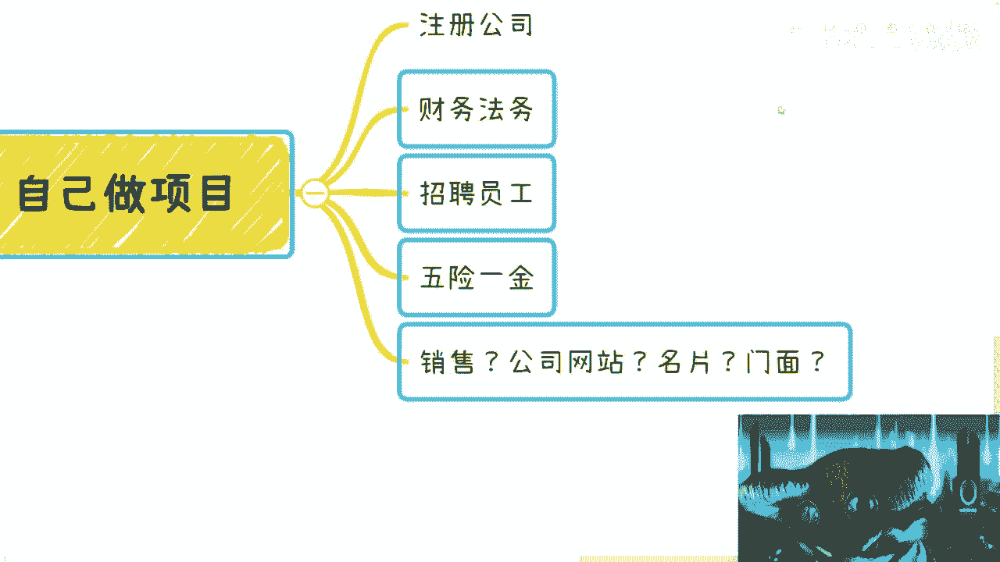
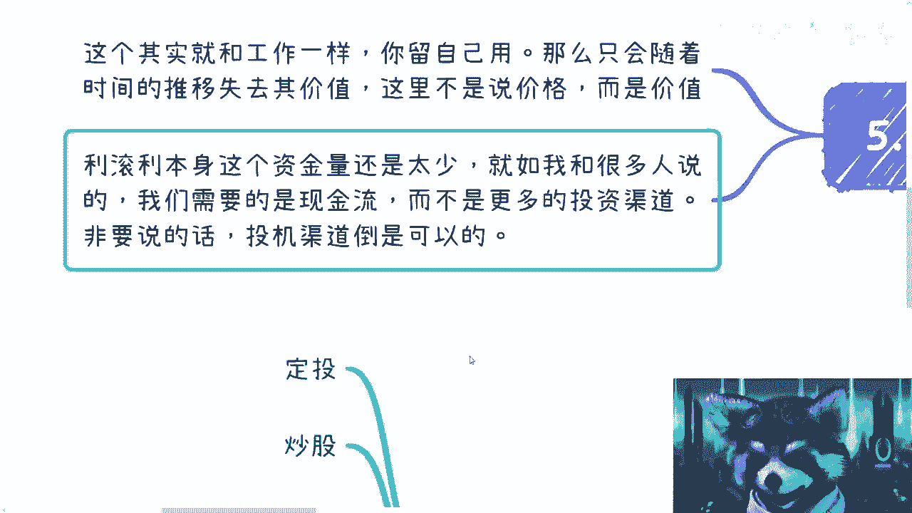
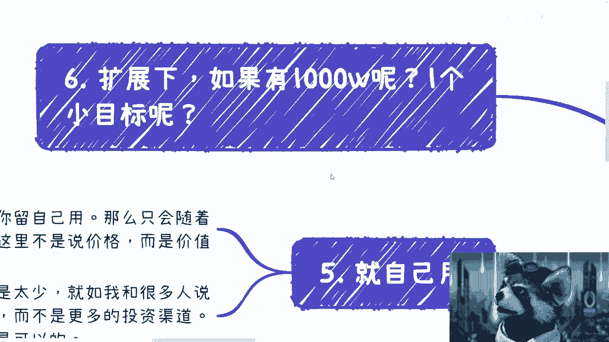
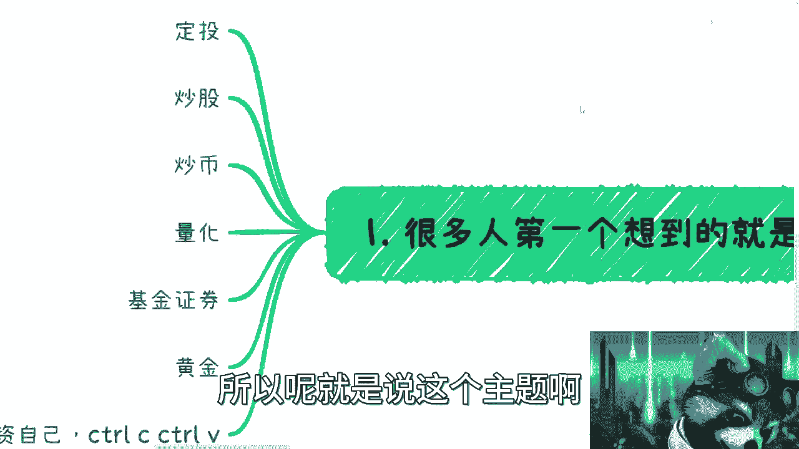

# 假设今天给你100w-你打算怎么用---P1---赏味不足---BV1K24y1N7A6

在本节课中，我们将探讨一个经典的思维实验：如果你突然获得100万元，你会如何规划和使用这笔资金？我们将分析几种常见的处理方式，并讨论其背后的逻辑与潜在问题，帮助你理解资金管理与个人发展的深层关系。

---

## 概述：资金使用的常见思路

当人们获得一笔意外之财时，通常会考虑几种使用方式。以下是几种常见的思路，我们将逐一分析。

---

### 1. 进行金融投资 📈

上一节我们介绍了资金使用的常见思路，本节中我们来看看第一种方式：进行金融投资。许多人首先会想到将资金投入各种金融市场。

以下是几种典型的金融投资选项：
*   **定投**：定期定额投资。
*   **炒股**：买卖股票。
*   **炒币**：交易加密货币。
*   **量化交易**：使用算法进行自动化交易。
*   **基金**：购买公募或私募基金。
*   **黄金**：投资实物黄金或纸黄金。

在我看来，这些都可以做，但需要**定一个比例**，例如投入资金的20%或30%。大部分人不可能全部投入（All in）。

然而，这件事可能没有太大意义。即使让你实际操作，你自己也可能觉得意义不大。因为投资时，很多人对“幸存者偏差”没有深刻的感受。让你投入三四十万元，你可能会观望和评估，就像对自己买彩票中奖的概率没有信心一样。事实也是如此。

---

### 2. 投资自己 🧑‍🎓

上一节我们讨论了传统金融投资的局限性，本节中我们来看看另一种思路：投资自己。我在这里提了一句：**还不如投资自己**。

“CTRL C + CTRL V”是什么意思？如果你有这笔钱，可以做些事情。有些人可能会想去读个研或读个MBA，增长学历或积累人脉。这个逻辑没问题，但缺一个闭环。你认识这些人，不代表你的商业思想或人脉关系已经配得上这个资金量级。你去投资自己、认识一些人，是可行的。

但你会发现，不一定能和对方合作。合作的前提是需要有业务相关的东西，而不是仅仅因为有一笔钱。投资30万，这笔钱可能显得不上不下。

第二点，“CTRL C + CTRL V”我觉得比较容易。意思是，比如你花5万元参加一个培训，把内容记下来，然后花点钱找些老师，照搬到别的城市去直接复制。很多人会说这样做不道德、没有底线。

在这个社会上做事情，你有没有底线不重要，重要的是你的竞争对手有没有底线。同样，你有没有底线跟你的竞争对手有没有底线也不重要，重要的是有底线能不能赚钱，没有底线能不能赚钱。如果单纯从投资产出比角度讲，我反而觉得这是风险性最低的。我相信你们也会明白，这是风险最低的。

上面的方式（金融投资）都是有风险的，而且很有可能扔进去连个声音都听不到。

---

### 3. 投资小公司或小项目 💼

上一节我们探讨了投资自己这种“轻资产”模式，本节中我们来看看更具实体性的投资：注资小公司或小项目。首先，这的确是个不错的方式，可以投资一定的比例。

但问题在于，这个资金量比较尴尬。如果你有500万，那可以。用100万投资小项目或小团队，我估计也就只有你认识的朋友，救个急可以。否则，你这个投资怎么弄？投50万，在股权上占一定比例，还是让创始人代持？股权架构的逻辑上问题不大。

但大部分公司，就像我前面写的，不接受个人投资者。而且与此同时，你这50万或100万的投资也很尴尬。随便想想，比如一个处于Pre-A轮或天使轮前的互联网项目，如果创始人有点自知之明，估值可能在小几千万；没点自知之明，就大几千万；再没点自知之明，就几个亿。

就算按5000万估值算，你投50万进来占1%。这种投资没什么意义。一般投资是这样子的：要么不是为了钱，是为了投资人或投资机构的资源。也就是说你是象征性投资，投1万块钱也可以，后面你的很多资源是项目方看中的。还有一种是你投很少，但你是领投。比如红杉资本投了一点点作为领投，后面的散户或小机构可以跟进。

也就是说，项目方最重要的是一个大资金量的进入，但不代表他一定要盯着一个人。问题是你作为一个个人，投10万、50万、100万，很尴尬。这个点上面它是一个悖论：一旦没有人要——大部分靠谱项目是没有人要这笔钱的；但凡要的，大概率也是扔水里，没什么声音。

---

### 4. 招聘员工，开展业务 👥

上一节我们分析了作为个人投资者参与项目的困境，本节中我们来看看更主动的方式：自己招聘员工，开展业务。第三点是我们说你可以兼职，招一些员工打工。

我们看看，比如你可以招一些直播带货的、培训讲师、开发、设计。但问题在哪里？你有没有想过，你知道让他们干嘛吗？很多人可能觉得，找他们最容易的方式就是做外包。做外包你还得接触到外包单子，这是第一点。

第二点是，你把人招过来，可以做企业里面的项目，或者像培训讲师，你可以跟别的培训机构或企业去做合作。没毛病。但是你会发现这个事，我相信你去投这笔钱的时候，大部分人可能想的是：第一，我已经投了钱；第二，我就不愿意再放额外的、更多的精力和时间进去。因为大部分人去投钱的时候，肯定是希望已经投钱了，就想躺赚，剩下的就不想管。大部分是这样子的。

但你会发现，现在问题在于，你投这些东西，如果只是单纯去做一些外包，可以是可以，但是投入产出比很低很低，而且你可能还得管很多东西。你投入30万，赚了40万，当中有10万的差价。虽然对你们现在很多人来讲，觉得10万差价是OK的，但当你有100万的时候，你其实是看不上这10万的。对不对？这就像你们有十块钱，你们看得上一块钱吗？看不上。你们想的是用十块钱赚二十块钱，而不是用十块钱赚一块钱。其实都一个道理。

---

### 5. 自己主导一个项目 🚀

上一节我们讨论了雇佣他人开展业务的挑战，本节中我们来看看最彻底的方式：自己主导一个项目。第四点，自己做项目。

我随便列了一些开销，比如：
*   **注销公司**：花不了几千。
*   **财务法务外包**
*   **招聘员工**
*   **五险一金**
*   你做一家公司或一个项目，总得有个销售吧？
*   总得有个门面吧？（不管是网站、名片还是实体门面）

问题来了，你用100万做一个项目。如果你有1000万，那就算了。你用100万做个项目自己想想，法务财务外包、员工五险一金，这几个东西基本上可以算出来，大概几个月或一年就花完了。

那么这个时候你会发现有个问题：听上去时间比较充足，但在当下这种情况下，一旦你大概两三个月没有盈利，或者完全没有眉目，或者你还要做自己的产品（产品做出来之前没有订单，或做出来之后没有订单），你的心态就会崩。因为你没有持续的现金流。

另外，你的心态一崩，你的管理（management）就会崩——你的管理态度、心情、情绪就会崩。你一旦崩了，你的员工就会崩。员工对于大部分人来讲，可以被你压制、压榨或为你加班，但到最后……

你如果自己做项目还有个问题：你得赔上，不单单是这100万，你得赔上自己的关系、朋友、以前积累的很多东西。到底值不值得？还是得不偿失？你得自己去判断。很多时候你做一件事，真的不是只做这件事。

反过来又有人说了：“那驴老师，我做一件事，可以不大动干戈，不找我的朋友和关系链，怎么样？”那我就告诉你，你不去找，你做一件事，在我看来就不叫自己投资做项目。我相信你一定是跟别人合伙做项目，但绝对不会是你自己投钱的。你自己投钱，一定会用上自己的关系链，这毫无疑问。

---

### 6. 留作个人消费或备用金 💸

上一节我们分析了自主创业的沉重代价，本节中我们来看看最保守的做法：将资金留作个人消费或备用金。第五点，留着自己用。

这里我觉得跟你们现在打工是一样的。很多人会说目前打工怎么样怎么样。如果你把这笔钱留着自己用也可以，没问题，就当一笔补充。但是，其实随着时间推移，它会失去其价值。注意，这里我说的是**价值**，不是价格。它的价值一定会随着时间推移、随着你不去很好地利用它而贬值。我们不是去说通货膨胀，就单纯说这笔资金作为一个物品，它的价值。而且它是有投资价值的，你一旦留着自己用，其投资价值就变得很低。

第二点，如果你想去利滚利，那么本质上你的资金量太少。在当下这个时间点（可能比较困难的时候），我们本质上不管做什么，要的就是**现金流**，而不是更多的投资渠道。我发现聊下来，有非常多的人在问我有没有投资、基金、债券、国债。其实本质上不重要，因为大家现在要的一定是现金流，不是投资渠道。投资渠道没有足够多的本金，这个投资渠道对你来讲没有意义。当然有很多人说“苍蝇腿也是肉”，没毛病，但这个格局就实在小了一点。

所以说，你要我说的话，投资渠道倒是可以的，但别去找投资渠道。你把这100万分出20万投个基金，我觉得倒是可以的。

---

### 7. 思维扩展：如果有1000万或1个亿？🌌

那么，我们再开个脑洞。比如，扩展一下：如果不是100万，如果你今天有1000万或者一个小目标（1个亿）呢？你想过没有？

我为什么今天会开这个主题？其实是因为我希望大家能明白第一点：我们一直到现在为止所讲的，打工也好，被裁也好，为自己的积累资源也好，你会发现，很多时候说机会是留给有准备的人。那什么叫有准备的人？准备的东西是你自己的东西。那什么东西是你自己的？其实到最后还是关系链、人脉链、你的认知、你的社交圈人脉圈。

否则的话，你说今天就算你有100万，你怎么做呢？我们刚刚为什么会罗列这些东西？就是因为这些往往是大家能够想得到的，比如1、2、3、4、5。但是这里面，你看我说到现在，没有哪个东西是结合自己关系链的。

因为但凡你真的结合自己有关系的，比如投资小公司可以，没问题，投个20万。那我相信，以你的认知和人脉圈，你认识的人可能会比较靠谱，就算不赚钱，最后这20万肯定也能还给你，不至于打水漂。这是第一个。

第二个，比如招聘兼职人员。我相信，如果各位是有积累的话，那么他但凡招人，只要对人，然后人就会有专门的渠道，或者他可以找合作方帮他变现。这样的话，虽然这种逻辑赚钱的效率不一定非常高（比如两个兼职算8000一个月，一个人4000，两个人8000。这两个人一个月能给你赚多少钱不知道），但至少它是一个稳定的现金流（无论在直播、讲师还是开发上）。甚至我们说开发和设计，如果你有一些关系，就可以直接做了，去问政府要补贴、资助、基金都可以。

其实就是**四两拨千斤**：用A项目的资金去补贴B项目，用B项目的资金去补贴自己的项目。很多人都这么做。别去太在乎项目本身，我们还是要在乎资金本身。因为你要的点是赚钱，不是赚项目。项目有什么好赚的？

然后你说投资也是一样的。其实你会发现，很多人，我们不说他很准或怎么样，但你去给到他一部分资金，同时你又是关系圈、人脉圈比较高的，他也比较信任你，那就可以给他一部分钱。甚至你可以跟他谈，利息要低一点。比如我给你50万，我可能年化就要个7%-8%，但是我是需要保本的。也可以，没问题。现在有一些专门做量化的，一年可以到15%，他当中赚两个点的差价有什么不开心的？当然这个前提一定是：大家的关系是到位的，不是一个陌生人对一个陌生人。你跟他说“来，给我保本的7%-8%”，谁给你做？

---

## 总结与核心要点 🔑

本节课中，我们一起学习了面对一笔100万资金时可能的各种规划思路及其背后的逻辑。

我觉得这个主题主要是想跟大家说两个点：
1.  **积累是关键**：你们会发现，最终你们还是需要有积累，不管是关系上的积累还是认知上的积累。这才叫“机会是给有准备的人”。
2.  **打开格局思考**：你们可以跟着开开脑洞，不要觉得100万钱很多。想想看这钱可以怎么用，怎么把它利益最大化或价值最大化。其实跟你们现在要出去积累关系、要现在打工，是异曲同工的。你们现在选择在里面打工，然后到了一定岁数被优化、被离职，其实就更像什么？更像你就是这100万，企业对你没有任何投资，你就是在那边不停地贬值，贬值到某一个时间点就没有用了。当然，是不是真的没有用？不是没有用，你还可以跑外卖、做滴滴、做别的，但你就已经没有当时那100万的价值了。

所以，这个事我觉得大家可以想一想，可能这样说，大家自我感觉更直观一点。

有任何职业、兼职、市场变化、创业、商业化合作的问题，你们可以整理好自己的问题清单。