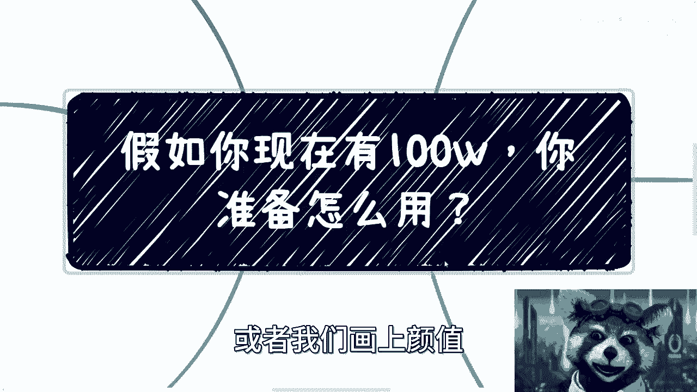
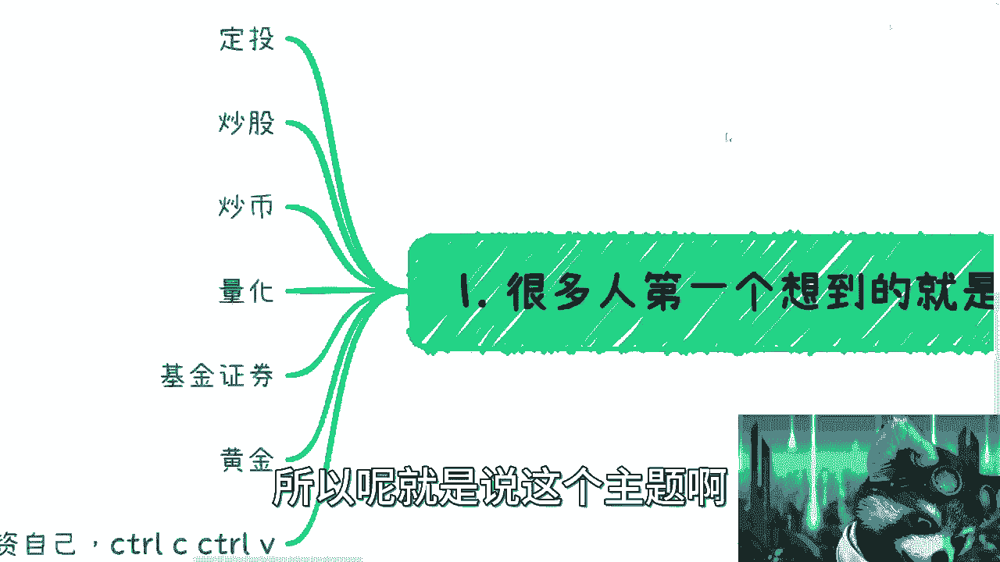

# 假设今天给你100w，你打算怎么用 - P1 - 赏味不足 - BV1K24y1N7A6

好各位小伙伴大家好啊，我可能有点感冒，感觉这个不是很舒服，嗯这两天这个咨询嘛正好是就有，我正好想到有这么个问题对吧，大家开个脑洞，说实话这脑洞呢可能大家也都很喜欢啊，看到我这小熊猫哎，看到没有。

这个眼睛变大了是吧，嗯这个脑洞很喜欢是吧，但是这个脑洞你们仔细想想看，其实没这么好弄的，你明白吧，就是打个比方啊，我说如果你们现在有这个100万，你打算怎么用，或者我们换而言之。

就是说你打算怎么来做投资，你知道吧，首先呢我在这个地方写了啊。

就是很多人第一个想到的就是投资，但投资这边呢我们来看啊，定投炒股炒币量化对吧，基金啊，黄金对吧，我在我看来啊，这些东西都可以做，但是呢就是说我们呃定一定比例对吧，我觉得大部分人也不可能all in对吧。

你说我梭哈，概率不大啊，那我觉得就是说呃定一个比例，比如说20%或30%，对不对，但是呢在我看来呢，其实这个事也没有太大的意义，包括我相信你们说是这么说啊，你我真的让你们去操作了。

你们自己也觉得没什么太大意义，为什么呢，因为就是我相信啊，真的做事情的时候呢，你们这个大部分人啊，其实不见得说对幸存者，幸存者偏差有什么这个叫什么很大的感受啊，但是你说投资的时候，打个比方。

让你们投个30万40万进去啊，就说这个观望观望评估评估啊，对吧啊，包括就是对自己这个买彩票中奖的概率，没什么信心啊，呃那事实来讲也是这样子的，那么我在这个地方呢还提了一句，就是还不如投资自己。

CTRLCCTRLV啊，什么意思啊，呃其实你会发现如果你有这笔钱呢，你其实可以做一些什么事情呢，就是咱别的不说，有些人可能会想着哎呀我去读个研，那个叫什么NBA对吧啊，我这个要么是增长一下学历。

要么就是去这个积累一下人脉关系啊，这个逻辑没问题啊，但是呢这个就呃还是有个漏洞，也不是漏洞吗，这还是闭环，缺一个闭环，就是你认识这些人对吧，因为我们往往说你今天拿到这笔钱，我相信啊，就是钱也是你赚到了。

但是并不代表你的就是说人脉关系啊，或者各个商业思想啊，就一定是已经配得上了，这么一个level的这么一个资金对吧，不一定的，那么这个时候你去啊，投资自己做一些这个认识一些人，其实OK吗，是OK的。

但是你会发现是不是说跟对方一定能合作，那不一定对吧，因为你合作的前提，其实还是要有一些这个这个业务相关的东西啊，而不是说你说我就有笔钱对吧，投资30万这个哎呀，这个钱说实话上不上下不下的对吧。

那这是第一点，第二点就是说CTRLCCTRLV肯德基，CTRLV呢我觉得是比较容易的，就是什么意思呢，就比如说你们花个5万块钱做个培训啊，呸去参加的培训啊，然后呢比如说你们参加在深圳参加的很简单嘛。

你把这培训内容记下来对吧，然后花点钱找些老师照别的城市去CTRLCCTRLV啊，就直接复制啊，有很多人要说了，他说哦，那那驴老师，你这样做不道德对吧，不要脸啊，这个没有底线嗯，怎么说呢。

在这个社会上这个做事情啊，你有没有底线不重要，重要的是你的竞争对手有没有底线是吧，那同样的你有没有底线，跟你的竞争对手有没有底线也不重要，重要的是你们有底线能不能赚钱，没有底线能不能赚钱是吧。

那我觉得如果单纯从投资啊，投资产出比角度来讲诶，我反而觉得这个是风险性最低的对吧，我相信你们也会明白，这个就是风险性最低的，对不对啊，那么上面这个都是有风景性的，而且很有可能你们扔进去连个声音都听不到。

那这是第一个啊，第二个是什么呢，就是小公司小项目的前期投入呃，你们想想看啊，首先这的确是个不错的方式啊，可以投资一定比例的啊，投资一定的比例对吧，但是呢问题在哪里呢，就这个资金量比较尴尬啊。

你要是说我有个500万，那可以啊，你100万投资小项目，小小的团队，我估计吧也就只有你那种认识的朋友对吧，救个急可以的啊，否则你这个投资你说怎么弄啊，我投个50万啊，然后这个股权上占一定比例。

还是说让创始人给你代代持，当然了，那个那个叫什么，就是说股权架构的逻辑上那个问题不大啊，但是嗯怎么说呢，就是说大部分公司呢它其实就像我前面写的，大部分公司呢，他是不接受个人投资者的，而且与此同时呢。

就是说你这个50万或100万的投资呢，也很尴尬对吧，你随便想嘛，就比如说你现在是一个PREA对吧，或者pa当中的PREPRE天使轮对吧，那对于大部分普通的那个互联网呢，它可能估值。

那我估计应该在一个小几千万吧，就如果有点逼数啊对吧，小几千万没点B数就大几千万对吧，再没点B数么，几个亿是吧啊，但是你想嘛我就算是2000万的估值，2000万估值算低了一点嘛，5000万估值吧对吧。

你50万进来占多少1%啊，这种投资没什么意义，你知道吗，因为一般吧我们就实事求是来讲，一般投资啊是这样子的，要么呢不是为了钱，是为了什么呢，为了这个投资人或这个投资机构的资源对吧。

也就是说你是象征性的投资，你投个1万块钱也可以啊，然后后面的话，你的很多资源是这个项目看中的对吧，还有一种是什么呢，就是你这个可以投很少很少，但是你是领投对吧，就比如说你说你说你今天有一个红山对吧。

红杉就投了一点点啊，然后他作为领头，后面的可以跟进对吧，散户跟进或者小机构跟进，这个是可以的，也就是说呃项目方最重要的是一个大资本啊，也不叫大资本嘛，大资金量的进入。

但是呢并不代表说他一定要盯着一个好对吧，但是问题是你作为一个个人啊，你说我就投个10万50万100万，我跟你讲很尴尬的啊，就是这个点上面呢它是一个那个悖论啊，什么叫悖论呢，就是说一旦没有人要。

就是大部分靠谱项目的是没有人要的啊，没人会来要这笔钱的，但凡要的呢也是就大概率就是扔水里啊，没什么声音的，好那么这个是第二点，那么第三点呢就是我们说你可以兼职对吧，招一些员工打工啊，那么问题来了。

我们看看啊，比如说你可以招一些直播带货的啊，你可以招一些培训讲师，你可以招开发，你可以照设备招招设计，但问题在哪里，你有没有想过，你知道他们干嘛对吧，那很多人可能觉得哎呀。

找他们最容易的方式就是做外包对吧好，那么做外包你还得接触到外包单子，对不对好，那这个是第第第一点啊，第二点是你说啊，你这个抓过来抓过来，你可以这个做一些啊这个企业里面的项目。

或者说呃就是比如说像这边的培训讲师，你可以跟别的培训机构，或者说企业或者说什么，你去做合作对吧哈啊也没毛病啊，没毛病，但是呢你会发现这个事啊，我相信你去投这笔钱的时候呢，你大部分人啊。

他可能想的是说一呢我竟然投了这个钱，二呢我就不愿意说个人在在放额外的，更多的精力啊，更多的时间进去，因为大部分的人去投钱的时候呢，他肯定是希望说他妈的老子已经投钱了对吧，那就是说我就想躺赚啊。

剩下的我就不想管对吧，大部分是这样子的，但是呢你会发现，现在问题在于说你投这些东西呢，如果你只是单纯的去做一些外包，做什么可以是可以的，但是你会发现投入产出比很低很低，而且你可能还得管很多的东西对吧。

你投入30万，你赚了一个40万对吧，这当中是有10万的差价，虽然对于你们现在很多人来讲，是觉得10万差价是有是OK的，但是当你有100万的时候，你其实是看不上这10万的，也对不对啊。

这就像你们你们自己想想看吧，这就像你们有十块钱，你们看得上一块钱了，看不上你，你们想的是用十块钱赚20块钱，而不是说用十块钱赚一块钱啊，对不对，其实都一个道理，我跟你们讲啊，三自己呢啊四啊自己做项目啊。

自己做项目，这边你们看啊，我随便列了一些，比如说注销公司啊，花不了几千，财务法务外包啊，招聘员工啊，无限基金对吧，然后呢你做一家公司啊，或者你做个项目，你怎么滴都得有个销售吧对吧。

你怎么地铁有个门面嘛对吧，我不管是网站啊，名片啊，门面都有吧对吧，那么问题来了，问题是你100万做一个项目，如果你有一个1000万，那就算了啊，你100万多个项目你自己想看啊，法务财务外包员工。

五险一金这几个东西你基本上是可以算的出来，你基本上大概这个几个月吧或者一年吧，你就刷完了对吧好，那么这个时候呢你会发现有个什么问题呢，听上去好像时间是比较充足的，但是在当下这种情况下，你会发现。

一旦你大概两三个月没有盈利，或者完全没有眉目，或者你还要做一个自己的产品，这产品做出来之前没有订单对吧，或者做出来之后没有订单，你的心态就会崩，你知道吗，因为什么，因为你没有持续的现金流对吧。

而且另外一方面你的心态一崩了，你的管理就会崩，就是你的这个management，你自己的管理这个态度啊，管理的心情啊，管理的情绪啊对吧，就会本你一旦崩了，那你的员工就会崩，因为员工对于大部分人来讲。

我觉得他可以被你压制压榨啊，或者他可以为你加班，但是嗯嗯到最后啊，你就想你如果自己做项目还有个什么问题呢，就是你得赔上，不单单是这100万，你得赔上自己的关系对吧，你得赔上自己的朋友。

得赔上自己的很多的这个以前积累的东西，到底得不得到底值不值呢呢，值不值得呢，还是得不偿失呢对吧，这个你得自己去判断对吧，就是说很多时候你做一个东西啊，真的不是说你只是做这个东西啊，那么反过来又有人说了。

他说那驴老师，我做一件事情，我可以不那么大动干戈对吧，我不去找我的朋友，也不去找我的这个关系链对吧，怎么样子啊，那我就告诉你，你不去找你做一件事情，在我看来，他就不叫自己投资做项目。

就我相信你一定是跟别人合伙做项目，但是绝对不会是你自己投钱的，你自己投钱一定是会用上自己的这个关系链的，你知道吧，这毫无疑问的。

啊那么那么这个是四啊，A股呢啊五对吧。

就自己用自己用，这里呢我觉得就跟你们现在打工是一样的，就是很多很多人呢会说，这个目前打工怎么样怎么样啊，就是你如果这笔钱你留着自己用也可以的，没问题，你就当一个补滋补嘛对吧。

但是呢就是说其实随着时间推移会失去其价值，就注意啊，这里我说的是价值，不是价格对吧，价值就是它的价值一定会随着时间推移，随着你不去很好的利用它，它的价值是贬值的啊，不是我们不是去说他怎么通货膨胀。

或者别的东西啊，就单纯说这笔资金或者这是一个物品，它的一个价值，而且他是有投资价值的，那么你一旦留着自己用，其他投资价值就变得很低很低，对不对，那这是第一点，第二点呢如果你想去利滚利啊。

那么本质上你的资金量太多啊太少，所以说呢在当下这个时间点啊，就是我们说可能比较困难的时候啊，我们其实本质上不管你们做什么，你们要的就是现金流，而不是说更多的投资渠道，因为我发现聊下来啊。

有非常多的人在问我，就说我有没有投资啊，有没有基金啊，有没有那个什么债券啊，对吧，然后什么国债啊对吧，其实本质上不重要，因为就大家现在要的一定是现金流，不是投资渠道，投资渠道你没有足够多的本金。

这个投资就要对你来讲没有意义的对吧，当然有很多人说这个苍蝇腿也是肉是吧，那个没毛病，但是这个格局就实在是小了一点啊，所以说你要我说的话呢，就是说这个投资渠道倒是可以的，你别去找投资渠道，投资渠道。

你把这100万要分个20万就投个鸡，我觉得倒是可以的，嗯嗯嗯是吧啊。

那么嗯我们再开个脑洞啊，比如说，扩展一下，如果不是100万，如果你今天有1000万或者一个小目标呢，你想过没有，你想过没有。

这么做对吧，就是这样子的啊，我为什么今天会开这个主题呢，其实是因为说我希望大家能明白啊，第一点就是我们一直到现在为止所讲的，打工也好，电池也好，为自己的这个积累资源也好，你会发现是什么呢。

就是我们很多时候说机会是留给有准备的人，那什么叫有准备的人，准备的东西是你自己的东西，那什么东西是你自己的，其实到最后还是关系链还是人脉链，还是你的认知，面对吧，这个社交圈人脉圈对吧。

否则的话你说今天就算你有100万，你你怎么做呢，就是我们刚刚为什么会罗列这些东西啊。

就是因为这些往往是大家能够想得到的，比如说12345对吧。

但是这里面你看我说到现在，没有哪个东西是跟着自己关系链的。

因为但凡你真的跟着有自己关系链的，你比如说小公司可以啊，没问题啊，就投个20万嘛对吧，然后那那我相信你认知以以你的认人外圈对吧，你认识的人可能会比较靠谱，那虽然就算不赚钱了，最后这20万肯定也能还给你。

他至于不至不至于打水漂嘛对吧，这是第一个，第二个，比如说招聘这个兼职人员，我相信对吧，以如果各位是有很多人有这个积累的话，那么他但只其实只要招人对啊，只要对人，然后人呢他就会有专门的这个渠道啊。

或者什么他可以找合作方啊，然后帮他去变性对吧，那这样的话就是说虽然这种逻辑他的叫什么，这个赚钱的效率不一定是非常高对吧，比如说你两个兼职是多少钱，是算他8000块钱一个月吧，两个人对吧。

一个人4000嘛对吧，两个人8000一个月，但这两个月，两个人到底一个月能给你赚多少钱呢，我们不知道，但至少他是一个稳定的现金流对吧，无论在直播啊，在讲师啊，在开发者上面对吧，甚至我们说开发和设计。

如果你有一些关系，你就可以直接做了，去问政府要补贴，要资助对吧，要基金都可以，其实就是什么，就是四两拨千斤，就是说用A项目的资金去补贴B项目，用B项目的资金去补贴自己的项目，就很多人都这么做的。

我跟你们说啊，就是，就是怎么说呢，就是别去太在乎这个项目本身啊，我们还是要在乎的是资金本身，因为你要的是你要的点是赚钱嘛，不是赚项目嘛对吧，这项目有什么好赚的嘛，对不对，对吧。

然后你说这个投资也是一样的，其实你会发现很多人呢，就是啊我们不说他什么什么呃，很准或者怎么样，但是你去给给到他一部分的资金，同时你又是比如说啊关系关系圈，人脉圈比较高的啊，然后呢你也比较信任他。

他也比较信任你的，那OK啊，那你就可以给他一部分的钱对吧，甚至你可以因为我身边有很多人，就可以跟他谈呢，就是说我我利息润就要低一点对吧，比如说我给你50万，我可能年化我就要个78%对吧，但是呢就是说。

我是需要保本的，那也可以啊，没问题啊对吧，现在有有一些就专门做量化，可以的，他可能一年可以到十百%分之15对吧，那他当当中赚两个点的差价有什么不开心的，当然这个前提一定是什么，就是说大家的关系是到位的。

不是说不是说就一个陌生人对一个陌生人，你跟他说来给我保本的700%分之80，谁给你做，是不是对吧，所以呢就是说这个主题啊。

我觉得是这样的，主要是我想跟大家说两个点，第一个点就是你们会发现，最终你们还是需要有积累，不管是这个关系上积累还是认知上的积累，都是要的对吧，这个才叫就是说啊机会是给有准备的人。

二呢就是你们可以跟着开开看这个脑洞，就是说不要觉得100万钱很多，你知道吗，就是你们想想看这个钱你们可以怎么用，怎么把它利益最大化或者价值最大化，其实跟你们现在要出去积累关系啊，要现在打工啊。

其实是异曲同工之妙的，你知道吗，你们现在选很多人选择在里面打工对吧，然后到了一定岁数，然后比如说被优化背离职，其实就更像什么，更像就是你就是这100万企业，对你没有任何或者你对你自己没有任何的投资。

你就是在那边做不停的贬值，贬值到某一个时间就没有用了，当然你说是不是真的没有用，不是没有用啊对吧，就就你你你还可以跑跑外卖，你还可以做做低电，你还做做别的呀，但是你就已经没有当时那100万的价值。

你知道吧啊所以啊就是这个事啊。

我觉得大家可以想一想，可能这样说呢，大家自我感觉这个更直观一点啊，嗯OK然后有任何啊这种职业对吧，兼职啊，然后市场变化啊，创业好吧，然后各种商业化的合作。

反正你们可以整理好自己的这个问题的list list。

