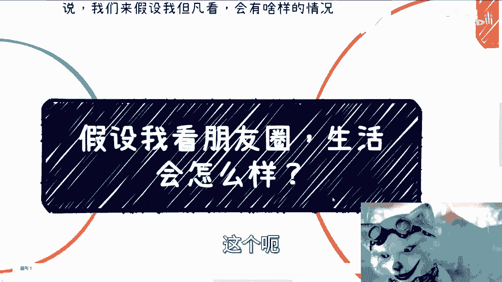
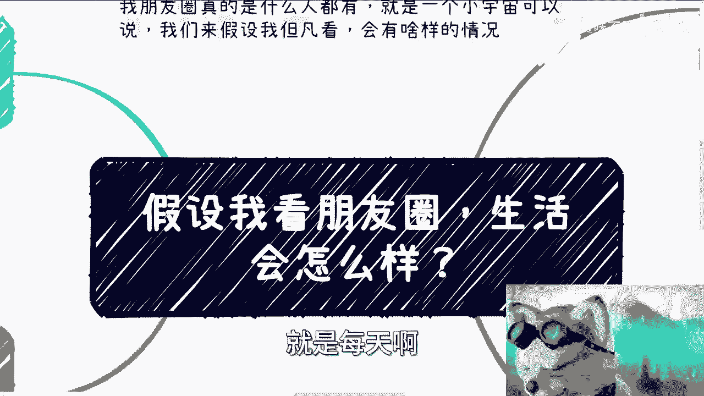
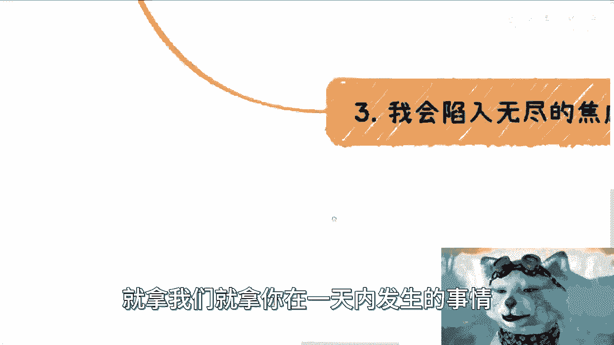
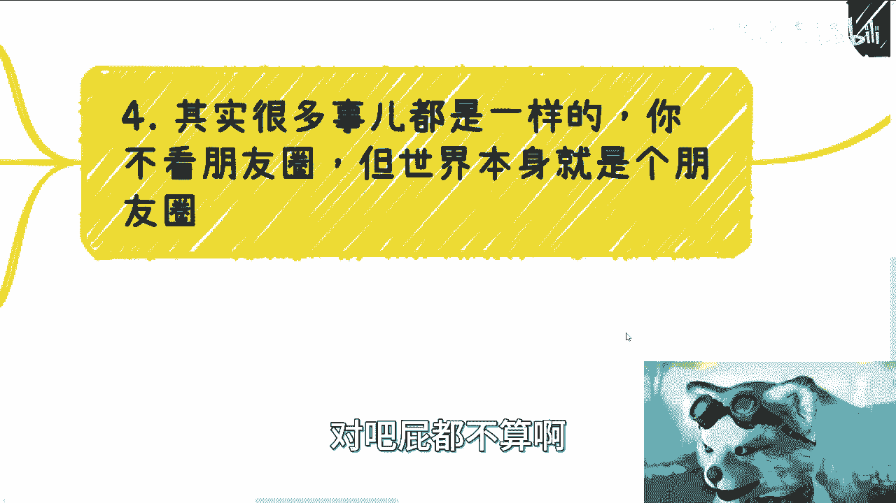
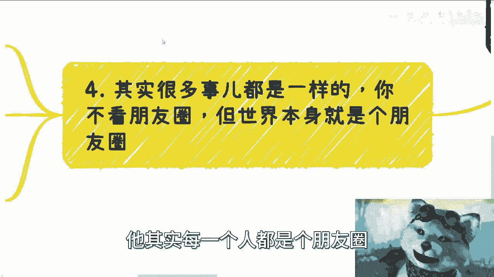
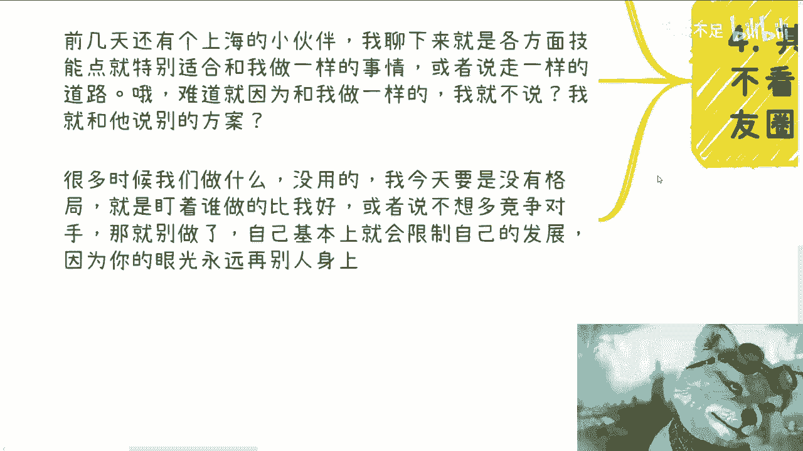

# 假设我看朋友圈，生活会怎么样 - P1 - 赏味不足 - BV1qa4y1o7TZ

哈喽大家好，我是我是卷王是吧，哈哈啊，这个今天来讲一个啊。

先说那个抖音的账号，我看了下那个账号好像已经没了啊，这还是很感谢大家举报的啊，这个啊以后要是再有抄的，回头再举报啊，呃今天我们来讲一个很有趣的话题对吧，就是假设我看朋友圈啊。

我这个生活会怎么样啊，首先呢我先跟你们讲，我朋友圈呢是这个八千七千九百多人吧，还没到8000块了，然后群的话有680几个群，将近700个群，嗯就什么人都有，我可以很明确跟你们讲，就是CX的对吧。

然后下面比如说做微商，做以前直销电销会销的对吧，就这种反正就很多很多，而且呢我我说实话，因为我以前家人呢我基本上也都不备注的，所以说呢我其实就不太分得清楚谁是谁啊，所以说整个的就看看起来。

你会就我那个朋友圈刷起来，你就有种什么感觉呢，就是每天啊每个人都是那种就是啊。

这个每天都感觉在那边要放烟花啊，要庆祝，说哎我成功了对吧，我喜提什么法法拉利保时捷这种感觉啊，就反正各种各样都有啊，那么我们先说啊，我以前呢其实是一直看的，因为我现在不看，我大概在10年前吧。

就20131几年吧，那个时候有我一直看的，而且呢我属于不太评论。

我是属于点赞留的那种啊，首先啊我觉得这个东西呢，其实就跟短视频是一样的，它是一种精神毒药，就是看了呢根本也是停不下来的，而且呢这种东西有种什么感觉，因为我现在回过头去看就有种感觉嘛。

就是你貌似你在吸取知识对吧，你你你在欺骗自己，你在学习对吧，但是其实并没什么卵用啊，那么有很多人也要说了，他说那不是的啊，用嘛还是有点用的对吧，就是说他觉得就是说你还是能获取的信息的啊。

但是呢还是那句话，就是就像我们说的，你说我认识很多人，对不对啊，但凡这些人就我们以前说啊，但凡这些人不能不能跟你一起赚钱，或者不能给你这个帮助你赚到钱，那这种关系没有用啊，对吧，你说我跟他关系很好。

那什么叫关系很好呢，对不对，所以说你看到那些信息，比如说你说我今天看到某个某个某个市，某个区啊，成立了一个什么东西，然后呢他们最近在搞些什么活动啊，或者怎么样子，就是你看似这些东西是有用的。

但你说它最终只要不能变现，最终只要不能为你所用，那有什么用呢对吧，而且我点赞呢，我觉得这个其实就跟以前网络上大家呃，就是叫什么调侃啊，说的是一样的，就是那种就是说正以悦对吧，这种成就感就正以悦啊。

就点点点对吧啊，有种自我满足的感觉啊，然后另外呢就是我想刷那种存在感，其实就是说呃我知道啊，很多人其实跟我一样，就很多人点赞呢，他可能是因为他不太敢跟对方说话，或者也不知道跟对方说什么啊，那就点个赞吧。

我就想到之前那个人发给我表情，我不知道说什么，给你劈个叉吧是吧，那其实差不多啊，然后呃但是本质上呢在我看来啊，呃就是浪费时间，因为嗯怎么说呢，你说你有没有可能有没有可能，比如说看了一年的朋友圈。

有一个东西让你能够变现的，有没有有也许有啊，我相信也许有，但是你不能因为这个有你就得出一个结论，说我看朋友圈很有用，对不对，那其实本专你还在浪费时间啊，那么我曾经说过啊。

你看朋友圈呢其实是在被PUA而发，朋友圈呢则是PUA别人呃，我跟你们说啊，说实话我以前其实不太明白，就是那些微商啊，我是真不明白，那个时候就是我不太明白，说为什么有人他会一直发朋友圈。

而且就自己发一听很多条，而且根本不管别人反感不反感，那后来我就明白了对吧，因为他发不发本身就是一种商业行为，这就是一种PUA或者就是一种变相的洗脑，就是说他就是为了告诉大家，我就是做这个的对吧。

我今天得到了什么成就，我很牛逼啊，我又怎么样怎么样了怎么样了对吧，它其实是一种是一种精神洗脑啊，那么你从商业角度来讲，它就是一种筛选啊，也就是说你不喜欢的删除或者屏蔽就好了对吧。

你喜欢的或者说你没有特别不喜欢的，那么自然而然就会变成被洗脑的这个客户对吧，那么在商业当中，那也很说得通，但是本质上呢你会发现啊，就是我我是这么觉得的，就是你发也好看也好。

你把它当成自己的一个生活记录也好，你把它当成一个商业工具也好啊，不管它你把它当成什么东西，你但凡要有本事不被影响啊，不被洗脑，那我觉得就OK就完全没问题，但是我觉得大部分人做不到。

哎我说实话大部分人做不到，就是你扪心自问一下，你说哦我今天看了对吧，比如说我今天花一个小时看，你能做到你的心情不被影响，或者说你的整个的一个思路情绪不被影响吗，我觉得很难啊，我现在也其实不太做得到。

所以我选择不看啊，那么第三呢就是我觉得但凡你说我现在去看啊，以我现在的这个朋友圈的这个样子啊，这个调性啊，我觉得我会陷入无尽的焦虑，而且很快啊，可能就是都不用24小时，就几个小时就可以陷入无尽的焦虑。

为什么你看啊，首先就是说你为啥我会觉得就是我会觉得，为什么别人如此光鲜亮丽，每天貌似都很有进步，那为啥我一事无成呢，是不是啊，那同时呢我也会在想，那所谓不进则退啊，那为什么大家都能找到自己的路啊。

而我找不到对吧，或者说我觉得大家都在赚钱，那为什么我没有赚呢，对不对啊，那这第二个第三个呢，在同时呢，人呢我觉得都是会有一种，就是看到别人怎么样怎么样怎么样啊，那么他无非就两种，要么就是嫉妒。

要么就是说希望别人能够带自己，哎呀我跟你讲这个很正常呀，也没什么好那个回避的对吧，我以前就这个样子，这很正常嘛对吧，人都这样过来的嘛，就是站在别人肩膀上啊，那么这个时候呢你就会开始内耗，为什么呢。

因为你会在想我要不要去找他聊聊啊，然后我我能不能帮他什么，他能不能他愿不愿意让我帮他啊，他愿不愿意让让我跟着他赚钱，或者他愿不愿意带我赚钱，巴拉巴拉巴拉，你得想半天是吧，然后呢如果你去找他了啊。

然后最终结果是不行啊，这个嗯这个失败了啊，或者怎么样的，那你更累，好对吧，你就在想骂的，我怎么回事对吧，怎么好像好像做错了啊，好像怎么样对吧，因为这种人在你的朋友圈肯定很多很多，我不管你们是谁。

你们朋友圈一定会有这种人对吧，也就是说而且这种人不止一个啊，你到时候就是你会发现哎呀我这个人失败了，我要不要找那个人聊聊啊对吧，那找那个人聊聊呢，你就会发现由于前面那个人的失败。

由于前面的那个人带给你的内耗，你的内心的内耗跟想法会越来越多啊，那么你看啊，就是我不但看了啊，我有一种想法，我还想傍大款对吧，但其实事实上是什么呢，就是我不但傍不上大款，我还在我还会可能不停的自卑啊。

还要不停的自我怀疑，然后其实我跟你讲，你回头会发现就是一天一天时间过得很快，你就像呃微博每一年到年底，比如说12月份大家都在发了对吧，哎20242023马上过了啊，大家这个这个觉得自己做了什么对吧。

或者积累什么，你回过头去回过头去看，发现诶卧槽好像刚刚才1月份嘛，怎么就12月份了，对不对，其实都一样的，就是因为哎因为我们看事情呢，在每一个节点的时候，我们都会把当下这个节点所发生的事情放大啊。

但是呢就是说你但凡放大，其实你已经开始内耗，你已经开始浪费时间，因为你当下这个节点所发生的事情，就拿我们就拿你在一天内发生的事情。

你相比整个2023年这一年，这算点什么事呢，对吧。

屁都不算啊，那么最后一点就是说，其实呢呃我们再扩展一下对吧，就是你很多事儿呢都一样，就是你不看朋友圈，你或者看朋友圈，这其实也无所谓，因为你要修炼的是你个人的一种做事情的方式，和你的一种境界。

因为你看不看无所谓，因为本身这个世界就是个朋友圈对吧，就比如说你看微博，或者你日常跟别人接触，跟你同事接触，跟你职场里面的人接触，这都一样的，他其实每一个人都是朋友圈。

只不过就是说它的形式，不是用微信的朋友圈展现出来的，但没有什么区别啊，本质上我觉得是什么呢，就是你别去想别人做什么，也别去想别人是不是跟自己是竞争，是不是或者做的一样。

或者说别人做得好或者不好的都不重要，你管他呢对吧，因为我我聊下来，我发现大部分人的这个点都是从这个点出发的，你比如说前两天有一个上海的小伙伴来找我，咨询啊，就是我聊下来呢，我就发现诶他各方面的技能点呢。

他就特别特别适合，这跟我以前做一样的事情，就是按我这个道路往下走对吧，那或者说这个按照我以前规划往下走啊，那难道我会因为说哦，因为他要跟我做一样的东西，然后也是做数字经济，我就不说啊，然后我就跟他说。

哎我我我就那个故意的啊，这个跟他讲，你要么做个别的方向，这个方向不适合你对吧，那有用了没有用的，因为你要明白，很多时候我们做这些事情，我们做一些小手脚呃，比如说我们你你你就这么想，我们今天做的小手脚。

我可能把这个人引入了一个歧途啊，好但是问题是我能引入他进歧途，我能引到中国所有的人一进进歧途吗，你能引到所有的潜在的竞争对手进歧途吗，不可能的呀对吧，你今天对他这样，明天就有可能有人对你这样子有什么区。

就没有意义的这件事情对吧，也就是说我今天要是没有这个格局啊，我就是盯着谁做的比我好，或者说就说啊这个去想有没有很多人在竞争，对吧，那你就别做了对吧，你你就像前两天还有个咨询我的小伙伴，也是的，我跟他讲。

你做这个事，他上来就跟我说，他说诶我知道的有有两个号，或者有两个人做的很好的啊，然后呢在当地有种垄断的感觉，我说你一个城市少说几百万甚至上千万人口，哪来的垄断啊对吧，我说你做还没做呢。

你管别人做的怎么样干嘛呢，他做的怎么样，是他的事情，对不对，你管他呢对吧，就是说很多时候的内耗。

是因为你的眼光永远在别人身上，就像我们说的，你看不看朋友圈，我觉得无所谓，而是在于说我们不要去被别人影响啊，你管他干嘛呢，你像我以前我以前同学多了对吧，有人跟我说我出国了，有人跟我说，我三两，真的。

我跟你讲，隔两三年就换套房子，隔两三年换套房子对吧，或者怎么样，就是甚至就是跑过来对吧，就是他我跟你讲很搞笑的，他也不请你吃饭，他也不不就是不给你好处，就跑过来，纯粹的跟你炫耀对吧。

他赚到钱了或者怎么样，那世界上人多了去了，千奇百怪的人多了去了，你你怎么地啊，哦你你每碰到一个人，我内耗一下，我每每碰到一个人，我嫉妒一下，每碰到一个人，我我背后捅他一把小刀，没有用的。

你这样子往后什么时候是个底呀，对不对，所以说呢其实嗯这就回到核心点了，这就回到就是说你看我之前也说，就说我为什么其实不太会跟大家去呃，特别太多的去讲职场上的东西，因为在我的认知范围里面。

职场上的东西没有什么好讲的对吧，因为什么，因为你从一开始就是寄人篱下，你从一开始就是命运在别人手上，你能怎么地呢，你所有能够你所有教给你的技巧，我说实话更多教给你的技巧是什么，就是跪舔，为什么。

因为你没有自尊啊，你抬不起头啊，你你从签劳动合同那一刻开始就是抬不起头的，你们在搞笑吗，这不是在对吧，我倒不是说所有的职场的内容都是割韭菜，这倒不至于，但是就是就是这种让我什么感觉呢。

就是所有的职场的这种内容，更更多的是教大家如何跪得很好，如何跪的让对方能够满意，就这种感觉何必呢，对吧哎呀行吧，那就这么着吧，双休日大家聊点这个这个开心的话题啊，无聊的话题嗯行吧，明天要上班了。

好吧嗯对，然后那个16号上海那个活动，16号16号已经定了，然后大家呃要感兴趣的可以看一下那个动态，或者你们就是直接私信问我，我会把16号的那个介绍发给你们，你们要是来参加吗。

16号大家可以上海这边聚一下好，那就这么着吧啊有什么要咨询的。

