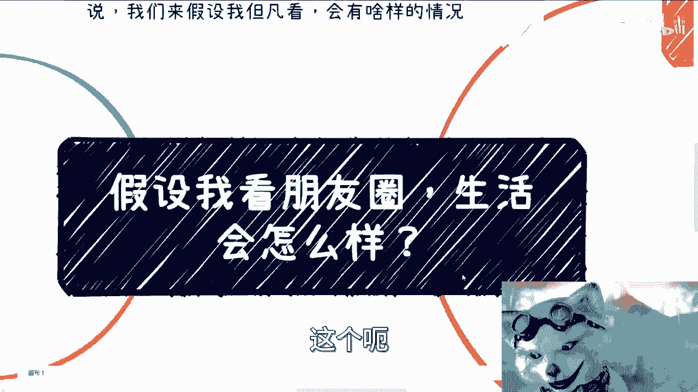
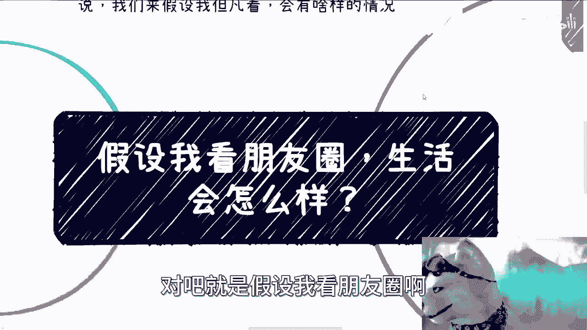
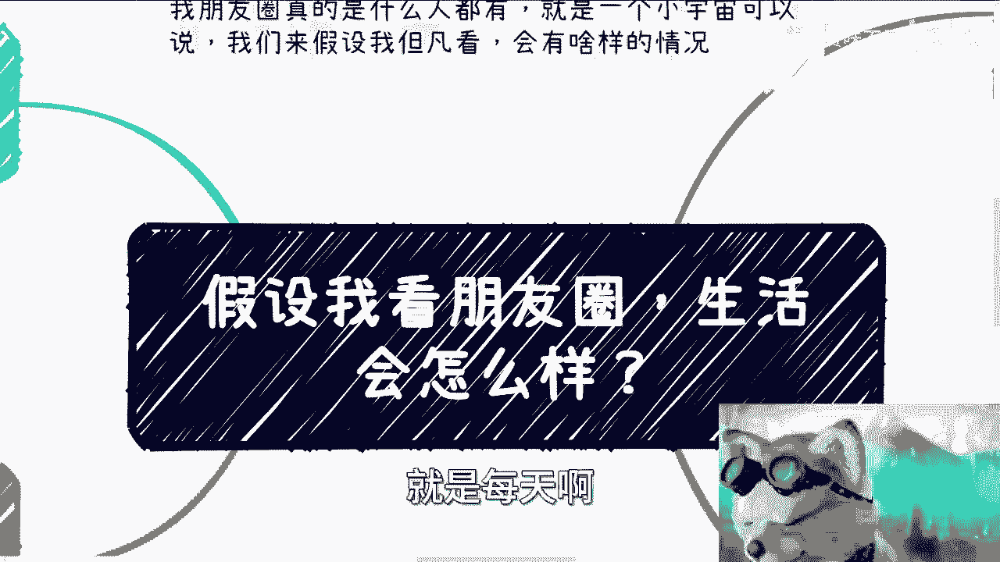
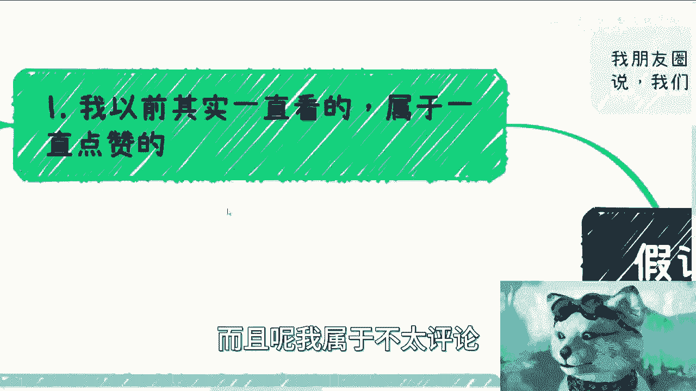
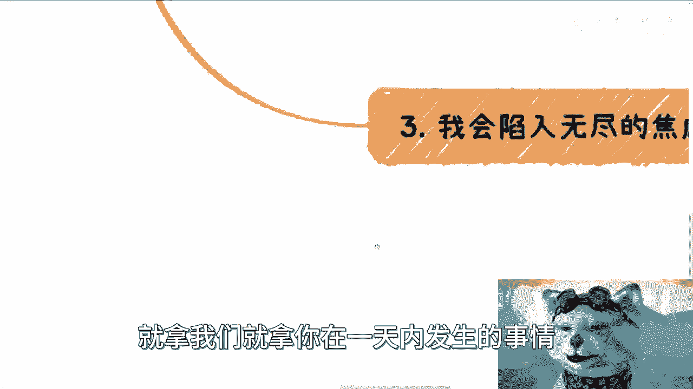
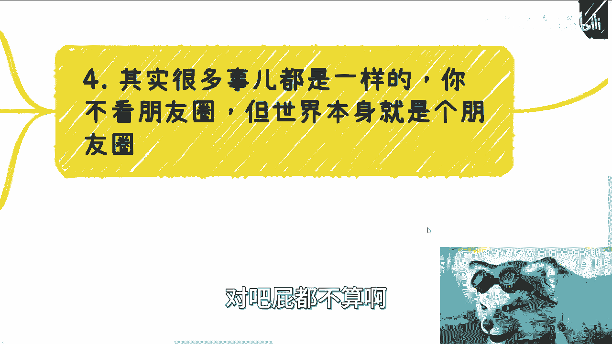
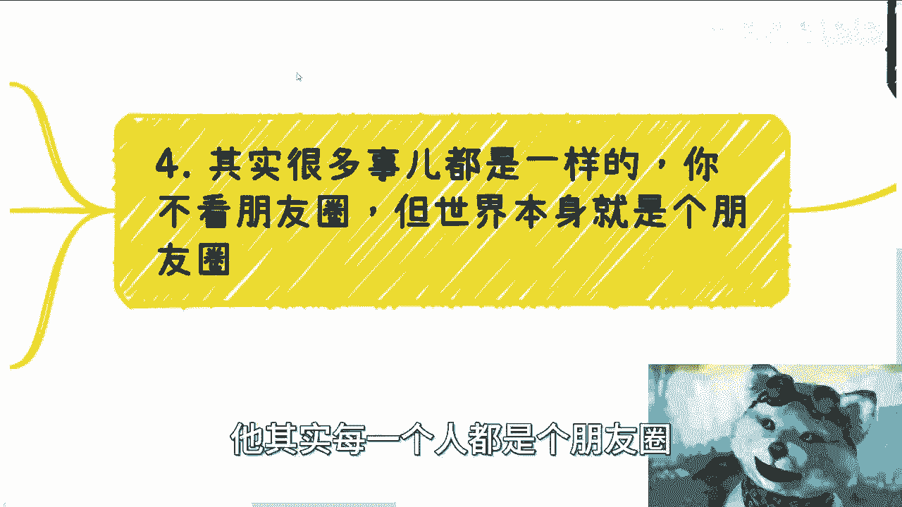
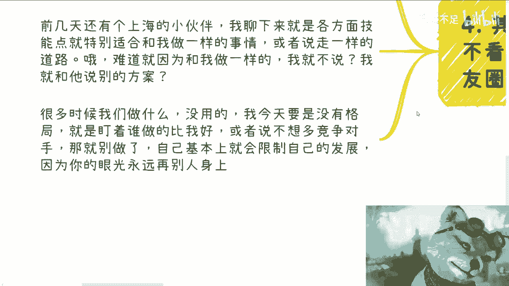
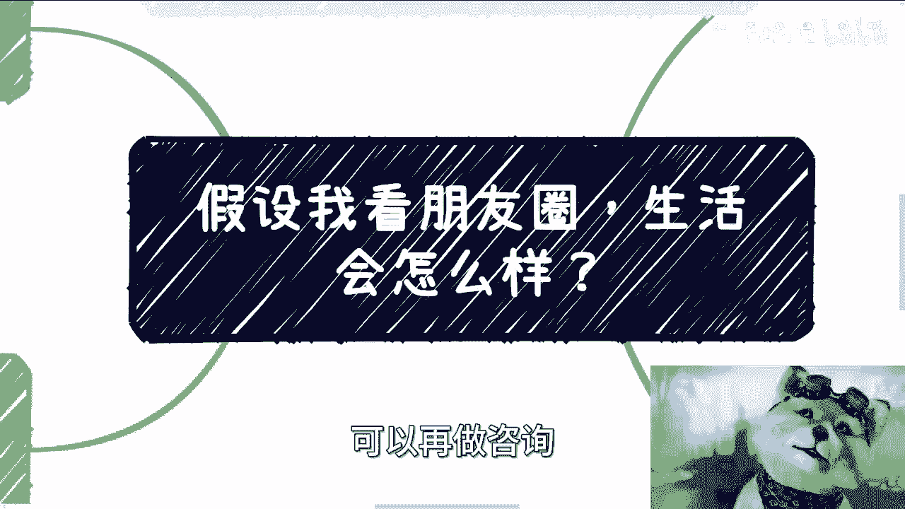

# 假设我看朋友圈-生活会怎么样---P1---赏味不足---BV1qa4y1o7TZ





在本节课中，我们将探讨一个普遍但深刻的问题：频繁浏览朋友圈会对我们的生活产生何种影响？我们将分析其本质、潜在的心理效应，并讨论如何建立更健康的信息消费习惯。

---

## 概述 📋



我的微信好友约有7900人，群聊近700个。朋友圈内容繁杂，包括微商、直销、成功学展示等。许多人每天发布的内容都充满“庆祝成功”、“喜提豪车”的氛围。我曾长期浏览但不常评论，只是点赞。如今我选择不看，并希望分享其中的思考。



---

## 朋友圈的本质：精神毒药 💊

上一节我们概述了朋友圈的普遍状态，本节中我们来看看其核心本质。

我认为，持续刷朋友圈与刷短视频类似，是一种**精神毒药**。它让人难以停下，并制造一种“在汲取知识”的错觉，但实际上多数信息并无实际用处。

**核心公式**可以概括为：
`无效信息摄入时间 = 自我欺骗感 + 零实际产出`

有人认为浏览朋友圈能获取信息。但关键在于，如果信息不能帮助你**赚钱**或创造价值，那么这种“关系”和“信息”就缺乏效用。例如，看到某地举办活动，只要它无法为你所用、无法变现，其价值就微乎其微。

---

## 点赞与存在感：虚幻的自我满足 👍

理解了朋友圈的无效性后，我们进一步分析互动行为背后的心理。

我过去属于“点赞党”。点赞行为能带来一种**正反馈愉悦**和**存在感**。许多人点赞是因为不知如何与对方交流，用点赞代替对话，这类似于“不知回什么，给你劈个叉吧”的表情包心态。

然而，其本质是**浪费时间**。虽然理论上，刷一年朋友圈或许有一两条信息能带来机会，但不能用极小概率事件来证明整个行为的合理性。

---

## 发布与浏览：一场双向的PUA 🔄

分析了浏览者的心理后，我们来看看朋友圈生态中的双方角色。

我曾不理解为何有人日发多条朋友圈且不顾他人反感。后来明白，这本身就是一种**商业行为**和**变相洗脑**，目的是展示成就、塑造专业形象，从而筛选客户。

从商业角度看，这是一种筛选策略：不喜欢的用户会屏蔽或删除，留下的则可能逐渐成为客户。但无论将其作为生活记录还是商业工具，**关键是要有能力不受其影响**。我认为大部分人很难做到心情和思绪完全不被朋友圈内容左右。

---

## 焦虑与内耗：比较带来的漩涡 😰

既然难以不受影响，那么具体会产生哪些负面影响呢？本节我们来剖析其引发的内在消耗。

以我当前朋友圈的调性，如果持续浏览，我会很快陷入**无尽焦虑**。原因如下：

以下是浏览朋友圈可能引发的三种负面循环：



1.  **比较与自我怀疑**：看到他人光鲜亮丽、不断进步，会反问自己为何一事无成，为何找不到出路。
2.  **嫉妒与依附心理**：看到他人成功，会产生两种心态：嫉妒，或希望对方能带领自己。这会导致**内耗**，纠结于是否要联系对方、如何开口、被拒绝怎么办。
3.  **失败累积与自我否定**：如果尝试“傍大款”失败，会加剧自卑和自我怀疑。朋友圈中这类人很多，多次尝试失败会形成巨大的精神内耗。



我们容易放大当下节点的事件。但相比一整年，一天中的纠结**微不足道**。

**核心代码**描述这种状态：
```python
while browsing_friendship_circle:
    anxiety_level += compare_with_others()
    if decision == “try_to_connect” and result == “rejected”:
        self_doubt += 1
    # 时间在纠结中流逝
    time_passed += 1
```



---

## 核心修炼：专注自我，屏蔽噪音 🧘

最后，我们将讨论如何从根本上应对这种信息环境带来的挑战。

问题核心不在于“看”或“不看”朋友圈。整个世界就是一个大“朋友圈”，微博、同事、职场社交在本质上并无不同。

**关键在于，不要总是关注别人在做什么**。不要纠结于他人是否是你的竞争对手、做得好坏。这没有意义。

以下是两个具体的思维误区示例：

*   **害怕竞争**：曾有咨询者适合走与我相似的道路。我不会因为他可能成为“竞争者”就将其引向歧途。这种小动作没有格局，也无法阻挡所有潜在竞争者。
*   **夸大对手**：另一咨询者还没开始做某事，就担心当地已有“垄断”的佼佼者。一个数百万人口的城市，谈何垄断？**他人的情况是他人的事**。



许多内耗源于**眼光永远在别人身上**。就像有同学炫耀成就，若每次接触都嫉妒或内耗，将永无宁日。

这引申到一个更广的视角：我较少讲职场技巧，因为在我看来，许多职场教学本质是教人如何更好地“适应”一种**被动局面**，即从签订劳动合同起，某种程度上就决定了弱势和妥协的地位。这并非批判所有职场内容，但其中一部分确实在教人如何“跪得让人满意”，这值得深思。

---

## 总结 📝

本节课我们一起学习了浏览朋友圈可能带来的影响：

1.  **本质是无效信息消费**，类似精神毒药，制造学习假象。
2.  **互动（如点赞）带来虚幻的满足感**，但实质是浪费时间。
3.  **这是一个发布者与浏览者双向PUA的场域**，商业逻辑是筛选客户。
4.  **极易引发焦虑与内耗**，源于社会比较、嫉妒心理和害怕失败。
5.  **根本解决方案是修炼内心**，将目光从他人收回，专注于自身道路，避免被任何形式的“朋友圈”噪音影响。

真正的自由，在于拥有不被外界浮华与焦虑干扰的定力。管他呢，专注做你自己的事。



---
**附**：16号上海有线下活动，感兴趣可私信获取详情。