# 做C端生意能不能给政企生意做铺垫 - P1 - 赏味不足 - BV162421F7NZ

啊大家好啊，今天这个主题呢是年前吧。

差不多有人好像是评论区问的呃。

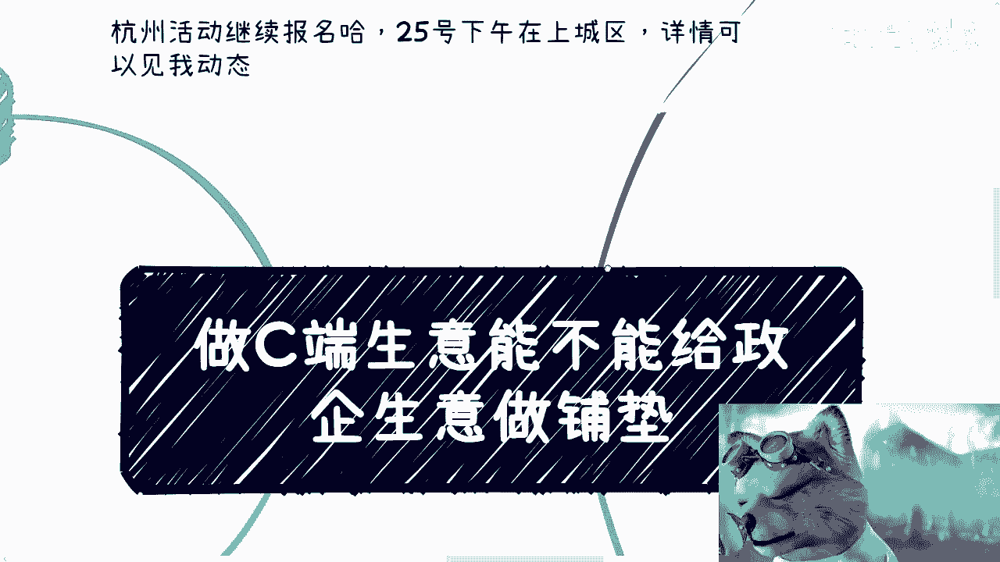

然后那个杭州活动咱们继续报名好吧，25号下午在上城区呃。

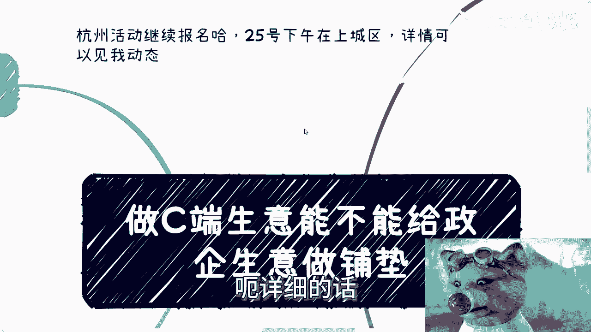

详细的话，反正你们看我动态或者说报名的话，找我私信好吧。

然后这个问题呢讲的是什么呢，讲的是说做C端和做散户的生意啊，能不能给政企生意做铺垫，嗯这个问题呢不是说yes or NO的问题啊。

呃首先第一点C端生意，看你怎么做这个C端生意，我这边列了一下，比如说啊你个人啊单纯做培训，做咨询。

做活动啊，做都是个人做啊，那么这个叫做C端生意之一啊，那么你去做自媒体，或者说依靠一些互联网平台去变现对吧，不管什么平台啊，反正阿猫阿狗平台都可以啊，也是C端生意，那当然还有一种呢我也归在这边。

也就是说你做的呢也许不是C端的生意，就不是散户的生意，但是呢你也没有公司，你还是一个人行为，你也没有签合同，那么这类呢我们也作为一个放在这，因为这块东西不放在这，回头也得讲，我还不如放在这，还有一点呢。

就是你可能跟企业端签的是个人合同，比如这个企业端可能是企业，也可能是那个叫什么协会商会啊，都可能，那么然后呢兼职做了一些C端的生意，比如说电商啊，教育啊，咨询啊，这些都有可能啊，做活动啊。

那么以上我们姑且按照顺序来标记啊。

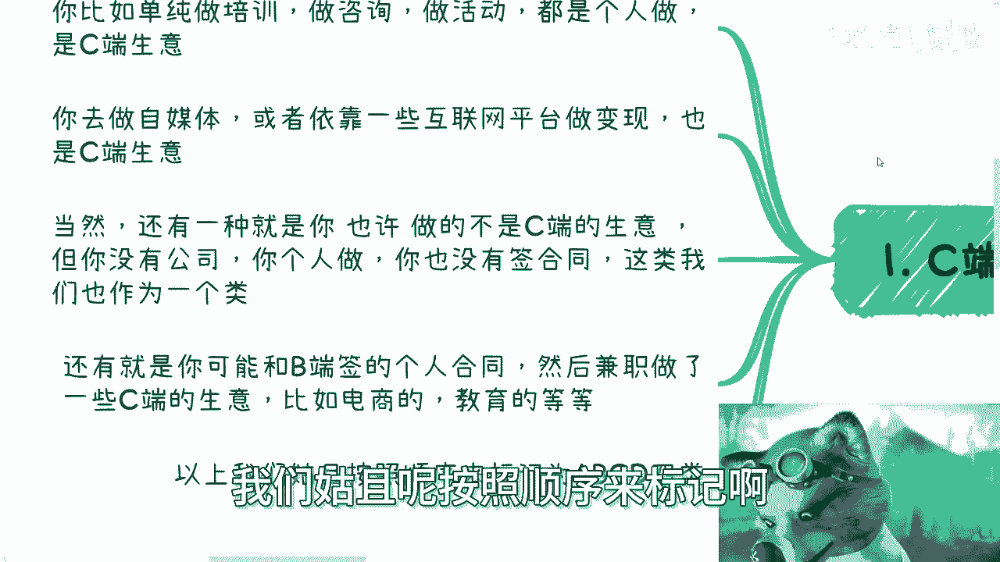

就是四类嘛，ABCD啊，这个我们再来说，那么第二节第二个就是政企合作呢。

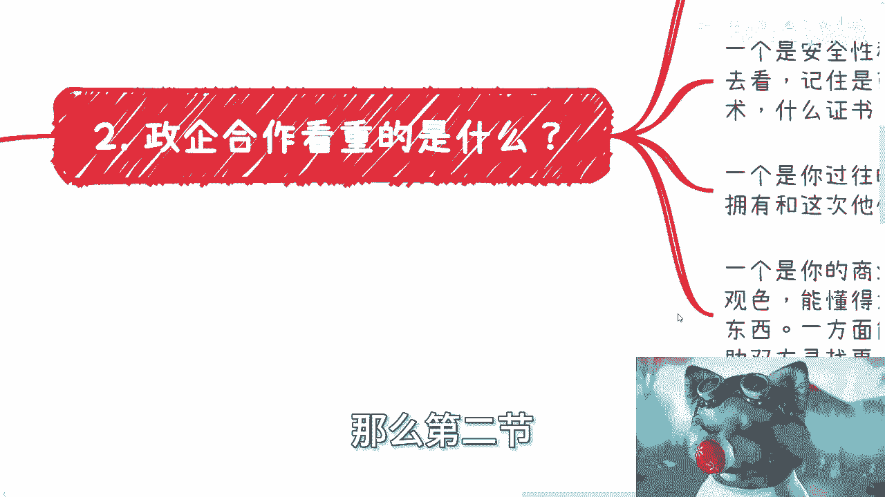

我们看重的是什么。

这里区分一下，那么政企合作呢也分成比较兼职的那种，和那种正规的企业去企业的合作，呃，这两者还是有区别的，虽然这两者都走合同，但是呃在业务上呢可能还是有点区分性的，也就是说你兼职呢到目前来看啊。

大部分情况就是还是以咨询培训为主的，否则的话个人不太会做哦，不太可能就最多是比如说呃活动的嘉宾啊，咨询的嘉宾啊对吧，或者说一些出席的专家啊，这种可能呢，那么企业区企业那种呢，往往还是要那个具体项目。

具体这个项目再来看，但无论是哪一种啊，无论就是说是前者那种还是后者那种。

我们就说啊政企的合作看中三个东西啊。

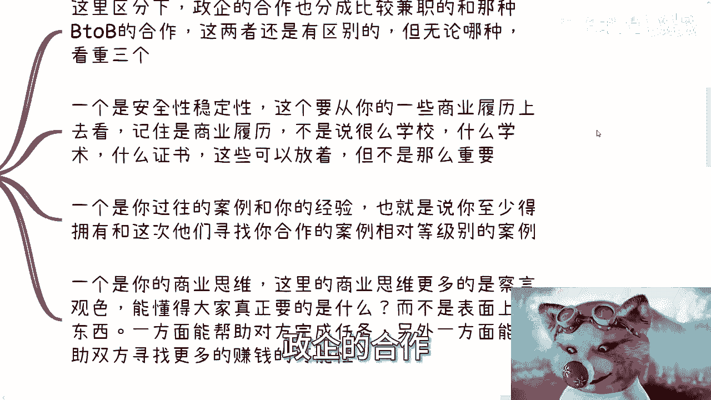

我以前也讲过，第一呢就是安全性和稳定性，这个东西记住啊，这个东西在中国永远是第一位的啊，不管你们去做任何东西，这个东西就是第一位的好安全性稳定性，那么也就是说这个东西怎么看呢。

这个东西它要从你的以前的一些，商业履历上去看，记住是商业履历啊，不是说什么学校，什么学术啊，什么什么证书啊，然后什么你以前几分几分对吧，怎么样怎么样不重要啊，包括你说你海归不海归也不重要啊。

这些东西证明不了你的安全性和稳定性，你明白吗，就是说这些东西你可以写着，但是它不是那么重要，那么安全性稳定性，他以前的一些商业履历更多的是什么呢，就是说你一路以来，比如说你现在25岁或者30岁。

30岁对吧，你一路以来做了哪些事，你的历史会告诉他们，他们自己会有判断性来看你的安全性和稳定性，当然如果有一个可信的人来介绍那个更好啊。

那么这第一第二你的过往的案例跟你的经验，也就是说什么意思呢，就是说这次你要合作的这个政企，你至少让他们在你的过往的案例和经验上面，能够看到，在你的过往的这个案例和经验上。

能够拥有和这次他们寻找你合作的案例，相同等级的案例啊，那么也就是说我们打个比方，比如说听局，你以前，你以前至少得要有一定的这种政府案例啊，或者说相对来讲比较high level一点的正反案例啊。

然后要么就说你做过一些这个国标啊，做过一些政府的一些东西，也就是说本质上这些事情呢还是让他们要明白，或者让告诉他们，就是你是懂得怎么去做这种啊，政企的培训或者政企的服务的啊，或者政企的这个叫什么。

就是说项目的这个这个落地的啊，不要说就说不要说就说因为因为什么，因为我们就说啊合作当中，就像我们今天说啊，比如说我们跟郑起一起来合作卖一个，这么说吧，就是比如说卖个火锅对吧。

他在整个社会上要找到能卖火锅，或者能做火锅的人多如牛毛吧，满地都是做火锅的吧，啊但是为什么他选择你不选择别人，那当然一方面他可能能够认识你，第二方面就是说在众多的人里面，你懂得怎么去跟别人说话。

你懂得怎么察言观色，你懂得在什么样的场合讲什么样的东西啊，以及你懂得讲这些东西，到底通过什么样的一个切入点啊，也就是说政企它表面上很多项目可能是火锅，但是他的目的不在火锅上面，他有他的别的目的。

那你能不能明白他的目的，那么这一系列不仅仅只是靠你的悟性有多高，更多的是靠你以前有做过多少多的案例，你能够明白啊，政企的很多的这种潜台词，那么有很多人要说了，他说那为什么不说明白呢，为什么怎么样呢。

那我只能告诉你，那不好意思啊，社会就是这个样子，你怎么办呢，你不可能拍着桌子指着他们鼻子上说，哎你有有有有话快说，有屁快放，可能吗，对不对，可能吗，没用的呀，啊那么最后一个就是你的商业思维。

那么这里指的商业思维呢，更多的是察言观色，以及我们刚刚说的，懂得大家真正要的是什么，而不是那些表面上的东西，就是你一方面能够帮助对方完成任务，另外一方面能够帮助双方寻找更多，更多的赚钱机会。

或者来说寻找更多的能够满足他们业绩的机会，要的就是这种人啊对吧。

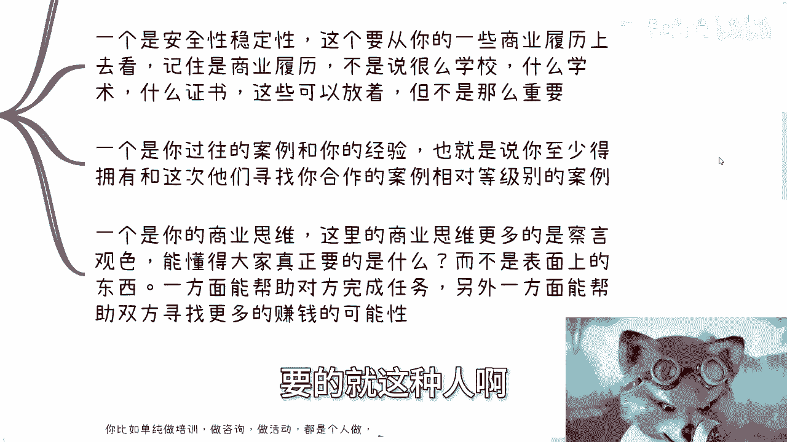

那么我们回过头来看一下，这当中哪些东西是你们学校学到的，没有nothing，哪些是你们实习生学的吗，也没有，哪些是你们工作学习的嘛，也没有，不好意思，都没有，所以这也是我为什么说大部分人。

你但凡就一直做，我不关心你是什么，学历我也不关心你是什么专业，你30多岁，你到时候什么都不会，你告诉我，你出来你要自己再赚点钱，凭什么你抓，对不对，实事求是来讲啊，你说我海归回来啊。

你说我什么学校什么专业啊，就你赚钱了，哎奇了怪了，这哪哪来因果关系啊，第三那么回到我们刚刚说的，这个就是我们刚刚说的ABCD4类对吧，好一个来看，第一类就是A类A类，比如说你单纯做培训。

做咨询，做活动，个人做C端生意，如果主题都匹配。

那么A类的话呢，我觉得是可以做一些企业端的咨询类的生意的，或者服务类的生意的可以做的，政府的话呢如果有熟人介绍也可以啊，但是其他的政企一些正常的，就我们说企业去企业的b to b的啊。

这种合同类的A是不可能的，因为你没有过去的案例，你怎么可能说哦，你没有东西，然后直接去签合同来做。

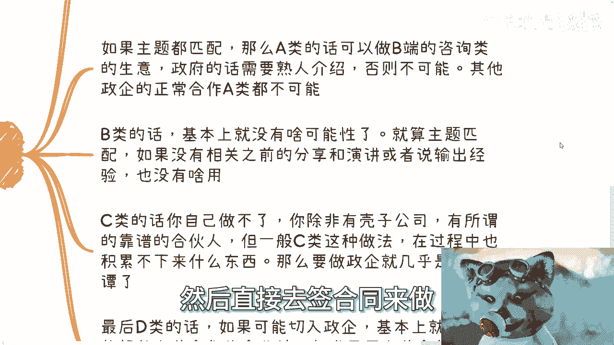

不不现实的啊，那么B类B类就是我们刚刚说的，就是说你做自媒体或者一些互联网平台变现，也是极端生意，B类的话，那基本上没有任何可能性，因为就算主题匹配，如果你之前没有相关的经验，没有相关的案例。

没有相关的一些东西啊，在没有熟人的介绍的情况下面没有用啊，不可能的啊，那么C类是什么，就是我们刚刚说的就是啊你做的不是C端声音，但是你啊呃虽然可能你做的也是企业端的啊，或者政府端的，但是你没有公司。

你也是个人做，你也没有签合同，那么这类难，你看啊，这类的话你自己做不了啊，也就是说这类你可以去对接，但是你单纯自己做做不了，你除非要有壳子公司套壳啊，或者来说有所谓的靠谱的合作方合伙人。

但是呢一般啊我们说C类的这种人做法，在过程当中他积累不下来什么东西。

就是你往往你不要看，就是说你说唉我也是跟企业跟政府在做啊。

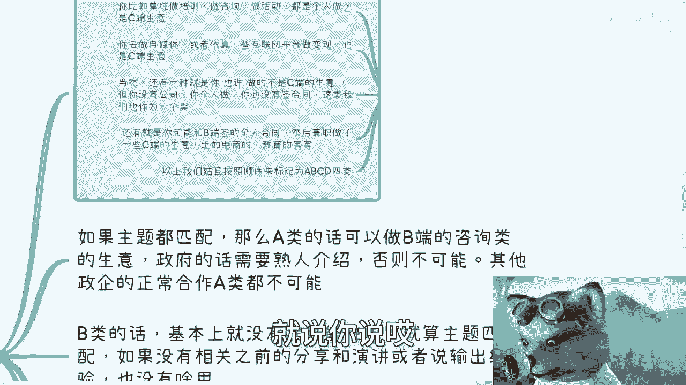

那么你这过程当中做难，往往也都是企业跟政府的工具人，而且这种工具人是纯纯的工具人啊，那么你要做完全自己去做这个政企的这个服务。

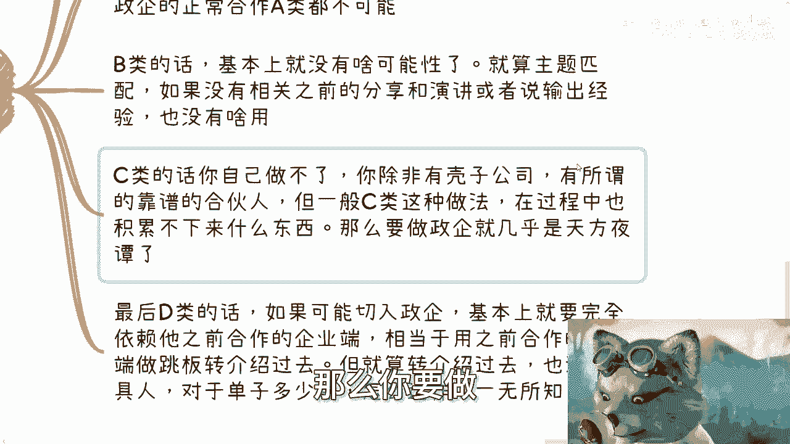

基本上是天方夜谭，也不可能啊。

最后就是地雷D类，就是说你可能跟企业签的是一些个人合同或者，兼职合同。

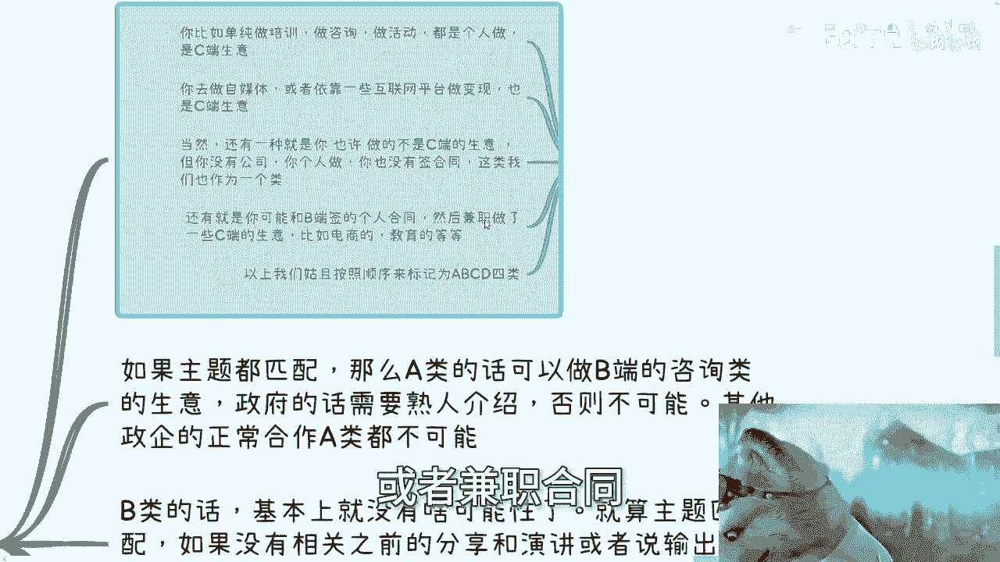

然后做了一些C端的生意啊，或者也做了一些B端生意吧，都可以啊，那么D类的话呢，如果可能去切入政企，基本上就要完全依赖于他之前合作的企业端，也就是说跟这个D类去签，兼职合同的那些企业端。

那么相当于用之前合作的企业端做跳板，转介绍过去啊，但是还是那句话，就算D类转介绍过去，在在整个业务流程跟商业流程上面，也也是纯纯的工具人，也就是说你今天可以做这个单词，但对于这个单子到底怎么来的。

这个单子多少钱，这个单词怎么运作的，一无所知。

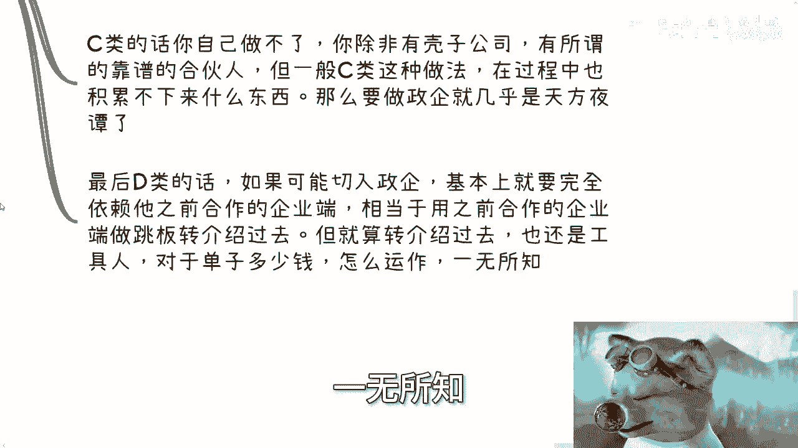

那么第四点也就最后一点，从宏观意义上来讲。

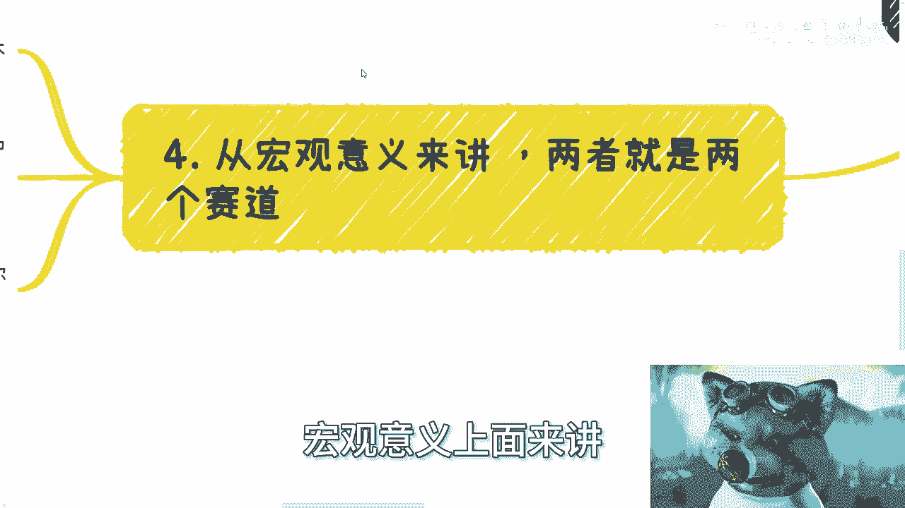

C和政企以及高校，它两者就是两个赛道。

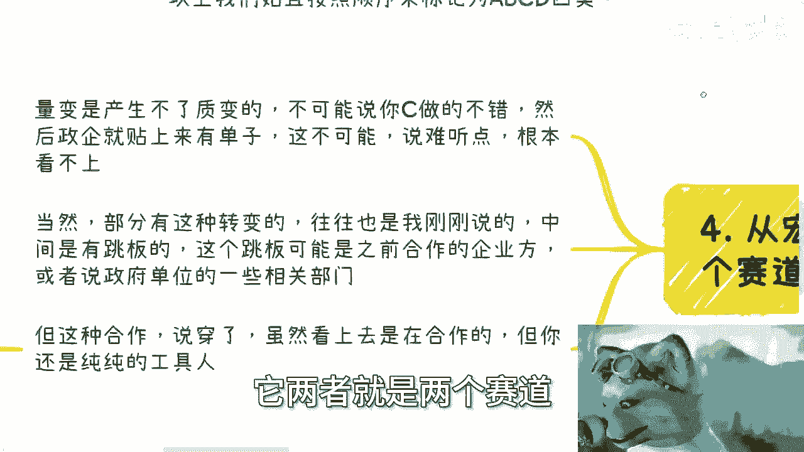

因为你看啊，首先你C端做的再多，量变是产生不了质变的啊，你不可能说你C端做的不错，C端做的很多，然后正起就贴上来说，我来给你单子，我给你钱赚，我靠你不赚，他妈的，我心里不舒服，不可能的，说难听点。

看不上就是看不上他不在一个层面啊，这是第一，第二当然部分你要说有没有这种质变或转变，有的啊，但是往往也是我刚刚说的，就算有，他也是机缘巧合当中有跳板或者有熟人介绍，而这些跳板可能就是之前的合作方。

或者你社交下来的一些一些一些一些合作伙伴，或者或者说政府单位当中的一些部门，但是这种合作就像我们刚刚讲的，你就算有这种合作，说穿了，虽然也许表面看上去是在合作，但你还是纯纯的工具人。

就是说你更多的会像一个USB去即插即拔，你跟政企当中，还有就是我们说的中介也好，中间商也好，可能不止一个中介就层层外包，你只是最后一个执行方，那么你其实也是纯纯工具人对吧。

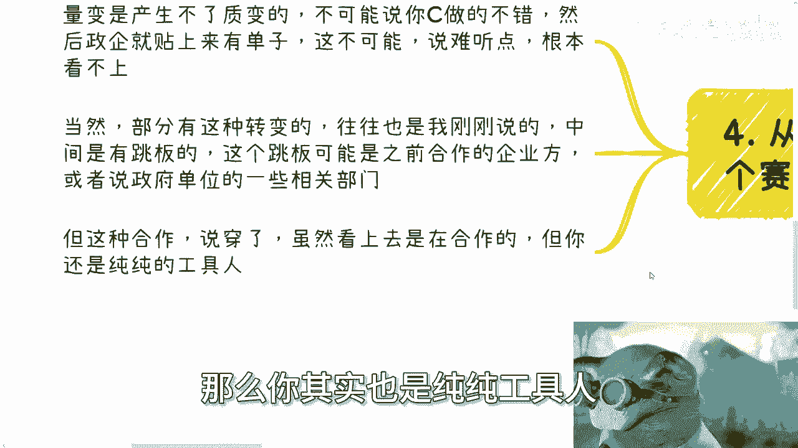

但是当然啊你说你通过工具人去那个起步，有没有问题。

没问题，我也是从工具人起步的，没什么问题，但是你得有意识，你不能说我做工具人能赚到钱好，我一年两年3年四年五年做下去，那OK啊，10年后，那为什么要你呢，诶奇怪嘞，我靠中国14亿人这么多，找不到了吗。

为什么找你呢，一样的呀，你明白吧，就是说我们也许很多时候有有关系，有积累，但是我们一定要想尽办法去点对点的往上爬，这样才能有你自己的护城河，否则的话你说工具人，那虽然你这次做了两个case。

那明年为什么找你呢，明年找别人可以吗，也行啊，你有什么优势呢，没用的，我还是那句话，你们所谓你们脑子里面所有的那些优势。

30岁之后对你们来讲毫无用处，对社会来讲毫无意义。

就这句话，你们去坐着看，你们就知道了啊。

行就这么着吧，然后那个活动报名的。

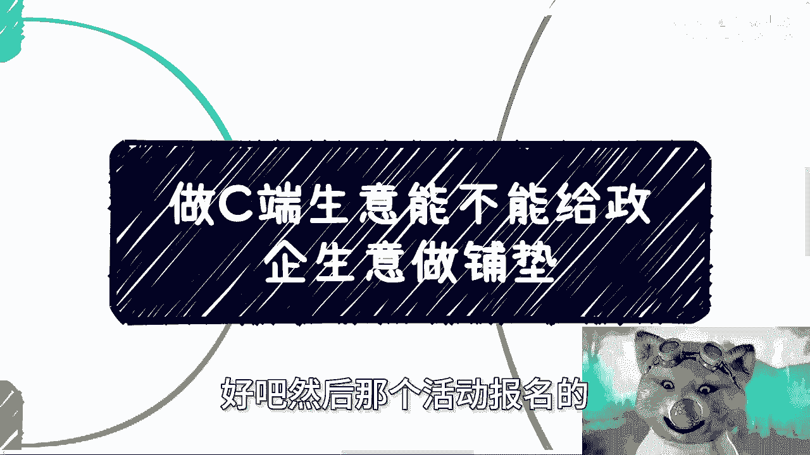

你们私信我呃，然后有其他的，不管是商业上还是职业上对吧，其他的呃整理好问题好吧。

然后我们再走咨询行。

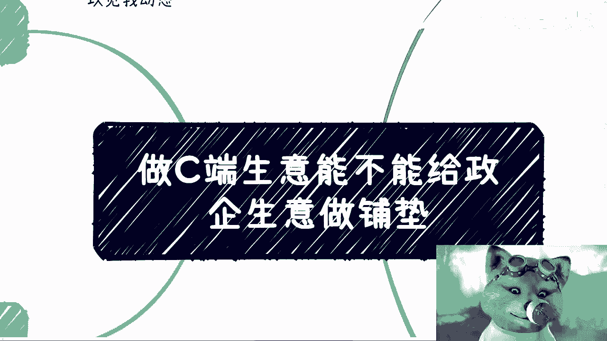