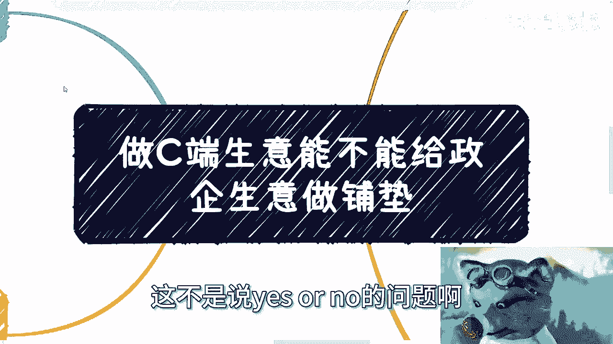

# 课程 P1：C端生意能否为政企合作铺路？🚀

在本节课中，我们将探讨一个常见的商业问题：从事面向个人消费者（C端）的业务，能否为未来与政府或企业（政企）的合作奠定基础。我们将分析不同类型的C端业务，并阐述政企合作的核心考量因素，帮助你理解两者之间的关联与鸿沟。

## 第一节：C端生意的四种类型

首先，我们需要明确“C端生意”的具体形态。根据常见的个人商业模式，我们可以将其归纳为以下四类：

以下是四种主要的C端或个人商业模式：

1.  **A类：个人直接服务C端客户**。例如，个人独立提供培训、咨询、举办活动等。
2.  **B类：通过平台服务C端客户**。例如，通过自媒体、知识付费或其他互联网平台进行变现。
3.  **C类：以个人身份服务B/G端，但无正式合同**。虽然服务对象可能是企业或政府，但以个人身份参与，未签订正式合同，也未成立公司。
4.  **D类：与企业签订个人合同，同时兼营C端业务**。例如，以个人身份与企业签订兼职或项目合同，同时自己也从事电商、教育等C端业务。

明确这四种类型后，我们再来看看政企合作究竟看重什么。

## 第二节：政企合作的核心考量 🔑

上一节我们梳理了C端生意的形态，本节中我们来看看政企合作方的视角。政企合作大致可分为两类：一类是个人以专家、顾问等身份参与的兼职式合作；另一类是正规的企业对企业（B2B）项目合作。无论哪种形式，合作方通常看重以下三个核心要素：

以下是政企合作方评估合作伙伴时的三个关键点：

1.  **安全性与稳定性**。这是在中国市场开展任何合作的首要前提。它并非指学历、证书或海归背景，而是指通过你过往连续的**商业履历**所体现出的可靠轨迹。一段稳定、可追溯的商业历史，或可信赖的第三方引荐，是证明安全性的关键。
2.  **相关的过往案例与经验**。合作方需要在你过去的经历中，找到与当前项目**相同等级或类似性质**的成功案例。这证明你不仅具备专业技能，更懂得在政企合作的语境下如何沟通、执行，并理解项目表面的“火锅”之下真正的“目的”。
3.  **成熟的商业思维**。这指的是**察言观色**、理解各方真实需求（而非表面需求）的能力。优秀的合作者既能帮助对方完成既定任务，又能为双方发掘新的价值增长点或业绩机会。

那么，这些关键能力从何而来呢？它们通常无法从学校课程、实习或普通职场工作中直接获得。这正是许多人到一定阶段后感到迷茫的原因。

## 第三节：四类C端模式与政企合作的关联分析

了解了政企合作的要求后，我们现在可以回头审视，之前提到的四类C端或个人商业模式，各自有多大可能性能为政企合作铺路。

以下是针对A、B、C、D四类模式的具体分析：

*   **A类（个人服务C端）**：如果服务主题与政企需求匹配，**有可能**承接一些企业端的咨询或服务类项目。若有熟人引荐，也可能接触一些政府项目。但几乎不可能直接获得正规的B2B项目合同，因为缺乏企业级的合作案例和实体。
*   **B类（平台变现）**：**基本没有可能**直接转化为政企合作。即使内容主题相关，在没有相关经验、案例和熟人介绍的情况下，平台上的C端成功经历很难被政企客户认可。
*   **C类（个人无合同服务B/G端）**：这类模式本身**难以独立承接**政企项目。从业者往往扮演“纯工具人”的角色，虽然接触了项目，但并未积累下属于自己的可验证的案例、合同或商业关系，无法形成有效的跳板。
*   **D类（个人合同兼营C端）**：切入政企合作**高度依赖**之前签订合同的企业端客户作为跳板进行转介绍。然而，即便如此，在此类合作中，个人通常仍处于“工具人”位置，对项目的整体运作、定价和来源知之甚少。

从以上分析可以看出，简单的模式切换并不容易。接下来，我们从更宏观的层面总结一下。

## 第四节：核心结论与长远视角 🌉

上一节我们分析了四类模式的具体情况，本节我们将得出核心结论。从宏观意义上讲，**C端业务与政企合作本质上是两个不同的赛道**。

核心观点可以总结为以下公式：
**C端业务量变 ≠ 政企合作质变**

原因在于：
1.  **赛道差异**：C端业务的成功积累（量变）很难直接转化为政企领域的信任与机会（质变）。政企客户不会仅仅因为你在C端做得好而主动提供项目。
2.  **跳板有限**：即使存在从C端切入政企的个案，也极度依赖“机缘巧合”下的熟人引荐或中间方跳板。并且，在这种合作中，个人很可能仍处于产业链末端的执行者角色，即“即插即拔的USB工具人”。
3.  **工具人起步的警示**：从“工具人”角色起步并无问题，这甚至是许多人的起点。但必须有清醒的认知：如果长期停留在“工具人”层面，不有意识地去积累**属于自己的案例、商业理解和人脉网络**，构建个人护城河，那么你的可替代性会非常高。年龄增长后，所谓的学历、技能等基础优势在社会评判中的权重会急剧下降。

---

**本节课总结**：
我们一起学习了C端生意的四种类型（A、B、C、D类），剖析了政企合作看重的三大核心要素（安全性、相关案例、商业思维），并逐一分析了各类模式通向政企合作的可能性。最终结论是：两者赛道不同，C端量变难以直接引发政企质变。若想涉足政企领域，需要有意识地通过实际项目积累相关案例、深化商业理解，并努力从“执行工具”向“价值伙伴”的角色演进，才能建立长久的竞争力。