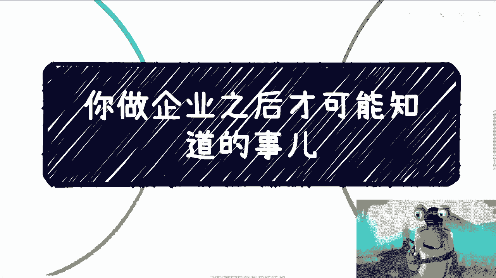
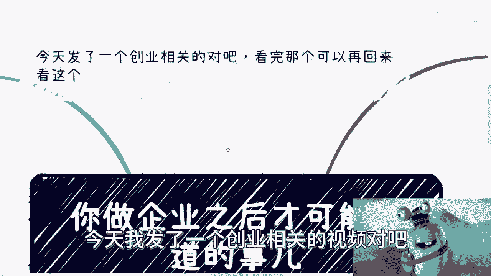
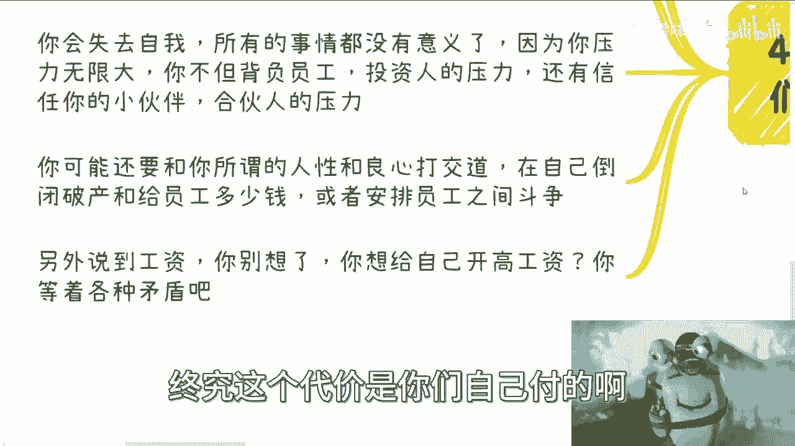

# 做了企业之后会碰见的那些坑 - P1 - 赏味不足 - BV14G411i7cw

好大家好呃，今天我发了一个创业相关的视频对吧。

那个是公开的啊，我在呃大家可以先看那个啊，看完回来再看这个充电的啊，呃很多人呢对吧，大学生啊，这个年轻人啊对企业呢有迷之追求啊。

或者做企业家有迷之追求啊，这就像他们对这种什么大公司啊，大厂有迷之追求啊，我跟很多人说的很清楚，你们随便去啊，你们要是觉得你们的试错时间啊，试错成本不高啊，你们觉得有时间浪费，那你们随便浪啊。

反正最终结果就是什么呢，你们去哪都一样啊，没什么太大区别，你们从喜欢到厌恶啊。

我估计也就一个月到三个月啊，那么首先我们先来说，很多人很憧憬很向往企业家。

向往成功啊，这没毛病啊，呃就如我说的，大部分人呢做事情只管做，为什么做，做了有啥用，怎么做，一概不管啊，一概不知，现在大学生呢听到创业，听到融资非常的兴奋对吧，就觉得特别的想做点事情，想学点东西啊。

这没毛病啊，这就跟我们在市场上面想着说，找找所谓的大佬啊，呃国企央企大厂合作一样，无论你是谁，无论你是什么年龄，说白了我跟你讲啊，但凡你要越有这样的心态啊，这种心态可能不仅仅只是跪舔啊。

更多的是说唉我想抱住大腿对吧，我想我我我想呃借助某些人对吧，我想怎么样，你越是这种心态，越是被人利用，而没有办法的人性就是如此，企业这个事呢很复杂，你真的要做团队，做服务，做杂事呃。

做的要做的杂事很多很多嗯，基本上我觉得大家是都不了解的，但凡你了解呢，但凡你不了解呢，反正都是坑，但凡你了解呢，我觉得你也不会去做啊，那么首先第一个就是关于融资，融资这个东西呢很简单，你融资融的不好。

基本上未来就是赔进去的，很多人根本就不懂，他觉得哎呀我第一轮对吧，找一个朋友啊，有个土老板对吧，怎么样子，我就问嘛，啊你们你们你们有没有为未来考虑过你，第一轮土老板，第一轮融资。

找一个找一个小布拉兹对吧，小小小三子啊，那我就问吧，你后面还想找谁来，你找红山吗，找迎客那个迎客吗，还是找谁呀对吧，还是还是还是说找那些英诺啊，这种天使投资啊对吧，就人家跑过来一看。

你第一轮啊是一个小不拉子，是一个怎么样的，然后跟你关系吧，可能还有点暧昧对吧，这个说不清楚的，那人家资本吗，人家人家跑过来吗，接你盘，对吧啊，你融资融的不好，我跟你讲，看似你在创业。

其实你就是在和投资人打工啊，没什么区别，你换个方式打工，而且你打工呢，你还可以随时辞职，你融资你咋搞你咋搞，你你想跑你还跑不掉，你都要承担法律风险，都是对赌风险，你怎么搞，到时候先来个失信，你怎么弄。

但凡一步走的不对，你就会影响你后面的融资，包括合作方的进入啊，这个我之前视频有说过，你们要是但凡忘记了，你们可以再去看一下，关于融资那个视频，我就不重复讲了啊，你融资融都不好，别人对你的看法是不一样的。

这就跟我说，其实你做业务是全职还是兼职是一个道理，你说必须全职或兼职吗，没有啊，但是你做事情你是在这个人类社会，你是在中国这个国家，你但凡兼职做，我就告诉你，别人就会觉得你不是全职全职在做，对不对，好。

你不是全职在做，就会默认你不靠谱，你有风险很简单啊，谁他妈的跟你合作，你是一个兼职哦，人家是全职，人家卖命跟你玩吗，不可能的呀，对不了你，你一个道理，你融资一个资方很强势。

或者说他的这个初始融资的比例很高，那别人怎么进啊，他一上来给你融个20%好了，怎么进啊，啊你你你你估值，比如说1000万，上来就20%，后面怎么进，对吧就一个道理啊，第三可能无数个事情呢你吃哑巴亏啊。

这个事情也是创业当中最最经常碰到的，我跟你讲啊，真的我要是现场跟你们讲的这种事情，真的就是创过业的才懂啊，你们可能不懂啊，那无所谓啊，你就当笑话听，但是呢未来呢不一定只有创业，你们会碰到这种事情。

很多时候你们都会碰到这种事情，你真的自己遇见了，我跟你讲，你哭都哭不出来啊，比如一些机构组织啊，和你说做业务非常高举高打啊，碍于某些原因我就不方便讲了，碍于某些原因，你也不好意思推辞对吧，好了。

来开始做啊，前期的投入人员软件等各种成本都是你来的，然后呢，他最后跟你说，不做了，怎么办啊，怎么办，你觉得怎么办，对啊，比如一些机构组织啊，可以说做业务，做好业务呢说给你多少钱一个业务啊。

一年比如说200万没问题啊，你做完他也给钱啊，说到做到，但是一个业务成本400万，那我请问你做还是不做对吧，那很多人现在听着他就觉得那他妈的干那对吧，实在不行，他妈的投诉啊，上法院啊是吧，好没问题啊。

你看啊，首先你做了企业，你就身不由己的，我先问你是你说了算的吗，而你的股东呢，你的监视呢，而你的合伙人呢是你说了算的吗，你是这么强势的人吗，而且这事情跟强不强势没关系，更别说大部分人不是那么强势的人。

对吧啊，这第一点第二点，有人说投诉对吧好，我给你举个例子啊，你今天在一个学校啊，你还没毕业，你要去投诉，投诉之前呢，你学校跟你说，你就别想拿毕业证书投吧投吧，我看你怎么投，你敢吗对吧，为不为我不知道啊。

花多少时间为我也不管，我就问你敢不敢，啊你你你你说鱼死网破是吧，可以的可以的，你想想看你是谁，学校是谁啊，更不要说这些机构根本就不是学校，你觉得你能有多大能量，想多了想多了啊，还有一点也是很多人的误区。

就是做企业的工作强度，很多人觉得工作很累啊，这工资不高，我跟你讲，你但凡去做企业，什么996007啊，都他妈是孩子啊，都他妈是baby，你知道吗，首先你可能24小时都在开会啊，你在讨论项目，讨论市场。

讨论怎么做，以及你每时每刻都会沉浸在焦虑当中，并且焦虑的是怎么赚钱，以及你的账户里面还剩下多少钱，因为你每个月都要发工资对吧，你会失去自我，所有的事情都会没有意义，为什么，因为你的压力是无限大的。

而且随着你拿赚不到钱，你每每一天赚不到钱，你不但背负员工的薪水，投资人的压力，还有信任的小伙伴，合伙人的压力啊，那么你可能还要跟和你所谓的人性啊，就我跟你讲的那些有的没的东西对吧。

在我看来根本没有任何他用的这种东西啊，所谓的人性跟良心打交道，在你自己倒闭破产和给员工多少钱，以及如何安抚员工，如何更好的在最后的关键点，关键时刻，在你破产之前能够赚到钱等各方面来平衡，并且智斗争。

包括还有一方面，很多人说到工资，我跟你讲，你就别想了，你给自己开高工资能开多高啊，能开多高，你开的高，首先投资人同不同意啊对吧，其次你合伙人同不同意啊，啊其次没有不通风的，不透风的墙啊。

你员工同不同意啊对吧，啊那很多人要说了，哎呀那那此言差矣是吧，那我看到很多什么区块链公司，AI公司对吧，这老板就是给自己开很高的是吧，是没毛病，首先几点，第一他们承担的风险你承担吗对吧，这第一点第二点。

此一时彼一时，你现在能容还找得到任何企业向滴滴，像饿了么当年融资吗，对不了，一样的，没有可比性的，有意义了，没有意义的呀，你所有的人都要拿幸存者偏差去PUA，自己带你们去PUA对吧，就像我说的。

无论你们怎么去匹配，你们自己，终究这个代价是你们自己付的。

所以我觉得就是脑子要清醒一点啊，不要就是说上头，因为我最近发现所有的人亏钱，所有的人做事情的唯一的原因就是因为他上头，真的你但凡我跟你讲很搞笑的，刚刚有一个小伙伴啊，下周咨询我的。

跟我说他被骗了几万块钱对吧，好真的，我就花了2分钟，我搜了一下啊，那个那个找他的那个主体又有什么，这个直接网络上写的很清楚，有法律风险，有行政行政处罚，我说我在想你，但凡花个23分钟查查。

那也不至于被骗了对吧，那很多时候就是上头没有必要上头，为什么，因为还是那句话，我们对自己要有清醒的认知，我们头上都没长角，任何的馅饼掉下来，砸不到我们头上，就这么简单，哪这么多废话呀，对不对哦。

我给你们画个饼，你们其他人给你们画个饼，你们就吃，哎呀觉得牛逼啊，马上离财富自由更近了一步，没有用的呀，好吧行啊，这个同样的这个东西我就讲到这儿，有很多更多的我也不方便讲，好吧呃然后的话那个上海活动啊。

你们要是要参加的，你们就私信我。

然后你们要是有什么这个咨询的啊，或者有什么就整理好的商业上的问题，或者是未来的规划啊，你们也可以走咨询呃，反正都私信我就可以了，好吧啊行。

