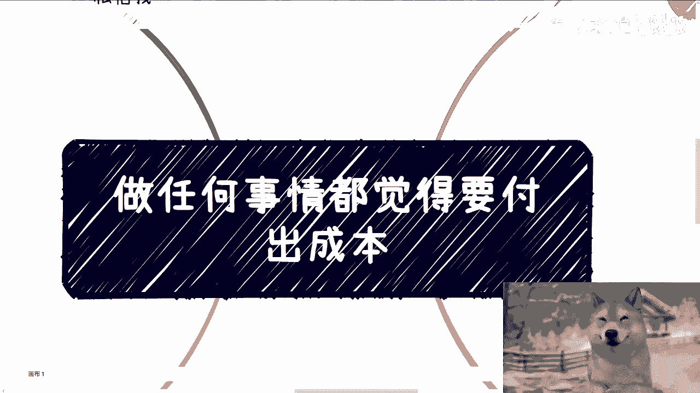
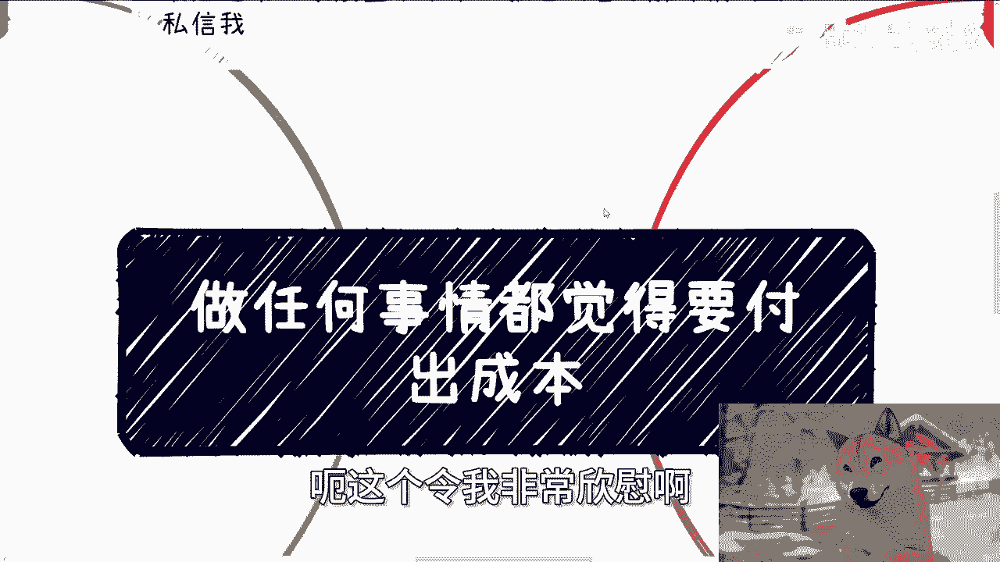
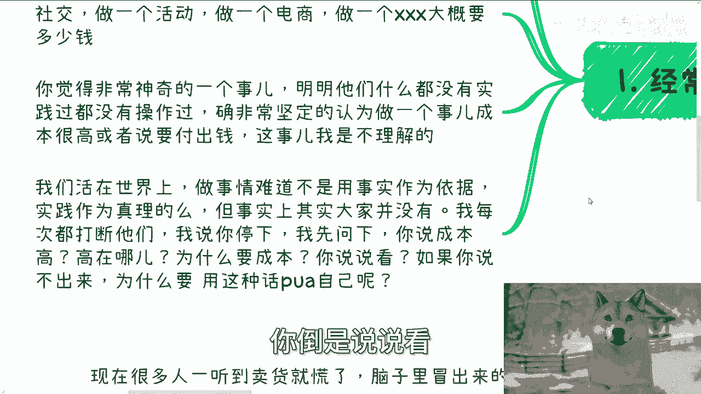
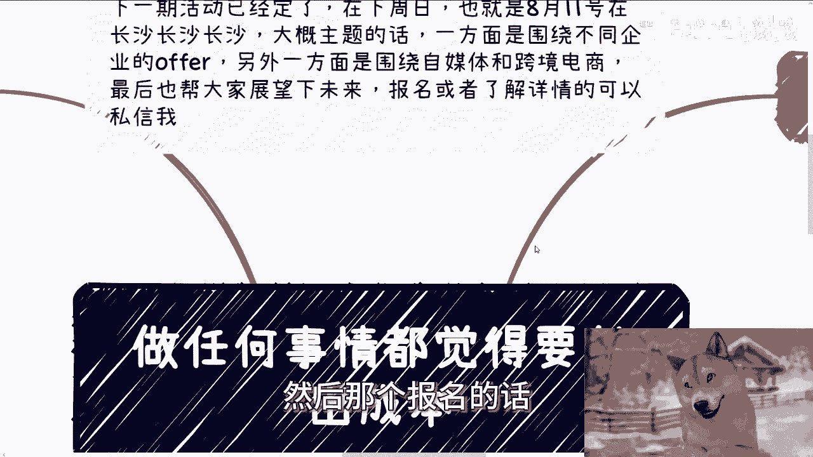

# 做事情觉得先要付出成本只会影响你拔刀的速度 - P1 - 赏味不足 - BV1nm42137XQ

好大家好啊，这个今天我们先来讲第一个主题啊，就是做任何事情呢都觉得要付出成本嗯，首先这个事情呢我跟你们讲啊，说一定要付出成本，那他妈我们为什么一定要付出成本呢。

对不对啊，那这后面这个我会跟你们再再拆开来分析的啊。

首先下一期活动已经定了啊，在下周日啊，8月11号在长沙啊，在长沙大概主题的话呢，一方面是围绕不同的这个企业的offer啊，另外一方面呢就围绕这个自媒体跟跨境电商，那另外一方面呢就是说呃。

帮大家展望一下未来好吧。

然后报名或者了解详情呢，你们可以私信我，额，这个令我非常欣慰啊。

就昨天晚上我不是出了一个那个人事部的，那个网络直播的视频吗，然后行动很快的小伙伴呢，今天就已经找我咨询过了，然后今天已经把整个这个路径啊，把整个过程啊，包括当中有些问题啊，反正也捋清楚了，就立马去干了。

这令我有点开心了啊，有点开心的。

首先啊啊这个经常出现这种题，对话就是我先跟对方聊的时候呢，先是一顿操作猛如虎啊，然后对方就说他说陈老师这事呢，普通人做不了啊，或者就跟我说，他说陈老师这事成本很高，然后呢就是问我。

他说陈老师你觉得做一个培训或者做一个社做，做去做一个社交，做一个活动，做一个电商，或者做一个比如说叉叉叉叉叉对吧，大概要多少钱啊，我跟你们讲啊，这些事情让我就觉得这是一个非常神奇的事情，为什么。

因为明明问过的人，或者说大部分的人其实都是没有实践过的对吧，没有实操过的，但是呢他们却非常坚信，认为这件事情有成本，或者来说成本很高，或者来说要付出些钱，这事我就完全不能理解，就是我们活在世界上做事情。

难道不是用事实作为依据吗，啊难道不是以实践作为真理吗，对吧，但是事实上其实大部分人你说啊到了学校啊，学校毕业也好，包括在这个公司里面工作也好，整个所有跟我讨论的事情，其实你们都是没有经没有实践过的。

但是你们没有实践过，你们反而每次都能脱颖脱口而出，就是说哎我觉得这个东西成本很高，哎我觉得这个东西怎么样怎么样怎么样，然后我每次都得打断他们，我说停，我说我先问一下，你说的成本高是多高。

以及你为什么什么依据让你觉得高，以及高在什么地方，为什么要成本对吧，我说你们不要跟我讲这种屁话，不要讲这种宏观的话，我说咱们就以细节角度来讲，以实践角度来讲，因为我说你跟我聊，你最终还是要落落到实地的。

对不对，好，那我就问他，你就告诉我按照你的理解实操的时候，什么地方成本高，高在什么地方呃，就高呃，哪又能高多少，以及为什么要成本，你倒是说说看对吧。

如果你说不出来，那你为什么要用这种话PUA自己呢，毫无意义啊对吧。

第二就拿我们做一个事情来讲，我们举个例子啊，可能会涉及到找别人合作对吧，或者这么说吧，啊或者这么说吧，就是在整个这个过程当中啊，我们会涉及到跟别人合作，我们会涉及到找别人营销。

我们会涉及到一些物理的场地，就是一些物理空间，可能还会涉及到，比如说邀请嘉宾等等等啊，好那么然后呢很多人就开始YY了，就觉得这个事儿啊不要成本啊，他妈的就是笑话啊，然后就就跟我说啊。

一看陈老师他妈瞎扯淡，对吧啊，我跟你讲啊，每次听到这种回复就把我气笑了，哎我他妈做了多少年啊，我经历过多少的case对吧，我合作过多少合作伙伴哦，他们甚至一次都还没有做过，一次都他妈实践都没有做过。

但很确信要成本，我他妈就笑了，对不对，我跟你们这么讲，这类人永远都会处于，用莫须有的理由来PUA自己，然后阻碍自己往前去走啊，然后还要不停的抱怨说哎普通人没有出路对吧，我跟你们讲啊。

这种人在我看来就就就就真的一句话，活该就活该。

而且更何况啊，他们说这种话，有的一部分可能的确是PUA这个思维的惯性。

有的一部分人可能他妈的就是找借口啊，我都懒得跟他妈的后者去说话，对吧啊，那第三我们来举个例子啊，你找别人合作没问题，什么意思，事情是谈出来的，你作为做事情的主导方，你可以说我们先合作，有了收入之后。

我们再来分润，这有什么问题呢，有什么问题呢对吧，那我就问哪条法律或者哪个行业规定了，一定要先给钱有吗，既然没有，那为什么我要先给钱呢，唉对不对啊，那么再比如说场地能白嫖方式也很多。

我之前在充电视频里面也说过，我就在这里就不再重复了，但是简单来讲大家得明白一点，场地这种东西是一个物理存在的东西，他只要不用，那就是纯浪费，对不对，你们想想看，是不是，比如说我有个50人的会议室。

有个100人的这种活活动场地，我他妈一年四季不用放在那干嘛啊，观观赏，对不对，那么是个正常的人，都知道要拿这种东西来变现啊，啊那么包括尤其是我刚刚说的这种活动场地，企业也好，政府也好。

一定会想办法用起来，否则干嘛积灰啊，对不对啊，然后呢所有人就会很惊奇，他说哎我操这样也能找到合作，我跟你们讲，大哥大姐世界之大，你们大部分人就像我刚刚说的，要么就是学校刚出来，要么就是一直在工作上面。

你们甚至没有一丝跟社会接触过，有啥可惊讶的呢，你们不要搞得，你们好像跟整个整个社会很接轨一样，你们没有接过轨啊，对不对，另外就如我说的哪条法律或者哪个领导人说过，合作一定要付钱的有吗，既然没有。

那为什么我们默认去合作就得付钱呢，我还是不明白呀，啊然后有的人呢还会很在意别人的眼光啊，就跟我说，哎，那陈老师，那我这样跟场地去谈或者跟合作方去谈啊，别人会不会呃弄搞得别人不开心。

或者说会会不会搞坏自己口碑，我跟你这么说啊，如果你们想赚钱，你们但凡跟所有赚过钱的人去沟通过，你们就会明白所有赚钱的人，他的眼中只有怎么赚钱，你明白吗，也就是说你所谓的什么，会不会把对方弄搞得不开心啊。

说会不会搞坏大家关系啊，会不会搞坏自己的口碑啊，我跟你讲啊，但凡在乎这种事情的，你别去赚钱，为什么，因为你就算去做了，你也赚不到钱，因为你会发现，你的关注点根本就不在赚钱上面哦，我们关系破裂了，怎么了。

跟你赚钱有什么关系哦，对把对方搞得不开心了，怎么了呢，跟赚钱有什么关系呢，把你口碑搞坏了，怎么来呢，跟你赚钱有什么关系呢，对不对，有什么关系吗，没有任何直接关系，啊那么第四啊。

再来说说卖货这个东西也是的啊，现在很多人一听到做电商啊，那马上脑子里冒出来是什么，毛利低，前期投入成本极高啊，都这样子，我聊下来，很多人都这么跟我讲，我跟你们讲，还是那句话，大家要的是什么。

是先有自己的业务，先有自己的雪球，先有自己的合作伙伴，先有自己的0~1，对不对，我就这么说啊，你们也许是做那个，那或者说在电商里面去工作的，你们也有的可能是在电商公司里面打工的。

但是你们自己没有属于你们自己的电商业务，或者说你们自己没有电商业务，给你们自己来变现对吧，那么既然没有，那么我们就先0~1，你不要去想那些有的没的，咱不是一下子要做几百万，几千万的流水，对不对。

明明自己只要做到十分，但是你却用100分的要求跟难度去怎么说呢，去吓唬自己或者去恐吓自己，没有意义的呀对吧，你很多人想试试看，做电商没问题啊，就当下这种情况，我告诉你，投流本身是没有意义的，太卷了。

如果你真的要做，我们从0~1角度来讲，我们要寻找的就是合适的货源，当然这个货源靠不靠谱，你本身合作就明白了，包括比如说哎这个品类能不能很好的出去啊，对吧，包括打包啊，物流啊对吧，各个方面如果不靠谱。

那最多我们给客户退款嘛，怎么了呢对吧，你包括至于营销，你可以去找自媒体的人合作，你也可以找那些小V对吧，什么5000粉，1万粉的，甚至几千粉的，小几千粉的人去合作，你也可以找社区资社群资源的人合作。

你也可以找MCN合作，说白了方式很多，你都可以跟他们说，我们来分那个分润对吧，就说你能你有成交了，我给你返利，而不是说一上来就投流啊。

或者说什么找什么专业的人，你知道吗，就前两天啊有个那个咨询小伙伴，我跟他聊的时候，就聊到这个事情，他就跟我说什么，他说哎陈老师，那这个事情我要不要找一些更专业的人啊来做，然后呢就说做起来效率比我更高。

我就直接问他，我说第一你说专业的人怎么判断他比你专业，总不能他吹出来，比你专业就专业吧，总不能说你没有做过这行业，他做过这行业，他就比你专业吧，这当中没有因果关系的对吧，而另外一方面。

你说效率比你高对吧好，那效率能高多少，你给我一些数据有吗，能量化吗，没有数据没有量化，你跟我说的不就是屁话吗，对不对啊，我说你们读书读了半天啊，这个大学读出来就是就就这样思考问题的对吧，你你不要用。

就是就是你你你想想看啊，就是所有只要不从细节角度来讲什么，哎我找个专业的人来做什么，效率能够比我更高，这不都是屁话，都是宏观的话有用吗，没有用对吧，所以说就是说而且另外一方面我也跟他讲了。

我说你现在没有任何的经验，你也没做过任何东西，你要的是先把整个流程趟一遍，就整个流程走一遍啊，而不是说一上来就在那边说，哎我要找个专业人，要要什么专业人啊，你要效率多高啊，啊你效率能有多低呀，对不对。

我说你我我我跟他说，我说我说不好听点，读书都浪费这么多年了，你还差这几个月嘛，对不对哦，你现在急也不差这点时间啊，啊所以说就是我想跟你们讲的核心观点是什么，就是只要不是你们要明白，社会上做事情。

做事情都是灵活的，只要不是法律规定定死了，说这个东西怎么样怎么样怎么样啊，否则的话你不要给自己去下套，你知道吗，哦不要任何的事情上来就说哎我觉得要付钱，谁他妈跟你说要付钱啊，对不对，那规则都是大家定的。

你定个规则，我定一个规则，我们寻找的无非就是能够愿意跟我们合作的人，那不愿意遵守这合作，那不愿意遵守这个规则的，我们就不合作嘛，怎么了呢，哎奇了怪了，啊行那就这么着吧啊。

然后那个这个下一期活动好吧，在8月11号啊下午，然后那个报名的话或者了解了解详情去私信我。

那另外一方面就是说你们自己在那个职业上面，或者你们自己跟别人合作一些副业啊，或者别的一些业务，在这在这当中呢可能会有一些比如说合同啊，分润分红啊，分润啊，股权啊，股份啊，商业计划书啊，白皮书啊对吧。

包括一些这个这个这个商业规范啊，或者说商业计划啊，职业计划上面，你们希望通过跟我的沟通，能够给你们一些更接地气，或者说能够让你们少走些弯路，的这么一些建议和规划的话，那么你们整理好对应的问题跟个人背景。

我们再来走咨询好吧。

