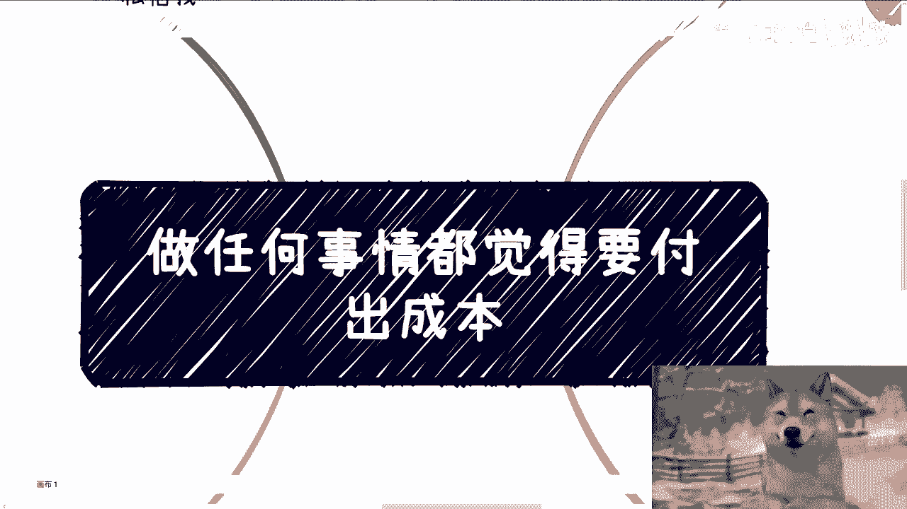

# 课程一：破除“成本先行”思维 🚀

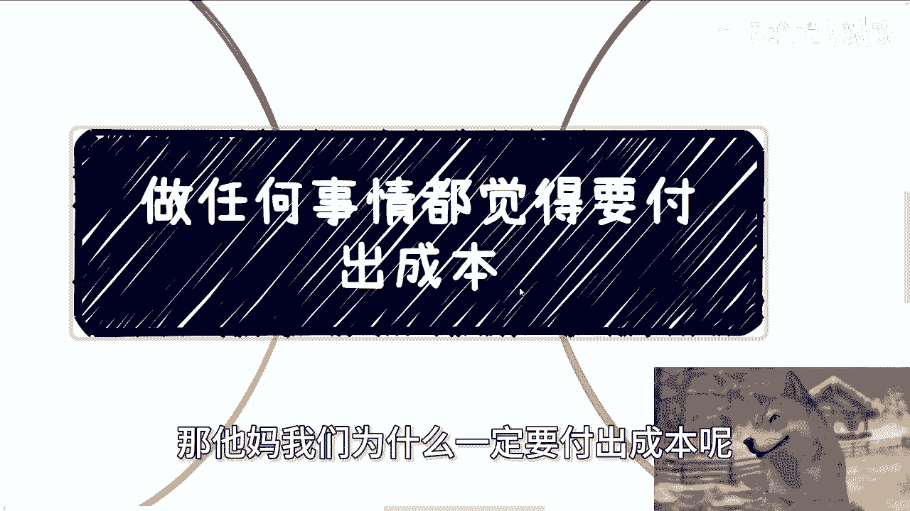

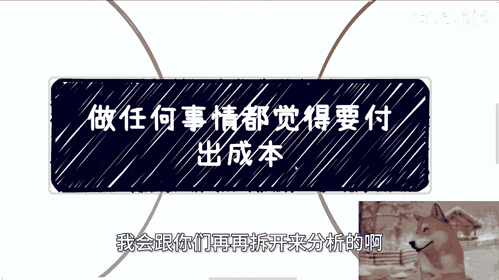

在本节课中，我们将探讨一个阻碍许多人行动的核心思维误区：认为做任何事情都必须先付出成本。我们将分析这种想法的来源，并通过具体案例展示如何绕过它，以更灵活、更高效的方式启动项目。

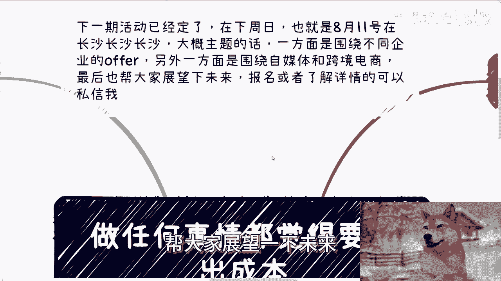

---

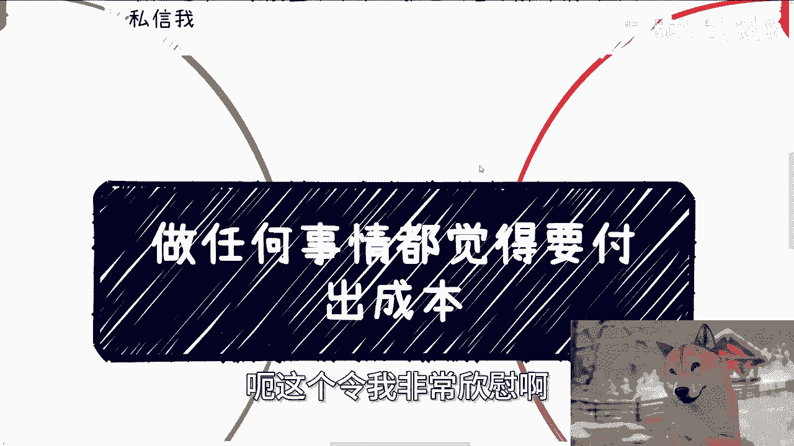

## 概述：为何“成本先行”是伪命题

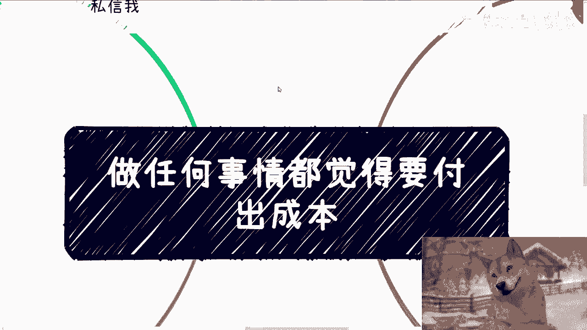

许多人尚未开始实践，就坚信做某件事“成本很高”或“需要先投入”。这种想法缺乏事实依据，却成为自我设限、阻碍行动的主要原因。本节将剖析这一现象，并引导你建立以实践和事实为依据的思考方式。

---

## 一、 问题根源：未经实践的臆断

上一节我们概述了“成本先行”思维的普遍性，本节中我们来看看这种思维的具体表现和问题所在。

在与许多人交流时，常出现以下对话模式：对方在了解一个项目想法后，会立刻断言“这事普通人做不了”或“这事成本很高”，并询问需要投入多少资金。

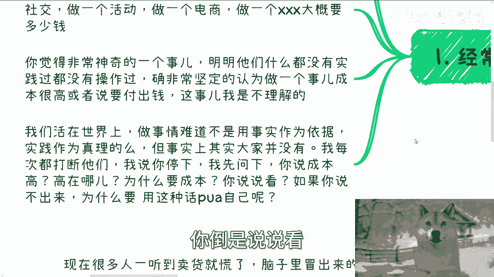

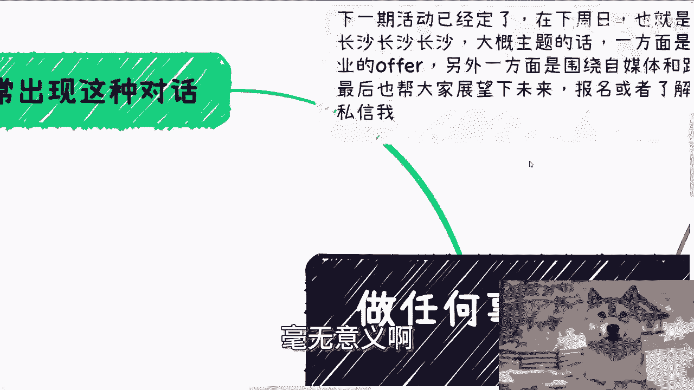

一个关键矛盾在于：**提问者大多没有相关实践经验**，却非常确信此事需要高成本。判断应以事实和实践为依据，而非未经证实的臆测。当被问及“成本高在何处”及依据时，他们往往无法给出具体、量化的回答。

这种用宏观、模糊的“高成本”来预设困难的行为，实质上是**用莫须有的理由进行自我设限**，最终导致抱怨没有出路，却从未真正开始。

---

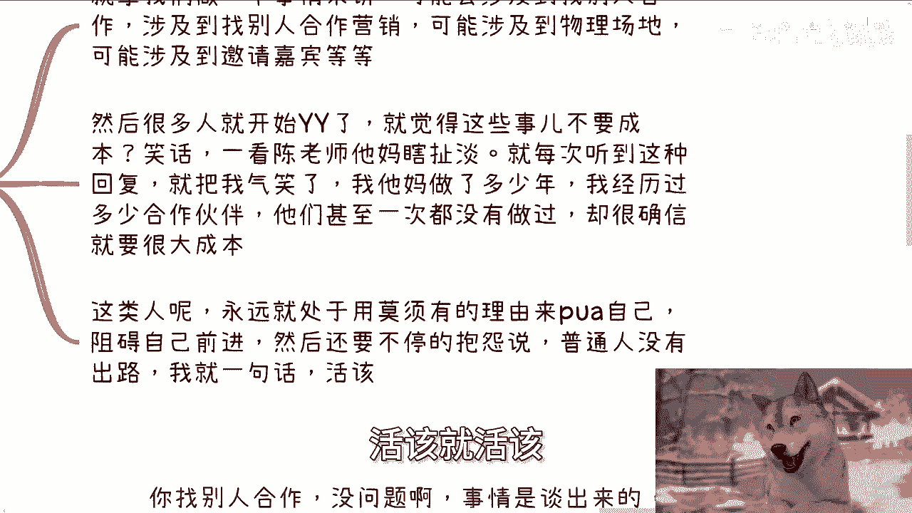

## 二、 合作与资源：规则由你定义

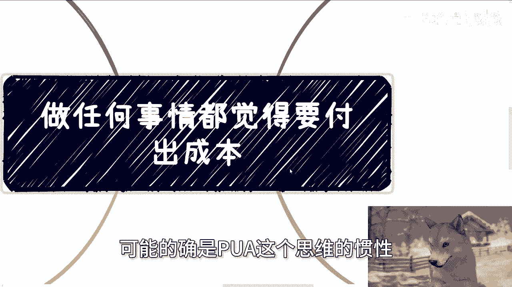

认识到问题后，我们来看看在实际操作中，如何打破“必须付费”的僵化思维。许多事情涉及合作与资源整合，以下是几种常见情况的灵活处理方式：

**1. 关于合作付费**
*   **核心思路**：合作模式是谈出来的，并非默认必须预付。
*   **可行方案**：作为主导方，可以提议采用“**收入后分润**”的模式，即 `合作收益 = 总收入 × 分润比例`。没有法律规定合作必须先付钱。

**2. 关于场地使用**
*   **核心思路**：闲置的物理场地对拥有者而言是浪费，存在免费或低成本使用的机会。
*   **可行方案**：主动寻找企业、政府或机构的闲置会议室、活动场地，提出双赢的合作方案。对于场地方，`场地利用率 = 使用时间 / 总时间`，提高利用率即是变现。

**3. 关于他人眼光**
*   **核心思路**：过度关注“对方是否开心”、“口碑是否受损”会分散对核心目标（做成事、赚到钱）的注意力。
*   **心态调整**：成功者的焦点在于“如何达成目标”，关系维护是手段而非目的。两者没有直接因果关系。

---

## 三、 电商案例：从零到一的实战路径

让我们将上述思维应用到一个具体领域——电商。很多人认为做电商毛利低、前期投入极高。本节我们来看看如何从零启动一个电商项目。

对于从零到一的阶段，目标不是立即创造巨额流水，而是**先跑通最小业务闭环**。关键在于寻找合作伙伴，而非前期重投入。

以下是启动电商的可行步骤：

1.  **寻找货源**：直接与供应商沟通，测试合作。如果产品有问题，最坏情况是 `向客户退款`。关键在于验证供应链。
2.  **灵活营销**：避开初期付费投流（`广告投入 = 资金消耗`）。转而寻找以下合作伙伴，并采用分润模式：
    *   自媒体博主/小V（粉丝量几千至数万）
    *   社群主理人
    *   MCN机构
    *   合作模式可设定为 `博主收益 = 成交额 × 佣金率`。
3.  **拒绝空想**：不要一开始就纠结于“找更专业的人提升效率”。在零经验时，首要任务是亲自走通全流程，获取一手认知。所谓的“专业”和“效率”在没有量化数据 (`效率提升值 = ?`) 前都是空谈。

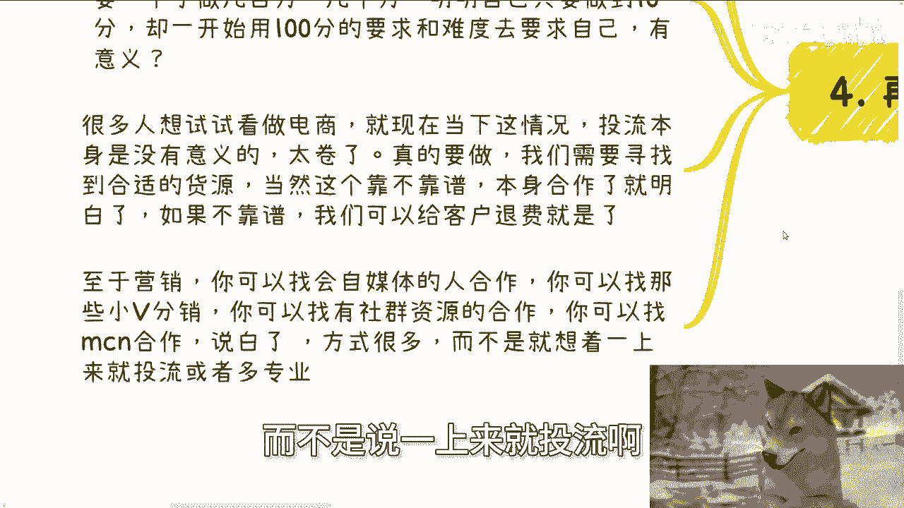

---

## 四、 核心原则与总结

通过以上分析，我们可以总结出应对“成本先行”思维的核心原则。

社会中的做事规则是灵活的。只要不是法律强制规定，就不应自我设限。**规则是双方共同商定的**。你的任务是提出自己的合作规则，并找到认同该规则的伙伴。无法达成一致则不合作，这很正常。

**本节课中我们一起学习了：**
1.  “成本先行”思维是一种缺乏实践依据的自我设限。
2.  在合作、资源利用上，可以主动定义规则，如“收入后分润”，打破预付僵局。
3.  启动项目（如电商）应聚焦于从零到一，通过分润模式整合资源，而非前期重投入。
4.  行动的核心理念是：**以实践验证想法，用灵活规则寻找合作，而非被臆想的成本吓退**。

---

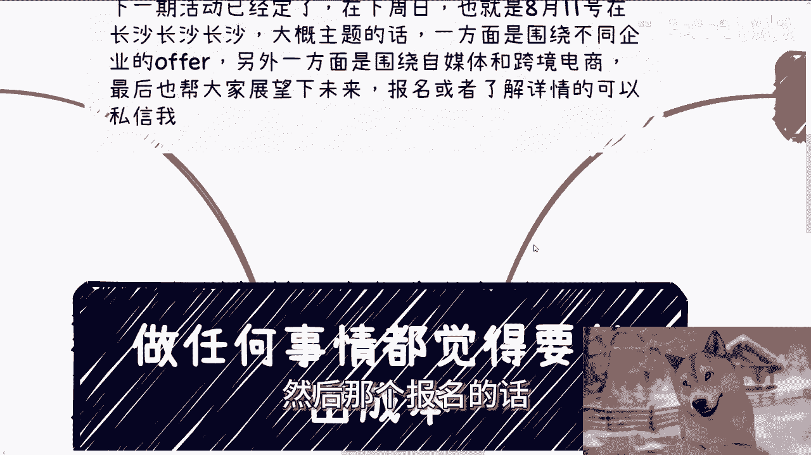

## 课程预告与咨询服务

下一期线下活动已定于8月11日（周日）在长沙举行，主题涵盖企业offer、自媒体与跨境电商，以及对未来的展望。报名或了解详情请私信。

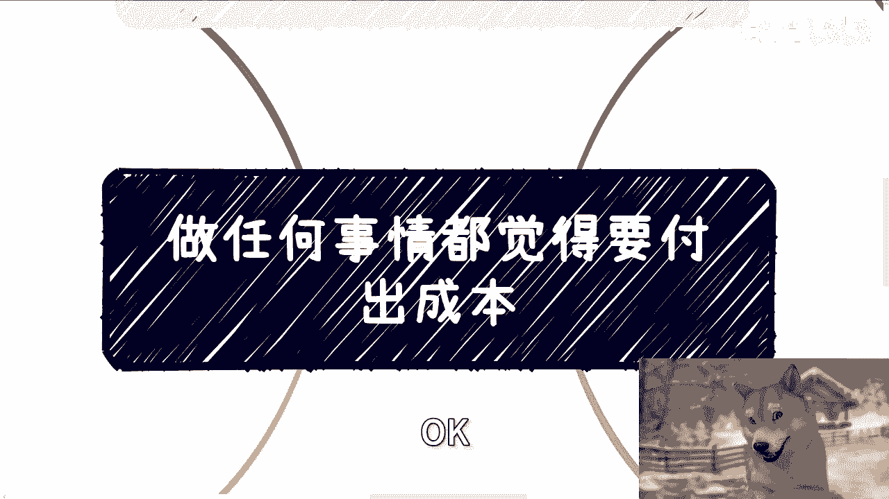

若你在职业发展、副业合作中遇到合同、分润、股权、商业计划书等具体问题，并希望获得接地气的建议，请整理好你的个人背景与具体问题，通过咨询进行深入沟通。