# 商业思维课 P1：商业合作如同拼图 🧩

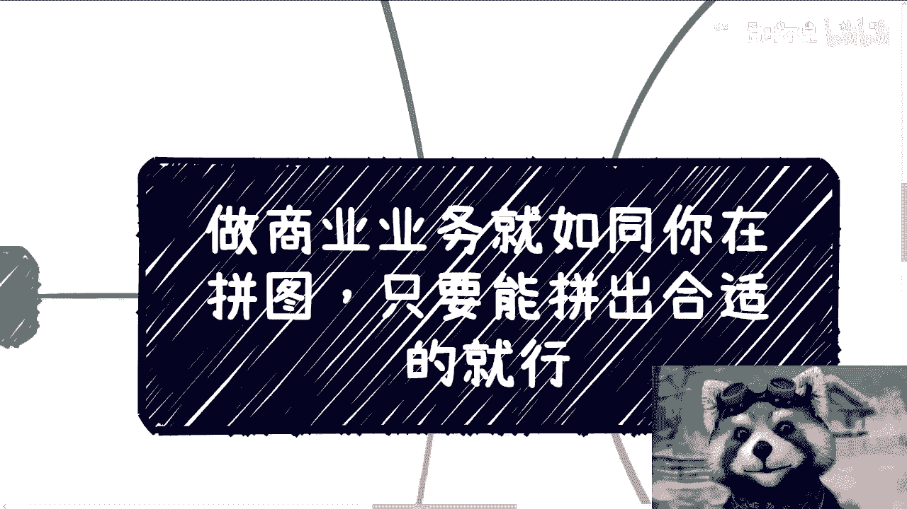

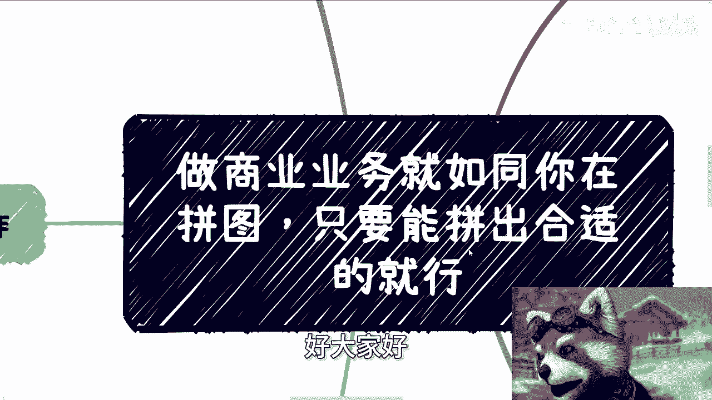

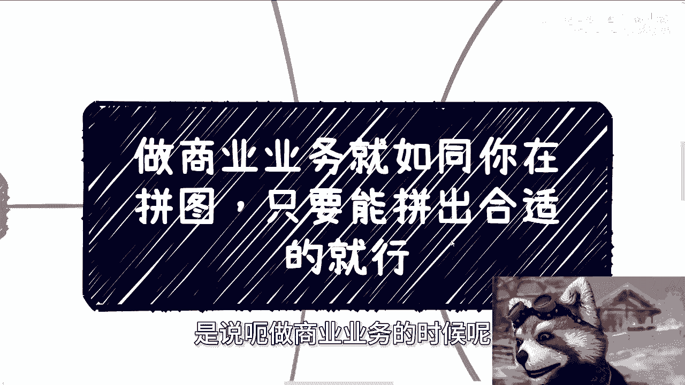

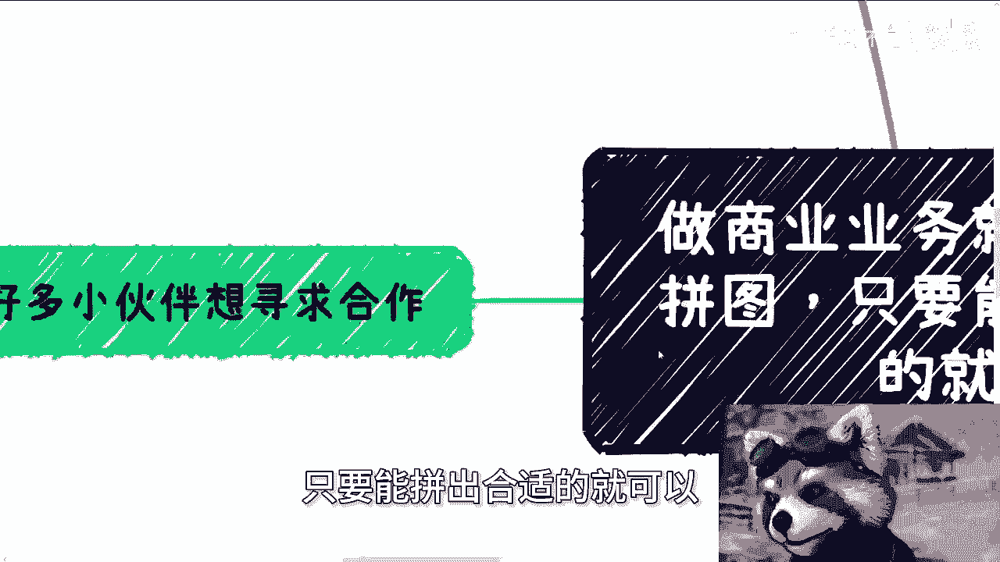

在本节课中，我们将学习一种理解商业合作的思维模型：将商业合作视为寻找并拼合“拼图”的过程。我们将探讨如何有效地寻找合作伙伴、清晰地表达自身价值，并筛选出真正可行的合作机会。

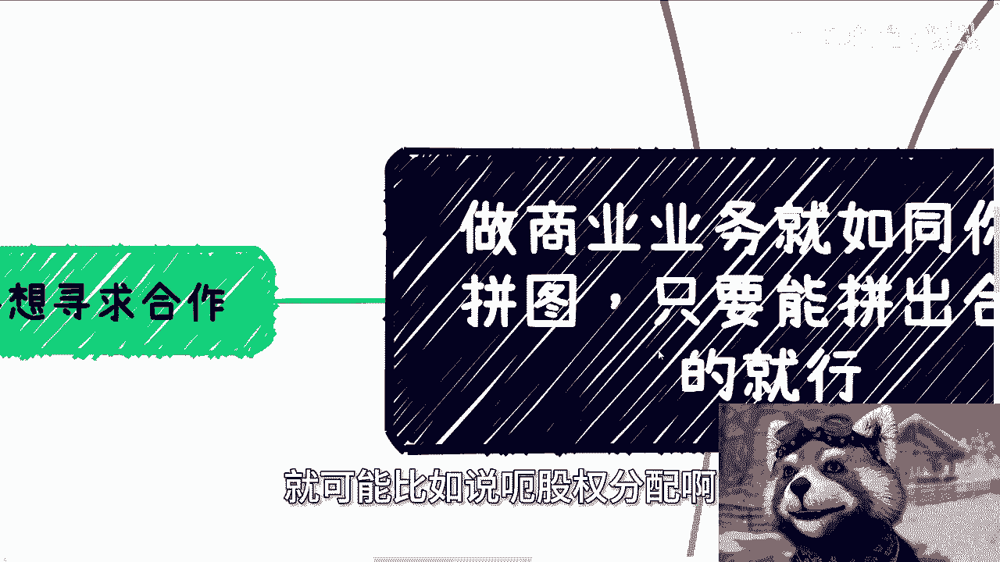

---

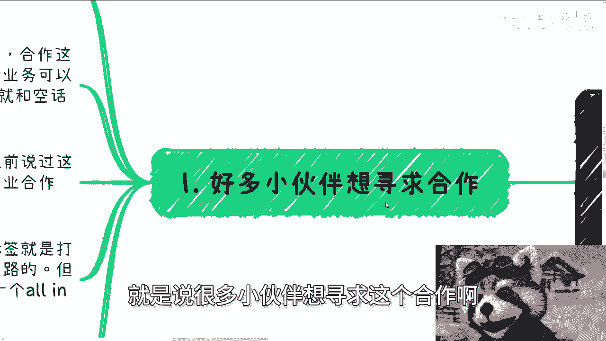

## 概述：商业合作的核心逻辑

商业合作并非简单地寻找“伙伴”，而是像完成一幅拼图。社会中的每个人或团队都拥有自己独特的“拼图块”（即业务、资源或能力）。成功的合作意味着找到那些能与你的“拼图块”完美契合的部分，共同拼出一幅能赚钱的“完整图画”。

---

## 第一节：合作的基础——属性匹配

上一节我们概述了拼图思维，本节中我们来看看合作的基础：双方的属性必须匹配。

许多寻求合作的人常犯一个错误：他们自身状态（如全职工作）与合作方（如全身心投入的创业者）的属性不匹配。对于全职创业者而言，有稳定工作的合作者被视为“有退路”，这会导致信任度和合作优先级降低。

**核心问题在于时间与投入度的不对等**。真正的商业合作需要随时响应，而打工者的时间被工作日束缚，难以匹配需要灵活约见客户、处理紧急业务的节奏。例如，与政府或协会单位洽谈，几乎不可能约定在周末。

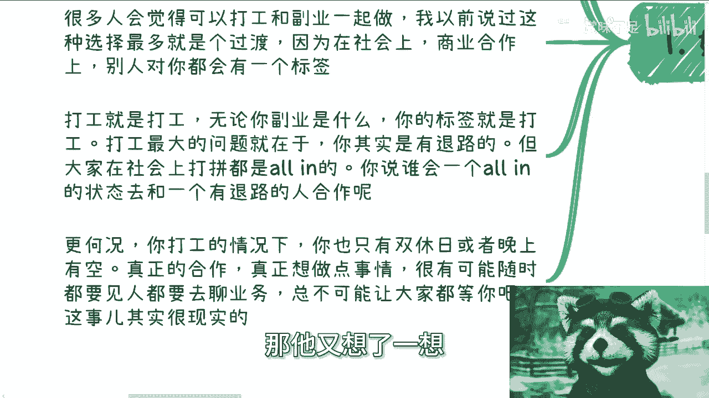

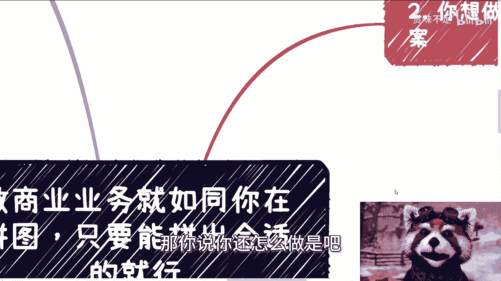

因此，若想进行深度的商业合作，你需要让自己的“属性标签”与合作伙伴处于同一频道。

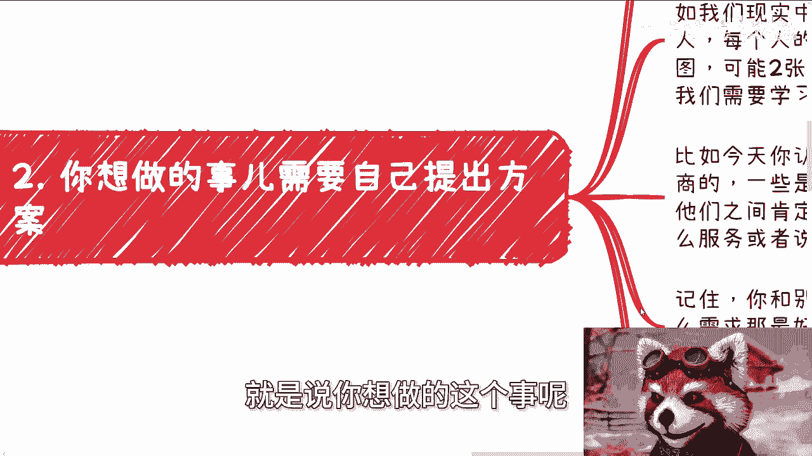

---

## 第二节：明确你的“拼图块”——提出清晰方案

在寻求合作时，你必须清晰地告诉对方你能提供什么，即亮出你的“拼图块”。

以下是构建清晰合作提案的关键步骤：

*   **制作“产品包”**：准备一份PDF、Word文档或图片，清晰罗列你能提供的服务、过往案例及核心能力。
*   **定义你的标签**：用一句话概括你的核心价值，例如“自媒体账号运营专家”或“跨境电商供应链解决方案提供者”。
*   **展示具体案例**：用事实代替空泛的承诺，让他人在有需求时能第一时间联想到你。

社会由无数张“拼图”组成，你的任务是了解他人的需求（他们的拼图形状），并展示你能填补的部分（你的拼图形状）。

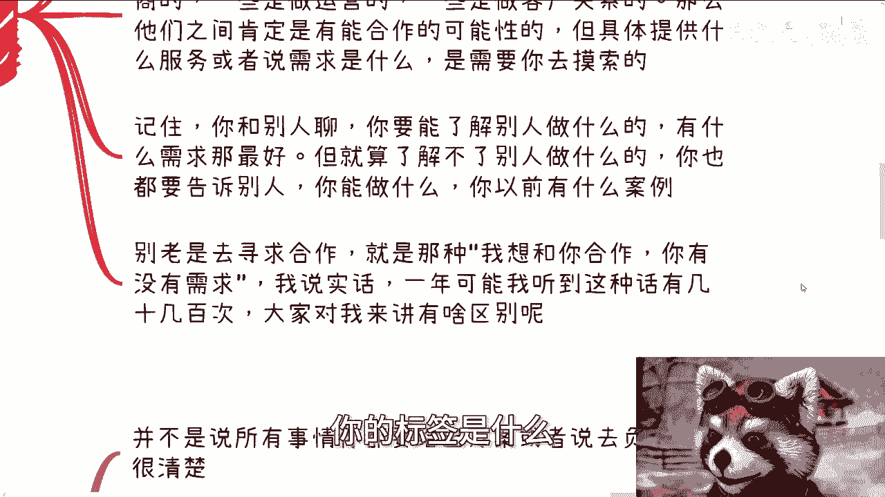

---

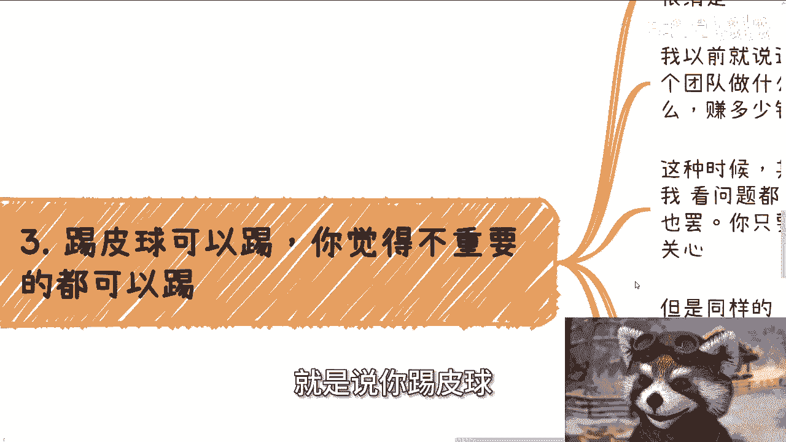

## 第三节：学会“踢皮球”——聚焦核心，过滤噪音

并非所有接收到的问题都需要你亲自解决。聪明的合作者懂得“踢皮球”，即过滤掉不关键或不属于自身范畴的事务。

合作的核心逻辑应具体而清晰：

```
合作框架 = 明确分工（谁做什么） + 定义产出（交付什么） + 设定周期（多久完成） + 分润规则（赚的钱怎么分）
```

在与潜在伙伴沟通时，应直接切入以上具体问题。如果对方无法清晰回答，或总是用宏观愿景（画饼）来应对，则意味着合作中存在不确定性。此时，你只需关注对方承诺中与你能力匹配、可执行的部分即可。

**行动准则**：明确你能解决的A、B、C三类需求（例如政府、企业、高校需求）。对方提案若能与其中一点契合，则深入探讨；若不能，则礼貌搁置。你只需判断两块“拼图”能否拼合，无需为对方整幅“蓝图”负责。

---

## 第四节：化繁为简——经验消除复杂度

商业合作说简单也简单，说复杂也复杂。其复杂性往往源于一方对自身业务逻辑不清晰或缺乏经验。

*   **简单源于经验**：对成熟业务，合作方案、价格、周期都可标准化输出，沟通高效。
*   **复杂源于模糊**：若业务不成熟，合作方案会反复变动，每次沟通都像是推倒重来，给人难以合作的印象。

因此，不断积累成功的“小拼图”（项目经验），是让未来合作变简单的关键。你的经验库越丰富，面对新合作时就能越快给出清晰、稳定的方案。

---

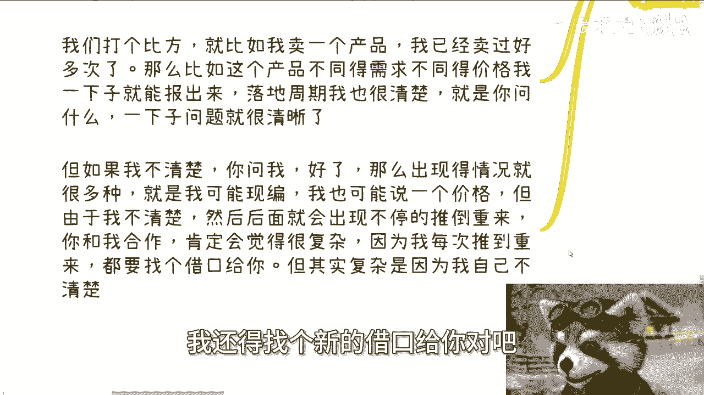

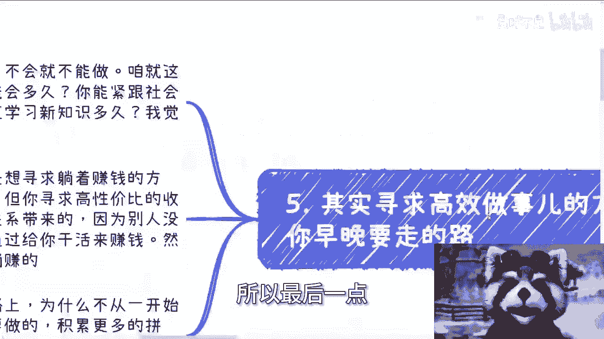

## 第五节：终极路径——积累“关系拼图”

从长远看，寻求高性价比的商业模式是必然方向。这并非指单纯学习硬技能，而是积累能带来价值的“关系拼图”。

**核心公式**：
```
高性价比收入 ≈ 关系资源带来的价值
辛苦钱收入 ≈ 执行劳动带来的价值
```

人性倾向于寻求前者。你最终的价值可能不在于你会什么，而在于你认识谁以及你能连接什么资源。与其追逐每一个技术风口，不如持续积累人脉，筛选出那些能够长期互信、互补、共同赚钱的“拼图伙伴”。

积累的过程就是不断亮出你的“拼图块”，同时识别他人的“拼图块”，在市场中反复尝试拼接、验证，最终沉淀下稳固的合作网络。

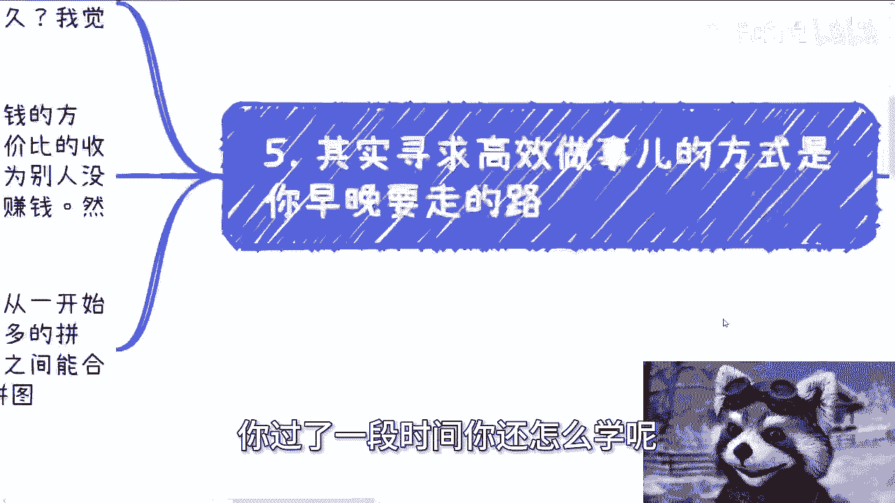

---

## 总结与行动指南

本节课中，我们一起学习了“商业拼图”思维模型。记住以下几个要点：

1.  **属性对齐**：确保你的投入状态与合作伙伴匹配。
2.  **清晰定义**：永远用具体方案和案例告诉别人“你能做什么”。
3.  **聚焦过滤**：只关心合作中与你直接相关的、可执行的部分，学会拒绝噪音。
4.  **积累经验**：用成功的“小拼图”项目，为你带来清晰、简单的合作模式。
5.  **长期主义**：积累能带来价值的“关系拼图”，这比追逐单一技能更具长期性价比。

**最后，给所有寻求合作者的建议**：在开口前，请先准备好你的“拼图块”（清晰的价值提案）。当你问“我们能合作吗”时，对方能迅速判断彼此的“拼图形状”是否契合，从而得到一个明确的答案——是立即拼合、未来可能拼合，还是永远无法拼合。

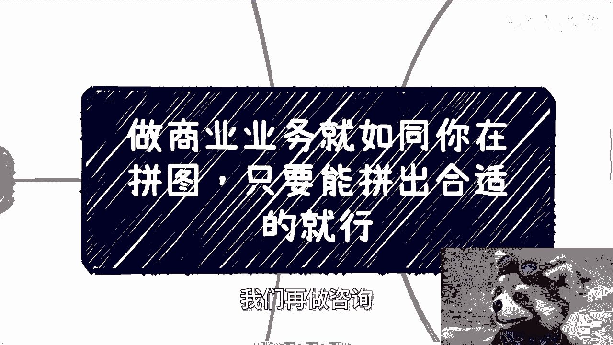

---
**下期预告**：后续将涉及职业规划、股权分配、合同实务及创业融资等话题。如果你手上有特定的“牌”（资源或困惑），需要更具体的规划视角，请系统整理好后进行探讨。