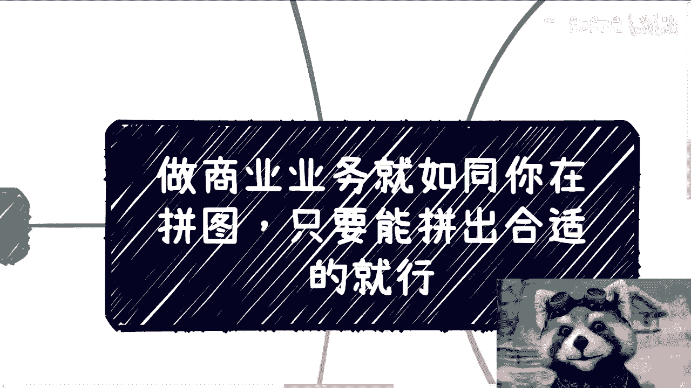
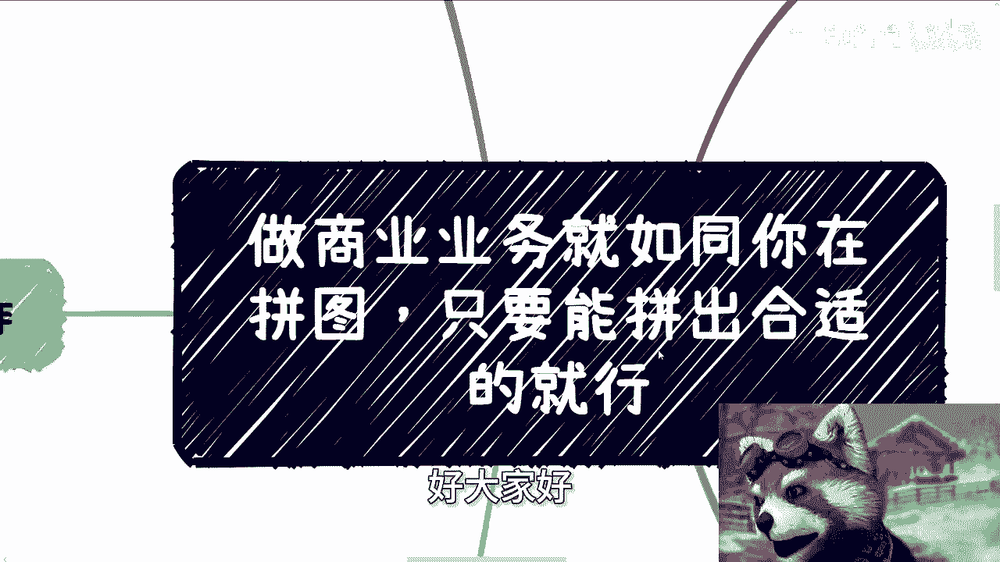
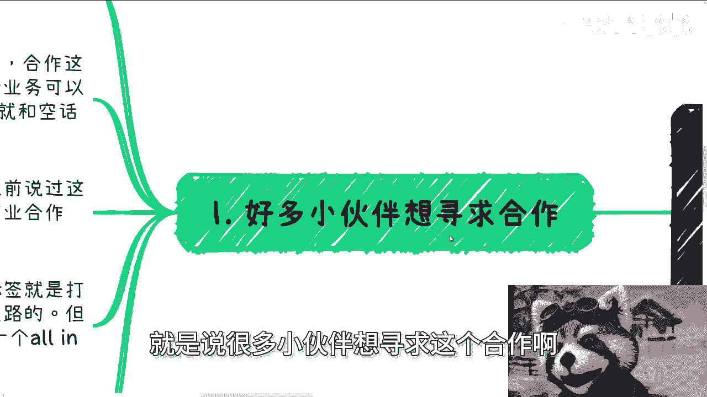
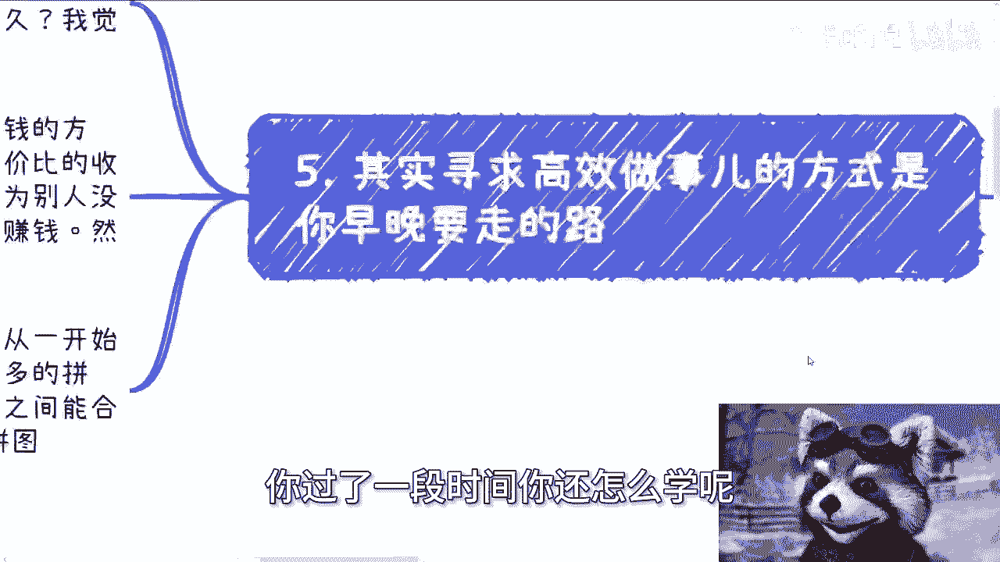

# 做商业业务就如同你在拼图，找到能赚钱的N张图就行 - P1 - 赏味不足 - BV1ex4y187Cn

哈喽大家好。

我们今天山东济南这边活动呃已经结束了，还是比较成功的，那么今天呃给大家更新的这个主题呢，是说呃做商业业务的时候呢。

就相当于你在做拼图，只要能拼出合适的就可以。

因为包括今天其实线下活动的时候，也有比较多的小伙伴呃，提到了，就是说寻找这个合作伙伴，包括呃今天也有小伙伴提到他一些合伙人，就可能比如说股权分配啊。

或者其他的一些问题啊，那首先第一个我们先来看，就是说很多小伙伴想寻求这个合作啊。

就不管是呃出去活动还是私信我的，就很多小伙伴说他寻求各种各样的合作，可能是比如说电商啊，或者说呃开发啊，或者说数字经济，或者说他可能自己就没有什么呃很直接的方向，但其实呃大家到了社会上之后。

我其实强调过很多遍，就合作这个事呢，呃你找其他人，你比如说啊，你说啊陈老师之后有什么业务可以合作的，或者说可以就帮忙的对吧，或者说怎么样，他说可以找我，那这种话呢本质上你说出去，你从对方来讲呢。

这个跟空话没什么区别，就对对方肯定不会记得的，而且我之前也跟你们讲过，就很多人会觉得呃，比如说打工跟副业可以一起做对吧，有的人可能会觉得，我礼拜一到礼拜五是做全职的对吧，我双休日可能做点副业。

那我以前就说过呢，这种选择最多就是个过渡，因为在社会上面商业合作上啊，别人对你其实都有个标签，就是你打工就是打工对吧，就无论说你副业是什么东西，因为你的标签本身别人知道啊，你是个打工。

因为对于真正在社会上做商业的人来讲，你打工最大的问题在于哪里，在于你其实是有退路的啊，就不管你是做，比如你说我剩下的时间是在做一些啊咨询啊，或者做一些电商，或者做一些其他的呃。

就别人会对你对你的印象就是你是有退路的，但是对于你想啊，你跟别人去合作，别人那些人对吧，都是在社会上打拼，然后基本上都是那种啊自己业务all in的对吧，你说呃大家谁会就说以一个all in的状态。

跟一个有退路的一个状态去合作，这概率很小很小对吧，所以说就是我们就说啊，就是说你觉得很多时候跟别人合作，别人会觉得啊，呃可能以一些这种借口来搪塞你或者怎么样，但本质上还是因为说啊。

就是你们两边的这个属性不一样，那更何况你打工的情况下面呢，你也只有双休日，或者说呃工作日的晚上是有空的，那么真正的合作或者说真正想做点事情，那我们不管是出去碰业务也好，还是说呃建一些新的客户也好。

那么很有可能随时随地都需要见人，都都需要聊业务的，那么你总不可能跟人家说，你说啊我晚上这个这个加班对吧，或者我晚上晚一点吧，或者说我就放到双休日，这不可能的，你就像很多人之前问我，他说啊。

我们去约协会对吧，约谁你，你真的去约这种部门对吧，或者约这种有点像国企的这种单位，你说你可能约到双休日吗，那就更不可能了是吧，那那那你就每次问我说，他可能比如说得到的回复就是说啊。

我说双休日可能人家可能不上班的，你必须1~5去约，那他又想了一下。

我1~5要上班的对吧，我又约不到，那好了，这个事情就被无限的往后拖，那你说你还怎么做是吧。

然后第二个呢就是说你想做的这个事呢。

需要自己提出这个方案呃，就我包括今天线下跟大家聊的时候，其实也提到，就是呃我们出去聊，你需要有个产品包，就是需要有个PDF，一个word或者一个图片，就或者任何一种形式，你需要告诉别人呢。

你到底能做什么，就我们寻求合作的过程呢，就好像在社会上寻找这个拼图，你就比如说我们在现实生活当中，有那种1000张的那种拼图吗，那只不过就是说1000张这种拼图呢，我们需要把把它完整的拼出来。

就1000张全部拼完才算完整的对吧，但是我们在过程当中，就我们在这个社会上认识人的过程当中呢，每个人的身上的每个业务就相当于一个拼图，对你，比如说你说我这边对吧，有做咨询的那算一张啊。

有做高效业务的算账对吧，有做政府这个业务的算一张对吧，那么就相当于是每个人的N个业务，都算N张拼图，那么你要做的就是将你所有接触下来的人，比如说每两张，每三张拼成一个完整的业务对吧，那么然而所以说。

其实大部分人不是说我们要去积累的是啊，你说我要学习一技之长，或者说某个硬性的技能，而是说你要学习的就是说这个东西怎么拼，那么就比如说今天你认识一些那个小伙伴，是做开发外呃。

那个开发外包的一些是跨境电商的，一些是做运营的，一些是做客户关系的，那么他们之间肯定是有合作的可能性，但具体到底提供什么服务，或者说各方的需求是什么，是需要你去摸索的对吧，那么所以说在这个地方啊。

就是说你跟别人聊，你要去了解别人做什么，有什么需求，那最好，但是呢就算不了解别人做什么，你也得告诉别人，你能做什么对啊，包括你以前有什么案例啊，你别就说老老实说我去寻求合作，就是那种就是说你跟别人说。

我想跟你合作对吧，你有没有需求，你要这么想，所有的人他一年当中听到这种话，可能有几十次几百次对吧，你说啊你有任何的需求呃，有任何的这个诉求，说你找到我，那别人真的有需求的时候。

他也不可能第一时间想到你对吧，因为你身上是没有标签的，你除非就跟他说清楚，就说你是能解决什么问题，你说我就是能做那个那个自媒体账号运营对吧，或者我就是能带货对吧，我就能怎么样子，你得告诉别人。

你的标签是什么。

那么别人有需求的时候，第一时间能想到你，或者说第一时间有可能想到你，那么第三就是说你踢皮球。

就说你很多的业务呢，很多的话题你可以不接你踢，皮球可以踢，那所有的你不觉得你觉得那种不重要的，你都可以踢，那么就像我们这边说的，就是说虽然我们刚刚一直提到，你需要有自己的这个解决方案啊。

但是并不是说所有的所有的事情，都要给出解决方案，或者说去想的很清楚，我们以前就说过啊，就是合作的逻辑很简单，大家每个人每个团队做什么负责什么对吧，就是你不要用笼统的话来讲，就具体做什么产出什么对吧。

赚多少钱，然后大概多久赚到这些钱，这些钱怎么分就结束了，你包括今天这个下午这个线下聊的时候，就这个小伙伴跟我聊的时候也在说，就是他在说他跟他合伙人的事情吗，然后我就问嘛。

我说你们这个比如说怎么分工的对吧，他说啊可能这个讲讲，反正就是说来来回回讲了两三次啊，我就跟他讲，我说你不要来跟我讲这些，我说我只要我只想知道，你们每个人具体怎么做的，对你比如说合伙人几个人。

每个人具体怎么分工的，你不要来跟我讲宏观的对吧，你说你说比如说你们合作电商啊，你就告诉我，你们四个人分别是那个分合作什么东西对吧，做什么样的业务，他不做，比如他躺赚也行，那么你们为什么让他躺赚对吧。

你的逻辑都说明白，那么这个时候呢你会发现啊，就是对方给你的饼，或者说对方跟你画不画饼已经不重要了，你就比如说我看问，就是我们刚刚说以上那些问题啊，呃我们看问题都是具体到以上说的这些东西，你想想看啊。

你画饼也好，不画饼也罢，你只要能实现你吹的这个牛逼，那也可以对吧，我觉得所有人都并不关心你，只要吹出来的东西能落地啊，但是同样的你但凡说不出来或者说模棱两可的，那就说明这个当中肯定是有问题的。

就我觉得从大家来讲呢，你也不用太细究，因为我你想想啊，我们只要知道我们能做什么，我们需要做什么，别的对方跟你讲的东西，你随便他怎么画饼，无所谓，他他他画归他画嘛，你也你也没有没有损失，没有什么吃亏对吧。

他但凡说不清楚的，我们就不合作，或者说就拖着就当没有，你就做好多又要多出就结束了，你说你比如说就拿我的业务来讲，很简单，你要么就能够给我带来政府的需求，你要么就能给我带来企业的需求。

要么就给我带来高效需求对吧，数字经济相关的，或者说你跟我说啊，陈老师我们做什么啊，那个区块链，或者说数字经济相关的培训或者活动，你是有现成的流量的对吧，那么我觉得你可以详细来聊吧。

否则的话你想嘛你随便给我怎么画饼，你在画的天花乱坠，我就当没看到对吧，因为对我来讲，我知道我能做什么，那你跟我讲你能做什么，我只关心这两张图能不能拼起来，不能拼，那我就就就就就这么一说，我就这么一听啊。

然后第四个就是你说复杂吧，其实很多东西也复杂，说简单也简单，为什么，因为你想啊，你说简单就是我每次都别人都跟别人说的，你要搞清楚，就是别人做啥，你做啥，大家说清楚，然后大家怎么分润就结束了对吧。

但是你想想看啊，你真的做的时候，你谈业务你就会变得很复杂，为什么，因为复杂的原因，往往就是因为对方搞不清楚他想做的事情，或者搞不清楚他跟你的这个这个这个事情的，一个一个合作方式。

或者说有可能对方本身就是中介，而让你觉得就是说他是一个甲方或者乙方啊，也有可能就是说对方跟你讲东西呢，八字都还没有一撇，或者就是就吹的牛逼吹过来，对自己很难圆回来，然后就没有办法直接说跟你去啊，打保票。

或者非常直接了当的说啊，这个项目的时间节点啊或者怎么样，那你就会觉得很复杂，那比如说我们打个比方，就比如说我卖一个产品，我已经卖的呃，我已经卖过好多次了，那么这个产品的不同的需求的不同的价格。

我都能一下子爆出来对吧，包括落地周期，你是一个月给我带100个货，跟一个月带1000个货，我们到底怎么合作，怎么分润，然后定价多少我都会一次性给到，你为什么，因为之前如果做过，你是有案例的对吧。

你是有经验的，那么你你对方问什么，一下子问题就会非常的清晰，但如果我不清楚，你想啊，你问我好了，那么接下来出现的情况就会有很多种，就比如说我有可能编一个价格给你，我也有可能跟你讲一个。

就是说不存在的一个方案，但是由于我不清楚，很有可能出现是当你再次跟我沟通的时候，那么这个方案就被推倒重来了对吧，那么你就会发现你可能跟我合作就很复杂，因为每次你跟我合作都是一套新的方案。

而且呢我还得找个新的借口给你对吧。

那么从你角度来讲，你会觉得很复杂，但是本质上的原因是，因为我没有摸清楚这个东西的一个这个逻辑，或者说我压根就没有经验啊，所以最后一点你看啊。

其实寻求高效做实验方式，是你早晚去寻寻找的这个路，为什么呢，因为很多人觉得做什么都是要自己会什么对吧，不会就不能做，咱就这么说啊，你就算现在什么都会，你也不可能会多久。

而且更何况你也不可能就随着年龄增长，就紧跟社会的一个实施发展对吧，包括就是说你要去学习一些新的知识，你也不可能每次新的浪潮过来，你都能学得学得出来啊，那么我觉得正常的这个普罗大众，他也没有这个能力。

而且赚钱这个事儿呢，你要这么想，人性它本身寻求的是躺着赚钱的方式，就谁都不愿意去赚这个辛苦钱，但是你寻求高性价比的收入，这种收入无非是通过关系带来的，没有别的东西能带来，因为很简单嘛。

就是为什么你今天能赚这个钱，是因为别人没有你这层关系，所以别人要通过给你干活来赚这个钱，然而这个时候就变成了他们赚的是辛苦钱，你赚的是关系带来的钱对吧，所以说与其最终你想想看啊。

如果说与其最终大家都想走上这条路，那为什么不从一开始就去往这方面去积累，或者说去发展对吧，我觉得这本质上才是大众要去做，或者说积累更多的拼图，在整个过程当中去过滤出更多的靠谱的，然后两两之间。

三三之间能够合作的，能够帮助双方或者多方一起赚钱的这种拼图，能够长期合作，拼图才是我们这一路过来要去做的事情，而不是说你跟我说二创老师，我今天去学一下AI对吧，明天我去学一下这个这个这个云计算对吧。

或者后天我去学一下双碳对吧，怎么样子没有用的，你现在可以学，你过了一段时间你还怎么学呢对吧。

所以说你们还是那句话啊，你们要去寻求合作的，不管你们寻求我的合作，还寻求别人的合作，你本身都需要非常清楚的告诉我你到底能干嘛，或者你想干嘛，那当然你告诉我你干嘛或者你想干嘛。

我我一定就你一定从我这边能得到一个反馈，就是我们是现在不能合作，还是以后不能合作，还是就是说我们的这个业务，这辈子就不会有交集对吧，还是说就是说我可能跟你们合作，我的这个朋友也没办法跟你合作对吧等等等。

那总归会有一定的这个结论出来的，但是你千万不要就属于那种，就是说啊你跑过来说啊，我说我们合作对吧，然后呢你就跟我说对吧，让我想，因为很多人是这样，他让我想我们有什么地方合作，然后让我想就是他能拿多少钱。

那让我想哪怕是就就就就不要钱对吧，怎么样子，那问题是你要真的让我想很简单啊，就是我不需要啊对吧，或者说你要问别人，别人肯定你要让他们想，他们肯定想我也不需要对吧，因为你要这么想，所有的人的合作方。

它固定上面其实都是有固定的，这个拼图拼在一起的对吧，只不过就是说可能某些时间点能赚钱，某些时间点不能赚钱，某些时间点那个放容易赚钱，有些时间点赚钱很困难对吧，但是你不会出现一种情况说哦。

今天有一个业务对吧，已经比如说在创老师身上已经做了很长时间了，突然之间这个拼图没有了对吧，三缺一二缺一，你想这种概率能有多大，对啊行，那么反正本期内容我们就讲这么多吧。

然后后面活动的话就是劳动节之后的事了啊，然后我呃地点还没定，到时候再定吧啊啊同样的，那么就是职业规划，商业规划包括呃股权分配啊，包括合同啊，包括创业啊，包括一些融资啊。

啊包括就是说你们要是觉得你们有什么呃牌，或者你们手上有什么样的一些东西对吧，需要通过呃我的一些观点，或者一些这个呃视野能给你们更多的一些规划，或者更多的一些方向的话，你们也可以整理好啊。

