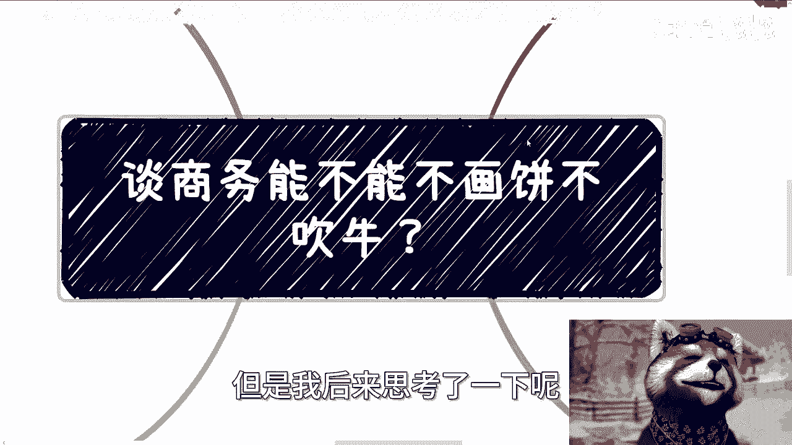
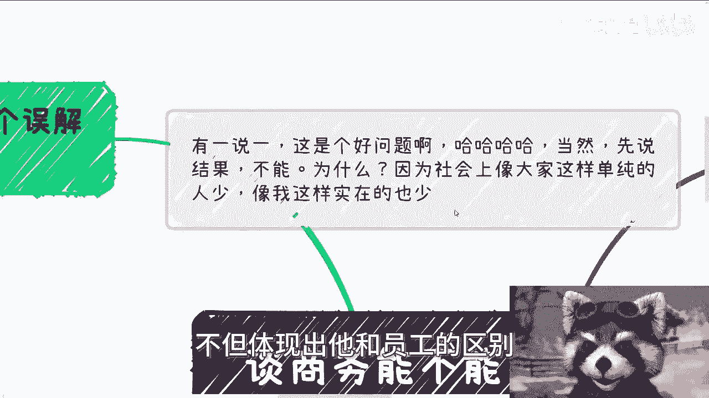
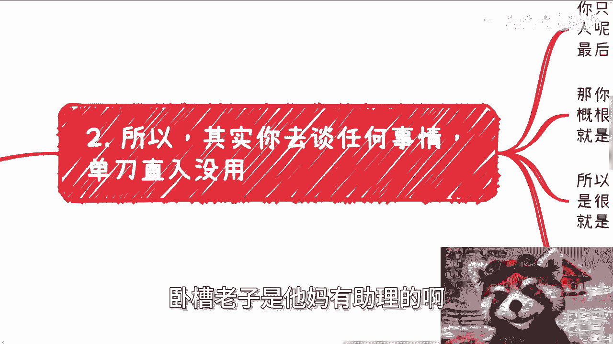
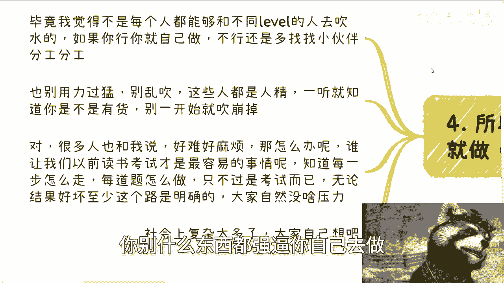
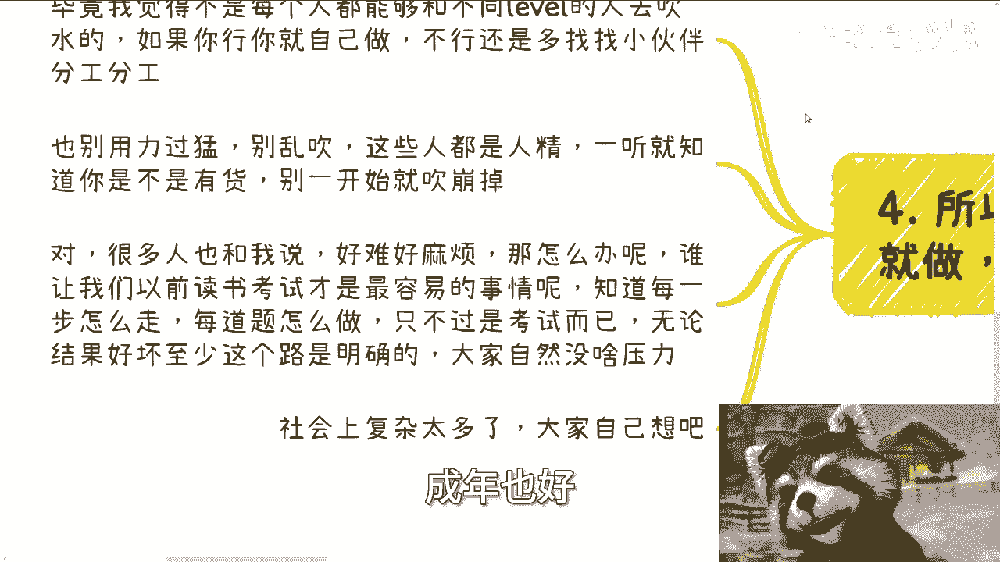
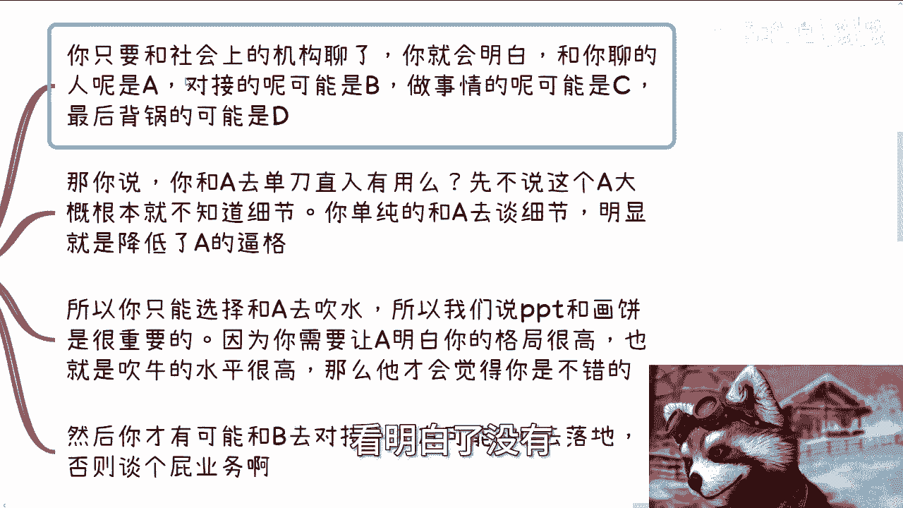
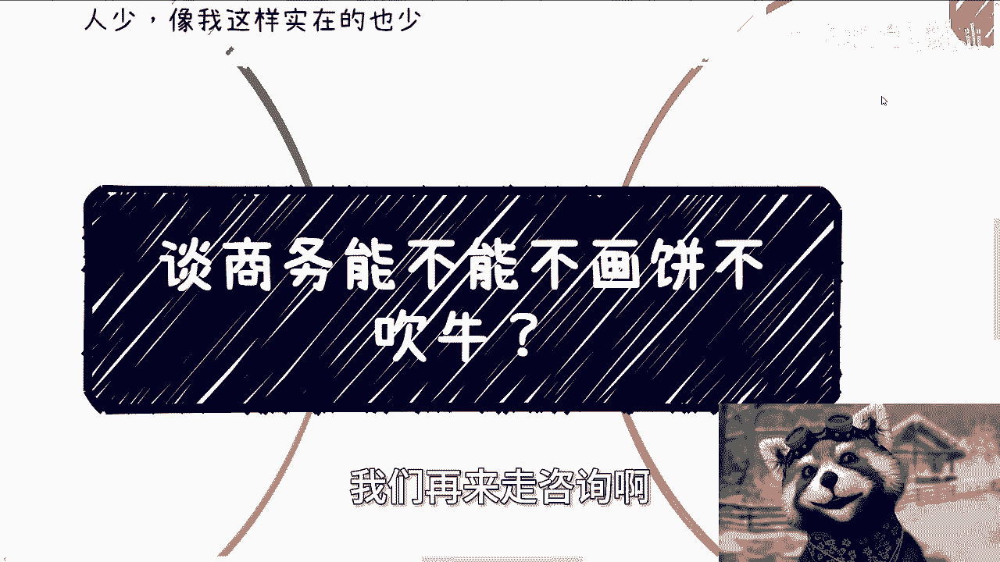

# 做商业能不能不画饼不吹牛？？ - P1 - 赏味不足 - BV1Ty411a7Fz

啊这个今天啊有一说一啊，我觉得这是个好问题啊，呃当然我先说结果不能啊。

就是不能啊，为什么，因为社会上像大家这样单纯的人少了呃。

也不是少了哈，我觉得像大家这样的韭菜太多哈，然后像我这样实在的人太少了啊。

就是前两天有一个小伙伴问个问题啊，他说哎陈老师是不是谈业务啊，谈商务他他妈是不是都要画饼啊，是不是都要吹牛，我说对，嘿我我虽然斩钉斩钉截铁的说对啊，但是我后来思考了一下呢。

呃的确也对啊，但是这个这个思考一下对，跟我当时不假思索说对啊。

这个逻辑是不太一样的啊，首先我先说说大家有个误解啊，我跟你们这么讲啊，我沟通到今天呢，发现了很多人有一个误解是什么，就是做事情太直来直往，你你不能说他们二极管你知道吗，就是你说他二极管他不信的啊。

而且呢就是说额也不能这么这么讲，人家讲人家我觉得不太好啊，但是呢他们会拥有二极管的思维，就比如说啊我们说去沟通对吧啊，他们要么就选择过去拼了命吹牛啊，他妈往死里锤啊，不管嗯。

反正就是陈老师说的妈的随便锤对吧哈，要么就是说单刀直入，单刀直入就是什么跑过去就就问人家说啊，你们这边有什么业务对吧，你们这边有什么补贴，我说大哥哎哎你你你我说是这么说的，他妈做事情这样做的吗。

啊不是对不对，你你就说是不是嘛，就你就我就这么讲吧，就是这就像什么，这就像你们去面试啊，我我比如说我跟你们讲啊，我说你们要去啊，问hr争取或者怎么样子，那你争取你也得说这叫什么摆事实，讲道理对吧。

你你你你你争取你不是什么，跑上去哎，我要我要100万啊，我他妈必须要年薪100万，你不是这样沟通的呀，你说对不对，哎呀就是就是你，所以你们知道吗，就是说他们这种行为啊，就是要么就是极端化啊，过了死命锤。

要么呢就是单刀直入轮，他妈像一样的，那你说我不说他们他妈单单那个二极管，你说我说啥呢，对吧，我都不知道怎么描述，我操到最后他妈我背锅啊，说啊车是你说的，我他妈什么时候这么说过的，对不对啊。

那么就如我们今天讲了，你能不能不画饼，其实不行，为什么啊，因为在社会上的各个组织里面，其实都是有鄙视链的，哎你你非要问为什么，我就告诉你，人就是这么个生物，而不比是不可能的啊。

你会发现很多人鄙视或者说吹牛呢，他不是为了别的，他就是为了体现自己的优越感啊，就是为了让自己跟别的员工区分开来啊，让别的员工知道啊，自己的地位跟角色他妈的是不同的，我跟你们讲。

真的你们聊过你们就会明白了，呃呃基本上每个地方都这样子啊，那么最简单的例子是什么呢，就是一些人或者机构啊，明明没有收入，或者说没有什么太大的业务啊，非得他妈的搞个什么助理啊，搞个司机啊。

搞个所谓的下属啊，然后来干活，我就问你们为了什么对吧，你说他们为了将事情复杂罢吧，这复杂化吧。

不是的啊，他就是为了他妈体现自己的优越感，不但体现出他和员工的区别。

还得体会体现出他跟你的区别对吧，就向你表示卧槽，老子是他妈有助理的啊。

吊炸天啊，那么第二啊，你去谈任何业务呢，单刀直入没有用，为什么，因为你只要跟社会上的机构聊过，你就会明白，就是和你聊的人虽然是A啊，对接的人呢可能是B啊，做事情的人呢可能是C啊，最后背锅的呢可能是D哎。

就他妈这种套路没了，那你说好了，你去跟A单刀直入有用了啊，哎我先不说这个A啊，大概率啊，大概率是根本就不知道细节的，跟他单刀直路也没卵用啊，你单纯的去跟A谈细节，你明显就是让A觉得你在降低他的逼格。

是个啊，所以你只能选择给跟A去吹水，为什么，因为你绕不掉A啊，你要么就这根线，就这个协会或者这个组织，你你说我不合作了对吧，这个A他妈就是啊，那可以对吧，你但凡想要跟B区对接对吧。

那么所以说我们说PPT跟画笔是很重要的，因为你需要让A明白你的格局很高，你是一个会吹水的人，对不对，然后那么他才会觉得你是一个不错的人啊，然后我们就说你才有可能性跟B区对接，然后才有可能性更新去落地。

否则你谈个屁啊，谈什么东西啊，那奇了怪了对吧，我跟你们这么说，你们但凡跟A制谈业务啊，哎哎那个谁对吧，秘书长啊对吧，那个那个某某某会长，我问一下咱们这边比如说有没有什么补贴对吧。

或者我们我我们啊最近有什么业务可以做。

人家心里面只会骂你妈啊，三啊为什么非要这样啊，简单啊，我给你们举个例子，几个月之前呢，我去过一些机构啊，他们所有人呢其实都认识我，那不同的人呢跟我聊不同不一样的事情，比如说底层的人呢就跟我聊落地的细节。

中层的人呢跟我最亲近啊，什么都能聊啊，他妈聊八卦都聊啊，还要单独开个会议室啊，然后开始聊他妈国家政治啊，那为什么非要这样子呢，很简单啊，一就如我说的，一方面，他们要需需要区分自己的身份。

虽然你们看到了啊，都在跟我聊，但他妈明显形式跟内容是不一样的，对不对，哎没办法呀，就这个样子的呀，你非要问我这样有什么用呢，对不对，其次啊最重要的一点是什么，如果事情落地过程中呃。

落地过程当中出了些问题，让我不开心了，或者大家他妈闹矛盾了，他们也能隔离风险，为什么，因为我怪不到中层或上层啊，最多大家矛盾再大也不会撕破脸，对不对啊，当然啊，你非要问我。

为什么这个事情为什么要搞得这么复杂，为什么要这样子，我就这么跟你讲，你再往上看看啊，再朝上面看看啊，一脉相承，你懂了不啊，你懂了不啊，不懂不懂就算了，我跟你讲，你要是这样说。

你都不懂哎，你也别做事了啊，那么所以就是我说的啊，如果你行，你就做不行呢。

还要找合作伙伴啊，毕竟我觉得不是每个人都跟我一样，他能够有能力跟不同的level啊，不同的这种level的人去吹水的，如果你行，你就自己做啊，不行还是多找小伙伴分工对吧，有的人负责商务。

有的人负责负责落地，有的人负责怎么样，你别什么东西都强逼你自己去做。

没用的啊，而且我我一开始就说了，你你也别用力过猛，乱吹啊，这些人都是人精，一听两三句话就知道是不是有货，是不是他妈瞎瞎他妈扯对吧，别一开始跟A聊的时候就就吹崩掉啊，当然啊在沟通当中呢。

其实很多人也跟我提到过一个点，他说啊陈老师好难啊，好麻烦啊对吧，怎么样子，我说大哥你你你那你怎么不说啥事都难呢对吧，你你们你要这么想啊，你也好我也好，我们活到现在最容易的事情是什么。

最容易的事情就是以前读书考试，为什么，因为你知道每一步怎么走啊，你知道每一题怎么做啊，只最多就是你会不会做的问题吗对吧，就是你很明确的知道我做了什么事情，能得到什么结果，这叫什么叫做确定性对吧。

你现在觉得难，觉得好麻烦，这是因为什么问题啊，觉得不确定性对不对，那当你们做所有做一件事情，没有不确定性的时候，那你自然没什么压力，对不了，最多就是你会不会你学的好不好，你们不会有压力呀。

那你现在呢你现在觉得啊好难难在哪里啊，难在所有的点每一步都是不确定，那怎么办呢，没办法的呀，对不对，我我这么跟你们讲，我不管你们现在是未成年也好，成年也好。

你早晚是要成年的，你早晚要踏入社会的，对不对，你就像昨天晚上我我跟一个那个小姐姐过。

那个叫什么呃，咨询的时候也是的呃，他说对吧，哎呀他身边好多人可能没他想的这么多对吧，他身边好多人就考公考编对吧，怎么样子，我说无所谓啊，有什么区别呢，区没有区别的，无非就是说你今天24岁。

23岁面对面对这些问题，他们这帮对吧，随便他们考公考编到无无非就是34岁，35岁，36岁，40几岁面对这些问题，而到时候我跟你们，我我跟你们这么说，他们不是说有能力解决这些问题。

到时候无非就是迫迫于无奈了，你知道吧，就是心力交瘁了，心有余力不足了，然后就无视这些问题罢了，不是解决这些问题啊，对不对，我说你现在二十三二十四去面对这些问题，你是真正想解决的人。

你是有能有可能性走出来的人，他们是什么对吧，所以我就说啊，就是说所有人都会面临这些问题。

就像我这边最后写的，所有人都会面临社会上复杂的问题，无非就是说有的人他是有有有尝试过去解决的。

能不能解决，咱不说啊，他是尝试过去解决解决的。

有的人就逃避啊，有什么区别啦，哦搞得逃避了就解决一样的。

解决了不了，解决个屁，好吧啊记住啊。

真的任何的地方，只要是在中国这片土地上的这个机构里面。

我跟你讲都是这种做生意方式，那看明白了没有。

ABCD这种模式逃不掉的啊，没办法的，我告诉你跟你讲，现在当下的人就这种吊样子啊。

好那么OK我们这个主题就要说到这好吧，呃职业规划，商业规划啊，股权啊，分红啊，丰润啊，商业计划书啊，啊包括你们手上有什么牌，你们手上没有牌的对吧，你们希望通过跟我的沟通，通过我的视野。

通过我的视角能够给你们带来一些更好的，或者更贴近当下社会发展的一些，那个规划的话啊，那么你们可以好吧，整理好问题，我们再来走咨询啊。

