# 商业沟通实战课 01：为什么商业沟通中“画饼”难以避免？🤔

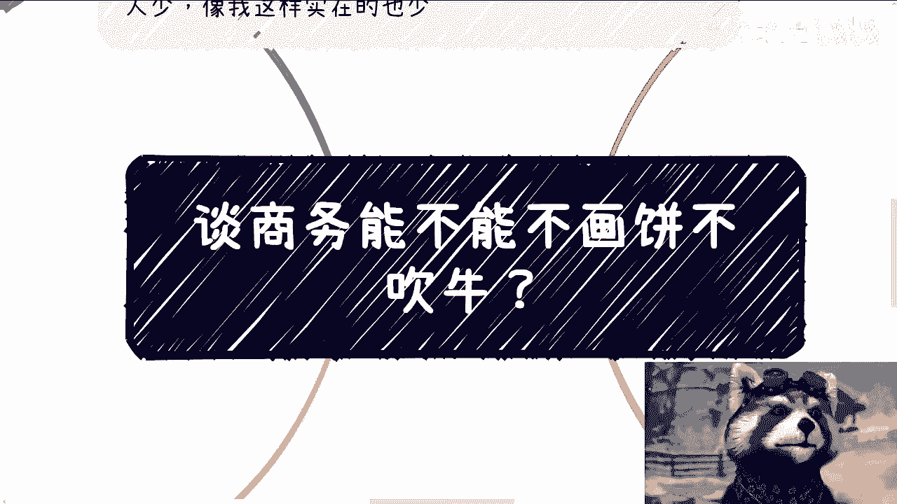

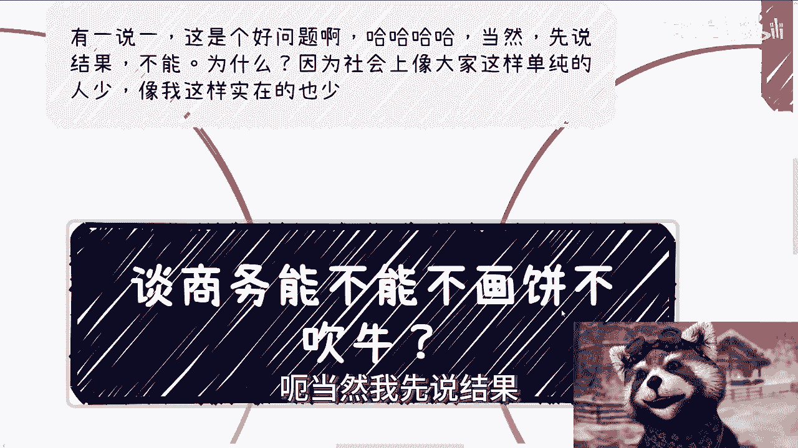

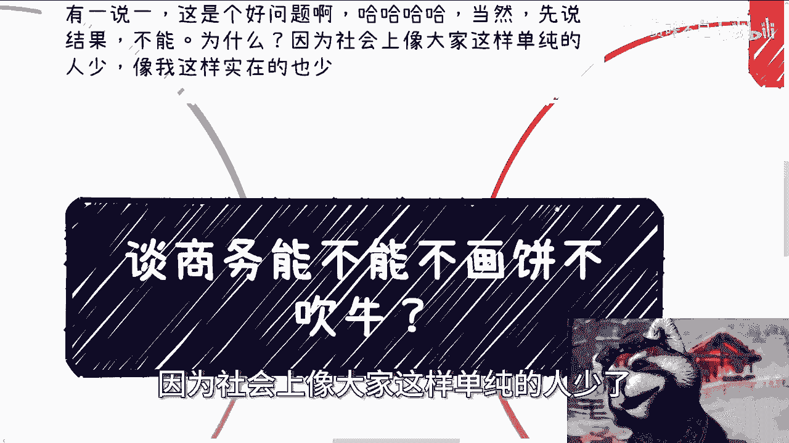

在本节课中，我们将探讨一个商业沟通中的核心问题：在谈业务时，能否做到完全不“画饼”或不“吹牛”？我们将深入分析其背后的社会与人际逻辑，帮助你理解商业世界的运行规则。

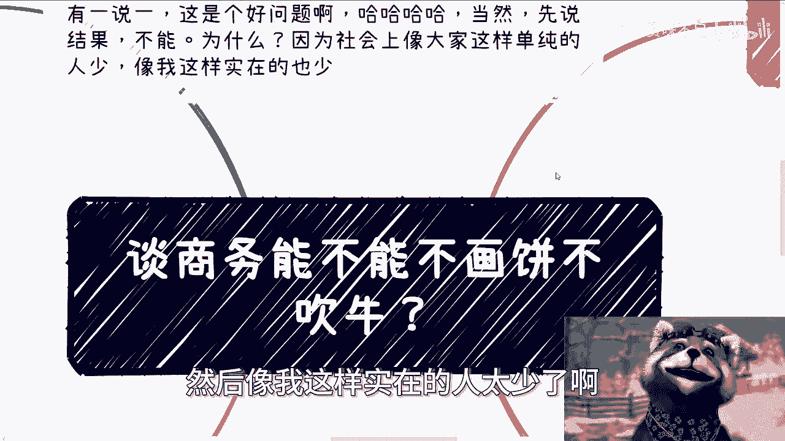

## 核心结论：难以避免

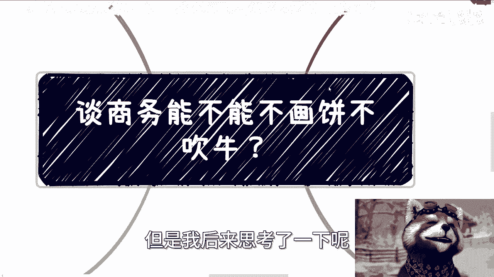

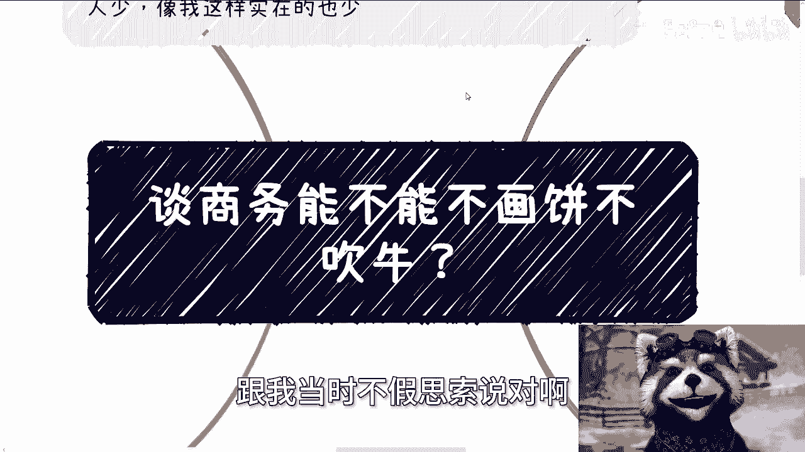

首先给出明确的结论：在商业沟通中，完全不“画饼”或“吹牛”是**不能**的。

这个结论基于一个现实：社会上像提问者这样想法“单纯”的人相对较少。更准确地说，社会上“韭菜”很多，而真正“实在”的人很少。

## 常见的沟通误区：二极管思维

上一节我们得出了核心结论，本节中我们来看看导致这个结论的常见思维误区。

在沟通中，许多人存在一种“二极管”思维模式。这种模式表现为两种极端行为：

以下是两种典型的错误沟通方式：

1.  **极端吹嘘**：在沟通中不顾事实，拼命夸大和吹牛。
2.  **单刀直入**：过于直接，例如一上来就问对方“你们有什么业务？”或“有什么补贴？”，缺乏必要的铺垫和语境营造。

这两种方式都不可取。有效的沟通需要“摆事实，讲道理”，而不是走极端。

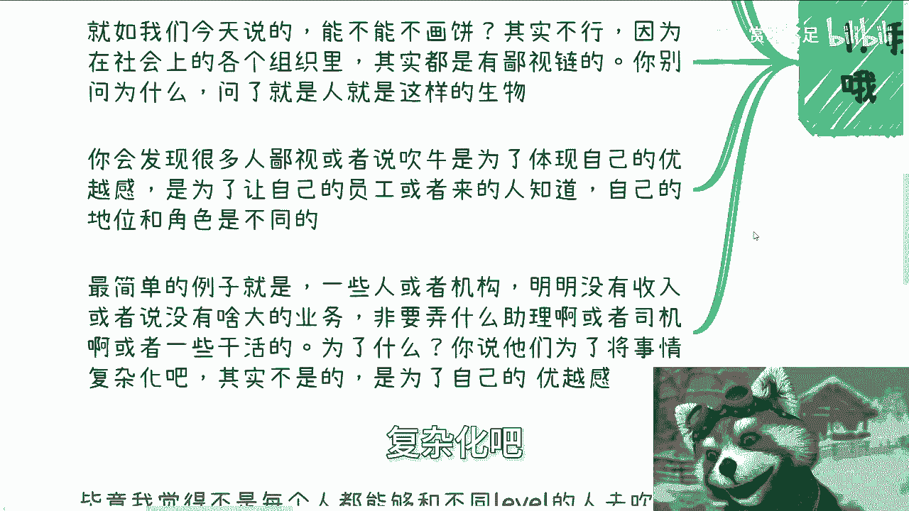

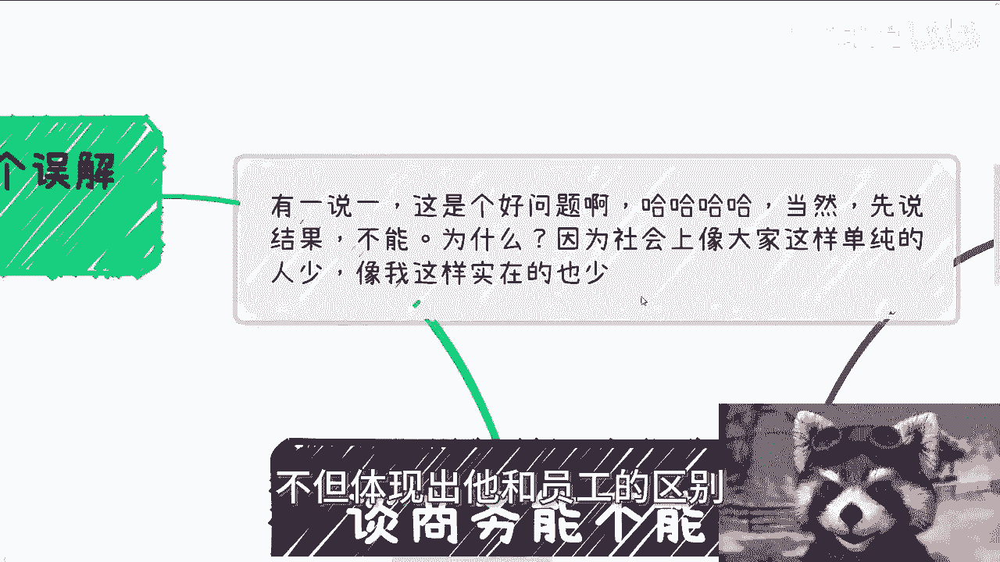

## “画饼”背后的深层逻辑：鄙视链与身份区隔

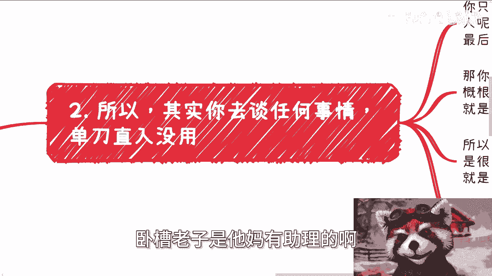

理解了沟通误区后，我们需要探究为什么“画饼”行为普遍存在。其核心原因在于社会组织中普遍存在的**鄙视链**和**身份区隔**。

人类作为一种社会性生物，比较和区分是本能。许多人通过“吹牛”或“画饼”，并非为了达成具体目标，而是为了**体现自身的优越感**，将自己与普通员工或其他合作方区分开来，彰显其不同的地位和角色。

一个典型的例子是：某些个人或机构，即便没有多少实际业务或收入，也要配备助理、司机等，其目的往往不是为了效率，而是为了**复杂化流程以体现身份**。

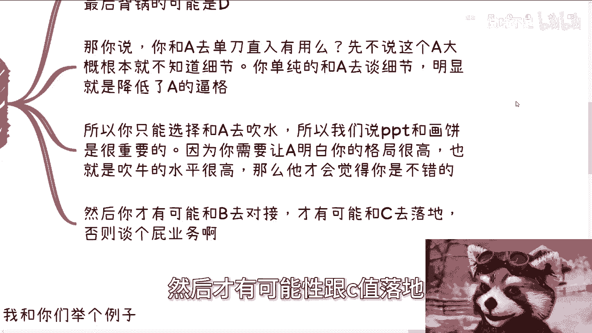

**核心逻辑公式**可以概括为：
```
“画饼”行为 ≈ 建立身份区隔 + 满足优越感需求
```

## 商业沟通的现实结构：ABCD角色模型

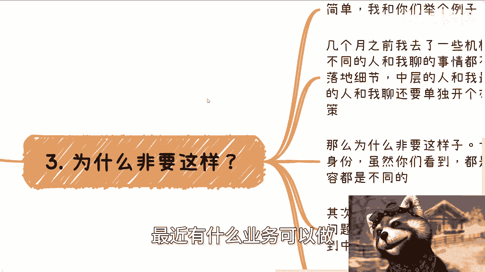

那么，在具体的商业沟通中，为什么需要与不同角色的人采用不同策略（包括“画饼”）呢？这涉及到商业组织的现实运作结构。

在与社会机构打交道时，你会遇到一个典型的角色链：

以下是沟通中常见的四种角色分工：

*   **A (对接人/窗口)**：通常是你首先接触到的人，可能是秘书长、会长等。他们往往**不了解具体细节**，但拥有对接权限。
*   **B (决策者/关键人)**：真正能做决定或推动事情的人，你通常需要先通过A才能接触到B。
*   **C (执行者)**：具体负责落地执行事务的人。
*   **D (背锅者/风险承担者)**：当事情出现问题时，最终承担责任的人。


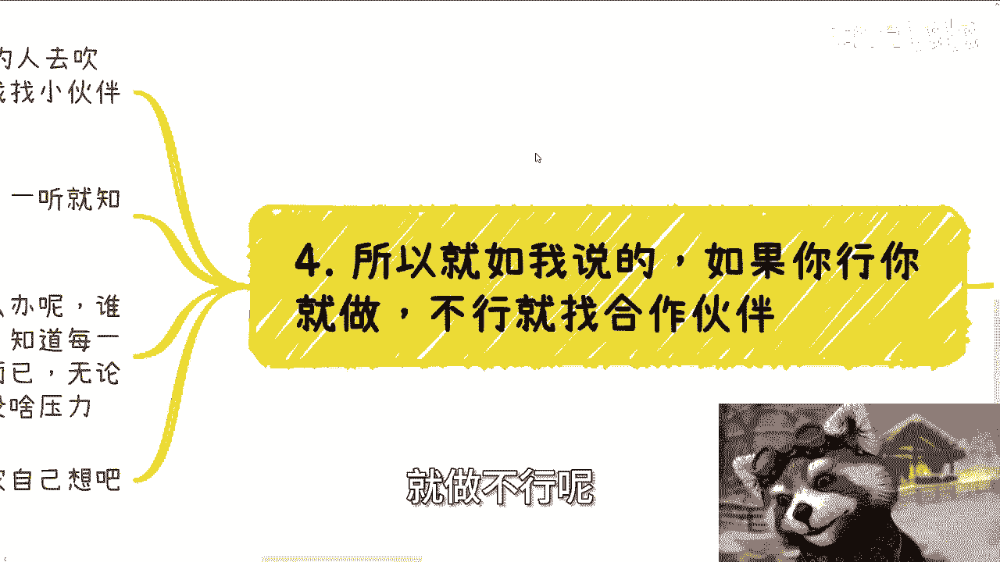

在这种结构下，如果你直接与A角色“单刀直入”谈具体细节，很可能让A感到你在挑战他的权威或降低他的“格调”。因此，与A沟通时，往往需要一定的“吹水”或“画饼”，展示你的格局和高度，让他觉得你是一个“值得引荐给B”的人。

**沟通路径代码**可以描述为：
```python
# 理想的商业沟通推进路径
if 与A沟通(展示格局，适度“画饼”) == 成功:
    获得引荐机会
    if 与B沟通(探讨可行性，展示实力) == 成功:
        进入与C的落地执行阶段
else:
    合作终止于初始阶段
```

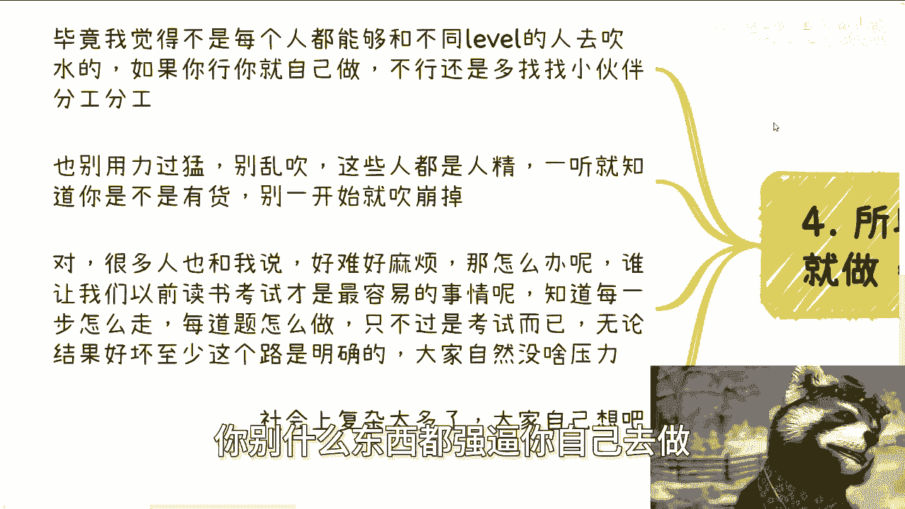

## 策略建议：能力匹配与团队协作

认识到“画饼”的必要性和沟通的复杂性后，我们应该如何应对？

关键在于**自我评估与分工协作**。

如果你具备与不同层级（Level）的人灵活沟通、切换话题（包括适度“画饼”）的能力，那么你可以独立应对。但请注意，**不要用力过猛**，沟通对象都是“人精”，过度吹嘘很容易被识破。

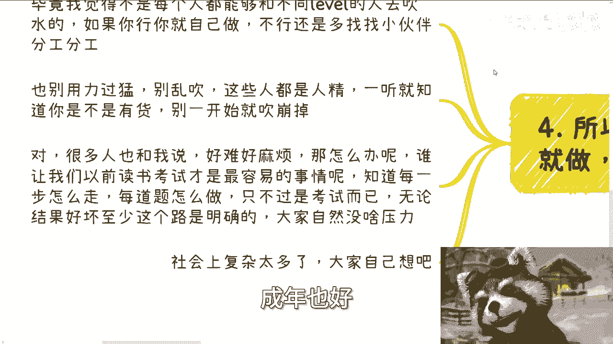


如果你觉得自己不擅长此道，那么更明智的做法是**寻找合作伙伴，进行团队分工**。例如，有人负责商务对接（与A、B周旋），有人负责技术或落地执行（与C对接）。不要强迫自己承担所有角色。

## 面对不确定性：成年社会的必修课

许多人在了解这些规则后会感到“好难”、“好麻烦”。这种感受的根源在于**不确定性**。

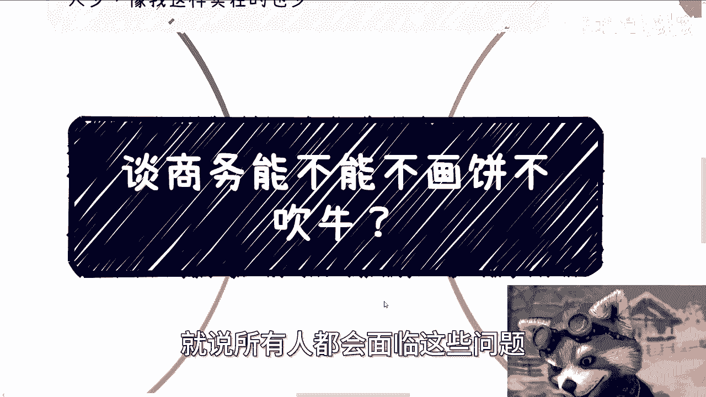

学生时代之所以感觉简单，是因为路径清晰，具有**确定性**：你知道学什么、考什么，结果与努力直接相关。而踏入社会后，商业沟通的每一步都充满**不确定性**，没有标准答案。

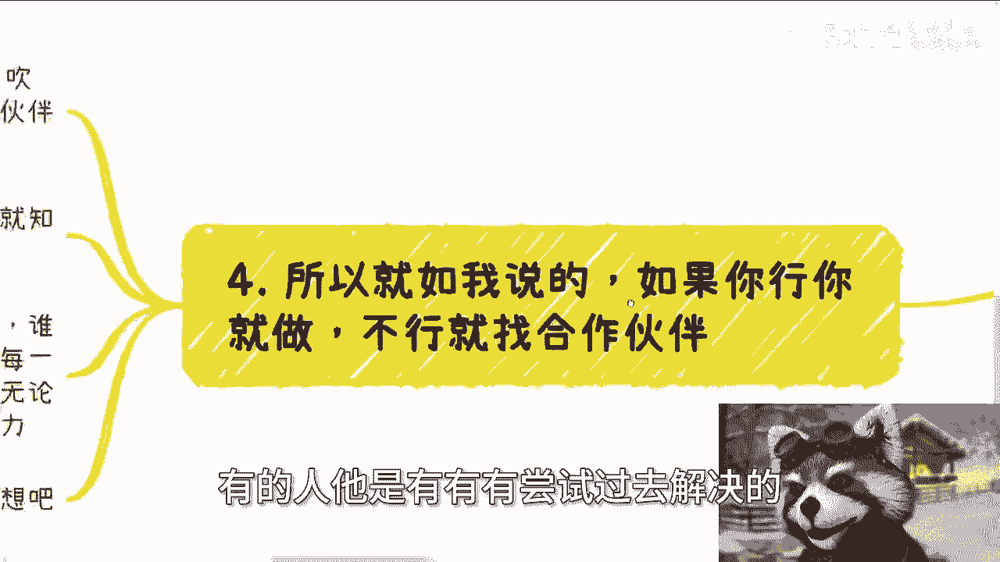

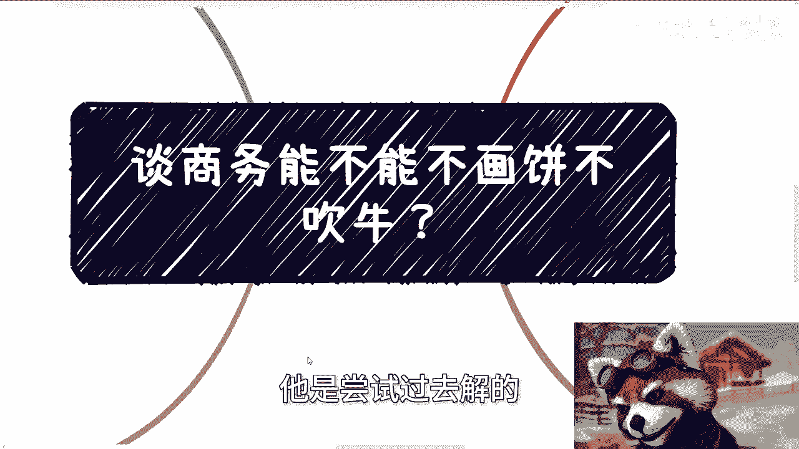

但需要明确的是，**所有人迟早都要面对社会复杂性的挑战**。区别在于：有的人在年轻时（如23、24岁）就主动尝试理解和解决这些问题；而有的人选择逃避（如一味考公考编），将问题拖延到中年（34、35岁甚至更晚），届时可能已“心力交瘁”，并非解决了问题，而是**被迫无视或无力应对**。


逃避并不能解决问题，只是延迟了面对问题的时间。

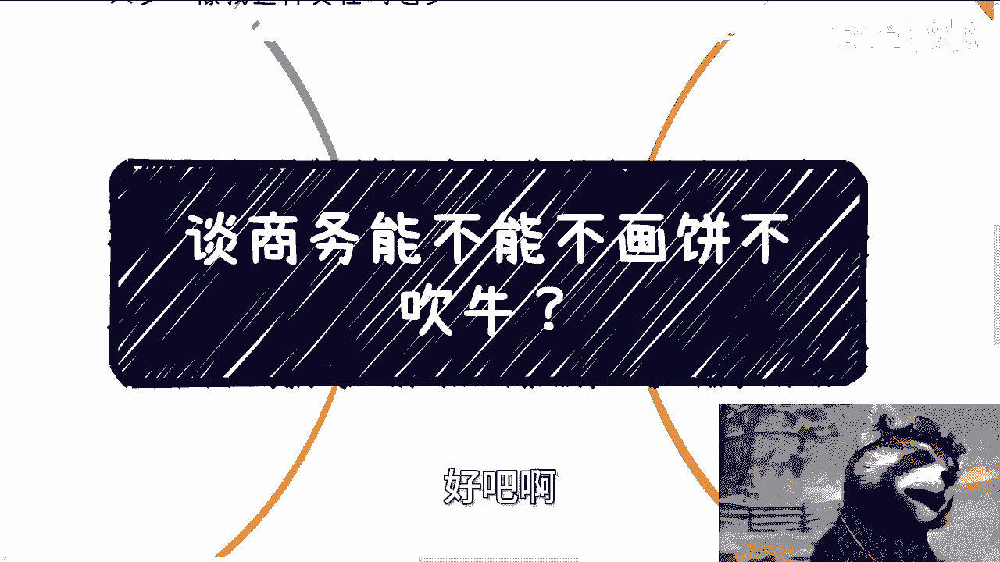

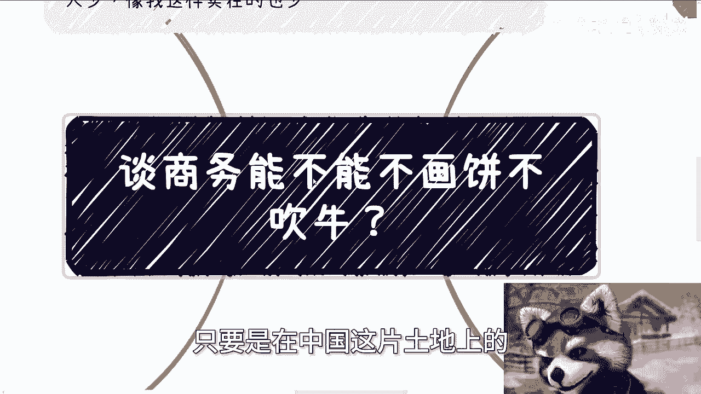

## 总结与核心要点回顾

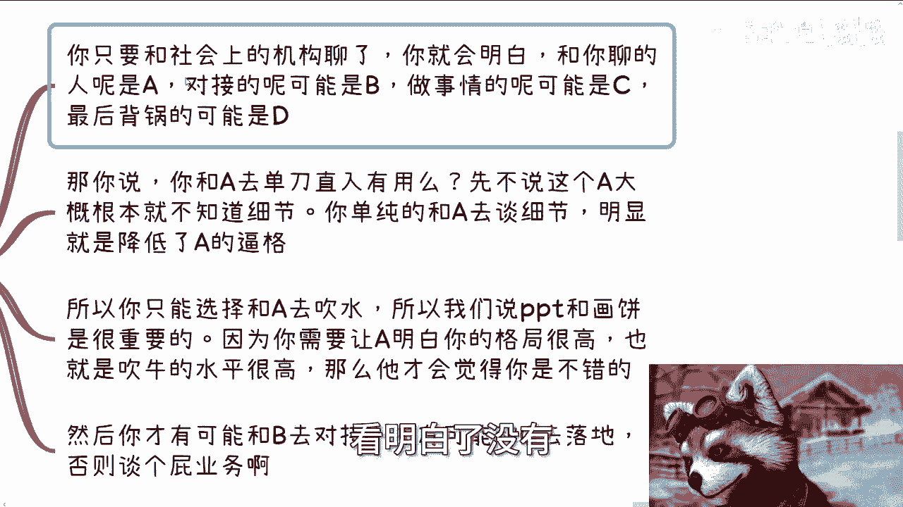

本节课中我们一起学习了商业沟通中“画饼”现象难以避免的深层原因。

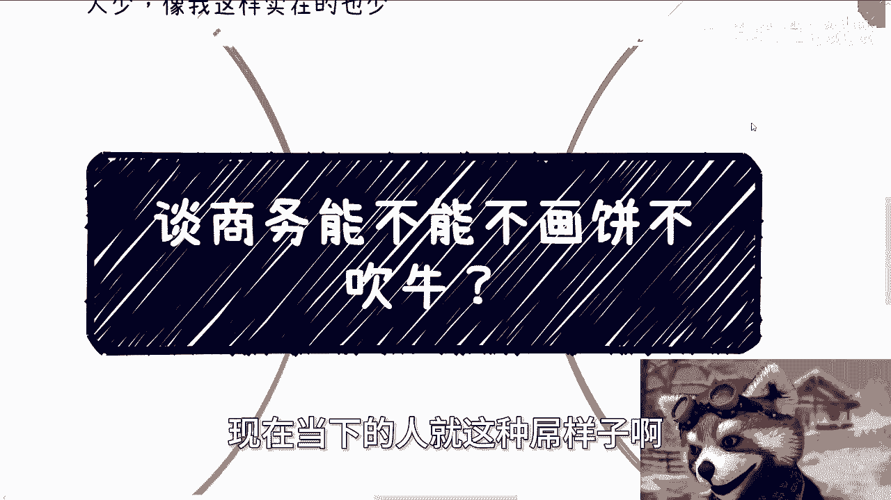

1.  **核心结论**：在当下的商业环境中，完全不“画饼”或“吹牛”是不现实的。
2.  **思维误区**：应避免“二极管”思维，沟通不是非黑即白。
3.  **根本原因**：“画饼”行为源于社会组织中的**鄙视链**和个体对**身份区隔**的需求。
4.  **现实结构**：商业沟通遵循 **“ABCD角色模型”** ，与不同角色（A对接人、B决策者、C执行者、D背锅者）沟通需要不同策略。与A沟通时，适度“画饼”往往是获得与B对接机会的敲门砖。
5.  **行动策略**：根据自身沟通能力，选择独立应对或**团队分工协作**。切忌用力过猛，吹嘘需有度。
6.  **心态调整**：认识到**不确定性**是成年社会的常态。主动在年轻时学习应对，远比拖延和逃避更有价值。

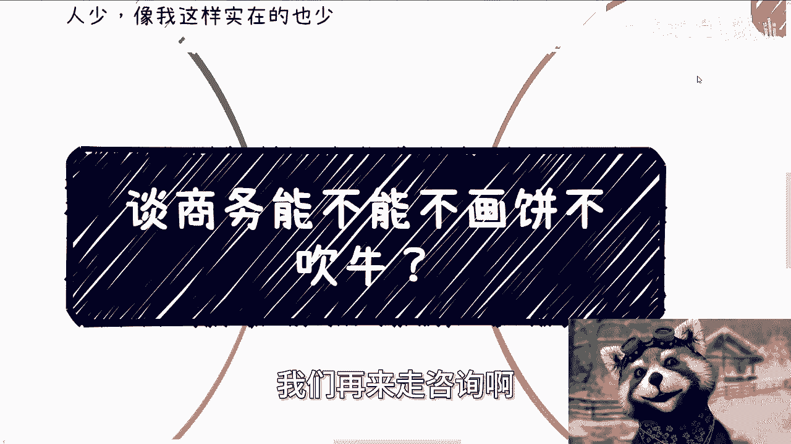

在中国社会的多数机构中，这种沟通模式和角色结构普遍存在。理解它，不是为了变得虚伪，而是为了更有效地推动事务，在保护自己的同时达成商业目标。