# 课程：灵活就业模式解析（番外篇）🎯

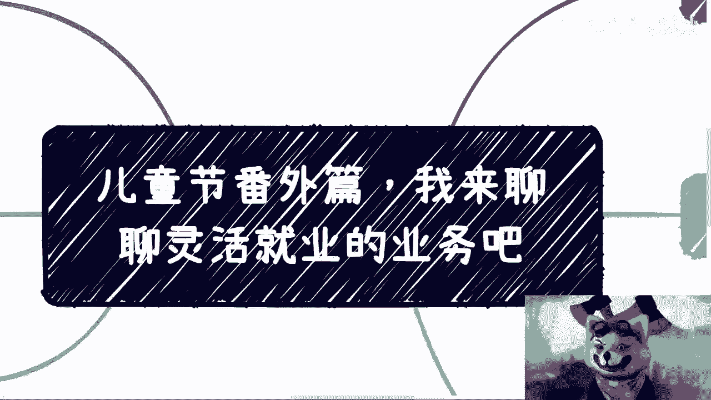

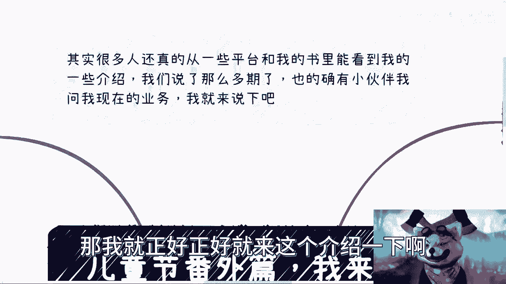

在本节课中，我们将一起了解一种非传统的职业与收入模式。这种模式的核心在于摆脱单一的“打工”思维，通过多种渠道构建个人价值与收入体系。我们将详细拆解其组成部分，并探讨其背后的逻辑。

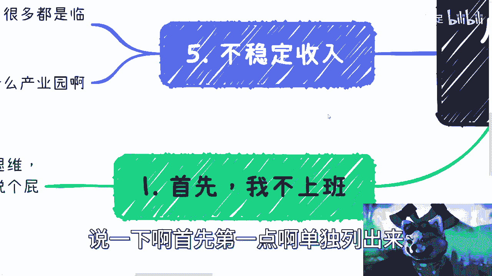

---

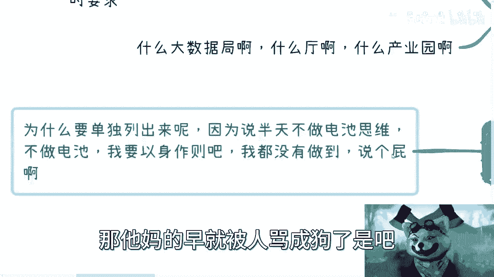

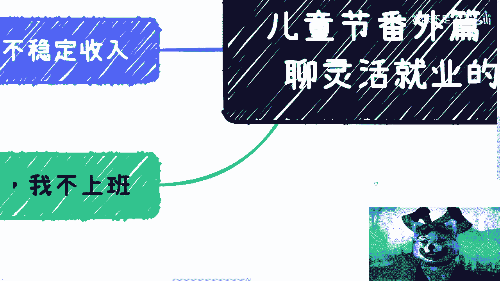

## 1. 核心理念：不坐班工作 💼

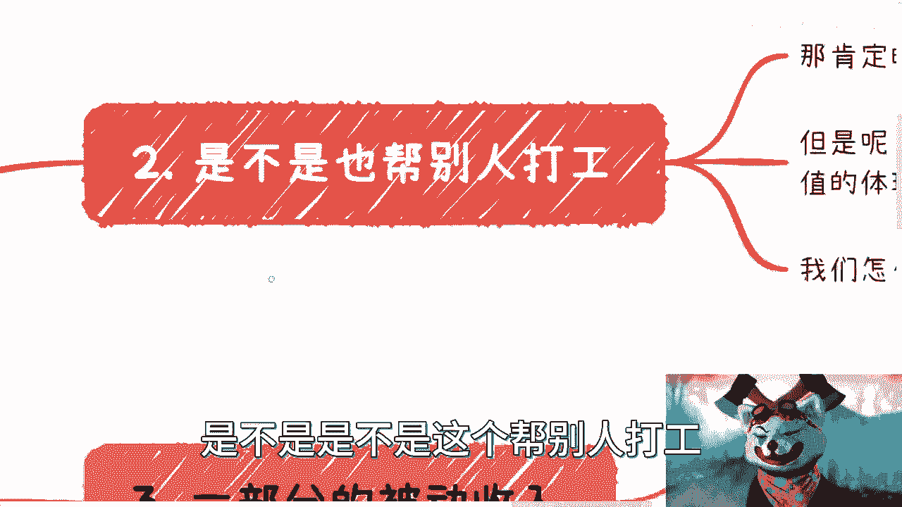

上一节我们介绍了课程概述，本节中我们来看看核心理念。首要且明确的一点是，我不采用传统的坐班上班模式。我以身作则，实践所倡导的“不做电池”的理念。如果自己都无法做到，那么所有的言论都将失去说服力。

## 2. 收入模式：为自己“打工” 🤝

那么，不坐班如何获得收入呢？关键在于转变“为老板打工”的思维，转为“为自己打工”。在商业活动中，服务甲方、获取报酬是常态。但核心区别在于，积累的价值是否归于自己。

以下是判断是否为“为自己打工”的一个简单方法：

假设一个项目总收入为 **项目收入 = 100万**。  
若项目利润为 **利润 = 50万**，而你的报酬是 **个人收入 = 5万**。  
此时，**个人收入 / 利润 = 10%**，这意味着你仍然在很大程度上是“电池”，尽管比例优于普通员工。

若你将项目以5万外包，自己获得 **利润 = 45万**。  
此时，**个人收入 / 利润 = 90%**，这便是在为自己创造价值。虽然仍需服务甲方，但价值体现的主体是自己。

## 3. 收入构成详解 📊

我的收入来源并非单一，而是由多个部分有机组合而成。这确保了收入的稳定性和抗风险能力。

### 3.1 部分被动收入

这部分收入的特点是一次性投入劳动，后续可产生持续回报。

*   **课程版税**：我录制了许多课程。课程售出后，我会按一定比例获得分润。公式可以简化为：**版税收入 = 课程售价 × 销售数量 × 分润比例**。
*   **挂名顾问/咨询费**：担任一些机构或项目的顾问，仅需挂名，无需持续投入日常工作，即可获得固定费用。

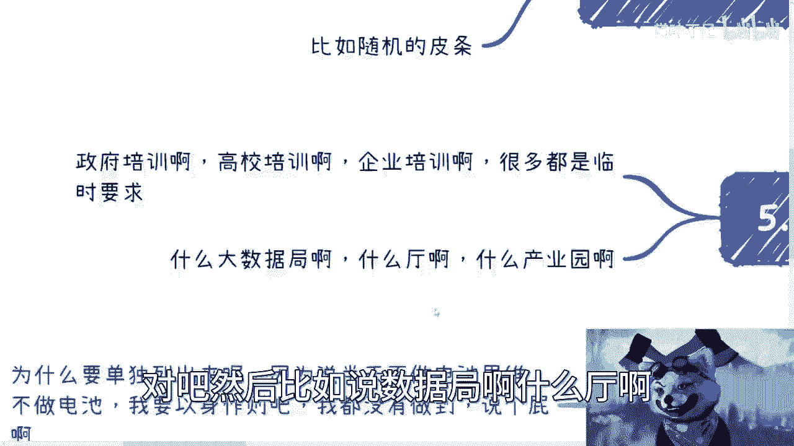

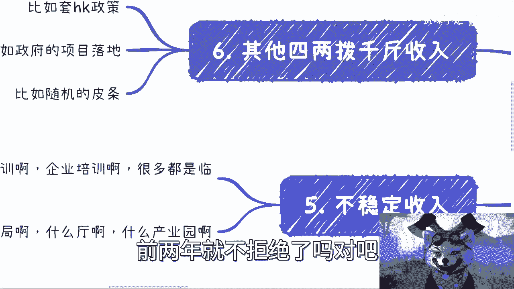

### 3.2 部分持续性主动收入

这部分收入需要我主动付出时间和劳动，但需求相对稳定且可预期。

*   **高校合作**：例如为高校提供师资培训、专业课程开发。
*   **政府与企业固定咨询**：例如为公安、工信、人社等部门，或银行、证券、交易所等金融机构提供年度性的培训与咨询服务。
*   **特点**：这类合作通常每年都有，但具体需求（`case by case`）会有所不同。由于我个人积累的知识体系较丰富，应对这些定制化需求难度不高。

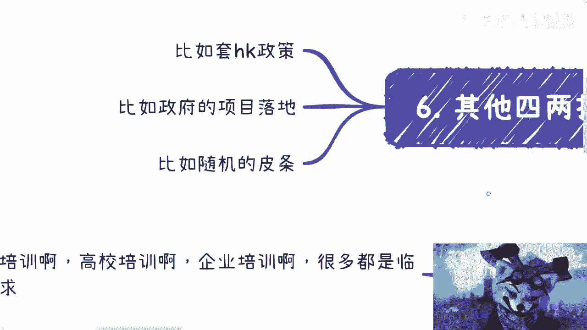

### 3.3 不稳定收入

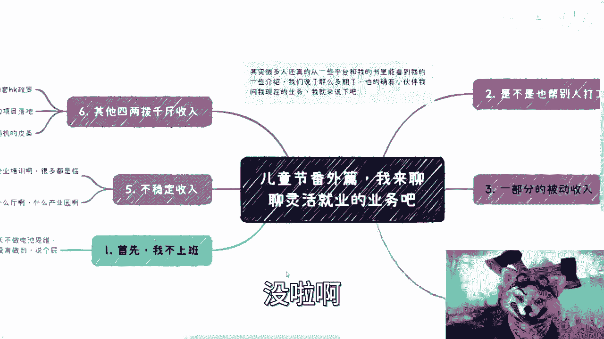

这部分收入机会是临时性的、不可预测的，但有助于拓展人脉和关系。

*   **临时性项目**：来自政府、高校、企业或产业园的临时邀约，例如某个短期讲座、评审或咨询项目。
*   **策略**：对于这类机会，前两年我基本“来者不拒”，主要目的是建立和维护广泛的社会关系。从今年起，我开始有选择地接受。
*   **“四两拨千斤”型机会**：指投入较少精力但潜在回报较高的机会。例如：
    *   咨询后衍生的项目落地合作。
    *   充当“中介”或“桥梁”，为企业匹配资源（如融资、人才、外包服务等）。判断这类机会的标准不是它是否“高级”，而是它是否 **赚钱**。

## 4. 模式的优势与个人体会 🌈

采用上述模式，给我个人生活带来了显著变化。

首先，**时间非常自由**。这使我有充足的时间享受个人爱好，例如玩通各类游戏（《塞尔达传说》、《动物森友会》、《怪物猎人》等）、观看大量动漫、影视剧（涵盖美剧、韩剧及各国小众作品）。

更重要的是，**情绪不受他人牵制**。我无需为了薪水而强迫自己做毫无积累、纯粹为老板创造价值的事情，从而避免了巨大的精神内耗。人生短暂，我认为没有必要在令自己痛苦和压抑的环境中消耗生命。

对于年轻的咨询者，我常给出的建议是：**趁年轻，多为自己积累**。未来的可能性属于年轻人。我已达到个人发展的某个阶段，制作这些视频分享经验，正是基于这种“积累与分享”的理念。

---

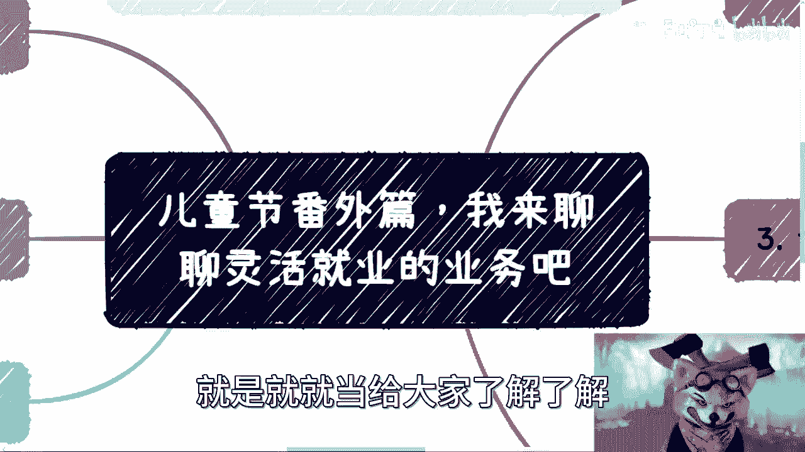

本节课中我们一起学习了一种多元化的灵活就业与收入构建模式。其核心在于**脱离单一雇佣关系**，通过**被动收入、持续性主动收入和不稳定机会**的组合，实现**时间自由**和**价值积累的自主化**。关键在于转变思维：从为老板的利润打工，转向为自己的价值与人生体验打工。希望这种思路能为你提供不一样的职业规划视角。