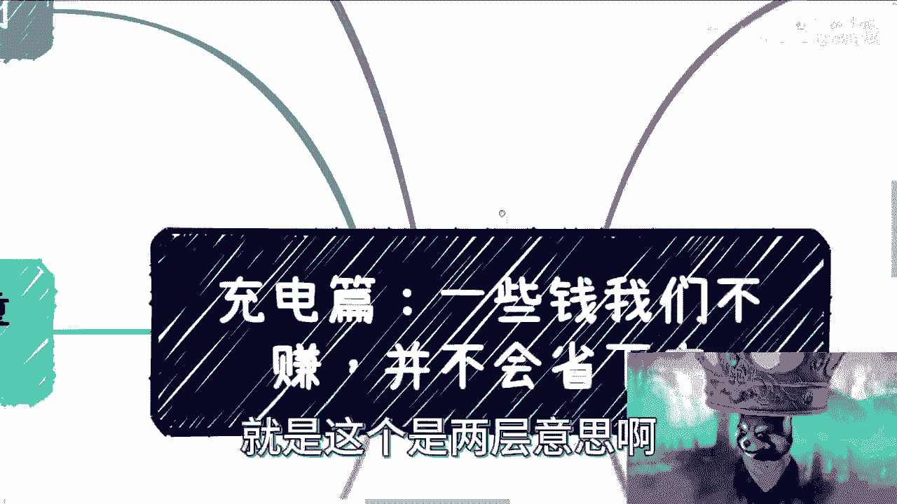
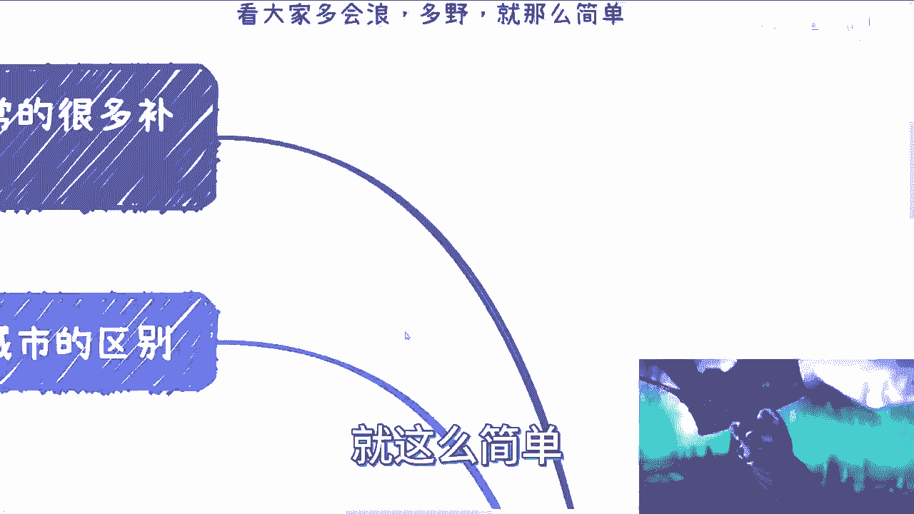
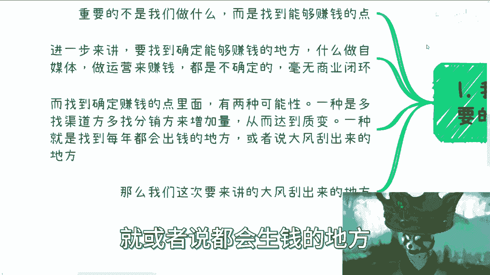
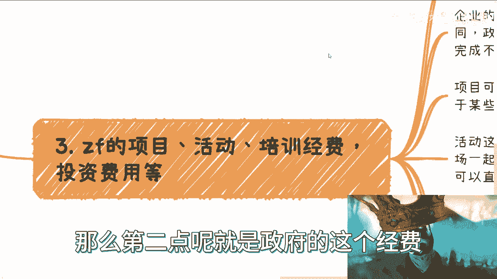
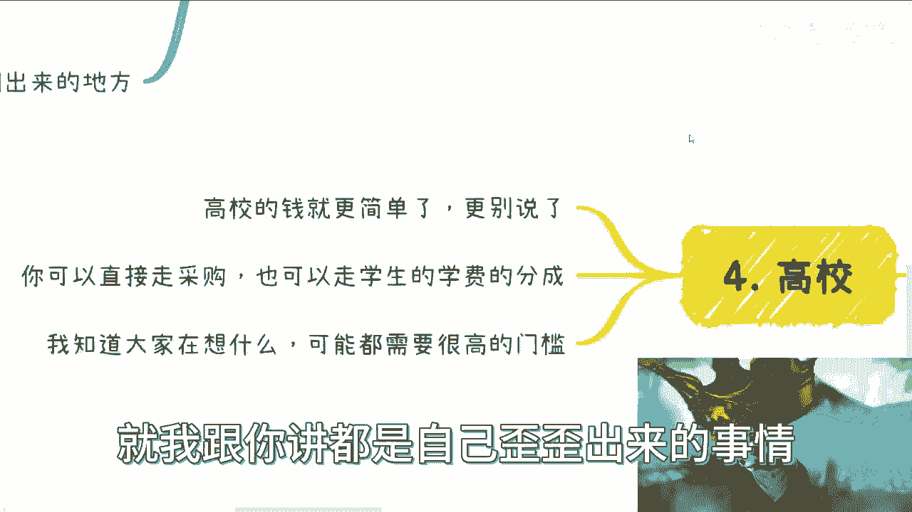
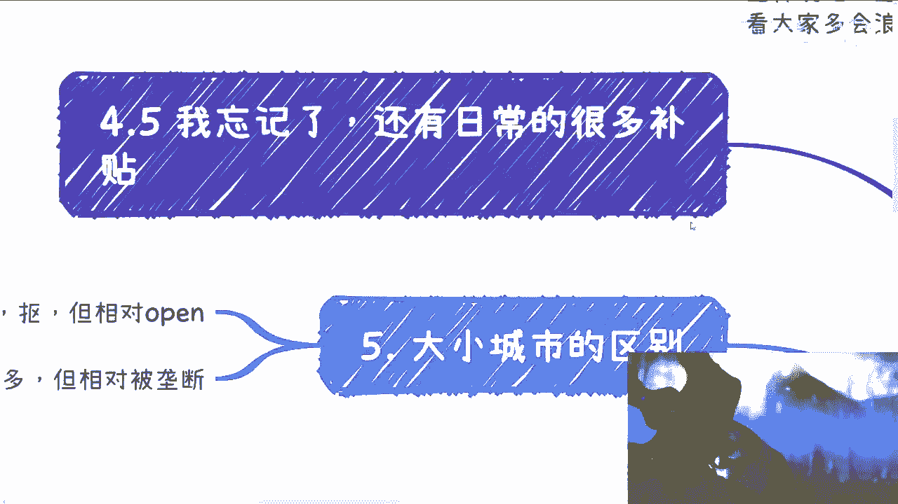
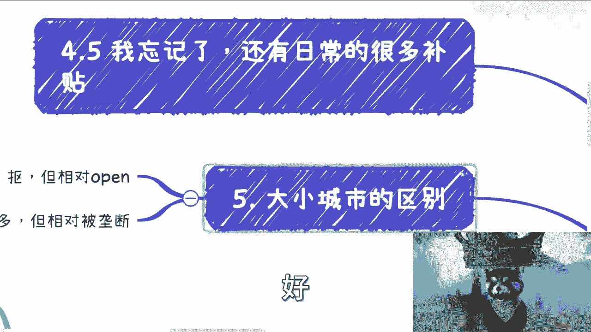
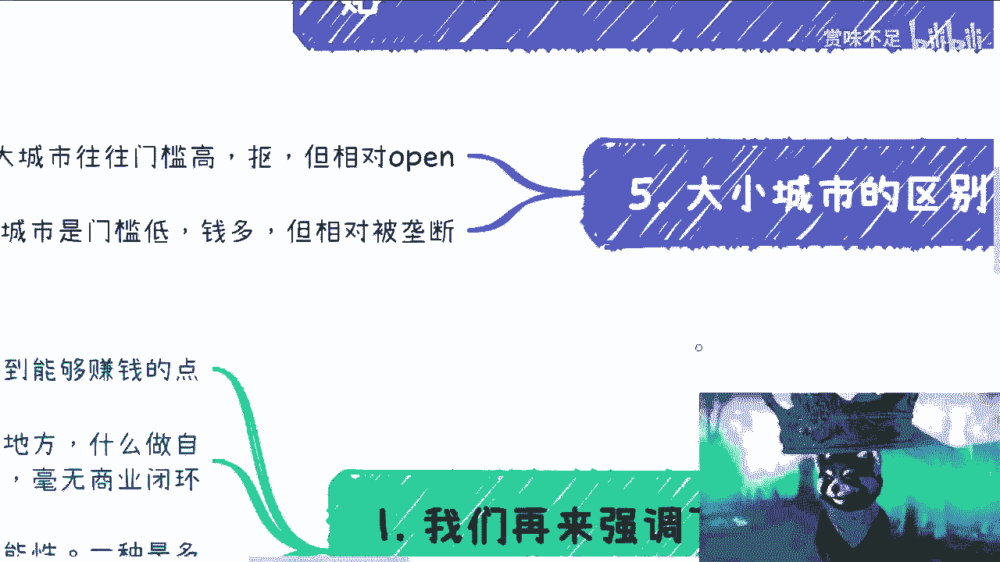

# 充电篇 P1：一些钱我们不赚，并不会省下来 💰

在本节课中，我们将要学习一个核心的商业观念：有些钱，如果我们不去赚，它并不会被省下来，而是会被别人赚走。这句话有两层含义：第一，机会不等人，你不抓住总有人会抓住；第二，这类钱与你提供的具体产品或服务没有直接关系。我们将深入探讨这类“确定性”收入的来源和获取方法。

## 核心前提与商业逻辑

上一节我们介绍了课程的核心观点，本节中我们来看看理解这个观点所需的前提和基础商业逻辑。

首先需要明确一个大前提：本视频所讲的内容几乎没有门槛，不看重学历或背景，关键在于个人的社交关系和行动力。商业中最重要的是**找到赚钱的点**，而不是纠结于具体做什么。关系到位本身就是一个强大的盈利点，其他流程都是形式。

进一步来说，我们要寻找的是**确定能够赚钱的地方**。许多常见的创业或兼职想法（如自媒体、运营、家教）充满不确定性，缺乏稳固的商业逻辑。因此，我们应该聚焦于两种确定的盈利模式分支：

以下是两种确定的盈利模式分支：
1.  **以量取胜**：通过寻找大量渠道方或分销商来增加销量，从而实现质变。例如，如果你能对接100家分销商，即使单家销量不确定，但总量足以保证收益。其商业逻辑可以概括为：**总收益 = 单个渠道平均收益 × 渠道数量**。
2.  **抓住固定支出**：找到那些每年都会有固定预算、必须花掉的钱。这就像“大风刮来的”机会。本课程将重点讲解这一类。

## “大风刮来的”钱：三大主要来源

理解了寻找确定性收入的方向后，本节我们具体看看这些“大风刮来的”钱主要来自哪里。

### 1. 企业固定经费 🏢

首当其冲的是企业的培训、咨询以及创新项目费用。很多人会陷入自我怀疑，认为“我会做别人也会做，凭什么我能赚钱”。这种想法需要摒弃。中国市场足够大，在这个领域卷的人远比在学历和传统职场上少。只要去做，就有机会分得一杯羹，赚取生活补贴。

企业的这些经费（尤其是创新项目费用）通常是每年固定且必须用掉的，不用也会清零，不可能留到下一年或变现。虽然经济下行时部分经费可能被砍，但从社会运作规律看，这始终是一个固定的盈利点。你不去赚，总有人会去赚。

那么如何切入呢？利益最大化的方式是成为供应商，但这在存量或增量市场中都很难。更实际的做法是：**包装好自己的技能或方案（产品）**，然后主动去寻找现有的供应商或分包商，成为他们的“工具人”。认清自己的定位，做能力范围内的事。这就像打游戏，虽然达不到职业选手水平，但足以在区级、市级比赛中夺冠，这同样能带来收益。

### 2. 政府各类经费 🏛️

这一点与企业经费有很大不同。企业的钱没用完，最多是浪费；但政府的经费如果没用掉，可能意味着执行能力不足或未能发现好项目，会影响第二年的预算审批。因此，政府有更强的动力去花掉预算。

政府的经费来源多样，主要包括以下几类：

以下是政府经费的主要类别：
*   **项目经费**：可能来自产业园、协会或各厅局（如大数据局、工信厅等）。
*   **活动经费**：许多地方每年都有固定数量的活动需求，可以从园区管委会、区政府相关部门或协会对接。对接得好甚至可以包年。
*   **培训经费**：主要分两种。一是公务员培训经费；二是地方性的产业扶持培训经费（例如，为发展数字经济，计划培养若干人才并给予补贴）。
*   **投资经费**：一些部门有固定的产业投资预算，用于扶持地方发展。但由于寻找优质项目困难，这部分钱有时也很难投出去。

切入的关键在于胆大、心细、产品包装好。不要自我设限，认为“不好切”，机会都是争取来的。

### 3. 高校合作经费 🎓

高校的钱相对简单，主要有三种合作方式：

以下是高校合作的三种主要方式：
1.  **直接采购**：学校有各种采购需求，方式多样。
2.  **学费分成**：合作开展课程或培训。
3.  **联合申报项目**：与学校共同申请科研或教学项目。

同样，不要觉得高校门槛高而却步，主动出击才有机会。

## 补充：日常固定补贴

除了上述三大块，还有一笔固定的钱常被忽略，那就是**日常的各种补贴**。例如：

以下是常见的日常补贴类型：
*   招商引资中，新企业招聘硕士、博士的人才补贴。
*   企业的水电补贴。
*   人社、教育等部门颁发的人才证书补贴（如考取某些证书后可申领补贴）。

这些补贴的预算政策通常已存在多年，金额固定。就像游戏地图上的资源，你不去采集，别人就会采走。

## 大小城市的策略差异

在寻找这些机会时，需要注意大城市和小城市的区别：

以下是大小城市的主要差异：
*   **大城市**：门槛高、要求多、预算可能相对“抠门”，但环境开放，洽谈和进入的机会相对较多。
*   **小城市**：门槛低、钱可能更多，但更容易被本地关系网垄断。

两者各有优劣，需要根据自身情况判断。

## 总结与行动建议

本节课中我们一起学习了商业中一类“确定性”收入的逻辑与来源。核心在于理解“有些钱你不赚，别人会赚”，并主动去寻找那些必须被花掉的固定预算，主要包括企业经费、政府经费和高校合作经费。

从商业逻辑看，这只是寻找确定盈利点的冰山一角。但在中国，有大量个人和机构依靠这条线活得非常滋润。如果你希望增强抗风险能力，或在打工之外寻找商业机会，就需要心里有这条线。

最后，建议整理好个人背景、材料、问题列表，进行系统性的规划和咨询。主动规划，才能抓住那些“大风刮来的”机会。

