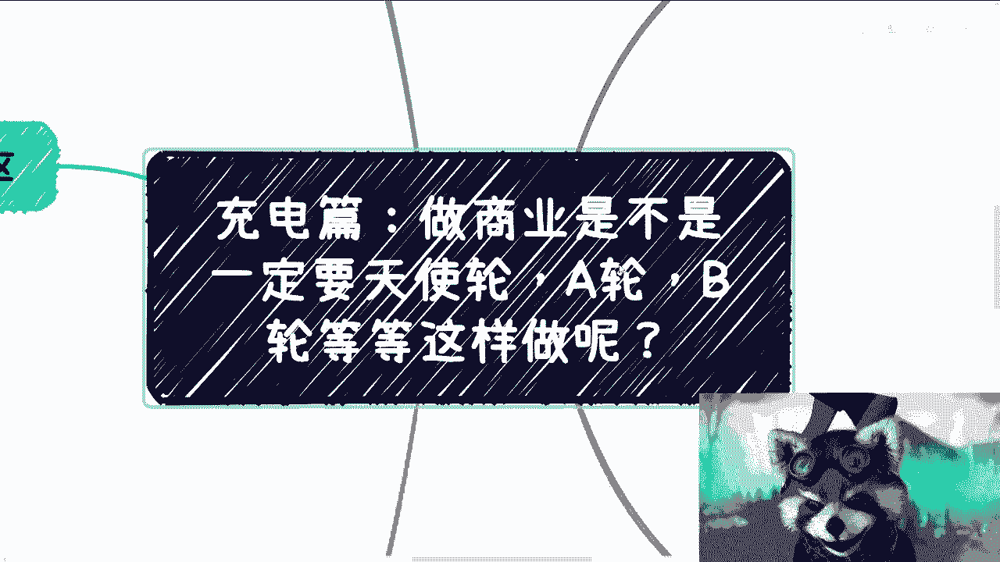
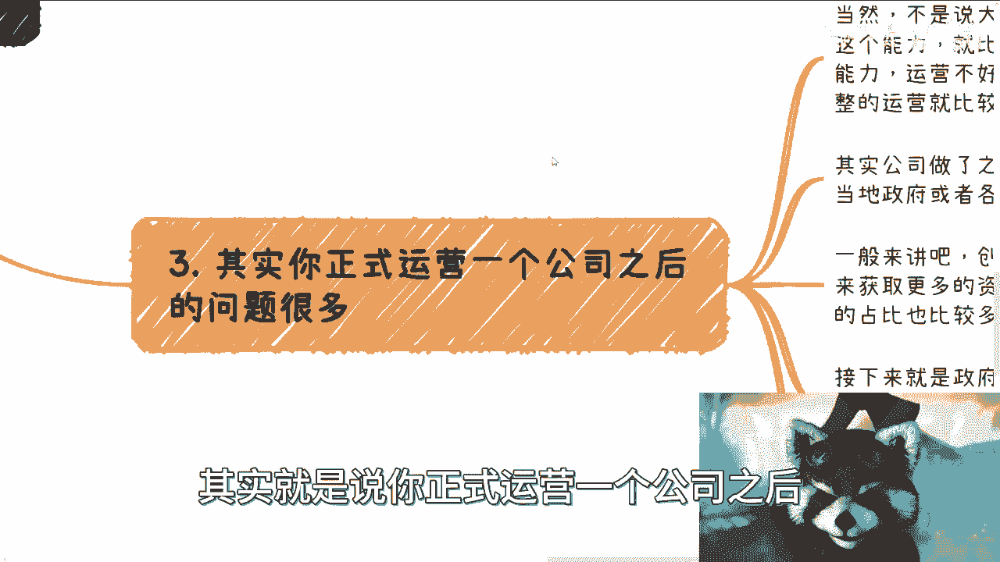
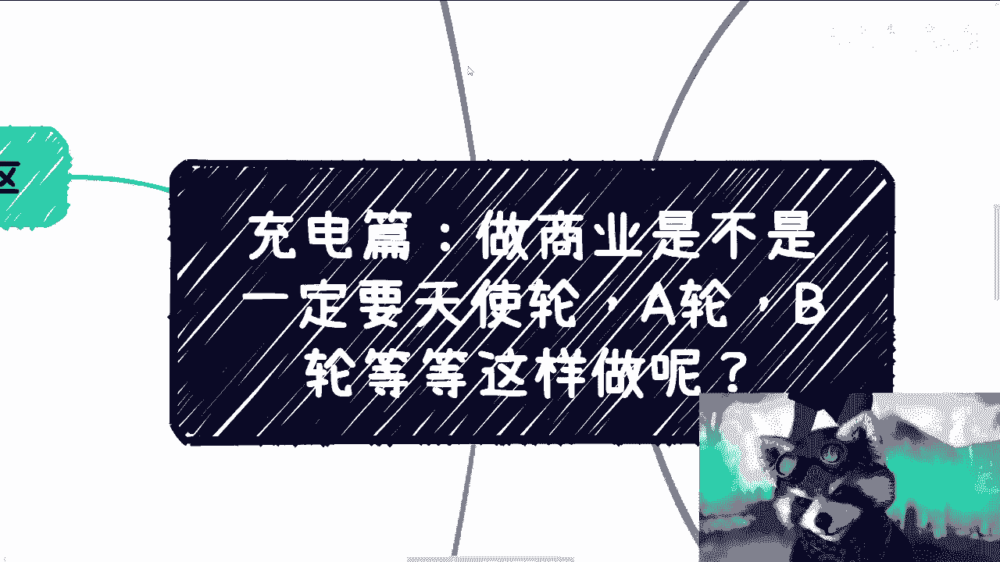

# 商业充电篇 P1：创业必须融资吗？🚀

在本节课中，我们将探讨一个常见的创业误区：是否必须遵循“天使轮→A轮→B轮→C轮”的融资路径才能成功。我们将分析这种执念的来源、融资的真实目的与潜在风险，并探讨对普通人而言更现实的商业路径。

## 核心误区：融资是创业的必经之路吗？

上一节我们介绍了课程主题，本节中我们来看看最常见的误区。许多人认为，创业必须进行一轮又一轮的融资。这种观念可能源于新闻报道或成功案例的片面展示。

然而，当前的商业生态已经非常饱和。无论是面向消费者（C端）、企业（B端）还是政府的产品与服务，市场在多年前就已趋于饱和。后来的创业者往往是在“创造需求”，而非满足真实存在的需求。

对于普通人而言，同时满足以下所有条件的概率极低：
*   拥有一个前所未有的创新想法（idea）。
*   该想法具备被市场炒作和资本接盘的潜力。
*   拥有一个背景强大、能力出众的团队。

因此，将“融资轮次”视为创业成功的标准模板，是一个需要重新审视的误区。

## 融资的根本目的与成本

理解了误区后，我们需要思考一个更根本的问题：融资究竟是为了什么？许多人将融资本身当成了目标，就像为了“争口气”而去考研一样。

但融资的成本非常高。我们需要明确一个公式：

**创业核心目标 = 赚钱（盈利）**

融资只是实现目标的一种**可能手段**，而非目标本身。如果依靠自身现金流就能实现盈利，那么融资并非必需。

选择融资通常意味着你有**超越金钱本身的诉求**，例如：
*   需要投资方提供的稀缺资源、背书或渠道。
*   追求极快的规模扩张速度，而自身现金流无法支撑。

同时，运营一个正式公司并融资会带来一系列持续成本与压力，例如固定的人力成本（工资、社保）、税务合规成本、以及为维持公司运营而必须进行的商务应酬与协会活动。这些都可能消耗你本应用于核心业务的精力。

## 融资过程中的潜在风险

如果你决定融资，必须清醒地认识到其中存在的风险。很多时候，投资方与创业团队的利益并不完全一致。

以下是融资中常见的几个风险点：

*   **退出机制不明确**：投资方可能已规划好退出方式（如后续轮次转让、要求回购），但团队处于弱势，可能最终收获甚微。协议条款可能对团队不利。
*   **丧失主导权与初心**：急于获得资金的团队可能会对投资方过度让步。投资方可能会引入其关联项目进行“合作”，导致新团队为其原有项目提供廉价劳动力或背书，使创业方向偏离初心。
*   **对赌与当下环境**：过去的风险投资（VC）模式已发生变化，如今对赌协议普遍，甚至对赌都难以获得。在当前及未来的环境下，获得融资的难度非常大。

关键在于，融资前必须将所有条件，特别是**退出机制、盈利模式和资源注入方式**摆在台面上谈清楚。

## 适合普通人的务实商业路径

那么，不融资或暂不融资，普通人该如何开展商业活动呢？本节我们来探讨更务实的路径。

对于普通人而言，商业的本质是**以最短路径实现盈利**。我们应该遵循“黑猫白猫，抓到老鼠就是好猫”的实用主义原则。

以下是一些关键建议：

*   **区分形式与本质**：拥有公司、团队和门面（形式）与能否赚钱（本质）没有必然因果关系。可以先用轻资产方式（如个人工作室、项目制合作）验证商业模式，盈利后再考虑是否升级形式。
*   **避免虚荣心与执念**：不要被“必须当老板”、“必须有公司”的执念束缚。一切决策应服务于盈利这个核心目标。将大量时间、精力和资金消耗在维持“形式”上是不明智的。
*   **极端专注与灵活调整**：在资源有限的情况下，必须极端专注于最核心、最能直接产生收入的事情。业务模式应保持灵活，根据市场反馈快速调整，而不是死守一个需要大量资金才能推动的计划。
*   **如果融资，需做足准备**：若确需融资，必须想清楚：后续轮次的规划（“饼”怎么画）、可靠的合伙人分工、以及最需要的究竟是钱还是投资方的特定资源。**资源（背书、渠道）往往比钱更稀缺**。

## 总结与回顾

本节课中，我们一起学习了关于创业融资的常见误区与务实思考。

我们首先剖析了“融资轮次是创业标准路径”这一误区，指出其不适用于饱和市场环境下的普通创业者。接着，我们探讨了融资的根本目的是服务于“盈利”这一核心，并揭示了融资过程中可能存在的风险，如丧失主导权和不明确的退出机制。

最后，我们强调了适合普通人的商业路径应聚焦于**以最短路径赚钱**，避免被形式主义的执念所拖累，在必要时再考虑融资，并且必须做好充分准备。

记住，成功的商业是赚钱的商业。所有的决策——是否成立公司、是否组建团队、是否融资——都应该是实现这一目标的工具，而非目标本身。