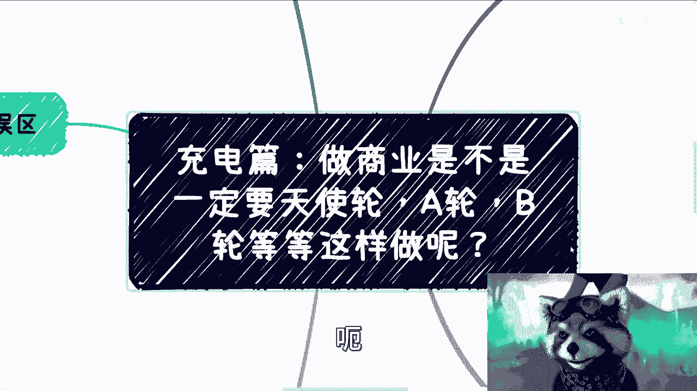
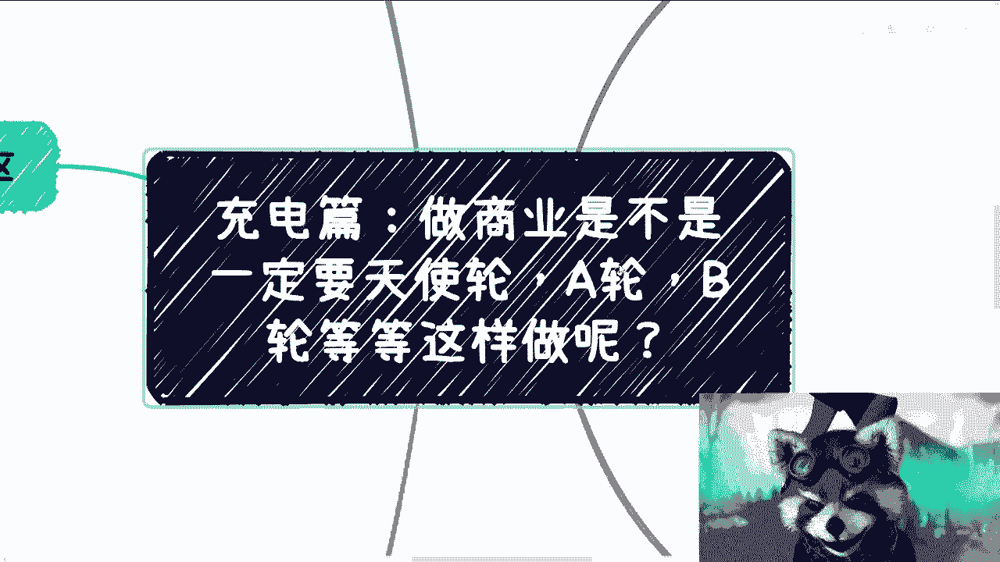
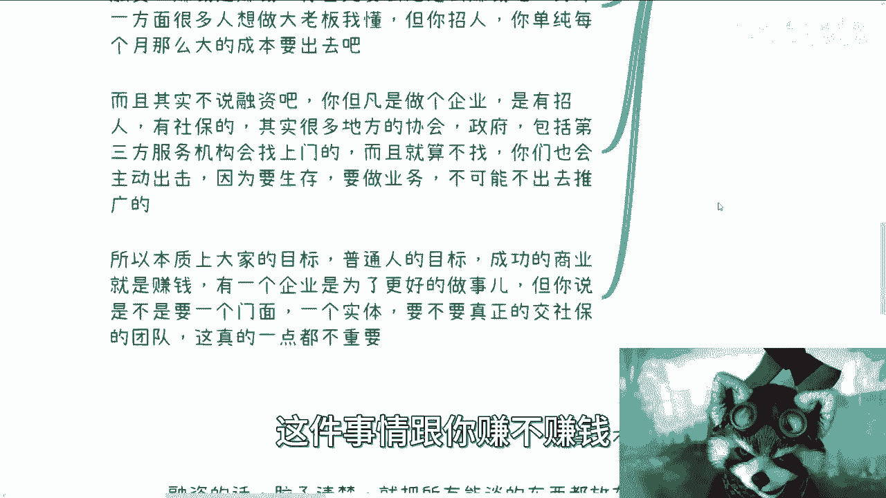
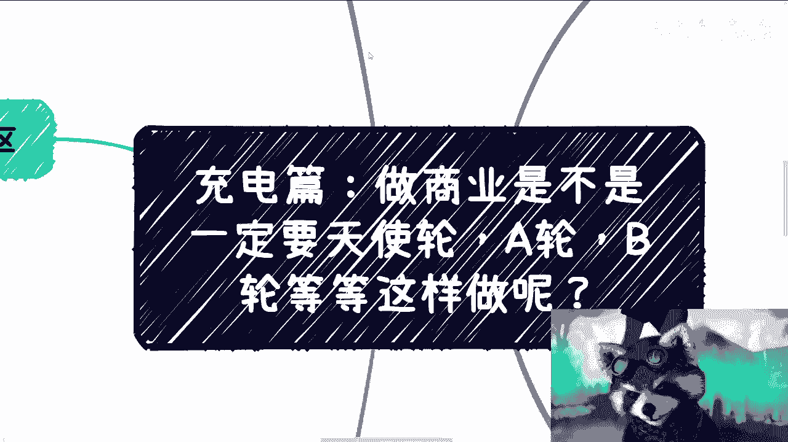

# 充电篇：做商业是不是一定要天使、ABC这样融资往下走 - P1 - 赏味不足 - BV1Ku4y1X75x

啊大家好啊对吧，最近这个大家也正好啊，看看这个基本盘是什么样子是吧，蛮好的，我觉得那么这一期呢主要我们来讲的是。

这个是不是说做商业啊，一定需要这个天使轮，A轮，B轮，C轮等等等这样往下去做，因为我发现我沟通下来呢，其实蛮多的小伙伴呢，他就说这个思想当中啊，有这么一个执念，或者他觉得呃。

就我不知道是不是我以前没说清楚啊，就是他会觉得做商业可能就是要融资啊，然后呢融资呢就是要A轮B轮，C轮这样往下去融啊，那么这个事呢我觉得我就打算好好讲讲啊。

首先我想说最大的一个误区是什么，就是，就最大一个误区是什么，就是说啊很多人啊就是我不知道啊，就是比如说可能新闻啊，或者其他地方各个方面看到的，就是他认为要一轮一轮融啊，那么这个是最大的一个点。

那么一方面呢就是说现在的生态啊，呃普通人他也不可能去创造一个服务或者产品，你知道吗，就是说因为服务跟产品在，就是我们说中国也好对吧，或者其实海外也好，其实很多服务跟产品堆积饱和了对吧，就像我们说。

为什么互联网现在比如说在增量市场里面啊，在存量市场里面已经很卷了，就是因为互联网本身的产品或者所有的服务，可能17年一八年就已经饱和了，就后面呢都是在挖空心思在那边说啊，我要做什么，我要做什么对吧。

那无论是我们给C端用户还是给政府，还是给企业，其实都一样，你知道吗，就是可能一开始是有需求的，那么做着做着做着做到后面来，就是开始没有需求创造需求的啊，那么我觉得这个是一方面，第二方面呢就是说呃我们啊。

你说这个大部分人啊，你说我们能不能想到一个前无古人的id，这个几乎是不可能的对吧，然后你说我要想到一个这个请问古人的idea，同时呢我还得这个idea能够被炒作，同时呢你还有资本愿意来接盘。

同时呢你这个团队还很牛逼对吧，拿出去比如说能够背书对吧，然后还有想象空间，你们想想看，就这个概率有多少对吧，你先别说现在概率有多少，就算放到2000年到2020年的这个过程当中，对吧。

你的这个概率有多少，对这一方面啊，另外一方面我们想想看，就是融资为了什么对吧，就是我觉得就很多人啊，其实可能跟考研一样，就你问他考研为了什么，但我争口气对吧，我现在家族里面没有这个研究生对吧。

我就要考一个，那我觉得考研也就算了哦，因为你成本相对还是不高的，但你融资的成本就很高了，你知道吧，所以说我们这块融资到底为了什么，如果来说我们说我们沟通下来，你们觉得哎融资就是为了赚钱，那没问题。

那赚钱的方式很多，不是说一定要融资的对吧，那么你想想看啊，同样的，那么融资是融资，赚钱是赚钱，如果你要去融资，你肯定得想好怎么赚钱，而且你融资之后的赚钱模式，跟你不融资的赚钱模式可能不一样，你知道吧。

因为融资本身赚钱，你想啊，你就这么想，如果融资今天本身赚钱，你能够靠你的现金流，现金流来做，那你干嘛要去融资呢，对不对，那么话又说回来，就是如果你要去融资，也就意味着你肯定有别的啊，就是更多的诉求。

而不仅仅在钱上面，你知道吧，所以说呢就是另外一方面，就是说很多人想做大老板对吧，想想要有些门面啊，有想必必须要有个实体公司对吧，怎么样，但是就这个执念我理解啊，但是你招人，你单纯每个月的这么大的成本。

你要出去，你想想看你这个心态对吧，包括你的压力，可能会不一样啊，而且呢就是说其实我们不说融资，你但凡做个企业，你要招人对吧，有社保，而且还有很多地方的协会政府啊，包括第三方的这种服务机构，他会找上门。

而且你就想吧，就算他们不找，你也会主动去找他们，因为你要生存嘛对吧，你说不能说我我创业报闭门造车，那是不可能的对吧，你要生存，你要做业务，不可能不出去推广对吧，但是你一旦出去推广，你就想想看啊。

就是说你势必要跟他们合作对吧，可能要做项目，可能要做一些别的东西，但是这些项目这些别的东西，你更多的是，因为你在这个这个这个这个整个的框架下面，你去做，你不得不去做对吧，你说我抱大腿也好，怎么样也好。

你不得不去做，但是你正在赚钱吗，你甚至还会亏钱对吧，所以说本质上大家的目标就普通人的目标，成功的商业就是赚钱对吧，你有一个企业其实是为了更好的去签合同，更好的做事情，不是说你一定今天要做个企业。

然后这个企业里面要招很多人，然后还要A轮B轮C轮这样去融，并不是你知道吧，就说你你你说要不要一个门面，要不要一个实体，要不要一个真正交社保的团队，这件事情跟你赚不赚钱。

本质上没有任何的因果关系哦，那么这个我觉得是这个不要有这种执念啊，第二个呢就是说融资这个事啊。

其实坑还是蛮多的，你首先啊我们一个来说，首先你要想很多时候，先不说团队是不是坑投资人对吧，就大概率投投资人是坑团队的，这个概率概率是更高的，因为为什么，因为所有人都是为了自己的利益考考虑对吧。

这个我觉得没问题啊，就比如说我们以前出去做项目对吧，投资人其实都是所谓的呃，这个就是都讨论好所谓的退出方式才会去投的，只不过呢我们作为拿钱的那一方呢，我们是弱势的，我举个例子，比如说人家投100万对吧。

然后我们干活啊，然后呢投资人如果没有想过，就是从下一轮去退出的话，那么他有可能从二级市场，或者从别的这个这个项目的资金上面，去套利对吧，当然啊我们是有二级市场的，可能比如说很多人的业务没有二级市场。

但是就是说最终啊我们作为这个团队，或者我们作为干活的人，我们可能什么都没有，或者说我们有很少的比例啊，但是对于很多人来讲，他应该是没概念吧，呃他的目的可能就是说啊，我想去拿笔融资对吧。

好那么很多时候呢拿融资这个事情呢，你会发现就是当事人，他一般呢都是急于要钱的对吧，这没毛病吧，大家都是要钱嘛对吧，那么这个时候呢，投资人可能会给你很多建议对吧，就比如说很多项目方啊，其实也没有。

就就很多项目方其实没有什么初心，你知道吧，就有点有点投资人说什么是什么的感觉啊，那么更多的还是先拿钱，就是一切以拿钱为主啊，能让步就责让步，能退步则退步对吧，但是做项目呢其实你会发现可能做着做着呢。

他就不是你自己原本那个项目啊，跟你原本的初心啊，跟你原本的这个这个做事方式，可能就不一样了啊，呃你可能过了一段时间，你最终就会发现，可能自己就说换那个打工的方式罢了啊，那么另外一方面呢。

就是说投资人可能会介绍自己投过的项目，或者说合作的项目进行合作啊，那么当然这个也是正常，也是正规的操作，但是呢对于很多刚起步的项目来讲呢，你会发现很有可能是投资人利用这个新的项目。

给自己别的项目去做一些背书啊，或者做一些苦力呀，做一些劳动力啊，对啊，当然了，你要说这个是投资人的这个命令对吧，或者说这个这个给钱了之后，我们听他的，这也没毛病啊，但是呢其实呃很多人他没这个意识。

你知道吧，他可能会觉得啊真的是啊合作方对吧，真的可能是怎么样的，然后傻乎乎给别人去打工对吧，那么前几次呢其实在视频里面我也提到过，就是以前吧呃中国前几年呢都是风险投资啊，都是风险投资。

近几年呢就变成了对赌啊，然后现在呢就连对赌都不对赌了啊，毕竟就是这种对赌的风险也很高对吧，所以说就当下这种情况或者往后这种情况，你说要是拿个融资很难很难啊。

那么第三点呢，其实就是说你正式运营一个公司之后。

其实你会发现呃这个问题也很多，当然啊不是说大家别运营啊，大家不融资，这个我后面会说的啊，只不过就是说我发现很多人没有这个能力，你比如我我也没这个能力对吧，我就不想去搞这些事情，你都搞得太烦，你知道吧。

就说我就说自己认识到了，我没有这个能力，我运营不好对吧，你让我比如说你让我带运营，比如说你就让我代运营某个团队对吧，或者某一个业务线或者某一个部门，这个也就算了对吧，你让我直接完整的去运营这个就很难啊。

那么其实公司做了之后呢，就是有税收的，那么税收呢就是啊比如说跟发票啊，跟当地政府啊，或者各方有税收指标的部门啊，或者协会啊，这些都有关对吧，那么你想嘛就像我们刚刚说的，一般来讲。

那很多创业公司都会加入什么联盟啊，协会啊，来获取更多的一些资源对吧，就其实也没什么毛病啊，但是你会发现就是现在往后呢就是啊协会啊，联盟啊，这些东西可能这个区的比例比较高啊。

那么也就是说你可能获取不到很多实际的，对你公司有帮助的东西，往往是你可能先被就说割一刀，你知道吧，那么接下来呢我们就是之前视频也提到过，就是政府项目，其实无论为了名还是为了利啊，就是你多少。

其实都还是会做一些这个政府项目的，但是这里面真正能盈利的其实很少很少啊，倒贴的可能会费比较多，而且我也直白点跟你们讲，就算合同签了，就是出尔反尔也多了去了，你能怎么滴，你就想看你能怎么滴对吧。

所以说这个东西呢就跟贷款是一样的，就是你每个月啊，你如果清楚你说啊，我每个月要付出多少的工资啊对吧，我每个月就是要出去多少五险一金啊对吧，或者怎么样子，那你包括要做销售啊，做商务啊对吧。

你可能就没有心思再去集中做你想做的事情了，因为你心态不一样了，你知道吧，所以说嗯我在这地方也给你们举个例子，你像我一开始就最早的时候，可能3月份的时候也有人就是当时咨询我嘛，就说他做那个。

啊也有人比如说当时他做什么呢，他做那种短视频啊，啊做那种呃给别人那个企业做短视频服务的，那么这个时候呢他就跟我说，他说哎我能不能找一个大佬对吧，给我这个直接给我一些单子或者怎么样。

那我说你得先认识人家大佬对吧，或者怎么样，那么这个时候呢我就跟他说，你无论怎么样，你现在如果没有背景，没有些东西，你就得慢慢慢慢一步一步往上走对吧，但是问题在哪里呢，他就是我，我发现了。

他一开始呢其实不是很愿意采纳我的这个方案，那我后来发现为什么呢，是因为他也跟我说嘛，就说哎可能我这个月的房租我都付不起了对吧，或者怎么样子呢，就是说我就是要赚钱的，那但是你想想看啊。

就是你如果真的是已经很拮据了，那你就去打工对吧，你不能想着说我要去做一件什么事情，那但凡你做一件什么事情，你就不能被别的东西，我不管是钱也好，还是别的东西也好，去推着走，因为你但凡推着走，你我跟你讲。

你逃不逃脱不了的，就是你的思维压力，会不会就是跟你原本的最早的那个，初心就不一致了，你知道吧，那么这个是第三个，那第四个呢就是说我们就说啊，就说呃有融资就不融了吗，啊那么事实上那肯定也不是对吧。

就是融资的话呢，我觉得啊就是脑子清楚，就是把所有能谈的东西都放到台面上去谈啊，就是比如说啊这个投资方你就问对吧，你要怎么退出对吧，是不是啊，是不是现在不退出，或者说是不是等到几年后再退出对吧。

或者说你想怎么赚钱对吧，赚钱的机制是什么，你想通过哪些渠道方面去赚钱对吧，那么包括还有什么呢，就是说呃融资这件事情啊，往往团队呢是除了要钱以外，还需要那个投资方给资源的，因为很多时候钱真的不是最重要的。

因为我们可以通过各种别的方式去，拿到一些零散的投资，就是几10万几百万的对吧，但是资源这个东西很重要啊，如果来说呃，你今天要去融资对吧，你找一个这种土老板，除非他能给很多钱，比如说几千万这种对吧。

那但凡他说我就是几10万或者小几百万的给你，那么其实这种呢往往比如说还不如不要，因为对于很多资方来讲，很多项目方来讲，要资方来投资钱是一部分，但是背书最重要对吧，你比如说红杉啊，或者其他的对吧。

那你包括某个政府基金对吧，都是一样的对吧，钱可以从很多地方去找去拼，但是呢你资源是很稀缺的，你知道吧，那么同时呢融资在一开始呢你就要考虑好，就是说白了你跟你投资人呢就是一伙的啊。

你跟他就是一条绳上的蚂蚱啊，你跟你和他也好，或者你跟你的小伙伴也好，就是在一开始其实就得内部沟通好，就是比如说后面几轮怎么融对吧，到底这个饼怎么画对吧，你天使轮这个饼画完了，那A轮怎么画呢。

B轮怎么画呢，这个东西其实都是要规要有规划的，那当然啊你可以后面去做微调，这问题不大，但是你不能说这个东西我走一步看一步，这个东西走一步看一步基本上就废了啊，那么本质上这个饼怎么画，方向是什么。

你一开始都得想好啊，你需要有多个可靠的小伙伴来分工啊，你不能哎呀，因为有很多人，我觉得就是就是就是他没有经历过，所以他没有想过，就是比如说做团队，做项目啊，这个里面所付出的经历。

你很多时候一天不要说24小时，你一天48小时可能都难，你知道吗。

所以说就是说你最好还得有靠谱的小伙伴，给你来做分工啊，那么呃我总结一下啊，就是说普通人的这个商业啊，其实这就是本质上来讲就是最短路径去赚钱，你也别管什么路径对吧，就像我们以前一直说的，你黑猫好猫。

你能抓到老鼠的就是好猫，你管他什么猫呢，对不对，你就好像所有人谁不想当老板，谁不想有一个体面一点的门面，谁不想有一个公司，谁不想有自己的团队，对不对啊，但是就是说你要想啊，好的投资人，好的合作方。

好的合伙人，好的产品，好的业务，这些东西都是可遇不可求的对吧，你就像我们打工赚钱，谁不想去好好打工退休啊，啊谁想去折腾，有的没的，没人想去折腾折腾啊，你要像我以前，我可能56年前78年前我就想过了。

就是能不折腾我就不折腾，我为什么要去折腾，这不吃饱了撑的嘛，对不对，那这不是没办法嘛对吧，所以说呢我觉得很多东西我们控制不了啊，所以就是说但凡真的想要去做，我为什么一直跟大家讲说极端一点。

因为这个东西上面你不极端做不好呢啊，而且呢也不要去，就是说被自己那些有的没的的执念。

和就是说虚荣心去束缚，没必要，真没必要啊，就是就是就是我们就是说直白一点，就是说事实的就是事实的是虚的，就是虚的啊，没关系的啊，不要说你非要达成这个时代，然后花大量的精力，大量的时间，大量的物资对吧。

成本去做没有用的啊，这就好像有很多人会呃，以前就跟我说嘛，他说哎我想去考证书对吧，我考各种各样的证书哎就是你跟他讲没用吧，他也不信啊，但是真的考出来吧，你说有啥用呢对吧。

好吧行吧，那就这么着吧，啊这个嗯后面反正我想想吧啊，就各个方面有哪些可以还能跟大家多说说啊，反正基本盘啊大家都了解啊，有什么呢，反正也希望啊就是充电归充电啊，有什么呢，也是希望大家整理好好吧。

有什么可以那个咨询我好吧。