# 充电篇-成为独立思考的人---P1---赏味不足---BV14p4y1N762

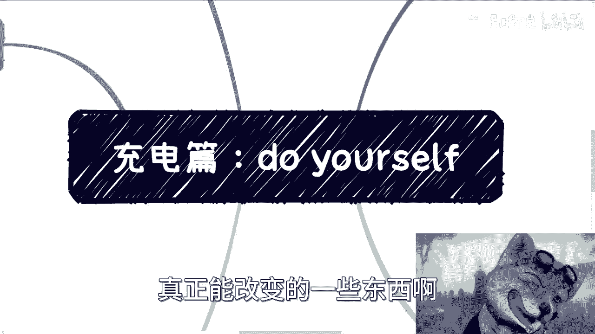

在本节课中，我们将探讨如何成为一个独立思考的人。课程将围绕三个核心方面展开：认识自我、明确目标与定位、以及有效搜集信息。这些是摆脱外界干扰、形成独立判断的基础。

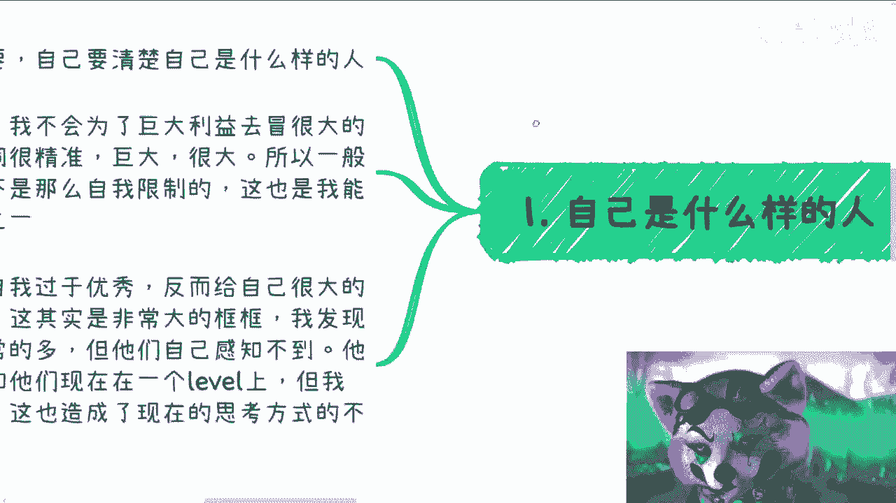

## 认识自我：我是谁？🤔

上一节我们介绍了课程概述，本节中我们来看看独立思考的第一步：清晰地认识自我。了解自己的底线、特质和局限性至关重要。

我清楚自己的底线在哪里。我不会为了巨大的利益去冒巨大的法律风险。用词很准确，“巨大”意味着在一般情况下，我并没有过度的自我限制。

这是我与许多人接触沟通后总结出的，我与他人不同、并能走到今天的原因之一。很多人由于家庭环境优秀，从小成绩好，接受的教育也比我好很多。我从小是散养长大的，甚至为了生计卖过报纸、打散工。

打散工一个月才200元，我记得很清楚。吃饭规定只有半小时，没有地方坐，只能蹲在楼梯上。很多人从小环境和各方面都比我优秀。

但这反而给他们带来了很大的压力和枷锁。这是我接触到的，包括从小认识的和现在认识的一些很优秀的人，他们的发展曲线越来越平缓的原因。他们的压力太大，自我设限也太大。他们认为世界有一个固定的框框。

而我不一样。对我来讲，整个世界的地图没有一个预设的框框。好的我会去看，不好的我也会去看。对我而言没有绝对的好与不好，我觉得所有东西都是未知的。

但对他们来说不一样。他们由于过于优秀，所以觉得自己有一个明确的边界。比如到现在，很多人沟通下来，甚至一些朋友，会觉得我和他们在同一个“标签”上。也许现在可能一样，但以前很不一样。

这造成了我们很多思考方式和做事方式的不同。这也是我觉得明明他们能够更优秀，明明他们能够做到更多东西，甚至帮助更多人，但却没有做到的原因。甚至他们的整个发展曲线越来越平缓。

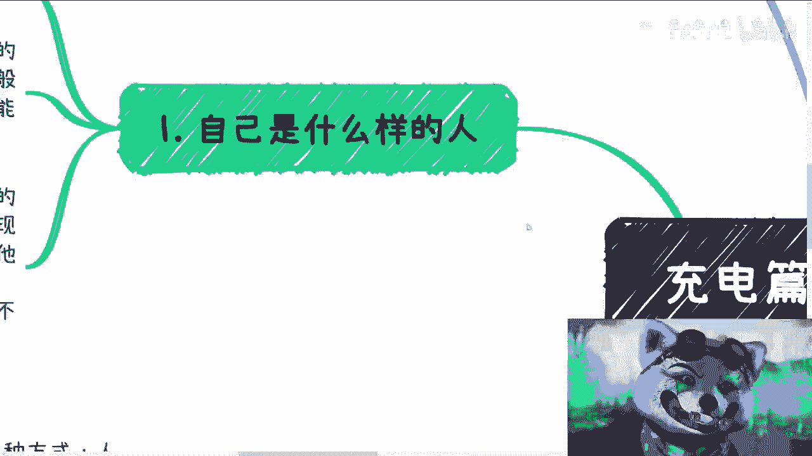

很多人可能自己真的很难感受到这一点。你们记住这句话，回头可以去审视周边很多真的很优秀的人，但他们真的没有做到太多，也没有做成太多。你们可以去聊聊看，为什么。

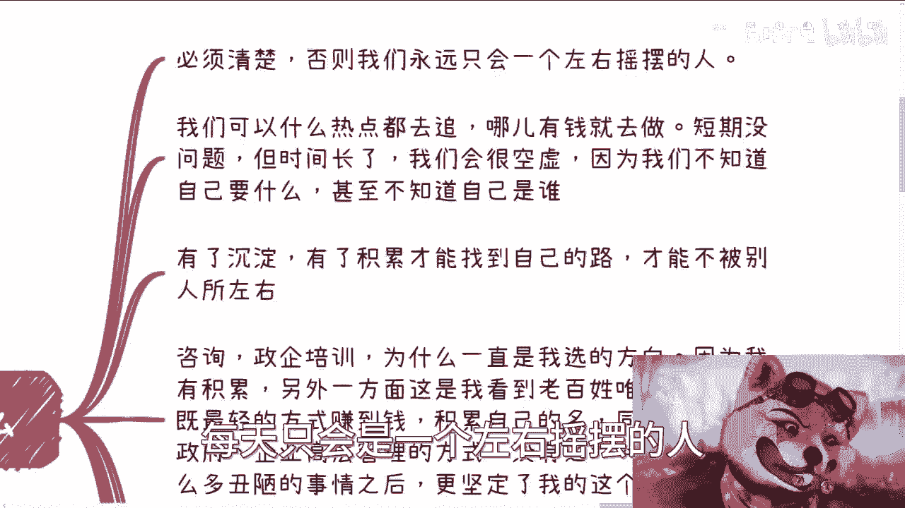

## 明确目标：我能做什么？🎯

上一节我们探讨了认识自我的重要性，本节中我们来看看独立思考的第二个支柱：明确自己能做什么、要做什么。这是避免人生左右摇摆的关键。

也许你很优秀，但如果你不明确目标，你也只会左右摇摆。我们可以什么热点都去追，什么有钱就去做。短期没有问题，但时间长了我们会很空虚，因为我们不知道自己要什么，甚至不知道自己是谁。

这是一个过程。你赚到第一桶金，碰到很多人，你会觉得很爽，觉得好像改变了阶层，觉得未来能赚很多钱。但你要知道这很有可能是昙花一现，很可能只是短期内的一个爆发。

你要长期去做，要到你三四十岁时，明白你是谁，或者你要什么。这很难。你可能回过头去想，人工智能也做过，大数据也做过，农业也做过，什么都做过。但到底我是谁？我能做什么？我的定位到底是什么？

就是我在社会里的定位，在行业里的定位，在我的合作方、上下游里的定位，别人给的定位是什么？你不知道。甚至你会随着年龄增长越来越慌。因为可替代你的人越来越多。

你必须找到自己的沉淀。有了积累，你才能找到自己的路，才能不被别人所左右。就像咨询、政企培训，为什么这一直是我选的方向？为什么我不愿意加入别的公司去做？为什么我一直愿意一个人做，或者说一直愿意以合作方式去做？

因为一方面我有积累，我有经验。另一方面，我看到这是普通人唯一一条能够以最轻的方式赚到钱、积累自己的名声，同时又能切入到政府、企业高管管理层的途径。没有之一，我没看到别的路。

在见到那么多丑陋的事情之后，可能上到CFO，下到基层，就更坚定了我的这个定位。很简单，但凡我有点关系，或者但凡我已经穷到买不起衣服、没有地方住，我也不会做这些事情。正因为我上不上下不下，所以我必须走这个方向。

因为自始至终我的定位跟大家一样：我卷不过别人，也拼不过别人。这很正常，又不是皇二代、富二代，甚至我比大部分普通人可能还要惨一点。虽然我不能说我比那些四五线城市的小伙伴惨，但作为一个在上海的人，我觉得我从小卖报纸、打零工，一个月200元已经很惨。

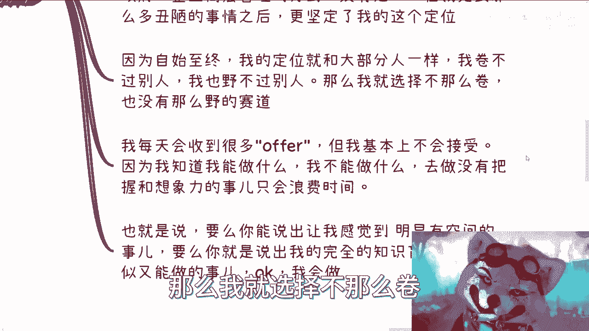

那么我就选择不那么卷、不那么“野”的赛道。没有办法。我跟你们这么说，我每天会收到很多工作邀请，但我基本上不会接受。因为我知道我能做什么，不能做什么。去做没有把握和缺乏想象力的事情，只会浪费时间。

那是什么意思呢？要么你能说出让我感觉到明显有上升空间、天花板很高的东西。也就是你能说服我，不要说出来一个以我的认知感觉是“胡说八道”的东西。要么你就说出来我完全的知识盲区，我不懂，但是呢你又能说服我，感觉我能在里面做点事。OK，我会做。

在这个时候我不会去在意所谓的风险或其他东西。为什么？因为我会一边做一边去评估，但这不会成为我做这件事情的障碍。就这么简单。

## 搜集信息：如何获取真相？🔍

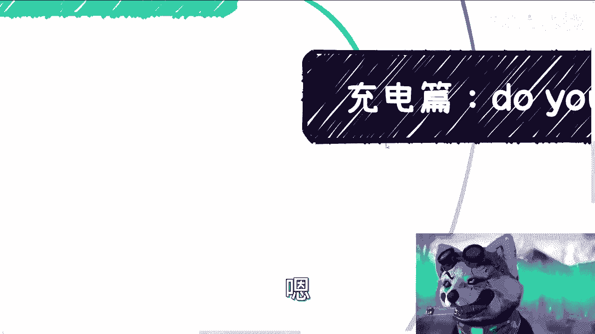

上一节我们明确了目标与定位，本节中我们来看看独立思考的第三个关键：如何有效地搜集和甄别信息。对我来讲，这事其实很简单。

我曾经说过，我就两种方式：**人肉大数据**，以及依靠那些商业合作伙伴。比如我今天早上逛了一圈短视频，各个话术都有：有让你读研的，有让你放弃的，有让你去大厂的，有说大厂不好的，有说要工作的，有说不要工作的，反正什么都有。

但其实这些并不重要。本来就没有一个正确答案，而有没有正确答案也不重要。重要的是，你我今天听到任何一个人说一句话，或者看到任何一个视频，我们得要明白它背后到底是什么。

你但凡只要知道这些视频背后都有自己的利益绑定，OK，我为什么去听他的？跟我有什么关系？难道我想做他的韭菜吗？那不是。

以下是信息搜集的两个核心方法：

1.  **人肉大数据**：我想知道我所在的行业最近发生了什么事情，那么我就会去找各个地方的合作伙伴问两句。那么多人的信息，我取其交集。就这么简单。我不信他们，我信谁呢？难道我去听信网上一个陌生人，或者网上一个莫名其妙做自媒体的人？
2.  **依靠深度合作伙伴**：对于政府公务员或其他相关情况，你比如说昨天，我找了两个在省政府工作的，大概聊了一个上午。我多问一些政府领导或者公务员，跟公务员的这些人，我也就知道了。别的我不知道。你说我会去嘘寒问暖问他们“你们过得怎么样啊”？没有意思，他们也知道我不是这种人。别的我不用知道大家怎么说，我也不关心。我只关心我所获得的信息是哪些。

而他们这些信息才是真正有价值的信息。真正有价值的信息是在一个行业里面深耕，同时他跟你、他跟别人没有巨大利益关系，亦或者他跟你有巨大利益关系的人，他说的话才是真话。

但凡他为了一些小毛小利，他的话都有失偏颇。什么意思呢？也就是说，比如他希望从自媒体上面一年赚个100万，那不好意思，这种人你没必要听他的。

这就好像前两天网上还有人说，有人问结婚之后资产要不要上缴，薪资要不要上缴。他说“我一年50万，来问一个树洞，我要不要上缴”。我怎么回答的？我的意思就是说，你要是一年50万，你都在这边纠结，那你就别结这个婚，也别谈这个恋爱，也别问这个问题。

为什么？因为不好意思，你的格局就这么小。因为在我看来，上缴不上缴并不重要，重要的是我单位时间一单能赚多少钱。如果你认为你一年就赚50万，那不好意思，拜拜。我觉得你随便做什么事情，你的格局就这么大，没什么好说的。

你知道吗？就没有什么好说的。不单单这个问题，任何一个问题都没有什么好说的。

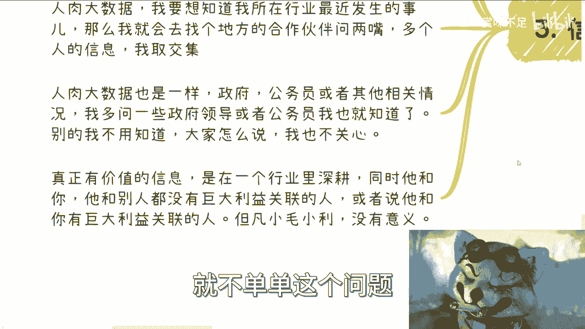

那我们回过头来讲，为什么这些政府的领导、为什么这些其他人愿意给我透露真实的信息？是因为也许我现在没有这么大的成就，但是他们知道我的格局并不限于此。但凡我的格局很小，那他们就会谨慎，就会对自己的言行非常谨慎，那他们也就会跟我透露很少。

但是我给他们、我自始至终给他们的这个感觉，和大家交流合作下来的情况很简单：就是我也许当下整个level没那么高，但是不好意思，我的格局的确也没有这么小。我不会因为一些有的没的事情，去给大家造成不必要的麻烦。我最大的麻烦是什么？就是这个扭曲的世界对我这样的人的恶意太大。

## 如何实践：迷宫里的弹珠 🎱

也有人会说，你说了这么多，怎么做到这些？我给你们打个比方。

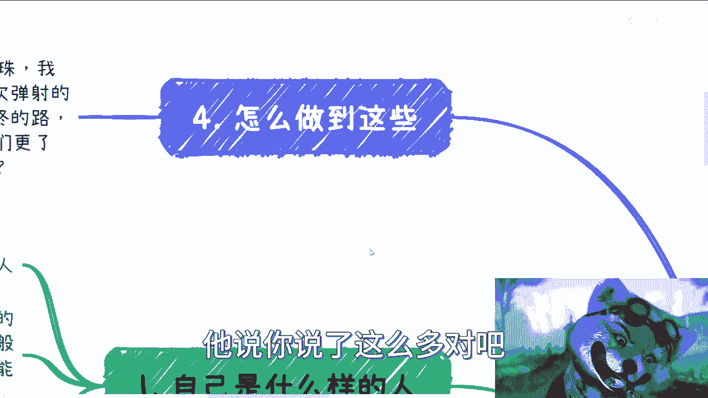

我们都在，我们都像是在一个迷宫里的弹珠。我们不停地来回弹射，有可能路径是重复的，也有可能路径是不重复的。但你只有不停地弹射，才有可能找到最终的路。也许你也找不到最终的路。

但是就像我之前有次视频里说的，你只要弹射得够多，你只要看到更多，你只要更多地了解社会、了解人类，你也不枉此生。你就活一次，怎么了呢？我一定要找到最终路吗？不一定。

但是我相信在这个过程当中，并不是只有“找到”和“不找到”这两个答案。一定会有一些跟你现在循规蹈矩、活在别人的世界里的活法不一样的东西。

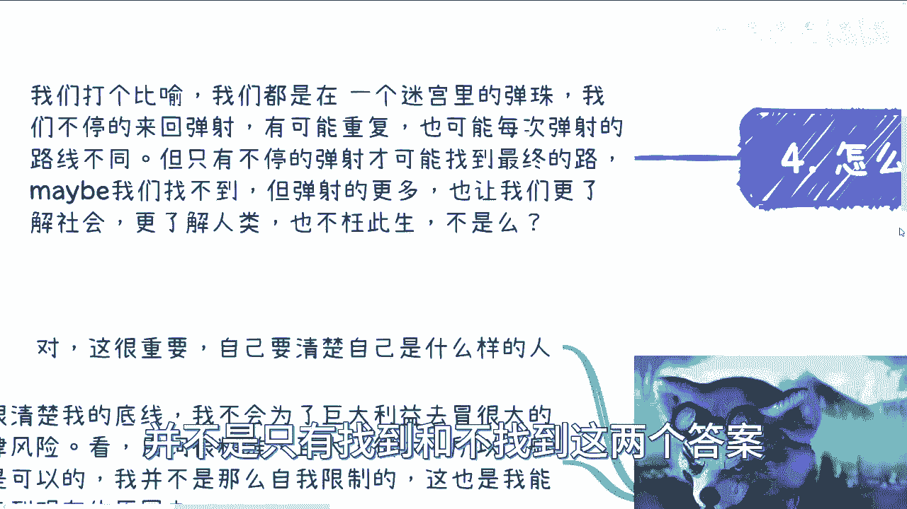

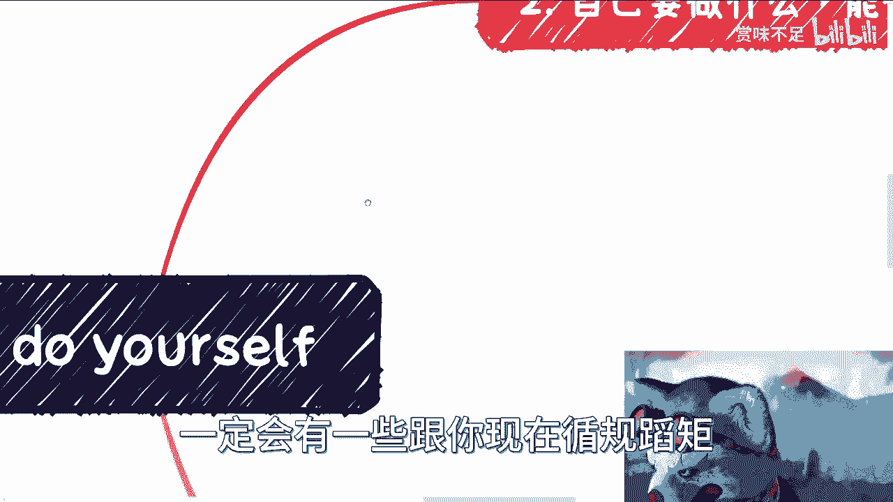

## 目的与总结 💡

那么我来说我说的这些目的是什么？当然我不是为了大家30块钱，自然这些也不可能只值30块钱。我要是为了所有人的钱、为了大家喜欢，那我就不可能去讲这些东西。因为你从我的定位来讲，它就不可能是个大众内容。大众要是能有这么一个想法，今天也不会变成这样子。

我现在也没有一丝“助人情结”。所谓自作孽不可活。反过来说，如果要自救，一切都是先从自己开始自救开始，而不是别人来救。别人救不了的。

我认为社会上需要越来越多做自己的人。很多时候这样的人越多，我们需要组团去赚钱，因为一个人的力量是很低很少的，去赚钱，去抗争，去PK资本家，甚至去PK上面的人。

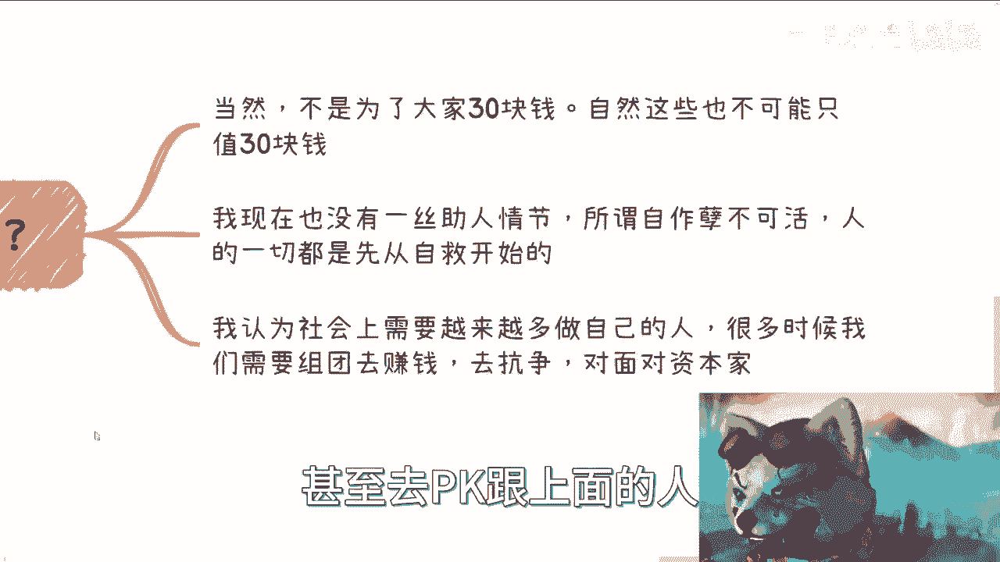

这就像我最近做咨询的时候跟别人说的：有很多话呢，其实你不方便讲。而且有很多话呢，你同样一段话，对于不同格局、不同认知的人听进去，他感觉是不一样的。

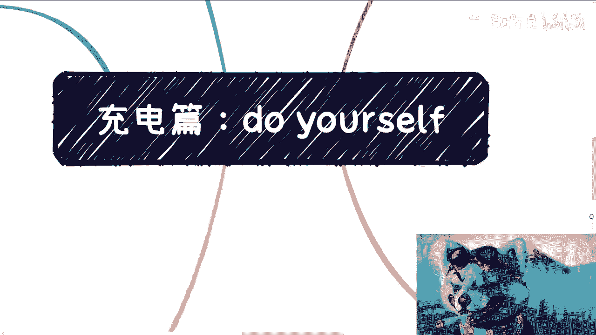

就像我说到现在，很多时候能认可我的人，他是极度认可我的。但凡他不认可我，那么我敢说大概率他就会举报我。为什么？因为没有办法，他不明白更深层次的。在他的概念里面，只有所谓的二极管思维。那怎么办呢？而且他好像认为这个世界跟这个社会，只有好跟坏这两个东西，或者他会认为很多机构、组织是好的。

说白了吧，其实真正去看明白呢，首先我觉得真正看明白就两点：

1.  第一，这个社会所有的东西都是**经济体**。为什么大家说一定要跟钱挂钩？因为你不跟钱挂钩，不可能，因为他从始至终他都是个经济体。
2.  第二点，是在我看来，他没有什么好的地方，他最多是坏的。所有在坏的里面，矮子里面拔高的而已。

OK，那希望真正的大家能够多多想想吧，不要被这些有的没的去误导。这就像我一开始3月份做视频的时候就说得很清楚：不可能跟大家来讲怎么打工，我也不会教你们怎么到工作里面去卷。没有意思。

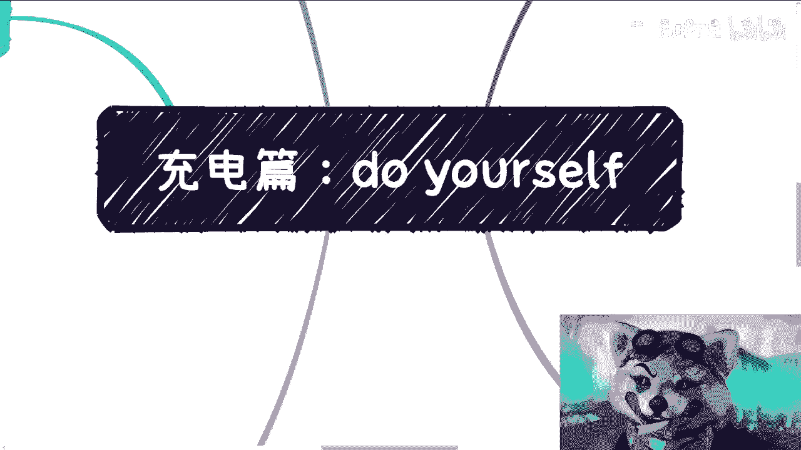

因为所有在工作上的东西，在我看来一刀切是什么？就是只要是工作，只要是打工，你的主导权、你的生存权都在对方手上。有什么好卷的？没有什么好卷的。

这就好像你今天被绑在一个密室里，绑在一个箱子里面，然后往海里去沉。然后你在那边想，我绑都被绑住了，然后我开始begging，我开始求饶，我开始干嘛，我开始做各种东西。有意义吗？没有意义的呀。

也许1万个人里面有一个人，他打动了对方，他得救了。但是剩下9999个人还是溺死。没有区别的。

---

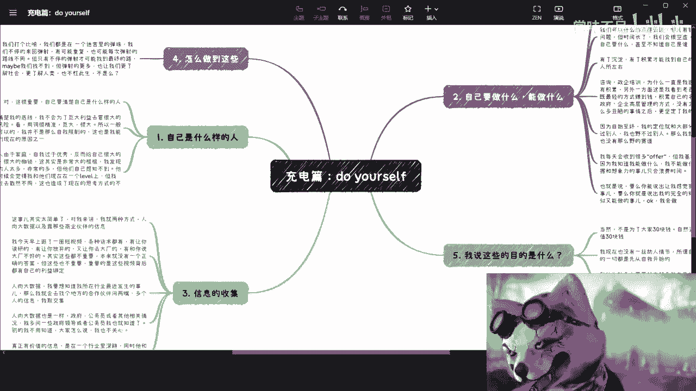

**本节课总结**：在本节课中，我们一起学习了成为独立思考者的三个核心步骤。首先，**认识自我**，明确自己的底线与特质；其次，**明确目标与定位**，找到自己独特的发展路径并积累沉淀；最后，掌握**有效搜集信息**的方法，通过“人肉大数据”和深度合作伙伴获取真相，同时保持大格局以避免被片面信息误导。独立思考的本质在于摆脱外界设定的框架，通过不断探索（如同迷宫中的弹珠）来形成自己的认知体系，并最终找到属于自己的生存与发展方式。