# 社交入门教程 01：为何社交与如何起步 🚀

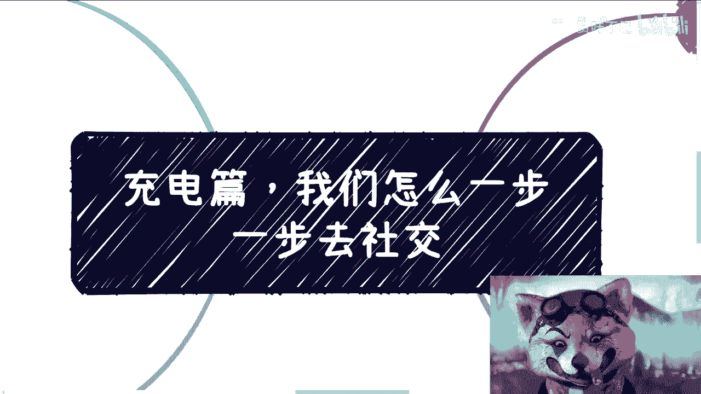

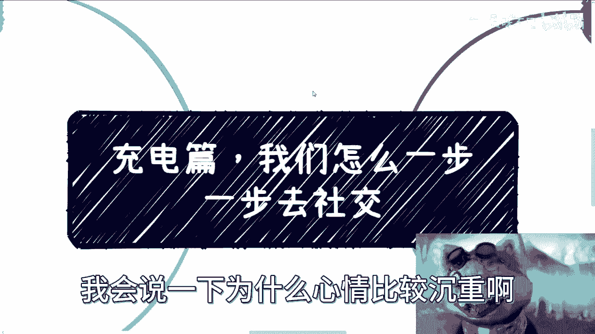

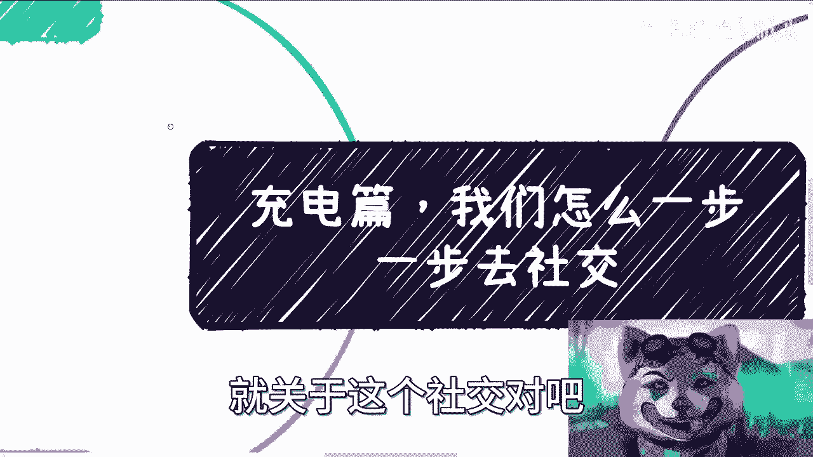

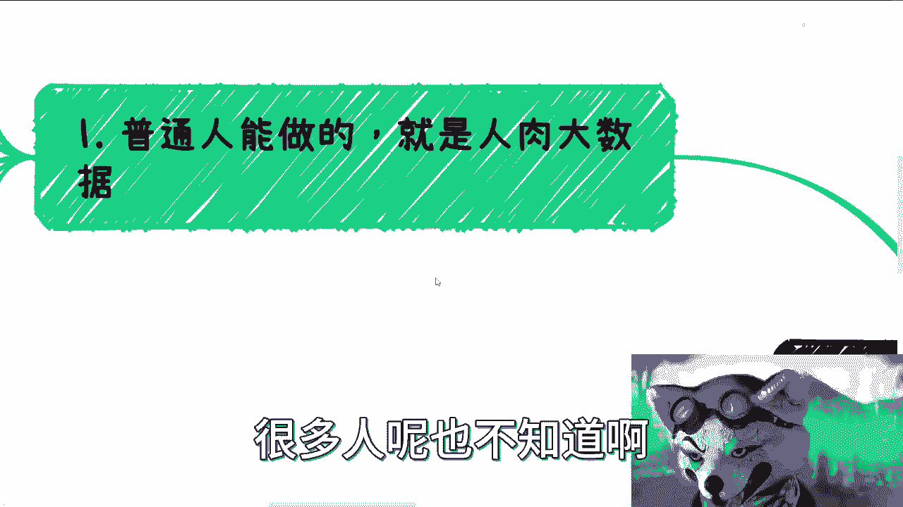

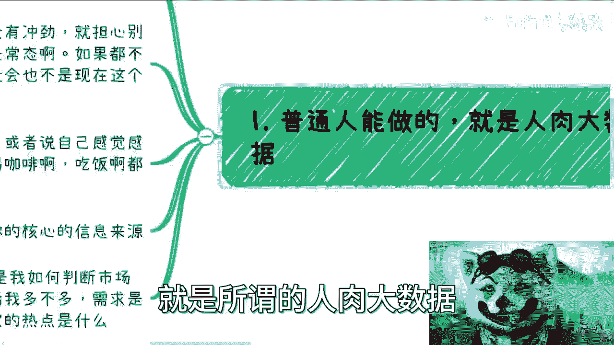

在本节课中，我们将学习社交的核心目的、起步方法以及其在当前环境下的重要性。课程将分为三个主要部分：社交的核心概念“人肉大数据”、从零开始的社交策略，以及社交的最终目标与时代背景。

## 什么是“人肉大数据”？🔍

上一节我们介绍了课程概述，本节中我们来看看社交的核心概念——“人肉大数据”。

对于普通人而言，最可行的社交方法是进行“人肉大数据”筛选。这个概念指的是，我们只能通过逐一认识、接触并筛选人的方式来构建自己的社交网络。

以下是“人肉大数据”的操作流程：
1.  无差别地广泛认识人。
2.  从认识的人中进行初步筛选。
3.  与筛选出的人进行更深入的接触（如吃饭、喝咖啡）。
4.  最终筛选出少数可以合作的对象。

这个过程可以用一个简单的公式表示：
**初始社交圈 → 初步筛选 → 深度接触 → 最终合作圈**

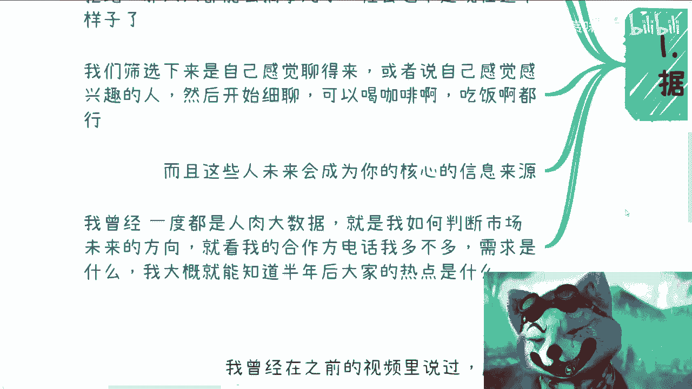

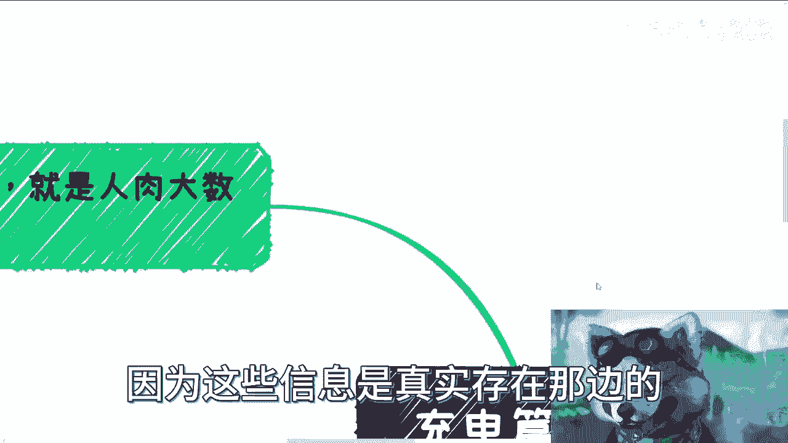

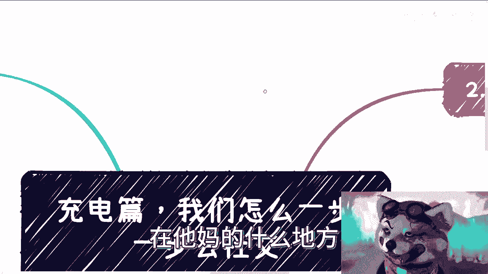

例如，认识10000个人，可能初步筛选出2000人，经过深度接触后筛选出200人，最终可能只有20人成为合作伙伴。这种方法之所以必要，是因为普通人缺乏被“贵人”直接带入圈子的捷径，而其他看似捷径的道路往往存在风险。

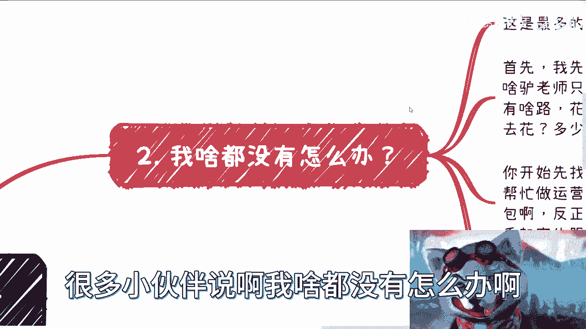

## 如何从零开始社交？🛠️

了解了“人肉大数据”的概念后，本节我们来看看如何在没有资源的情况下迈出社交的第一步。

首要问题是认清现实：对于普通人，社交是积累资源和信息最可靠的路径，试图绕过它去寻求“别的路”往往意味着浪费时间和金钱。

起步的关键在于盘点并利用现有资源。即使资源微小，也能作为起点。

以下是起步的具体步骤：
1.  **盘点自身资源**：审视自己或身边人拥有的技能（如运营、销售）或资源（如外包能力、行业信息）。资源好坏不重要，重要的是有东西可以开始。
2.  **从最小处开始合作**：从零散的、小型的合作案例（case by case）开始。
3.  **主动认识他人**：如果完全没有资源，就从纯粹认识人开始。通过认识不同行业的人（如做咨询的、做跨境电商的），了解市场构成。
4.  **扮演资源整合者**：在认识一定数量的人后，可以将自己定位为“资源整合者”。例如，你可以说：“我认识做数字经济的和做跨境电商的朋友，可以帮忙对接。”商业的本质就是资源整合，例如 `饿了么` 整合了用户与餐厅，`滴滴` 整合了用户与车辆。初期没有资本打造平台，就可以从“牵线搭桥”开始，积累资本和经验。

## 社交的目标与时代紧迫性 ⏳

上一节我们讨论了如何起步，本节中我们将明确社交的最终目标，并理解为什么在当前环境下它尤为紧迫。

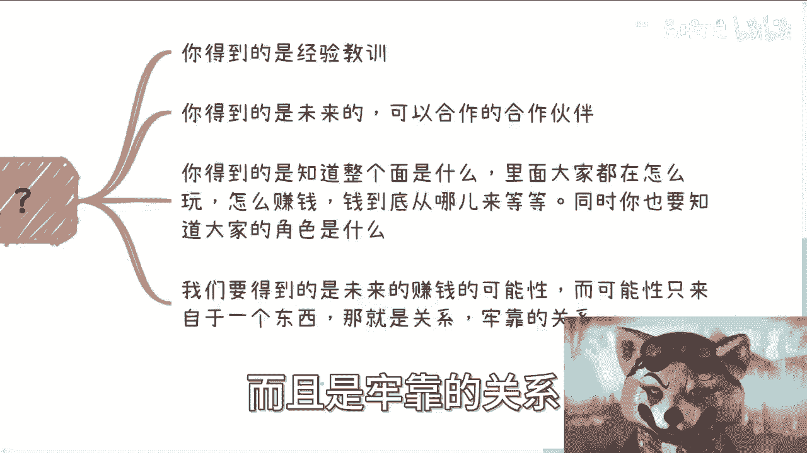

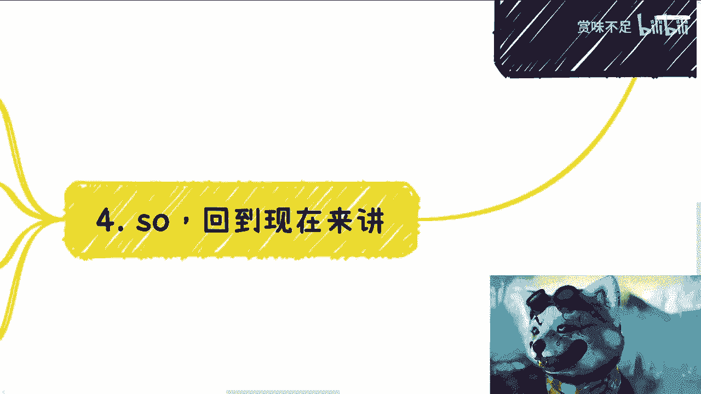

通过社交，我们主要希望获得四样东西：
1.  **经验与教训**：你肯定会遇到挫折，但要避免在同一个地方跌倒两次。
2.  **潜在的合作伙伴**：积累未来可能合作的对象，具体方向可以随具体案例探讨。
3.  **行业全景认知**：了解一个行业里大家都在做什么、如何赚钱、产业链如何运作。这能突破个人认知的局限。
4.  **未来的赚钱可能性**：这种可能性只建立在牢固的、一起合作过的**关系**之上。

当前，我们正处在一个十字路口。除了富二代和既得利益者，所有人都面临选择。趋势是：既得利益者在抱团和排外，有效信息越来越难以获取。这意味着普通人赚钱会越来越难。

面对这个十字路口，只有两种选择：
*   **选择一**：打工、考编、躺平。接受现状，但可能留有遗憾。
*   **选择二**：立刻行动，切入圈子。趁着还有时间窗口，努力展现价值，从现有的蛋糕中分得一块，积累资源。因为未来的窗口只会越来越小。

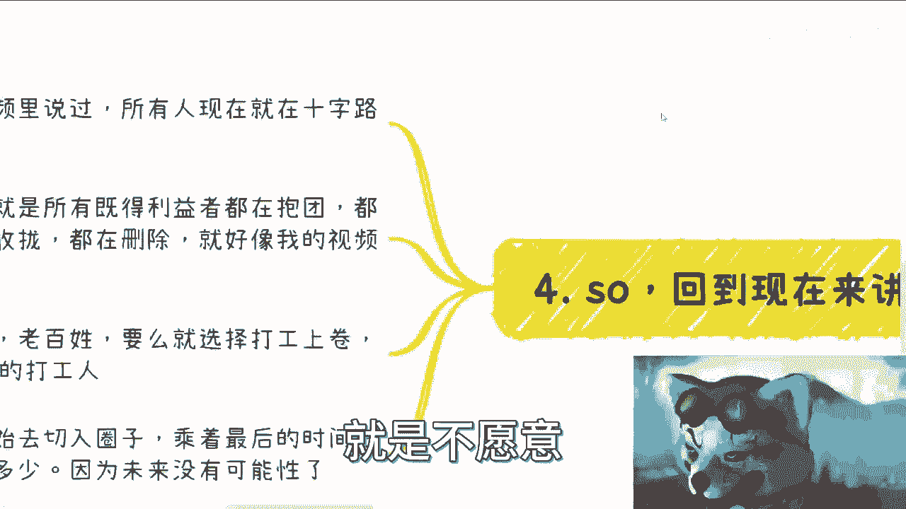

必须放弃幻想，经济不会快速回暖。既要稳定又要暴富是不可能的。必须做出选择，并全力以赴。

## 总结 📝

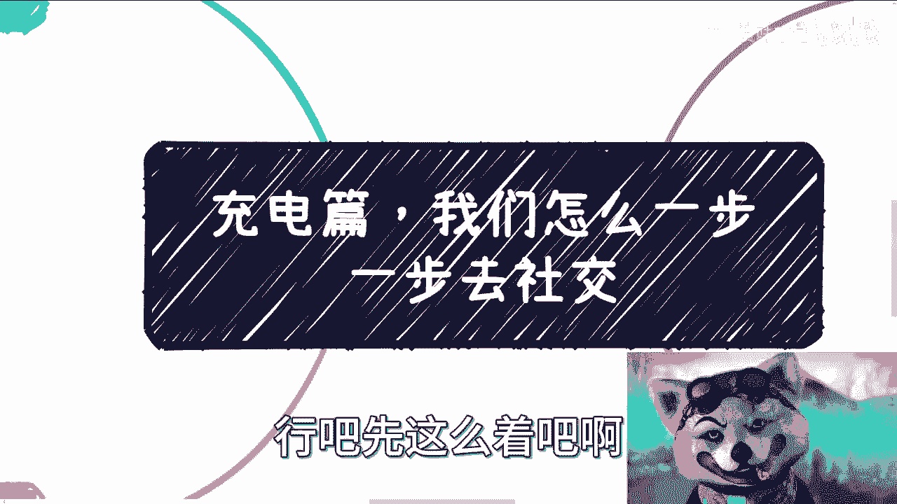

本节课中我们一起学习了社交的基础框架。我们首先理解了“人肉大数据”是普通人拓展网络的核心方法，即通过广泛接触和层层筛选来构建合作圈。接着，我们探讨了从零开始的策略：盘点资源、从小处合作、主动认识人并勇于扮演资源整合者的角色。最后，我们明确了社交的目标是获取经验、伙伴、行业认知和基于牢固关系的未来机会，并认识到在当前信息收拢、阶层固化的时代背景下，立即开始社交积累具有前所未有的紧迫性。关键在于放弃不切实际的幻想，做出明确选择并付诸行动。