# 充电篇-我们来说下数字经济接下来的发展的切入点-我知道的也不多----P1---赏味不足---BV1

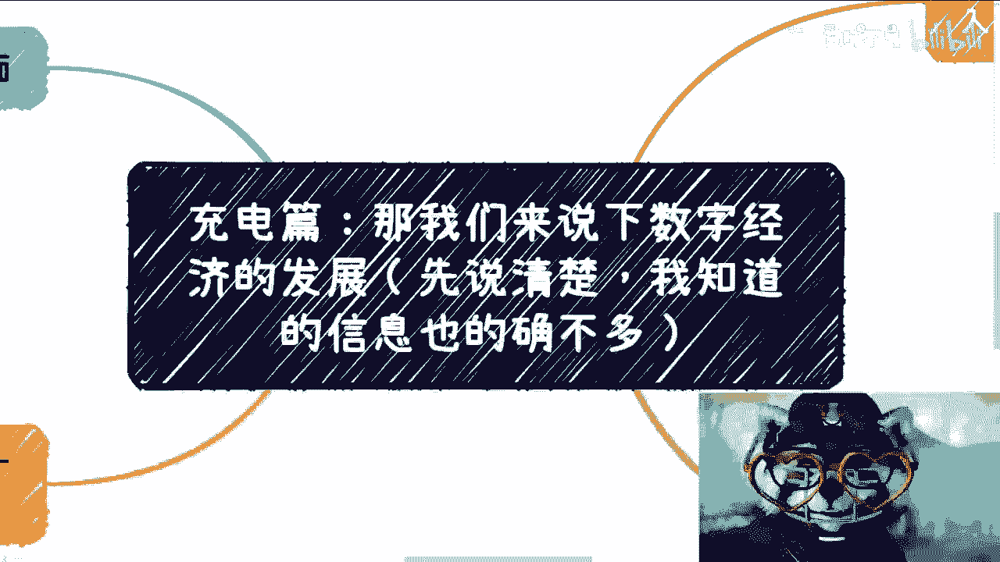

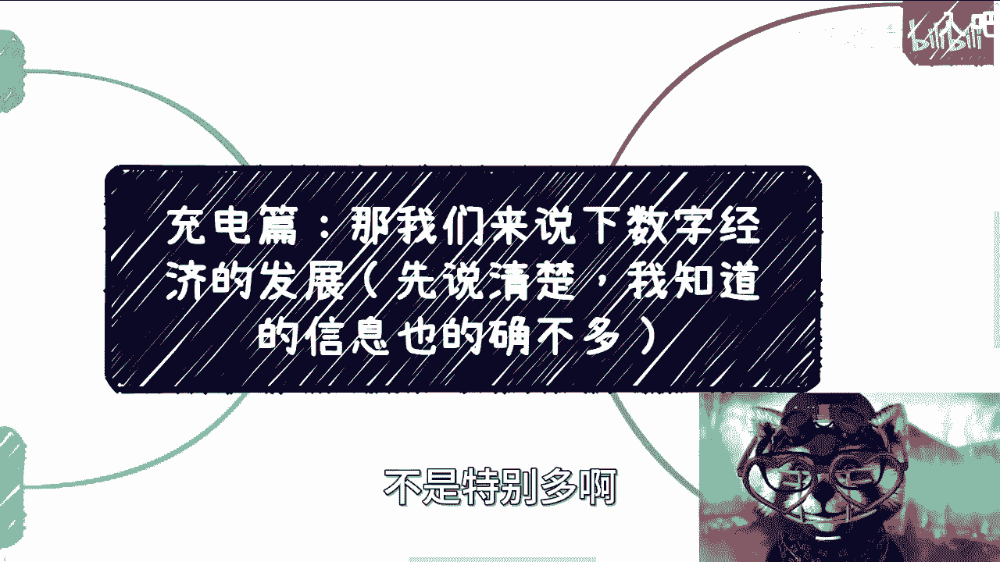

在本节课中，我们将探讨数字经济未来的发展切入点。课程内容基于当前政策导向与市场实践，旨在为初学者提供清晰、可行的行动思路。

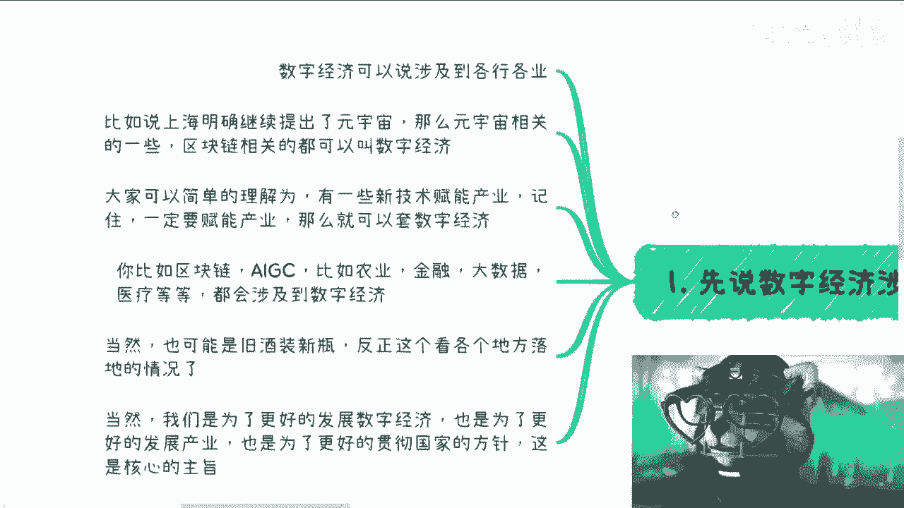

---

## 概述 📋

数字经济涉及面广泛，其发展核心在于**赋能传统产业**。本节课将解析数字经济的本质、可行的切入模式以及具体的操作路径。

---

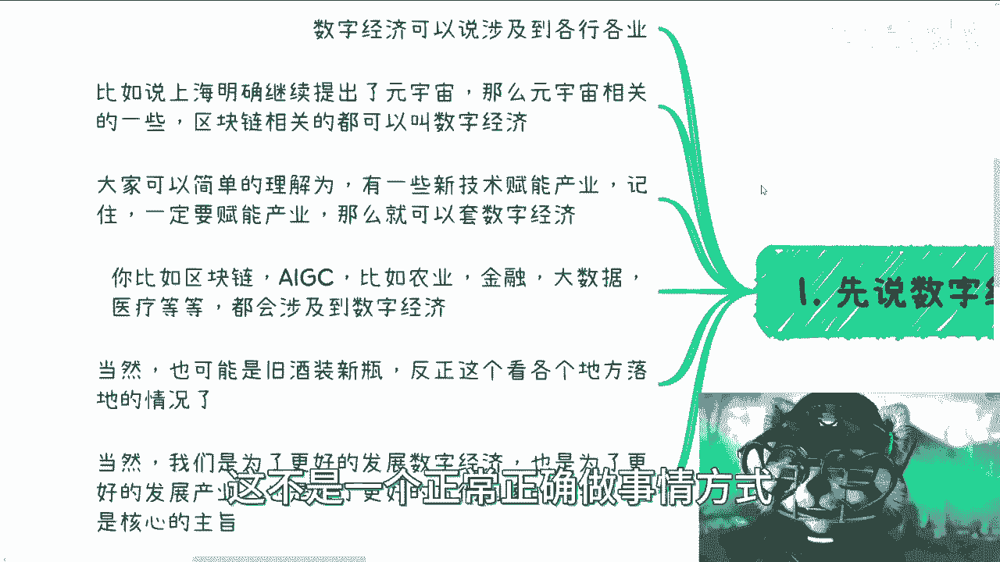

## 数字经济的本质与政策导向 🧭

上一节我们概述了课程内容，本节中我们来看看数字经济的核心定义与政策背景。

数字经济并非一个孤立的概念，它本质上是**新技术与传统产业的结合**。区块链、人工智能（AIGC）、元宇宙、AR/VR、新能源等技术，都需要找到在具体产业中的应用场景。

在中国，发展经济需遵循两个核心原则：
1.  **政治正确是第一位的**。
2.  **必须服务于产业发展**。

只要项目能赋能产业，就可以归入“数字经济”范畴。例如：
*   `区块链 + 农业` 实现溯源。
*   `AIGC + 设计` 提升效率。
*   `大数据 + 医疗` 优化诊断。

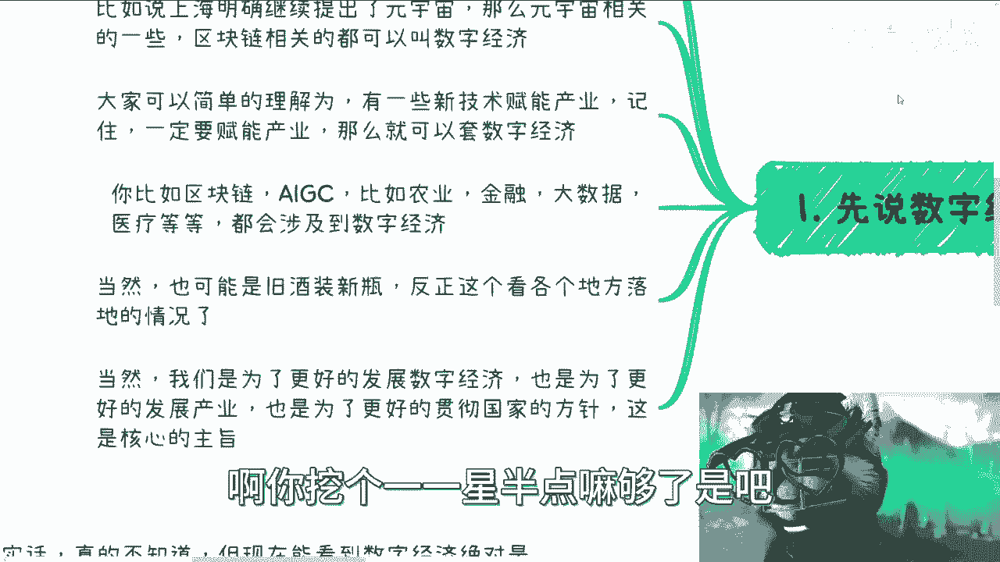

其覆盖范围极广，从中央到地方（省、市、区县），从农业、金融到医疗、教育，各行各业都存在结合点。目标客户可以是个人用户（C端）、高校、政府或企业。

---

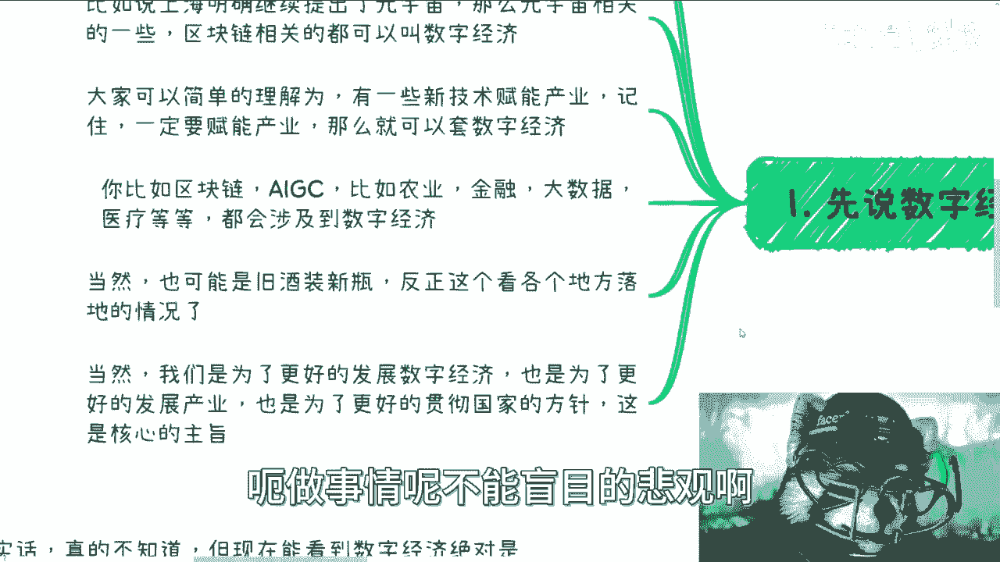

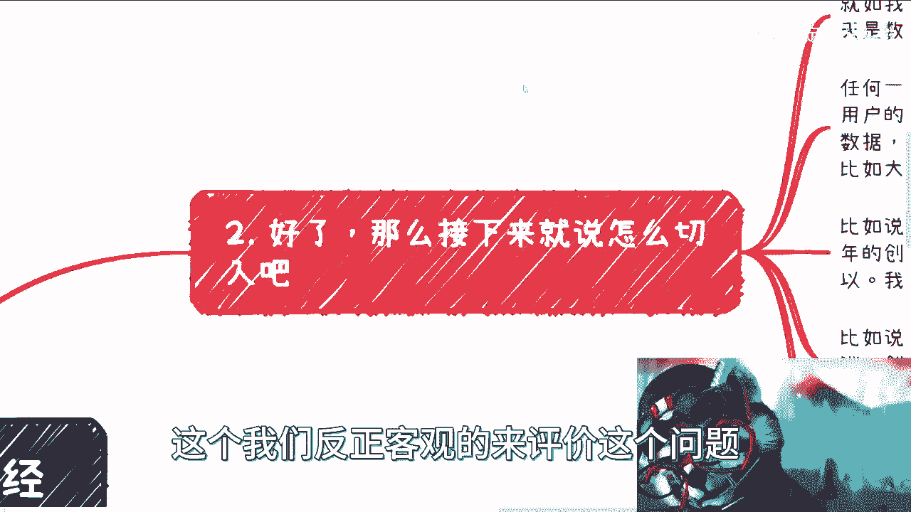

## 主要切入模式 🔍

理解了数字经济的政策本质后，本节我们来看看具体的商业模式切入点。模式本身并不新鲜，关键在于用新概念（数字经济）去承载。

以下是几种常见的切入模式：

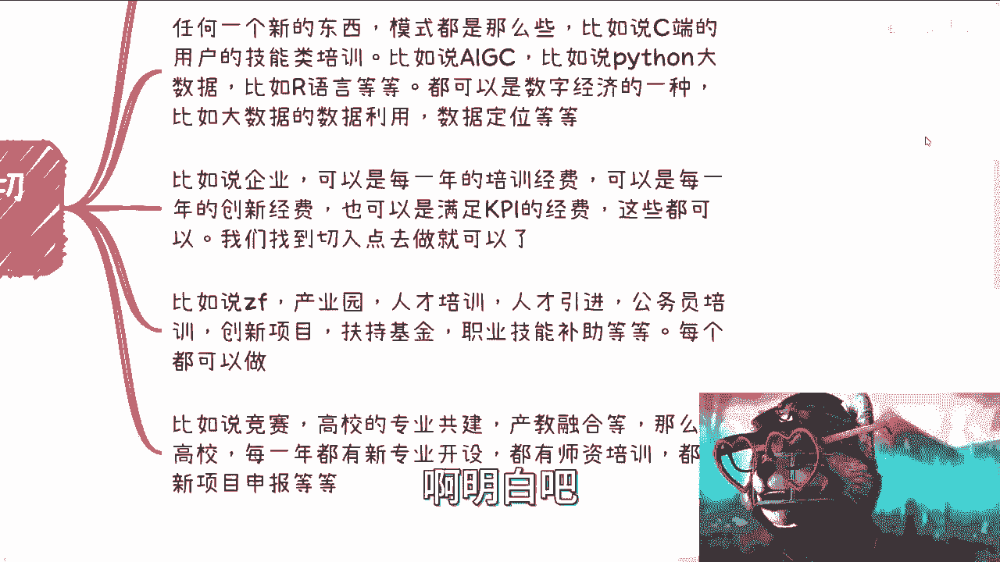

1.  **教育培训**
    *   **C端用户**：提供AIGC作图、Python数据分析、R语言等数字技能培训。
    *   **企业家与管理者**：开设数字经济相关的领导力、创新管理课程。
    *   **高校与职业院校**：进行新专业申报、师资培训、产教融合项目合作。

2.  **企业服务**
    *   利用企业的年度**培训经费**、**创新基金**或**KPI完成预算**，提供数字经济主题的培训或解决方案服务。

3.  **政府与产业园项目**
    *   承接**人才培训**、**人才引进**、**产业园共建**、**公务员培训**、**创新项目扶持**、**职业技能补贴**等项目。

4.  **高校合作**
    *   参与**学科竞赛**、**产教融合**、**职业本科专业建设**、**新项目申报**等。

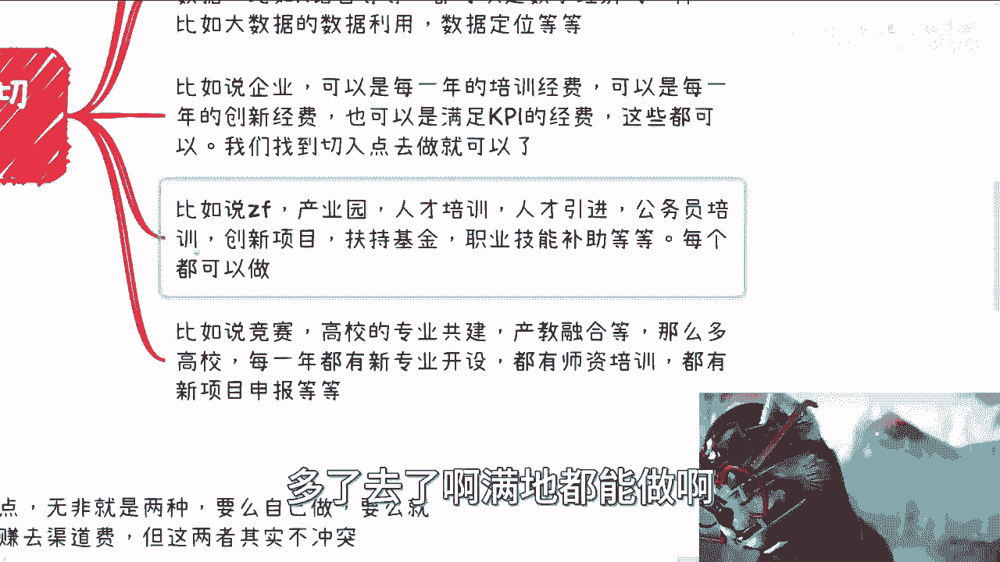

**核心逻辑**：无需纠结项目是否“全新”或“高大上”。找到一个你能操作的、符合上述任一方向的切入点即可。

---

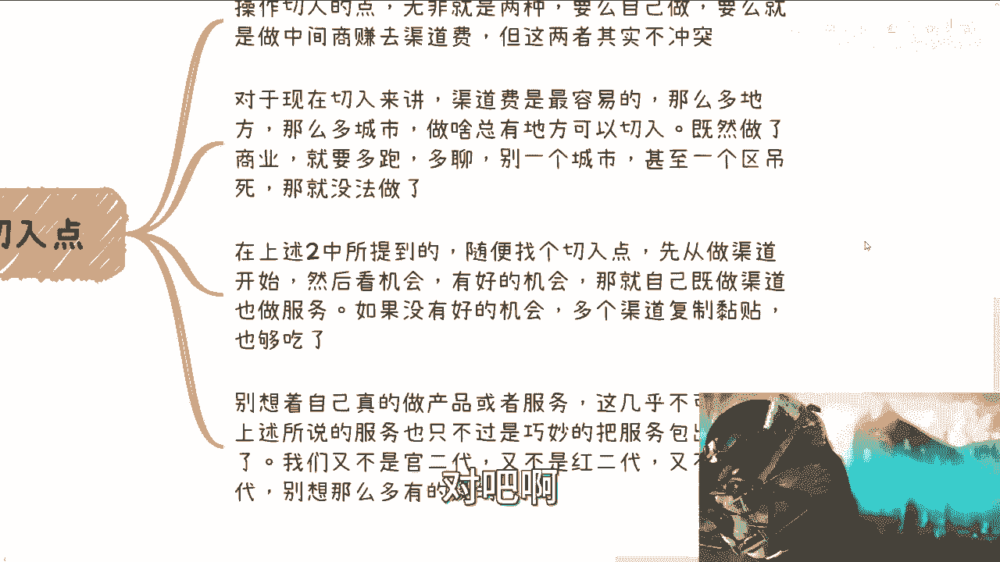

## 具体操作路径 🛠️

明确了有哪些模式可以切入后，本节我们探讨如何具体执行。操作路径主要分为两种。

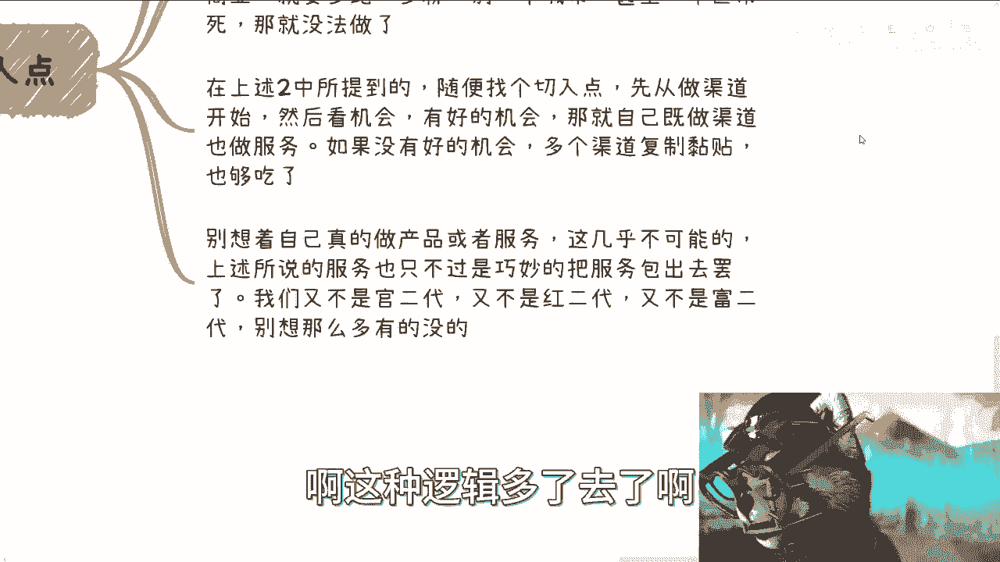

操作切入点无非两类：
1.  **自己做服务商**。
2.  **做中间商，赚取渠道费**。

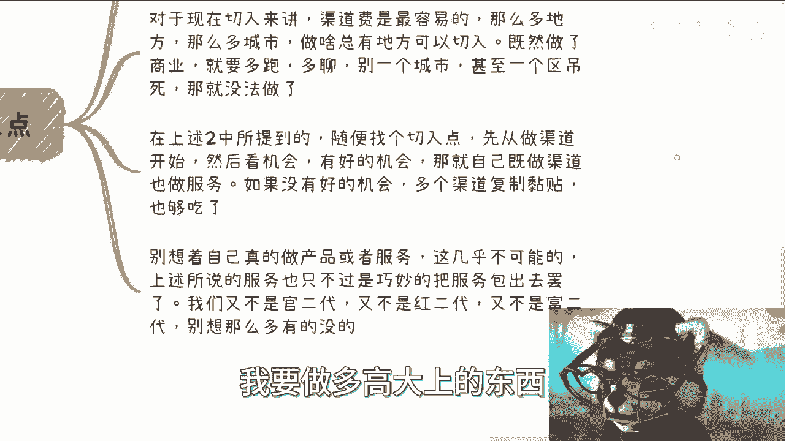

两者并不冲突，但对于初学者，从**渠道费**入手最为容易。

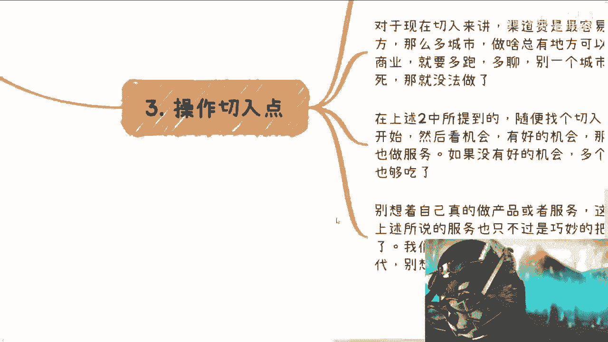

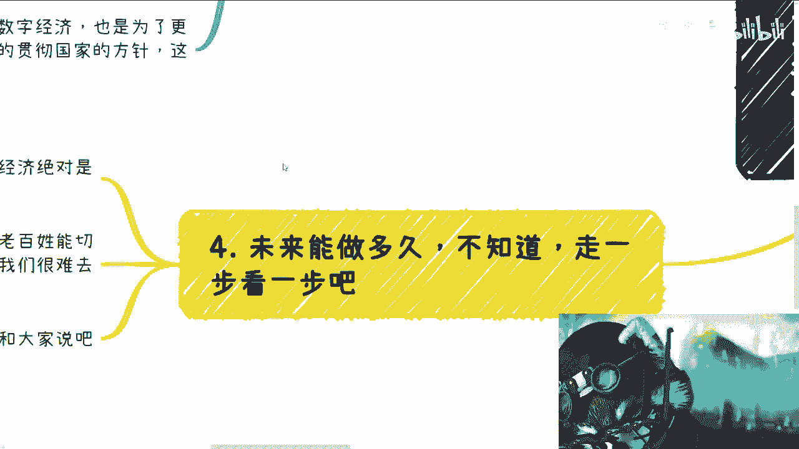

**行动建议**：
*   **多跑多聊**：商业机会在于流动和信息。不要局限于本地，主动接触不同城市、不同领域的潜在客户。
*   **轻资产启动**：初期不要想着自己研发产品或提供深度服务。正确的做法是：
    *   将自己包装成**乙方**。
    *   将实际的服务需求**外包**给真正的服务提供商。
    *   你负责对接客户（渠道），赚取差价或佣金。
*   **复制与放大**：在一个切入点成功后，将该模式复制到其他类似渠道。

**公式**：`成功切入点 = 找到政策支持的领域 + 定位自身为渠道/桥梁 + 整合外部服务资源`

---

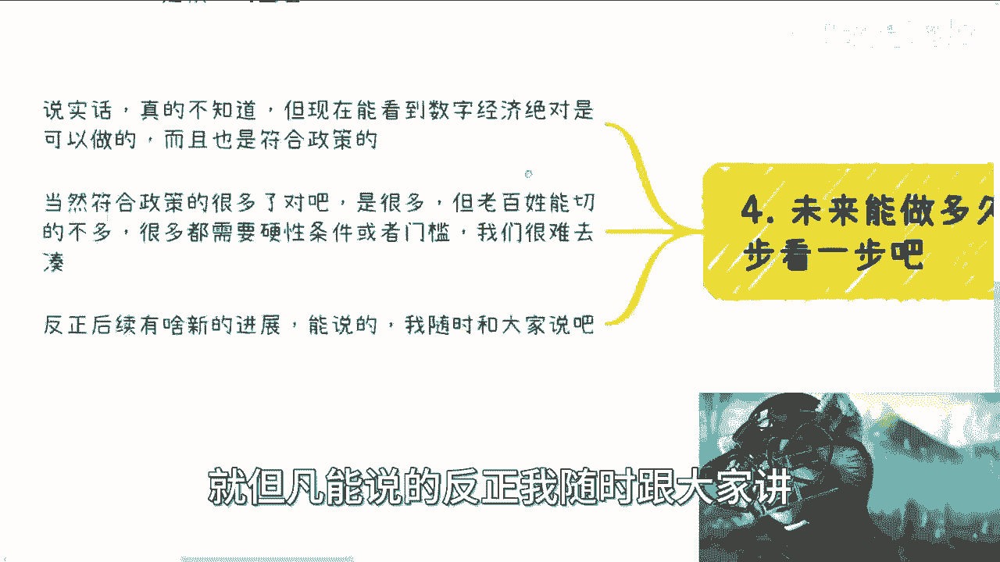

## 时机判断与未来展望 ⏳

掌握了方法和路径后，我们来分析一下行动的时机以及对未来的基本判断。

*   **当前时机**：由于项目运作周期较长，**明年（2024年）要落地开花**的项目，**今年（2023年）下半年就必须开始筹划和申报**。因此，现在正是布局的关键时期。
*   **未来展望**：数字经济是一个明确的政策方向，但具体内涵在不断丰富。其“模糊性”既是挑战（方向不明），也是机会（什么都能往上靠，灵活性强）。
*   **务实选择**：在众多政策方向（如双碳、新能源、工业互联网）中，数字经济相关项目对**资金、硬件门槛要求相对较低**，更适合普通创业者或中小团队切入。

---

## 总结 🎯

本节课中我们一起学习了：
1.  **数字经济的核心**是**新技术赋能传统产业**，并需紧跟政策导向。
2.  **主要切入模式**包括教育培训、企业服务、政府项目及高校合作。
3.  **最佳操作路径**是从**渠道商**做起，整合资源，轻资产运营。
4.  **关键行动时机**是**现在**，为明年项目落地做准备。
5.  保持务实心态，放弃“做高大上产品”的幻想，从能执行的微小切入点着手。

记住核心：**跟着政策走，找到产业结合点，用渠道思维快速启动**。