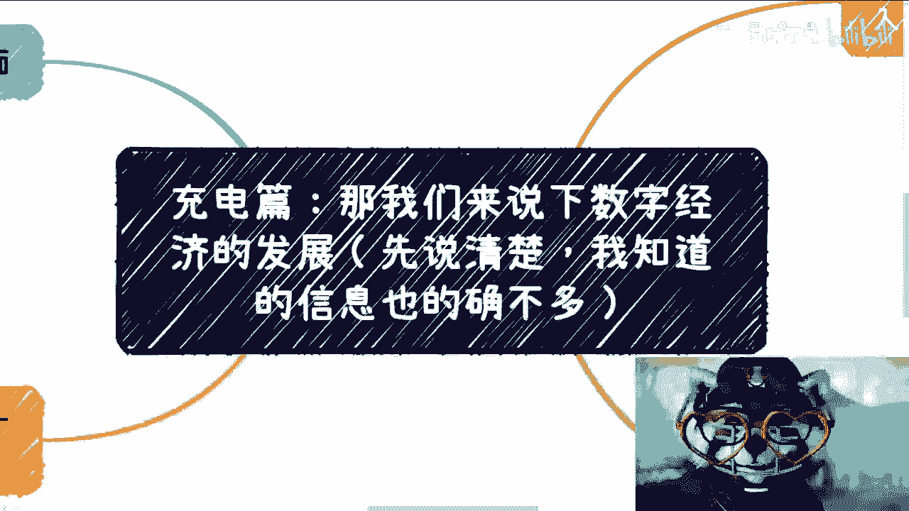
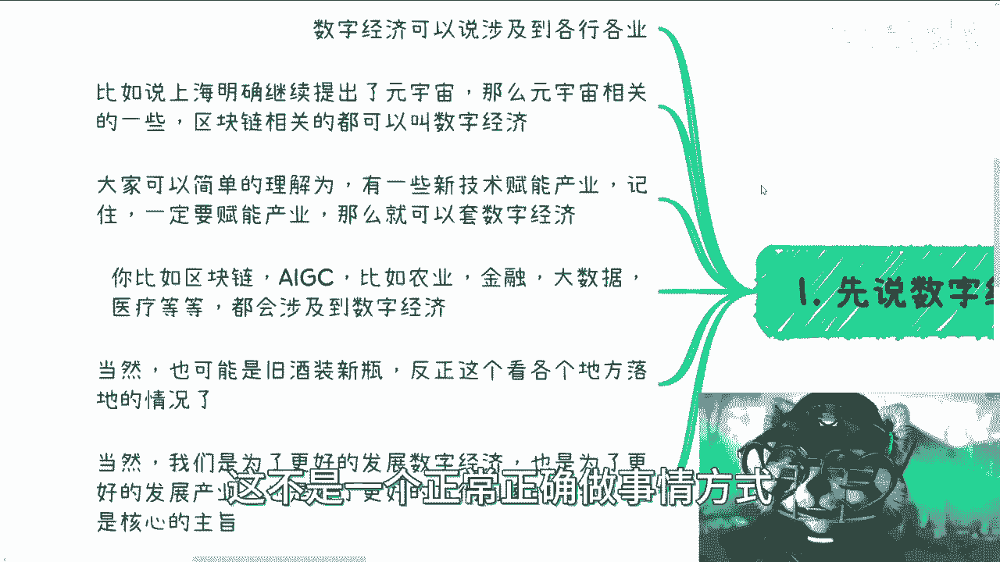
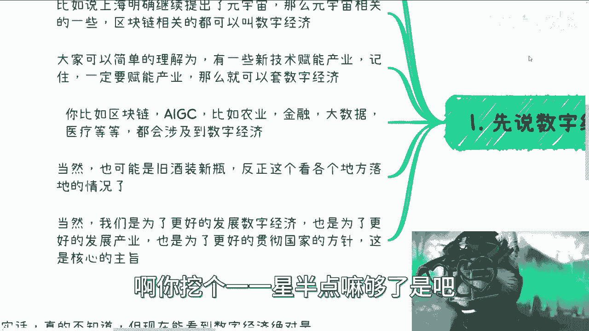
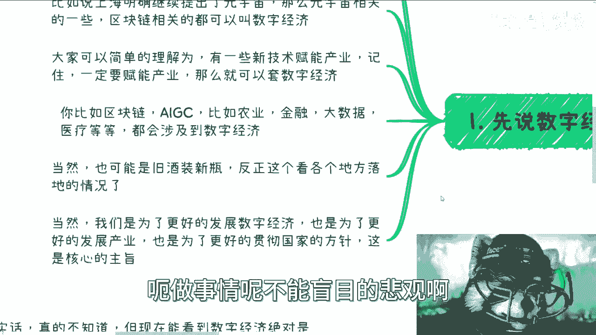
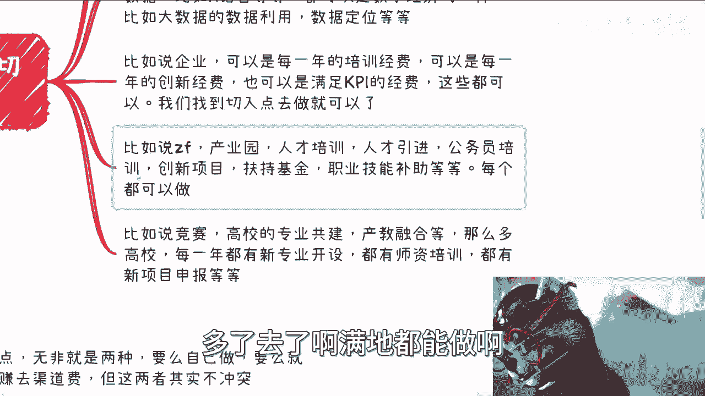
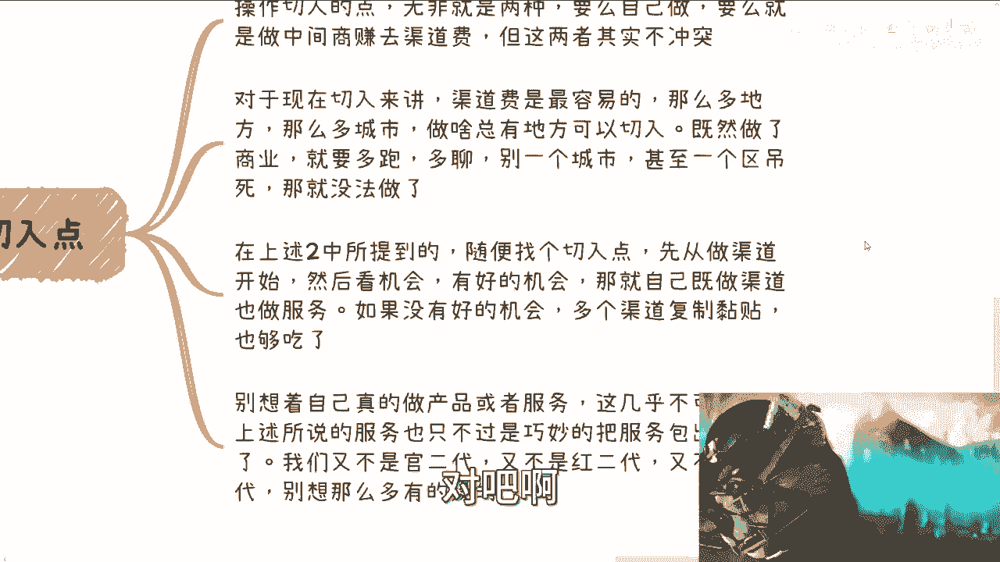
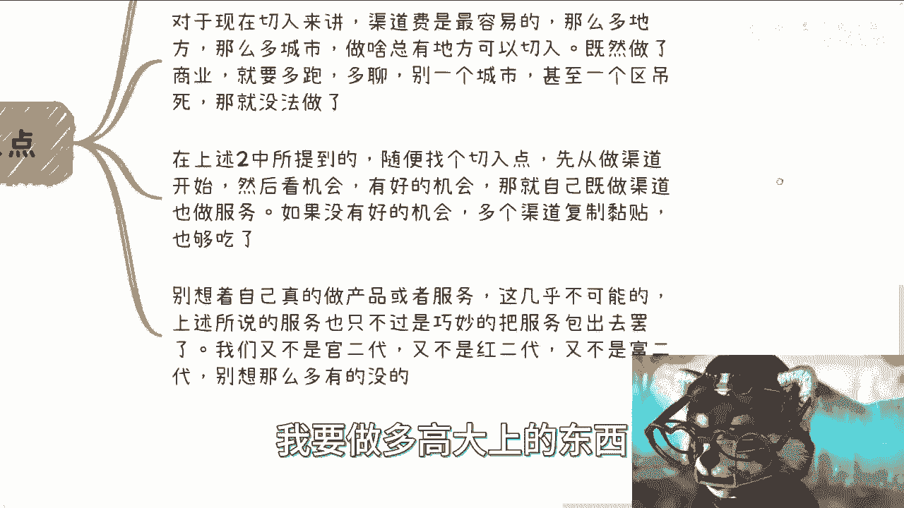
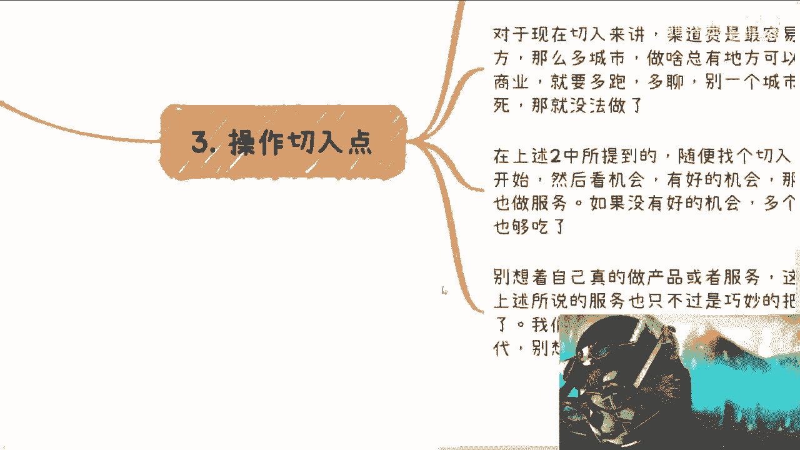

# 充电篇：我们来说下数字经济接下来的发展的切入点（我知道的也不多） - P1 - 赏味不足 - BV1t94y1x7Cc

啊大家好啊，随缘啊随缘，我想到啥说啥啊，呃既然前两天说了那个数字经济啊，我就哎在这个地方再说一下啊，但是呃我也跟大家说的很清楚，就是当下这个信息知道的的确不是特别多啊。

回头等要是有一些新的信息，我再跟大家讲好吧，呃首先这第一个先说数字经济方面涉及的命。

呃数字经济本身啊，涉及到的点应该说是很多很多的，我们可以说为什么这个点好做呢，是因为这个点跟各行各业都可以有关，当然了，怎么有关，也跟大家的故事，大家的饼啊，大家能提供什么有关系啊。

你比如说像上海下半年，明确的继续地提出了元宇宙啊，我昨天在B站上还看到有人说什么啊，元宇宙为什么不说了或者怎么样，其实我一直跟大家讲啊，我说不用去多看网上的信息，为什么呢，我们要赚钱，我们要做东西。

我们肯定是跟着政府走的对吧，你说有没有说啊，什么有没有某一个东西，有没有声音，或者有没有什么继续发展，你不要用你的感觉去，比如说你说我可能朋友圈后就没看到了，我可能身边很久很久没有人提了。

或者你可能怎么样子，这个只是你的感官没有用的，你知道吗，就是说我们要去做的一定是跟着政策走对吧，你身边有没有人做，无所谓啊，政策说能做啊，那就能做对吧，那么就像我们说元宇宙也是一样。

上海在红头文件当中明确提出了说啊，要继续元宇宙的发展，那就发展呀，对不了，你身边有没有人做，跟我们自己赚钱有什么关系呢，对吧，那你如果大家有些人啊，就是非要觉得啊这个东西哈。

我一定要用我的主观的感觉去判断，那你去判断对吧，我就告诉你啊，这不是一个正常正确做事情方式啊。

那么从今年开始呢，就是说区块链本身讲的呢，其实相对可能比较少了啊，在各企业各政府这边啊，区块链相关的呢都可以叫做数字经济，或者说在外面套的这个名头啊，基本上都是叫数字经济啊，那么这是第一个。

第二个呢就是说大家可以简单的理解为啊，一些新的技术一定要去赋能产业啊，不管是AI及C还是区块链，还是元宇宙还是ARVR啊，还是说这个新能源对吧，碳中和啊，那么你一些新的东西一定要赋能产业啊。

记住就说在中国呃，政治证券是第一位啊，第二位就是负责产业啊，别的不重要啊，别的这是后话啊，那么你只要能赋能产业，那么你就可以往数字经济上套啊，那么再比如区块链AI及C对吧，然后往农业啊，金融啊。

大数据啊，医疗啊等各个方面你都可以套啊，这个就会涉及到各个各种数字经济，大家不要觉得这些东西不好讨，或者说好像呃设计面比较窄，呃其实已经没有比这个设计面更广的东西了啊，也就是说你们想想看。

就是从中央到各地方省市区对吧，农业金融，大数据，医疗等等等等，各行各业你都能挖对吧，那你想看有多少个城市啊，有多少个区县啊对吧，有多少个省啊对吧，你有的挖了对吧，而且对象可以是C端，可以是高校。

可以是政府，可以是企业，你想挖多少啊啊你挖个111星半点吗，够了是吧。

你啊这个我发现这个做呢很多人他不愿意做啊，野心倒是很大啊，当然也可以是旧旧酒装新瓶啊，反正这个就看各地方落地情况了，我们那为了核心点啊，我觉得很简单，我们那是为了更好的发展数字经济啊。

也为了更好的发展产业啊，也为了更好的国家贯彻国家的方针啊，这是核心的主旨啊，做事情呢不能盲目的悲观啊。

也不能盲目的乐观啊，我们反正客观的来评价这个问题啊。

那么接下来说说看怎么切对吧啊，就如我们之前说过的模式呢，其实都一样，很多模式并不是只因为今天而出现的，也不会因为今天是数字经济，明天是人脑联机而变化，模式不可能的啊，他模式都半斤八两了。

任何一个新的东西啊，模式都是那么一些，比如说啊随便举例子，比如说C端呃，散户对吧，用户的这个技能类培训，比如说企业家的培训，比如说什么领导力培训，比如说四总会，比如说NBA啊，呃比如说呃AIGC啊。

这个赋能设计啊，赋能这个叫什么自动作画，比如说Python大数据，比如说R语言对吧等等等，他都可以是数字经济的一种对吧，你别来管说啊，这个东西以前有了这个东西，做过了这个东西怎么样了，不重要啊。

who care啊啊这个嗯懂了啊，明白了啊。

我不能说的再明了啊，这第一个第二个呢，比如说企业可以是每一年的培训经费，也可以是每一年的创新经费，也可以是满足KPI的经费啊，我不管是谁，你是什么经费，反正你得找一个出口来出这个钱对吧。

你要是找不到这个出口出这个钱，那你先去了解哪个出口能出这个钱对吧，啊那么这第二点第三点，比如说政府啊，产业园人才培训啊，人才引进啊，这个成员共建啊，这个公务员培训啊，创新项目啊，扶持基金啊。

反正名头很多很多啊，大家自己去了解，那么呃职业技能补助等等等对吧，每个都能做啊，你也这个别老觉得哎我要做哪些，别做哪些了，你就找一个切入点，你能做哎你就牛逼了啊，再比如说啊这个竞赛对吧，高校啊。

产教融合啊，职业本科啊，那这么多高校啊，每一年都有新专业开设啊，都有师资培训，都有新项目申报，多了去了啊，满地都能做啊。

满地都能做，那么我们来说操作切入点啊，操作切入点无非就两种啊，要么自己做，要么就做中间商，赚赚取赚渠道费啊呀但这两者并不冲突啊，那么对于现在切入点来讲呢，渠道费是最容易的，那么多地方。

那么多城市做啥你都可以切对吧，而且呢我跟你们说，你们如果真的为了赚钱，既然选择了商业，你就要多跑多聊啊，你别跟我说，哎呀陈老师，我在一个什么鸟不拉屎的城市对吧，我这个地方不能坐，那你不能坐，你跑啊。

对吧哦你你这个对吧，你说我又要赚钱，又要离家近啊，又要不劳动啊，我还能说啥呢，对吧啊。

你甚至在一个区啊，一个省一个市吊死，那你怎么做呢，对不对，在上述第二点当中所提到的啊，随便找个切入点，我已经给你们列了这么多了，哪个切入点就能做，对吧啊，在上述二当中，随便找个切入点都能做渠道。

然后你看清楚机会有好的机会，那就自己既做渠道也做服务对吧，如果没有好的机会，那么你就多个渠道复制粘贴也够你吃了，你想怎么滴啊，想怎么滴是吧啊，别想着自己真的做产品或者做服务，我跟你讲，这是不可能的啊。

上述所说的服务也只不过就说巧妙的啊，你要把你自己包装成乙方，你要把真正的乙方服务外包出去啊，这种逻辑多了去了就记住啊。

不要老是去想着说我要做多高大上的东西。

不好意思，你们做不了，我也做不了，又不是富二代，你做啥高大上的东西啊啊你对自己没有逼数吗，这不是。

啊那么这第三个第四个。

未来能做多久，我不知道走一步看一步啊，说实话我跟你讲真的不知道，那不是说我不知道我我知道我不说啊，是真的不知道啊，但现在能看到数字经济绝对是可以做的，而且符合政策，为什么呢。

因为我各地方政府各地方企业聊下来，大家都上面领导表示要做啊，那那不就是个方向嘛，对不对啊，当然符合政策的很多啊，那个双碳啊，新能源啊对吧，然后然后然后工业互联网对吧，AI啊多了去了啊。

但是有很多东西呢我们切不动对吧，而且有很多东西要要有比较明确的，你比如说要有资金的投入啊，要有这种数据投入啊，我们都没有对吧，那么很多是需要硬性条件或者门槛的，我们很难去凑是吧啊。

所以说就说只有这块东西我觉得是好做的啊，而且呢后续反正有啥新的进展呢，就但凡能说的，反正我随时跟大家讲好吧。

那么嗯，简单来讲呢从目前趋势来看啊，因为今年不是停摆了一年嘛，嗯下半年现在9月份开始，往后也不会有什么很大动作，也就那样啊，就大家估计也就是这个呃喝吃吃饭喝喝酒对吧，这个布局布局啊，该大面积铺呢。

应该还是在明年啊，还是在明年，但是呢就是说安我们说的这个呃叫什么格局啊，或者说布局角度来讲啊，就是这个事理论上来讲啊，明年的事今天就能今年就应该定了，因为按照正常的项目申报来讲。

明年的项目一般下半年就要开始申报，并且来说一般下半年也就申报，早就提交结束了啊，所以说反正大家自己清楚，就是说所有的东西尤其是要跟高校啊，跟政府跟企业去做的，一般都是提前半年一年的啊，不是说啊。

这个吕老师说数字经济怎么样怎么样好，明年可以做了，好明年开始做了，那他妈就来不及了，你知道吧啊，所以就是嗯，就是我觉得很多小伙伴可能不是特别了解啊，就是比如说这个商业上的运作模式对吧。

就是之所以我一直在提，就是因为今年其实该做的都要做了哦，明年是相当于要落地，要拿钱，要开花结果的，不是说明年要做的好，大家去做了，明年做的是后年的，懂吗啊，所以就是就是这么个东西，反正后面再看吧。

因为现在说实话就是上上层呢也全部都给了，这四个字，到底是什么呢，不知道啊，但是我跟你们讲，这个东西有好处有坏处，坏处就是可能大家觉得不知道没方向啊，好处就是你什么都能往上贴啊，反正没人懂对吧。

你都能往上贴，问题不大，行吧啊就这么着吧啊啊这个啊对对对对，最后说一点啊，那个感谢B站提供的那个奖品啊，我今天晚上会挂出来吧，或者明天挂出来吧好吧，反正还是一些键盘啊，耳机啊，这样子。

这个我还是会把它这个设置成，30块钱充电的啊，这么一个专属好吧。