# 充电篇-我们来说说toB的产品服务需要注意的点---P1---赏味不足---BV1vu4y1r7Pc

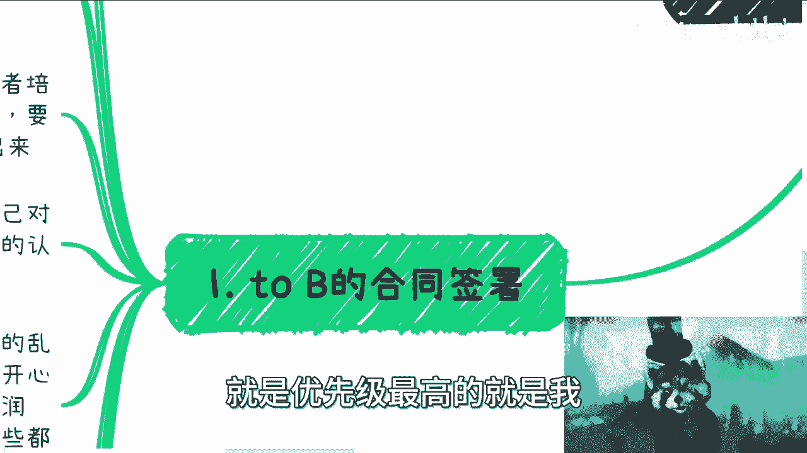

在本节课中，我们将探讨面向企业（ToB）提供产品或服务时需要关注的核心要点。我们将从合同签署、项目特点、沟通策略等多个维度进行分析，帮助你理解ToB业务的复杂性，并为实际商业活动做好准备。

## 合同签署：优先级最高的事项

上一节我们介绍了课程概述，本节中我们来看看ToB业务中优先级最高的事项：合同签署。无论提供何种产品或服务，最终都需要落实到具有法律效力的合同上。

合同的具体内容会因业务类型、交付物和客户的不同而千差万别。一份完整的合作可能涉及多份合同，例如保密协议（NDA）、授权合同以及主体合作协议等。

以下是关于合同模板和签署的几点说明：

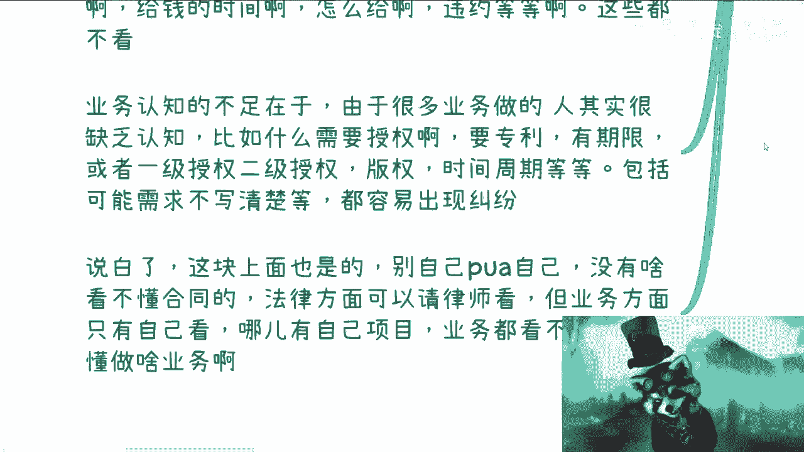

*   **合同模板来源**：合同模板可以从律师事务所获取，或在网上搜索“框架协议”等关键词找到。对于初创者而言，这些基础模板通常可以满足需求。
*   **使用甲方模板**：如果合作方是中大型企业，他们通常有自己的标准合同模板。在这种情况下，使用对方的模板是更常见且高效的做法。
*   **签署主体**：正规的ToB合同通常是企业对企业（B2B）的签署。因此，你需要确保自己有一个合法的商业实体（如公司）作为签约方。个人（C端）直接签署正规的B2B合同会显得非常不专业。

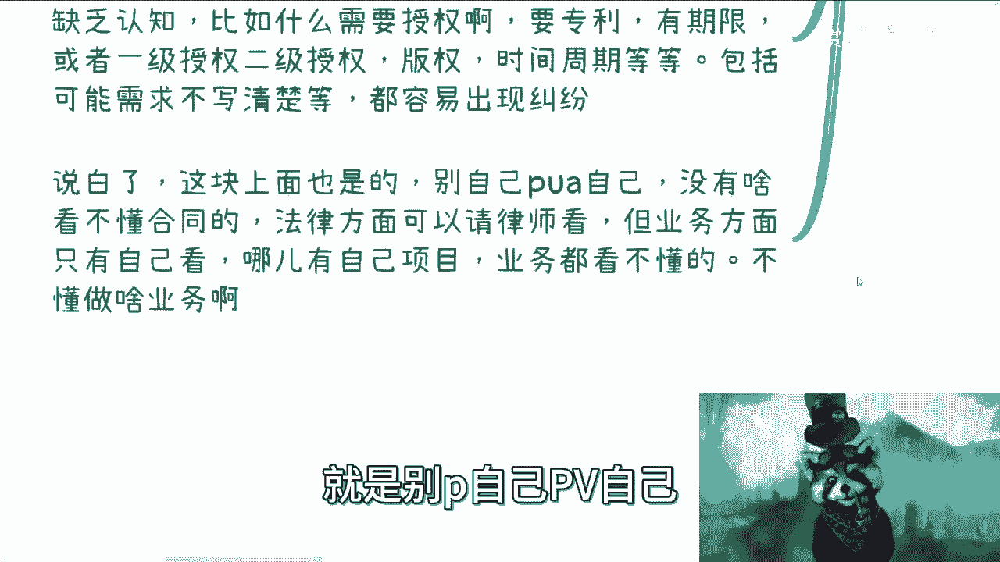

合同签署中常见的风险主要源于两方面：对合同本身认知不足，以及对所从事的业务认知不足。

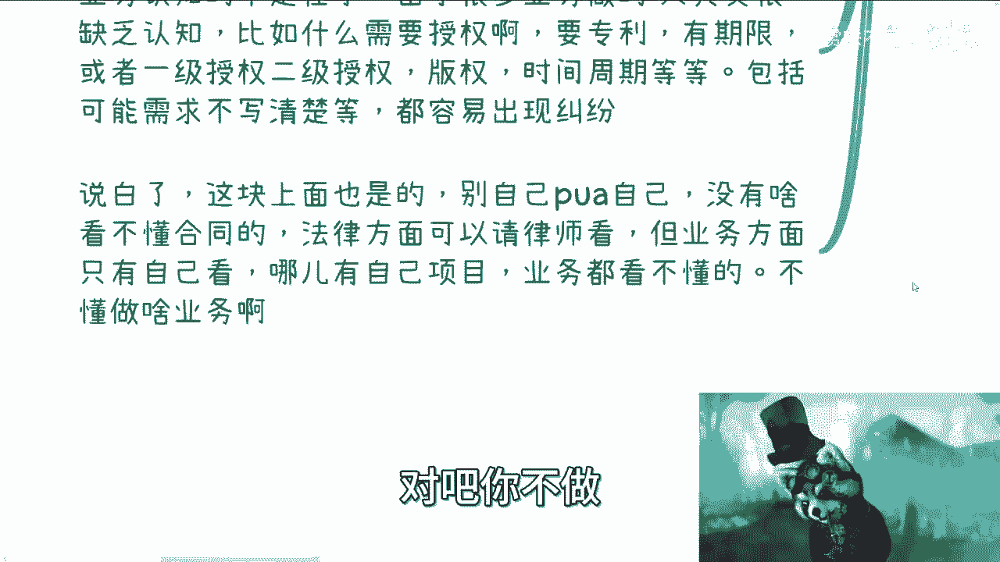

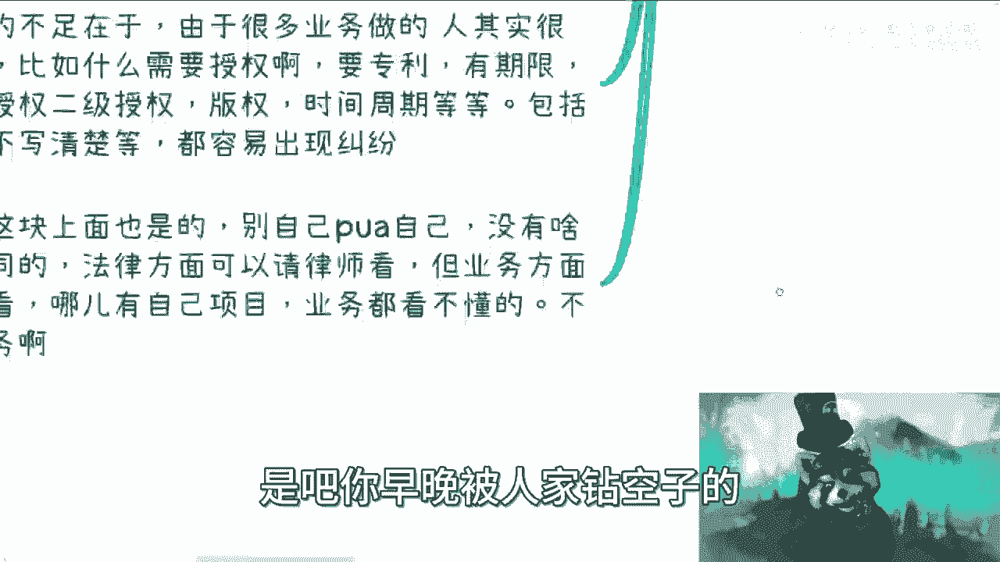

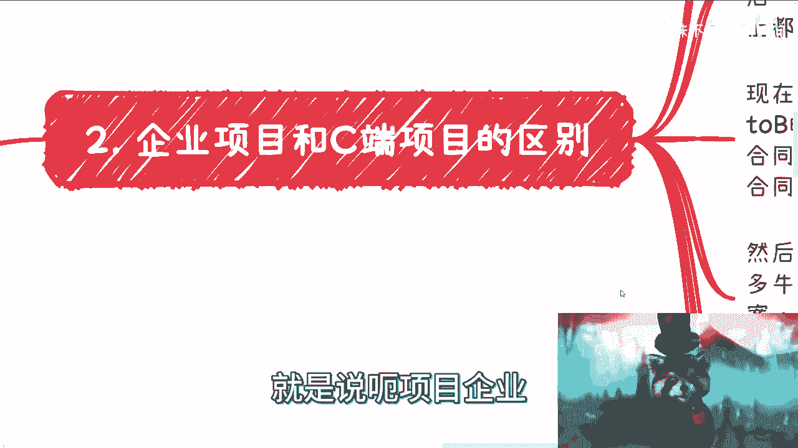

**对合同认知不足** 体现在不清楚合同中哪些条款是关键且必须明确的。例如：
*   **金额与支付**：合同总价、利润分成比例（如`7:3`或`5:5`）、付款节点、收款账户等信息必须清晰。
*   **违约责任**：需要明确约定违约情形及处理方式。
*   **合同目的**：必须清楚签署合同的核心目的（例如，是为了实际营收、作为宣传素材，还是作为获取更大合同的“敲门砖”），并据此确定合同内容的侧重点。

**对业务认知不足** 是更大的风险。每个行业都有其特定的规则和潜在风险，合同条款需要与之匹配。例如，合同中可能涉及：
*   **授权范围**：是一级授权还是二级授权？
*   **知识产权**：涉及专利、版权（包括所有权、使用权、收益权等）的条款。
*   **项目周期与需求**：时间节点和需求范围是否定义清晰？

律师可以帮助审查法律条款的合规性，但**业务层面的特殊条款和风险点，必须由你自己基于对业务的深入理解来把控**。如果因为不熟悉业务而被对方在合同条款上钻了空子，责任在于自身。

## 企业项目与C端项目的核心区别

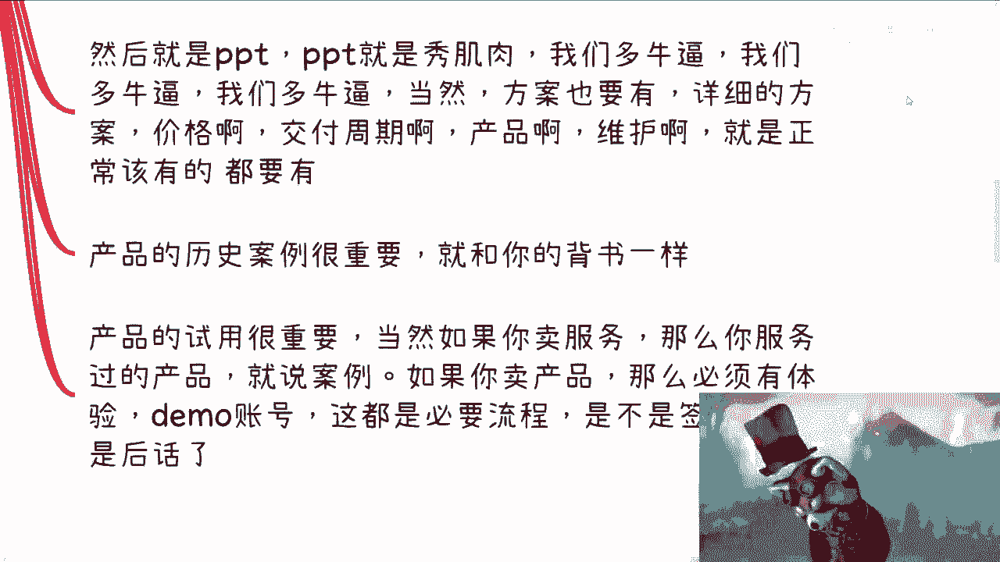

理解了合同的重要性后，我们进一步探讨ToB（企业项目）与ToC（个人用户项目）的根本区别。ToC项目的核心优势在于决策链路短，用户个人喜好决定购买行为。而ToB项目则复杂得多。

以下是企业项目的主要特点：

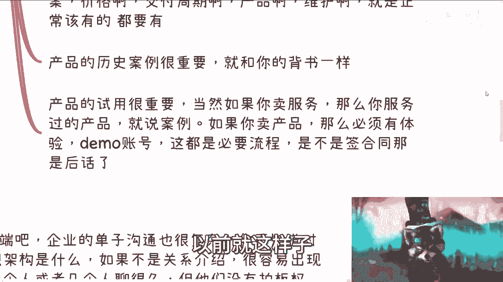

*   **决策流程复杂**：企业采购决策往往涉及多个部门和层级（如技术、采购、法务、业务部门负责人）。你接触的谈判对象可能并非最终拍板人，因此容易陷入长时间沟通却无法推进的困境。
*   **注重背书与实力证明**：企业客户非常看重合作方的可靠性和成功案例。这与对个人用户“讲故事”的方式不同，企业需要实实在在的证明。
    *   **法律层面关系**：光靠“我认识某某领导”、“我有关系”这类虚词无效，必须明确在法律框架内的合作关系（如劳务合同、商务合同）。
    *   **方案与案例（PPT）**：一份优秀的方案（PPT）至关重要。它需要简洁有力地展示：公司实力（背书）、详细的产品/服务方案、明确的价格体系、交付周期、售后维护方案以及**历史成功案例**。理想情况是，你的方案已经预判并回答了客户可能关心的所有问题。
    *   **产品体验**：如果是软件产品（SaaS或本地部署），**提供测试账号供客户体验是必不可少的流程**。企业客户在不试用的情况下很难做出购买决策。
*   **非业务因素介入多**：企业合作常伴随着饭局、酒局等人情往来。这并非指必须喝酒，而是指建立和维护关系是商业活动的一部分，在竞争激烈的市场中尤其如此。
*   **审批导向**：所有方案和沟通的最终目的，是为了通过企业内部的审批流程。你需要了解最终审批者关注什么，并据此准备材料。
*   **强调可持续性与想象空间**：你需要向企业客户证明，你的产品或服务具有长期价值和增长潜力，这类似于向投资人阐述商业前景。

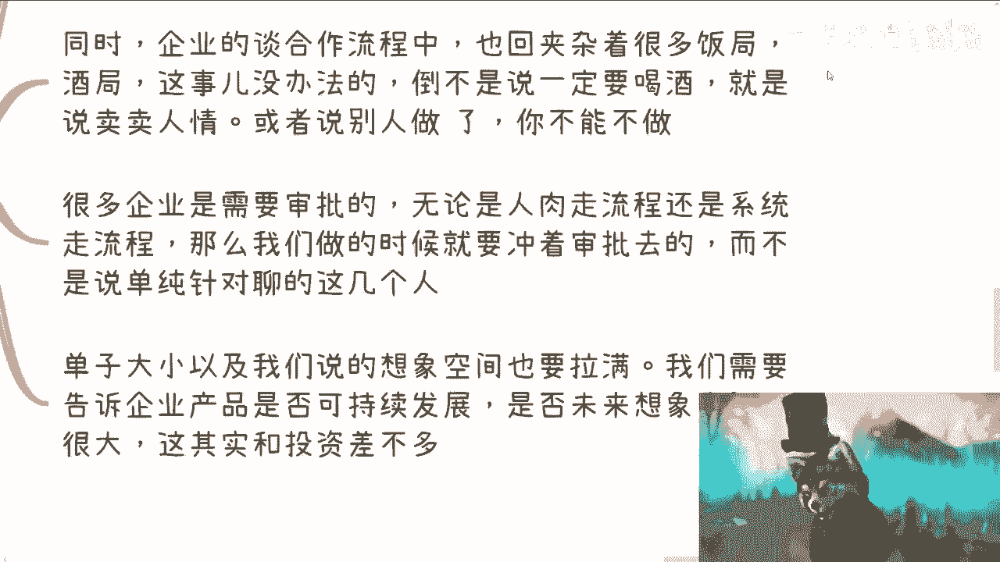

## 企业合作中的特殊策略：套壳与多方合同

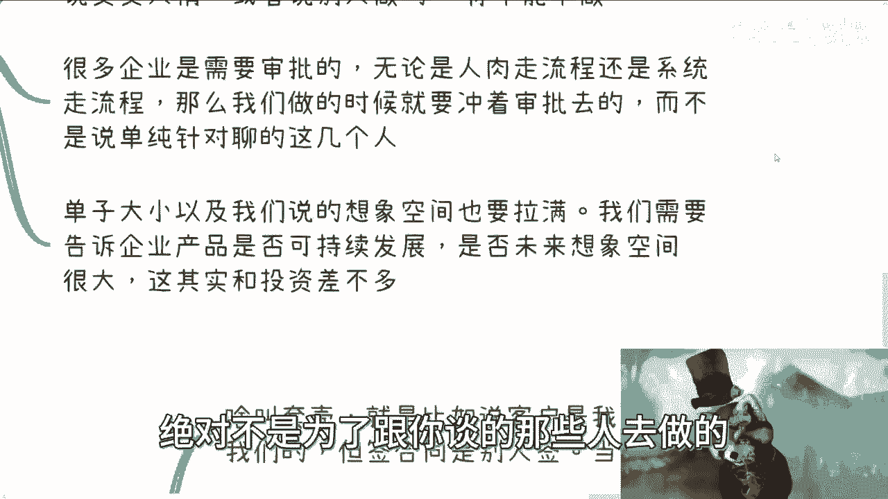

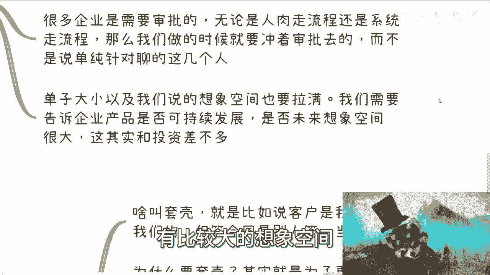

在复杂的商业环境中，有时需要采用一些特殊策略来促成合作。本节我们来看看“套壳”和“多方合同”这两种常见情况。

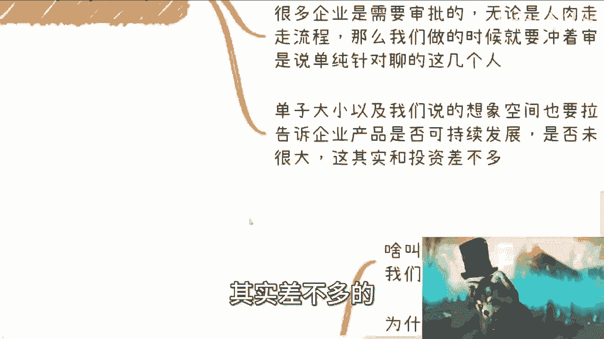

**套壳** 是指实际提供产品和服务的A公司，通过另一家B公司（壳公司）与客户签署合同。这样做通常是为了满足客户对供应商的硬性资质要求，例如：
*   公司注册资本、员工社保缴纳人数。
*   公司成立年限、融资阶段（如要求A轮后企业）。
*   供应商品牌知名度或行业排名。

当产品、服务、价格乃至客户内部关系都已打通，却卡在这些“硬性门槛”上时，寻找一家符合资质的合作伙伴进行“套壳”合作，就成为了一种可行的解决方案。当然，壳公司需要收取一定的费用。

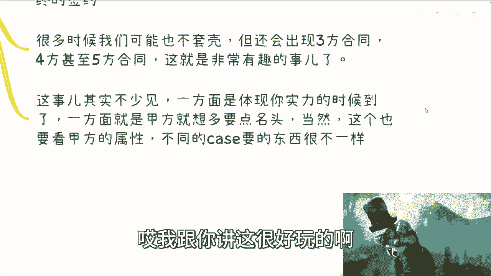

**多方合同** 也不少见，即一份合同由三方、四方甚至五方共同签署。出现这种情况可能源于：
*   **甲方要求**：客户可能要求引入额外的合作伙伴（如投资方、高校、技术供应商）来共同担保或丰富项目内容，以此考验乙方的资源整合能力。
*   **项目需要**：复杂的项目本身就需要多个专业方共同参与完成。

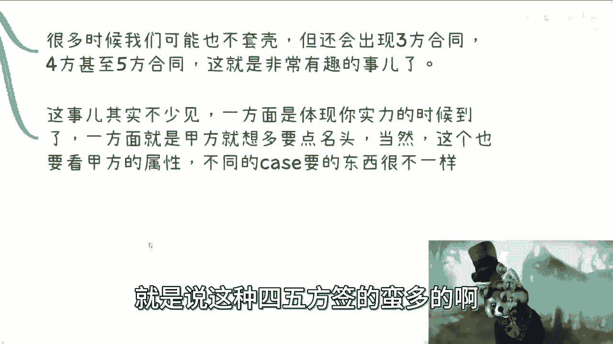

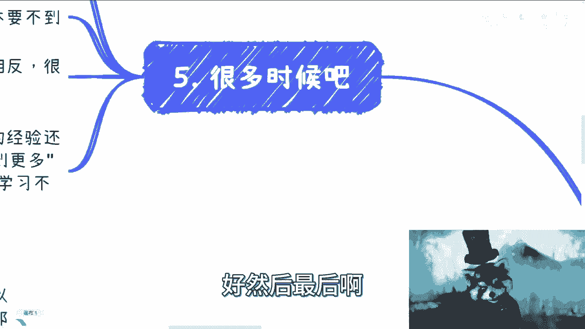

## 课程总结与核心建议

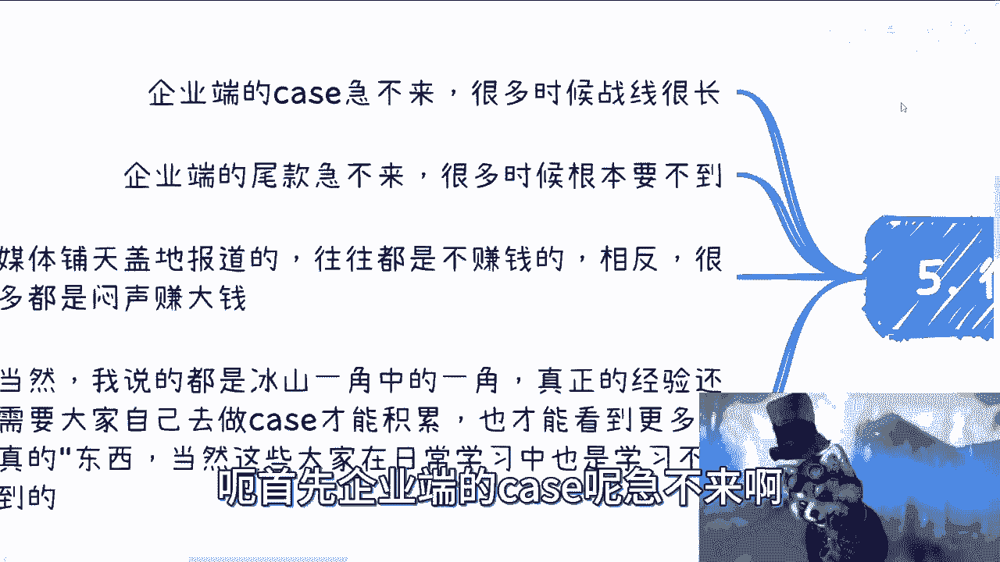

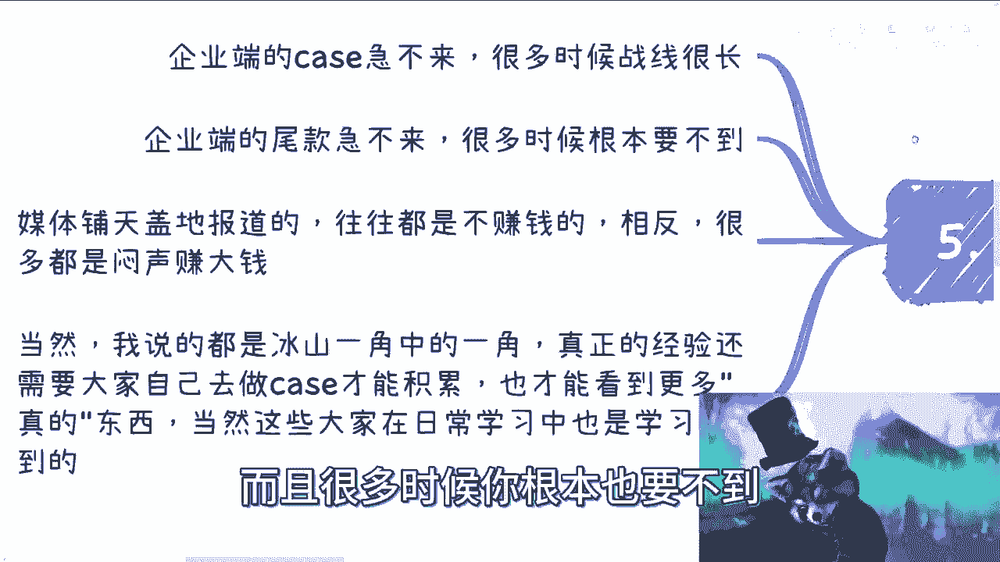

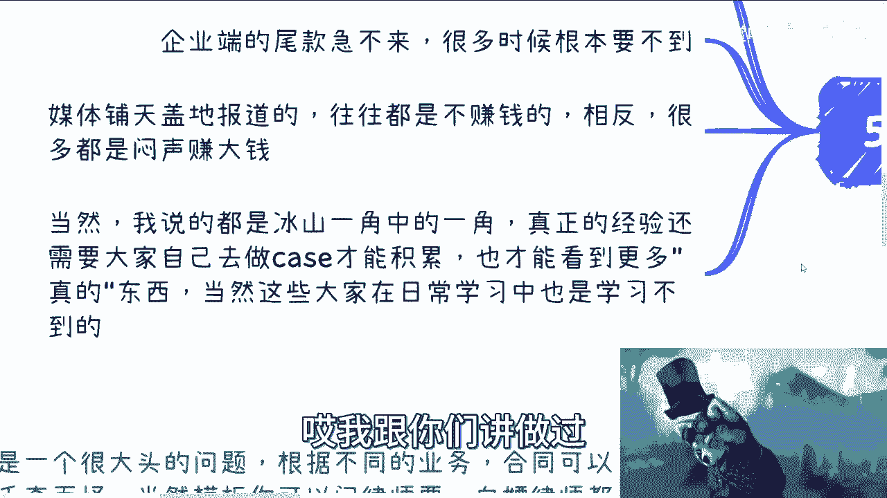

本节课我们一起学习了ToB业务中的几个关键方面：合同签署的要点与风险、企业项目与C端项目的本质区别，以及“套壳”、多方合同等实用策略。

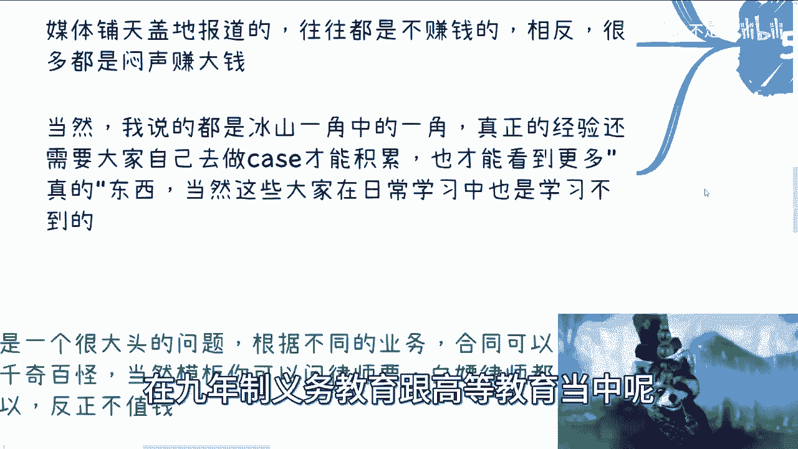

最后，总结几条来自实战的经验：
1.  **战线长**：企业级合作决策周期长，需要耐心。
2.  **回款难**：尾款难以收回是常见问题，需要在合同和项目执行中提前防范。
3.  **报道与盈利**：媒体广泛报道的项目未必赚钱，而真正利润丰厚的项目往往低调进行。

对于想要进入商业领域的初学者，最重要的建议是：**保持空杯心态**。不要因为缺乏经验而妄自菲薄，也不要因为学历背景而过于自信。商业社会有它独特的运行规则，这些规则在传统教育中较少涉及。你需要抛开成见，通过实践和不断学习，去真正理解和掌握它们。