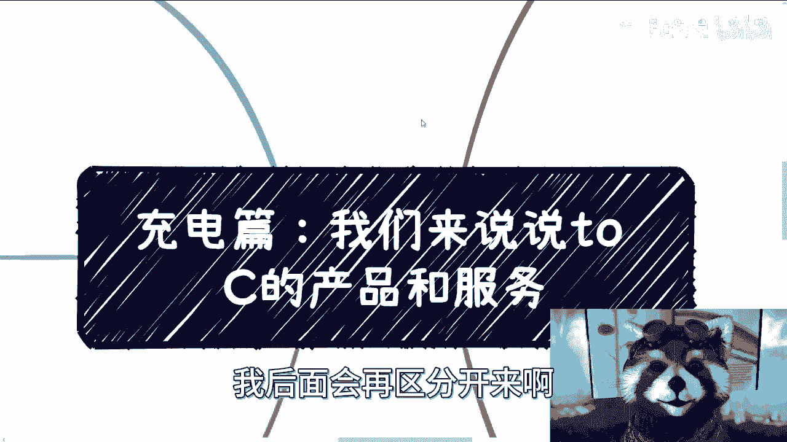
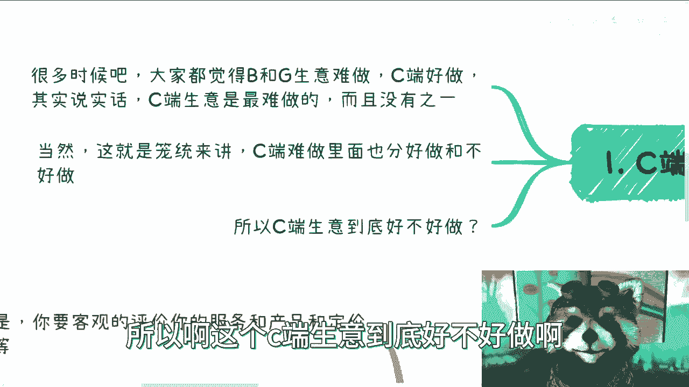
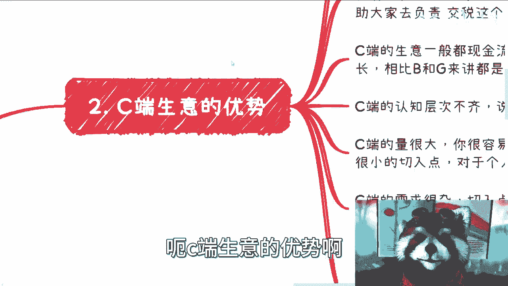
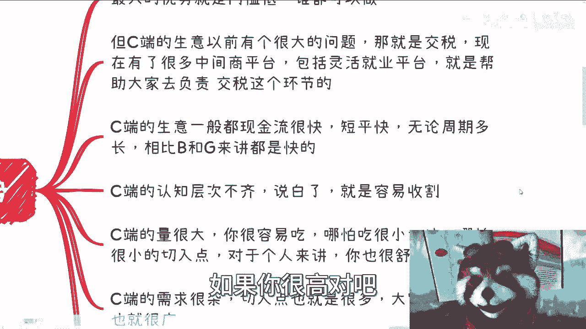
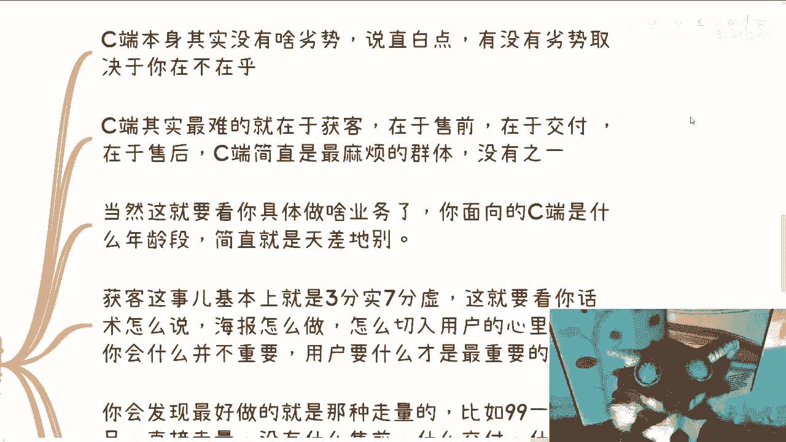
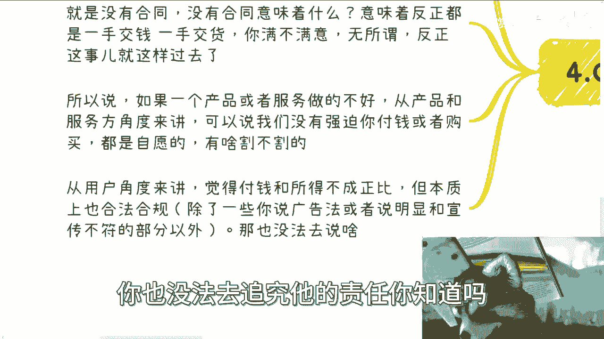
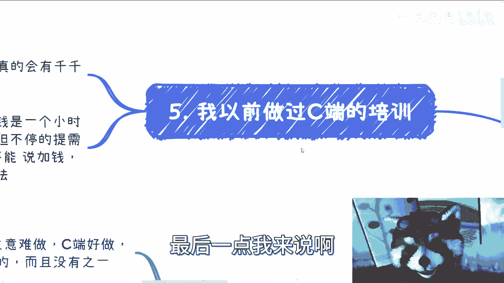

# 充电篇：我们来说说toC的产品服务的优缺点 - P1 - 赏味不足 - BV1eH4y1D72j

好，大家好啊，这个。😊，今天来继续更新一下这个充电片啊，然后。之前还有格局片啊，格剧片还没更新完啊，别着急，慢慢来。

呃，先说啊，本次先说的是这个TC啊产品的这个。呃，产品和服务啊，我这个一下子愣住了是吧？然后to B跟toG啊，我后面会再区分开来啊，给大家来讲。😊。

首先啊第一点。

呃，关于C端呃，这个生意好不好做？有很多种说法啊。呃。首先。很多时候啊呃大众会认为企业端跟政府端的生意难做C端好做。我跟你们这么讲，我作为一个贯穿于企业端、政府端、用户端。

还有这个高效端的这个四端的人对吧？四端的bug。我可以明确跟你们讲，虚单生意绝对是最难做的，而且没有质疑。😊，啊，绝逼是最难做的啊，当然这个也是笼统的讲的。😊，C端难做是难做。

但是C端有它的很大的优势啊，这个后面我们再来说啊呃C端在难做里面啊。😊，难做的这个label下面野风好做和不好做啊，我跟你们讲，我，今天中午真的我操这个中午这个是饭啊。😊，从12点1直吃到3点多，我靠。

我现在这个。😊，啊，我现在感觉今天晚饭就不用吃了啊。所以啊这个C端生意到底好不好做啊，我们来往下看啊。😊。

呃，C端生意的优势啊最大的优势啊就是门槛低。

啊，这个C端我觉得优先级最高的，为什么大家要去做呢？就是因为啊门槛低啊，反正谁都可以做啊这个是C端的第一个点啊，那么第二呢就是说C端生意呢以以往啊我们说做的时候呢，都有个很大的问题，那就是交税。

因为很多人做做C端生意，你会发现就是说呃你做的小问题不大，对吧？因为你往大了做对吧？那比如说包括你的客单价，如果你很高，对吧？你说你要几千块钱几万块钱，那可能对方很多也是会要发票啊，他说我要去公司报销。

或者我要给公司一个证明，那么你个人其实是很难开出这种发票的。虽然开的话，一般其实开那种技术服务啊，对吧？或者技术咨询啊就可以了。但是你开不出来，啊，而且另外一个点你要交税，对吧？那么这两年互联网发展呢。

其实你会发现很多时候啊就是有了中间商平台，比如说呃灵活就业的签约平台啊，包括小额通啊，对吧？包括那个。😊。

叫什么千聊啊啊，包括就是像那种慕客的类似于平台，这个网络云课堂啊等等等啊，这些其实都是帮助C端去很好的能够做C端的生意。啊同时又可以就是说避开也不叫避开吧，就是能够解决啊交税的这个环节啊。

那么这个也是呃近两年做C端生意比较好做的这么一个原因啊，那么C端生意一般呢它最大的一个优势啊，就像我们刚刚说的就是虽然它难做啊，但是它最大的优势就是现金流很快短平快啊，无论C端的周期多长。

它相比企业跟政府端来讲都是快的啊，就是我们刚刚说了就是说用户啊，企业政府和高效四端啊，用户绝对是周期对的呃这个回款最快的啊，毫无疑问，而且快的不得了啊，快的无与伦比啊。那么C端的认知呃。😊。

对，优势啊。那么还有一个呢就是说C端的认知它参差不齐啊，你别说一线到五线城市，你单纯一个城市里面，它它认知就不齐。啊，那么说白了就是容易收割啊，那么C端的量呢同时很大。呃，对于任何一个个体来讲。

你很容易吃。也就是说你哪怕吃很小一块，你哪怕就吃那么一一丢丢就豆腐干里面的豆腐干啊。呃，冰山一角里面的冰山一角里面的冰山一角。那么呃哪怕一个很小的点。那么你对于一个人个人来讲，其实你已经很舒服了。😊。

啊，我们不说赚大钱了，就小钱来讲，其实你已经很舒服了。那么C端的需求呢，而且很杂啊。你不像就是说呃你做企业端，做政府端，做高效端，它里面的门忙路啊，这个道道啊，乱七八糟啊，反正很多，那C端不一样。

C端需求杂的很，对吧？你你想嘛我以前跟大家说过，对吧？就是还有那种什么什么叫人起床，什么叫人晚上睡觉啊，对吧？然后怎么样的，连这种服务都有是吧？那真的就各行各业各个角落你都可以切，也就是说。😊。

你切入面很广，你可以选择服务面很广啊。那么同样的C端呢还有一个很大的优势啊，这个优势是什么呢？就是C端对于产品和服务的考察能力很差，或者啊我们。😊，说的更直白一点，它相对企业跟政府来讲。

C端属于根本没有判断能力。你知道吧？就是虽然啊你会发现一个很神奇的状态，就是你和企业跟政府还有高校去谈，你对面坐着的也是个人，对吧？就这个人也是C端，你明白吧？但是他不一样的地方在什么地方呢？

他不一样的地方就是说企业政府高校做这个CCC端呢，他要么就是就是说认知是比较高的啊，要么就是说他认知可以很低，但是他反正也拍不了板，对吧？那么他可能呃他认知低不低，无所谓。

反正他身边还有很多人会阻止他被割。😊，对吧那么这个就是B端和G端和有高效端的这个区别。但C端不一样，C端属于属于毫无判断能力啊。我曾经在之前的视频里面呢跟大家提到过有一个悖论，就是这个悖论是什么呢？

就是说呃你会发现啊对于那些广撒网的C端产品，就比如说什么呃这这个这个知识星球啊，对吧？或者是说这个比如说99。9块卖卖卖一个课啊，对吧？或者怎么样啊，就是你会发现啊就是真的懂的人。

或者他有这种google或者youtube或者其他的这anyway的这种这种正规正常一点的搜索能力的这些人，他是不可能去买的。😊，你明白吧？就是买的人他一般就是懒啊，或者来说他就是不懂啊。

那么你会发现这当中就什么什么悖论呢？就是说。😡，但凡买的人他大概率他不懂，所以正因为他不懂，他不知道，他就不可能去知道你的这个产品的价值。😡，对吧那么你会发现他既然不知道你产品价值。

那么你再打磨这个产品，其实对他来讲也是没有用，就对牛弹琴。😡，你发现这个悖悖论了没有？我跟你讲，但凡做过C端生意的，他都会明白这个悖论，就非常神奇。就是说直白一点，就是说很多人他打磨产品发现哦。

好像没有卵用啊，吸引不到用户啊。但凡就是说不打磨产品，打磨营销的，哎呀，好像很多用户对吧？然后那个产品他妈烂的和屎一样，对吧？啊？但是很多用户还叫好，怎么办呢？这就是叫C端的生意。😊，你知道吗？

因为他这个悖论在这个里面，你你想让别人看得懂，那不好意思，看得懂的人他不付钱，对吧？他也许认可你的价值，但他不付钱。😊，你怎么办呢？啊，那么好。😊。

那么第一第二点啊，就是C端生意的劣势呃，劣势也很多。就C端呢本身呃我在这个地方写啊，首先如果你看不同的角度，如果你单纯从赚钱角度来讲，C端其实没有什么劣势。而且你如果单纯从你这个呃想要去下定决决心啊。

你说我要去收割C端，或者我要去这个赚C端的钱的时候，你会发现就是C端简直是完美啊。这个这个这个没有任何没有任何的缺点。但是呢就是这个有没有劣势啊，就取决于你在不在乎你ca不care，你知道吧？

就是说首先第一点啊，C端其实最难的在于获克。😊。

在于售前，在于交付，在于售后。也就是说C端在整个产品从头到尾简直就是最麻烦的一个群体，没有质疑。啊，当然我跟你讲，这个就要看你具体做什么业务。你面向C端是什么年龄段啊，你做的是什么产品，对吧？

你卖的什么东西，就简直就是天差地别。那我们盖笼统点来讲是什么意思呢？就是说。😊，你做一件事情，就尤其是C端这边，你要做实。你会很累，而你累成狗，而且你累成狗还不讨好，叫做什么叫吃力不讨好啊。

那么我们来说啊，霍克这个事儿呢，基本上是三分虚。😊，啊，三分十七分虚，你知道吧？你要是三分十七分十，那我跟你讲，你妈累成狗啊，那么三分十七分虚呢，这个就要看你话术怎么说了，海报怎么做啊。

这个标题怎么打啊，怎么切用户的心理。😊，所以说C端的东西啊，我一直强调呃，包括你们做自媒体都是一样的，就是说。😊，你一定要记住，就是你会什么并不重要，你重要的是用户要什么。😡，啊，当然C端这个地方呢。

这句话可能还要再强调一下是什么呢？就C端大部分人他不知道自己要什么啊，所以说。😊，这句话应该怎么说呢？就记住你会什么并不重要。C端要什么也不重要，而是你要让他们感觉到他们要什么最重要。😡，你知道吧？

就就这个样子，C端就是这么个群体啊，你会发现最好做的呢就是那种走量的。就比如说99块钱一个产品啦，49块钱一个产品啊，对吧？就像泡泡泡玛特这种对吧？你也别跟他议价，对吧？他告诉你比如说泡泡玛特吧？

他的一个东西啊，打个比，他的这个成本是10块钱对吧？他就卖你90啊，你爱买不买不买滚结束了，你知道吧？这种就是走量啊，他也没什么售前没什么交付，没什么售后就简单明了，你总不可能说今天他标价标90块钱。

然后你买了买了之后你说我不喜欢他妈的你坑我有什么好坑的了，标价标在你自己愿意买你买呗怪谁了你说对不对？但是你比如说那种卖货的对吧？

或者来说相对定制化一点的这种C端产品或者说就是要走那种就是你交付的时候啊，比如说老是要去走直播教学对吧？或者说要去走那种就是说要跟C端长期打交道的这种模式，那么我跟你讲售前他可以做到你吐。😊，啊。

交付可以做到你吐啊，然后售后可以做到你真的跪在地上，你知道吧？就讨价还价的，来白嫖的，来黑你的来来就是说探查敌情的，还有你的这个什么呃什么竞争对手，跑过来之后搞你的。还有我跟你讲。

可以是千千万万种方式弄死你，你知道吧？就就你会很累啊，你会觉得就是你这个钱赚的，你还不如去上个板啊，而且我跟你讲C端呢它是一个。😊，它是所有服务类型里面，它是一个最主观的一种服务类型。

也就是说啊就是说呃做的好不好，本质上跟你的产品跟你的服务好不好，它并没有直接的因果关系。也就是说可能你做的都很好，但你的用户可能就不喜欢你啊，或者说你的用户就喜欢找你茬，对吧？那那你能怎么办？那没办法。

因为毕竟顾客是上帝。😊，对吧你你毕竟是个服务业嘛，C端还是个服务业嘛。😡，对吧那当然你说就像我们刚说的，你要是99块钱49块钱，对吧？100多块钱，你就是一个标品，你就说我你就卖，那你就别管他们。

他们喜不喜欢他们呃，这个他们这个不喜欢就不喜欢，他找你商就找你，反正你就管你卖，那没问题。但是但凡你要交负担，我跟你讲，这东西就烦了啊，同理啊也就是说有的呢其实做的很烂，但是他营销做的很好。

或者啊你还会发现有一类C端的服务是什么？就是他服务做的很烂啊，不是他产品做的很烂，但他服务做的很好，哎，态度很好啊，待你如初恋，我跟你讲，那对吧？这个C端到最后其实还是个情绪价值啊。😊，嗯。

那么我们就到第四点啊，你说C端生意是不是都是割韭菜啊？😊，我跟你讲，那必然不是。啊，你要说都是割韭菜，那那那这个话题没法讲，你说是吧？你要客观的评价你的服务和产品以及和定价是不是对等的。什么意思啊？

就是说本质上C端的生意有个最大的特点是什么？那就是没有合同。😊，啊，那没有合同意味着什么？意味着反正都是一手交钱，一手交货，你满不满意无所谓，反正这事儿就这么过去了。你你懂啊啊。

所以说呢一如果一个产品或一个服务做的不好，你想想看啊，从产品跟服务角度来讲，它可以说我们没有强迫你付钱，或者没有强迫你购买你都是自愿的。你你你你凭什么说我们割你呢？😊，对不对？但是从用户角度来讲。

他但凡只要觉得啊他付的钱跟他所得到的东西不成正比。呃，无论啊这个钱多低，比如说他哪怕花9。9块，他觉得不值，他也会喷你。😊，啊，然后有的人比如说你服务他很好，他花了30万，花了50万，他就要觉得值啊。

但是这个东西其实本身不值啊，但他只要觉得值，他就他就觉得好评，你怎么说呢？对吧？这事情没法讲。😊，🤧啊，所以说你会发现从本质上来讲，如果从法律上角度来讲啊，你只要营销上没有严重违反广告法。

只要你的宣传跟交付对吧呃。没有严重不符。你就像我们说的，你说你说我卖你一份鱼香肉丝，对吧？你说你买了啊，付了30块钱，我最终卖你一份白饭，那你肯定得告我，对吧？你只要不是特别过分，我跟你讲。

从本质上来讲，C端生意都是合法合规的。😊，哦，他就没有这么清楚的界限在那个地方，你你没法去说他，你也没法去追究他的责任，你知道吗？就这个事情本来就是一个。😡。

这怎么说呢？就是一个很细的一个东西，他没办法。😊，🤧啊，那么好，那么最后一点我来说啊，我以前呢做过C端的生意啊，我做的呢是那种技术类的。就是比如说我教大家写代码，你知道吗？我教大家做什么用什么框架，哎。

我跟你们说，那个时候真的做的欲先欲死，为什么？因为我是既要负责招生，我也得负责就是说交付的，就我来教他们嘛，对吧？你就会发现教的时候呢，会有千千万万种需求，就每个人他的他脑子里面想的东西。

简直是就让你会觉得啊这个脑子里面装的一些什么浆糊，你知道吗？😊。

而且你还不得不去满足，就有一种什么感觉啊？就有一种就是说我呢今天给别人做个外包服务，原本说好呢，1000块钱一个小时的服务啊，正正经服务啊，正经服务对吧？你来的时候我就是我去的时候呢，你会发现哎。

那是一000块钱。但是甲方呢他就不停的提需求，改需求，提需求，改需求，就跟你们写代码跟做设计，或者说给那个那个甲方做东西一样的，对吧？然后呢，你不知不觉给他做了5个小时啊。

他还跟你说哎呃就是说不能加钱啊，这个这个就算在1000块钱里面，对吧？你还拿他没办法，怎么办呢？你跟甲方去刚嘛，你也刚不过他。😊，就这种感觉，你知道吗？啊呀，真的是太难了。😊，啊，所以在那个时候我就。

😊，当时我就有一种想法，就是啊这个C端生意实在太太他妈难做了啊，所以啊我们回到这边来看啊，就是说呃C端啊其实。😊。

最好啊我们就说最好的方式呢，要么就是标品啊，就是没有这么多的定制化东西，没有这么多讨价还价的废话啊，就直接比如说那个卖他个客或者卖他个产品，就是什么什么淘宝包邮，对吧？亚马逊包邮，你直接就做对吧？

可以的。😊，那C端最难的呢就是那种就是说呃既要做招生，又要做售前，又要做交付，又要做售后的。就类似于像比如说什么呃留学培训啦，对吧？然后什么什么填报呃，也不是填报志愿吧，就是比如说呃私立学校的报考啊。

或者有些线下培训啊等等等啊。这些东西是最难的，但是你会发现这些东西难归难啊，但它的客单价高，那客单价高意味着什么呢？意味着就是说这些东西它可以分给不同的人或者不同的团队去做。

那这样的话大家其实就是呃繁归繁啊，但是这样的话就大家各司其职，其实也就还好，就相当于是本来一个人付给一个人这个这个服务啊，呃他废话很多，要求很多，那你又很累，那现在就是说10个人服务你一个人。

那你总归爽了吧，对吧？你随便你随便提啊，随便提需求，总总归有人会来满足你的对吧？那这样的话，最终大家因为客单价高嘛，那大家来分其实分润也还可以啊，但是这样的话呢就是说这个事它的可能周期性啊。

包括他最终的这个这个利益分配可能比较复杂啊，所以基本上呢我觉得C端的产品本质上呃做还是可以做的啊，但是但是基本上我们说它的起步是最难的。😊，啊，也就是说呃从目前来看啊。

除非就是你能够三分时7分时或者一分时9分时的去做营销。呃，否则的话就是说要么你就是背后要有资本的运作，对吧？有一定的推力，有一定的推手。否则很难做，非常难做。因为对于平台方来讲，流量是值钱的。

而流量一定是有倾向性的，而流量一定倾向于的是本来就大流量的，或者说本来就是资本合作的那些人，老百姓，他其实是没有倾斜性的啊。我就告诉你们，就是说C端的很多的平台服务，你们投个几万块钱。

投个10万块钱进去，就积不起水花的，你知道吗？因为背后的其他的账号，其他的很多的这种资本运作，他们里面的量是很大很大的，不是老百姓能够去这个这个抗衡的。好吧，所以就是说嗯。就我最后总结一下吧。

就是说我是觉得做C端生意的。😊，可以啊，这个最大的一个点，反正就是你得不要脸。啊，你的脸。脸皮得很厚哦，对我最后总结一点，还有一点就是做C端生意，还有一个最大的一个一个那个一个一个一个叫什么要注意的点。

就是你千万不要用你的认知去。😊，灌到C端身上，也就是说你不要认为这个这个比如说中国14亿人，对吧？C端认知跟你都一样。如果你觉得跟你都一样，那我跟你讲，你是铁定赚不了钱的啊。

你起码得要要么你就降那么五六个lavel，知道吧？这10个lavel，你去想他们是怎么想的，要么你就是真正的去了解这个中国的这个C端是什么样子的啊，你千万不要用自己的理解理解啊，你你说我跟你说。

今天做个服务。😡，然后从你的角度，你知道哎呀这个东西。😊，这个东西这么傻啊，谁不知道啊，我都知道，哎人搜一下就知道。那我就告诉你搜一下就知道东西也也他妈的卖卖49，卖99，你你要卖的好。

就你可以卖个几几十万粉，就是这样子的，我跟你讲，这就叫C端，你知道吗啊。😡，好吧。行，你就这么着吧，哎呀，不知不觉也讲了蛮多了。😡，呃，好吧，然后大家反正有什么需求，有什么呃这个具体的商业化的东西。

或者具体的这种比如说未来的规划啊，你们不知道怎么做的，反正你们也可以整理好咨询我，好吧，OK。😊。

咦，怎么没关掉呢？