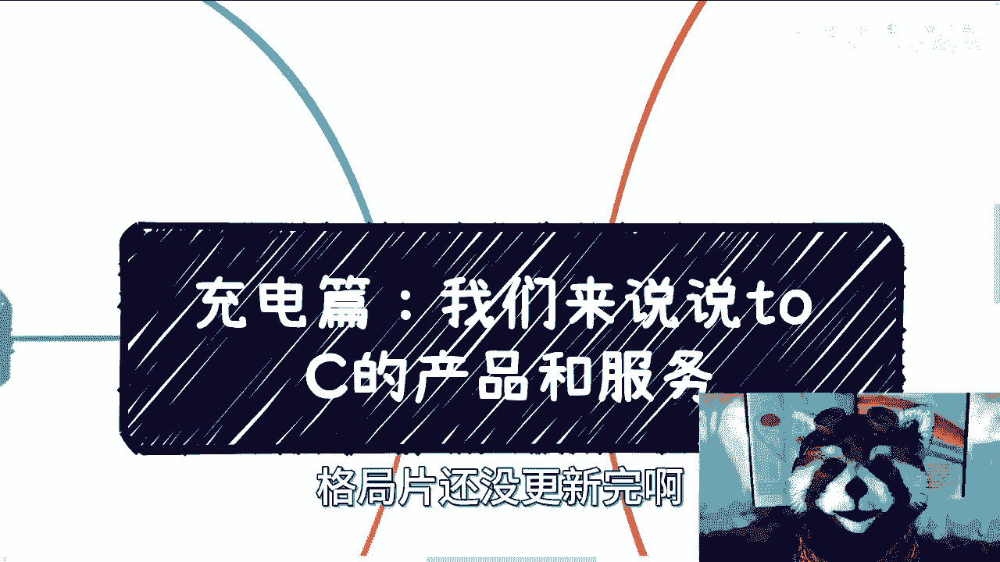
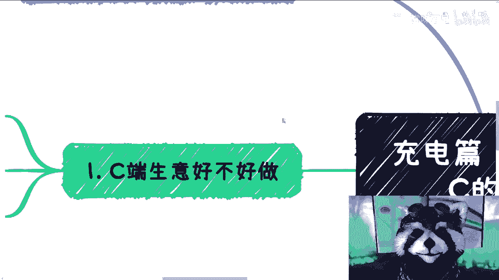
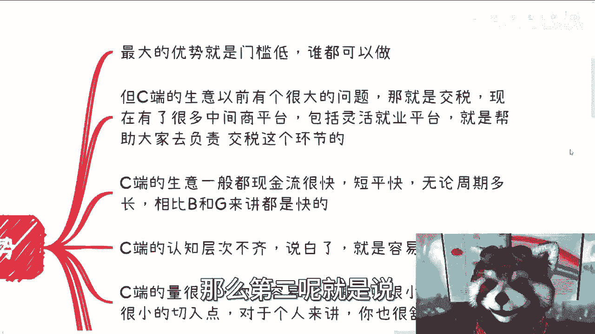
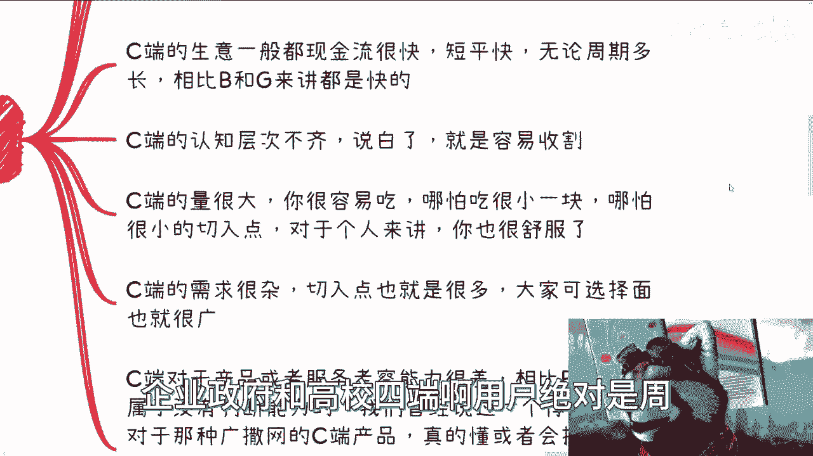
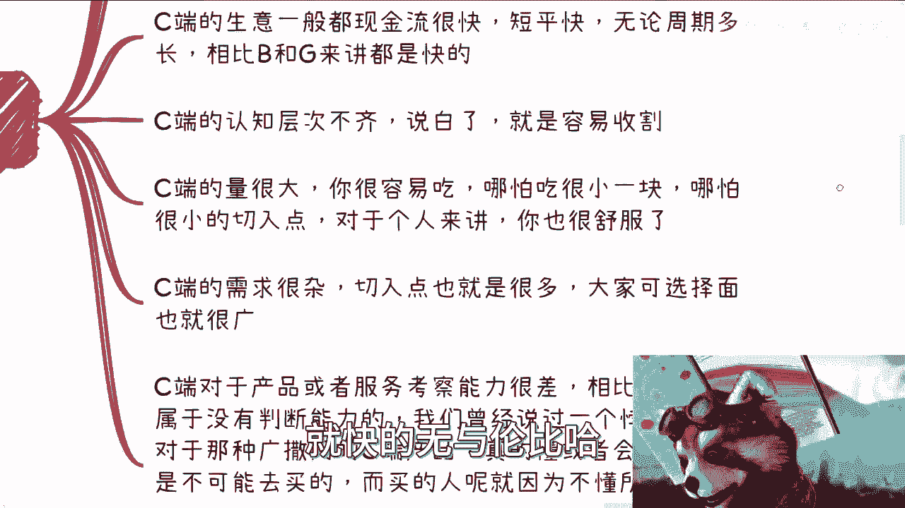
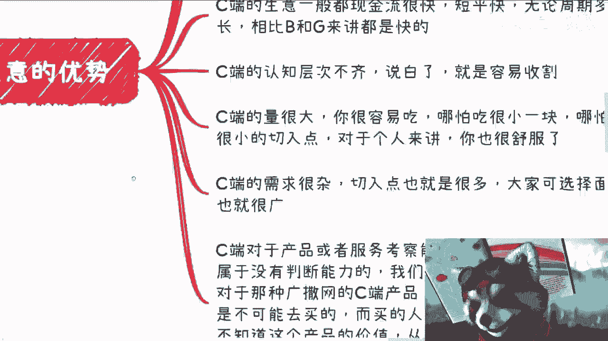
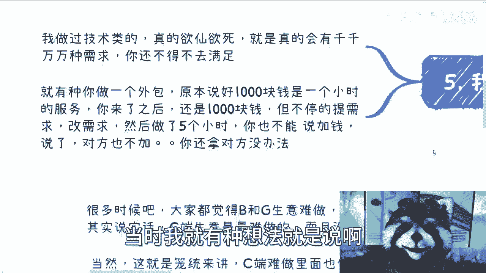

# 课程一：ToC产品与服务详解 📚

在本节课中，我们将深入探讨面向消费者（ToC）的产品与服务的核心特点。我们将分析其优势与劣势，并理解其独特的商业逻辑，帮助初学者建立对C端市场的基本认知。

## 概述

ToC业务，即直接面向终端消费者的商业模式。许多人认为企业端或政府端业务复杂，而C端业务相对简单。然而，根据贯穿企业、政府、用户和高校四端的经验来看，C端生意实际上是最具挑战性的领域之一。当然，这并非绝对，C端业务在难做的表象下，也蕴藏着巨大的机遇和独特的优势。

## ToC业务的优势 ✅

C端业务之所以吸引众多创业者，主要源于以下几个显著优势。

以下是ToC业务的主要优势点：

1.  **门槛低**：这是C端业务最优先级的优势。其进入壁垒相对较低，理论上任何人都可以尝试。
2.  **税务与平台便利**：以往个人从事C端业务面临发票和税务问题。如今，借助如小鹅通、千聊、慕课等灵活就业签约或知识付费平台，可以很好地解决交易合规性问题。
3.  **现金流快**：C端业务的回款周期短平快。与企业、政府端相比，其资金流转速度无与伦比。
4.  **用户认知参差不齐**：从一线到五线城市，甚至同一城市内，用户的认知水平和信息获取能力差异巨大。这为市场提供了多样化的切入机会。
5.  **市场容量大**：C端用户基数庞大。即使只获取庞大市场中极小的一部分份额，对于个人或小团队而言，也可能获得可观的收益。
6.  **需求广泛且杂乱**：C端需求覆盖生活方方面面，甚至包括“叫人起床”、“哄人睡觉”等细分服务。这意味着创业者的切入点和可选择的赛道非常广泛。
7.  **用户判断力相对较弱**：与企业或政府客户不同，个体消费者对产品或服务质量的考察和判断能力通常较弱。决策更易受营销和情绪影响。

上一节我们介绍了C端业务的诸多优势，但任何商业模式都有其两面性。接下来，我们将客观地审视其面临的挑战和劣势。

## ToC业务的劣势 ❌

尽管从赚钱角度看C端似乎很完美，但其劣势主要体现在运营过程的复杂性和对从业者的特定要求上。

以下是ToC业务的主要劣势点：

1.  **运营环节极其繁琐**：C端业务最难之处在于获客、售前咨询、交付实施和售后服务全链条。整个过程可能非常消耗精力，容易导致“吃力不讨好”的局面。
2.  **核心在于营销感知**：在C端市场，“你会什么”并不最重要，甚至“用户需要什么”也不完全关键。最关键的是 **“让用户感觉到他们需要什么”**。营销（虚）的重要性往往远超产品本身（实）。
3.  **主观性强，服务体验为王**：C端服务是主观性最强的。用户满意度与产品/服务的客观质量无直接因果关系，而更取决于服务过程中的情绪价值。态度好有时比产品好更重要。
4.  **价值衡量模糊，易产生争议**：C端交易大多没有正式合同，属于一手交钱一手交货。法律上，只要宣传与交付没有严重不符，基本合法合规。但用户基于主观感受的“值不值”极易引发争议，定价与价值难以客观对标。
5.  **需求多变，沟通成本高**：尤其在需要深度交付（如培训、咨询）的领域，每个用户都可能提出千奇百怪的需求，沟通和满足这些需求的成本极高，类似于面对一个不停改需求的“甲方”，但议价能力却更弱。

## 实践建议与总结 💡

基于以上分析，我们可以得出一些针对ToC业务的实践策略。

对于想要进入或正在从事C端业务的人，有以下建议：

*   **优先选择标准化产品**：尽量做**标品**，减少定制化，避免过多的售前咨询和售后纠纷。例如，直接售卖录制好的课程或实体商品。
*   **复杂服务需团队化运作**：对于客单价高、交付复杂的服务（如留学培训、高端咨询），最好通过团队分工来应对繁琐的流程，将压力分散。
*   **重视营销与流量**：C端生意起步最难，除非你能做到“一分实，九分虚”地专注营销，否则需要有资本助推或流量倾斜。平台流量通常向已有大体量或资本合作的账号倾斜，个人投入少量资金很难溅起水花。
*   **摒弃“自我认知”**：**切勿将自己的认知水平投射到广大C端用户身上**。要成功，必须下沉多个层级去理解真实用户的想法。很多你认为“搜一下就知道”的信息，恰恰是可以包装成产品售卖的内容。
*   **心态调整**：从事C端业务，有时需要脸皮厚，能够接受各种评价，并深刻理解服务业中“顾客是上帝”的情绪价值逻辑。

本节课中，我们一起学习了ToC产品与服务的核心特点。我们认识到，C端业务优势在于门槛低、现金流快、市场大，但劣势同样明显，体现在运营繁琐、依赖营销、价值衡量主观等方面。成功的C端创业者，往往是那些能深刻理解用户心理、善于营销，并能用恰当方式组织产品或服务交付的人。