# 充电篇：我来说下教育1+X的赚钱逻辑 - P1 - 赏味不足 - BV1Yh4y1U7cU

好大家好啊，这个今天我来给大家说一下这个EGX啊，我想了一下啊，我其实写了一些。

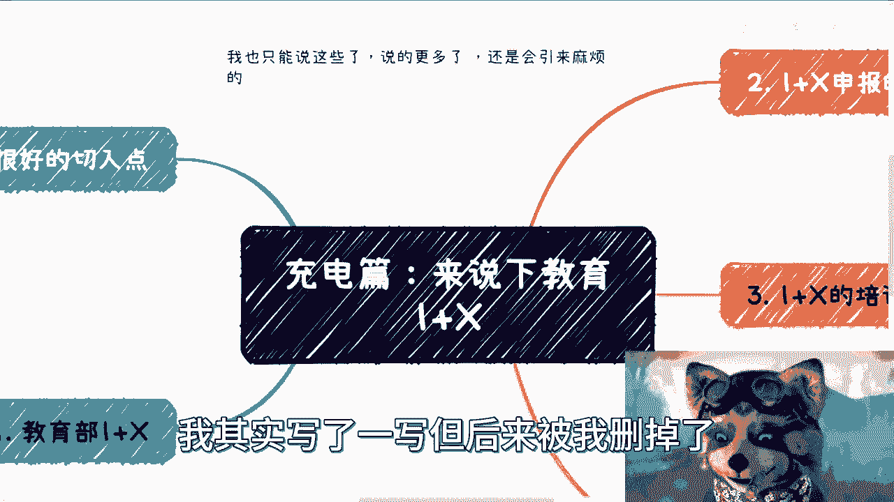

但后来被我删掉了，我想了一下呢，我可能也只能说这些了啊，说的再多。

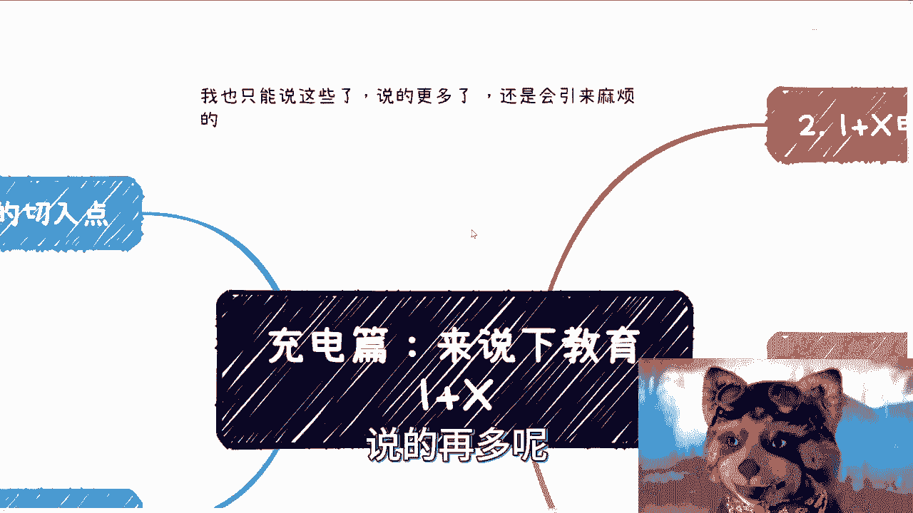

那肯定会引来一些不必要的麻烦，所以没没啥必要是吧。

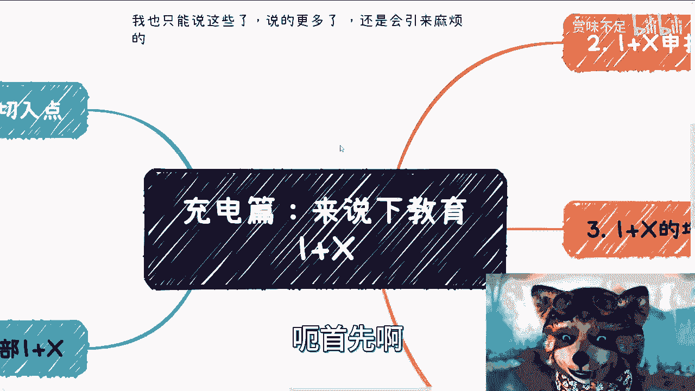

大家有兴趣的可以去了解一下，呃我呢也有一段时间没有做了，可能有些东西记得不是太清楚啊，但是我尽量跟大家说，我记得的同时呢，呃跟大家说一下这个核心的一些关键点啊，首先呢这是一个有资质的东西。

也就是说呢政府是会做公示的啊，关于哪些机构能做一加X啊，那它是有个公式的，也就是说不是说啊大家想做就做的啊，那么这第一个当然了，就是说每一年也可以做申报啊，一加X的这个申报材料，就网上肯定都有的嘛。

这个就不用我说了啊，你们自己去找肯定都有的，那么可以找这个相关的资料去做申报，那这是第一个，第二个呢，就是说呃大家申报的呢是一加X下面的这个，细节领域，也就是说你们去看一下，就是说呃现在差不多第六批啊。

第五批啊，反正就是呃你们可以去看一下，以前公示的一加X的这个机构啊，它是呃公司啊，然后后面会有个专业啊，类似于像专业的东西啊，啊就比如说为什么大数据分析啊对吧，或者怎么样子，就是它会有一个切入点。

那么一加X这边的整个的一个范围啊，应该是所有的领域啊，就不管什么新能源啊，这个大数据啊，互联网啊，反正乱七八糟的都有我，我印象当中我做的时候呢，反正披露的已经有大概200多家了啊。

反正后面披露就越来越多了啊，那么呃这个一加X做呢就是会做一个很针对，并且专业性的东西啊，那么一加X的课程呢呃根据不同的级别，因为它是会分级别的，根据不同的级别呢会跟不同的学分挂钩。

就比如说最低级别可能是一分啊，网上的话可能01：05分或者两分，这样子他是跟学分可以挂钩的，那么一加X呢本质上也是可以借资质的，也就是说你要是不申请啊，你也可以问别人借资质，这个也是可以操作的啊。

在市场上也是有蛮多的人这样操作的啊，那么同样的核心是在于和实训平台。

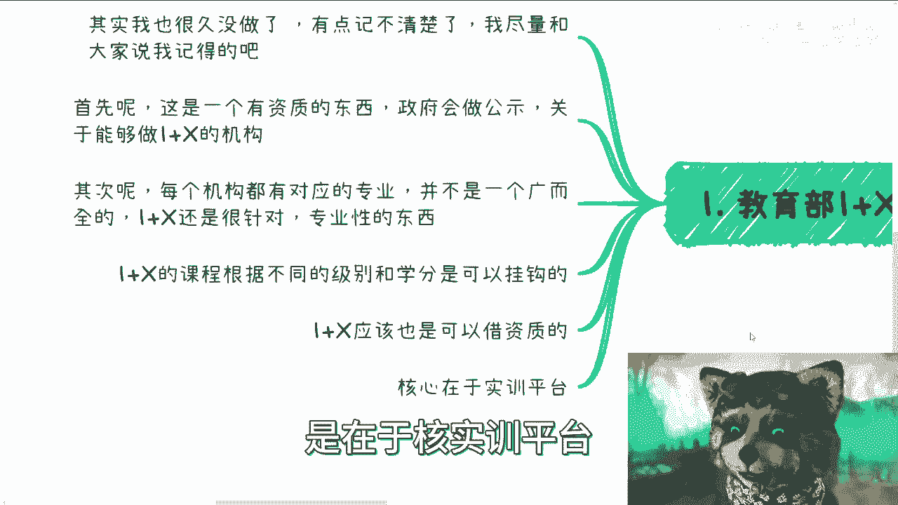

实训平台，这个我们后面再来讲啊，呃首先呢一加X的申报的核心呢。

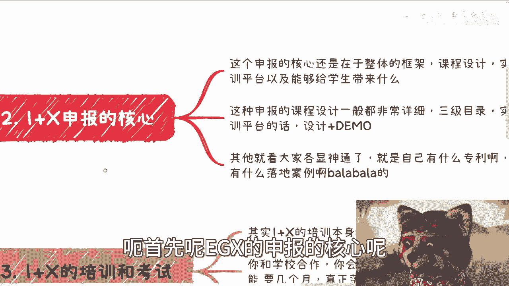

核心申报核心是在于整体的这个叫什么，一加X的这个整体的设计，就是你的那个EGX的设计，比如说你是针对数字经济啊，是什么数字媒体对吧这种，然后呢整个框架你是怎么设计的，就是宏观层面假大空呸。

不能这么讲是吧，就是这个这个高大上层面啊，怎么设计的啊，然后设计课程怎么设计，包括实训平台啊。

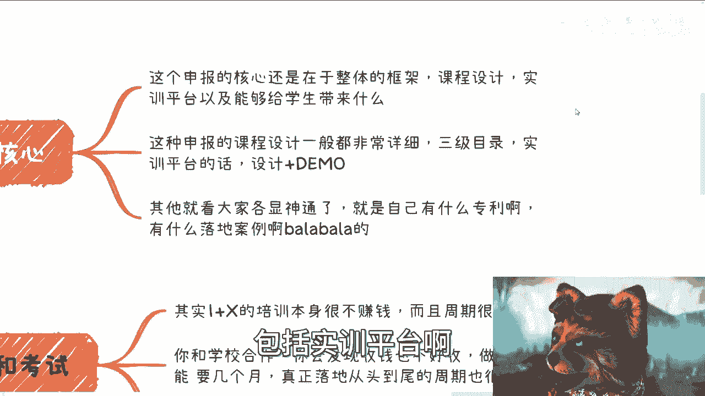

以及能够给学生带来什么，那么我觉得这是第一个，第二个呢就是说这种申报的课程设计，一般都会比较细，也就是说他起码要个三级目录好，L3级目录，那么实训平台的话呢是呃，它需要的是你的设计图。

你的demo的地址对吧，好第三个呢就是说其实就看大家各显神通了，也就是说你得秀肌肉，你告诉他，你就说啊我多牛逼对吧，我有什么专利对吧，我有什么落地案例。

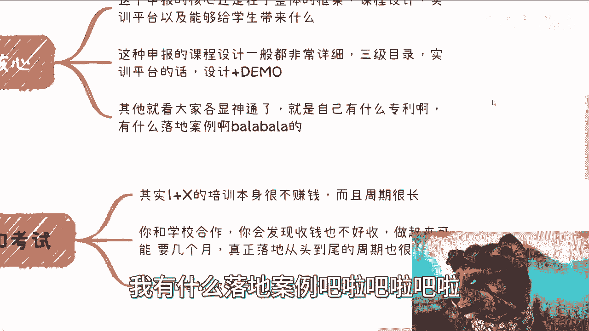

巴拉巴拉巴拉，反正就写嘛啊，那么第三点呢，关于这个一加X的培训和考试啊，其实呢一加X培训本身很不赚钱，而且你很容易贴钱啊，这件事情你们记住啊，就不像很多人觉得啊，我做一个东西是做培训的，不是哦。

就是说你跟学校合作呢，你会发钱收收钱啊，不是很好收，做起来呢又有可能要几个月对吧，就真正落地了，从头到尾周期很长啊，培训跟考试呢也不是说你不能收钱，但是你收的这个钱估计都不够，你人的成本费用啊。

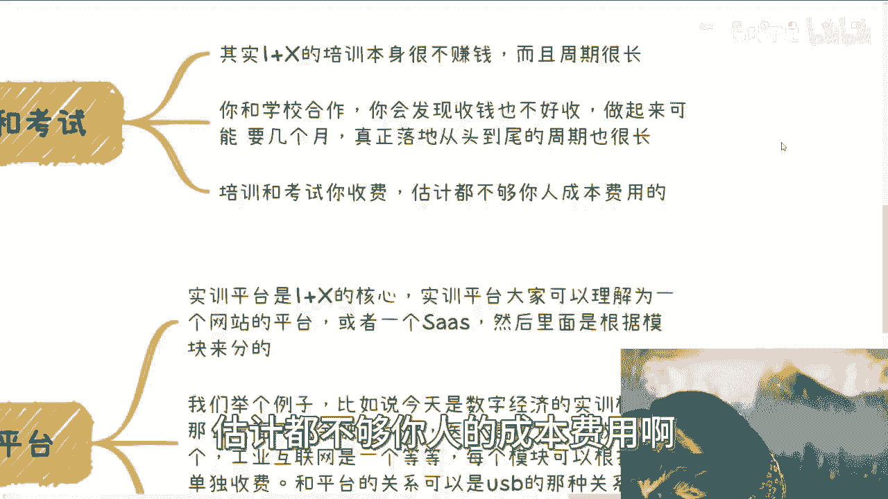

这个东西我得在这个地方给你们备好坑对吧，那当然这个东西是吧。

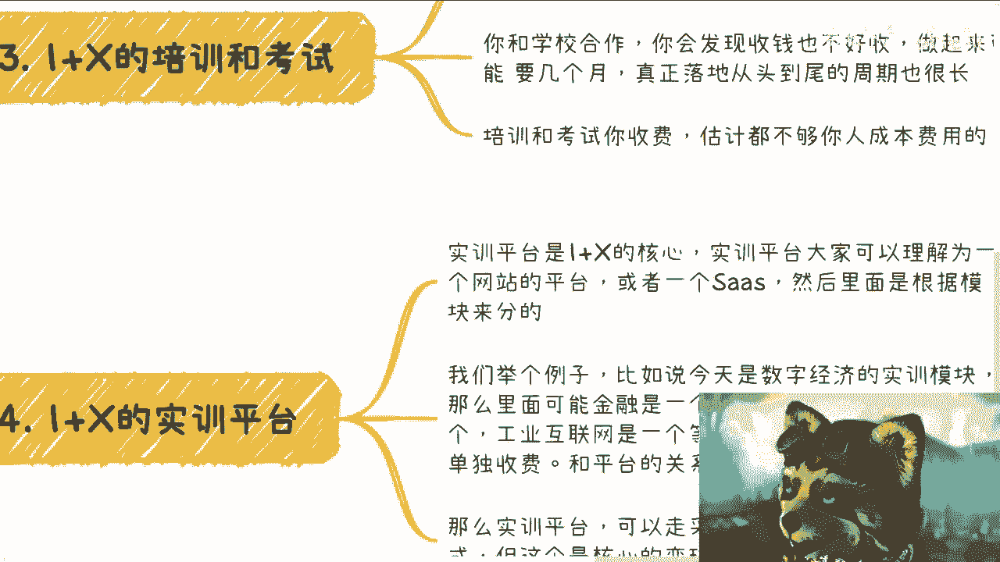

也不太好讲啊，讲了那么容易被人喷啊，呃第四个呢就是实用平台。

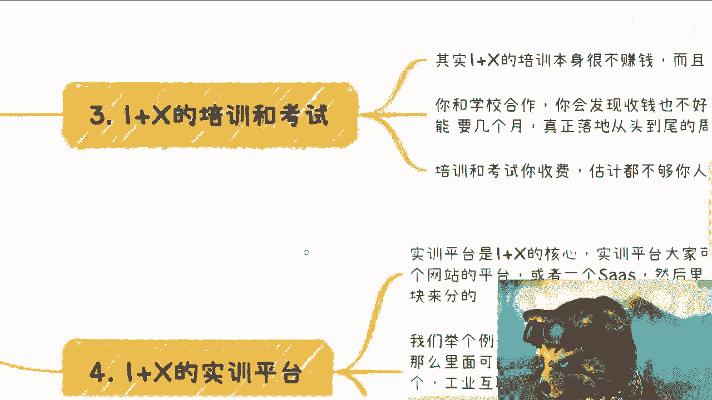

实验平台呢是一加X的核心啊，就是说大家可以理解为实用平台呢，是一个网站啊，这么一个平台并不是一个windows程序啊，或者是一个SARS啊，那么呃里面呢是可以根据模块来分的啊，我们举个例子。

比如说你今天做的是数字经济的实训模块啊，那么这里面可能一个模块呢是金融，一个模块呢是医疗，一个模块呢是大数据，一个模块是工业互联网啊，你可以分啊，当然分多少是你说了算的，没有规定的哦，你分的越多。

那么你有可能成交的这个订单的可能性就越高，对不对，那么每个模块呢可以根据需求单独收费啊，就比如说这个学校呃，要数字经济的这个实训模块对吧，但是呢他说我只要里面的医疗可不可以可以啊。

那么这些模块跟平台的关系，就是一种USB的那种机插机把式的关系啊，是这样子的，一般走采购啊，就是一次性买断，对你说啊，我们就这么说吧，一次性买断再加每一年的服务费，维护费啊。

一般来讲维护费是采购费用的15%啊，这个我也直接跟你们讲，无所谓啊，那么也可以呢是账号租赁的方式，那么账号租赁方式呢，你们可以设计一个金字塔级别的啊，有没有进展，就阶梯级别的，就是说比如说啊我并行啊。

比如说一呃这个一年对吧，是500个账号对吧，那你学校学校用啊，每个账号比如说是多少时间，多少费用对吧，那如果你要1000个账号好，那么我可能就提价，你知道吧，那么这个才是真正的变形逻辑。

那么大概这个东西是什么一个规模啊，就是一般来讲一个模块可能小几万块钱，到小几10万都有可能的，看模块的复杂度，看模块的新颖程度啊，那么呃什么意思呢，简单来讲，就是说你一个SARS平台或者一个实训平台。

你有那么两三个模块，基本上就是百万级别的项目。

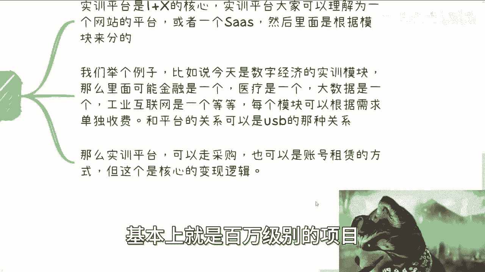

那就是我就直接跟你们讲啊，反正你们心里有个数啊，呃那么同样的AGX呢还是个很好的切入点。

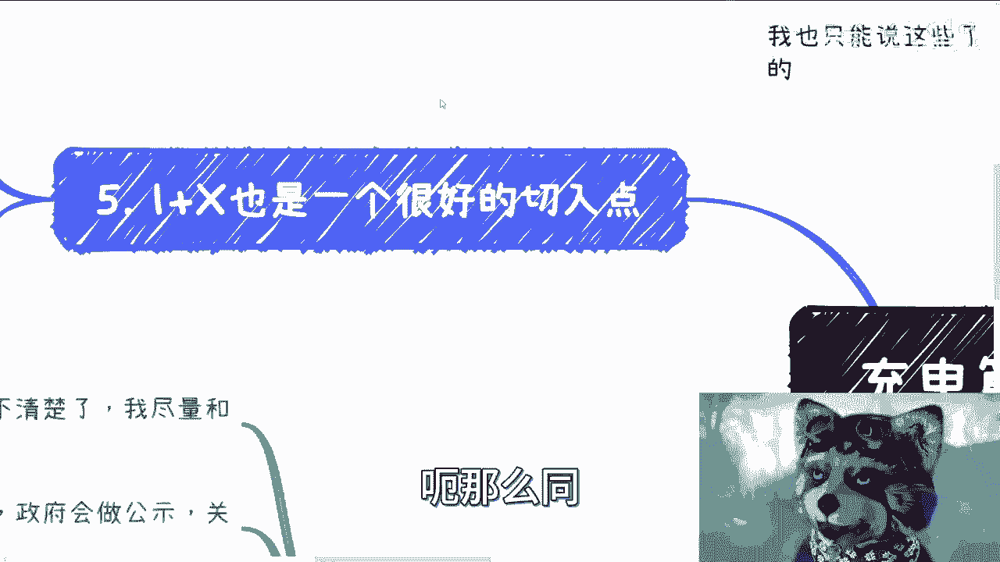

就是说因为很多时候很多人也也要跟学校合作，但是他苦于没有抓手，也就是说没有这个切入点跟高校合作，那么你可以找一加X，所以说你找高校，高校就就首先你从整个制度上来讲，他不会拒绝你对吧，那你怎么谈。

这个是后话嘛对吧，这是第二第一点啊，第二点就是说一加X呢，一般也是会以竞赛的方式去做，就比如说什么某某某竞赛了对吧，然后正好里面会结合一加X的培训，然后这个结合就是最终的这个考证对吧，然后实训对吧。

那么呃现在有名的呢跟操作呸，我说错了，现在在明跟操作面对吧，就是说你做这种竞赛，你在明上面，你在操作面上面，其实可以提升到比较宏观的角度，什么意思呢，就比如说你的什么指导单位啊，你的协办单位啊。

可以找一些政府领导啊对吧。

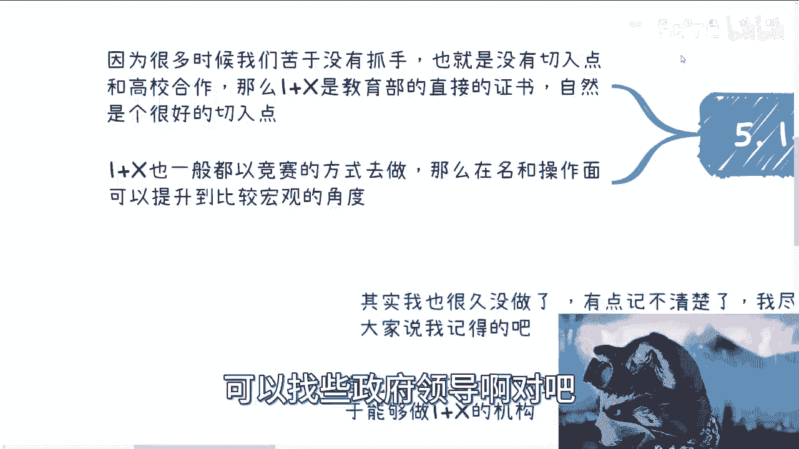

政政政政政府协会啊，什么管管委会啊，这种对吧啊，那么呃差不多啊，差不多，也就是说我觉得一加X的核心呢，我主要想告诉你们的是什么呢，就是说呃它的核心主要就几块，一块是申报，如果你想申报。

那么你得把这个名申报下来，如果你不想申报，你就问别人借资质对吧，我觉得这也无所谓啊，然后第二点呢就是它的钱来源呢，主要是来源于采购跟账号的租赁，那当然以前是这样子的，就前两年这么玩的。

现在我就不知道了啊，但但但我觉得也大差不差大差不差，然后第三点呢，就是说这个东西呢在全国范围里面，肯定都是有效的啊，都是通用的嘛，你去哪个高校不是这样子的对吧，也就是说这个方案或者这笔钱。

你可以从多个地方去转，知道吧啊，那么我觉得这个东西呢就是比较直接的啊，比较直接的呃，我想想里面还有什么坑啊。

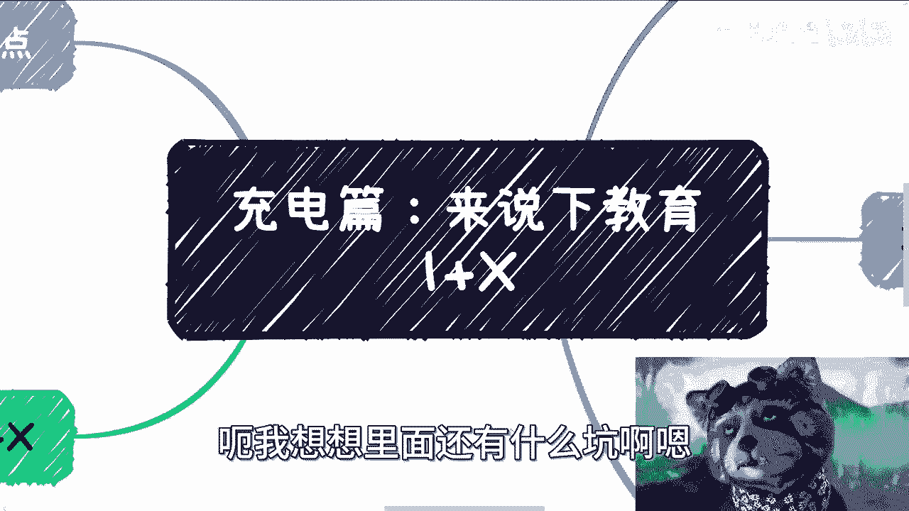

也没有啊，其实也没有漫画的，基本上就这么个方向。

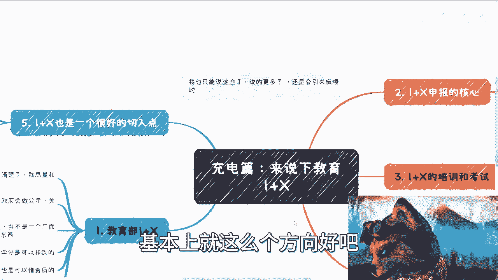

好吧，呃剩下我就不能再讲太多了。

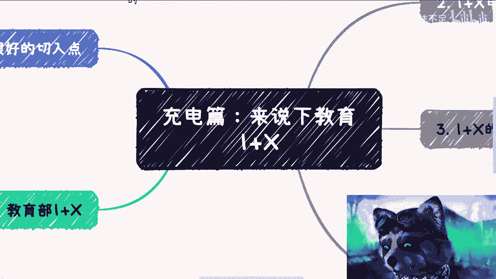