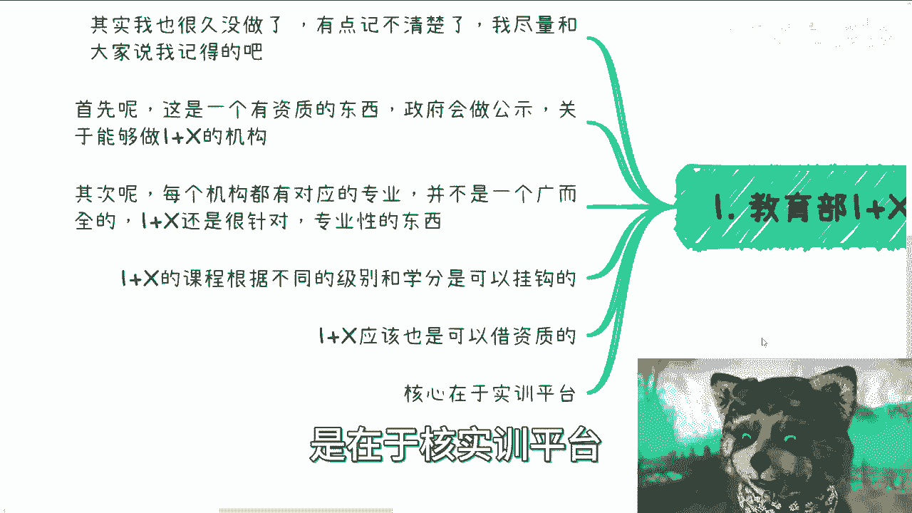
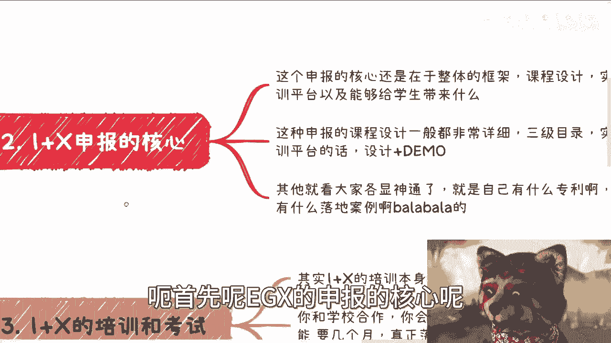
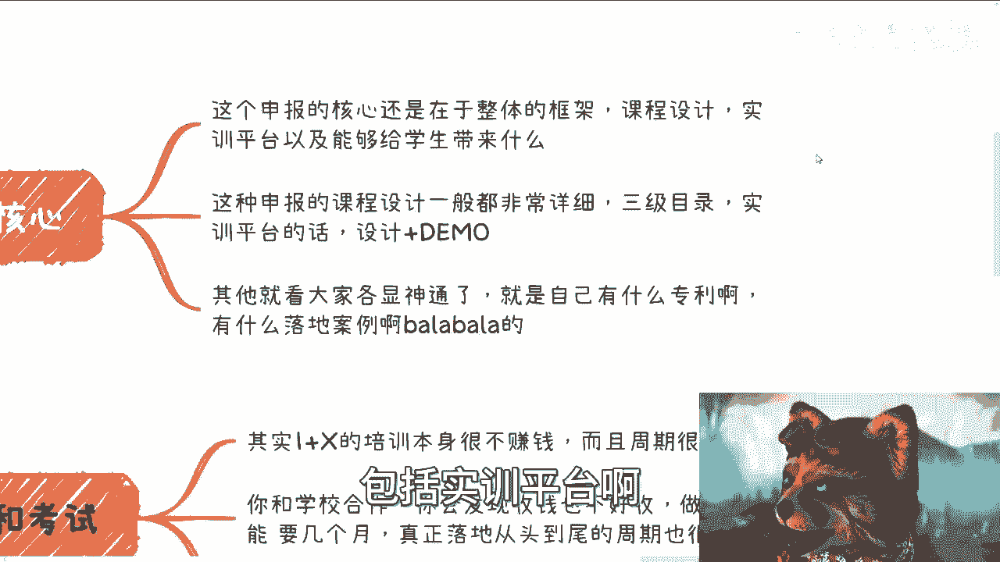
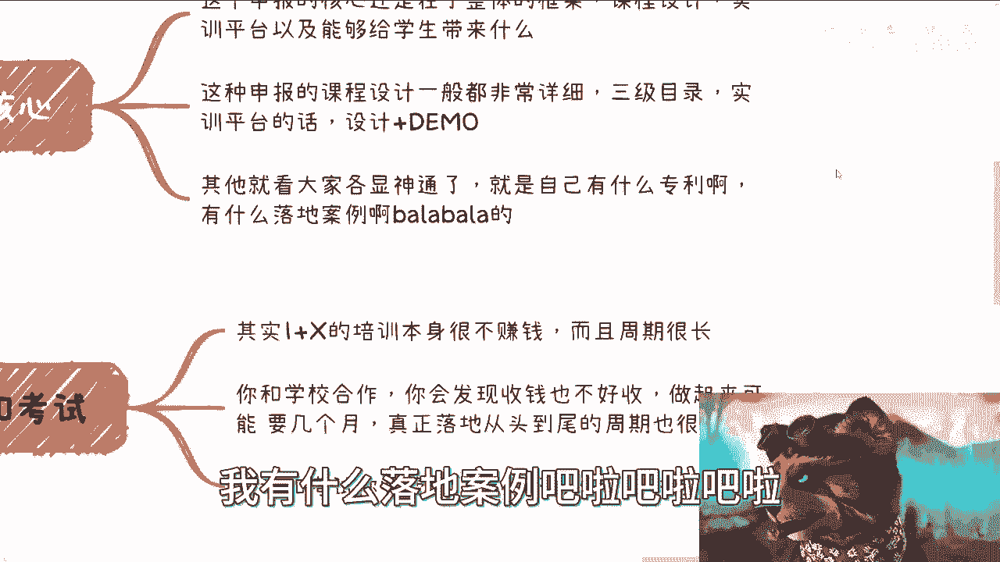
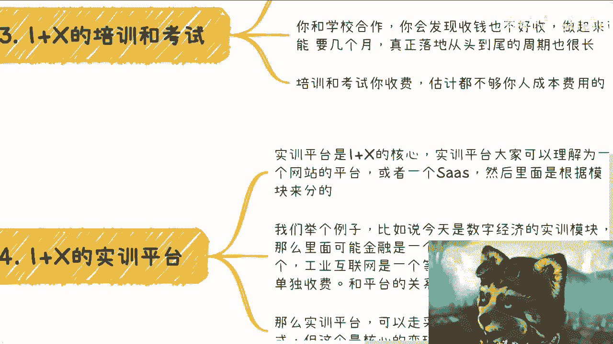
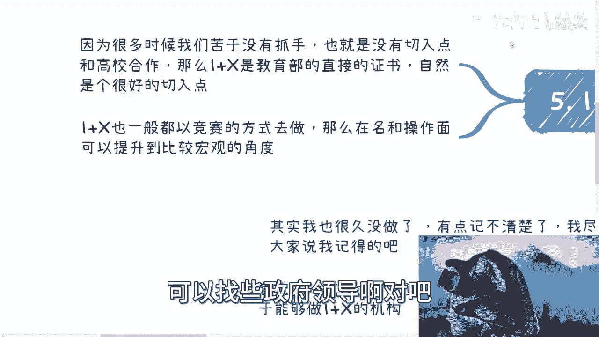

# 充电篇-我来说下教育1-X的赚钱逻辑---P1---赏味不足---BV1Yh4y1U7cU

在本节课中，我们将要学习“教育1+X”证书制度的核心逻辑、申报要点以及关键的盈利模式。我们将重点解析其官方背景、课程设计、实训平台的重要性以及主要的商业变现路径。

## 概述

“教育1+X”证书制度是一项由政府主导、旨在深化产教融合的职业教育改革措施。它并非一个可以随意参与的普通项目，而是需要特定资质的官方体系。理解其运作逻辑，对于希望参与其中的机构或个人至关重要。

## 1. 资质与申报：项目的准入门槛 🚪

上一节我们概述了1+X项目的官方背景，本节中我们来看看参与该项目的第一步：获取资质。

首先，这是一个有官方资质的体系。政府会对有资格开展1+X项目的机构进行公示。这意味着并非任何机构都能随意开展相关业务。

以下是获取资质的两种主要途径：
*   **自主申报**：机构可以每年根据官方要求，自行准备并提交“1+X”的申报材料。这些材料通常需要详细说明项目设计、课程体系等。
*   **借用资质**：如果不想或无法自行申报，市场上也存在向已获资质的机构借用资质进行合作的操作模式。

1+X项目覆盖领域广泛，包括大数据、互联网、新能源等几乎所有专业方向。申报时需要选择一个具体的“细节领域”作为切入点。

## 2. 课程设计与实训平台：项目的核心内容 📚

在了解了准入门槛后，我们进入项目的核心构建部分：课程体系与实训平台。

申报的核心在于整体的项目设计。这包括宏观层面的框架设计（例如针对“数字经济”或“数字媒体”的顶层规划）以及具体的课程内容设计。课程设计通常需要非常细致，至少达到**三级目录（L3级目录）**的详细程度。

实训平台是整个1+X项目的核心盈利点与价值体现。它本质上是一个网站或SaaS平台，而非本地程序。

以下是关于实训平台的关键信息：
*   **模块化设计**：平台内容通常按模块划分。例如，一个“数字经济”实训平台可能包含金融、医疗、大数据、工业互联网等多个独立模块。
*   **灵活销售**：这些模块可以像USB设备一样“即插即用”，学校可以根据需求单独采购某个或某几个模块，而非必须购买整个平台。
*   **商业模式**：主要分为**一次性买断**加每年**15%左右**的维护服务费，或**按账号租赁**的阶梯式收费模式。

一个功能模块的价格可能在几万到几十万元不等。拥有两三个成熟模块的实训平台，其对应的项目总额很容易达到百万级别。

## 3. 盈利模式与商业逻辑：钱从哪里来 💰

上一节我们介绍了作为核心产品的实训平台，本节中我们来看看围绕它形成的具体盈利模式。

需要明确的是，1+X项目中的**培训和考试本身并不赚钱，甚至可能亏钱**。因为与学校合作开展培训的收费困难，周期长，人力成本高，很难覆盖支出。

真正的盈利来源于以下两个方面：
1.  **实训平台销售**：如前所述，通过向学校销售平台模块的一次性费用和持续的年度服务费获得收入。
2.  **账号租赁服务**：提供按年、按账号数量的阶梯式租赁服务，这是更灵活的变现逻辑。

此外，1+X资质本身是一个与高校合作的优质“切入点”或“抓手”。它还能与各类职业技能竞赛结合，通过竞赛扩大影响力，并可能引入政府单位、行业协会等作为指导或协办单位，提升项目层级。

## 4. 核心要点与风险提示 ⚠️

最后，我们来总结一下参与1+X项目的核心要点与需要注意的方面。

以下是三个最核心的要点：
*   **资质是前提**：要么自己申报成功，要么通过合作借用他人资质。
*   **平台是核心**：主要的收入来源于实训平台的销售与租赁，而非培训费。
*   **模式可复制**：一旦形成成熟的方案和产品，可以在全国范围内的高校进行推广，具备规模效应。

同时，需要注意培训环节可能不盈利甚至亏损的风险，在规划业务时应重点考虑平台产品的开发与销售。

## 总结

本节课中我们一起学习了“教育1+X”项目的完整逻辑。我们从其官方资质和申报要求讲起，深入分析了以**实训平台**为核心的产品设计，并揭示了通过**平台销售与租赁**而非培训收费的主要盈利模式。理解这些核心点，有助于清晰地看待该项目的商业机会与操作路径。