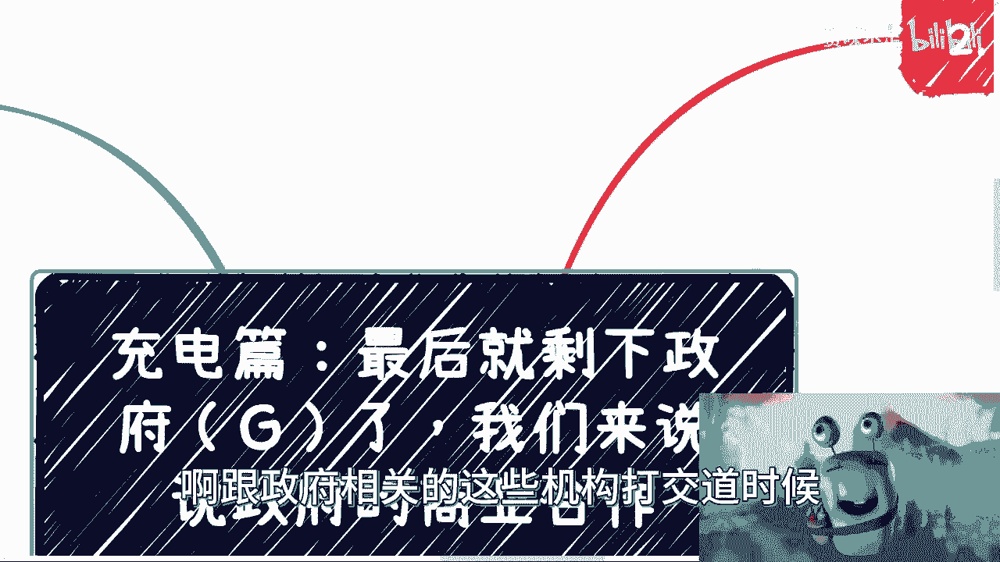

# 充电篇-最后就剩下zf端了-我们来说zf的商业合作---P1---赏味不足---BV16w411Y7

在本节课中，我们将要学习商业合作四大方中的最后一方——政府端（G端）的合作逻辑。我们将明确政府相关机构的范围，理解合作的核心原则，并掌握与政府机构建立联系及推进合作的具体方法。

---

## 概述：什么是“政府端”？

上一节我们介绍了个人C端、B端和高端的商业逻辑，本节中我们来看看剩下的政府端。这里的“政府端”是一个广义概念。

从某些角度来讲，央企、国企、党媒、央媒也算政府相关机构。高校、职业院校等与教育相关的单位，可算作半政府机构。由政府直属、或存在间接管理关系的协会、商会也在此列。

记住，并非所有协会、商会都属于政府相关。需要审视其关系链，只有存在直属或间接管理关系的，才属于我们所讨论的范畴。

因此，广义的“政府机构”包括：
*   以上提到的协会、高校、党媒、央媒、央企、国企。
*   作为上述机构股东、或存在股权关系的公司，例如其子公司或投资的公司。
*   各种直接的政府机关。

以上所有类型，我们在此统称为“政府机构”。

---

## 合作基础：为何规则至关重要？

在深入方法之前，需要理解与政府合作的基础逻辑。所有的合作都是先达成协议，再进行交付。

与政府机构打交道时，任何事项通常都需要经过审批流程。即使某个具体合同本身不需要上级审核，合作中仍有许多细节无法绕过，例如Logo使用、特定词汇、是否需要领导站台等。

也就是说，无论合同本身是否需要审核，你总有一些细节需要遵从对方的规则。因此，本节所讲的内容，均适用于与政府及相关机构打交道时需要做到的要点。

---

## 第一节：如何接触政府机构？🤝

与政府机构建立联系，需要讲究方法。以下是几种可行的接触途径：

以下是接触政府机构的几种主要方式：

1.  **第三方介绍（最佳途径）**：最好通过第三方引荐。直接认识的可能性极小。介绍时需要有一个明确的“抓手”，即具体的合作点或目的，并向中间人说明。
2.  **咨询培训切入**：通过为企业或机构提供咨询、培训服务，从而认识其中的管理人员或领导。这是一种积累关系和信任的长期方式。
3.  **合作方引荐**：通过现有商业伙伴引荐，例如组局吃饭。但同样需要提前找好切入点和沟通主题。
4.  **主动参加活动**：大胆参加相关行业活动、论坛，主动接触在场的领导或秘书长等关键人物。

需要说明的是，企业协会、高校等机构相对容易接触。纯粹的政府职能部门，如厅、司、局等，难度最大。如果没有中间人或明确抓手，只要目标不是纯粹的政府单位，其他类型机构仍有尝试接触的概率。

---

## 第二节：政府端合作的两大核心 🎯

理解了接触途径后，我们来看看合作的核心。与政府端合作，核心就两点。

以下是政府端合作必须把握的两个核心：

1.  **遵守规矩**：必须遵循商业世界和对方体系内既有的规则。这包括吃饭、喝酒、送礼、给红包等社交礼仪。各地（南北方、各线城市）规矩不同，尤其是对待领导，必须提前打听清楚。
2.  **投其所好（KPI）**：一切沟通和方案必须切中要害，满足对方的真实需求与KPI。无论你个人性格如何、技术多强，在政府机构面前，你需要说的是他们想听的，做的是他们想要的。你的方案必须服务于他们的目标。

补充一点：以上这些规则和经验，即使拥有再高的学历，也无法从书本中获得。切勿仅凭自己想象提出“完美方案”，在不了解规则的情况下，这只会让你显得幼稚且不可靠。

---

## 第三节：关键认知：什么才是最重要的？⚖️

明确了核心后，我们需要建立正确的优先级认知。在政府端合作中，关系的建立和维护远比技术细节重要。

与政府合作，对方看重的核心顺序是：**靠谱 > 懂得游戏规则 > 交付物**。

你不懂游戏规则，技术再好也只能做执行交付。而交付本身也需要看过往案例。如果没有与政府合作的经验，对方通常不敢合作，因为无人承担得起可能出现的风险。

说穿了，为政府做事的第一要素是：懂得对方要什么，懂得什么该做、什么不该做。这本质上就是需要有政府的合作经验。没有经验，寸步难行。

关于大家关心的学历、技术背景：
*   这些并非不重要，但它们属于交付和执行层面的细节。
*   在建立关系、洽谈合作的初期阶段，几乎没有人会关心这些。
*   领导关心的是项目能否**安全、政治正确、满足需求且低成本**地交付。
*   过度炫耀学历或技术背景，反而可能让对方觉得你不懂重点、不够靠谱。

你只需要讲述和关心对方在乎的东西就够了。

---

## 总结与反思

本节课中我们一起学习了政府端（G端）商业合作的框架。

我们首先定义了广义的“政府相关机构”范围，然后强调了遵守既定规则和满足对方KPI是合作的两大核心。接着，我们探讨了通过介绍、培训、活动等多种途径接触政府机构的方法。最后，我们明确了在政府合作中，“靠谱”和“懂得规则”远比学历、技术等执行细节更重要。

如果你觉得这些内容难以切入，或许是因为相关的规则认知需要时间积累，正如教育需要多年时间一样。理解并适应这套规则，是开启政府端合作的关键第一步。