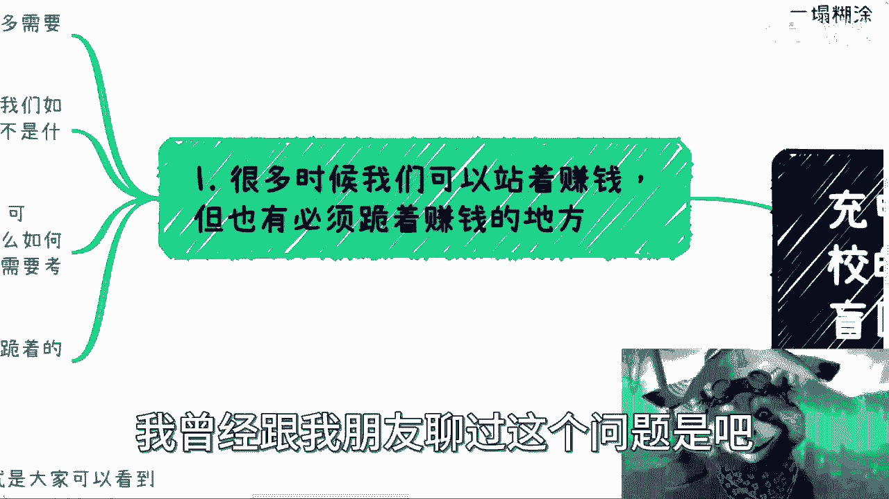
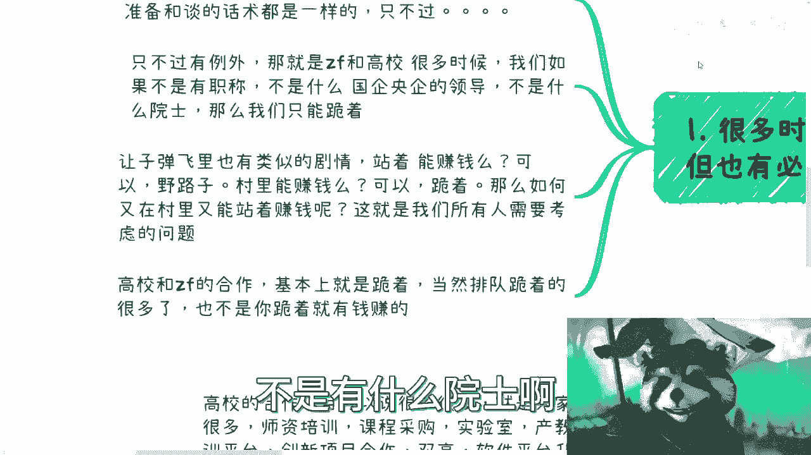
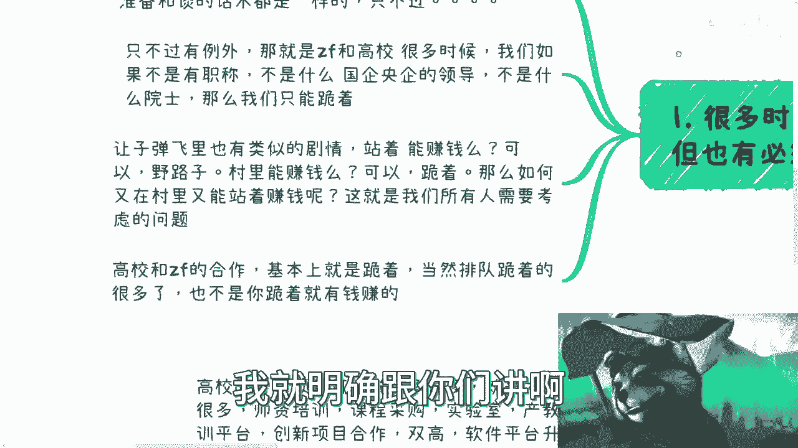
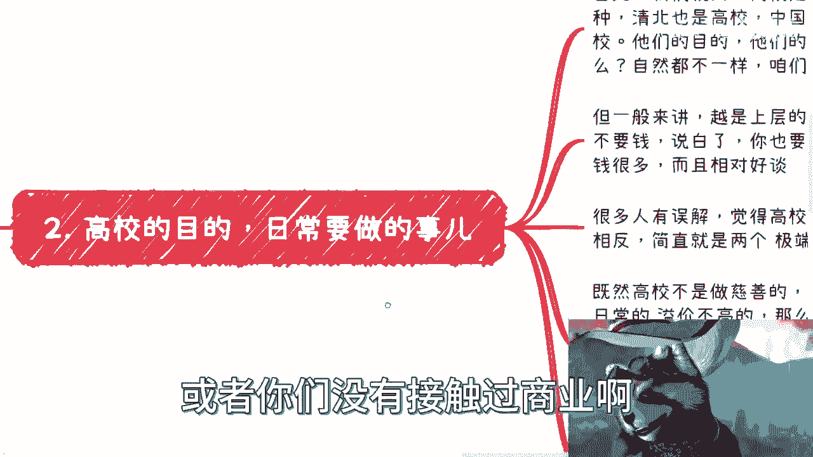
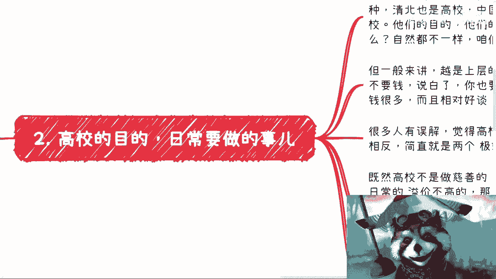
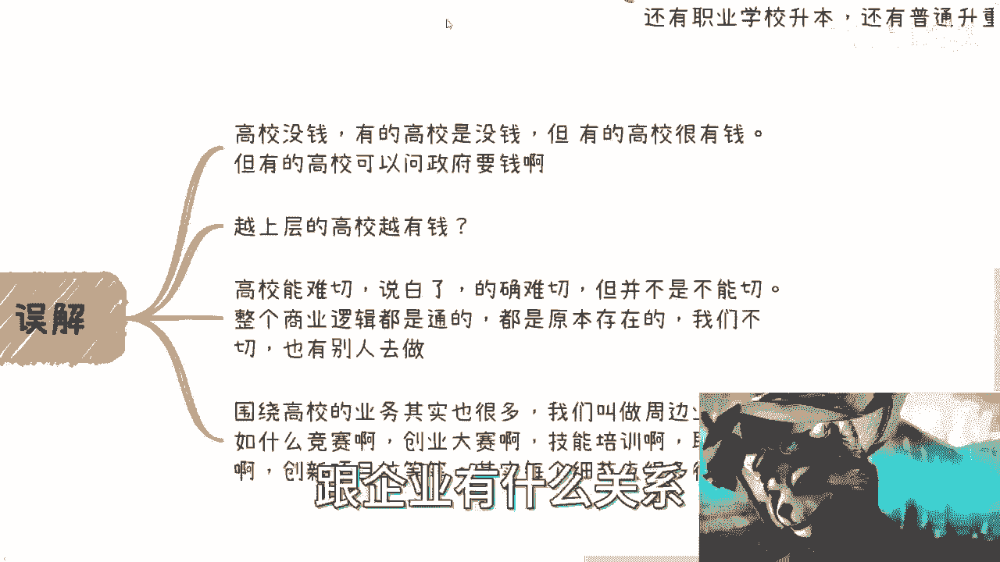
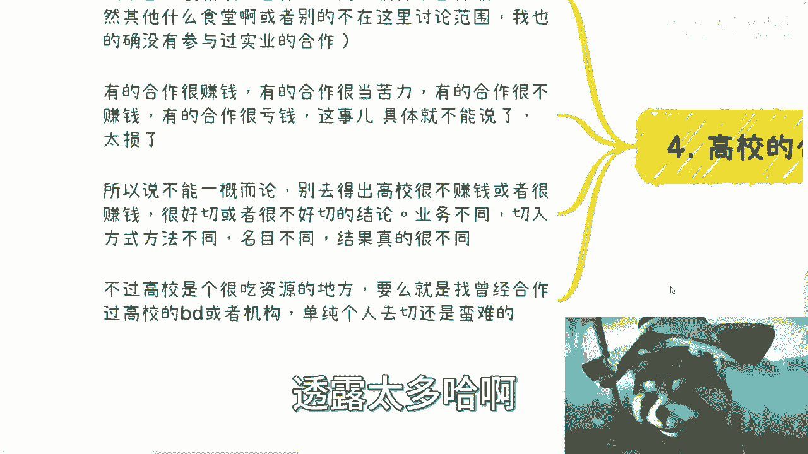
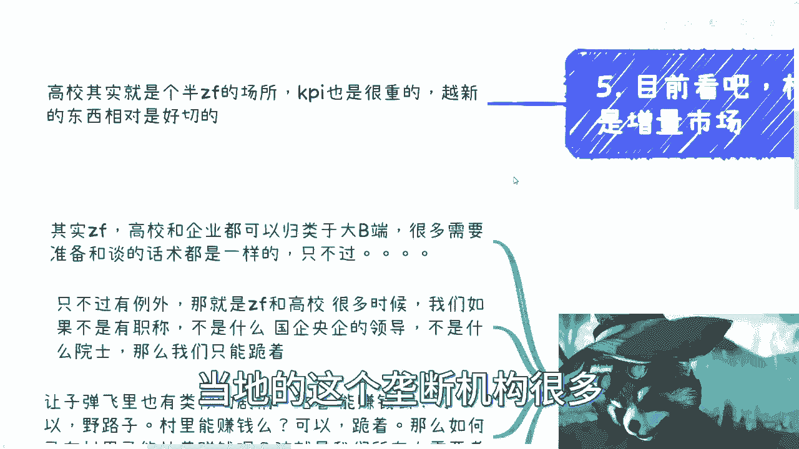
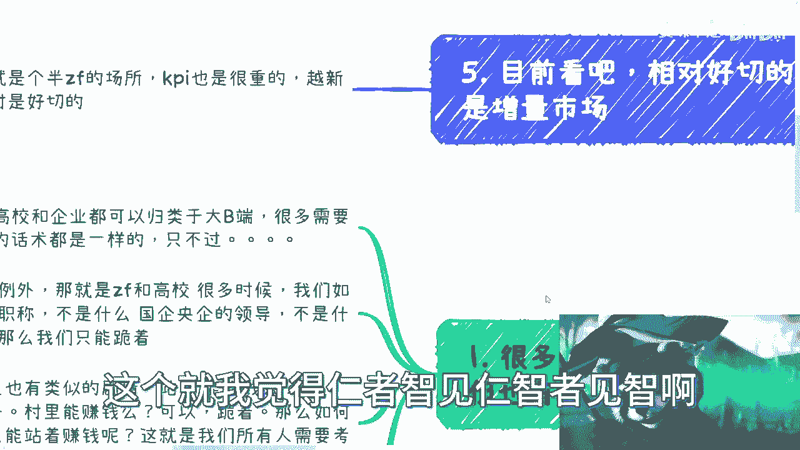

# 充电篇：本次是大众最大的盲区／误解的高校合作 - P1 - 赏味不足 - BV1Yw411e7KS

啊这个我本来想换个装饰对吧，但是我怕那个装饰被人家举报，所以我还是换个正常一点，呃终于到了我们的高校篇对吧，我跟你讲啊，这个这个东西对大部分人来讲啊，就我觉得对于那些所有的，没有接触过商业的小伙伴对吧。

20多年，30多年，沉浸在啊，这个9年制义务教育跟跟高等教育的，这个这个叫什么啊，土壤当中的这些韭菜们啊，我觉得这是就像我说的，这不是盲区的问题了，这已经远远超出盲区的问题了，这他妈叫误解啊。

首先啊注意啊，我这边说的不是高校的合作，而不是大学生的合作啊，就是所有那些针对大学生的东西，都不在我今天讨论范围内啊，因为在我看来，所有对大学生大学生的东西，它就是韭菜纯格，你知道你别跟我说。

什么商业什么什么什么商业俱乐部什么东西，你知道吗，最近还有小伙伴跟我说，这个大二大三小伙伴跟我说，他们参加了什么什么什么创业啊，什么创业俱乐部啊，什么商业俱乐部，我一听哦，靠都他妈bullshit。

你知道吗，简直就是我跟你讲，现在当代大学生，我跟你这么说吧，就是当韭菜养大的啊，这个东西不说了啊，我跟你讲一塌糊涂啊，真的一塌糊涂，那没什么好说的，一塌就只能说一塌糊涂啊，西吧对吧，首先啊第一个啊。

很多时候呢我们可以说呃站着赚钱啊，但是呢也有时候呢是必须跪着赚钱啊，这个我曾经跟我朋友聊过这个问题是吧。

希望这个朋友现在在看这个视频啊，我说的就是你啊，我说的就是你非要站着赚钱是吧，其实啊这个政府高校和企业，它其实都可以归类于大弊端，好大弊端，那也就是说他的这个内容呢，其实大家可以参考一下。

就是我上一期的企业端的啊，这个内容就我就不重复了嘛对吧，因为他有很多东西其实是一通百通的对吧，没什么区别的啊，你们很多时候需要准备呢，他只是就是说准备这个内容跟话术呢，可能会有一些细小的区别啊。

但是大部分呢不变的啊，只不过啊点点点啊，这个只不过是什么东西呢，只不过有一些例外，什么例外呢，这就是说我们在跟高校跟政府合作，很多时候呢，呃但凡我们如果不是有职称啊，不是有什么国企，央企的领导啊。

不是有什么院士啊。

不是有什么东西撑着对吧，那么我们只能跪着，我就明确跟你们讲啊。

那让子弹飞里面也有类似的剧情对吧，这个师爷说了啊，就对那个麻子说了对吧，站着能赚钱吗对吧，事业说了可以野路子啊，山里对吧，劫匪啊，那同样的那个麻子也说了对吧，你说这个城里面鹅城能不能赚钱，可以跪着对吧。

那如何又能够在城里站着把钱赚了呢，我跟你讲一样的，这个也是我们所有人需要考虑的问题，你知道吧。

就没有办法的啊，那么高校跟政府的合作呢，基本上都是也不都是吧，基本上很多时候你都是跪着啊，而且呢你跪着呢，你还是排队跪着啊，当然也不是说你跪着就有钱赚啊，这已经也是一定的可能性啊。

在这个地方我再强调一下啊，就是说如果你们今天看到这个视频的还是学生，或者你们没有接触过商业啊。

我请你们一定要明白，就是说不是说你们什么参加什么黑客松对吧，参加几个什么商业俱乐部啊，见到几个牛逼的人就算做过商业了，不好意思，你们这就跟过家家一样，就什么都不知道啊，但是反而呃还还自以为很知道。

其实就是被割。

那么好，那么我们来看第二点啊，高效的目的啊。

日常要做的事情，首先啊我们就问高校是不是慈善机构，我就问啊，我不得出结论，你们自己得哈哈啊，你们觉得是不是对吧啊，呃高校呢也分很多种，什么意思呢，你比如说清北也是高校对吧，中国各省市区职校技巧也是搞笑。

那我就问问他们的目的，他们的经费，他们的做事方式，他们跟你的接触的话术啊，他们的就是如果你要去打怪是吧，行就是我们比喻成比如说你要去打怪，你要去干嘛干嘛对吧，那你就想想看，能不能一样。

你你觉得你去跟职校绩效沟通，跟去清北沟通一不一样，自然不一样对吧，所以你就不能一概而论对吧，首先是第一点，第2。1般来讲啊，越是上层的高校啊，他们的学费越低，对不对啊，我们如果要去合作呢。

我们要的是民啊，而而不是要钱，而且呢退1万步来讲，你就算要钱，你也要不到啊，没这么多钱啊，没这么多钱啊，那么越是下层的高校呢，钱很多啊，而且相对还很好谈啊，多到什么程度啊，然后怎么个谈法啊，我跟你们讲。

你们只有去了解过来啊，跑到个什么二三线城市，四五线城市找一些直销绩效，你们去聊聊，你们自然就懂了啊，别歪歪啊，千万别歪歪，我发现现在大家都喜欢YY啊，就是出了事情或者说怎么样，就永远就是跟我说。

他说跟我想的不一样，那当然跟你想的不一样了对吧，你想的东西哪里来的，都自己不不知道哪边被PUPPUA出来的，这个观念你知道吗，哦很多人有误解，觉得呢高校就是找好的啊，我以前跟别人谈的时候。

他们就是哎呀我这边很牛逼的啊，我这里什么什么这个高校那个高校啊，你看我这个哎笑的啊，对不对啊啊，但是事实上相反啊，简直呢我跟你讲。

这就是两个极端的想法，这个后面我会来说的啊，呃既然高校不是做慈善对吧，假设啊你们得出这个结论是不是做慈善的，那么我们来看看啊，除了一些日常的溢价不高的对吧，比如说那当然啊溢价高不高，我也不知道啊。

我也没做过对吧，我不知道啊，但是剩下的会有什么呢，比如说啊学校的学生系统啊对吧，各种比如说这种事物的呃，这种高效事物的系统建设啦，必修课，选修课，公开课，NBAENBA对吧，然后什么啊MEM对吧。

实验室课程采购对吧，然后实实训平台，师资培训，学科创新双高等等等等等等等等等等等，对不对啊。

呃而且呢其实高校是很忙的啊，内部外部KPI1大堆啊，而且你想想看啊，还有什么职要职业学校升本，还有普通生重点。

还有的搞啦，有的搞了对吧好，那这个时候就有人说了，他说这些东西啊，那么跟我们有什么关系对吧，跟企业有什么关系。

好，我们先来说第三点误解啊，误解高校有没有钱啊，我跟你讲，有的高校的确没钱啊，有的高校不但没钱，还很抠啊，但有的高校很有钱，而有的高校呢他也许没钱，但他可以问政府要钱对吧。

那有没有钱，你得看他什么名目对吧，你做的事情是他不要的，那自然没钱，你做的事情符合他PPPI他自然有钱对吧，那然后包括你们问我说啊，高校里面要不要给回扣对吧，要不要怎么样子啊，这个东西因人而异对吧。

我说了，中国一线到五线啊，上面985211往下到职校技校，一本二本三本能一样吗，当然不一样啊，K是白，K是看了对吧啊，那么第二点越上层的高校越有钱，不好意思，完全相反啊，完全相反啊。

第三高效能难切都要说白了啊，我觉得这句话没有错，是难切，但并不是不能切，什么意思呢，就是说如果他油盐不进，他说我就没有相关的这个商业活动，那的确没毛病啊，我们切不动。

但是问题是高校到现在为止已经什么概念了，卧槽，就他妈基本上已经七八十都是商业活动了对吧，整个商业逻辑都是闭环，都是通的，而且原本就存在，而且说不好听点，这么多年已经被很多人薅过了，被很多企业薅过了对吧。

我们不缺有别人去做，那为什么我们不去切呢对吧，那围绕高围绕高校的业务其实也很多。

我们叫做周边业务，比如说啊什么竞赛啦，创业大赛啦，直一直呢技能培训啦，职职称评定了创新项目啦，对不对，多了去了对吧，你问我有水有多少，那不好意思对吧，我可以告诉你可以上天啊，可以上天。

而且比你们想象当中的还要上天。

就这么简单啊，我我只能告诉你们一点是什么呢。

就是我只怕你们想象力不够啊，好第四点。

高校的合作啊，合作和两极分化什么意思啊，高校的合作项目可以说很多很多，就像我们说的，我们看到啊师资培训啦，课程采购啦，实验室啦，产教融合了产业学院啦，创新项目啦，双高啦，软件平台升级啦等等等等等。

唉多如牛毛对吧，当然其他什么食堂啊，浴室啊，装修啊对吧，什么什么什么什么外卖啦对吧，这种东西啊我就不在我讨论范围内，因为我也的确没参与过这种东西，但是这种东西在我看来就算有利润。

他也没有软件利润来的这么高啊，这第一点第二点真的横坐呢，我觉得还是很赚钱的，因为有的和啊就有的合作很赚钱，有的合作很当苦力，你知道吧，有的合作很不赚钱，甚至有的合作很亏钱，我跟你讲，这明摆着的事情。

就是高校告诉你，比如说你要不要做，要做你就亏钱，你就自己出，有的啊，而且多了去我跟你讲，但这个事儿具体不能讲啊，到底你说哪些类目对吧，归属在赚钱，哪些类目归属在亏钱，哪些类目归属在当苦力。

哪些类目归属属在不赚钱，这我不能讲这讲了，我跟你讲，他他妈的对吧，这这这这这透露太多哈哈。

所以说呢不能一概而论啊，别去得出高校很不赚钱或者很赚钱的，这种一刀切的结论啊，呃这种结论没有用的，就是你要根据不同的高校，不同的业务切入的方式，不同名目不同，结果就很不同对吧。

这也是为什么很有可能你会发现有的人说，哎跟你说高校很赚钱啊，有水，很多有的人会告诉你，高校根本不赚钱吗，他高校都他妈在亏钱，为什么，因为他做的内容不一样啊，那么不同高校呢呃啊而且另外一个方向啊。

就是说高校这个东西呢，它是一个很吃资源的地方，嗯如果我们一穷二白对吧，你说什么都没有，要么呢就是找那些曾经就专门做高校的BD啊，ASSALES或者机构啊，要么就是就是说通过一些周周边的，就像我说的。

比如说竞赛啊或者别的东西啊去切啊，你要说单纯自己做个商务啊，你说平白无故去切很难啊。

很难好，那么第五点呢就是我们说啊。

目前来看相对好切的一定是增量市场，为什么啊，因为高校本质上它其实可能从十多年前以来，就已经是一个半政府场所，就是它的属性从一开始定位，它其实就是个半政府的机构，你知道吧，就说KPI其实也是很重的。

而同与此同时呢，就是越新的东西越好切，为什么，因为你们想想看嘛，高效我们假设称之为块肥肉的话，那么作为如果真的从资本家，从商业角度来讲，就像我们一开始说的对吧，哥大学生的对吧，或者说薅政府羊毛的。

或者说就是溢价很高的一些产品啊，你整个中国这片土地上面该有切的，该能够去做的，早就都去做了，轮不到我们去做，你知道吗，而且真的要就是轮得到我们做的呢，也是轮到当地的所谓的那些人去做外地的。

你你就算看到这个商业机会，你也很难去往里面切，你搞不过当地的人，你知道吗，就像我以前曾经说过，就是中国的一线或者1。5线城市，准一线城市，它是属于什么，它是属于门槛高啊，但是呢相对比较开放可切。

但是下下沉市场呢是什么呢，虽然门槛低，但是它但是他那个县那个当地的地头蛇很多，当地的这个垄断机构很多。

你搞不动了对吧，当然我为什么说增量市场好切，是因为我们就算搞不懂啊。

你明白吧，就是说就是说你比如说以前以往的，你说计算机啊，金融啊对吧，什么什么土木啊，或者别的东西，OK啊，不是轮得到轮不到，我们做早就饱和了，饱和了无数次了对吧，但是你说如果从一些新增市场增量市场呢。

比如说储能啊对吧，就比如说前两年的电动车啊，比如说充电桩啊对吧，比如说这个未来的我们说的比如说职业教育啊，啊数字经济啊，科技金融啊对吧，出呃包括那个呃海外的一些嗯。

海外我想想啊对包括海外的一些服务啊对吧，就是说呃本来就有很多出海的，也是跟高校有关的，包括什么培养，培养多少所学校啦，培养多少个人才啦，怎么样他都是有的，而且这些不一定定定位在中国的。

他可能定位在比如说非洲啊，在其他地方很多很多，但是这些东西呢就是说如果啊我们要去切，那很多就是只能切增量市场，因为这些东西呢对于原本的那些高效的供应商，或者原本的地头蛇，他还没有涉足这块东西。

或者说他还没有能力涉足，但是你说是不是能够跳过他们去做，从商业逻辑上面来讲，到底是我们直接跟高校合作，还是说我们拉着地头蛇一起赚这个钱，这个就我觉得仁者智见仁智者见智啊。

或者说这个就是K400kiss再去看了对吧，你不能一刀切的说啊，我就什么东西都我自己做，或者什么东西我都跟别人合作，不一定的看地方啊，看地方啊，所以说啊就是我觉得就是嗯中国很多的。

就是9年制义务教育和高等教育出来的，这个同学啊，呃他们既没有去过太多中国的别的一些城市啊，他也甚至一点都没有，就是说啊对商业，对企业，对政府的了解，就所有东西全部都是来自于所谓的培训。

或者所谓的老师或者家长的这种PUA，那那那我说实话，就真的就是都是当韭菜在培养啊，我我我说句不好听点，我也就是我也就是他妈的不屑对吧，赚这个钱，我要但凡真的去赚这个钱，哎呀我现在我也蛮开心是吧。

哎只不过我真的想想就觉得可悲啊，悲哀被悲哀的很，而且你们会发现很多老师啊，就是他真的不是不懂，有的呢他懂，但他不敢说，有的呢他是懂，但他腐朽同流合污，哎不谈啊，不谈好吧，OK那反正高校就就说这么多吧。

啊就我这总结一下啊，就说简单来讲，就是说这个地方呢是一个呃，已经商业很重的一个地方了啊，不是大家想的说啊，好像啊这个这个为了就业啊，为了怎么样子啊，哎呀那那那那都是说说的啊，都是说说的，哎呀好吧。

那就这样吧好吧，然后你们有任何的副业对吧，商业或者说叫什么就是职业规划啊，或者你们手上有的牌，有的资源不知道怎么打的啊，或者说想知道真正的商业上，比如说高校啊，企业啊，政府啊啊有很多人赚钱怎么赚的啊。

包括职业竞争等级啊等等等啊，你们想知道怎么搞的啊，你们可以总结好自己的问题啊。