# 充电篇-本次是大众最大的盲区-误解的高校合作---P1---赏味不足---BV1Yw411e7KS_

在本节课中，我们将要学习关于高校合作的真实商业逻辑。这是许多人，尤其是长期接受传统教育、未接触过商业实践的人，最大的认知盲区和误解区。我们将澄清这些误解，并探讨与高校合作的实际策略。

上一节我们介绍了课程主题，本节中我们来看看与高校合作的基本心态和现实。

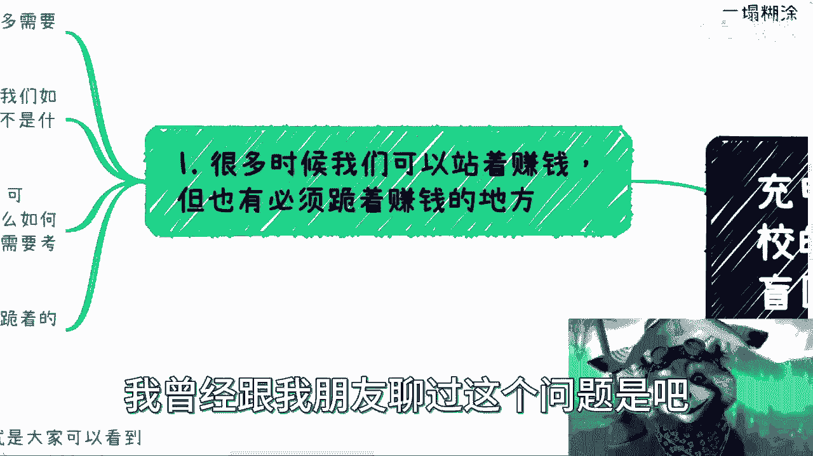

## 站着赚钱与跪着赚钱的现实

在商业合作中，有时可以站着赚钱，有时则必须跪着赚钱。政府、高校和企业都可以归类为大B端客户。因此，与高校合作的许多内容可以参考上一期关于企业端的内容，因为其底层逻辑是相通的。

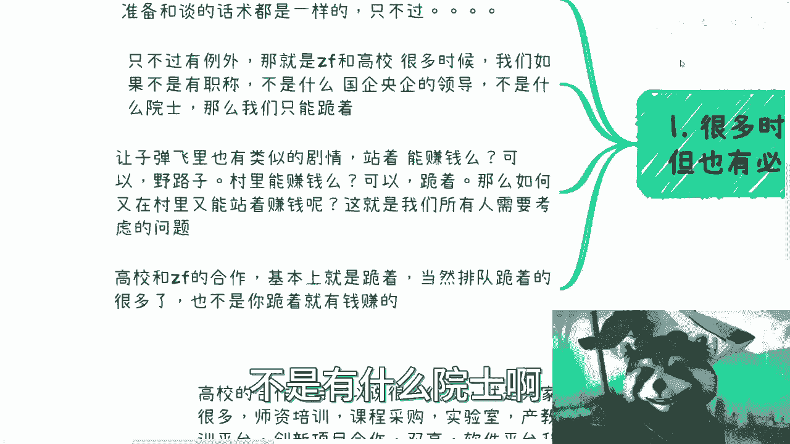

以下是需要准备的核心内容，虽然话术和细节可能因对象不同而有细小区别，但大部分原则不变：

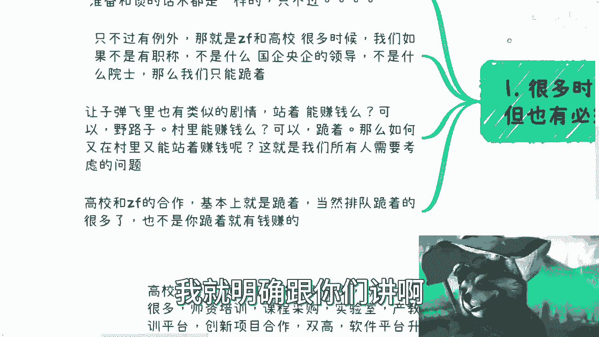

*   **通用原则**：大B端合作的通用商业逻辑和准备流程。
*   **内容准备**：针对性的方案和话术调整。

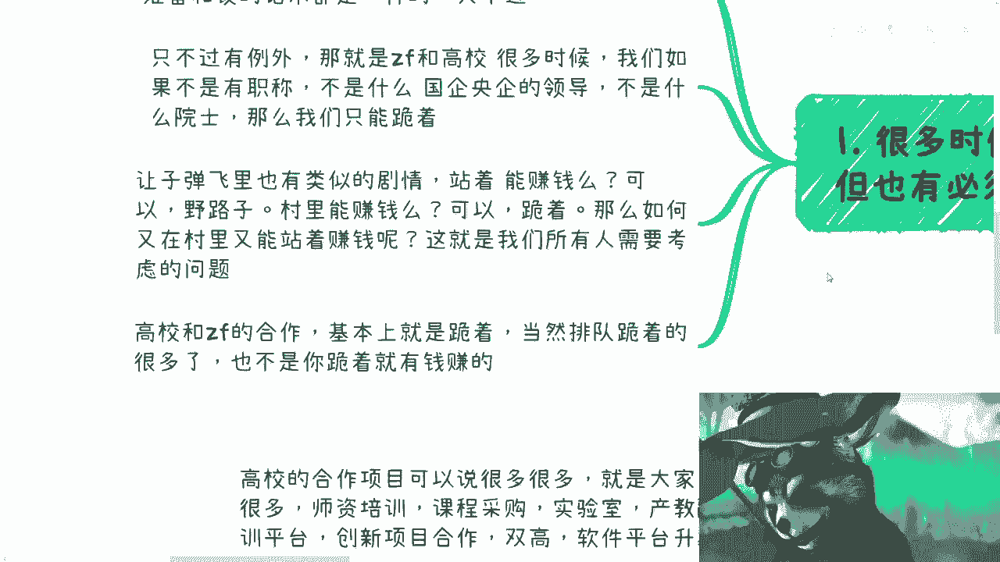

然而，存在一个关键的例外。在与高校或政府合作时，除非你拥有高级职称、是国企/央企领导或是院士等头衔，否则很多时候只能选择“跪着”合作。这是一个明确的现实。

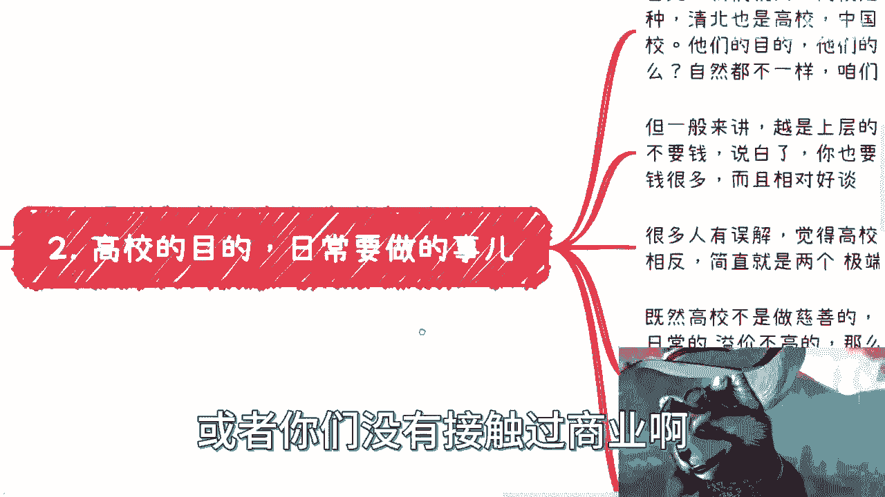

电影《让子弹飞》中有类似情节：师爷说站着赚钱可以，但那是山里的野路子（如劫匪）。麻子问在城里（鹅城）能否站着赚钱，师爷说在城里得跪着。那么，如何在“城里”站着把钱赚了呢？这是所有人都需要考虑的问题。

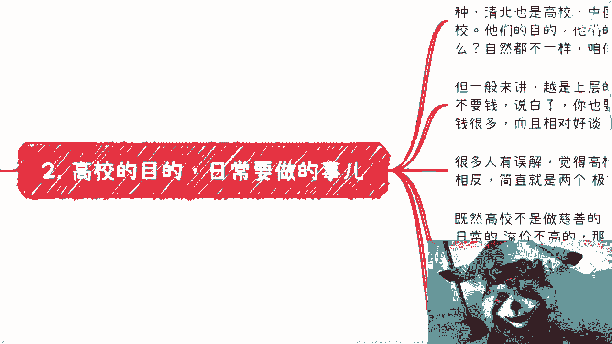

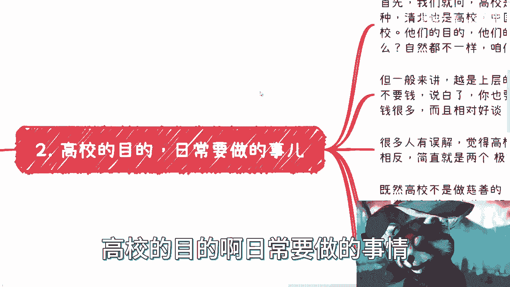

与高校和政府的合作，很多时候你不仅是“跪着”，而且是“排队跪着”。并且，跪着也不一定能赚到钱，这只是一种可能性。

## 高校的真实目的与日常事务

首先，我们需要明确高校并非慈善机构。高校种类繁多，从清华北大到各省市的职校、技校都是高校。它们的目的、经费、运作方式以及与你沟通的话术截然不同。

以下是不同类型高校的特点：

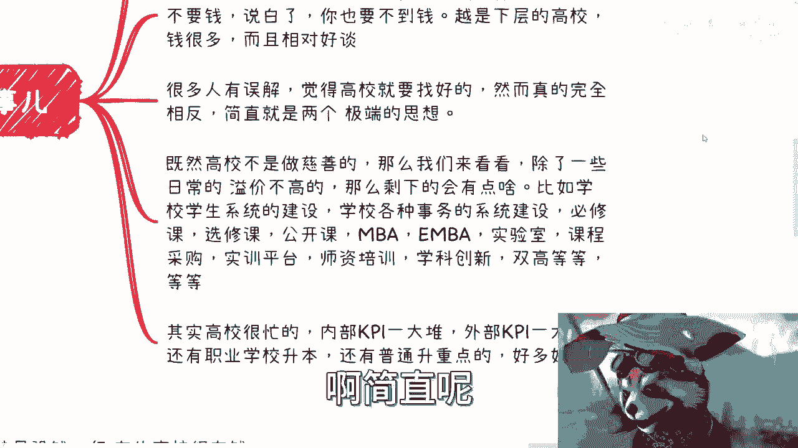

*   **上层高校（如顶尖大学）**：学费通常较低。与其合作，主要目标是获取“名”（声誉、品牌背书），而非直接要钱。即使想要钱，也很难拿到大额经费。
*   **下层高校（如职校、技校）**：经费可能很多，且相对容易洽谈。具体多到什么程度、如何谈，需要亲自去了解，而非凭空想象。

许多人存在误解，认为合作就要找好的高校。但事实可能恰恰相反。既然高校不是做慈善的，那么除了日常溢价不高的业务外，它们还涉及大量其他事务。

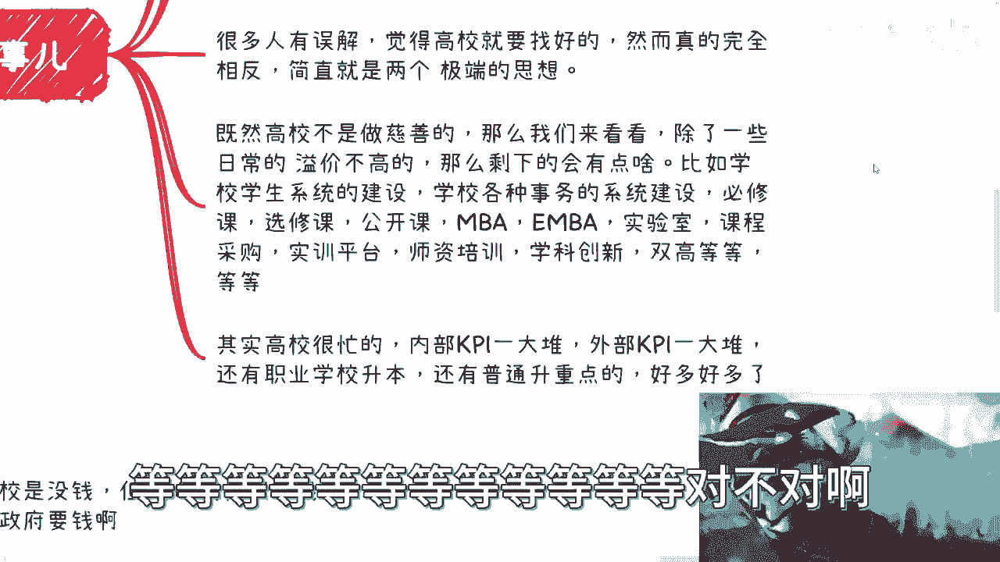

高校日常涉及的事务繁多，内部外部KPI一大堆。例如：

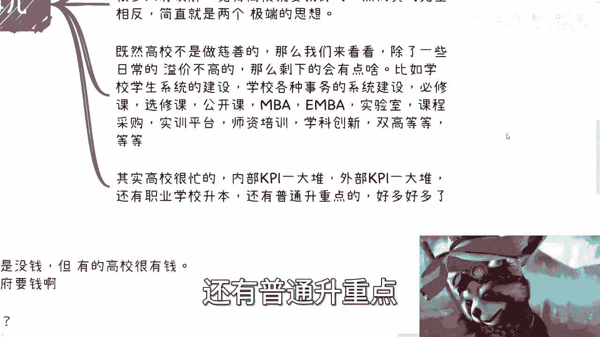

*   学生系统、各类事务系统建设。
*   必修课、选修课、公开课、MBA/EMBA、MEM等课程项目。
*   实验室课程采购、实训平台、师资培训。
*   学科创新、“双高”计划等。

此外，高校还忙于职业学校升本、普通升重点等事务。那么，这些事务与企业有什么关系呢？这正是我们需要切入的商业机会。

## 关于高校资金的误解

关于高校是否有钱，存在普遍误解。实际情况是：

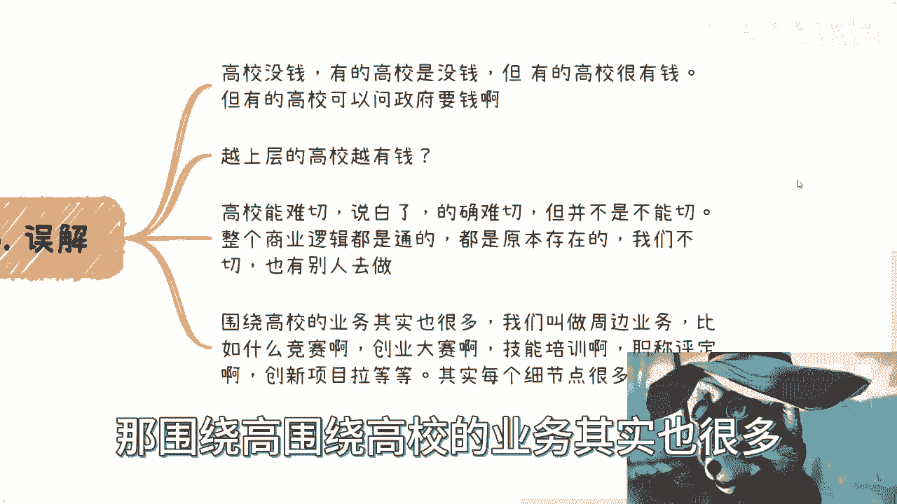

1.  **资金状况不一**：有的高校的确没钱且抠门；有的高校很有钱；有的高校可能自身没钱，但可以向政府申请经费。
2.  **资金与名目挂钩**：高校是否有钱支持某个项目，取决于该项目是否符合其预算或政策导向（PPP）。你做的事情如果是它不需要的，自然没钱；如果符合其需求，自然有钱。
3.  **回扣问题**：是否需要给回扣等问题，因校而异，不能一概而论。中国从一线到五线城市，从985/211到职校技校，情况完全不同。
4.  **上层高校更富？**：认为越上层的高校越有钱，这种想法完全相反。
5.  **合作难度**：高校合作难切入，但并非不能切入。如果对方明确表示没有相关商业活动，那的确无法推进。但现实是，当前高校的商业活动比例可能高达70%-80%，整个商业逻辑是闭环且通畅的，早已存在并被许多企业实践过。我们不切入，也会有别人切入。

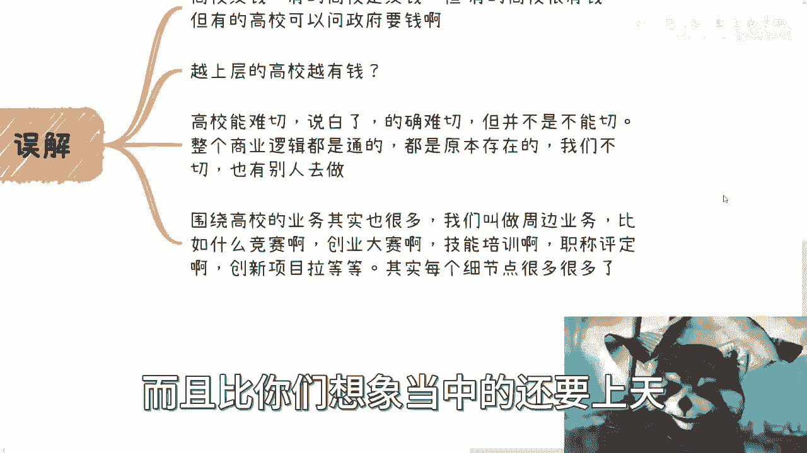

围绕高校的周边业务也很多，例如：

*   各类竞赛、创业大赛。
*   职业技能培训、职称评定。
*   创新项目等。

这些业务的水很深，可能超出很多人的想象。核心问题在于，只怕你的想象力不够。

## 高校合作项目的两极分化

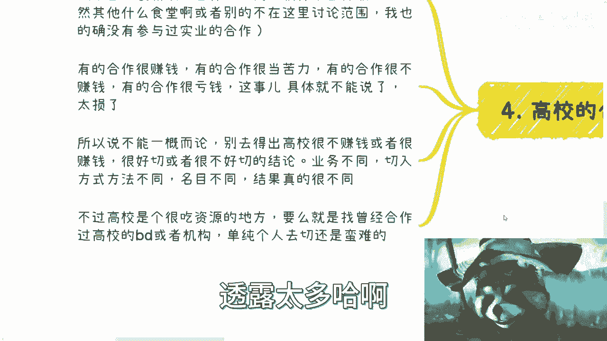

高校的合作项目种类繁多，正如我们提到的：师资培训、课程采购、实验室建设、产教融合、产业学院、创新项目、软件平台升级等等，多如牛毛。

当然，还有食堂、浴室、装修、外卖等业务，但这些不在本次讨论范围内。一方面，这些领域的利润可能不如软件类项目高；另一方面，其合作模式也完全不同。

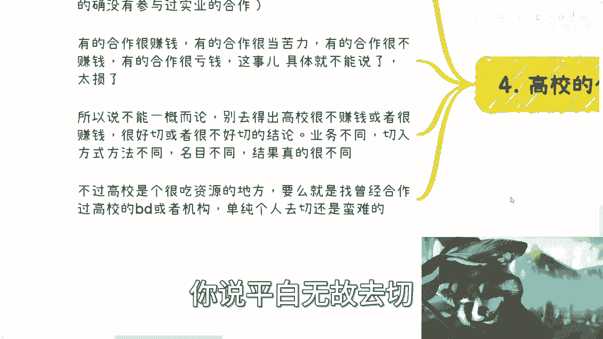

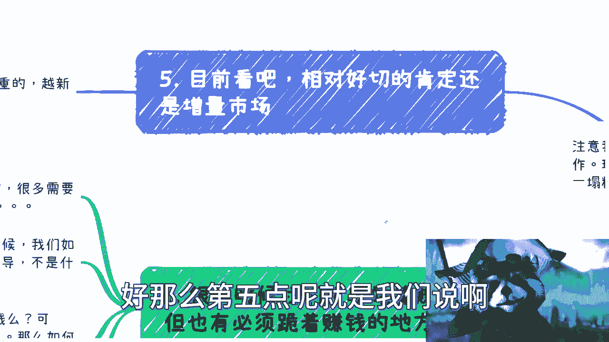

高校合作项目呈现明显的两极分化：

*   **有的合作很赚钱**。
*   **有的合作像当苦力**，很不赚钱。
*   **有的合作甚至很亏钱**。有些项目高校会明确要求合作方自己承担成本。

具体哪些类目赚钱、哪些亏钱，这涉及商业机密，不能详细说明。因此，不能一概而论地得出“高校很不赚钱”或“高校很赚钱”的结论。结论取决于具体的高校、具体的业务切入方式、具体的项目名目。

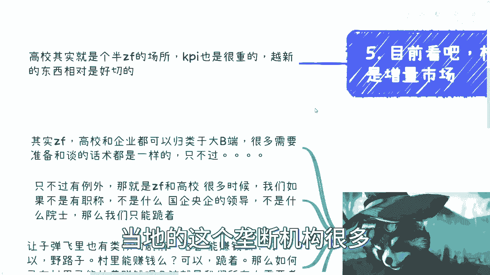

此外，高校合作是一个很吃资源的领域。如果一穷二白，要么寻找专门做高校业务的BD、销售或机构合作，要么通过竞赛等周边活动切入。单纯靠自己作为商务人员去硬闯，非常困难。

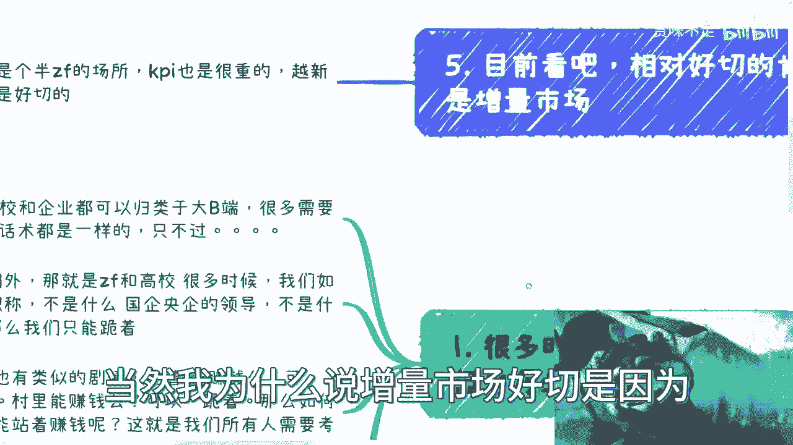

## 增量市场是相对好的切入点

目前来看，相对容易切入的领域是增量市场。因为高校本质上从十多年前开始，就已经是一个半政府性质的机构，其KPI很重。

与此同时，越新的东西越好切入。如果把高校比作一块肥肉，从纯粹的商业角度（如赚学生的钱、获取政府补贴、销售高溢价产品）来看，中国这片土地上该做的、能做的，早就有人做了，轮不到新人。即使有机会，也往往是当地的关系户在做，外地人很难竞争。

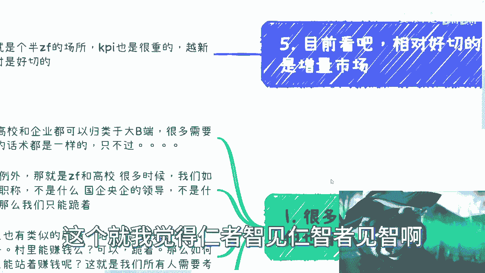

为什么增量市场好切入？因为即使我们竞争不过原有的地头蛇，但在全新的领域，大家可能都处于同一起跑线。例如：

*   以往的计算机、金融、土木等领域早已饱和。
*   但像**储能**、前两年的**电动车**、**充电桩**、**职业教育**、**数字经济**、**科技金融**，以及面向**海外**（如非洲）的人才培养和服务等增量市场，原有的高校供应商或地头蛇可能尚未涉足，或能力不足。

那么，是直接与高校合作，还是拉着地头蛇一起赚钱？这需要具体问题具体分析，没有一刀切的答案。这取决于地方、资源和具体情况。

本节课中我们一起学习了高校合作的真实图景。总结来说，高校领域已经是一个商业化程度很高的地方，并非大家想象中单纯为了就业和教育的净土。这里的商业逻辑复杂，机会与陷阱并存，需要摒弃学生思维和凭空想象，通过实地了解和具体分析来寻找真正的切入点。