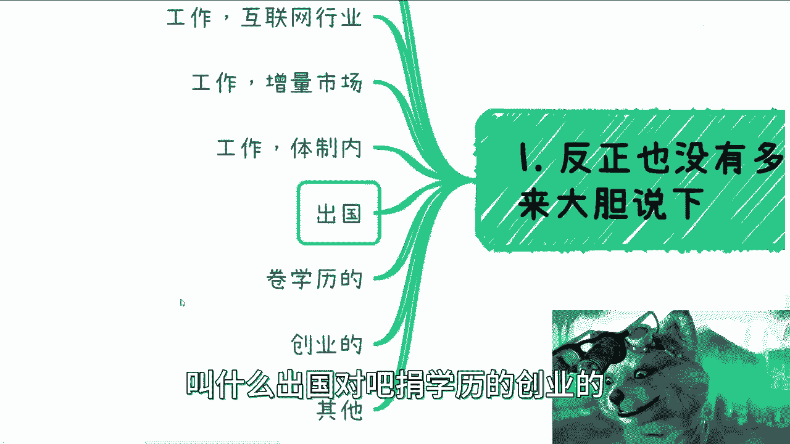

# 充电篇-来说下各个不同方向的发展吧---P1---赏味不足---BV1qu4y1y7RK


在本节课中，我们将系统性地分析当前几个主要职业发展方向（赛道）的现状，并探讨相应的个人应对策略。课程内容基于对市场环境的观察，旨在为初学者提供清晰、直白的行动参考。




## 概述：赛道全景扫描

当前职业发展主要有几个方向：传统行业与互联网行业的工作、出国深造、提升学历、创业等。我们将逐一分析其表面现状与潜在逻辑。

---

## 1. 工作方向：传统行业与互联网

上一节我们概述了主要赛道，本节中我们来看看具体的工作方向。

**1.1 行业国产化趋势**
整体方向是国产化与国有化。外企发展日趋困难，跨国合作受限。此方向需支持，但应避免“硬上”导致的潜在问题。

**1.2 传统行业特点**
与传统行业相比，互联网行业曾是增量市场。传统行业（如制造业、建筑业）的执行层流程相对踏实，项目“看得见摸得着”。其内卷程度相对温和，可形容为“温水煮青蛙”的状态。像芯片、嵌入式等领域，在经济上行期未有大突破，短期内更难有爆发性发展，策略上建议“苟住”。

**1.3 互联网行业现状**
互联网及泛互联网领域（如元宇宙、大数据、云计算）的特点是**溢价高**。因为这些领域缺乏标准化产品，报价弹性极大。这导致了行业的扭曲发展。目前互联网公司内卷已无边界，工作强度可能超过“996”。未来3-5年，内卷程度预计只增不减。

**1.4 体制内与考编**
体制内工作也非绝对稳定。合同制员工面临更大不确定性。体制内员工也可能遭遇降薪、恶心人的管理手段甚至拖欠工资，这些情况今年已有发生。

---

## 2. 出国与深造

在分析了国内工作市场后，我们来看看另外两条常见路径：出国与深造。

**2.1 出国的误区**
出国常被当作逃避国内问题的方案。但综合来看，为逃避而出国，无论去哪里结果都相似。身边案例显示，出国后过得好的人并不多。真正的改变取决于个人思维与行动能力，而非地理位置。需要改变的是“二极管”思维模式。

**2.2 学历提升的权衡**
提升学历（读硕、读博）需要冷静评估。核心问题是：**所学与赚钱是否有直接关系**？如果经济状况不佳，盲目投入高学历教育可能无效。许多博士毕业后发现现实与预期差距巨大，内心受到冲击。需警惕“高学历路边乞讨”的赛博朋克场景成为现实。

---

## 3. 创业与增量市场

除了为他人工作，创业也是一条路径。本节我们探讨创业的真实逻辑与机会所在。

**3.1 创业的基本建议**
对于所有正儿八经的创业，无论哪个行业，通常都不建议做。除非你能明确找到愿意投资的资本方。


**3.2 增量市场的机会**
更可行的策略是在增量市场中，寻找伙伴共同申报项目，蹭政策红利。各地新一轮项目申报（如人才引进、扶持基金、增量市场培训）已开始。关键点是：**先做项目的BP（商业计划书）或白皮书，把架子搭起来，而不是先投入大量资源启动项目**。逻辑是：
```
等待项目或资金审批通过 -> 再开始实质运作
```
永远不要主次颠倒。


**3.3 具体的增量方向**
目前看，**数字经济**是一个宏观的增量方向。各省市区都在推进，任何领域都可能与之挂钩，这为不同背景的人提供了切入机会。从接到的高校订单看，该领域预计有一波上升期，目前多与金融或泛金融相关。
其他方向如光伏、芯片、碳中和，主要由国企、央企主导，民企大多只能做利润微薄的外包边角料。这些领域建议“让子弹飞一会儿”，观察1-2年。如果是相关从业者，可考虑转向海外市场，因为海外发展路线更偏向民生领域，与国内集中在国企不同。

---

## 4. 个人行动策略

分析了外部环境后，我们来看看个人可以采取哪些具体策略。

**4.1 核心原则：能赚一笔是一笔**
方向其实很多，关键在于行动。策略应根据个人胆量大小区分：

以下是针对胆子较小者的策略：
1.  **主业求稳**：苟住一份主业。
2.  **副业轻量**：以最轻量级的方式开展副业。推荐的副业方向按优先级排序为：
    *   **第一，教培**：经济不好时经久不衰。
    *   **第二，项目/政策薅羊毛**：申报各类补贴、基金项目。
    *   **第三，拉皮条（资源对接）**：做中介、撮合交易。

以下是针对胆子较大者的策略：
直接干。许多业务只要做成几单就足够生活。目标是摸索出未来几年稳定的客户和订单，这在经济收入和压力缓解上，可能强于打工。此举也是为未来打基础，否则未来从打工状态再想切入会更难。

**4.2 具潜力的方向**
以下是一些被认为有潜力的方向，特别是与人相关的服务：
*   猎头
*   相亲
*   FA（财务顾问）
*   人才外包
*   个人赚钱/副业咨询
*   玄学

逻辑是：人人都想切企业端（B端）或政府端（G端），但这些门槛高。因此应**并行操作**，先从个人客户（C端）切入，同时寻找B端和G端的机会。数字经济领域目前有实际需求，但能做的人少，存在机会窗口。

---


## 总结与展望

本节课中我们一起学习了当前主要职业赛道的现状与个人策略。

**整体情况总结如下：**
1.  **增量市场**（如数字经济）：切入者尚少，仍有机会。
2.  **存量市场**：除非有特殊关系链，否则很难切入。
3.  **互联网行业**：内卷日益加剧。
4.  **制造业/传统行业**：处于温水煮青蛙状态。
5.  **周期性热点**：每隔一段时间出现（如AI、CIGBT等），带动股市波动或产生割韭菜行为。

大方向上，就业或赚钱很难再出现过去那样的巨大波澜。最后需要指出的是，当前社会存在“何不食肉糜”和“二极管”两种极端思维。从宏观角度看，愚昧也是导致困境的部分原因。希望大家能尽快认清现实，采取行动。


**最后提一句**：现在是2023年9月，今年所剩时间不多。