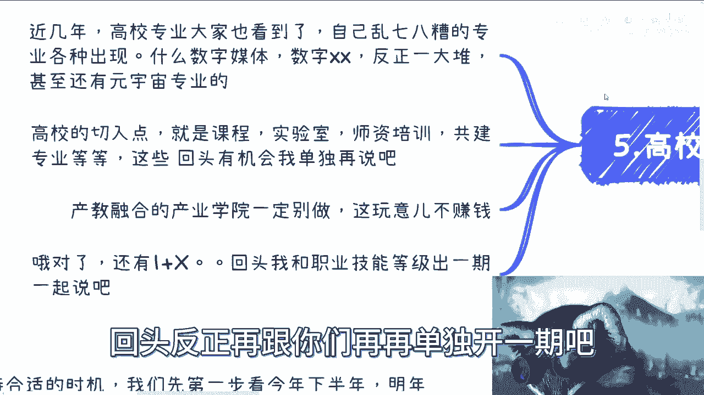

# 课程一：数字经济时代，普通人如何切入并赚钱？ 💰

在本节课中，我们将探讨在数字经济浪潮下，普通老百姓可以切入并寻找赚钱机会的几个关键方向。课程内容基于对当前政策与市场趋势的分析，旨在提供清晰、可操作的思路。

## 概述

数字经济融合了多种技术与产业，为普通人提供了新的机遇。本节将系统性地介绍几个主要的切入点，包括咨询培训、项目合作、职业技能认证、财务顾问（FA）、高校合作以及其他“卖水”型机会。理解这些方向，有助于我们提前布局，抓住机遇。

---

## 1. 咨询与培训 📚

上一节我们概述了数字经济的广阔前景，本节中我们来看看第一个切入点：咨询与培训。这是将个人知识经验变现的直接途径。

当前经济环境存在不确定性，我们需要密切关注下半年及明年上半年的政策动向。做事情需要顺应政府引导的大方向，才能找到赚钱的机会。

数字经济涵盖范围极广，几乎能与所有传统产业结合，形成“数字经济 + X”的模式。这里的 **X** 可以代表金融、医疗、会计等任何具体产业。个人从事咨询培训，关键在于找到一个自己擅长的细分领域。

以下是切入咨询培训领域的几个步骤：

1.  **积累与准备**：整理个人商业简历、专业知识大纲以及可提供的咨询内容。
2.  **寻找合作平台**：最佳方式是作为兼职合作方，与第三方培训或咨询公司签约。这是一个从0到1的滚雪球过程，需要坚持完善内容并积极沟通。
3.  **打造专属模式**：确定自己的“数字经济 + X”专精领域，并据此设计课程或服务方案。
4.  **启动合作**：带着成熟的方案去寻找咨询培训公司进行合作。

虽然现在开始积累不算早，但依然来得及，关键在于立即行动。

---

## 2. 通过协会与产业园进行项目合作 🤝

了解了知识变现的途径后，我们来看看如何借助组织力量获取资源。第二个切入点是：通过行业协会或产业园区进行项目申报与合作。

对于普通个人或民营企业，直接申报政府项目、获取资金、名誉或税收减免通常比较困难。协会和产业园往往能成为关键的支点。

项目申报的核心在于“赋能产业”，单纯的技术很难获得支持。你需要构思出“数字经济 + 特定产业”的解决方案。

以下是成功进行项目合作的三个关键点：

1.  **建立关系**：与行业协会或产业园区的相关负责人建立并维护良好关系。
2.  **撰写方案**：准备一份符合政府和协会要求的、高质量的“数字经济+产业”项目申报书。
3.  **获取信息**：确保能第一时间获取项目申报的资讯和通知。

项目申报书本身的撰写难度并不高，难点在于以上三点。此外，不同项目可能对申报主体有额外要求，如软件著作权、专利等资质，这些需要提前了解并准备。

---

## 3. 职业技能等级认证 🏅

除了项目合作，另一个与政策紧密挂钩的切入点是职业技能等级认证。随着数字经济发展，必然会产生大量相关的新岗位。

参与职业技能认证体系，主要有以下几种方式：

1.  **获取考试资质**：通常需要绑定相关的行业协会，因为资质多由人社部下放至协会。
2.  **获取培训资质**：取得开展职业技能培训的资格。
3.  **成为合作方**：若无法直接获取资质，可与具备资质的协会或企业签订合作协议，作为其合作方开展业务。

这项业务的关键在于“速度要快”，谁能率先进入市场，谁就能占据优势。目前市场上已有如“网络安全管理员”、“区块链应用操作员”等认证，可以关注明年可能出现的新职业方向。

---

## 4. 财务顾问（FA）服务 💼

接下来，我们转向市场资本层面。第四个切入点是担任财务顾问（FA）。经济总有复苏和增长的节点，数字经济是目前政策较为明朗的方向之一。

无论国内的数字经济、元宇宙，还是海外的Web3.0，预计未来都会有大量项目涌现和资本入场。资金流动就会带来机会。

如果你具备一些数字经济相关知识，可以从事以下服务：

*   **项目包装**：帮助项目方润色或编写商业计划书（BP）和白皮书（White Paper）。
*   **资本对接**：作为FA，对接项目方与投资方，促成交易。

个人FA也有很多，若想更正规，可以挂靠基金公司或小型投融资机构。这项业务的利润相当可观。

---

## 5. 高校合作 🎓

第五个切入点是高校领域。近年来，高校新增了大量如“数字媒体”、“元宇宙”等前沿专业，合作需求旺盛。

高校合作的利润很高，主要切入点包括：

*   课程内容提供
*   实验室建设
*   师资培训
*   专业共建

需要注意的是，“产教融合产业学院”这类项目目前可能并不赚钱，需谨慎参与。此外，“1+X”证书制度（学历证书+职业技能等级证书）也与高校紧密相关，是另一个可探索的方向。

> **关于知识分享的说明**：我愿意分享这些信息，原因有二：第一，我并非这些领域唯一的既得利益者；第二，我们（普通从业者）需要明白共同的对立面是谁，因此抱团合作远比相互竞争更重要。

---

## 6. 其他“卖水”型机会 ⛏️

最后，我们来看看一个普适性的机会。在任何新兴行业或热潮中，为从业者提供工具或基础服务的“卖水者”往往同样赚钱。

例如，在前两年的下沉市场，向产业园或需要申报项目的企业销售“数字人解决方案”就非常火爆。在风口期，这类生意有时几乎不需要复杂的逻辑。

数字经济领域也将出现类似机会。关键在于提前构思好解决方案，并建立供应商网络，以便在机会出现时能迅速把握。

---

## 总结

本节课我们一起学习了普通人在数字经济时代切入市场的六个主要方向：

1.  **咨询培训**：打造“数字经济 + X”的专业知识体系进行变现。
2.  **项目合作**：借助协会或产业园申报项目，获取政策支持。
3.  **技能认证**：抓住新职业机遇，提供培训或认证服务。
4.  **财务顾问（FA）**：为项目与资本充当桥梁。
5.  **高校合作**：与高校在课程、实验室、专业建设上合作。
6.  **“卖水”服务**：为行业提供通用的解决方案或工具。

**核心前提是提前准备**：跑通关系、找好供应商、构思解决方案。在机会来临前做好准备，才能有效把握。时间有限，单打独斗很难成功，希望本课内容能帮助你找到发力的方向。