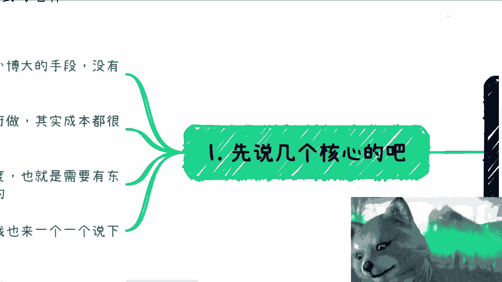
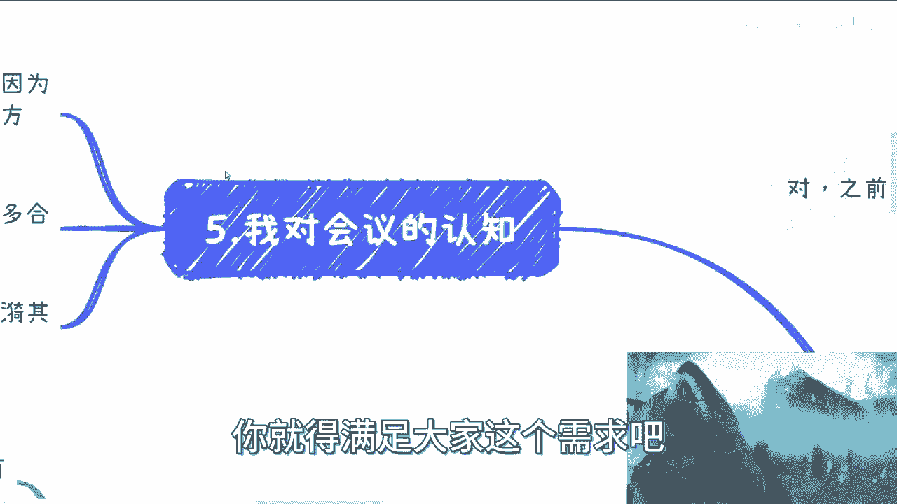

# 课程一：会议变现的核心逻辑与优势 🎯

在本节课中，我们将深入探讨举办各类学术、技术及行业会议的核心逻辑与独特优势。理解这些基础是成功迈出第一步的关键。

上一节我们介绍了课程主题，本节中我们来看看举办会议的核心价值。

举办会议是普通人实现“以小博大”的最佳手段之一。其核心优势在于**风险可控**且**单人可操作**。与其他创业项目不同，会议项目不依赖复杂的供应链或不可控的合作方资源。如果预判可能亏损，可以选择直接停止项目，主动权完全掌握在自己手中。

所有会议中，只要不直接承接政府项目，其启动成本和操作难度通常都不高。直接服务政府项目流程繁琐，体验不佳。而自主办会的关键在于想清楚会议与自身的**关联度**。我们不应只为赚取辛苦钱，而应通过会议这个“支点”，实现高投入产出比。这意味着，在办会前就需要明确自己的变现逻辑，例如有产品可卖、有服务可提供，或已规划好清晰的变现路径（A/B/C/D...），并经过初步调研验证其可行性。

---

## 会议的核心目的与收益 🎪

明确了办会的优势后，我们来看看举办一场会议具体能达成哪些目的，以及如何从中获得收益。

举办会议的核心目的，是**一次性、一劳永逸地让整个目标行业认识你**。即使你不是该领域的资深人士，也可以通过成功主办一场会议，快速建立影响力。作为主办方，你能一次性接触到与你会议主题强相关的企业、资本、猎头、HR等资源。更重要的是，主办方的身份本身就是一种背书，让你在与参会者交流时处于平等甚至更优势的地位。

以下是举办会议常见的四个主要目的：

1.  **推广服务**：直接销售你自己的培训、咨询等服务，或作为连接平台，促成第三方服务交易（例如做FA，对接项目与资金）。
2.  **连接资源**：会议的本质是社交场。参会者核心目的是寻求合作与人脉，而非仅仅听演讲。主办方是资源网络的中心节点。
3.  **树立品牌**：通过举办会议“插旗”，宣告你在该领域的品牌存在。第一期或许艰难，但成功案例会吸引品牌方、协会等在后续活动中主动寻求合作，形成正向循环。
4.  **直接盈利**：会议本身包含多种盈利点，例如：
    *   **门票收入**：设置早鸟票、团购票等多层级票价。
    *   **赞助费**：设立金牌、银牌、钻石等不同等级的赞助方案。
    *   **展位费**：在会场走廊或空旷区域设置展位出租。
    *   **附加活动收费**：会前培训、晚间酒会、私董会等。
    *   **撮合费用**：为参会者提供资源对接服务并收费。

这些收入来源的利润率通常较高。公式可以简单理解为：
`会议总利润 ≈ (赞助费 + 门票收入 + 展位费 + 附加活动收入) - (场地费 + 嘉宾成本 + 物料成本 + 推广成本)`

---

## 实操问题拆解与解决方案 🔧

了解了为什么做和做什么之后，本节我们将针对办会过程中最常见的几个实操难题，提供具体的解决思路。

以下是几个关键问题的应对策略：

*   **问题一：没有嘉宾怎么办？**
    *   解决方案：积累日常社交。嘉宾不一定需要顶级大咖，寻找BAT、字节跳动等大型公司的中层，或相关协会的负责人即可。关键在于会议主题明确、流程专业，让对方觉得活动有价值，而非“野鸡”活动。通常公司内部报备后，员工参与分享的意愿是存在的。

*   **问题二：没有媒体曝光怎么办？**
    *   解决方案：寻找媒体聚合平台或公关公司。与其一家家联系媒体，不如找一家能提供打包媒体资源的服务商，洽谈一个总包价格，高效解决宣传问题。

*   **问题三：场地与展位如何解决？**
    *   解决方案：
        *   **场地**：初期以性价比优先。可以使用“会小二”等场地预订平台寻找价格合适的场所。务必选择走廊等有空余区域的场地，便于设置展位。
        *   **展位**：布置无需豪华，两张桌子拼接即可。展位收费可以灵活，如果企业不愿付钱，可采用资源互换模式，例如让对方提供宣传、帮忙售票或赠送礼品，目的是让会场看起来更热闹、更具规模。

*   **问题四：如何吸引赞助和增值服务？**
    *   解决方案：
        *   **赞助**：模式可参考同类会议。赞助形式多样，可以是现金、礼品或流量置换。对于晚宴、酒会等环节，可以单独设置赞助席位，进行定点精准推广。
        *   **培训/服务**：利用“主办方有流量”的优势，邀请培训或投融资机构来提供会前培训或会后服务。他们通常愿意免费参与以获得曝光，这反过来也为你的会议增加了价值背书。

---

## 完整办会流程与执行细节 📝

最后，我们来梳理一场会议从筹备到落地的完整流程，并关注那些能提升体验和利润的关键细节。

一场会议的报名高峰通常在最后一周，因为很多人前期无法确定时间。执行当天也可能有未购票者现场报名，需有所准备。

以下是提升会议效果和收益的具体执行细节：

*   **门票策略**：设置多层级票价（如早鸟票、二人团购、五人团购），鼓励提前购票和多人参与。
*   **物料准备**：
    *   **资料袋**：定制会议资料袋，成本不高但显专业。
    *   **袋内物品**：主动向各企业征集宣传册、小玩偶等礼品放入资料袋。这些物料对企业可能是库存，对你却是免费的增值内容。
*   **现场氛围**：聘请礼仪人员，费用不高但能显著提升活动质感。循环播放赞助商的视频广告。
*   **灵活创收**：
    *   为赞助商提供演讲位序靠前、多次品牌露出等特权并收费。
    *   甚至可以单独开辟小场地供赞助商进行专场宣讲。
    *   在社群内发放赞助商红包等。

必须认识到，对于普通人主办的会议，参会者的核心诉求是**社交**，而非纯粹学习。会议是打破僵局、低成本创造连接机会的利器。它带来的后续合作与资源，其价值往往远超会议本身的直接收入。

---

## 总结与展望 🚀

本节课中，我们一起学习了通过举办会议实现个人品牌打造和商业变现的核心逻辑。

我们首先明确了办会对普通人而言**风险可控、操作灵活**的独特优势。接着，我们剖析了办会的四大核心目的：**建立影响力、连接资源、树立品牌、直接盈利**。然后，我们拆解了嘉宾、媒体、场地、赞助等实操难题的解决方案。最后，我们梳理了完整的执行流程与提升收益的细节技巧。

本质上，举办一场技术论坛或行业峰会，流程可以简化为：确定主题、邀请几位嘉宾、寻找赞助、租赁场地并设置简单展位。这个过程能为你带来宝贵的行业人脉、潜在合作机会，甚至新的工作机遇。在当下线下活动稀缺的时期，亲民、实用的会议需求依然旺盛。

对于初学者，建议从细分领域的垂直会议开始，逐步积累经验和资源。通过连续举办，你的活动品牌将日益稳固，未来甚至可以将执行外包，自己专注于资源整合与战略规划，持续获得收益。现在正是储备知识、积累资源、为未来机会蓄力的好时机。