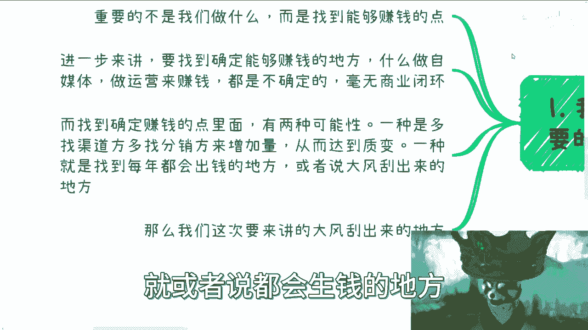
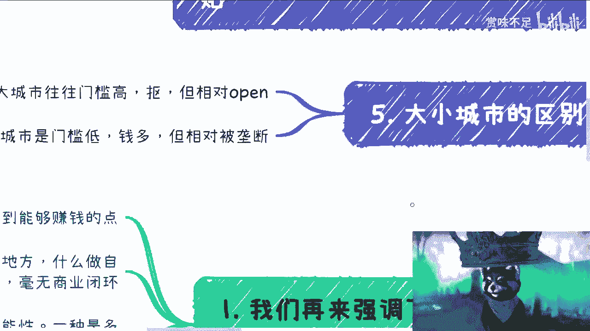

# 充电篇：一些钱我们不赚，并不会省下来 - P1 - 赏味不足 - BV14u411A7Ui

好大家好，本次充电篇对吧，我们来讲的是有一些钱啊，我们不赚啊，并不会省下来，这句话翻译一下什么意思啊，意思就是你不赚白不赚啊，你不赚总有别人转啊，当然这是第一层意思啊，呃第二层意思呢就是说这个钱。

他必须要出去，什么意思啊，就是这个钱跟你所做的服务。

跟你所做的产品没有直接的关系，你明白吗，就是这个是两层意思啊。

那么首先在这个地方，咳咳我先说个大前提啊，就是这些视频里面所讲的东西，我可以明确跟你们讲，没有什么门槛，也没什么要求，就看关系，只有关系，没什么东西，说白了就是你也别别来说什么。

自己大一大二也别说自己什么学历，什么东西，不好意思都没关系，就看你多浪多野，就这么简单啊，就这么简单好。

那么首先我们再来强调一下，商业当中最重要的是什么。

商业当中最重要的不是我们做什么，而是我们是否能够找到赚钱的点，就像我们一直说的，为什么关系最重要，因为关系到位了，这个关系本身就是赚钱的点，所有别的东西都是走流程，都是走形式的啊。

这些事情我以前也没少经历过对吧，也没少参与过啊，那这是第一点，第二点进一步来讲啊，要找到确定能够赚钱的地方啊，什么意思呢，比如说你说你要做自媒体，或者来说做运营啊，做一些什么什么什么什么家教对吧。

做些什么啊，其实你要明白这些都是不确定的，所以说我一般都会跟大家讲，就是大部分的这种要去做的事情啊，毫无商业逻辑，所以说在这里面呢，我们要找到的是确定的赚钱的点，而在确定的赚钱的点里面有两种可能性。

两个分支啊，第一个分支是你可以尽可能的多找渠道方，多找分销方来增量增加量啊，从而以量达到质变，比如说啊你今天说我想做个电商对吧好，那么你说我如果自己去运营，自己去干嘛，那么你可能卖不出多少。

而且我觉得你这个是毫无商业逻辑的，但是如果你今天跟我说，你说啊，于老师，我在杭州找了100家分销商对吧，这100家分销商呢以按以前的数据对吧，我可以给你个评估，比如说一个月我能卖出去多少。

那我觉得没毛病啊，那你的商业逻辑perfect满分啊，虽然你的确，这100家分销商也有很大的不确定性，但是这个数量一定能保证你最后的收益对吧，这是第一种啊，第二个分支是什么。

就是找到每年都会出钱的地方啊，就或者说都会深浅的地方。

或者说都是大风会刮来的地方，好，那么好，那么我们这次主要来讲呢，就是大风刮来的那些地方啊。

首先第一个首当其冲的就是企业的培训。

咨询以及创新项目的费用啊，今天咨询的时候呢，我其实就是今天咨询少，其实我发现就是说，几乎很多人会跟我提一点是什么呢，他的意思就是说这个东西既然我会做，人家也会做，那为啥我会赚钱对吧，我我跟你们讲啊。

不要再一直PUA自己了，就是你的确头上不长角，我也不长角，但是我也我们也没有说，我们你想中国这么大片土地，我们没有说做这单纯做这个东西，说你想做财务自由吧对吧，你也没有说一一，比如说一年做这个东西。

做个1000万吧对吧，那我的意思就是说这个东西大家做对吧，你比如说能给自己这个生活上面有点补贴对吧，就赚点奶粉钱吧，赚点生活费对吧，无论别人做不做，我们去做了，总归有机会分到一亩三分地底对了，为什么。

因为中国这个土地上机会足够大，同时做这块东西的人相对你们去卷学历，卷工作的人已经少的不能再少了对吧，你能赚点钱就不错了，你总比没有好吧对吧，不要老是就是说用那种就是啊说我们做了对吧，然后没什么门槛。

然后别人也会做啊等等等这种嗯嗯对吧，这种这种说法来麻痹自己是吧，然后这是第一个，第二个呢就是说培训咨询的费用呢，呃还有一些企业呢，它其实是有创新项目的费用的，每年都是固定的啊，这些费用呢是必须用掉的。

不用呢也是要清零的啊，他也不会留到下一年啊，不可更不可能变现，哎想都别想了啊，当然啊这个不得不说啊，呃有有没有变现的可能性，有很骚啊，我就不在这个地方说了啊，不好意思，说真的是说出来人家打我是吧啊。

当然啊现在随着经济不好呢，的确蛮多的企业呢可能这部分经费也砍掉了啊，但是啊首先就是说从社会运作规律来讲，大家都知道有这么件事，因为你现在砍掉不代表以后没有啊，对不对。

你这个这个永远都是商业逻辑当中的一个赚，就永远是一个固定的赚钱的点啊对吧，那你不去赚，总有人会去转了啊，再说了啊，再说了，就是你这个钱砍掉了，那中国这么多企业呢砍掉就砍掉呗对吧，那砍掉还有很大一部分呢。

是不是啊，那这是第一点，那么还有一点呢，就是说那么啊你说怎么切这种对吧，我就这么跟你讲，你要想利益最大化，你就自己去BD对吧，自己去做供应商，自己去成为供应商，但这种很难啊，这种很难。

一般供应商跟分包商在已有的哪怕存量市场，哪怕增量市场都是已经确定的，我们想要去切几乎是不太可能的啊，除非你爸是叉叉是吧，所以呢换而言之啊，我们要做就是去整理好自己擅长的点和大纲。

也就是说把你的产品包包装好，然后去找供应商或者分包商跟他们说，哎我能做这个，我能做那个，就是说说直白点，就是我们就做做他们的工具人就好了啊，就好了，你就自己定位清楚，就我今天另外一个视频也说了嘛。

就自己几斤几几两，你你就列列清楚啊，别去做那种，就是说自己跳一跳，哪怕是骑个什么火箭都够不着的，对吧啊，那其实我跟你讲这个钱也很好，赚了也很赚钱了啊，这就好像什么呢。

这就好像比如说你们今天想要想要去打星际，星际争霸二对吧，这个职业联赛啊，但是呢虽然你你能力很强，但是你离真正的职业啊，比如说天梯多少分，7000分，800分8000分吧对吧。

你可能离天梯的职业选手可能还有一段距离，但是呢你一般的这个竞赛对吧，各种比如说区竞赛是竞赛，哎，你也是的确的确可以打到第一名，那就够了呀对吧，EC项目可以的呀。

好那么第二点呢就是政府的这个经费啊。

包括项目，包括活动，包括培训，包括投资啊，呃这个呢跟企业的确有很大差别啊，这个差别主要在于企业的经费呢，其实用不到第2年清零也就是了啊，就是说难听点，大家都是自己人啊，没必要相互为难，但政府不一样。

政府的经费，他肯定是有一个上下级的一个审批的啊，不用调啊，我说实话那就是无能啊，就是不用调，就代表你没有，那很简单，一是你没有能力花掉这个钱，那你没有能力花掉这个钱意味着什么，意味着你没有能力去执行。

以及或者来说，你没有能力去找到所谓的千里马啊，你不是个伯乐对吧，那么这个KPI就完不成，那么第2年你要再批到同等的费用，那就很难了啊，当然这个东西跟经济大形势有没有关系。

有但是就是呃如果撇开这个因素来讲，那么你用不了这个事情其实是个致命伤啊，那么项目可能来自于呃产业园，也可以也可能来自于协会，也可能来自于某些，比如说大数据局啊对吧，这个工信厅啊，金融厅啊。

农业厅啊等等等都有可能啊，那这个就是我一开始跟大家说的，就看你们怎么浪啊，那么活动这个东西呢，很多地方啊，几乎呃就是一年呢都要几场或者几十场，一起做的啊，那么大家其实也得去对接这个东西，其实分的很细。

就是你可以去找到一些，比如说园区的管委会，你可以找到一些区政府里面的，比如说这个专门做活动的啊，你也可能找到一些协会，都有可能就是他分的很细，因为中国这个各地方，省市区很多管理不太一样啊。

就是大框架大差不差，但是里面细分啊，反正骚得很啊，那么你要是对接的好呢，我跟你讲，你是直接可以包年的啊，虽然你也别看啊，就是说可能钱不多，但是就像我说的，那你有总比没有好吧对吧啊，而且我给你举个例子。

你比如说我们在2020年，当时我接了一个这个两岸海峡的啊，一个一个什么什么活动啊，这个怎么地我项目当时申请也申请下来，七八十万了，也不少了啊，培训经费这个东西呢，其实我知道我跟你讲啊，我知道的分成两种。

一种是公务员的培训经费啊，当然这个不管是底层还是领导啊，都算在公务员培训经费里面，这个呢类似于起飞呃，类似于企业，另外一种呢就是以地方啊，以地区为单位的培训扶持经费，就比如说啊打个比方啊。

比如说明年数字经济啊，各地方省市区啊，包括产业园一定是有政策的，会告诉你，比如说数字经济一年你培养打个比方啊，比如说培养2000人啊，我一年扶持点20万啊，或者培养5000人，一年扶持20万，总会有的。

因为这种这种东西啊，就是我们说的就是里面套什么并不重要，但他的这个这个叫什么，就这个扶持政策它是通用的扶持政策，那么最后一项就是投资经费，投资经费呢其实很多人可能知道的少，但其实我跟你讲啊。

投资经费也算在啊，这个叫什么大风刮来的这个范畴里面，为什么呢，因为这个部门里面就有很就有一些地方，它就是要有固定的投资经费，而且这个投资经费那不是让你瞎头啊对吧，就是让你去扶持产业发展的啊。

那么这就跟招人一样的，但是呢政府这边做事情肯定谨慎的多嘛对吧，所以呢你会发现，其实这个钱其实是真的蛮难投的，因为打个比方，一年给你五个亿，你去投呗，你怎么投呢对吧，因为你会发现就是事实上来讲啊。

你如果真的去找，你会发现这个世界上也不是世界上嘛，就现在近几年吧对吧，这好的项目是真的少，你知道吗，是真的少对吧，所以说就是这个政府很多时候，这个钱呢也真的是投不出去啊，那么这个是三四呢，就是高效。

我跟你讲高效的钱是简单的，不能再简单了啊，就是说你可以直接走走采购，你也可以直接分学生的这个学学费分成啊，当然我这个地方少写一点啊，你也可以跟学校一起申报项目，无非就这三条路，但是我跟你讲。

单纯采购里面你就可以分很多很多条方式，那采购的东西多了去了对吧啊，然后呢嗯这个说到这儿啊，我就提一嘴啊，我知道大家在想什么，想的就是我一开始说的那句话，就是觉得哎呀这个政府不好切啊对吧。

企业不好切啊对吧，这个这个高校不好切啊对吧，没啥好不好切的，你只要胆子够大，你只要产品包的好，你只要够莽，有啥不好切的了，他还他还能拿拿拿个棍子把打出来吗，对不对，就我跟你讲都是自己YY出来的事情好。

那么4。54。5来着，我忘记了，就我补充一下啊，还有一笔钱啊，也是固定在那边的，就是日常的补贴啊，这个补贴有很多啊，包括包括我们说比如说呃，一些招商引资的新的企业，他招硕士博士硕博啊。

他有这种人才补贴啊，比如说水电免水电或者说水电的补贴嗯，还有呢就是那个呃这个人才证书，就我之前一直说的，比如说人设啊，教育啊对吧，人设教育这边的人才证书的补贴，就这些补贴一年的预算永远是在那个地方的。

因为你想嘛这些东西政策是早就下来的，而且都是十多年在这个地方的，那么你总不能说啊，这个这个今年大家培训了，比如说整个中国打比方整个中国，我算算上海一个证书一年，我估计小一两万吧对吧。

那你比如说人社部这么多证书呢对吧，那十几万我觉得十几万人总会有不是十几万，十几万人，总共有的一个人差不多2000块钱对吧，那你想想看一个城市得多大的补贴经费啊，你总不可能说啊，我们考出来了。

然后这个国家说不不补了，不可能的呀，你知道吧，就是这种钱总归是在的，就说难听点，你不去赚，总有人会赚的，你不有赚不赚叉叉叉，你说对不对啊，这就像这就像什么，这就像这就像大家打游戏对吧。

就是这张地图上面就这点资源，你不去踩，别人总会去踩的，那这个资源怎么滴啊，这资源最后还能生孩子吗，那是不可能的呀，你说对不对，你放在那干嘛了，放在那放在那给别人踩是吧啊。

那么大小城市呢是有区别的。

我这地方也顺便提一嘴啊，大城市呢往往门槛高啊，就是他要要求你妈要求要求这要求，那要求贼贼贼他妈的乱七八糟啊，呃而且抠，但是呢它相对比较open啊，什么叫open呢，就是说你能够去聊。

你能够去谈的这种概率会比较大啊，那小城市呢它门槛低钱多，但相对会被垄断啊，就是地头蛇啊，或者说人家的关系户啊，或者怎么样，反正就是各有优劣啊。

大家自己判断啊，呃但是不管怎么样呢，我觉得这个从商业逻辑来讲啊，呃整个这条路只是我们说寻找确定的啊，能够盈利的啊，能够赚钱的这个点，其中的叫什么，冰山一角中的冰山一角啊，但是这个东西呢就像我告诉大家的。

就是说你们得要心里明白有这么一条线，而且中国有非常多的人和非常多的机构，是靠这条线一直活的，而且很滋润的活了十几年的好吧，行吧啊就这么着吧，这个这个反正就这样吧啊然后反正大家有啥。

你们反正整理好好整理好这个背景啊，啊这个材料啊，然后问题问题列表啊啊然后个人的一些介绍啊，对吧等等等，然后你可以来咨询我好吧，如果来说你觉得未来你想赚点这个商业的钱啊，或者你想这个抗风险能力强一点啊。

或者你想说哎我除了打工，还想做点别的东西啊。

对吧等等等好吧。