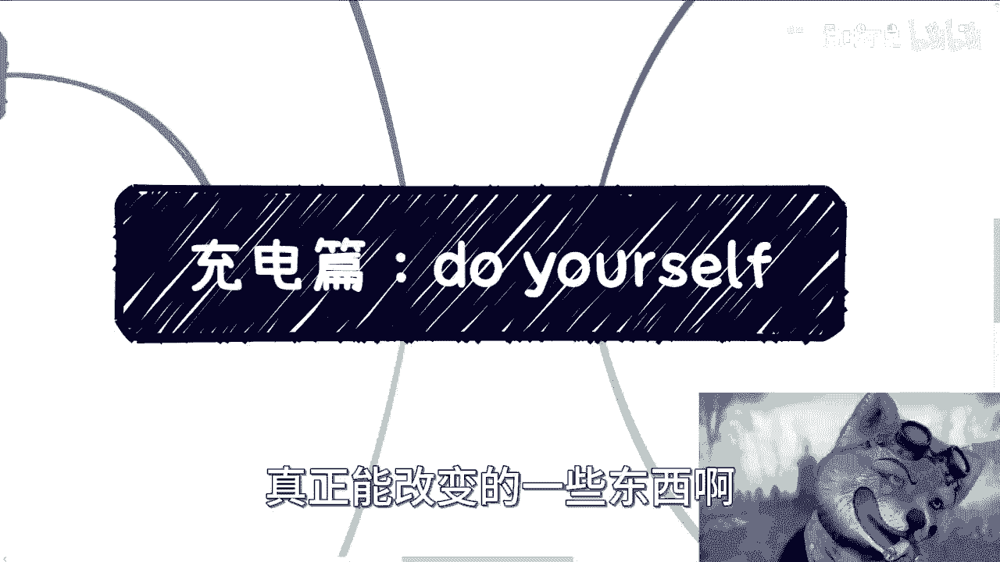
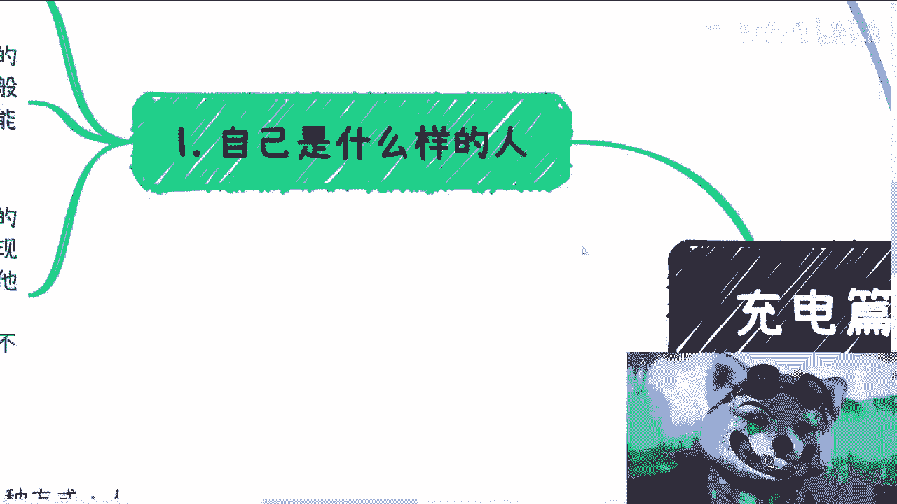
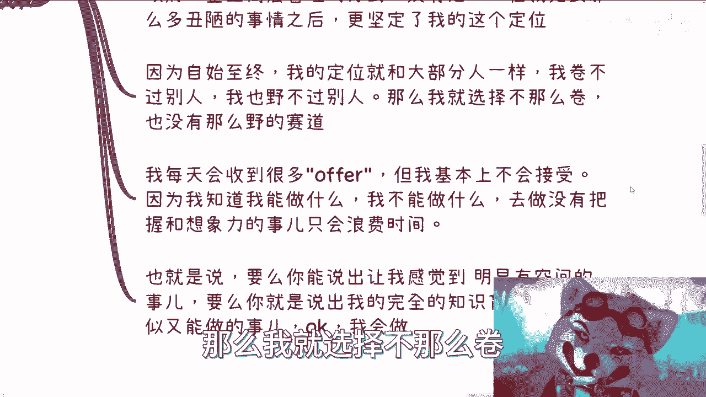
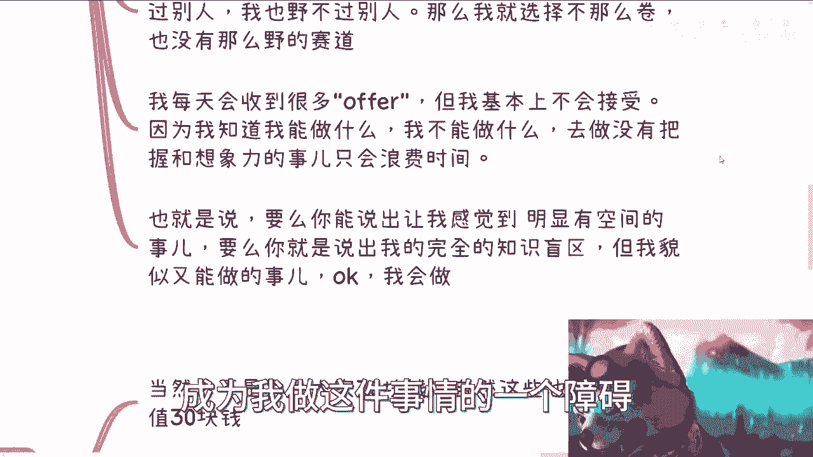
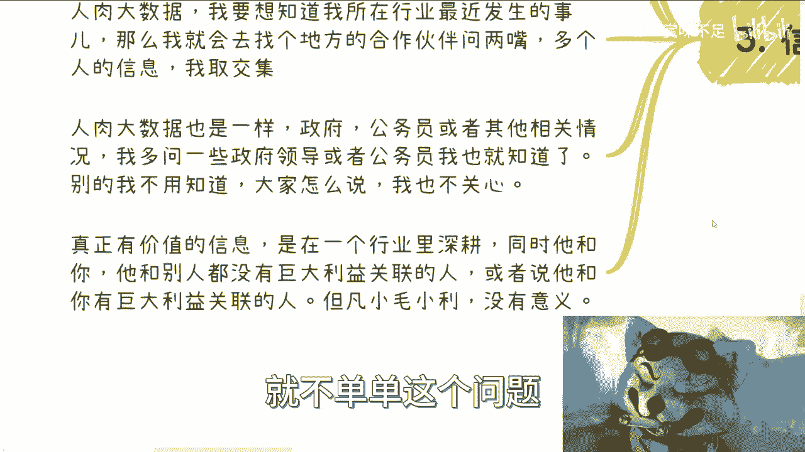
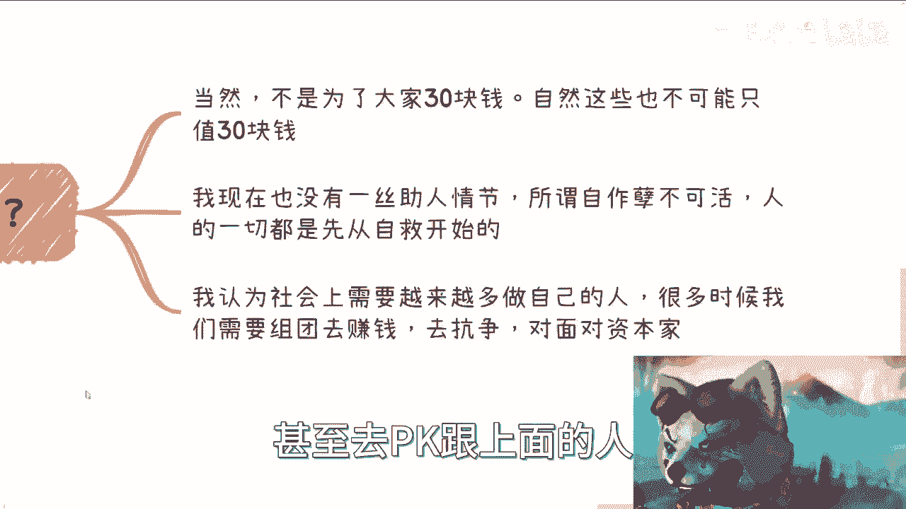
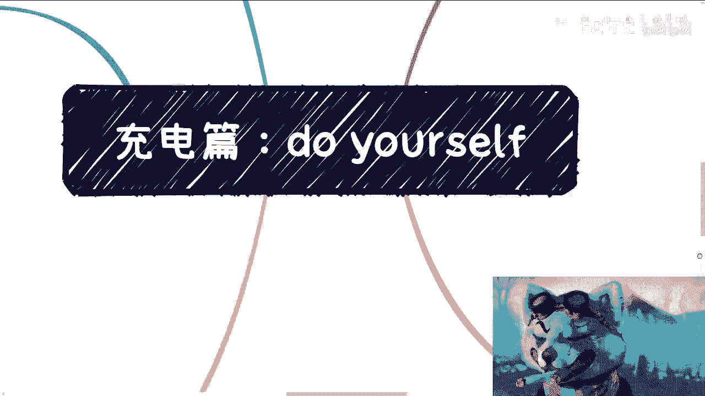

# 充电篇：成为独立思考的人 - P1 - 赏味不足 - BV14p4y1N762

哈喽大家好啊，今天是9月份的第一天是吧，所以我打算来讲一些不太一样啊，这个内容啊，为什么会放在充电片，那肯定是有我的道理是吧，我觉得其实这才是最最有价值啊，或者有，啊或者真正能改变那些东西啊。

首先啊自己是怎么样的一个人。

这很重要啊，这非常重要，就像我很清楚我的底线在什么地方对吧，我不会为了巨大的利益去冒巨大的法律风险，看用词很准确是吧，巨大很大，也就是说什么一般都可以，who care对吧，我并没有这么的自我限制。

也就是说这也是啊，我总结下来，我跟这么多人接触，这么多人沟通下来，我觉得这是我跟其他人不一样，同时我能够走到现在的原因之一啊，那很多人呢我觉得是什么一个情况是这样子的，就是说，由于家庭啊，他其实很优秀。

包括从小呢成绩也很好啊，各个方面所接触到的教育，虽然我不能说非常高等教育吧，但是比我高很多对吧，你不像我从小散养对吧，甚至我跟大家说过对吧，小时候为了这个生计对吧，卖过报纸对吧，然后这个打散工啊。

打散工一个月才200啊，一个月才200，我记得很清楚啊，而且，而且这个吃饭啊规定只有半个小时啊，没有地方给你做，只能蹲在楼梯上啊，我觉得很多人从小他的环境啊，他的各方面都比我优秀啊。

但是这反而是给他很大的压力，很大的枷锁，这也是我接触到现在，几乎啊有些跟我从小认识到大的对吧，包括我现在认识的一些很优秀的人，这是为什么他们的曲线越走越平的一个原因，因为他们的压力太大。

他们给自我射箭也太大，他们觉得世界是这样子的，而我不一样啊，对我来讲，整个一个地图，整个一个世界它没有一个框框就是好，我也会去看，不好我也会去看，对我来讲没有好和不好，我觉得所有的东西都是未知的。

但是对他们来讲不一样，他们由于过于优秀，所以他们觉得他们是有一个框框，有一个明确的边界啊，那么你比如说到现在对吧，很多人其实会沟通下来对吧，甚至这个作为一些朋友对吧。

他们会觉得我和他们在一个label上，但也许现在maybe可能一样，但是以前很不一样啊，这也就造成了我们很多思考方式，很多做事情方式不一样的地方啊，而且这也是我觉得明明他们能够更优秀。

明明他们能够做到更多的东西，甚至帮助到更多的人，但没有啊，甚至他们整个发展曲线越来越平，啊那么我觉得这个呢很多人可能啊，他自己真的很难感受到，就是你们记住这句话啊，你们回头可以去嗯省事啊。

周边的人就是很多真的很优秀的人，但他们真的没有做到太多，也没有做成太多，你们可以去聊聊看，为什么啊。

这第一个第二个呢就自己能做什么对吧，自己要做什么对吧，我觉得这也是必须清楚，否则呢，我们永远啊每天只会是一个左右摇摆的人。

也许你很优秀啊，但是你也只会左右摇摆，那我们可以什么热点都去追什么，有钱我们就去做，短期没有问题，但时间长了我们会很空虚，因为我们不知道自己要什么，甚至不知道自己是谁，这是一个过程。

就是你赚到第一桶金啊，你碰到很多人，你会觉得我很爽啊，你会觉得好像我我我改变了我的阶层，你会觉得我可能未来能赚很多钱，但是你要知道这很有可能是昙花一现，这也很有可能只是短期内的一个一个爆发。

你要长期去做，你要到你三四十岁，那个时候你要明白你是谁，或者你要什么，这很难哦，你可能回过头去想想啊，我可能人工智能也做过，大数据，也做过农业，也做过，什么都做过，但到底我是谁，我能做什么。

我的定位到底是什么，对吧，就是我在社会里面的定位，我在行业里的定位，我在我的合作方的上下游里的定位，别人给的定位是什么，你不知道，甚至你会随着年龄的增长，你越来越慌，为什么。

因为可替代你的人越来越多对吧，那你必须去找到自己的沉淀，有了积累，你才能找到自己的路啊，才能不被别人所左右对吧，你就像咨询政企培训，为什么这一直是我选的方向，而为什么我也不愿意去加到别的公司去做。

为什么我一直愿意一个人做，或者说一直愿意是以大家合作方式去做，因为一方面我有积累，我有经验对吧，另外一方面我看到这是老百姓唯一一条，能够以最轻的方式赚到钱，积累自己的名，同时又能切入到政府。

企业高管管理层的这么一个方式，没有之一，我没看到别的路，好在我见到那么多的丑陋的事情之后，可能上到对吧，cf对吧，下到哪里对吧，那就更坚定了我的这个定位很简单啊对吧，那但凡我倒要有点关系。

或但凡我已经是穷到连啊，这个这个买不起买买买不起衣服对吧，我穿不起衣服，然后没有地方给我住，那我也不会做这些事情，正因为我上不上下不下，所以我必须走这个方向啊，因为自始至终我的定位跟大家一样。

我卷不过别人，我也不过别人，这很正常嘛对吧，又不是皇二代，又不是富二代，又不像大家，甚至我比大部分的普通人对吧，可能还要惨一点啊，虽然我不能说，我比那些四五线城市的小伙伴惨啊。

我觉得这个呃下沉市场其实惨的很惨，但是我作为一个，对吧，在上海的这么一个人，我觉得我从小卖卖报纸，从小打打零工，什么200块钱一个月已经很惨啊，那么我就选择不那么卷。

不那么野的赛道，没有办法对吧，我跟你们这么说，我每天会收到很多offer，但我基本上不会接受，因为我知道我能做什么，我不能做什么对吧，去做没有把握和想象力的事情，只会浪费时间，那也就是说什么意思呢。

要么你就能说出让我感觉到明显有上升空间，有天花板很高的东西对吧，也就是你能说服你，不要说出来一个东西，以我的认知，我会感觉我BULSHIT对吧，要么你就说出来我完全的知识盲区，我不懂啊。

但是呢你又能说服我，感觉我能在里面做点事，OK我会做啊，我我在这个时候我不会去care所谓的风险，不别的东西，为什么，因为我会一边做一会去评估，但是这不会去成为我做这件事情的一个障碍。

就这么简单。

OK然后第三啊，信息的搜搜集，这事其实很简单，对我来讲啊，我曾经说过，我就两种方式，人肉大数据，以及靠那些商业合作伙伴，比如说我今天早上逛了一圈短视频啊，各个话术都有，有让你读研的，有让你放弃的。

有让你去大厂的，有时候大厂不好难，有时候要工作的，有时候不要工作的，反正什么都有对吧，但其实这些并不重要，本来就没有个正确答案，而有没有正确答案也不重要，重要的是，你我我们今天听到任何一个人说一句话。

或者看到任何一个视频，我们得要明白它背后到底是什么，对吧，你但凡只要知道这些视频背后都有，都有自己的利益绑定，OK我为什么去听他的，跟我有什么关系，难道我想做他的韭菜吗，那不是。

对吧啊那么人肉大数据对吧，我想知道啊，我所在的行业最近发生了什么事情，那么我就会去找各个地方啊，各个地方的合作伙伴问两嘴对吧，那么多个人的信息，我取其交集就这么简单呃，我我不信他们，我信谁呢对吧。

难道我去听信网上一个陌生人，或者网上的一个一个一个一个，莫名其妙做自媒体的人是吧，人肉大数据也是一样的，政府公务员或其他相关情况，你比如说昨天对吧，我找了两个在省政府这边做的，我就大概聊了一个上午。

我多问一些政府领导或者公务员，跟公务员的这些人，我也就知道了，别的我不知道对吧，你说我会去什么嘘寒问暖去问他们，哎你们做的过过得怎么样啊，没有意思，他们也知道我不是这种人对吧，别的我不用知道大家怎么说。

我也不关心我，只关心我所获得的信息是哪些对吧，而他们这些信息才真正信息，真正有价值的信息是在一个行业里面深耕，同时他跟你他跟别人没有巨大利益关系，亦或者来说他跟你有利益巨大，巨大利益关系的人。

他说的话才是真话啊，但凡他为了一些小毛小利，他的话都有失偏颇，什么意思呢，也就是说啊，比如说他希望从自媒体上面一年赚个100万，那不好意思，这种这种人你没必要听谈对吧，而且另外一方面。

这就好像前两天还有一个网上说的话吗，他说他说有人问啊，他说结婚之后对吧，这个资产要不要上，就这个薪资要不要上缴对吧，他说我一年50万啊，然后来来问一个树洞，他说我要不要上缴，我怎么回答的。

我的意思就是说你要是一年50万，你都在这边纠结，那你就别结这个婚，也别谈这个恋爱，也别问这个问题，为什么，因为不好意思，你的格局就这么小对吧，因为在我看来是什么上缴不照相并不重要。

重要的是我单位时间一单能赚多少钱，如果你认为你一年就赚50万，那不好意思拜拜，我觉得你随便做什么事情，你的格局就这么大，没什么好说的，你知道吗，就没有什么好说的，就不单单这个问题。

任何一个问题都没有什么好说的，那我们缓回过头来讲，为什么这些政府的领导，为什么这些其他的人愿意给我透露真实的信息，是因为也许我现在没有这么大的成就，但是他们知道我的格局并不限于此，对吧啊。

但凡我的格局很小，那他们就会谨慎，就就会对自己的言行非常谨慎，那他们也就会跟我透露很少对吧，但是我给他们，我自始至终给他们的这个感觉，和大家交流合作下来的这个情况很简单。

就是我也许当下歌就是整个level没那么高，但是不好意思，我的格局的确也没有这么小啊，我不会因为一些有的没的事情，去给大家造成不必要的麻烦对吧，我最大的麻烦是什么，就是这个扭曲的世界。

就对我这样的人的恶意太大，那么也有人会说他说你说了这么多对吧。

怎么做到这些，我给你们打个比方啊，我们都在，我们都像是在一个迷宫里的弹珠，我们不停的来回弹射，有可能路径是重复的，也有可能路径是不重复的，但你只有不停的弹射，才有可能找到最终的路。

maybe你也找不到最终的路，但是就像我之前有次视频里面说的，你只要弹射的够多，你只要看到更多，你只要更多的了解社会，了解人类，你也不枉此生啊，你就活一次，怎么了呢，我一定要找到最终路吗，不一定。

但是我相信在这个过程当中，并不是只有找到和不找到这两个答案。

一定会有一些跟你现在循规蹈矩。

活在别人的世界里的活法不一样的东西，那么我来说我说的这些目的是什么，当然我不是为了大家30块钱，自然这些也不可能只值30块钱对吧，我要是为了所有人的钱啊，我为了大家喜欢啊，那我就不可能去讲这些东西对吧。

因为你从我的定位来讲，它就不可能是个大众，大众要是能有这么一个想法，今天也不会变成这样子啊，我现在也没有一丝助人情结，所谓自作孽不可活，什么意思呢，反过来说，如果要自救，一切都是先从自己开始自救开始。

而不是别人来救别人救不了的啊，我认为社会上需要越来越多做自己的人啊，很多时候这样的人越多，我们需要组团去赚钱，因为一个人的力量是很低很少的，去赚钱，去抗争，去pk资本家，甚至去pk跟上面的人。

对吧啊。

这就像啊我最近做咨询的时候，我跟别人说啊，我说我是这么讲的，有很多话呢，其实你不不方便讲，而且有很多话呢，你同样一段话，你对于不同的格局，不同的认知人听进去，他感觉是不一样的对吧。

就像我说到现在很多时候能认可我的人，他是极度认可我的对吧，但凡他不认可我，那么，我敢说大概率他就会举报我对吧，为什么，因为没有办法，他不明白更深层次的在他的概念里面，只有所谓的二极管思维，那怎么办呢。

而且更好像他认为这个世界跟这个社会，只有好跟坏这两个东西，或者他会认为很多很多机构，很多组织是好的，说白了吧，其实真正去看明白呢，首先我就我我觉得真正看明白就两点，第一这个社会所有的东西都是经济体啊。

呃为什么大家说一定要跟钱挂钩，因为你不跟钱挂钩，不可能，因为他从始至至终他都是个经济体，对这是第一点，第二点是在我看来，他没有什么好的地方，他最多是坏的，所有在坏的里面，矮子里面拔高的而已。

OK那希望对吧，真正的大家能够多多想想吧，不要被这些有的没的去，去去误导对吧，这就像我一开始3月份的时候，做视频的时候，我就说的很清楚，不可能跟大家来讲怎么打工，我也不会教你们怎么到工作里面去卷。

没有意思对吧，因为所有在工作上的东西，在我看来一刀切是什么，就是只要是工作，只要是打工，你的主导权，你的生存权都在对方手上，有什么好卷的，没有什么好卷的对吧，这就好像你今天被绑在一个。

被被被被绑在那个叫什么密室里面对吧，然后绑在一个箱子里面，然后往水往海里去沉对吧，然后你在那边想啊，我绑都被绑住了对吧，然后我开始begging对吧，我开始求饶，我开始干嘛，我开始做各种东西有意义吗。

没有意义的呀对吧，也许1万个人里面有一个人，他打动了对方，他得救了，但是剩下9999个人还是溺死，没有区别的啊。

