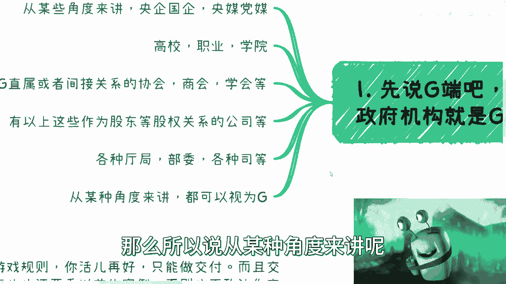
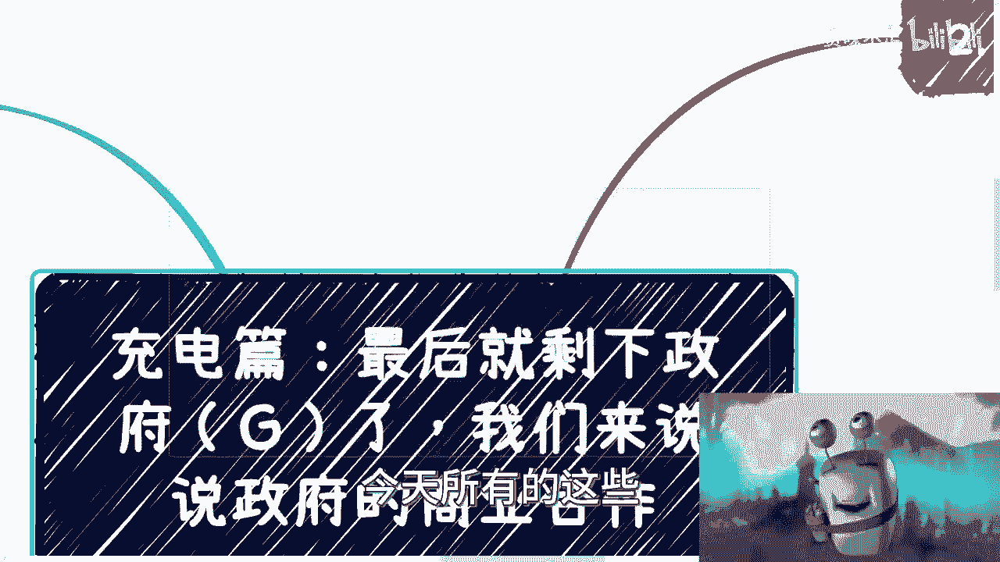
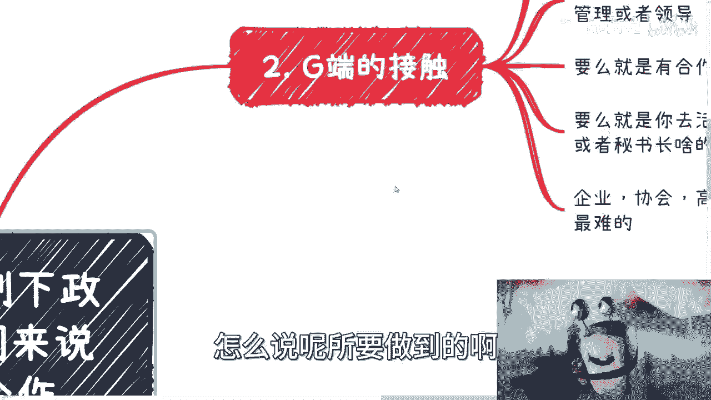

# 充电篇：最后就剩下zf端了，我们来说zf的商业合作 - P1 - 赏味不足 - BV16w411Y7Qf

好大家好啊，到了我们这个说商业这个逻辑就是四大方，个人C端，B端，高端讲完了，还剩下一个政府端啊，就剩下G了，这话好像不能这么说是吧哈哈，我们来说一下这个政府的商业合作啊，首先先说极端啊。

并不是说呃就是说到极端啊，并不是说大家认为的政府机构就是极端呃。

从某些角度来讲啊，等一下我看一下我这个卖的，就从某种角度来讲啊，你央企国企党媒央媒也算政府高校，职业院校，学院绩效主要是跟教育有关的，算半政府，政府直属相关，间接或者间接关系的这些协会商会协会啊。

记住啊，不是说你们碰到个协会，商会协会就是属于政府的，你们要去看他的关系链，他有的呢是股东是直属的啊，也不叫股东吧，就是就管理关系上面是直属的，有的是间接的啊，但是不管怎么样。

就是说只有直属或有间接关系的，我们称之为跟政府相关的啊，剩下那些野鸡的，还就就就就不不在我讲的这个范畴里面啊，那么包括呢有以上啊，有以上这边，比如说有有以上这边所提到的协会啊，高校啊。

党媒央媒央企国企啊对吧，但作为股东的情况下面等股权关系的这些公司，也就是说包括上面这些的，比如说子公司啊对吧，或者说这个投资的公司啊等等等啊，那么也算在这个关系链当中啊，各种私。

那么就更是这个直接征服这叫什么机构了啊，那么所以说从某种角度来讲呢。

以上所有的啊我们都统称为政府机构啊，那么在这个地方呢我得说一点啊，就是说呃为什么我们会这么来说来来来说啊，是因为你们要明白，就是说所有的合作啊，都他都是先达成协议再去做交付的，对吧好。

那么你当你有这层关系在的时候，你的就是政府做事情，就是所有的这种啊，你要去打合作也好，怎么样也好，你总归是要审批的啊，总归是要审批的，而且就是说退1万步来讲，这个单子，比如说这个case你就算不审批啊。

那这里面有很多细节啊，比如说这个logo能不能用啊，某些词汇能不能用啊，对吧，那个需不需要有人站台啊，对吧等等等，那你会发现总有很多细节你是逃不过去的啊，那么也就是说无论啊今天我们说这个合同本身。

你要不要经过上面的审核，这个是一码事。

但是你总有一些细节是逃不过去的，那么也就是说啊，今天所有的这些讲的东西。

都是适用于你在跟政府，或者说啊跟政府相关的这些机构打交道的时候。

索要怎么说呢，所要做到的啊。

第一我们先来说政府的接触啊，政府的接触呢最好的方式呢，我觉得还是需要介绍啊，也就是说你最好有个第三方，你直接呢也不是说不行啊，但是大概率嗯不行啊，那么你直接的认识呢，我就说几乎没有太大可能性啊。

那么但是呢这种介绍呢你需要有个抓手，什么叫抓手呢，你就像前两天我视频里面说的，你说我给你们介绍可以吗，可以的，那你得告诉我我的目的是什么啊，你的目的是什么对吧，然后对方认识你的目的是什么，你你你想嘛。

我去跟我说哎某某某局长对吧，我说这个我们吃个饭吧，怎么样啊，我说我介绍个小伙伴对吧，那你人你不说人家也要问他是吧啊，你最好呢就是说你需要一个中间商，而且呢你需要有明确的一个东西啊。

你说我可能就是有一个合作点对吧，或者怎么样子啊，那么这个东西我们待会再说啊，我觉得第二种可能性呢就是你要么跟我一样，就是通过咨询培训的方式切入哦，就是你想嘛，我从2012左右就开始做咨询培训了对吧。

这么多年我不说有多少吧，反正嗯小就是那种小的，比如说小于100人的这种培训，我我不说1000场吧，大1000场对吧，总归有了就七八百八九百场总有了，你要说那种一两千人的，我怎么滴也是做过十场以上的对吧。

那么你通过咨询培训切入，你可以认识里面的管理或者领导，那这也算一条路啊对吧，也算一条路嘛，那么第三你要么就是有合作方介绍，比如说你请客吃个饭，就跟我说的一样对吧，但是呢你得找好切入点，第四对吧。

要么就是说你去参加一些活动，诶诶诶把我的这个方法大对吧，那么第四就是说你可以去参加活动，胆子大一点，去接触一些领导或者秘书长啥的对吧，那么最后呢就是说我们要说一点，就是说企业协会，高校呢相对还容易一点。

那么纯政府部门，部门呢其实相对来讲还是最难的，也就是说呃，我们上面虽然说你说你需要一个中间商，或者你需要一个抓手，但是但凡你没有中间商或者抓手呢，其实嗯本质上只要不是纯的政府单位，比如说什么听啊。

什么撕啊，什么局啊，对吧啊等等等，那么剩下这些呢我觉得还是有概率的啊。

还是能去闯一闯的，那么这是第一第二第一点啊，第二点政府端的核心啊。

我们说合作的核心就两点呃，你看最近我沟通下来啊，是这样子的，有的人呢他说我胆怯，有的人呢他喜欢很喜欢表演，表演就表现自己，有的人呢喜欢秀肌肉，秀肌肉就是来告诉大家我多么多么牛逼啊。

那有的人呢他不喜欢人多啊，喜欢就说私下去吃饭沟通等等等等等，好吧好，那么有的人呢觉得自己学历不够啊，有的人觉得自己学历牛逼啊，有的人呢觉得自己技术牛逼对吧，那他会在各种项目对吧。

文档当中去体现出自己的技术架构啊，多么的有创新性对吧，或者说多么的这个这个这个有技术含量啊，那么说到这里呢，咱们不是说技术架构功能不重要，而是大家关心的点不同啊，因为这取决于你到底想做执行方，做交付方。

还是要去做项目的中间商或者真正的乙方，你要明白，就是说说白了，就是你到底是最终的一个干活的人，还是一个，你要把这个政府的关系，就握在你手上的这么一个人啊，就是说我不管就是这个商务销售。

包括最终执行方到底是谁做的啊，我不关心你，反正只要找到工具人帮你干活就可以了，这也是你的本事啊，但是不管怎么样，就说你自己的角色一定是我们称之为关系，护城河，关系护城河对吧，那这个关系是积累在你身上的。

这个关系总不能积累在你的销售或商务身上吧，对吧，那么就看你的角色是什么，那么政府端的核心它就两点，第一遵守规矩啊，什么叫遵守规矩，就是我一直跟你们说的，就是这个世界原本的规则。

这个世界商业原本的很多的规则，你该有的规矩还是要有的，吃饭啊，喝酒啊，送礼啊，给红包啊啊你们要知道各地方，南方北方包括一线三线呃，呃二二线，1~5线等，各地方规矩各有不同啊，包括吃什么东西。

你该打听的还是要打听好，尤其是领导哦，尤其是领导对吧，这些东西你懂吗，你不懂啊对吧，我就问嘛，你们到上海来对吧，比如说一般的小领导给多少钱红包，你们知道吗，你们不知道是吧，第二个就是什么呢，投其所好。

投其所KPI的号，因为一切的一切你要切中要害，什么意思啊，我不管你是什么性格，我也不管你秀什么肌肉，我也不管你是你到底怎么样的，你别甭跟我说你是什么样的人，我不关心为什么，因为你在政府面前。

你就你你你什么都不是哦，就是说你要说的是什么，你要说的是他们要听的啊，就像乙方在甲方面前，你是啥，你是个鬼对吧，你要说的一定是他们要听的，你要做的也一定是他们想要你，你要去做的啊。

你要你要满足的一定是他们的KPI，但凡没有你你你你但凡没有切入，你说啥都没用，补充一句啊，而这些东西以上这些东西你就算读到博士对吧，你再往后面读，你就算是双修PHD，你也是一无所知的。

so啊就说你别任何东西都自己想，你自己去想，任何想什么很牛逼的东西没有用啊，你只会让别人觉得就是你知道吗，就是说你但凡不了解很多东西，而你又想要去耍宝，想要去就说提出来说唉。

我有一个什么什么解决方案对吧，我有个什么合作方案，我跟你讲没有用，你不会让别人觉得牛逼，你只会让别人觉得你幼稚，或者说你是一个靠不住的，不稳定的一个一个一个一个因素，那么第四点，第三点就是什么呢。

记住核心在政府这边是什么。

靠谱懂得游戏规则，最后才是交付的东西，你不懂游戏规则，你活再好，你只能交付，而且交付这个事他也得看以前的案例，你但凡没有跟政府合作过，谁都不敢合作，你懂吗，因为出风险谁担得起啊。

说穿了给政府做事情第一要素，你要懂得对方要什么，懂得什么应该做什么，不应该做，再说穿了，就是需要有政府的合作经验，没有经验谁都不敢合作啊，而至于大家关心的，就是因为最近跟我咨询的人当中也有提到啊。

就是说什么啊自己的学历啊对吧，包括这个呃技术啊，其他方面啊，呃我在这个地方再强调一遍啊，关于大家关心的学历，技术背景，这些东西不是没有人关心，也不是不重要，而是这些都是交付执行层面的细节。

我就问你们谁在谈这个case的时候，谁再去就说喝这个酒，大家搭关系的时候去关心这些东西啊，没有人关心他，那我就问嘛，你今天要去打关系了对吧，如果我是领导，我就问你，我说哎这个这个项目你什么什么什么东西。

需要什么技术，你能做吗，你什么意思啊，你跟我说你不能做，你会吧啦，我就问你，你会不会，你但凡你但凡不是一个就不是一个，就你但凡主要是一个智商正常的人，你都会说我都能做，对不对，如果我跟你讲。

我说哎这个项目啊，我起码需要五个博士啊，然后给我十个硕士，你肯定会说什么，哎领导放心，没问题的，有的有的都有的，你会跟我说啊，我没领导，没有的不行的，做不了的，亏不了，你想想看，对吧。

然后你说你关心你关心你是什么学历，领导会关心你是什么学历吗，不好意思不会，他只会关心是整个项目能不能按时交付，正常的交付对吧，然后你的团队是怎么样子的啊，然后我们就退1万步来讲吧，你跟领导正喝着酒。

然后呢这个领导问你，哎这个小王对吧，你什么学历啊，你跟他说我博士啊，博士啊，王博士你好你好，来王博士来晒一个学历出来看看，晒晒你的这个学学士学位证书，看看会不啦，哎呦我真他妈服气了，我跟你们讲真的是吧。

然后政府的合作呢，注意你对接啊，未必一定是极端，就政府的合作，就像我刚刚说的，你可能是个泛极端的东西啊，那么关心的是怎么交付，怎么安全的交付，怎么政治正确的交付，怎么满足需求的交付。

以及怎么最低成本的交付等等等等等啊，这些也是惯性的东西啊，不要你们千万不要去关心那些有的没的东西，你们9年制义务教育，再加再加高等教育给予给予你们的，所有的那些叫什么关心的东西。

都跟真正的那些商业和关系链，没有半毛钱关系啊，你冲上去要是说老子是什么学历，老子以前做过什么项目，老子上面下面都有人，我跟你讲，你越是秀这种肌肉，你只会让对方感觉到你不靠谱，你懂吗，因为。

因为关系链不是这么单纯的，而且你说的对方不关心你上面有人怎么滴啊，你想压我吗，你给我滚，对不对，就莫名其妙。

你知道吗，你只要去讲对方在乎的东西就够了啊，好吧，那么OK那我觉得就是说我已经说的很明朗了啊，政府的合作对吧，如果啊如果是我就说你们看完，你们还觉得你们切不了，那我只能说你们被教育PUA的非常的严重。

你们唉其实方法很多啊，但是就是说要了解规则的确很难，但是这个东西呢就跟就跟我们读书是一样的，你说你读书又为什么要读9年制义务教育，为什么要高等教育这么多年对吧，那你切这个东西也要这么多年了对吧。

那如果你现在觉得我已经没这么多时间了，没怎么样子，那不好意思，我只能说这不是你的错，这也不是我的错对吧，这可能是这个世界的错是吧啊唉行吧，就这么着吧好吧，反正同样的你们要是有什么对吧，想要了解的。

想要更细节了解的啊，或者跟这个做副业啊，或者赚钱啊，其他方面的好吧，那你们整理好问题，整理好问题哎呀，整理好问题再私信我好吧行。

