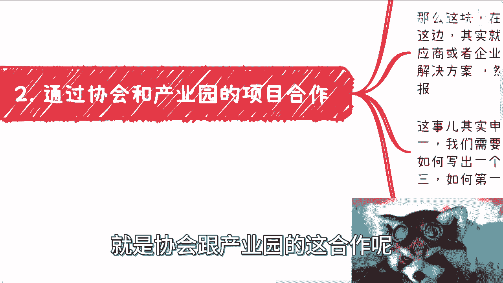
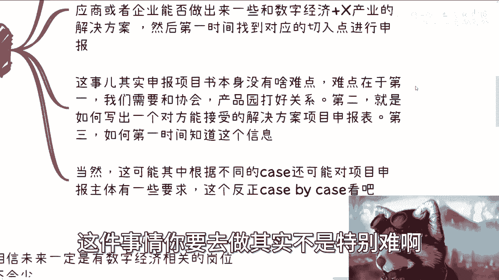
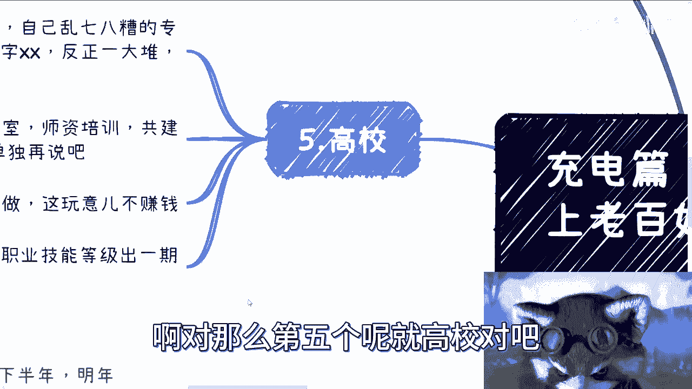
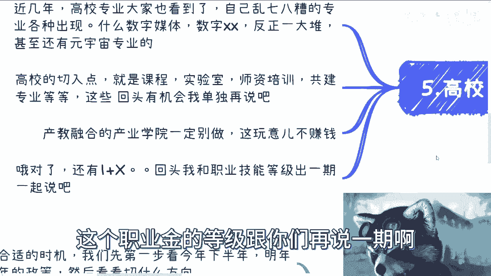
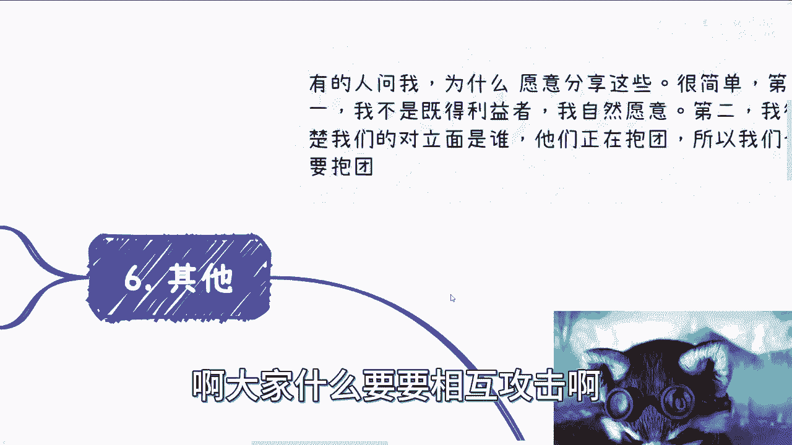
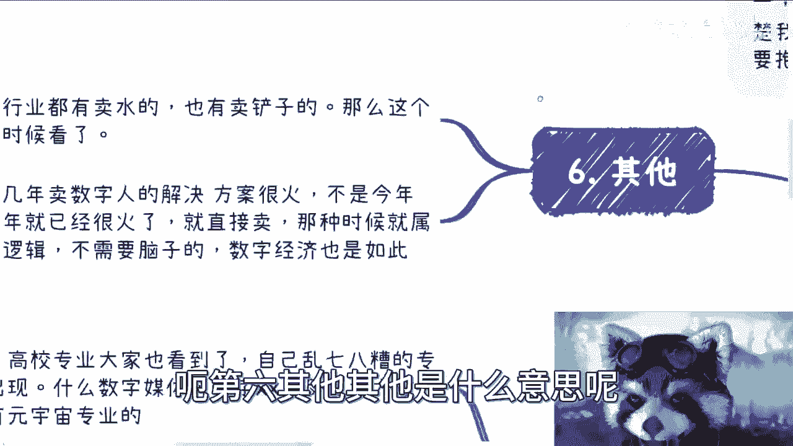
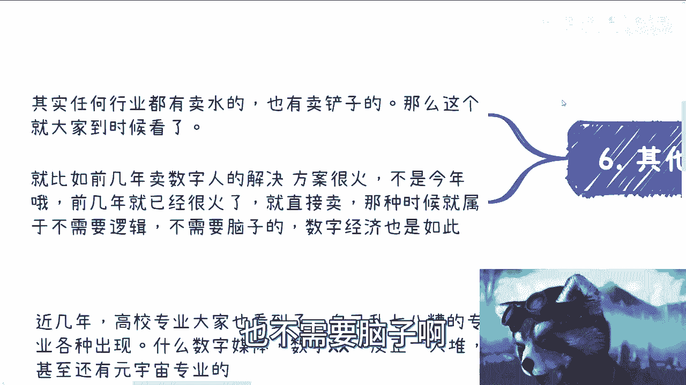

# 充电篇：概括下数字经济老百姓赚钱可以切入的点 - P1 - 赏味不足 - BV1Vu4y1X7Wz

哈喽大家好，这个正好最近啊跟小伙伴们都在聊这个事儿啊，我想着就是正好给大家充电的小伙伴，索性总结一下啊，也别这么零散的啊，呃首先祝大家节日快乐对吧，就不希望大家哎这个上海，今天这个天气是真的不给力啊。

呃首先呢我觉得是这样子的，就是呃本期呢我要讲的是数字经济对吧，上面老百姓可以赚钱的这个切入点，当然啊这个东西呢本质上方法论啊，它并不是说一定跟数字经济挂钩，其实别的任何的这种什么行业，什么东西都可以啊。

这关系不大，你知道吧，也不是说一定要数字经济呃，但是从目前来看呢，政策上来讲呢，可能数字经济的这个呃可能性，或者说离我们这个老百姓贴近程度会比较高啊，那么首先第一个呢就是咨询培训。

最近培训呢我觉得是这样子的，首先目前来讲呢，今年因为停摆了一年，那就今年的这个整个呢其实都在暂停嘛对吧，之前我也说过，就是接下来到底什么情况，我们不知道，那么呃等我们需要等待合适时机。

我们第一步就看今年下半年，就是可能现在接下来四个月嘛对吧，下半年这个各地方政策情况，看看有没有什么新的动静啊，然后还有就是明年上半年的政策，然后看看就是呃，因为接下来这个情况比较明朗嘛。

就是说我们做事情，一定还是要跟着政府做的对吧，你不跟着政府做，你钱是赚不到的对吧，那么也就是说我们得要看看，我们只要看看，就整个大的方向到底是什么样子对吧，那我们到时候再去看看大的方向。

下面我们切什么细的方向，那么这第一个第二个呢就是数字经济的咨询呢，它可以说非常广，因为你们从政策上就能看到吗，就是说额数字经济本身，包含了几乎几乎之前所有的技术对吧，也包含了几乎之前所有的主流产业对吧。

就是呃各行各业其实都可以说数字经济，各行各业也可以都可以说数字经济的这个结合，但是具体怎么结合呢，说实话这个就得我们大家各显神通了啊，呃那么这第二点当然了，我觉得个人做咨询培训练。

还是需要有一定积累的对吧，最好的方式呢就是说你积累，就是你整理好自己的这个商业简历对吧，整理好自己的一些啊这个大纲对吧，整这个能够咨询的内容对吧，那么你就去加入第三方的培训咨询公司。

那当然是这种兼职的方式，就跟他们去签这种part time的合作啊，那么这种是一个目前来讲最最合理的方式，那么这个东西呢，其实本质上是一个滚雪球的过程，就是也许啊你第一年的这个case比较少啊。

然后呢你可能甚至还没有一个case，但是我跟你讲，你就要坚持，你就要不停的去完善你的内容，然后跟这些企业的商务啊，销售啊去沟通对吧，那么你慢慢积累了以后就会越来越多啊，这个东西没有办法的。

因为你总终究有一个0~1的过程对吧，你就算挂在我这，你比如说你说以后对吧，吕老师这边有kiss的对吧，这个那我可能自己做一半，你做一半哪，哪怕挂在我这，那我也得就是说我认不认可你不重要啊。

就是关键是客户也认不认可你嘛对吧，那么你也得是一个就是就是case就做过的，历史案例得越来越多，那这样别人才会认可你对吧，那么咨询培训这边呢还有一个大点是什么呢，就是你自己得要找到一个。

数字经济加X的这个模式，就这个呢是X是什么，就是这个产业啊，比如数字经济加金融啊，加医疗啊，加什么会计啊对吧，加什么东西你得找到一个细分点啊，然后寻找自己擅长的这个地方。

然后整理自己擅长的这个大纲和课程，那么接下来呢就是找咨询啊。

就是找找找那个咨询培训公司开始合作，你知道吧，然后模式就回到我刚刚说的这些，那么这个呢我相信就是说嗯，那虽然吧我现在跟你们讲吧，可能也不是以前没讲过对吧，但是从时间点来讲呢，现在你说积累吧。

晚嘛也不晚，那早嘛其实也不早对吧，但反正就是抓紧时间对吧，那我觉得这是第一个。

第二个呢就是通过协会跟产业园的项目合作，那么协会跟产业园的项目合作呢，我们诶这个没有识别到我，啊有了有了就是协会跟产业园的这个合作呢。

我们来看一下啊，就是呃如果我们要做项目申报对吧，那么不管是钱还是名，还是就是税收减免或者其他的一些东西啊，就是我们无论是个人还是企业呢，就是一般民企啊一般都很难去申报啊，比较难。

也就是说我们的申报呢一定是跟着协会，或者来说产业园去做一个支点才能去做的，你知道吧，那么这块东西呢在国内就是说呃第一优先级呢，其实就是赋能产业，就无论你做什么，你总归要去赋能产业。

你单纯这个技术怎么样呢，呃很难哦，很难，那么产业这边呢，其实我跟你讲，就看大家各显神通，就看看自己手上的供应商啊，合作伙伴啊，或者企业啊，能不能就是说呃，做出来一些这个跟数字经济加某个产业相关的。

这种解决方案，或者说这种项目申报，那么然后第一时间去找到对应的这个切入点，进行申报啊，那么这个事儿呢，其实呃申报项目书本身没有啥难点，你知道吧，难点在于，第一我们需要就是跟跟协会的成员去打好，我写错了。

怪不得我只想我想打出来，字不对，无所谓啊，就跟这个产业园打好关系对吧，第二呢就是说如何要写出一个，比如说啊，协会和这个政府这边能够接受的一个呃，叫什么数字经济加产业相关的这个项目申报表，对吧。

第三个呢就是说如何第一时间去知道这个信息。

那么这个是三个最大的点，本身这个声本身就是叫什么项目申报书，这件事情你要去做其实不是特别难哦。

不是特别难呃，那么当然这可能是其中就是说根据不同的case呢，还可能对项目申报主体有一些要求，就比如我们之前提到的那个叫什么呃，软柱啊对吧，包括什么专利啊。

这些东西可能都会有些要求，但这个东西反正就K400K在看好吧，那么同样的就是说呃，这个大家其实也可以提前去跟协会，跟成员沟通嘛，因为因为你像他们申报项目要什么资质，要什么东西，其实以前也都知道的。

因为毕竟就你随便怎么做，其实都是个循环嘛对吧，你你只不过是换汤不换药嘛对吧，所以说你们大大可去提前了解一下，就是需要哪些资质啊。

哪些东西啊，那按这个提前准备嘛对吧，然后第三个呢就是职业技能等级，职业技能等级呢这块我相信啊，呃未来一定会有数字经济相关的岗位，那肯定也不少啊，绝对不少，这事儿呢其实我们无非就几种做法是什么呢。

要么就是想办法去拿到考试资质，如果你想拿到考试资质呢，一般你还是要绑个协会啊，因为目前人社部的整个体系下面啊，考试资质都是下发到协会的，这个你们去查全国都是一样的啊，要么就是拿到培训资质啊。

当然这个都没有也行啊，那就想办法去凑着，就是就成为他们的合作方嘛，对吧，就是我给你签一个呃，我更有资质的，或者有有培训资质，有考试资质的这些协会啊，企业啊去签合同嘛，对吧不就好了吗。

那这玩意儿呢在各个省市区其实是不一样的，但本质上有一个东西是一样的，那就是一定要快啊，因为人社部证书到现在，作为在中国各省市区赚钱呢，反正就是看谁快啊，这个东西已经很明朗很明朗，那当然了。

这个现在啊我们能够看到就是呃做的话呢，啊现在呢当然大家可以看到就做的话呢，可能这两年比较好的是什么呢，就是啊网络安全管理员对吧，还有这个区块链应用操作员，这两年是有的啊，但是你不能说它好。

你只能说他这个做做的还行对吧啊，那么别的话呢我觉得就是要看明呃，等明年看看有什么新的东西了啊，那么第四点就是FA啊，那么就如大家所想的，我相信所有人都会觉得啊，就是说经济不可能一直不好对吧。

总归会有一个这个增长切入点，那么虽然别的也有可能，但目前出租经济看来貌似是政策比较明朗的，其中的一个那剩下的碳中和双碳，就双碳这边能能源再利用啊，然后你说叫叫叫叫叫光伏对吧，新能源啊。

然后那个嗯芯片对吧，那这些东西可能说不太好啊，那么那么不管呢，目前就是说国内的数字经济还是元宇宙啊，还是海外的这些web3，其实我相信还是会有很多的项目的，也会有就是说很多的资本入场。

当然啊我觉得不管是新瓶装老酒也好，还是怎么样也好，就是啊这不重要，你知道吗，重要的是他要有资金的流通啊，资金只要有流动，那么它才能够有发展啊，至于就是这个这个切入口是什么的，不是那么重要啊。

那么这块东西呢，其实我们但凡懂一些数字经济相关的东西啊，我觉得呃我们其实是都是可以帮助，就到时候就是现在我们往后看嘛对吧，就帮助那些未来的项目方去润色，甚至去编写他的BP，就是项目计划书对吧。

以及他们的那些white paper对吧，就白皮书对吧，其实都可以啊，那么我们也可以直接去做这些FA，进行项目跟资方的对接，呃因为个人F1其实也蛮多的，也也也不少啊，你要是真的做的叫什么。

就是正规一点的，你就挂靠到一些基金公司，或者小型的这种投融资公司也蛮好的对吧，那么这个利润呢也是非常可观的。

利润很可观啊，不是非常可观的，也很可观啊，呃诶诶哦对。

那么第五个呢就是高校对吧。

高校这一块呢我跟你们讲，高校这一块利润其实很高很高啊，呃近几年高校专业我跟你们讲，你们去看看，你们就知道了，就是各种乱七八糟的专业，反正各种出现对吧，什么数字媒体啊，还有数字叉叉。

反正就是各种数字叉叉专业啊一大堆啊，还有什么元宇宙专业的那么高效切入点呢，目前来看呢就是课程啊，实验室师资培训共建专业啊，那么这些东西我回头，反正再跟你们再再单独开一期吧。

再说吧好吧，然后产教融合的产业学院呢一定要做啊，这玩意呃，这玩意一定别做，你别做这玩意不赚钱啊，这玩意不赚钱，那么还有就是一加X啊，回头我和这个职业技能等级跟你们再说一次啊。

对我顺便提着啊，就有人问我，他说啊这个啊为什么我愿意分享这些东西啊，我跟你们在这个地方说的清楚一点啊，以免有很多人这个不说清楚，误解对吧，首先呢为什么愿意分享这些很简单，一第一我不是既得利益者啊。

我最多最多最多只不过是跟基的例子，可能合作过啊，或者我参与过项目对吧，那么我不是记得利益者，那么所以说我自然愿意对吧，那么第二我很清楚我们的对立面是谁，所以说我们作为都不是既得利益者来讲，我们要抱团。

你们明白了啊，所以我们需要抱团，而不是说啊这个哼说什么大家竞竞争对手啊，啊大家什么要要相互攻击啊。

唉我也不知道说啥对吧，呃第六其他其他是什么意思呢。

就是呃其实任何的叫什么行业都有卖水的，也是任何的新的领域，卖水卖铲子的也都是很赚钱的啊，那么这个时候这个东西就大家到时候再看啊，你就比如说前两年这个在中国各个省市区呃，下沉市场卖数字人解决方案。

我靠老火了对吧，记住啊，不是今年啊，前两年就已经很火了，而且价格很高啊，就直接卖，你知道吧，就卖给那些比如说产业园啊对吧，要要申报项目的，或者说怎么样子的对吧，就是很多很多，好很多很多。

那么前两天就有了啊，那么这个东西呢就是说在火的时候呢，属于就是不需要逻辑的，你知道吧，就直接卖啊，1。1点逻辑都不需要啊，又不需要脑子啊。

我跟你讲这个每个行业都一样，到时候数字经济呢也是这样子啊，我觉得都差不多啊。

那么嗯好吧，那么基本上我觉得就是说从普通人啊，从老百姓角度来讲呢，能切的啊，可能就这么一些，那当然这些当中有一些关键前提呢，就是该跑的关系提前跑好啊，该找的供应商提前找好啊。

该做的解决方案也提前构思好对吧，因为这样的话就说你你一旦有机会了，你就能够去把握住嘛，否则你说怎么个搞法，没法搞他啊，嗯好吧，我希望大家就是再品一下这句话啊。

品一下这句话一定要明白啊，一定要明白，就是接下来时间也没有多少时间了啊。

那大家单打独斗很难很难好吧行吧。