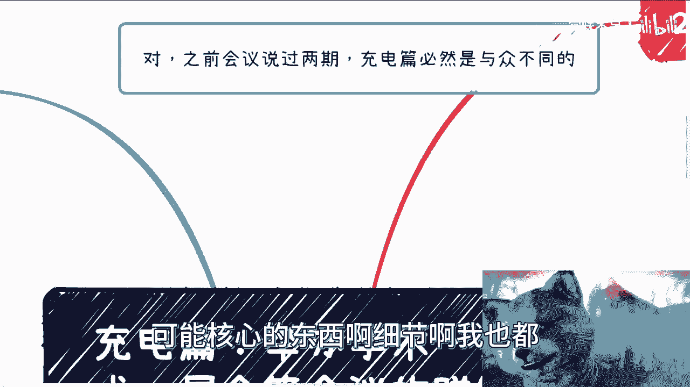
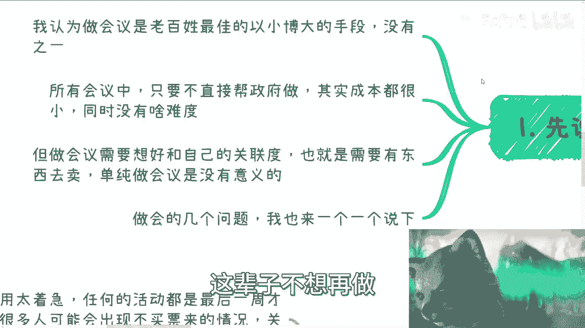
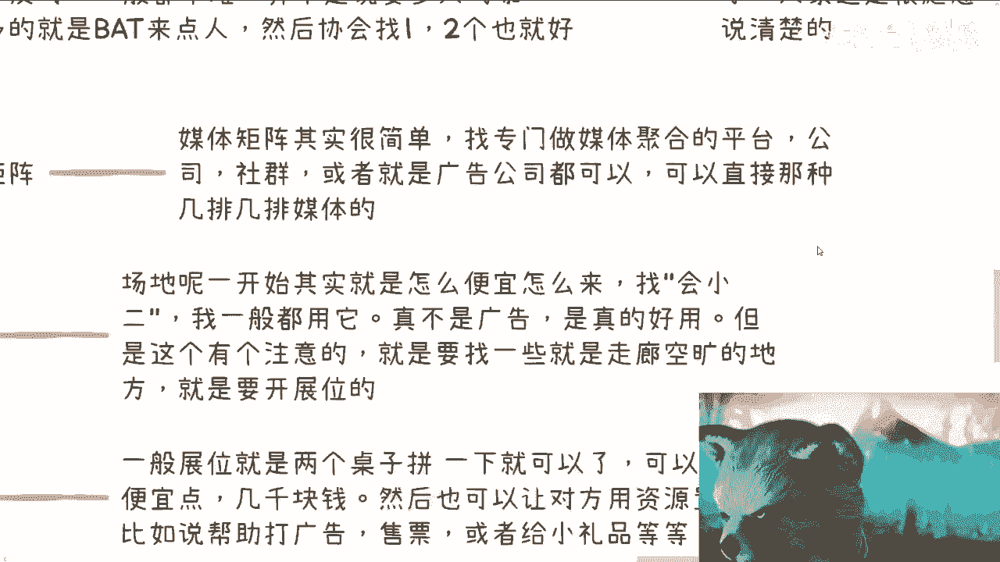
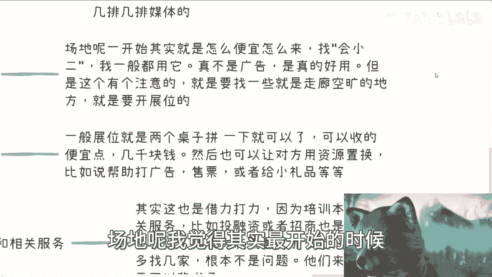
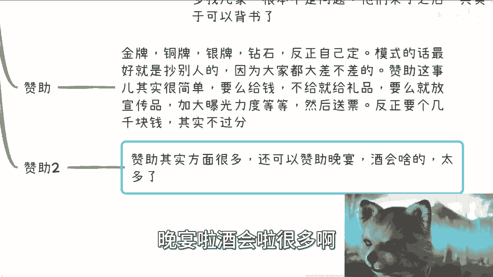
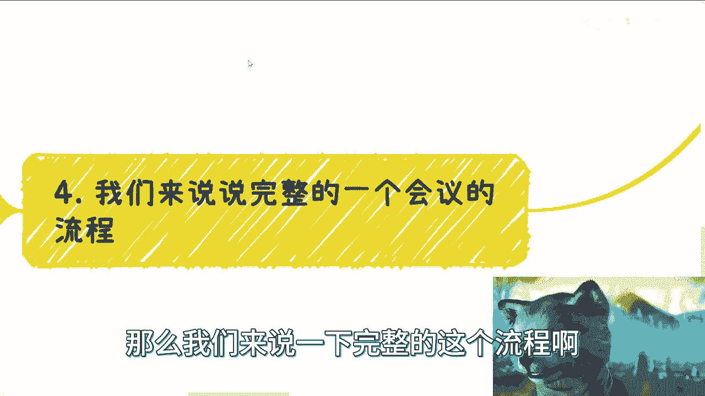
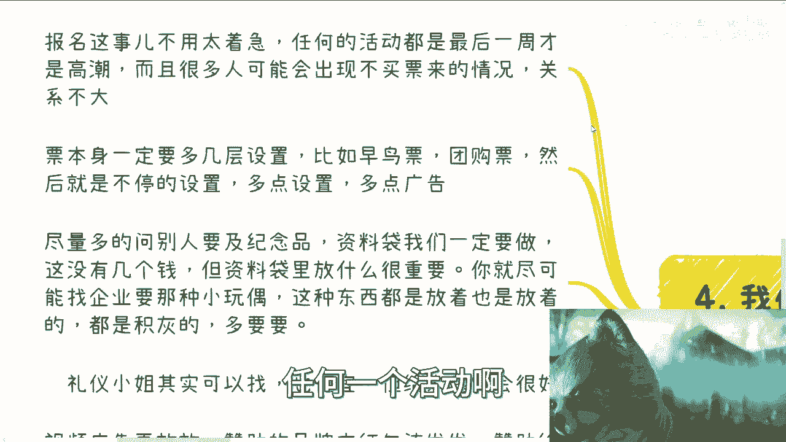

# 充电篇：细分讨论下各种学术、技术、展会等会议的赚钱方式 - P1 - 赏味不足 - BV1hh4y1T7Qv

好啊大家好啊，这个之前呢相关的呃也说过对吧，那么充电篇必然要不一样是吧，所以说我把里面一些可能核心的东西啊，细节啊我也都在盘一下啊。

呃先说几个核心。

等一下啊，先说几个核心啊。

第一个呢，就是我认为我为什么一直会说这件事情呢，是因为我认为做会议是老百姓最佳的，以小博大的手段，没有之一，真的没有之一，因为别的东西呢不是说老百姓不能做，但是很多东西做了点风险不可控。

而且呢会议这个东西呢说说直白一点，其实一个人也是可以做的，也就是说你要是怕担风险，或者你要是就是觉得自己有很多的不可控，那你就自己做把把最多就把一些活分出去对吧，因为整体东西里面一个人可以做。

不是不能做啊，你不像做很多别的东西，可能比如说货源不在你手上啊对吧，供应链上下游不在你这边啊对吧，然后什么合作方资源也不在你这边啊，你有很多东西都未知对吧，那么所以说我是觉得老百姓做很多别的东西。

它容易被坑啊，但是做会你不会啊，你最多就说我已经知道亏了，那我不做，我不做总行了吧对吧，你总没人强迫我做吧对吧。

那么所有会议中呢，其实我就这么说嗯，只要不是直接帮政府做，因为我之前帮政府直接做过啊，只要你不直接帮政府做，成本其实都不高的，都很小，而且没什么难度，但是你一旦帮政府做了没，我跟你讲啊，要就烦的要死。

真的是烦得要死啊，你们但凡去做过你就知道了，这辈子不想再做了。

但做会议呢就是我觉得是这样子，你得想好跟自己的关联度，什么意思呢，就是说你做这个活动不是单纯只做这个活动，如果单纯做这个活动就没有意义了对吧，你需要的是你要想好，我通过这个东西。

因为我们做事情不是为了去赚辛苦钱啊对吧，我们做事情是为了通过一个支点去赚，就是投入产出比高的钱对吧，就是你投入一份的努力上，赚出十分努力的钱啊，这个是我们做事情的初衷啊对吧，那么也就是说我们做一个会。

我们要么就是有东西去卖，要么就是有服务去卖，要么就是能在这里面已经能够，就是自己已经整理好了，我的变现逻辑是ABCDEFG，你知道吧，而且是我做过了一定的调研，我觉得啊这个调研下来的结果是能够变现的。

你才去做的，不是反过来啊，不是反过来说，唉我今天我今天对吧，就是说做这个什么都不知道，但是呢我就觉得我要先去做啊，然后做了之后我再来看这个就比较难了啊。

那么做会的几个问题呢，我在这个地方也列了一下。

首先先说核心点，核心点就是为什么要办会啊，呃在我看来，办会这件事情为的就是一次性，而且是一劳永逸的让整个行业认识自己，就是你甚至可以不是这个行业的人，无所谓啊，你甚至也没有深耕过也无所谓。

但是你可以通过一些手段去办，办了之后，你可以一次性地让企业资本猎头hr对吧，或者相关的做广告的，做咨询的，做什么的，一次性都能认识你，当然你说哎不可能整个行业对吧，那没关系啊。

总比我一个个去认识来的强吧，总比我漫无目的在那边认识来的强吧对吧，因为你办的会一定是有个主旨的，来的人一定是被这个竹子所吸引的，你所接触到的资源，一定是个这个真跟你这个主旨是强绑定的。

那么这个资源跟你能够合作，或者能够在你这边变现的可能性就会变高对吧，那么所有相关的产业相关人员，一次性让他们认识你啊，因为你是主办方，那么在这当中也有一点，而且也是办会的好处是什么，就是因为你是主办方。

别人不会太care你的那些什么背景，什么东西都不重要，因为你办这个会，你已经是一个介绍了，已经是你的一个背书了，你已经牛逼了，你懂这个意思吧，啊也就是说所有人来，你跟他们已经是平起平坐的。

甚至你是比他们高一等的，因为毕竟这是你主场啊对吧，你不想说哦，你跑到一个活动，大家就是这个叫什么萍水相逢对吧，他也来参加活动，你也来参加活动，然后大家介绍介绍对吧，你说什么他可能也听不进去。

但你是主办方就不一样了，对吧啊，我希望在充电这些这个内容里面呢，我能就是希望大家能够就是说，一方面我也希望我能够跟大家讲明白啊，第二方面就是说，我也希望大家能够真正的去明白，这个事情里面的这个逻辑。

好，那么这第一个第二个呢就是做会的目的是什么，目的是你的服务，当然你也可以连接服务，也就是说这个服务是你自己可以做，你也可以连接第三方来做对吧，比如说你直接做培训，做咨询，那么你去推广你的服务对吧。

比如说你可以连接，你可以连接一些资本，连接一些资源，那么你就做FA，就是我们说的对接项目方跟资方对吧。

对吧，那么这个东西是我们可以给的对吧，那同样的你比如说会议的目的B，哎呀我发现大家真的是不会不会利用网络啊。

就是会议目的地，它就是帮助大家连接资源对吧，大家来一方面是认识你的主办方。

另外一方面就是来寻求合作的，他不是来听topic的啊，那么会议三就是插flag，也就是说你要告诉整个行业，你要告诉这个全国对吧，也就是说我创造了一个品牌啊，这个品牌以后是有延续性的，我第二期第三期。

第四期也会继续办的，那么这个就是所谓的高举高打，因为你再怎么样，你办一个一两百号人的会，你还是牛逼的呀，我就这么跟你讲，你今今今天办第一次是也许你很艰难，但是我可以告诉你到第二次，你那些什么品牌方啊。

协会啊，什么东西啊，人家就会主动找上来，为什么，因为你已经有成功案例的对吧，那么你第二次第三次，第四次往后，这个东西就是一个非常就是正循环的，既给你带来资源，又可以给你挣钱的这么一个东西对吧。

那么会议目的四赚钱对吧，那你前前后后前后后的培训对吧，晚上的酒会，晚上的私董会你都可以办啊，不仅仅只是办会啊，你都可以开始做啊对吧，以及对接撮合的费用对吧，以及门票以及赞助费，这些都是钱啊对吧。

而且最重要的还有一个就展位费对吧。

当然这一切可能根据不同的行业，利润还是不一样的，但是不管怎么样，这些从办会本身角度来讲。

它的利润率是很高的啊，那么第二点我们来拆开来说这个问题啊，你看啊，有人说没有嘉宾怎么办，其实这个跟日常的沟通社交是有关系的，你只要日常正常的去积累，去社交，去找点朋友去分享，只要对方公司不反对，不难啊。

这找人分享要拿什么东西了，你实在不行，就做个一天的对吧，大概上午三个嘉宾，下午三个嘉宾或者上午两个嘉宾，下午三个嘉宾，五个五个嘉宾有什么难找不难找啊，并不是那还有一点啊。

并不是说我们一定要找多大的咖对吧，一般来讲一般来讲啊，你比如说找一些BAT或者再往下沉，比如说拼多多啊，字节啊对吧，你找点人，然后协会找一两个也就好了，不是说一定要什么秘书长啊。

或者什么很高level的人无所谓啊，你知道吧，那别来说BAT会不会来，因为有很多人也会说哎找BAT不一定会来，没有的，我跟你讲，你是没有去找你，但凡比如说去找他们hr g对吧，找些什么人人家很愿意的。

只要报备了都愿意的对吧，那当然了，你你你你的会议目的，你得做好的，你得不能，你不能让对方觉得你就是个野鸡活动，那人家肯定不愿意来呀，对不对啊，那么第二个就是媒体矩阵，媒体矩阵其实很简单。

你就专门找媒体聚合的那种平台或者公司，或者社群，或者说广告公司都可以，就是你只要找一个，他可能就是给能够给你那种什么几排，几排媒体的这种，不是说那种几排几排，什么什么什么什么十排20排这种媒体。

大家一个个找，你想看这他妈找到什么时候去啊，你肯定是找一家聚合平台。

然后他帮你找啊对吧，他帮你谈个总包价嘛，就跟MCN一样的对吧，然后场地场地呢，我觉得其实最开始的时候你就是怎么便宜。

怎么来，你找会小二对吧，我一般都用它，我跟你讲，这真不是广告，是真的好用，你知道吗，你没用过，你不知道，你用完你就知道真的好用啊，但是这个有一个注意的点是什么呢，就是你一般找呢还是要去找那些走廊空旷。

就是有这种空余地方的这些场地，为什么，因为你要开，你要你需要开展位的，你知道吧，那么展位是什么东西啊，展位一般其实切你就这么想，高端一点，人家是有所谓的搭建的啊，但是我们不用啊，我你看我以前办活动。

我他妈都是没有没有什么大件的，我就很low啊，一般展位就是两个桌子一拼就可以了啊，然后收的便宜一点，比如说比如小几千块钱就可以了呀，对了说个展位，然后呢你对方如果不愿意出钱也没关系。

因为你要的是什么，你记住你要的是整个场面看上去宏大，才来的人多，所以说对方就算不给钱没关系，你让他用资源互换。

比如说你可以让他帮你打广告，你也可以让他帮你售票，你也可以让他送你小礼品都可以，不一定一定要收钱啊，那么还有一点就是培训跟相关服务，其实这个也是借力打力，为什么，因为培训本身是为了赚钱相关服务。

比如说投融资或者招商的目的性，他其实都是要流量，对不对，你你作为一个会议方，你代表你就有流量，那么他们是不会拒绝你的，你只要不问他们额外的收费，都不会拒绝你，对不对，但但凡拒绝你就多找几家，怎么滴了呢。

在地球上这种这种活动啊，这种这种平台多的是啊，服务多的是了对吧，那么你就想他们一旦来了，其实就等于给你背书了嘛对吧，你就可以说哎你看啊，我就我这个会议对吧，比如说前面一天是某某某做的培训对吧。

晚上呢可能会有这种投融资相关的来，那不就很高大上了吗，对不了啊，然后赞助赞助呢就是我们说金牌银牌，铜牌钻石对吧，反正你自己定随便无所谓啊，模式的话呢你也别自己想，你是抄别人的，因为所有的会都大差不差的。

然后赞助这个事儿呢其实很简单，你要么给钱，要么就给礼品，你要么就给流量，你不能一个东西都不给对吧，那么你想干嘛，你要钱可能难料啊，但是你要点别的东西还是好要的对吧，你你你说我这个这个叫什么。

就是你帮我打个比方啊，这个对方说我不愿意给钱对吧，我可能就是说大家都比较困难，但是我愿意给礼品对吧，或者说帮帮我们曝光曝光对吧，加加增加增加这个曝光度，曝光曝光度，你送给他一些票，不是两全其美吗。

反正你票又不要钱，对不对啊，那么赞助二，赞助二呢还有很多就是赞助这个东西呢，其实有很多种模式，你可以赞助这个会，你也可以赞助这个晚宴，你知道吧，就吃饭，因为很多人觉得吃饭是很重要的啊。

晚宴叫什么叫定点精准推送对吧，你比如说很多人对吧，给了一笔钱，你让他在晚宴上讲一下，讲一个话，开个场，卧槽这我跟你讲，有些地方晚宴很贵的啊，晚宴啦，酒会啦。

很多啦都可以都可以收钱的啊，那么我们来说一下完整的这个流程啊。

这个流程当中有那么几个报名，这个事不用太着急，任何一个活动啊。

都是最后一周才高潮的，因为很多人一开始时间定不下来的啊，所以说而且当天还可能会出现很多，不买票来的情况啊，当然这个事关系不大，你知道关系不大，然后第二点呢就是票本身，票本身呢一定要多设置几层。

就比如说早鸟票团购票，然后呢你就就是不停的去设置，比如说二人团购，三人团购对吧，五人团购你多设置几层，你知道吧，多发点广告，然后呢还有就是说尽量多的问别人要纪念品呃，我们自己出钱呢就做一个资料袋。

就比如说做个200个资料袋，你去看看能花几个钱啊对吧，资料袋一定要做对吧，然后资料袋里面放什么很重要，你就尽可能的去找企业要中小玩偶啊，宣传单啊对吧，我跟你讲啊，这种二折页。

三折页小玩偶本来就放在这种仓库里，都积灰的，你不要白不要你懂吗，但是他们没有用，对你来讲有用啊，然后礼仪小姐也可以找啊，对李仪小姐也不贵的，你去找好了，不贵的啊，但是给人感觉会很好对吧。

然后同样的视频广告再放再放放对吧，赞助的品牌方红包该发发对吧，赞助给钱TP就往前对吧，就是你能够收钱的地方很多，你就说唉我我一次会议给你们发两呃，放两次你们品牌的广告对吧，我收个2000块钱不过分吧。

对吧啊，我我我我比如说今天再给你玩个topic之后，TP往前提对吧，除了那个开场topic以外，第二个就是你们对吧，那那那你们这个该怎么讲怎么讲，该怎么宣传，怎么宣传，我收笔钱也不过分吧对吧。

收钱地方很多很多，你甚至单独给他个场地都可以，无所谓啊，对不对，不是羊毛差羊身上的事吗对吧，所以其实大家都是来社交的，有有的人是来蹭便宜的啊，但是就不是来听topic的，你懂吗，因为因为本身我跟你讲。

这个就是个普通人的会对吧，你办也好，我办也好，我们不可能办出个什么，像华为，像亚马逊这种很高大上的会，对不对，你本身就来，这是个普通人的回。

那大家来听东西，大家也就图个乐啊，本质上来的目的是什么，是社交呀对吧。

那你就得你就得满足大家这个需求吧对吧。

那我对会的认知是这样子，说实话，每当我走投无路的时候，我就会去办会，为什么，因为没有成本啊对吧，而且真的有那么一点点成本投入，也一定是值得的，因为我打这是我唯一能够打开僵局的方式，别的很难很难啊。

对不啦，而且别的做事情投入我也不知道多少产出，我也不知道多少都是问号啊，我甚至还会被坑对吧，我办过很多次会，每次我就这么跟你讲，每次其实都会给我带来很多的合作方，每次也都会给我带来很多后续的资源。

如果我当时不决定不办这个会，可能后面很多合作就没有了，这个就是一个蝴蝶效应，你知道吗，那所以说啊就是说啊。

我为什么会就是一而再再而三的提到这个东西，就是没有什么东西，我是觉得从老百姓角度来讲，没有什么东西比这个事情可能更来的简单哦，更来的简单，就是我们不要去办学术的，我们也不要办展会的对吧。

我们就去办那种技术类型的对吧，行业峰会对吧，早上比如说两个主题，下午四个主题，然后呢我就找找赞助，让他们在我这个会议室，会议旁边走廊上摆摆几个地摊对了，弄几张桌子，摆几个，摆几个展会。

摆几个展位不就好了吗，结束了呀，但是你对你来讲，你想难难点没有啊，几乎你就找一些嘉宾对吧，去跑跑商务对吧，但是你收获的是什么，你收获的可能是一大堆的这个未来的合作方，然后你可能到时候。

就是说有很多意想不到的合作，同时你说不定还能找到工作对吧，有些地方你是能够跟他们老板谈或者怎么样子，这总比你一次次去找一次去社交来的好吧对吧，而且本质上疫情之后呢，其实线下活动是很稀缺的。

说实话是很稀缺的，而且这种比较亲民的，就是接近老百姓的活动也很稀缺的啊，就是你就这么想吧，他们办高大上的活动，那一定有他们赚钱的逻辑，不管是背后发学术论文对吧，还是说拿赞助费，还是说是就是拿政府补贴。

这是他们的事情，跟我们没有关系，我觉得老百姓去做是什么呢，就是我就是要个起步，我就是要我自己创个品牌，我就是要在这里面赚到钱，然后通过这个东西给我带来更多的合作方啊，带来更多的这个合作的可能性哦。

然后就说这个在未来，比如说两三年里面，一次一次一次的去去增加我的合作，就增加我的比如说指导单位啊，增加我的协办方，主办方啊，增加我的很多东西啊，那基本上两三年后你这个旗子插牢了对吧。

或者你这个活动也比较的这个稳固了，那就差不多了呀，后面你甚至可以我跟你讲，你后面甚至直接可以脱手啊，外包出去啊，对不对，没关系的，你就在这里面拿个利润不香吗，对吧，好吧，所以说就是就是我觉得吧。

就是很多小伙伴呢他其实不做的原因，我也是知道，因为对于很多未知的东西是比较恐惧的嘛对吧，但是本质上我说实话，以我的浅薄的认知啊，我真的是觉得这个东西是既可控又能做啊，相比别的东西实在是怎么说呢。

就是投入产出率还是算高的，而且没有质疑啊，好吧行吧，那反正就这样啊，这个，后面后面我会想想看，我对我把人设，到时候那个东西我可能再给大家扩展一下，好吧，嗯别的的话唉再说吧，这个录过程当中我看看嗯。

我顺便提一嘴吧，就是我这周一啊，我是不是周一啊，上周一我去了一趟那个协会呃，然后协会这边呢我也接了一下地契啊，就是跟科委啊，金星委啊，就其他地方我也接一下地气，反正现在呢就是说上海这边呢。

就是了解下来也很难啊，就各方都很难，所以说就是说这两年呢，可能就是大家养精蓄锐对吧，积累对吧，包括蓄力的最好的时机啊，明年就今年下半年或者明年一旦，政策上有什么具体方向，那大家就冲了啊，我跟你讲。

到时候就白热化转状态，就现在就是该该准备，该蓄力，该储备就是该该做的就要做起来，就就不能再再再怠慢下去，好吧行，就这么着吧啊那个反正有什么细节问题，如果大家觉得有什么要咨询的好吧。

你们就反正整理好咨询我好吧。