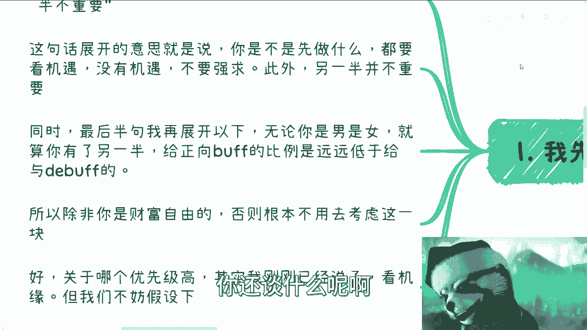
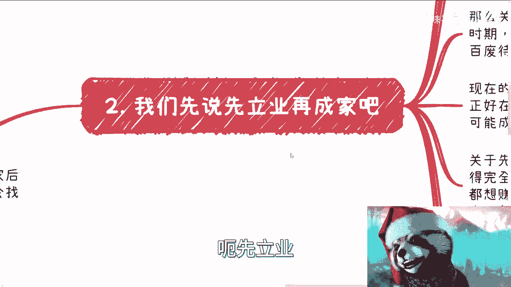
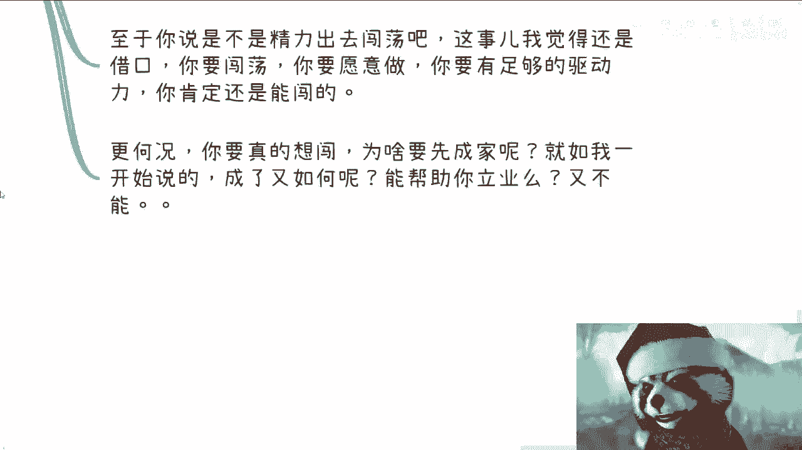
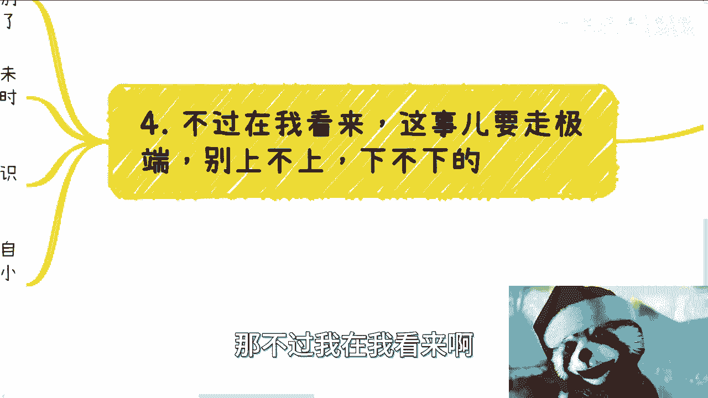
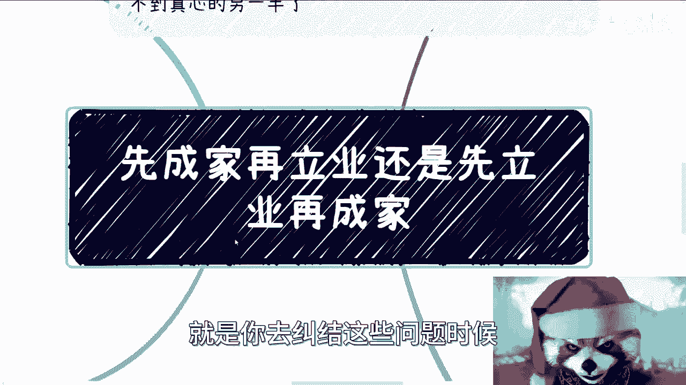
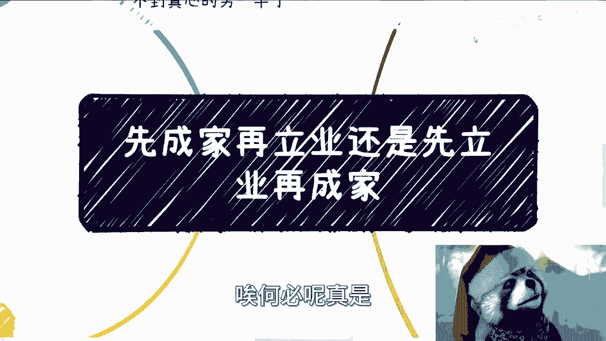
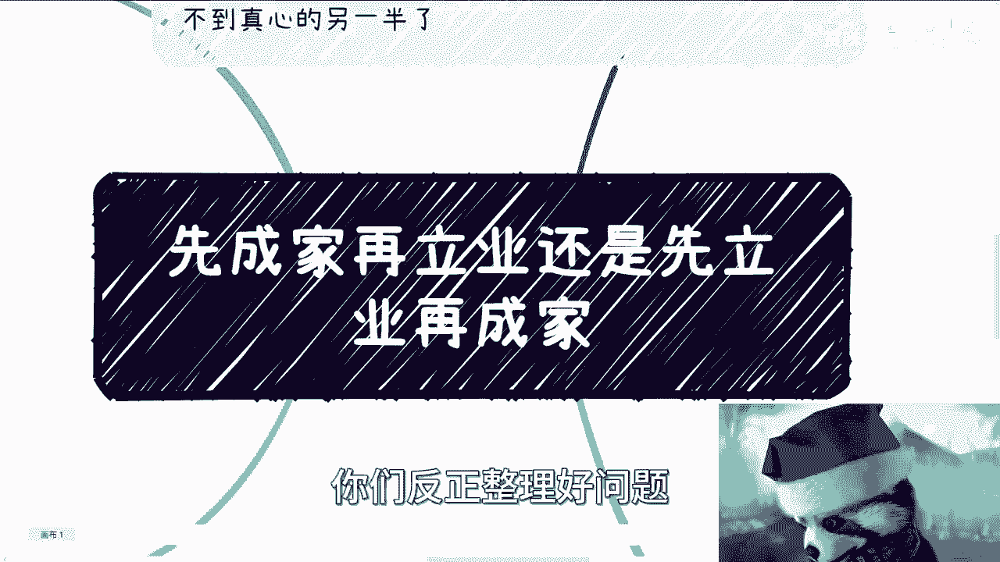

# 先成家再立业还是先立业再成家 - P1 - 赏味不足 - BV1Rj41177gU

哈喽大家好啊，这个话题就特别的有趣是吧，昨天有个小伙伴呢，他原话啊，我就直接粘过来了啊，他说呃先成家后面啊，再要想出去闯荡呢，总还是精力不够啊，先立业呢又怕找不到真心的另一半啊。

呃所以呢我们这次主题就变成了先成家再立业，还是先立业再成家啊。

还是怎么地啊，好那我先说我的回复啊，我原话是这样说的，我说这事儿呢要看机缘，另外呢这另一半的不重要啊。

他不重要好，那么这句话展开的意思是什么呢，就是你是不是先做什么，你都要看机遇，什么意思呢，就比如说你跟我说，你要先立业还是先找对象还是先成家，我觉得这个都得看机缘啊，你不要强求你不要去啊。

什么什么世俗的规则对吧，什么你父母催你了，或者你觉得你年龄大了或者怎么样子了啊，你就要去做那这个东西，我觉得我们就别谈了对吧，你就是你已经被被这种有的没的，这种莫名其妙的东西束缚住了，那你还谈什么呢。

对不对，就你已经从一开始就已经失去了，你的这个这个自我的选择权，那你还谈什么啊。

然后此外呢另一半并不重要，那同时呢这另外一般并不重要呢，这句话再展开一下啊，也就是说无论你是男是女啊，就算你有了另一半，你会发现这另一半能给你正向Buff的比例，而正向Buff的可能性。

远远低于给你DEBUFF的可能性，你知道吧，就是啊这懂得都懂对吧，那不懂的未来也会懂啊，所以呢除非我觉得你是财富财富自由的，否则你根本就不用考虑这一块啊，那么你说至于哪个优先级高对吧。

其实我刚刚也说过了，看机缘，但是呢既然要说这个话题啊。

不妨我们假设一下，首先我们先说啊啊先立业再成家。

你看啊，首先关于立业，咳咳我觉得立业的定义很广啊，每个人对于那个立业的定位也不一样啊，毕竟呢怎么过，不是过对吧，你好，有好的过法不好有不好的过法，他说他立业了，我说没有，那这个没法往下谈了，对不对。

但是你会发现我们的这句话它是有上下文的。

上下文是什么呢，所谓在先立业再成家，也就是说你要立了业再成家，那你你要是这句话说我就立业，你不成家，那可以对吧，你说你先立业再成家，意思是什么，意思，就是说你需要有能力给予这个所谓的家的。

安全感以及抗风险性，对啊，我不管你是男女，是男是女啊，不是说这地方就是我们的定义说给男的说，不是的啊，啊否则呢我觉得我们就没有必要再去谈先后了，对不对啊，那么另外呢关于立业的方式。

我觉得每个时代都不一样，你比如说蛮荒时期对吧，你只要胆子够大，你随便搞猪都能起飞，对不对，因为百废待兴了，你随便怎么样，你都有这个成长，其实都有红利期，但是现在不行了，现在没有啊。

那么现在立业呢我觉得讲究一个机缘，无论是你的人脉，还是你说正好在某一个业务的风口上，还是说正好机缘巧合，与某些case他都能成为你立业的机缘啊，关于先立业之后找不到真心的另一半。

这就是我们这个小伙伴提出来的问题啊，他说我找不到真心的一半，我觉得呢你没有玩你，你没有必要去想，为什么呢，因为这个就和什么呢，这个就和大众每天都说我想找一份好的工作，我每天都想赚钱，我想找个好的老板啊。

通情达理又能够钱多啊，这个钱多活少，离家近对吧，谁不想呢啊，我也想找个好的合伙人，但这个是我们能决定的吗，那不是，那不是我们想他干嘛呢，对不对啊，当然有小伙伴还要说他说那等立业了。

那说不定单纯的清纯的就没有了，对吧啊，好啊对啊，还有呢重要的是那种真心的就少了对吧，首先啊我告诉你，你无论在什么label真心都很少，这个是整个社会决定的，唉这就是人性决定的啊，哪来的真心啊，啊对吧啊。

其次你要明白，你越是往上走，无论是财力还是认知的成熟度上面，他比例都是更高的，你自己想想看你想在什么地方去找对吧，而且退1万步来讲，那不成就不成呗，怎么了呢，非要成啊啊啊你你一定要成家吗，谁绝谁规定的。

是吧哦我不成，我就说啊，我做了一个违背祖宗的决定，那怎么了呢，又怎么了呢，我不明白呀，对吧啊，那么第二点我们来说啊，那么假设我们先成家后立业对吧好，那么按照这个原问题来讲呢。

就是最大的精力是担心精力不足，那么这个本质呢你看啊跟你成家关系无关，因为在我看来，大部分的人你成不成家，你精力也都不足，唉对啊，而且你精力足不足，你闯不闯对吧，这个取决于你个人啊。

这跟你精力足不足也没什么太大关系啊，那么我们当然了，从事实角度出发啊，就这个本质呢跟你成家不成家，我就到无关，更多的是跟你双方的家庭情况，以及你是否有孩子有关，以及你有几个孩子有关啊。

那么我觉得首先先来说啊，先成家，按照中国目前的基本盘啊，男性在30岁到40岁，20岁到30岁，我就更更不要去说他了啊，30岁到40岁，他不成熟幼稚的居多啊，这个我觉得真的女性女性应该很有感受对吧。

同时呢在30岁到40岁之间的女性，反而优秀的想得清楚的比例更高啊，啊那么意味着什么呢，那它就意味着就是先成家，比如说啊呃在这个地方我括号了一下对吧，就是吃软饭找二代的，不在我们讨论范围内啊，你别跟我说。

你去报个富二代对吧，你去报个富婆，那这不在我们讨论范围内啊，那么正常来讲，如果这就意味着可能未来男女之间的矛盾，这个家庭的矛盾，包括其磨合的时间就会比较多，那么你磨合时间多了，你自然烦了烦了。

你自然没有精力啊，对不对，那你同时还得考虑到双方的家庭和孩子吧，对吧好，那么至于你说有没有精力出去闯吧，我觉得这个都是借口，你要闯，你要愿意闯，你有足够的自驱力，你肯定还是能闯的啊。

更何况啊我们就像我们说的这句话，有上下文，对不对，好，那更何况如果你告诉我，你想闯，你为什么要成家呢，诶我不明白了，哎你告诉我难道先成家，你要闯必须先成家吗，也没有吧啊你要是就回到那句话。

你要是跟我说啊，我迫于家里的这个父母的淫威对吧啊，我迫于整个这个什么道德观对吧，三观世界强迫给我，我分在这种观点，那我只能说你非要被这个社会，被这个世界去PUA，那我还能怎么办呢，对吧，哎我跟你们讲。

这就很搞笑，这就像很多人跟我说，刘老师我想赚钱，然后我就跟他说，你要怎么样怎么样啊，刘老师，但但我不会社交啊，我这个不会做，我那个不会做，那你想怎么滴，那你直接就跟我说，想天上掉馅饼下来不就好了呗。

对不对，你在这绕圈绕圈子干嘛呢啊好那么最后一个啊。

那不过我在我看来啊。

我觉得这个事呢就要走极端，你不走极端就上不上，下不下没必要啊，这是什么意思呢，就是你要么就早点成家，要么就晚点成家，要么就不成，唉，这是他没有一个定论啊，就像我们说的，你要说因为家里催。

因为别人都成了对吧，你不成哎呀，好像觉得好像缺了点什么对吧，你要是这个认知的，那咱就别讨论这个问题了，这就说明活到了30岁，40岁，你都不知道自己要啥是吧啊，那我觉得这是第一点，第二点呢，因为你早点吧。

我觉得你要么比如说觉得你看人准啊，那你就成啊，那你长大也就意味着，你对自己的未来是很有信心的啊，能够给家庭安稳和抗风信信，那么你你成了之后，你趁你年轻的时候，你就出去闯，好好的业，对不对，好。

你要么就立业了，稳定了，然后随缘有就有没有就没有啊，同样的好好识人，别被骗了啊，别什么什么之前积累了几百万几千万啊，被人骗光了，那么剩下的呢，我觉得所有中间状态我真的觉得就别折腾，为什么。

因为我觉得中间状态，大概率，这些人自己都是没想清楚自己要什么的啊，然后大概率呢你谈恋爱也好，成家也好，你会你是被动的，会把自己放到一个一个上不上下不下的状态，那这个时候我就说嘛，一个人一天就24小时。

你随着年龄增长，你身体总会就是经经历总归会变弱对吧，那么就像我们说的，也许你能做赚点小钱，也许你也能闯闯，但是你会发现你就是放不开，你所谓那句话就是心有余力不足，然后你就开始不停的PUA。

自己就说哎呀我我不是不想做对吧。

我可能就是说哎呀这里有问题，那里有问题对吧，这今天这边的家庭问题，那明天吧那边孩子问题吧，就是你有没有发现一个问题，就是你去纠结这些问题的时候。

所有的原因都是你自己的选择，你总不能等，就是你现在你说不清楚对吧好，你等到你40多岁，50多岁，等你孩子，比如说十几岁，20几岁了，人家问起你来，或者你自己问你自己，你还在那边说哦。

你说我当时为什么要成家哦，因为父母逼的啊，因为因为人家都成了，就是就是这个人生，你过成这样子怪谁呢，那还不是你自己的选择吗，当然有很多人要说了啊，那那卢老师，你这话说的不对啊，有很多人要说了。

哎这个我们没得选啊，我们被逼无奈怎么了，那怎么没得选，你要说打工，你要说别的东西，我倒觉得你还有个说头，你要说成家不成家，我就不明白了，怎么了呢啊，你要我我就这样子的，我要不成就不成。

你我父母在逼我可以啊，断绝关系啊，你这比我好了，我我我甚至我可以签合同赡养你们，我可以给养老费，但是不好意思，你要逼我断断绝关系，别别来跟我逼逼，对不对，就这么简单的事，唉何必呢。

真是，有什么事是必须成家的啊，我都没想明白，你知道吗，好吧啊行，就这么着吧，啊这个事我觉得啊当然了，我反正也是说我个人观点，大家自己想，反正就像我说的好，也就是自己好不好嘛，也自己不好，那跟我也没关系。

哎呀行，那就先这么着吧啊啊有什么详细的要聊的啊，或者那个商业上啊，或者副业上面，或者别的上面，你们觉得要聊的或者怎么样，你们反正整理好问题。

