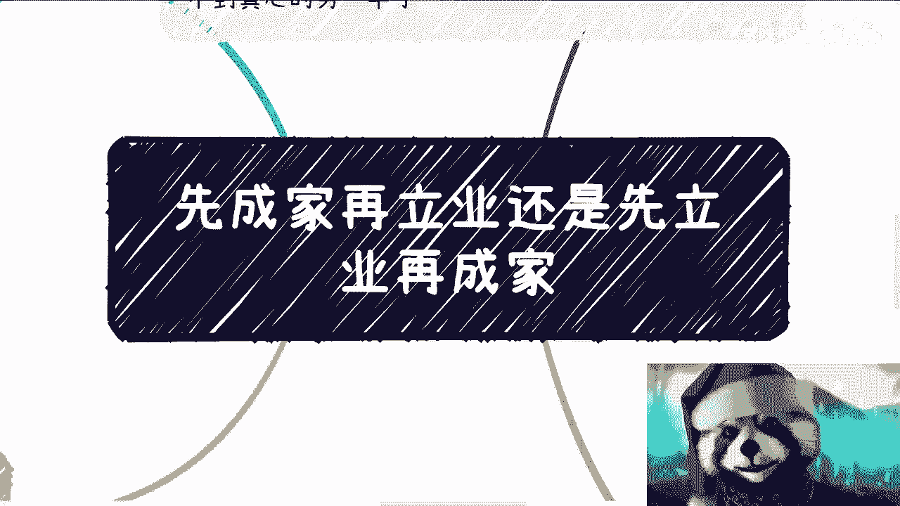

# 人生规划课 01：先成家还是先立业？🤔

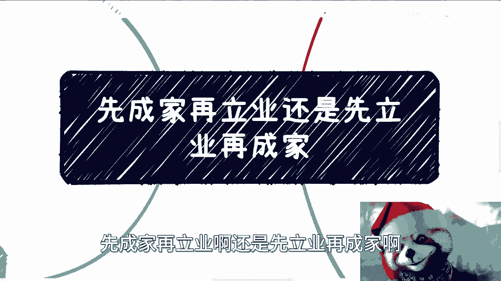

在本节课中，我们将探讨一个经典的人生选择难题：应该先成家再立业，还是先立业再成家？我们将分析两种选择的利弊，并探讨其背后的核心逻辑。

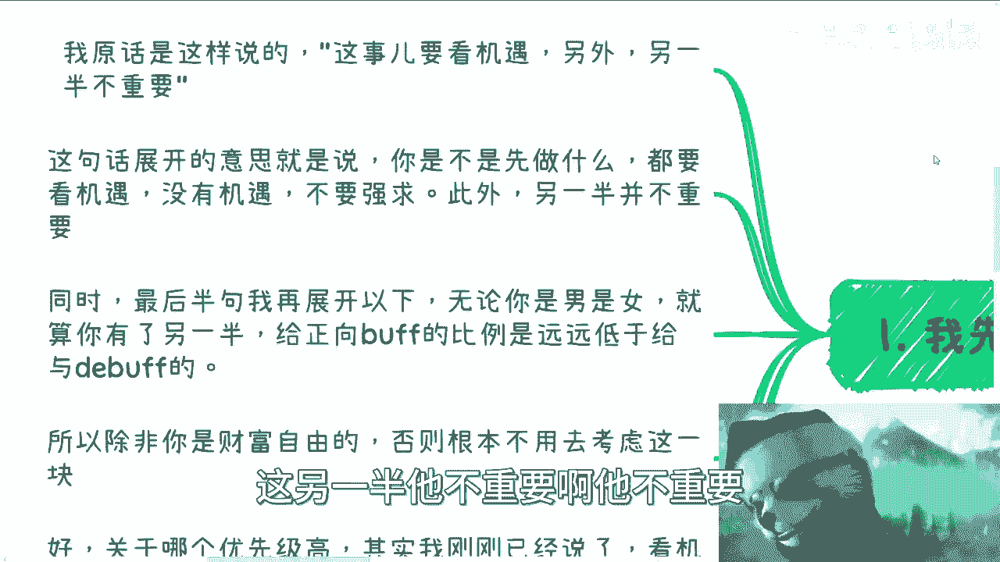

---

## 核心观点：看机缘，另一半不重要

首先，我的核心观点是：**这件事要看机缘**。同时，**另一半并不重要**。

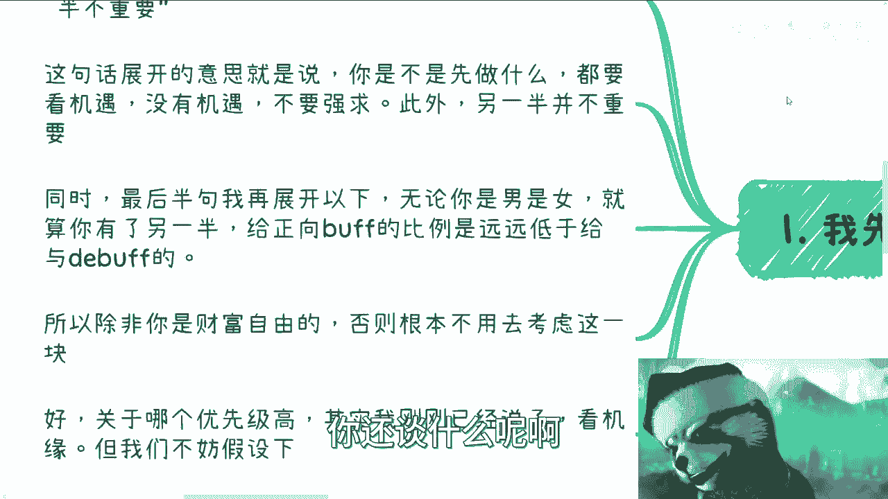

上一节我们提出了核心观点，本节中我们来详细展开。

### 关于“看机缘”

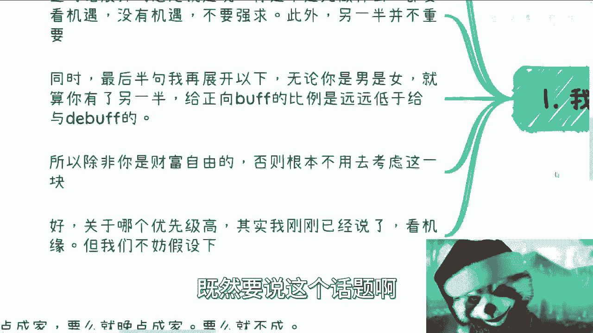

“看机缘”意味着不要强求。不要因为父母的催促、年龄的压力或世俗的规则而做出选择。如果你从一开始就被这些外部因素束缚，就已经失去了自我选择权。

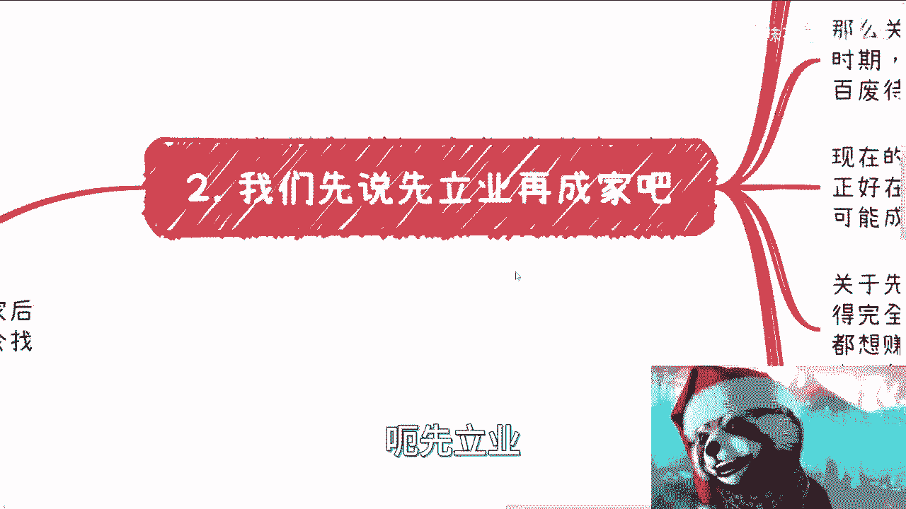

### 关于“另一半不重要”

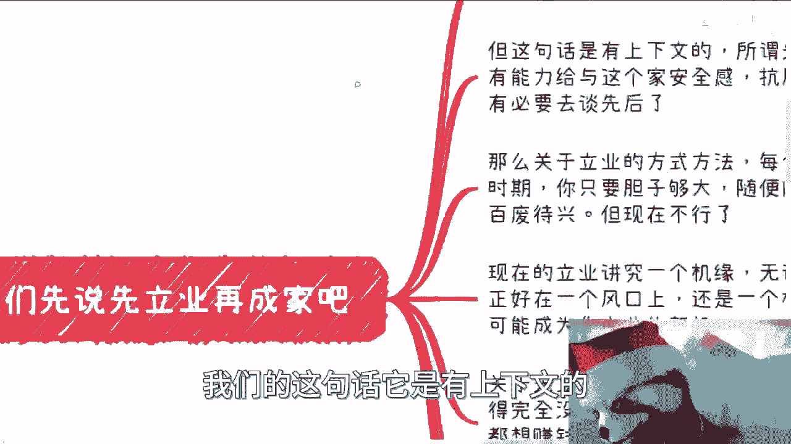

无论男女，拥有另一半后，对方给你带来**正向增益（Buff）**的可能性，远低于给你带来**负面减益（Debuff）**的可能性。除非你已经实现财富自由，否则不必过多考虑这一因素。

---

## 假设分析：先立业再成家

接下来，我们假设“先立业再成家”的情况，并分析其内涵。

### “立业”的定义与上下文

“立业”的定义很广，因人而异。但在这个上下文中，“先立业再成家”意味着：你需要有能力给予家庭安全感和抗风险能力。这无关性别，是建立家庭的基础前提。

### 立业的“机缘”

每个时代立业的方式不同。过去可能机会遍地，而现在更讲究“机缘”。这包括人脉、行业风口或偶然的机遇。立业成功需要天时、地利、人和。

### 立业后找不到“真心”的另一半？

以下是针对这个担忧的分析：
*   **“真心”是稀缺品**：无论在哪个阶层，“真心”都很少，这是社会和人性的现实。
*   **概率问题**：随着你财力和社会认知的提升，遇到合适伴侣的比例理论上会更高。
*   **不成家又如何**：没有人规定人生必须成家。这本身就是一个可选项，而非必选项。

---

## 假设分析：先成家再立业

现在，让我们看看“先成家再立业”的情况。上一节我们讨论了先立业，本节来看看如果顺序反过来会怎样。

### 关于“精力不足”的本质

担心成家后“精力不足”去闯荡，其本质与是否成家关系不大。更多是与你双方的家庭情况、是否有孩子以及有几个孩子有关。

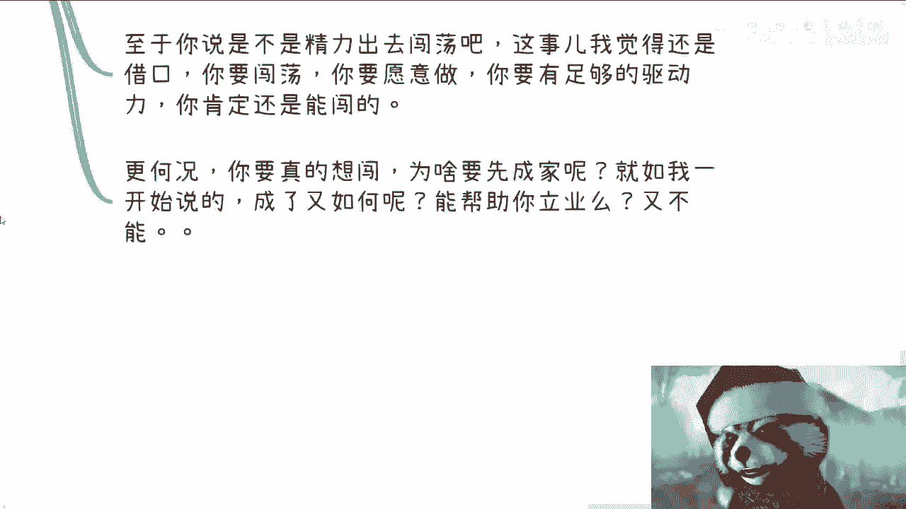

### 现实矛盾与磨合

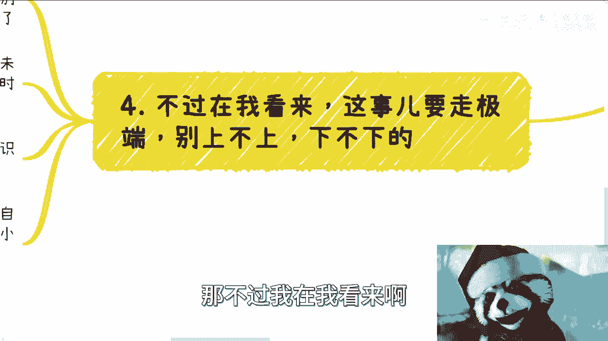

根据现实情况，先成家可能意味着更多的家庭矛盾与磨合时间（例如，双方心智成熟度可能不匹配）。这些琐事会消耗精力，使人感到疲惫。

### “想闯”与“已成家”的矛盾

如果你有强烈的闯荡意愿，为什么要先成家呢？如果是因为外界压力（如父母催婚）而结婚，那么你已经被外部规则“PUA”了。这就像想赚钱却不愿付出任何努力，是不现实的。

---

## 我的建议：走极端，别居中

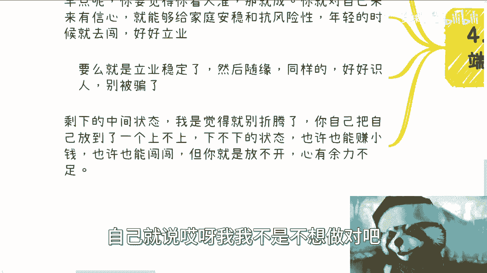

在我看来，处理这个问题最好走极端，不要处于不上不下的中间状态。

以下是三种清晰的路径选择：
*   **路径一：早点成家**：如果你看人准，且对自己未来能给家庭带来稳定有信心，那就趁年轻成家，然后携手奋斗。
*   **路径二：晚点成家**：先立业稳定，随缘遇到合适的人再成家。关键是要好好识人，保护好自己的财产。
*   **路径三：不成家**：这也是一种完全合理的选择。

所有中间状态（自己没想清楚、被动进入关系）大概率会让人陷入纠结和“心有余而力不足”的困境，并开始找各种借口自我安慰。

---

## 总结：你的选择，你负责

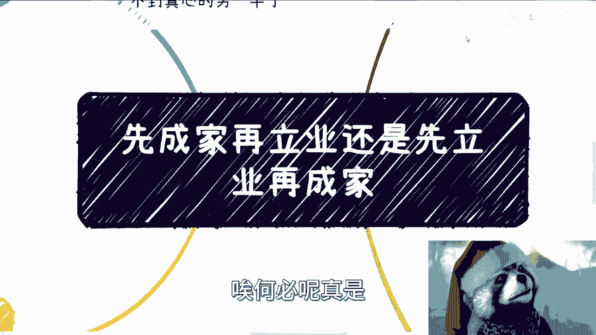

本节课中我们一起学习了关于“先成家还是先立业”的深度分析。

最终，所有结果都是你自己选择的结果。不要在未来抱怨“是父母逼的”或“别人都这样”。在成家这件事上，你永远有选择权。人生过成什么样子，责任在于自己。

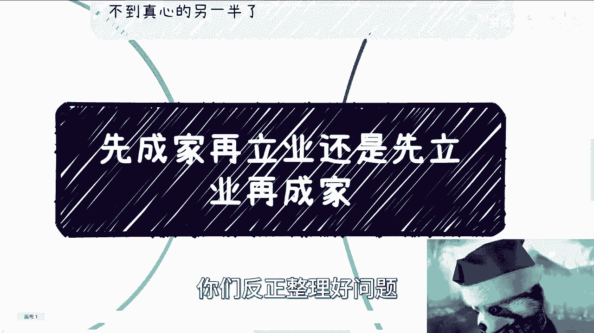

**核心公式：人生重大选择 = 自我清醒认知 + 抓住机缘 - 外界无效干扰**