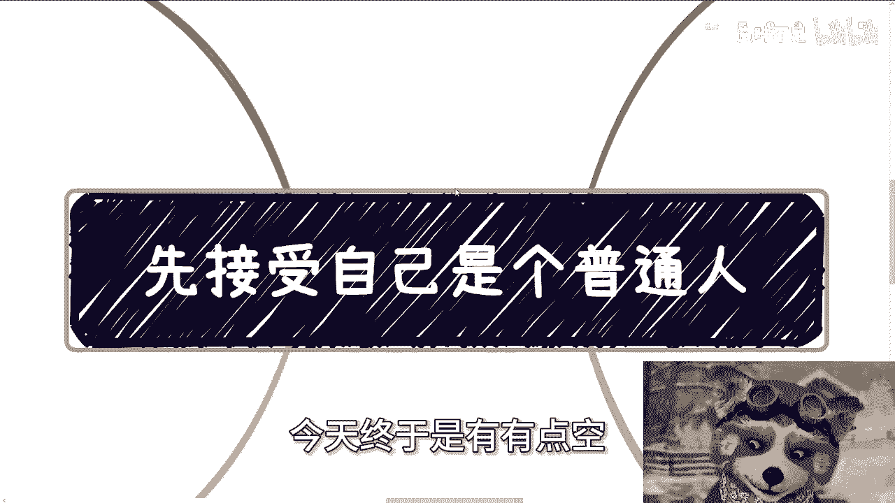
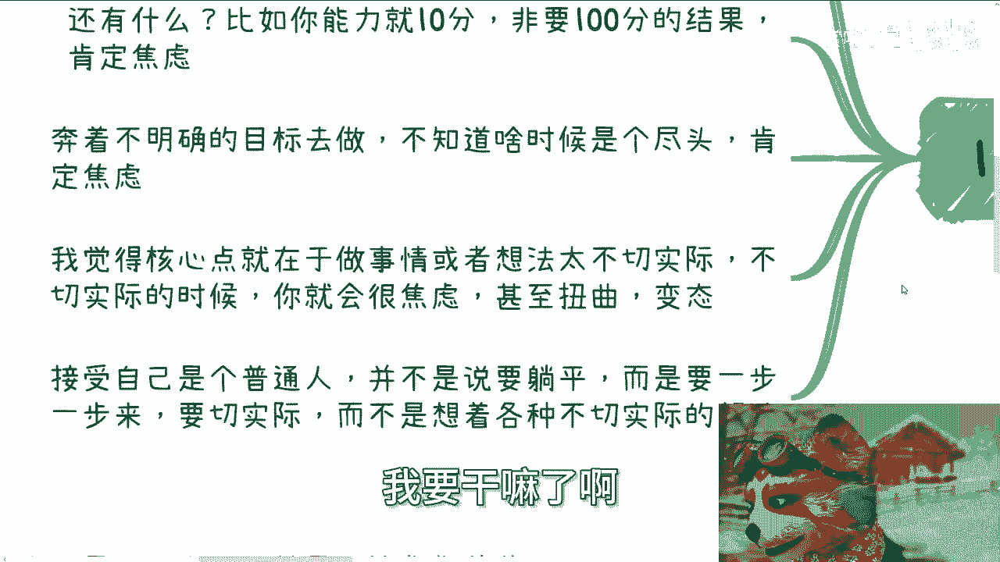
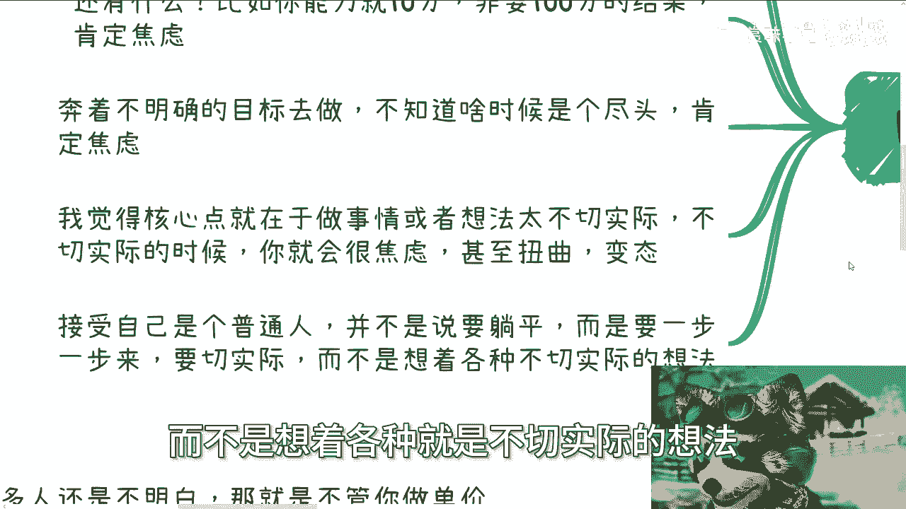
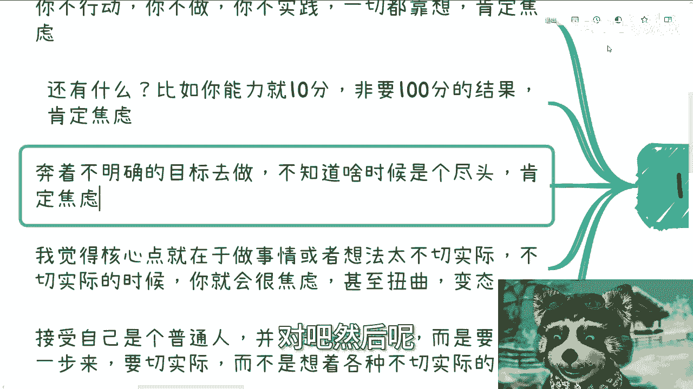
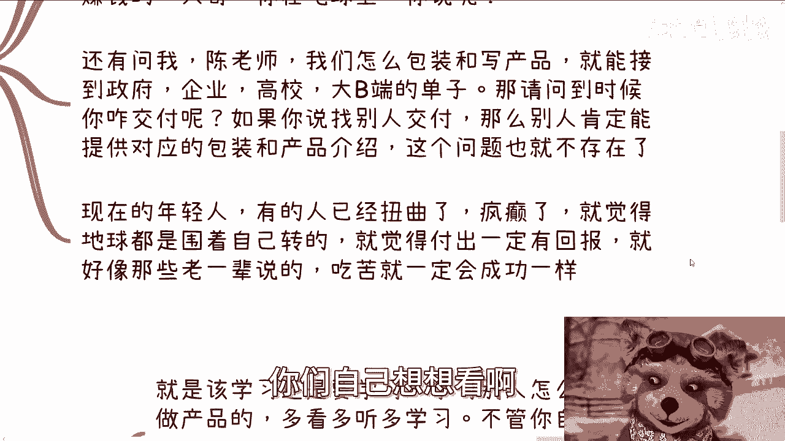
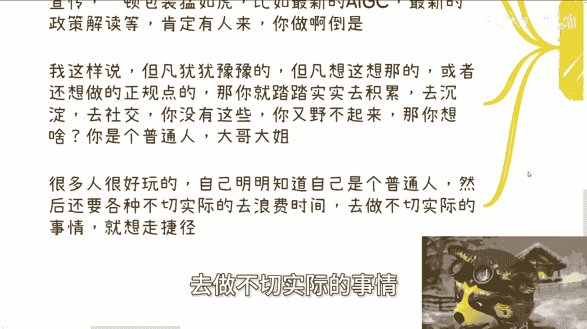
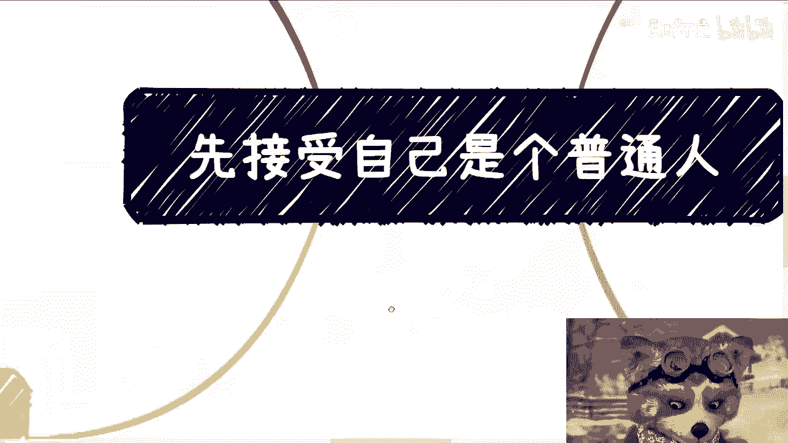
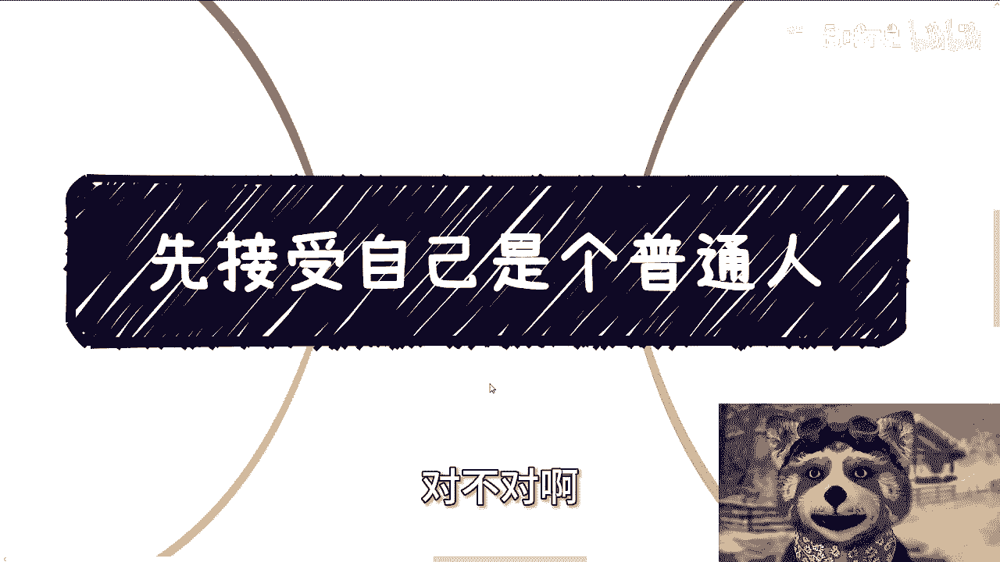

# 先接受自己是个普通人 - P1 - 赏味不足 - BV1sr421c7nD

好大家好啊，今天终于是有有点空。

就是早一点给大家来录了啊，哎呀今天我们要来讲的呢，就是也是最近可能沟通下来，我觉得讲了比较多次的一个东西，但是这个东西呢比较深层次，就是比如说你们看到啊，就要接受自己是个普通人，可能能明白。

但是它背后很多逻辑。

我觉得大家可能并不明白，所以我还是把它展开一下啊，首先第一个呢就是焦虑的源头对吧。

很简单，焦虑的源头是什么，就你不动，你不做对吧，你不干，你什么都不做，一切靠想，那你肯定焦虑，为什么，因为你不知道啊对吧。

你以为你的脑子很牛逼啊，你以为你的脑子能能能能能控制世界啊，但是并不能对吧，我还是那句话嗯，地球不是围着你转的对吧，那还有什么呢，比如说你能力就十分对吧啊，但是呢你非要要一个100分的结果。

那怎么办呢对吧，那你怎么会不焦虑呢，对不对啊，第三就是奔着不明确的目标去做，就是说你做的时候，你你自己目标其实不明确，那么对于你自己来讲，你觉得很多东西都是未知的啊，n NO在前方。

那你不知道什么时候是尽头，那你肯定焦虑对吧，所以我觉得核心点在于哪里呢，在于就是说你得干，或者呢就是说你的想法不太切实际，那么你不太切实际的时候呢，你就会很焦虑，而且你不太切实际的时候。

往往是因为你对实际并不了解，所以你不切实际，如果你对实际有一个客观的了解，那你其实能够切实际对吧，那么你很多人啊，我跟你讲，现在很多人有的焦虑啊，有的甚至扭曲变态对吧，动不动就跟我说啊，我要跳楼啦对吧。

我要干嘛啦啊哈也很搞笑啊。

然后接受自己是个普通人呢，并不是说要躺平啊，而是说要一步步来要切实际啊，而不是想着各种就是不切实际的想法。

那你但凡哎我们那个话又说回来啊，你比如说你说我就十分啊，我他妈就要100分对吧，然后你说嗯我就那个不知道明确的，然后呢我就要这个朝这个，因为你不知道明确的目标，你朝着这方向走。

其实无非就是钻牛角尖嘛对吧，然后呢你还有些人呢就是我就想。

那我就不干，我得想明白了再干好。

没问题，我跟你讲啊，以上刚刚我们说的那种就两个字，活该啊活该对吧啊，那么你比如说就比如说咨询到现在啊，有私信问我的，他说陈老师有没有什么方式啊，两年后稳定月入几万的，我唉我就觉得你妈的。

你就算抢银行也没这么稳定是吧啊，能首先卷第一个，还有呢咨询问我的，就有没有什么手把手的教的啊，有一定能赚到大钱的，我我都不知道怎么回哦，大哥你在地球上，你说呢你说呢对吧，你又不是你又不是在漫威宇宙对吧。

你在地球上，你说呢啊还有问我，他说陈老师我们怎么包装跟那个写产品介绍啊，就能够接到政府企业高校大B端的单子啊，那我就请问了，到时候你怎么交付呢对吧，如果你说你找别人交付，OK那没问题。

那么你如果有能力找别人交付的时候，你的产品介绍跟包装，其实你一定能够从别人这边借鉴过来对吧，那也就我这边说的，别人肯定能够提供对应的包装跟产品介绍，那这个问题就不存在了，你大概率问这个问题的时候。

你根本就没有人交付啊，当当然你也交付不了对吧，那现在年轻人啊。

我觉得有的人呢已经扭曲了疯癫啊，我们叫什么叫疯癫啊，就觉得地球都是围着自己转的啊，就觉得付出呢一定要有回报的，当然我不知道这是被谁洗的脑对吧，付出一定要有回报的，就好像那些老一辈说的啊。

吃苦就一定会成功，你们自己想想看啊。

真的脑子是个好东西对吧，你们想想看有没有这种可能性嘛。

是吧啊，然后第三啊，先接受自己是个普通人，什么意思呢，就是说你该学习还是要学习，学习别人怎么包装，怎么做产品，多听多看多学习，不管你自己做产品还是包装啊，还是说是借别人的产品来。

你最终讲故事给别人听的时候，你还是你来讲的呀对吧，你为了让自己的这故事听起来特别的自信，听起来特别的圆对吧，听起来这个饼特别的光滑对吧，那么你更要去了解了，你不可能空讲的呀对吧。

另外一方面是你该一步步积累关系，就是一步步积累，你不要想着一蹴而就，因为你本身这个社会上，如果从关系角度来讲，不存在一蹴而就的，对吧，如果你想着交点钱就能一蹴而就的，那我跟你讲，你只能被骗对吧。

你们之前再去看翻翻，我以前说的就是钱跟关系的这件事情，你花钱带的来关系吗，不会的，为什么，因为之所以叫关系，大家是要看价值的，你单纯给钱有用了，没有用的呀对吧，我以前就说过了，你你给一份钱。

我介绍给你一个人对吧，然后那个人觉得你是个，然后他就会连带着觉得我也是个对吧，那你说到底是这个关系重要，还是你这比钱重要呢对吧，我就觉得很多人就很奇怪啊，然后不要想着呢一下子赚什么大钱啊。

这就好像很多人很搞笑的，就跟我聊着聊着，无论做什么，他一谈到赚钱啊，他就会发现创始终究做不了，我说我我跟他后来聊着聊，聊了很多时间啊，就发现他说做不了的原因是什么呢，就他就好像觉得唉这个东西赚不了大钱。

我说大哥，你连第一步都没做过对吧，你你你第一步都没做，你非要做几万的生意，十几万的生意，几10万的生意，可能未来那不可能的呀，就是我们说的不切实际，你不切实际，你还聊什么呢，对吧啊，我跟你讲。

其实很多时候一开始啊能赚到钱就行，你不管多少能赚到钱，证明你这条路是通的，那么接下来就看这条路多长啊，以及或者说这条路上面有没有办法，能够有更高的效率去做，这个是我们后来去讨论的，你永远卡在0~1。

那就有啥好讨论的呢是吗，你有不少小伙伴想赚快钱啊，其实我跟你讲，想也不想，想也好，不想也好都可以，但从实际角度出发，快钱是要天时地利人和的，你比如说现在一些小伙伴想做一件事，但是明明没有天时地利人和。

什么意思呢，就是他既趋势层面也没有赶上啊，就趋势层面没有赶上风口，自己也没有积累，你就属于天时地利人和，一个都没有对吧，你也没有合作方，你就硬做，你怎么做对吧，你怎么做啊，那么最后一点就是我以前说的。

你要么演，要么就好好积累，你总会选一个。

为什么，因为你是普通人对吧，什么叫野，我觉得今天很多人都不明白，那就是不管你单价高，单价低，不管你赚钱还是不赚钱对吧，哦也不叫不赚钱嘛，就不管你赚多赚少，你先干，你最不行，最多就退款，你倒是干呐。

是不是对吧，什么叫野，就是实在不行，你就直接比如说类类似于比如说个人知识星球，加无数个群，然后自己做搬运工，然后定个年费，怎么了呢怎么了呢，有什么问题呢，然后你各种渠道去宣传啊，你各种各种包装猛如虎啊。

对吧，你比如说去年的AIGC，今年的各种什么数据的政策解读，肯定有人来呀，你倒是做啊对吧，你不要做之前就来问我说啊，这个怎么宣传这个东西，要是没有人来怎么办，的怎么了呢，啊奇了怪了。

没人来，你有损失吗啊，然后你又说哎有人加知识星球，我加了之后，他觉得我这东西没价值没价值嘛，就没价值，怎么了呢，谁跟你讲知识星球一定有价值呢，哎奇了怪了，对不啦，不就这么回事吗，哎我就这样说。

你但凡犹犹豫豫，但凡想这想那的，你或者还想就是，或者你可能还想按照正规的路子去走的，那么你就踏踏实实去积累，去沉淀，去社交，你没有以上这些东西，比如说你也演得起来，那你就去演，你如果野不起来。

你又没有以上这些积累，那你想啥呢，对不对，你想啥呢，啊很多人很好玩，就是自己明明知道自己是个普通人，然后还要用各种不切实际的想法去浪费时间，去做不切实际的事情。

然后去想走捷径，然后不停的标榜我是个普通人。

啊对不对是吗，你们想想看，你们做任何事情不都一个道理吗，你不管怎么去做任何的生意，我不管你们是做亚马逊独立站做什么东西，你可能就是说是属于你一个人，今天什么都没有经验，你你哪怕自己有笔钱或者借了一笔钱。

你说我白手起家能做了，可能问了不可能的呀，你总归要去了解的呀，对不对，那你不要问我为什么要去了解，因为你是个普通人呀，除非你跟我说，你跟毛利兰毛利毛利兰一样，头上长角的，有不啦没有呀，就很离谱对吧。

你你们想想看我我在活动上面，为什么我在活动的那个介绍里面，我还特地加上，就说不要过来嗯，就是说认为过来之后就能赚到钱，为什么，因为就真的有人会认为他交了300块钱，到活动上面能够学到赚钱的逻辑，哎大哥。

你要是300块钱能活到赚，能赚能学到赚钱的逻辑，那中国的所有的9年制义务教育加高等教育，就全部倒闭了，还上什么学，读什么东西了，不要读了呀，对不啦，你动点脑子啊，对吗，就是我真的说句不好听的。

我我知道这么多年都是倒退的对吧，但是我没想到会倒退成这个样子，好吧行吧啊，就这么着吧好吧，然后那个职业规划啊，商业规划，然后呃那个分红分红额分润，包括合同啊，包括商业计划书啊，包括白皮书。

包括你们手上有什么牌，你们没有什么牌啊，你们希望通过跟我的沟通，能够理清楚一些思路的，或者希望通过我的视角，能给你们一些更多的建议的，那么你们这有好问题，我们再来做咨询啊，我现在我要每次都强调一遍啊。

我只说我知道的，我只说社会上事实，你们接不接受跟我没有关系啊，不要来跟我讲说啊，因为你们咨询了，所以我要对你们负责，我不会对你们负责的，不好意思，你们爸妈都没对你们负责，为什么我来负责，对不对啊。

好吧啊。