# 课程 P1：先接受自己是个普通人 🧠

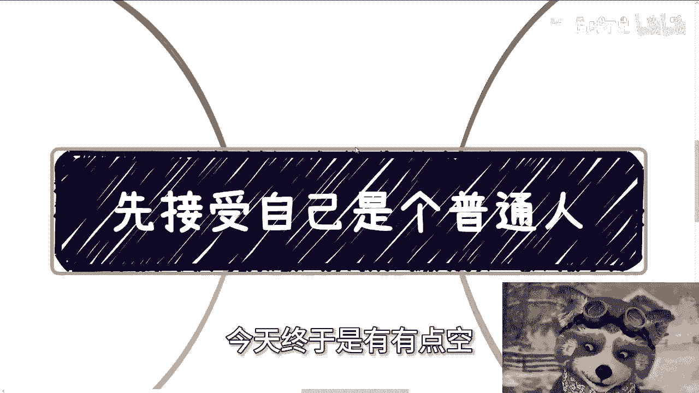

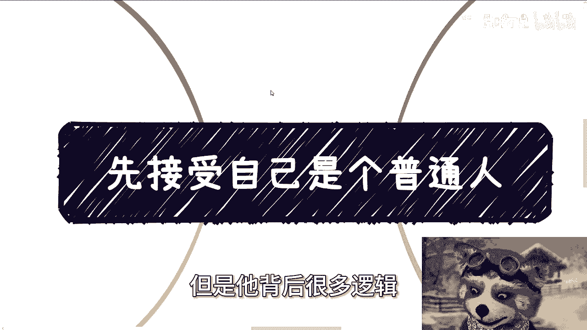

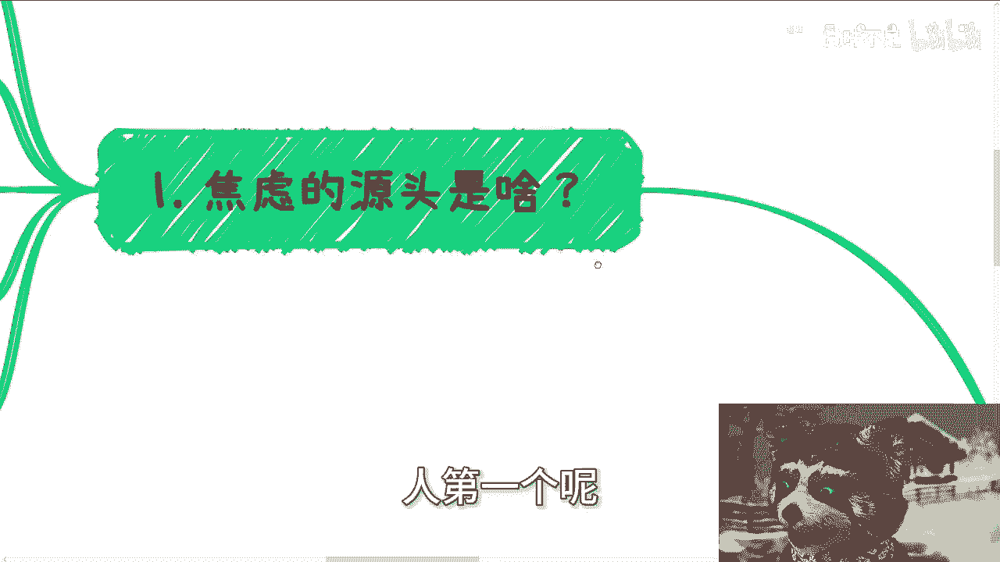

在本节课中，我们将要学习“接受自己是个普通人”这一概念背后的深层逻辑。我们将分析焦虑的根源，探讨不切实际想法的危害，并学习如何通过实际行动和客观认知来缓解焦虑，实现稳步成长。

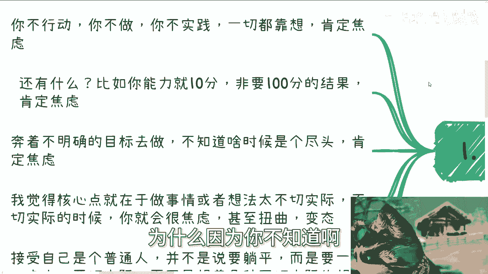

---

## 焦虑的源头

上一节我们介绍了课程主题，本节中我们来看看焦虑的源头。焦虑主要源于不行动、不切实际的期望以及目标不明确。

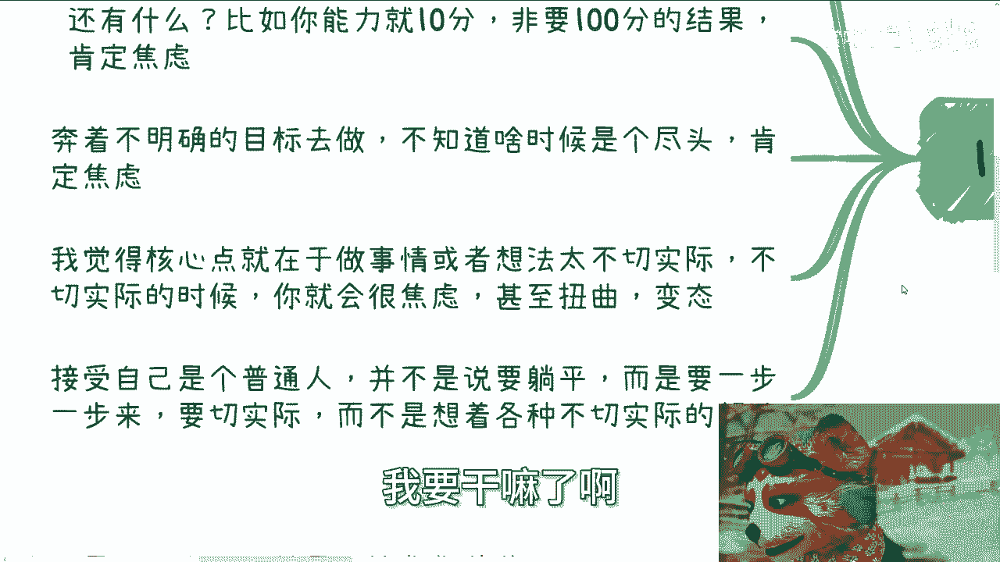

以下是焦虑的三个主要来源：

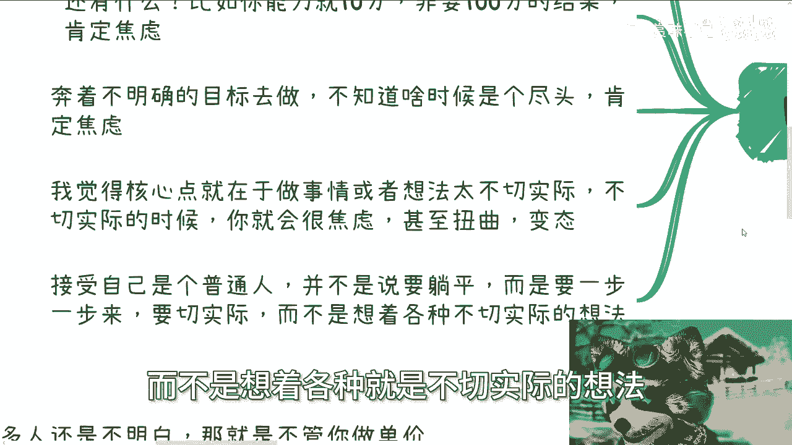

1.  **不行动，只空想**。你不动，不做，不干，只靠想象。这会导致焦虑，因为你无法仅凭思考掌控未知。
2.  **能力与期望不匹配**。你的能力只有 `10分`，却非要追求 `100分` 的结果。这种落差必然导致焦虑。
3.  **目标不明确**。朝着模糊的方向努力，前方充满未知（`NO`），不知道尽头在哪里，因此感到焦虑。

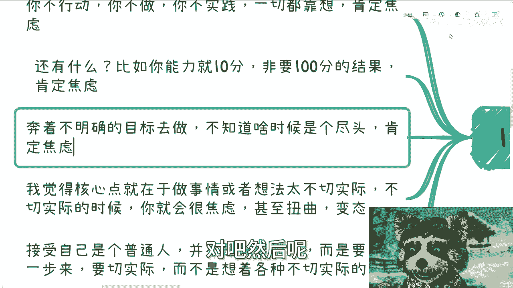

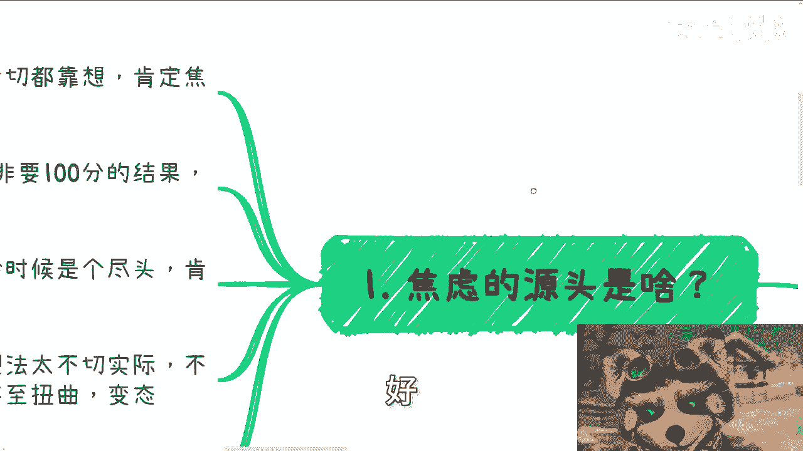

核心在于，你必须行动，或者你的想法必须切合实际。对现实缺乏客观了解，就会产生不切实际的想法，从而引发焦虑。

---

## “接受普通”的真实含义

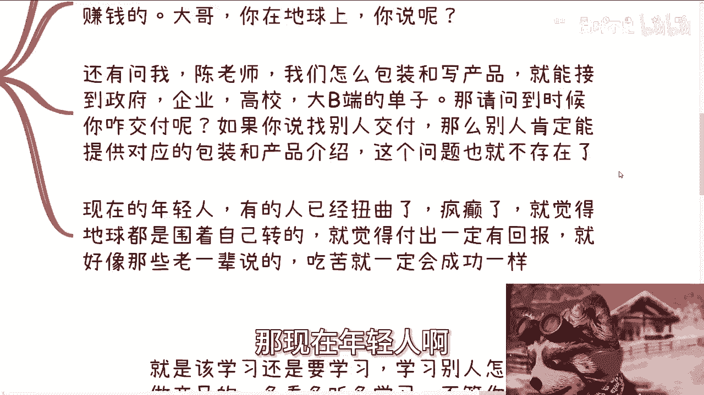

理解了焦虑的来源后，我们来看看“接受自己是个普通人”的真实含义。这并非鼓励躺平，而是倡导脚踏实地，一步步来，放弃各种不切实际的幻想。

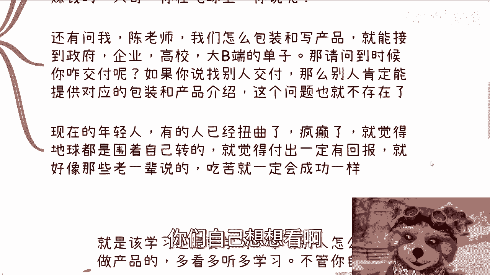

以下是几种典型的不切实际想法及其问题：

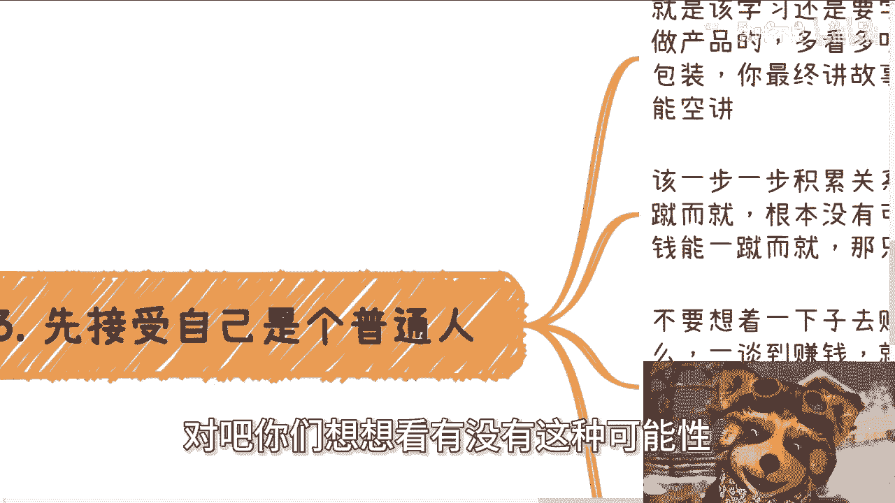

*   **能力十分，追求百分**：自身能力有限，却设定过高的目标。
*   **目标模糊，钻牛角尖**：在没有明确目标的情况下盲目努力，容易陷入死胡同。
*   **只想不做，追求完美**：总想“完全想明白”再行动，导致永远无法开始。

抱有以上想法，结果往往只有两个字：**活该**。以下是几个咨询中遇到的实例：

*   **追求不存在的“稳定”**：“有没有什么方式，能让我两年后稳定月入几万？”这种稳定性在现实中几乎不存在。
*   **寻求“包赚”的捷径**：“有没有手把手教，一定能赚到大钱的方法？”这种想法脱离了地球的基本现实。
*   **忽视核心交付能力**：“如何包装产品介绍才能接到大单？”但如果自身没有交付能力，包装得再好也无济于事。

许多人的焦虑和扭曲源于一个错误观念：**认为地球围绕自己转，认为付出就一定会有回报**。这与“吃苦就一定会成功”一样，都是需要警惕的思维陷阱。

---

## 普通人该怎么做

明确了问题所在，本节我们探讨作为普通人应该采取的具体行动。核心是学习、积累、从小处着手。

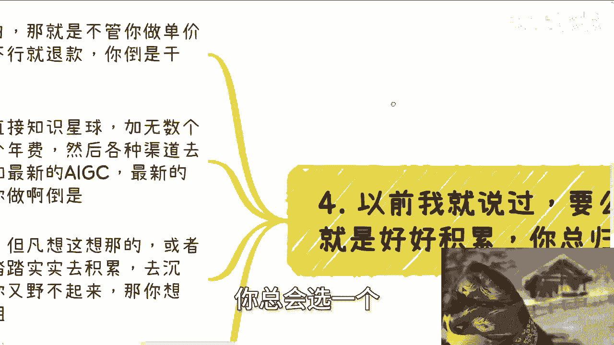

以下是普通人应采取的行动步骤：

1.  **持续学习**。学习他人如何包装产品、讲述故事。无论产品是自己的还是借用的，最终都需要由你来自信、圆满地呈现。公式可以表示为：`有效输出 = 持续输入 (学习) + 实践`。
2.  **逐步积累关系**。社会关系的建立无法一蹴而就。不要幻想花钱就能买到真正有价值的关系，因为关系的基础是价值互换，而非单纯金钱交易。
3.  **从小处着手，验证路径**。不要一开始就幻想赚大钱。最重要的是跨出第一步，先赚到钱（无论多少），证明路径可行。之后才是考虑如何拓宽、延长或提升这条路径的效率。逻辑是：`行动 -> 验证 (赚到钱) -> 优化 -> 放大`。
4.  **认清现实，选择策略**。赚快钱需要天时、地利、人和。若三者都不具备，就应放弃幻想。对于普通人，只有两条路：
    *   **“野”一点**：即果断行动，即使方法粗糙、单价不高。例如，创建知识星球，广泛宣传，先做起来。没人来？没损失。被退款？很正常。核心是克服犹豫，先完成“0到1”的突破。
    *   **踏实积累**：如果“野”不起来，就老老实实去学习、沉淀、社交，积累真正的能力和资源。

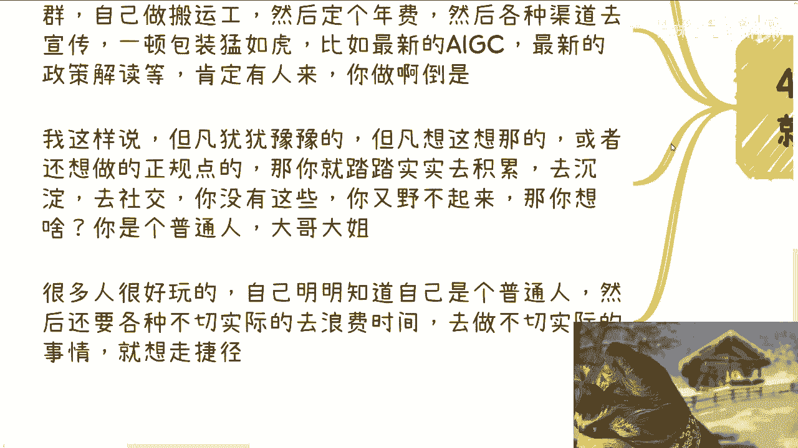

很多人矛盾在于，明知自己是普通人，却总用不切实际的想法浪费时间、寻找捷径，同时不断标榜“我是个普通人”。这无异于自我欺骗。

无论是做亚马逊、独立站还是任何生意，白手起家都需要先去了解、学习。因为你是个普通人，没有超能力。正如课程中强调的，不要幻想支付少量费用（如300元）就能学到“赚钱的逻辑”，那是不现实的。

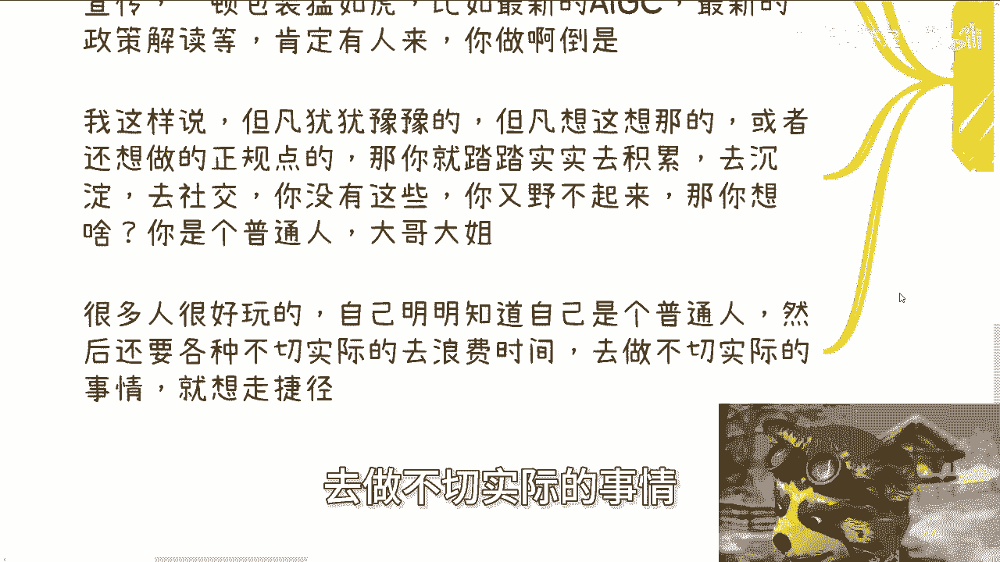

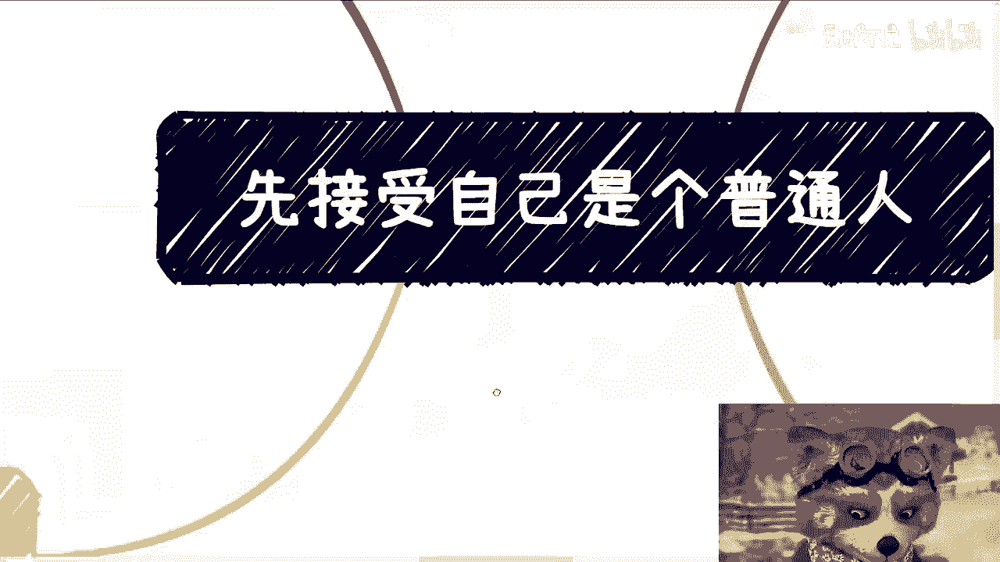

---

## 课程总结与咨询说明

本节课中我们一起学习了“接受自己是个普通人”的深刻内涵。我们分析了焦虑源于空想、期望过高和目标模糊；明白了“接受普通”是倡导务实，而非躺平；最后学习了通过持续学习、逐步积累、从小处着手以及根据自身情况选择“野”或“稳”的策略来稳步前进。

记住，作为普通人，合理的期望和持续的行动是应对焦虑、走向成长的关键。

---

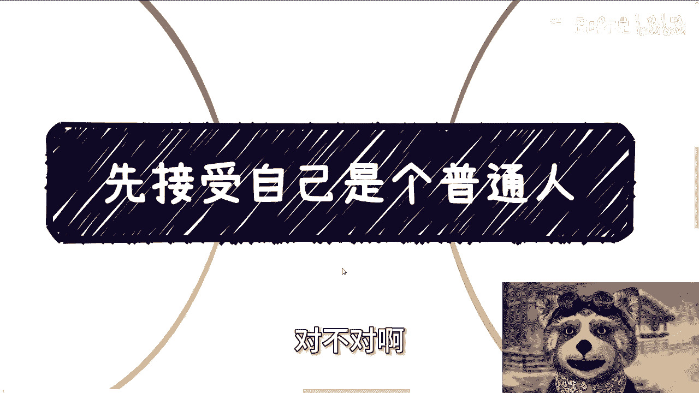

**关于咨询的说明**：
我提供职业规划、商业规划、合同与计划书梳理等咨询服务。咨询基于我已知的社会事实和个人视角提供建议。请注意：**我只陈述我所知道的客观事实，不承诺对任何结果负责，也没有义务负责**。请带着具体问题和思考前来咨询。