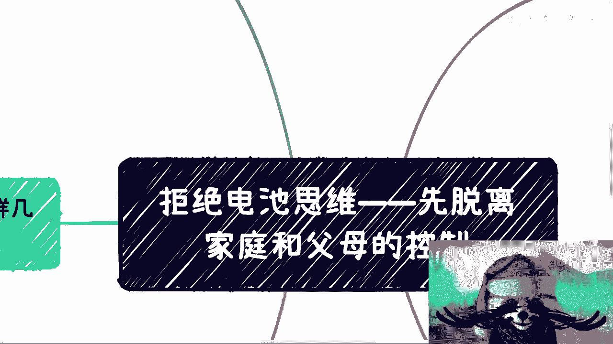
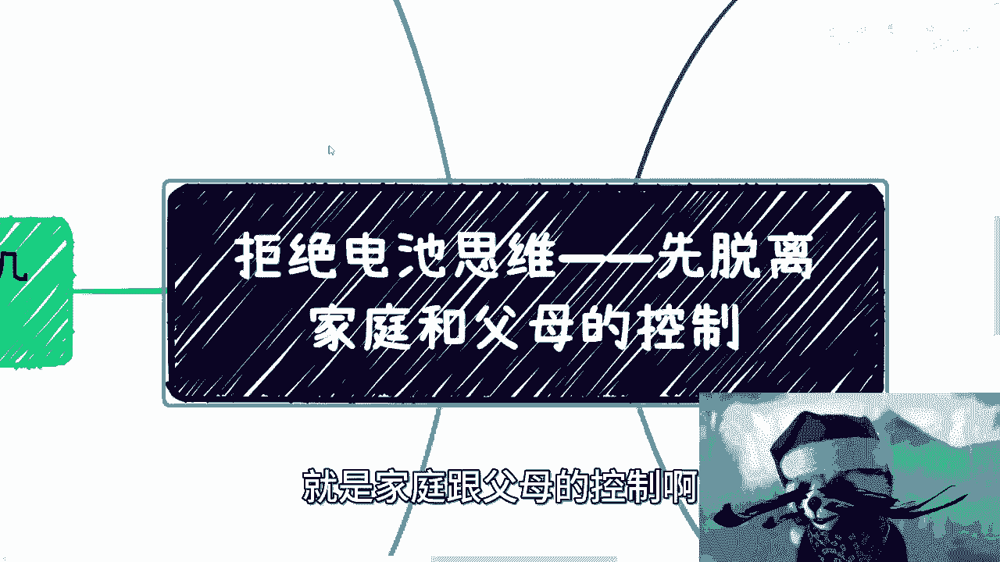
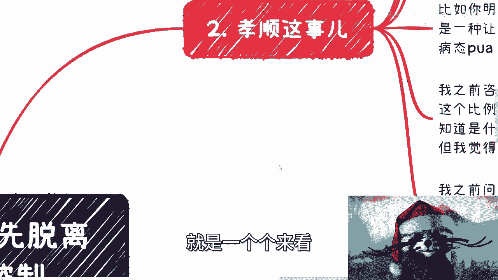
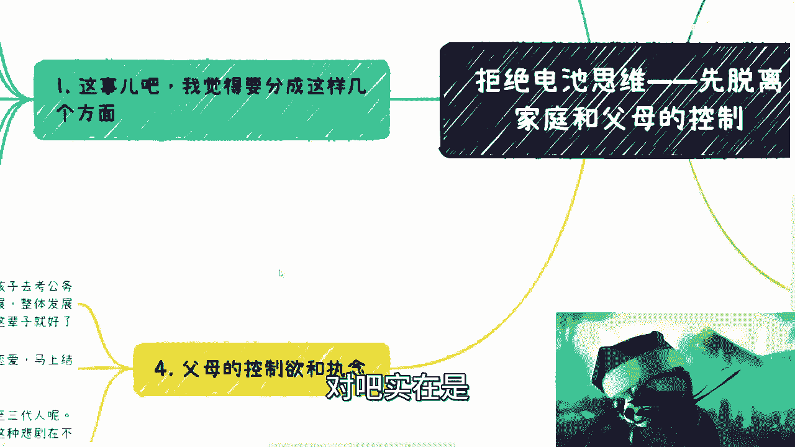
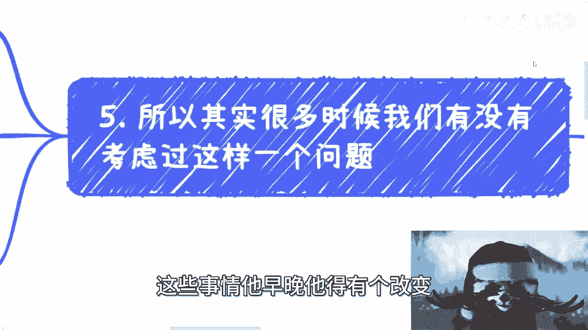
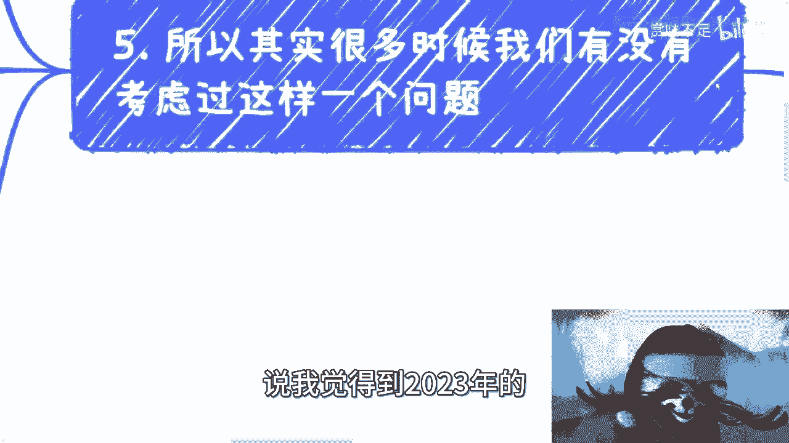

# 先摆脱家庭和父母的控制与pua - P1 - 赏味不足 - BV1kh4y1177A

哈喽大家好啊，那么这一期呢主要是最近对吧。

留下来哎呀，我发现这样的人比例还是蛮高的，反正聊一下我看法吧，好吧呃，我觉得这一期呢也是放在拒绝电池思维里面，本质上是什么呢，是除了工作对吧，除了商业以外，其实本身还有一个就是家庭跟父母的控制啊。

那么这个事儿呢我觉得要分成这么几个方面啊，第一个呢就是很多人认为的孝顺，可我认为的的确不一样，因为这个孝顺这件事情呢，你说对不对，你要站在道德高地对吧，你你我觉得如果放到网上，你站在道德高地。

你随便怎么批判我，我随便怎么讲，我肯定都讲不过你，你知道吗，但是呢本质上是什么呢，就是孝顺这个事情呢，在我看来啊，现在就是很多人说啊，可能因为我孝顺对吧，可能因为我怎么样，但是在我听来。

这种孝顺更像是一种被绑架的理由，当然我并不是说是被他们被父母绑架，有可能他们自己要绑架自己，你知道吗，这第一个第二个呢就是家庭的攀比啊，亲戚的攀比就最后变成了一种束缚，或者变成了一种执念啊。

第三呢就是说我发现就很多人这个心结啊，是从小造成的，这个造成的呢，也不是别的原因对吧，就可能比如说家庭啊，感情啊，家庭的婚姻啊对吧，包括家里面的人和亲戚啊，反正就是就怎么讲呢，做说的高情商一点吧。

就是说啊可能这个家庭啊这个有一些小缺憾啊，导致了这个孩子的成长，可能过程当中有一些这个问题啊，那你要说你要用我话来讲吧，我就觉得这什么呢，这就是父母啊，还有这些亲戚他妈的心理没有逼数啊。

就是自己还没这个这个叫什么，就是学会做个人啊，那么就生孩子啊，那么导致现在很多年轻人，这个的确也有很多的问题啊，那么还有呢就是说这个父母的控制欲啊，控制欲比较强啊，无论是工作还是恋爱。

那么还有一方面呢就是其实就以上这些吧，其实本质上是一种执念啊，我觉得从我的角度来讲呢，也是上一代的这个电池思维出现的。

出现了这么一个遗传啊，这个事情呢是这样子的，就是一个个来看。

首先先说孝顺这个事儿啊，孝顺这个事呢，我发现呢沟通下来的确就是，大家对孝顺这个事的理解来千奇百怪啊，不过本质上你说嗯，这件事情也没有一个定论对吧，所以这个不是我要在这里讨论的问题啊，那么呃打比方说啊。

你说你明明就现在可能不想谈恋爱对吧，你非要去谈啊，然后呢就跟我说啊，这个我想给父母一个交代对吧，也不想他们这么担心啊，那么我觉得这个就是病态的PUA，那么比如说呢，你明明不想做某个领域的工作对吧。

或者你就不想做公务员对吧，或者你就不想什么去考编制或者怎么样子，但你觉得没办法啊，你觉得这是一种孝顺对吧，那么我觉得这也是一种病态的PUA对吧，再比如说呢你明明不想考研对吧，考了呢也不知道干什么对吧。

那么却觉得呢是就是这这些事儿啊，可以让比如说父母呃比较开心啊，比较满意对吧，家庭争光对吧，那么本质上这也是一种病态的PUA啊，因为你们会发现一个什么问题呢，就是说我们做任何事情。

你要为了某一个节点去争光，去争口气对吧，去达到某一个目标，其实这也没什么问题，但是问题在于哪里呢，就是就像老乔以前乔布斯对吧，老乔在MIT的那个毕业典礼上说的很清楚，就是就是我们去考虑这个做事情的时候。

我们要去想的是怎么把点连成线对吧，而现在很多人呢做事情呢他是这样子的，就是他为了满足某一些的目标，而这些目标甚至不是自己的，那么他去做，但是做了之后呢，你会发现在未来的过程当中，它根本就连不成线。

而且这些东西你说无论是金钱还是精力，已经投入了很多，但最终产出是微乎其微的哦，就是说白了就是说自己在人生过程当中，面临的问题还是这些问题，就你说之前的那些付出那些努力，那些东西能不能解决这些问题呢。

解决不了好，那么我之前咨询的时候呢，碰到这种想法的其实很多很多，然后按照这个比例呢，我感觉其实整体基本盘比例应该也不会低啊，虽然我不知道是什么，养成了现在的年轻人的这种自我PUA的情绪啊。

但是我觉得我是没法理解的啊，就是我之前跟他们聊的时候呢，我原话是这么讲的，我说呃恕我冒昧啊，我说我就问你们一个问题，我说你们现在一切都是为了父母活着啊，这个找工作啊，谈恋爱啊，怎么样啊，那么我说又。

你们又觉得这一切都是叫做孝顺对吧，那么我想问，如果等你们父母百年之后，你们为谁活着对吧，那谁来为你们曾经做出过的这些选择买单，谁来为你们的人生买单，又谁来为你们自己选择的东西而后悔谁呢对吧。

就其实本质上，我觉得你从我站在一个上帝视角来讲，我觉得买单的无非就是要么是自己，要么就是你们的孩子对吧，但是你会发现这是什么，这个就是一个悲剧的一个延续对吧，这是孝顺吗，其实这个叫叫这个就是道德绑架啊。

然后我觉得这个是啊，第二第二个吧，第三个就是家庭的攀比，那我觉得每个人的情况不一样嘛，对吧，就是家家有本难念的经呃，不太一样，那有的攀比呢就是纯物质攀比对吧，这个物理攀比也差不多了，有物质攀比对吧。

就比如说父母和亲戚之间对吧，攀比孩子学历啊对吧，大家挣钱多挣少啊对吧，每次什么回去吃饭啊对吧，聚会啊对吧，然后看看你带的什么表啊对吧，你带的什么首饰啊对吧，你穿戴什么样子啊，对不对，但是本质上没有好。

毫无意义啊，真的毫无意义啊，那有的攀比呢，是家里父母和别人父母的攀比对吧，或者来说是跟朋友圈的攀比，我觉得吧就是你跟别的家长攀比吧，也就算了，虽然本身也没什么卵用对吧，但是呢你说很多家长啊。

现在这个微信对吧，有了网络之后，它就跟空气斗智斗勇，什么意思呢，就是因为网络这个东西本来就是虚幻的，他可能因为一个就是很多父母啊，他可能因为一个就是莫名其妙的东西对吧，就真实存在不存在都不知道的。

然后就在那边攀比，那这个就是纯对着空气斗智斗勇对吧，那么还有呢就是说父母的这个攀比呢，其实从小到大，一直以来他不是说比如说大家考研了对吧，大家这个读书了才那个，他其实一直以来会给孩子带来更大的困扰。

甚至是甚至是心理的负担，甚至是心理的疾病对吧，但我跟你们讲这个事情也没办法，就是你比如说啊，我觉得现在的这些年轻人作为当事人对吧，你要么就是说自己能明白这件事情，因为你们还有概率能明白。

你指望父母明白这件事情几乎是不可能的，你知道吗，因为上一代的思想就这个样子来改变不了的，这没有办法，你别你你你们很多人觉得哎，某些父母蛮开明的对吧，怎么样子啊，这些是非常少数少数的。

你们真的到下沉市场去看看，这不不不可能的，一点概率都没有的啊，所以说呢在前几天咨询的时候呢，就是提到跟父母沟通啊，我一般是这么说的，我说你要真的自己想做点什么，你该瞒着就瞒着对吧。

或者说你就说他们喜欢听的就行了，没必要去跟他们讲啊，你说哎我自己可能现在尝试做个活动对吧，我可能现在尝试要去找份新的工作对吧，或者我要尝试干嘛干嘛，因为本质上是没有意义的，因为你要么就能说通啊。

但是概率是不大的，但凡说不通，你只会增加矛盾，你指望什么呢对吧，你能指望什么呢，因为你从我角度来讲，我的想法很简单，就是你们跟父母对吧，大家你们碰到的问题，父母解决不了父母的那些思想，你们也改变不了。

那大家既然是这个相互涉干涉不了的，相互也帮不了的，那有什么好聊的，没什么好聊的呀，对不对，就是我觉得聊没问题，就是聊了你不要去干涉它，不就结束了哦，难道说聊了必须干涉，然后呢你必须满足父母，这才叫孝顺。

那我可能觉得啊这种孝顺对吧。

实在是。

过于道德绑架啊，那么还有一点呢，就是关于这个父母的控制欲对吧，这件事情呢我跟你讲这种事情就太多了对吧，你比如说有些父母必须孩子去考公务员，必须铁饭碗啊，就是他们不管，就他也不会来问你啊。

比如说你喜欢什么对吧，现在行业怎么样子啊对吧，未来怎么发展啊对吧，就好像就是说好，就很多人啊，很多父母很多的培训机构，他就好像在传达一种价值观，就是说你只要当下做了这件事情，你人生就完美了哦。

你今天哪怕是不管你20多岁，30多岁，40多岁，你只要做到这一点了啊，你的人生就结束了啊，你后面就不用考虑了对吧，就好像就是过了这个节点后面就不活了一样啊，那么他们不管现在行业整体发展。

反正你啊公务员稳定好了，这辈子over对吧，那这个是一个，那再再比如呢这个父母感情不好对吧，非要孩子马上谈恋爱啊，马上结婚啊，你反正就是谈了就好了，结了就好了啊，喜不喜欢不重要啊，这辈子就好了。

这辈子就过去了，对吧啊，那么本质上呢我以前提过这个问题对吧，就是一代人的悲剧呢，你为什么要带给两代人对吧，甚至再让下一代再带给下一代对吧，这个我是无法理解的，但咨询到现在呢。

的确这种悲剧在我看来就是在不停的发生，而且最悲哀的是什么，就是父母自己是不自知的，而且他沟通不了，非常的固执啊，被PUA的孩子也不自知，就是你要说有自知的嘛，有的很少很少啊，然后呢回头对吧。

过了一段时间，这样不不不自知不成熟的孩子当了父母之后，然后继续PUA自己的孩子，就这样子的呀，就是一代一代下来的呀，对不对，那么我觉得啊，就是我们可能得要考虑一个非常深刻的问题啊，就是所以啊。

其实很多时候，我觉得我们有没有考虑过这样一个问题啊。

就是很多人觉得自己的人生不顺啊，然后觉得找不到方向，觉得我们做的貌似也不是自己喜欢的，觉得自己做的不如别人好，觉得好像自己找不到一个，就是自己找不到一个兴趣爱好点啊，就是就是简单来讲。

就是说哎感觉我是不是天赋技能没点好对吧，感觉是不是说啊，这个后天的这个努力也方向不太好对吧，就感觉就是那种就是说做了十就是啊，就好像一个人对吧，你有十个属性，就感觉我好像为什么。

我好像这个十个属性就没有别人来的好对吧，你我，所以我就说大家有没有考虑过这样一个问题，并不是因为我们做的不如别人好，也并不是因为我们你能力不够，不如别人强，也不是因为我们没有天赋技能，而是因为从小开始。

其实就没有赢，没有人去引导我们思考，我们喜欢什么，我们自己也没有去发现我们自己喜欢什么，我们自己也没有去发现我们擅长什么对吧，也就是说有没有可能并不是我们不行，我们不够聪明，而是我们从人生的一开始。

每个时间点，每一个阶段都在被迫使，就都在被推着走，都在被PUA，都在被别人为了别人做选择，都在做事情啊，都在从就，从而最终变成了一个就是现在，虽然啊也许大家也能赚钱，也许也能过生活，也许也能温饱对吧。

也许也能结婚生孩子对吧，但是你过得不开心，或者说你觉得为什么，好像就是做了我不擅长的事情，我做得不好对吧，所以说有没有可能，不是因为我们做的不是不好啊，我们但凡换个方向。

说不定我们就做的很好对吧，所以说就是很多时候啊就是嗯，影响的因素很多，这个东西你说我们有没有责任有对吧，你说老师有没有责任，有教育本身有没有责任有对吧，父母家庭有没有责任有对吧都有。

但是本质上我是觉得这些事情。

他早晚他得有个改变对吧，也就是说比如说我觉得到2023年的。

现在的这么一个年轻人对吧，你但凡20多岁了，成年了，你就应该有一个自制力了，你就应该对自己有个评估，对过去有些评估去思考整个的一个过程当中，问题出在什么地方，而不是进一步的去PUA自己说啊。

因为家里要攀比，因为家里以前学历都很低，所以我要一个高学历的，因为家里没有人出国，所以我要出国，就就就这些因果关系非常的神奇，你知道吗对吧，那其实你就会发现你就会发现随着时间的推移。

那你以后得不到的东西，你就非要你孩子得到，那没有意义呀，对不啦对吧，所以说就是所有的行为，所有的选择我们是要结合大局的，包括全球的经济啊，全各个国家的国情啊对吧，中国目前的发展啊。

你得实事求是去做选择对吧，包括我觉得父母去要求孩子也是一样，当然就像我们刚刚说的，父母这一代的人现在的思想是很难改变的，那我们只能改变我们自己对吧，唉所以说呢就是我其实是比较惊讶于啊。

就是沟通这个下来之后就会发现啊，这个这个很多人给我的理由叫做我，我想孝顺他们啊，我想怎么样子对吧，就是说他的理由是啊，你不能说他孝顺不对啊，但是这个行为跟孝顺其实搭不上边对吧。

所以我每次都会怎么回复他们呢，我每次都会这么说，我说该给钱给钱啊，该如果生病了，该陪着陪着对吧，有时间就陪着对吧，没有时间抽时间陪着对吧，然后老了该照顾照顾对吧，就是我说这个叫孝顺，这个也是你应该做的。

每一个人应该做的，但是是不是说你每件事情，每一个节点都要被控制住，都要因为这个事情去孝顺呢，那那我就对吧，嗯行好吧，那就这么着吧，这个其实我觉得这个问题蛮大的啊，这个问题蛮大的，反正能改变就改变。

不能改变我也没办法对吧，我我我也不是什么慈善家，我也不是什么圣人，我也不希望这个，我也不指望说所有人能改变对吧，这就好像，行吧就这么着吧，嗯嗯有什么对吧，就是职业发展啊，或者说其他的相关的。

不管什么问题吧，反正就是有细节的啊，有这种比如说跟自己背景啊，跟自己的这个这个这个这个所学啊对吧，各个方面都有关系的啊，想有一些想法的啊。

