# 先摆脱家庭和父母的控制与pua---P1---赏味不足---BV1kh4y1177A

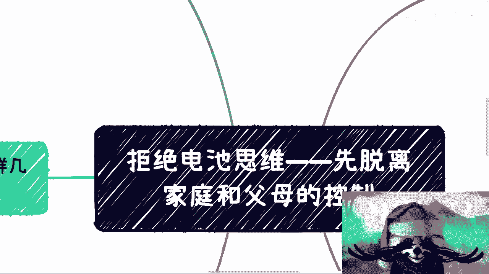

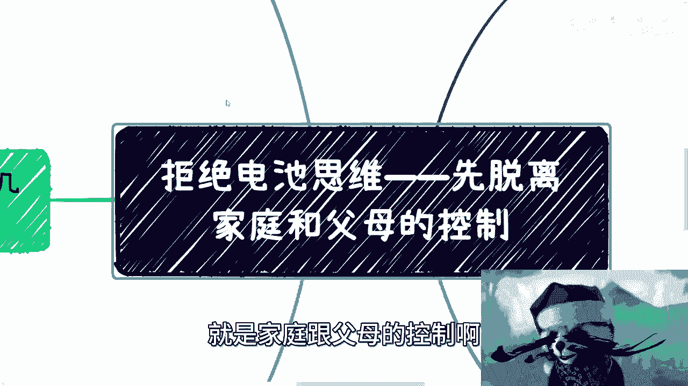

在本节课中，我们将探讨一个普遍存在但常被忽视的问题：来自家庭和父母的控制与情感操纵（PUA）。我们将分析其表现形式、内在逻辑，并提供清晰的思路来识别和应对这些情况，帮助你夺回人生的主导权。

## 概述：问题的本质

这个问题本质上是“电池思维”在家庭关系中的延伸。除了工作和商业领域，家庭与父母的控制是另一个重要的“耗电”场景。许多人的人生选择并非出于本心，而是被“孝顺”、“家庭责任”等观念所绑架。

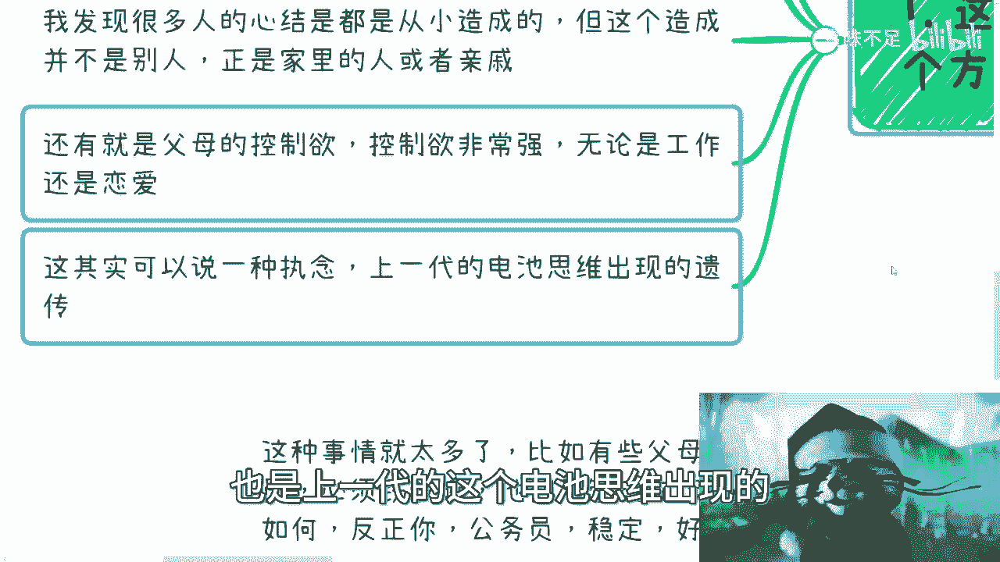

## 核心问题分析

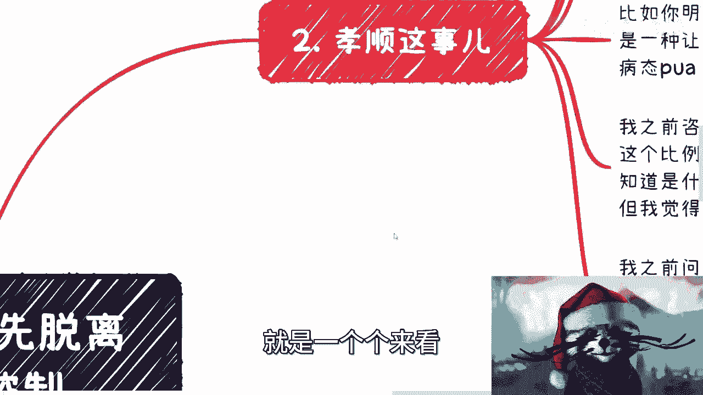

上一节我们概述了问题的本质，本节中我们来详细拆解其几个核心表现形式。

以下是几个关键方面：

1.  **被扭曲的“孝顺”观**：许多人将顺从父母意愿、满足父母期待等同于孝顺。但这常常成为一种自我绑架的理由，或是被他人进行道德绑架的工具。
2.  **家庭与亲戚的攀比**：这种攀比会演变成一种精神束缚和个人执念，让人活在与他人的比较中，而非自己的节奏里。
3.  **原生家庭的心结**：许多心理问题源于成长过程中的家庭缺憾。用直白的话说，部分父母和亲戚在心理尚未成熟、未“学会做人”时便生育子女，导致下一代出现各种问题。
4.  **父母过强的控制欲**：体现在子女的工作、恋爱等人生重大选择上，要求子女按他们的蓝图生活。
5.  **“电池思维”的代际遗传**：以上所有问题，本质上都是上一代“电池思维”（即被消耗、被规划而不自知的状态）向下一代的传递。

## 深入探讨：被绑架的“孝顺”

上一节我们列出了几个核心问题，本节中我们首先来看看最典型的“孝顺”绑架。

许多人将以下行为视为“孝顺”：
*   **公式**：`为父母满意而行动` = `孝顺`
*   明明不想恋爱，却为了“给父母一个交代”而去恋爱。
*   明明不想从事某类工作（如公务员），却因为觉得这是“孝顺”而去做。
*   明明不想考研，却为了“家庭争光”、“让父母开心”而去考。

这些行为的共同问题是：行动的目标节点（让父母满意）并非源于自身。正如乔布斯在MIT毕业典礼所言，人生应注重“连点成线”。而为外部目标所做的选择，往往无法在未来连接成有意义的线，投入巨大却产出甚微，最终无法解决自身的人生课题。

这并非孝顺，而是**病态的自我PUA**。一个关键的问题是：如果人生的一切选择都是为了父母，那么当父母百年之后，你为谁而活？谁为你曾经的选择买单？买单的往往是自己或你的下一代，这便构成了悲剧的循环。

## 深入探讨：无意义的家庭攀比

理解了“孝顺”背后的逻辑后，我们再来看看另一种普遍压力：家庭攀比。

家庭攀比的形式多样，但都缺乏实质意义：
*   **物质攀比**：攀比子女学历、收入、穿戴。这毫无意义。
*   **父母间的攀比**：与其他家长攀比，这本身也无甚作用。
*   **与“空气”斗智斗勇**：部分父母通过网络，对虚实难辨的信息进行攀比，这更是徒劳。

这种攀比从孩子小时候就存在，会带来巨大的心理负担甚至疾病。需要认清的现实是：指望父母一代改变这种思维几乎不可能。因此，在沟通策略上，如果你有自己想做的事情，有时“瞒着”或只说他们爱听的话，比试图说服他们更有效。减少无效沟通和冲突，是更务实的选择。

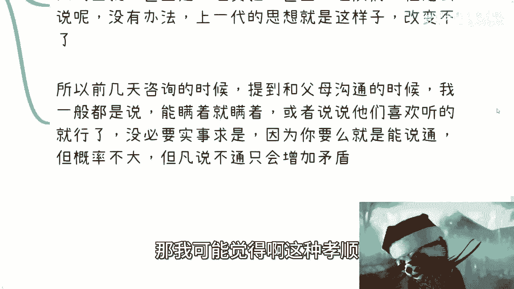

## 深入探讨：控制欲与代际悲剧

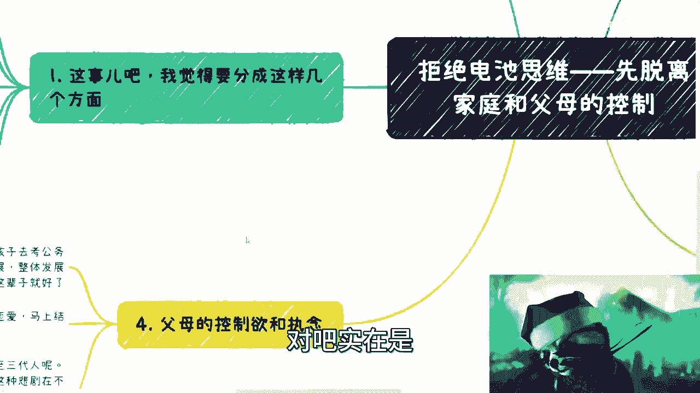

除了攀比，更直接的影响来自父母的控制欲。

控制欲的典型表现包括：
*   **必须考公务员**：认为“稳定”就是终点，无视个人兴趣与行业发展。
*   **必须尽快结婚**：认为“结婚”就是任务完成，无视感情质量。

这引出一个深刻问题：**一代人的悲剧，为何要延续给两代甚至三代人？** 可悲的是，许多父母对此不自知且无法沟通，而被PUA的子女也大多不自知。最终，这些不成熟的孩子成为父母后，很可能继续PUA自己的孩子，形成恶性循环。

## 核心反思：问题的真正根源

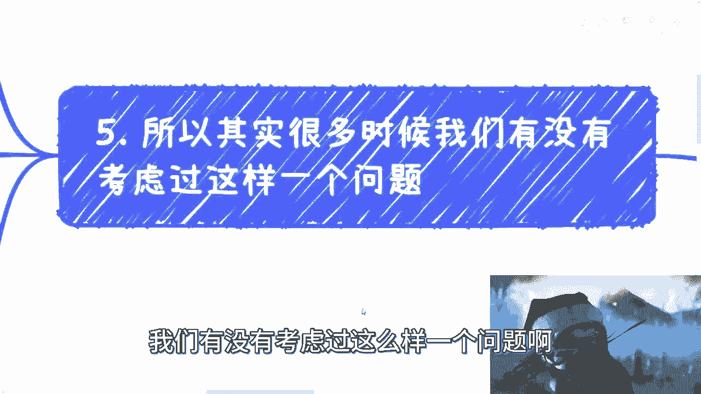

在分析了各种外部表现后，我们需要进行一次核心反思：我们的人生不顺，真的是因为自己不行吗？

许多人觉得自己找不到方向、做不好事情、没有天赋。但有没有另一种可能：**问题并非出在能力或天赋上，而是我们从人生起点就被推着走**。

核心逻辑在于：
*   代码 `if not 探索自我兴趣(): then 被迫选择他人目标()`
*   从小无人引导我们去发现“自己喜欢什么”、“擅长什么”。
*   每个阶段都在为他人做选择，满足他人的期待。
*   最终结果：也许能生存，但活得不开心，感觉在做不擅长的事。

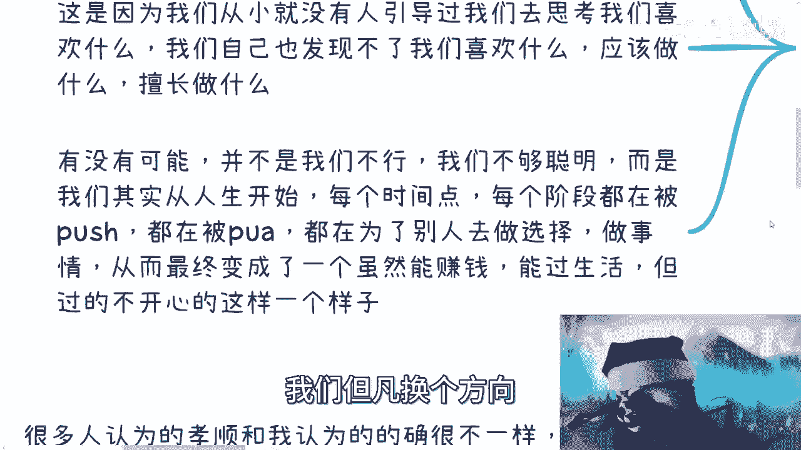

**所以，很可能不是我们做得不好，而是我们从未被允许去做自己真正擅长和喜欢的事。** 换个方向，我们或许能做得非常出色。

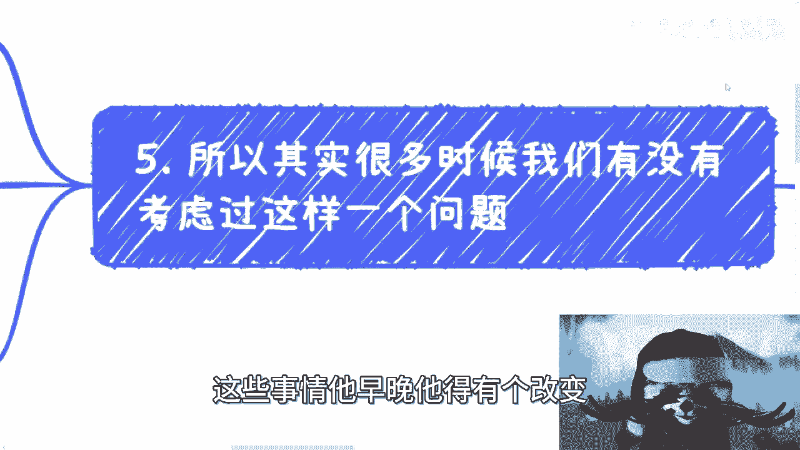

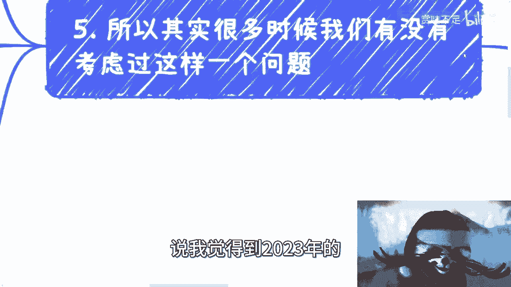

## 总结与行动指南

本节课我们一起学习了家庭PUA的多种形式及其根源。到了2023年，作为成年人，我们应有能力进行自我评估和反思。

关键在于**实事求是**：结合全球经济、国家发展及个人实际情况做选择。既然父母一代的观念难以改变，我们能改变的是自己。

关于“孝顺”，应有清晰界定：
*   **代码**：`孝顺 ≈ 给予金钱支持 + 病时陪伴 + 年老照顾`
*   这是责任，是应做的。
*   但**不等于**在每个人生节点上都要被控制、都要以此名义做出违背本心的选择。

改变是可能的，但并非易事。对于职业发展等具体问题，需要结合个人背景进行细致分析。希望本课能为你提供一个审视问题的新视角。

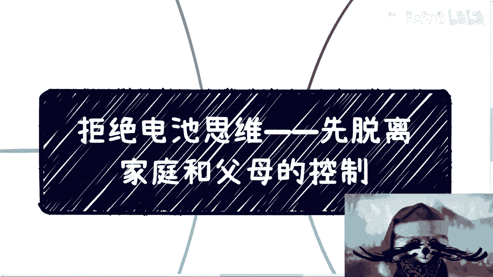

---
**本节课中我们一起学习了：**
1.  家庭PUA的本质是“电池思维”在亲情中的体现。
2.  “孝顺”被扭曲为道德绑架和自我PUA的工具。
3.  家庭攀比带来无意义的心理负担。
4.  父母的控制欲可能导致代际悲剧的循环。
5.  许多人生问题的根源在于从未被允许探索真正的自我。
6.  真正的孝顺在于履行核心责任，而非交出人生主导权。
7.  改变始于实事求是的自我评估和独立选择。