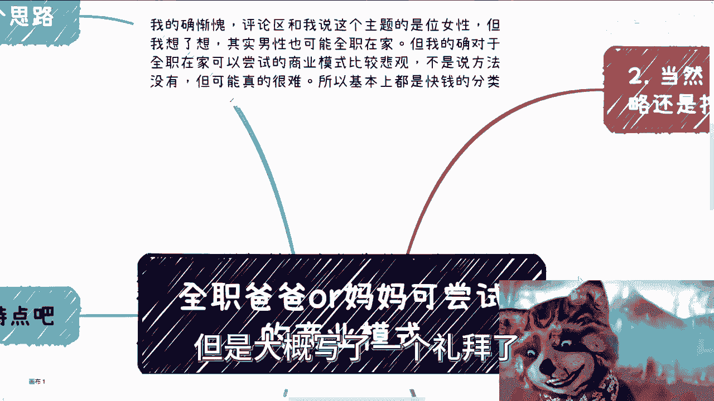
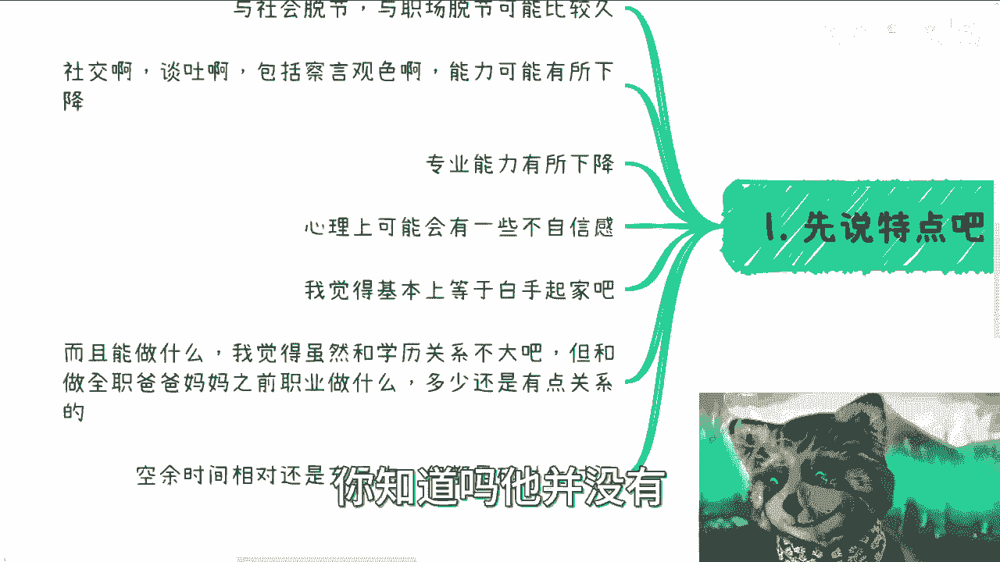
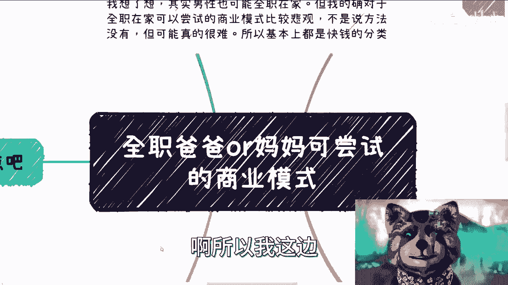
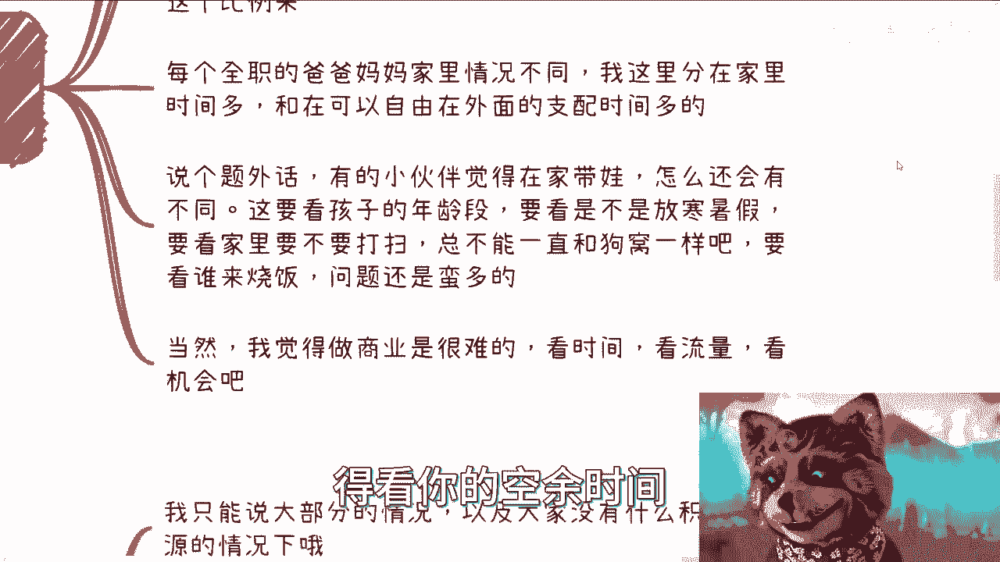
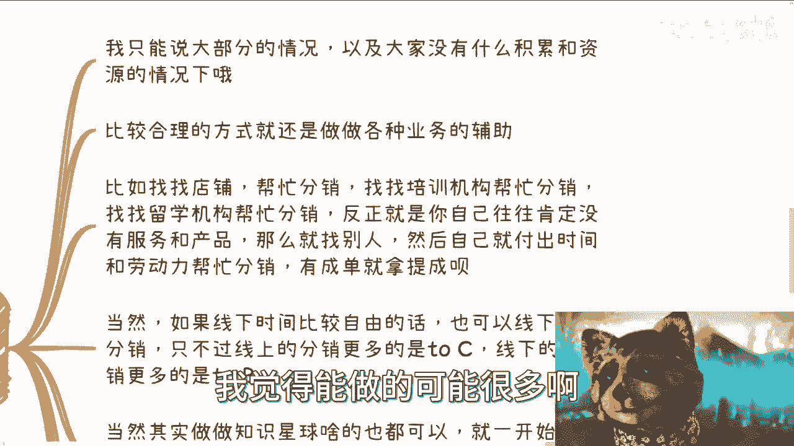
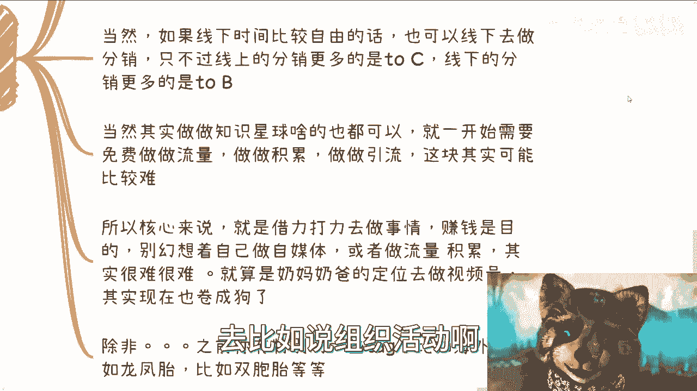
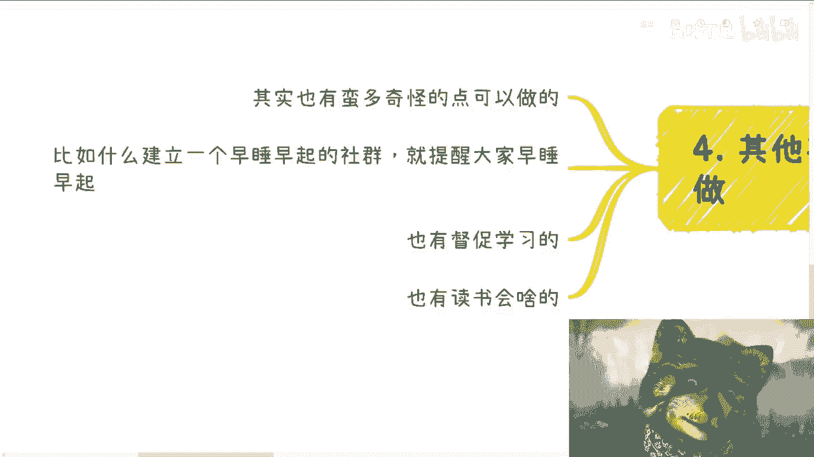
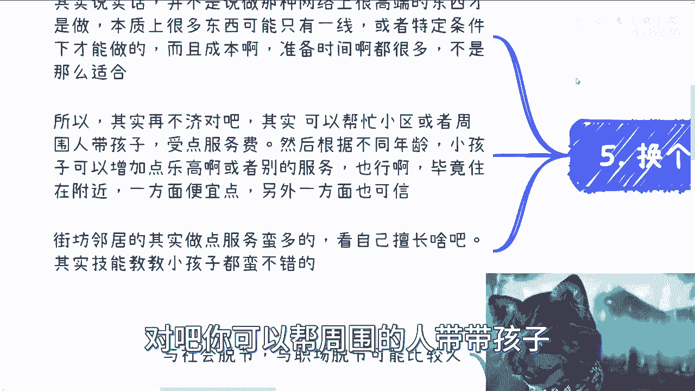

# 全职爸爸妈妈可能可以做的商业方向 - P1 - 赏味不足 - BV1294y167UP

这个大家好啊，首先我就很惭愧啊对吧，这个x mind其实我写了好久了，但是大概写了一个礼拜了。

但是我的确也不知道应该怎么写，因为我也的确想不出来，有多少这个合适的方法啊，但是就像我上次说的对吧，就这个主题吧，我就觉得特别的这个有爱是吧，那不足好像也不好，对吧。

而且大部分人可能也未来也会面临这个问题。

可以尝试着做了一下啊。

在前行提要一下啊，评论区跟我说这个主题的男人是一位女性啊，但是我想了一下呢，其实男性也有可能全职在家呃，但是呢我的确对于全职在家可以尝试商业模式，比较悲观啊，不是说没有方法，但可能是很难，方法很多很多。

但是唉但是大家这个并不代表每个人都有这个。

比如说基础啊，或者很多积累不一定啊，所以呢就是我在这个地方列呢，很可能很多人也都是快钱的分类啊，而且就是说也不见得有多少钱啊，只能说是更多的一些辅助性吧，辅助性吧啊那么先说特点啊，我觉得嗯全职的话呢。

主要是第一个呢会与社会脱节，与职场脱节可能会比较久，那当然这个东西，社会现象就是那个发展太快嘛对吧，然后第二个就是社交啊，谈吐啊，包括察言观色的能力可能会有所下降，当然这个东西跟每个人以前做的工作啊。

职业啊都有关系对吧，我不能说完全丧丧丧失啊，但是就是说他肯定是有所下降的，第三呢就是说专业能力肯定有所下降对吧，这个东西也没办法的，这个所谓熟能生巧对吧，但是长时间不用了，肯定会生疏啊。

然后其实最关键的一点呢，我觉得是心理上可能会有一些这个不自信啊，包括就是恐惧嘛，因为对于很多东西嗯，时间脱离长了，那就是一方面是不自信，第二方面恐惧其实综合来讲呢，就会有一部分这种唯唯诺诺的这种状态啊。

那所以呢我觉得基本上呢，就是如果真的是这种全职在家的爸爸妈妈对吧，然后这个也会问这个问题的，我觉得可能是手上并没有什么很好的牌可以打，所以基本上呢可以这个龟龟在，就是白手起家这么一个状态。

而且呢能做什么呢，我觉得这虽然跟学历关系不大，但跟呃做全职爸爸妈妈之前的职业做什么，就多多少少关系还是有那有那么点的啊，所以说呢就是说我觉得这个最大的就还有一点，最大的特点呢，就是说虽然很多人会觉得。

这个做全职爸爸妈妈呃，空余时间可能会比较多，但是呢就是说呃，他这个时间呢很多都是碎片化的，你知道吗，他并没有太多的连贯性的时间。

所以说这个时间，其实真的要利用起来也蛮难的哦。

所以我这边就是我这边只能说啊，我列了一些我的想法啊，你说我能给多大建议吧，我说实话，我的确没什么能力在这上面给很大建议，但是叫什么叫抛砖引玉吧啊，呃当然就是如果是全职爸爸妈妈呢，我觉得同样的就是策略。

还是按照721的这种策略来，什么意思呢，就是说呃七成，你还是需要一个比较稳妥和积累的方式，二层呢是需要这个稍微激进一点，稍微激进一点的对吧，一城是最激进的啊，当然由于这个全职这个爸爸妈妈的这个情况啊。

我觉得这个相对于商业跟项目的判断力呢，其实会有进一步的下降，这个高智商高智商进一步下降，低智商就是容易被骗啊，容易被骗，所以本质上呢不单单是做事情，按照这样的比例啊。

投资投入的资金比例也应该按照这个比例来，因为哎呀没办法嘛，就真的容易被骗，我这不是我瞎说啊，真的容易被骗，也不是我看不起大家是吧，然后每个全职的爸爸妈妈呢，这个家里的情况也不同啊。

我这里就是就是会区分一些，就在家里时间比较多啊，或者自由在外面的可支配时间比较多的。

那么说个题外话呢，就是说有的小伙伴呢觉得在家里带娃呢，怎么还会有不同啊，我跟你讲这个就得看他带孩子的年龄段对吧，因为那个一方面这个多大对吧，你说幼儿园还是小学还是初中对吧，你要看是不是放寒暑假对吧。

你要看家里，比如说要不要整理啊，要不要烧饭呢对吧，就是就是就像我刚刚说的，其实你要做的事情很多，你你一天忙完其实也就没什么时间了对吧，那你说啊这不像别人觉得啊，你这个有大量的空余时间对吧。

磷酸这个这个连续性的时间其实没有啊，所以当然呢我觉得呢，就是本来做商业化就更很难，就更别说全职的爸爸妈妈的哦，所以呢我觉得这个东西就是说综合来讲呢，得看你的空余时间。

看你是否原本有流量积累啊，看你这个各方面机会啊。

所以说啊如果在家呢，比如说基本上呢，这就是都是在这个电脑前的状态啊。

呃我只能说大部分的情况，以及大家没有什么积累跟资源的情况下啊，你但凡有点资源，有点积累，我觉得能做的可能很多啊。

就不在我的这个这个沟通啊，就在本不在本次的这个内容的范围内啊，我觉得比较合理的方式呢，还是做各种各样业务的辅助啊。

当然你也别管你懂不懂啊，你懂不懂没关系啊，比如说你找找店铺对吧，找一些你感兴趣的吃的也好，玩具也好，无所谓嘛，对吧都可以啊，那这是第一个对吧，你可以帮忙分销，那你也可以找找培训机构帮忙分销对吧。

你也可以找找留学机构帮帮忙分销，反正就是你自己往往就是说嗯大概率啊，我就说你自己是很难有自己的服务和产品的，你要是有嘛，那最好对吧，你要是没有，那你只能找别人对吧，那当然找别人这件事情呢。

就跟我们前两天说那个这个装机的那个事情，是一样的，就是说啊你只要不去打保票，跟别人说，哎这个东西很怎么样怎么样，你就告诉别人，我就是个代理商对吧，那好坏你们自己判断对吧，我只是这个这个帮忙叫什么。

就是把这个信息告诉给更多的人对吧，那你如果来说如果来说好，那就好，那不好，那你们就找品牌方，你别找我对吧，哦那么这种人一般都比较简单，就是所有的业务都可以用这种方法做啊，那么你只要付出的时间是自己的。

这个时间跟劳动力其实就可以了，你帮忙分销，当然钱嘛肯定不会多的对吧，那总比没有好是吧，呃另外一方面呢如果线下时间比较自由的话呢，也可以去线下做分销，只不过呢你线上的分销更多的是to散户对吧。

线下的分销你其实更可以有针对性的去，比如说组织活动啊。

或者说去企业做分销啊，其实都可以啊，当然其实做知识星球啥的也可以，但是你一开始呢肯定是需要免费的做，做一些东西去拉流量啊，不管是活动啊，还是短视频啊，还是什么东西，你你就是需要积累。

如果你是当下很着急对吧，你说我就是想尽快见到成效的，那我是觉得你可以先去做分销。

一边做一边去呃，做做免费的这种账号，看看这个效果，因为很多东西不是你一开始想的出来的，你知道吗，就是你一边做，你比如说今天做了，你发现这个视频的数据不好，没关系啊，你换个策略嘛对吧。

那第二天你看这数据好不好，那不好再换策略嘛对吧，就是你所有的东西就是一步一步去走的对吧，这没办法的啊，你一开始说我能想到一个很好的方向，这几乎就是不可能的啊，那么所以核心来讲呢就是借力打力啊。

去做个事情，赚钱呢是目的，但是别幻想就是说啊我就能给出个自媒体，或者我就能做流量积累，但其实很难，就是你可以把它当成你的，就是back up，就是备选方案的一部分，但是你不能孤注一掷啊，都放到这个上面。

那你就算啊，有些人觉得他通过奶妈奶爸的这种定位，就是说哎我就是跟大家分享对吧，我怎么养狗宝的，我怎么日常生活的，但其实现在也很卷成狗，因为这种视频这种定位也很多很多对吧，呃除非啊除非啊也不是不行啊。

除非你有一些特别的tag，比如说海外啊，比如说龙凤胎，比如说双胞胎可以啊，那比如说你说我今天带娃再加一个，这个叫什么呃。

大金毛，那也行对吧，就是你得找到你的特点，但由于现在就是做的人太多了嘛。

就太卷了，所以就是原本是特点的东西，现在可能也不是特点啊。

那当然其实呢其他也有一些猎奇的可以做，也不叫猎奇吧，就是有些就是在中国这种土地上面，就有些人会买单的东西也比较神奇，就是比如说呢你可以建一个早睡早起的社群，提醒大家早睡早起，你也可以建一个社群。

督促大家学习，哎我跟你们讲，真的有的啊，也真的有人愿意付钱啊，你知道吗，这哎不是问题啊，呃包括什么读书啊，读书会啊，读书那个观后感啊，什么其实都可以，你知道吗，就唉很多很多很多很多。

但是就是但是就是呢在这当中呢，我还是那句话，就是嗯做归做啊，不要去呃，叫什么太越界啊，什么叫太越界呢，就是说不要把不是你的东西说成是你的，也不要把就是说啊这个别人别人没有的意思，说成有这个意思对吧。

这就好像我跟你说，就就举个例子啊，比如说你今天跟一个培训机构合作对吧，那本来这个培训机构呢，是那个不会给学生拉群的对吧，或者说没有这种社群沟通的对吧，你呢既然这个给他们做代理，但是呢你跟家长说说。

哎我们这个有沟通群啊，怎么样子，然后你还打着官方的名号，那这个事儿呢我跟你讲就唉没必要啊。

没必要，就大家想清楚自己到底要做什么啊，不要去就是越界就好了。

那么第五个呢就是换个思路来讲啊，其实说实话并不是说一定要去做小红书啊，做B站啊，做做抖音啊，这种东西才才叫做啊，或者才叫就是说商业呃，因为对于全职爸爸妈妈来讲，其实说白了我觉得嗯。

就是你要么就是说这个持为了持续保持，能够跟这个行业有一定的接触对吧，要么就是说能够保证有一定的这个收入对吧，要么就是说能够让自己有些成就感，所以说本质上呢很多东西不是大家都能做的。

他可能也就是说只有一些只有一线城市啊，或者特定的条件下面他才能做，而且它的成本啊，准备时间都不一样对吧，那你你针对每一个不同的家庭，不同的家长可能都不一样，所以呢其实我觉得再不济啊。

就是所谓什么叫再不技能，就是如果你真的没有什么技能对吧，也没有什么这个东西拿得出手啊，其实我觉得你也可以帮助小区，就是以小区为单位或者周边小区为单位对吧，你可以帮周围的人带带孩子。

或者啊你比如说疫情的时候，我们一直用这个用，用一个平台叫什么叫快团团对吧，你用快手段去带点货也可以呀对吧。

什么农产品啊，什么各种各样的东西都可以呀对吧，你你就周边开个团，你比如说我们就这个小区开个团，怎么来了，对不对，你收点服务费，然后根据不同的年龄，小孩可以增加点乐高啊对吧，或者什么少儿编程啊。

别的服务对不对也行啊，我就就看你会什么嘛对吧，你要是会什么变魔术就变魔术对吧，你要会书法，你就会书法，你要这实在不会对吧，你说我随便跟大家教点语文数学，语数外，那总可以吧对吧，就毕竟为什么呢。

因为毕竟大家住在一起，住在一个附近的地方呢，对于很多家长呢，他是便宜点的对吧，就是说另外一方面它也可信对吧，因为你你要这么想嘛，就是很多人现在这种经济这种工作状态，这种经济情况。

很多人他可能没有空带孩子，那你可以提供一个托管的服务嘛，对不对，那收点钱也理所应当嘛，啊怎么滴了呢，又没有什么什么高端不高端的了，对不对，那街坊邻居其实做点服务蛮多的，你知道吗，看你自己擅长点啥。

然后你你你有些什么技能教教小孩子，哪怕哪怕吹吹口琴啊也可以呀。

无所谓呀，对不了啊，就是其实有蛮多可以做的。

不是说不能做啊，嗯我觉得吧，现在可能大家都是被这个新闻联播啊，被很多东西就灌输的思想，太太太怎么了呢，太眼高手低，你知道吧，就是那种就是说哎感觉我开滴滴，我就不想开对吧，做外卖我就不想做。

然后呢我非要去做一些什么什么高端的对吧，怎么看上去好像牛逼一点的，怎么样东西其实没必要，真没必要，就是就也不叫没必要，就是大家就是说那个嘛，就是什么时候做什么事情嘛对吧，这就好像我以前跟别人说。

我说我我赚多少钱对吧，你赚的多，你有多的用法，你赚的少又少的用法对吧，你带孩子也是一样的，包括你全职爸爸妈妈，如果想做点东西也是一样的对吧，就是看自己经济情况，看自己的这个具体的情况，对吧。

你总不能说啊，我什么都没有，我两手一摊啊，然后我今天就要赚大钱啊，这个这个怎么样怎么样，那你只能被骗，好吧啊行吧，那个我放在双休日做呢，这个一方面是因为的确，这个主题呢跟B站上面很多的受众。

他可能不是那么match，但是呢我最终决定做呢，也是因为我的确觉得这个东西有必要做啊，我不能说人家提出这个需求，我不做对吧，大家都难大家都难，希望大家多多加油吧啊，反正有啥这个问题也可以都找我好吧。

然后大家反正如果对于这个职业规划，或者就是手上牌不知道怎么打的好吧，就细节一点，因为因为你像这种比较笼统的话题，我也不知道怎么说对吧，就大家可以细节一点的，如果说真的有什么可以做的怎么样的。

你们也可以私信再咨询我，对我或者我们走咨询走咨询方式，那么我我的确可以给一些这个。

