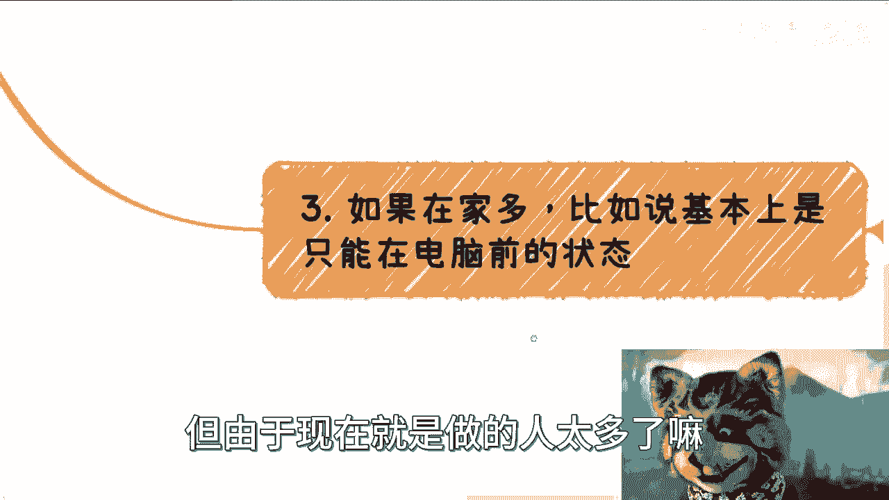

# 课程：全职父母可能的商业方向 - P1 🏠💼

在本节课中，我们将探讨全职父母在兼顾家庭的同时，可以尝试的商业方向。我们将分析全职父母面临的普遍挑战，并基于这些特点，提出一些务实且可操作的商业思路。

## 概述与背景

这个主题是关于全职父母可能尝试的商业方向。我构思这个主题已有一段时间，但确实难以找到非常合适的方法。尽管如此，我认为这个主题非常有意义，因为很多人未来都可能面临类似的情况。

上一节我们介绍了课程背景，本节中我们来看看全职父母面临的普遍特点与挑战。

## 全职父母的特点与挑战

全职父母在考虑商业活动时，通常会面临一些共同的挑战。理解这些特点是制定合适策略的第一步。

以下是全职父母可能面临的主要特点：

1.  **与社会及职场脱节**：长时间脱离社会与职场，可能对最新的行业动态和发展趋势不够了解。
2.  **社交与沟通能力可能下降**：日常社交圈相对固定，可能导致谈吐、察言观色等软技能有所生疏。这与个人过往的职业经历有关，并非完全丧失。
3.  **专业能力生疏**：长时间不从事原有专业工作，相关技能难免会生疏，正所谓“熟能生巧”，反之则会生疏。
4.  **心理上的不自信与恐惧**：长期脱离社会可能带来不自信，并对重新进入商业环境感到恐惧，综合表现为可能有些“唯唯诺诺”的状态。
5.  **时间碎片化**：虽然看似有空余时间，但照顾家庭的事务繁多，时间往往被切割成碎片，缺乏大段连续的时间用于专注工作。

综合来看，许多询问此问题的全职父母可能处于需要“白手起家”的状态。能做什么，与过往的职业经历有一定关系，但最大的限制在于**时间的碎片化**，这使系统性开展商业活动变得困难。

## 核心策略：721原则

在了解了普遍挑战后，我们需要一个稳健的策略来指导行动。我建议采用 **`721`** 策略来分配精力和资源。

这个策略的含义是：
*   **70%** 的精力投入**稳妥、需要积累**的方式。
*   **20%** 的精力投入**稍微激进**一点的尝试。
*   **10%** 的精力可以用于**最激进**的探索。

由于长期脱离商业环境，对项目和商业模式的判断力可能下降，更容易受骗。因此，不仅时间投入要按此比例，**资金投入也应严格遵守这个比例**。每个家庭情况不同，需要根据自己可自由支配的时间（是在家时间多还是外出时间多）来调整具体方案。

## 可行的商业方向建议

基于以上分析和策略，我们可以探讨一些具体的商业方向。以下是针对不同情况的一些思路。

### 方向一：各类业务的分销与代理

这是最直接且门槛较低的方式。核心思路是“借力打力”，利用自己的时间和社交网络，帮助他人销售产品或服务。

*   **操作方式**：寻找你感兴趣的产品或服务（如食品、玩具、培训课程、留学服务等），成为其分销商或代理人。
*   **关键要点**：明确告知客户你的“代理人”身份，不夸大产品效果，不做出无法兑现的承诺。好坏由客户自行判断或联系品牌方。
*   **优势**：启动快，几乎零成本，只需投入时间和劳动力。
*   **形式**：
    *   **线上分销**：通过社交媒体、社群等向个人（To C）销售。
    *   **线下分销**：如果时间自由，可以组织线下活动，或针对企业（To B）进行推广。

### 方向二：内容创作与流量积累（作为备选方案）

通过分享育儿经验、日常生活等内容，在自媒体平台（如小红书、B站、抖音）积累流量，未来通过广告、带货等方式变现。

*   **操作方式**：确定一个独特的定位（如海外育儿、双胞胎家庭、宠物+育儿等），持续创作内容。
*   **关键要点**：
    1.  将其视为**备选方案（Backup）**，不要孤注一掷。
    2.  初期需要**免费提供价值**来吸引流量。
    3.  保持测试心态，根据数据反馈（如视频播放量）不断调整内容策略。
*   **挑战**：该领域竞争激烈（“很卷”），普通育儿分享已不具优势，必须找到独特标签。

### 方向三：创建付费社群或服务

满足特定人群的陪伴、监督或学习需求，提供轻量级的付费服务。

*   **操作方式**：建立诸如“早睡早起打卡群”、“学习监督群”、“读书分享会”等社群。
*   **关键要点**：这类服务确实有市场需求，有人愿意为陪伴和监督付费。务必明确服务边界，不提供超出承诺范围的服务（例如，未经授权假借合作机构名义建群）。

### 方向四：基于社区/小区的本地化服务

以居住的小区或周边社区为单位，提供基于信任和便利性的服务。

*   **操作方式**：
    1.  **社区团购**：利用“快团团”等工具，组织农产品、日用品等团购，收取少量服务费。
    2.  **儿童托管与兴趣班**：提供课后托管服务，或利用自身技能（如乐高、书法、编程、甚至基础语数外辅导）开设小型兴趣班。
    3.  **技能交换**：任何你能想到的技能（如魔术、乐器）都可以尝试教授。
*   **优势**：基于地理优势，可信度高，需求明确（如双职工家庭需要托管），客单价灵活。

**重要提醒**：在尝试任何方向时，务必**清晰界定自己的角色**，不要越界承诺，避免法律和信誉风险。

## 心态调整与务实建议

最后，我们需要调整心态，以务实的态度开始行动。避免“眼高手低”，认为某些工作不够“高端”而不愿尝试。

*   **从小处着手**：根据自身经济情况和技能，从力所能及的事情开始。有多少钱，办多少事。
*   **接受渐进过程**：赚钱是目的，但不要幻想一夜成功或立即积累大量流量。商业是一个逐步摸索和试错的过程。
*   **保持开放学习**：如果对职业规划或具体操作有更细节的疑问，可以寻求进一步的咨询和讨论。

## 总结

本节课中，我们一起学习了全职父母探索商业方向的可能性。

我们首先分析了全职父母面临的**五大挑战**：与社会脱节、社交能力下降、专业生疏、心理不自信以及**时间碎片化**。针对这些特点，我们提出了稳健的 **`721`** 资源分配策略。

接着，我们探讨了四个可行的方向：
1.  成为各类业务的**分销与代理**，借力打力。
2.  将**内容创作与流量积累**作为长期备选方案。
3.  创建满足特定需求的**付费社群或轻服务**。
4.  开展基于信任的**社区本地化服务**。

核心在于**保持务实**，从自身资源和时间出发，清晰定位，避免越界承诺，并从小处稳步开始尝试。希望这些思路能为大家提供一些有益的参考。