# 全面详细的来说下创作者经济 - P1 - 赏味不足 - BV1V24y1j7qt

好啊那个大家愚人节快乐啊，这个我们这次呢主要是我我列了比较多的东西，你们可以看得到啊，就是我把整个这边写了好多好多对吧，呃因为这个东西呢我本来是想写简单一点的，但虞姬c这个东西写着写着东西就很多好吧。

而且可能嗯也也也不一定讲得完，而且内容上面可能比较多，所以说反正先说吧好吧，在虞姬c这个东西呢，先说之前，我会先说一个这个二次元的动漫对吧，叫心灵测量者对吧，这个诶不是不是不是心理测量者我都能打错了。

呃六对吧，这个呢就看过小伙伴可能也都知道，我为什么会讲这个东西啊，是因为本质上呢在未来社会啊，他讲了一个东西，叫做对于犯罪者和潜在犯罪者呢，通过色相，这色像是个什么东西呢，你们就可以理解为。

它是一个综合的一个评估模型，就有点像那个叫马那个蚂蚁信用分对吧，就是测量模型，然后来对所有的人进行测量，然后呢他是进行预测和治疗，也就是说他如果预测出来，你是一个潜在犯罪者或者是一个犯罪者。

他会直接把你抓起来，而不是说通过你所做的就是你已经犯罪了，然后再来抓起来，你知道吗，所以这是一个预测的方向，那么我觉得呢，就是说从这个动漫所传达的这个内容信息，跟他未来的整个走向呢。

我是觉得比较符合人类社会发展啊，因为本质上我们现在所做的很多事情啊，其实都是在做什么，就是一个是大数据收集，一个是大数据模型预测呃，大数据模型训练，以及就是嗯就数据化来衡量每一个人。

其实我觉得这个是符合未来发展的，然后还有呢就是在问我这个gb t gb t呢，其实从目前来看啊，就是虽然虽然那个埃隆马斯克呼吁了，这个50多位这个叫什么创业者说，我们要停止对吧，对于这个ai的探索。

巴拉巴拉说半天啊，但是我觉得g p t下一步呢，他的整个整个的一个就数据量达到足够，足够大的时候啊，包括他对于数据能够实施做分析的情况，下面我觉得他下一步的情况，就是做那个未来预测，因为本质上来讲呢。

就是它是一个从古到今的一个，大数据的一个模型，而与此同时呢就是除了训练以外，他还能去呃，根据一定就未来根据一定的这个模型和算法，其实可以来就是根据以前的这个数据吧，来做未来的这个预测。

只不过呢就是说他可能预测出来的这个，这个路线啊，它不是单纯一条对吧，这个就就有点像流浪地球二里面，那个50w对吧，就是呃就比如说有，他未来用这个模型来预测对吧，这个刘老师未来到底是能更新多久是吧。

呃然后他根据我以前的这个习惯啊，根据我以前做事情的方式，他可能觉得嗯啊，吕老师可能这个在有3年的情况下面，就能够一直更新下去是吧，哈哈啊，所以说呢其实本质上我觉得是这么个发展。

那你说至于很多人觉得说啊有没有心智啊，有没有意识啊，我觉得这个从我技术角度来讲啊。

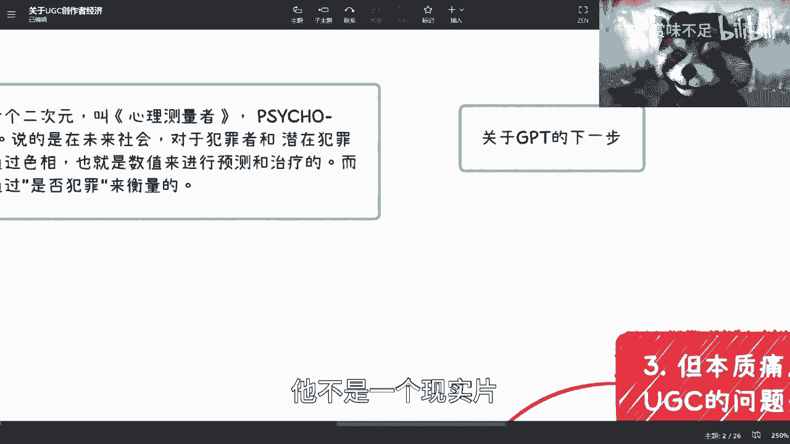

他不是一个现实片，它它是个科幻片的范畴啊，所以就不在这个讨论范围。

你看我开个局就开了三分钟，我也很焦虑啊对吧。

那游戏机创造的经济啊，这个东西我们来全面的说一下这事呢。

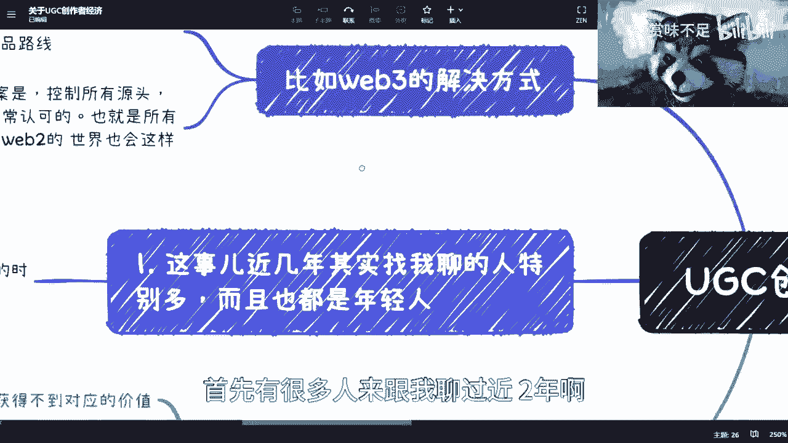

首先有很多人来跟我聊过近2年啊，而且呃年轻人居多啊，然后都是一些95~00的本科生，硕士生这样子，然后小姐姐居多啊，然后我觉得小姐姐的确是想法比较多啊，男孩子都在那边打王者荣耀啊。

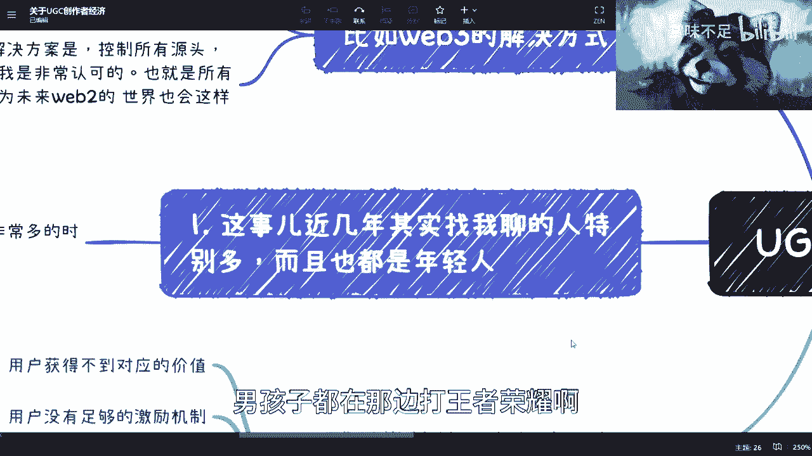

我不是性别歧视啊，我也不是打拳对吧，这个我自己鄙视我自己是吧。

哈哈啊，然后嗯，我觉得呢，就是说首先啊大家都看到了这个ug c的痛点，因为ug c呢其实本质上不是那么好做的啊，就是c端的市场其实不是那么好做的，创作者经济其实并不是那么好做的对吧。

那么说其实本质上的这个痛点就是都看到了，而且这个痛点其实不存在的，不是1年2年的问题了啊，但是呢我觉得所有的人去解决，或者想要做对应的事情的时候呢，你们也得明白一个道理是什么呢，就是存在即合理。

也就是说这个事大家都能看到，同时又存在这么长时间，又同时痛点这么长时间没人解决。

就说明这里面的就什么顽固污渍是吧，非常的难以清除啊。

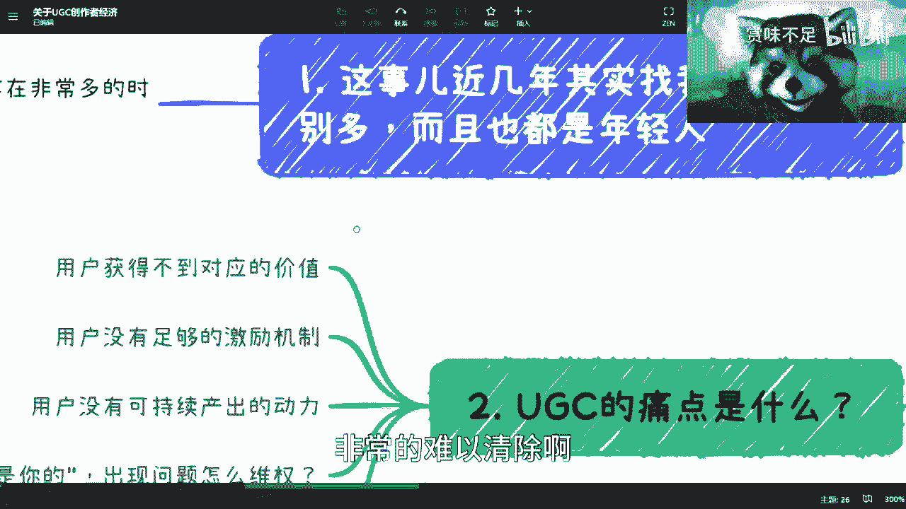

第二点呢就是我们说既然要做这个东西啊，那么我们就得看它的这个核心痛点到底是什么。

你看啊，首先对吧，就是创作者获得不了用对应，而且这其实不一定不是用户，不是用户，我可能写错了，描述的描述的不是特别准确啊，这个我改掉。

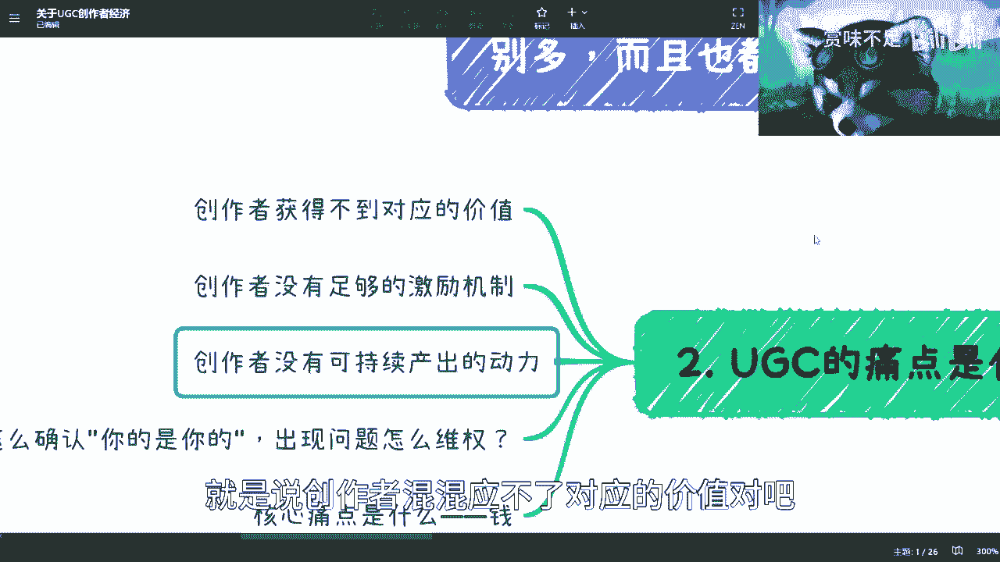

就是说创作者混混应不了对应的价值对吧，就是说呃你就拿b站看我，我就不拿平台来讲吧，你就拿这个任何一个平台来讲，就是说你去做了一件事情对吧，那你说你到底应该获得多少钱呢，呃你明明付出了，比如说就打个比方。

我做这个视频对吧，我觉得应该是值个2000块钱一小时的对吧，那最后我可能两块钱都没拿到对吧，那这对应价值就是没有的，那首先这是第一点，第二点是什么呢，就是说它有对比性，什么叫对比性呢。

就是我今天早上评论区回复我们这个小伙伴说，我也说我说就有很多人跟我讲嘛，他说这个视频呢，其实b站上面也是目前唯一少数的啊，几个说啊，长视频有拥有长视频价值的，我说长视频的价值并不在于。

它到底是不是长视频，以及是不是我觉得长视频有没有价值，而是在于说用户觉得有没有价值，数据觉得有没有价值对吧，也就是说，我今天比如说做了一个100多个小时的视频啊，我得到的这个这个月播放量就可能50万。

那人家这个穿个黑丝跳个舞吧，跳五分钟可能就500万，那我凭什么呀，我图啥呀，我是做慈善，做公益，我普度众生吗是吧，所以我跟你们说，就这个事情呢，还是那句话，就是社会和世界的整个价值都是对等的。

而你的价值不是你给出来的，是世界对你的评价，你知道吗，那当然了，你也可以跟我说，我他妈很对吧，我管你们是谁，我又不管世界对我价值，我也不管别人对我价值，那也没问题啊，那你就可以。

这个你就是你就照着你的这个三观，坚持往下去走，就你可以站着把所有的钱赚来，那我觉得你也很牛逼，但是可惜我没这个能力。

对不对啊，那我觉得这个是对应的价值，第二呢就是说创作者没有足够的激励机制，这个事情呢其实也是一样的，就是说啊无论是播放量还是创作者经呃，这个这个经济所带来的财富，还是说比如说呃点赞啊，充电啊。

或者其他各个就就就就打赏啊对吧，各种各样的它没有足够的机制，因为唉因为这2年你们看嘛，就是我们先说创造，因为创我们的定位都是创造创造者嘛对吧，那你怎么定义这件事情，你说到底是比如我们举个例子。

比如说是科技类知识类对吧，然后是什么啊，那个美妆类穿搭类算创造者呢，还是说人家穿个穿个短裙跳个舞，就也算创造者的，你不能说人家不是创造者吧对吧，那人家也在创造的东西。

只不过创造的东西可能不符合你的价值观对吧，或者说不符合很多人面上的价值观，但他很喜欢是吧，你比如我啊啊那怎么办呢，是吧啊，那我觉得这个是一块啊，那么但是呢就是说他没有足够的激励机制呢，那是肯定的。

我们刚刚说到哪儿嗯，对就是这个接力机制嘛对吧，那么这个东西呢就是说啊，他这个本质上就没有足够的激励机制对吧。

那个这是第二点，第三点呢就是创造者他没有可持续产出动力，那这个事情呢就是说呃跟激励机制啊，跟对立价值啊，都是有一个强绑定关系的，那么在这个里面呢就说啊这个除了这两个以外，其实还有很多的这个因素啊。

生态也会啊影响到他们，包括就是说我怎么这个保护的版权啊。

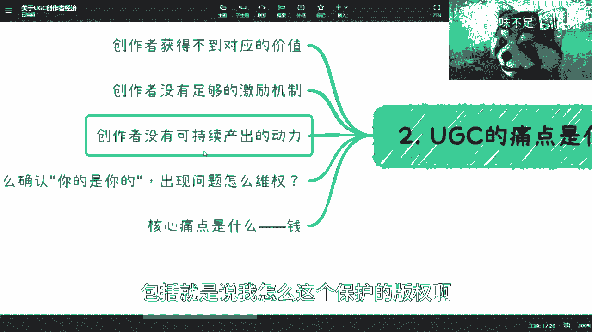

保护我的利益啊对吧，这些都是那么同样的，你怎么确认你的是你的出现问题，你就像我做这个视频，回头有人把我声音一批对吧，然后放出去，那人家怎么说呢，陈老师，你怎么知道这东西是你的呢对吧。

你怎么保证这东西是你的呢对吧，那我说好，这个观点全网就我一个人，那他妈鬼信我，你说是不是是吧，所以就是这个事儿呢就很复杂，你们无论在什么平台上面，无论做什么，今天是产出个视频，明天做一幅画。

还是后天啊这个这个做一个什么表情对吧，其实都会有这个问题，所以呢我跟你们说，我跟所有的人聊呢，就是聊到最后你们会发现它的核心痛点，ugg的核心痛点是什么，就是钱，就是就是我们说啊这个结果是一个钱。

但是呢围绕这个钱来讲，就这个钱会影响这个钱多钱少，会影响这个钱的这个最终的一个归属，其实是很整个生态的问题，只不过他最终体现出来的一个表现方式，是一个钱啊，所以说呢其实你们会发现。

如果你们真的要去做创作者经济的平台，或者怎么样，你们核心要去考虑的问题是什么，就是怎么把钱合理的啊，就是比如说每一个人产出的东西，它对应的合理的价值所对应的这么一个价啊。

所对应的这个钱到对应的那个应该获得的，那个人的口袋里面对吧，其实就是这么个东西啊。

那么这个呢其实就就为什么我们待会儿会来说，为什么我一开始会来说这个cyo pass对吧。

这么一个这个动漫它其实是有很大关联的啊。

那么这个是第二点嗯，三呢啊三角志，然后三呢就是说啊，这个本质痛点，我们来说就是虞姬c其实问题很多。

但它的本质痛点是什么，就是它是不是只是游戏c存在的问题。

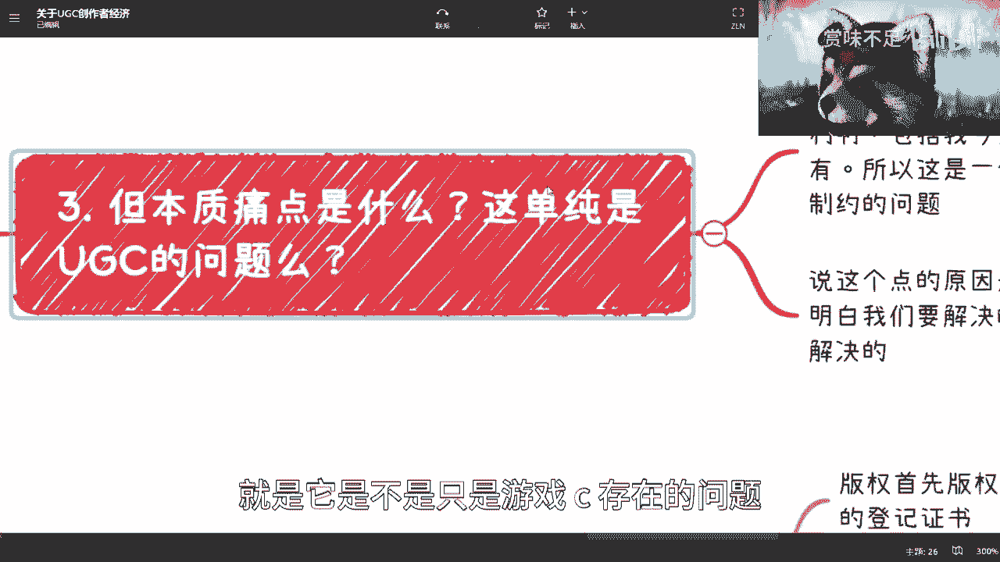

其实并不是啊，就是首先你看啊，所有个人创作者相关的其实都没有。

就是就是很多东西都是缺失的，那我就是这个问题并不是只有就是u g t存在，所有的平台都会面临这个问题，你比如说版权啊对吧，专利啊对吧，这个呃这个包括我们我今天做的这个视频啊，做的x mind的对吧。

他有吗，就是他有有就他有这个定位吗，他有保护嘛对吧，他有利益的绑定吗，他有版权吗对吧，你说他有没有有，但是我就说从整个世界法律框架上面，它有没有没有对吧，从技术保证上面有吗，没有对吧。

那你只能说你们觉得这个对应金人是我做的，那回头过了几年之后在外面趴，这个有人拿过去卖卖钱来跟我断关系啊，跟我半毛钱关系没有，我也不知道啊，而且我说不好听点，我就算去起诉他也不见得有什么结果，对不对。

那所以呢其实你会发现这是一个整个生态，就是从创作到伪造，保护到跟踪到管理到制约，它整个都是一个问题对吧，所以这个东西就是很多人觉得创作者经济，为什么想去创新视觉的，比如说b站也好，微博也好，快手也好。

像胡兄也好，他觉得这些人的就变现的渠道，就是真正回归到个体上的价值是不够的，这句话是对的啊，但是这个东西并不是绝对，不是说你今天去做个平台就能解决的啊，这个是一个核心问题，你知道吗。

对吧，那么第二个就是说说这个点的原因呢，你看啊我们去做任何一件事情，无论你们去做，我去做对吧，我们都得去明白这件事情的复杂度，就是当我们要去解决一件事情的时候，或者创一个业的时候，或者做一件事情的时候。

为什么会失败，是因为我们对这件事情的认知不够，我们对自己的认知不够对吧，这就好像有很多人觉得呃，你明明就是觉得自己是可以改变世界的，但是你可能连1111桶矿泉，一一桶桶装水都扛不起来是吧是吧。

就所以说呢就是说你我们为什么一直说，对整个世界，对整个的全局都要有了解，是因为我们去解决这个问题的时候，我们才能够知道这个问题的真正的复杂度，以及本质的核心问题到底在什么地方啊。

那么这个呢你就会发现，一旦你明白了我们刚刚说的这个点。

你就会发现你这不是说你去创一个业对吧，你哪里比融资对吧，你你你做一个平台你就能解决的，解决不了，那当然你可以改善啊。

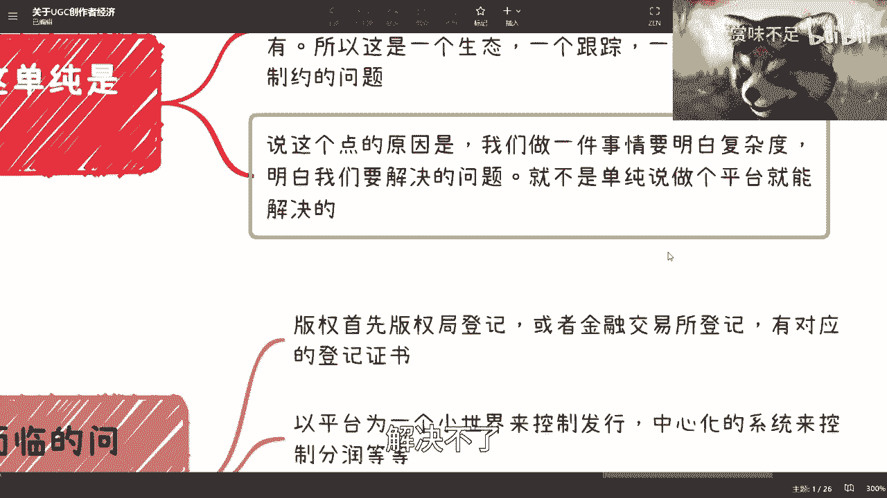

但是你解决不了啊，好那么这个是三啊，唉我四呢，四在哪啊。

四啊好，你看啊，为什么那么难管理，难管理对吧。

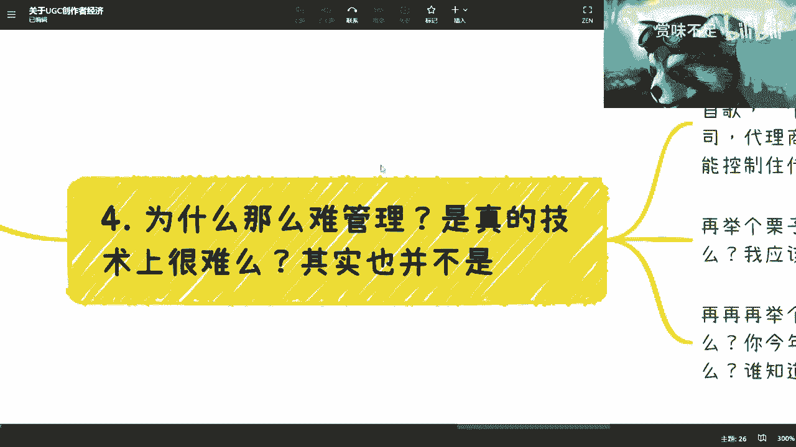

是真的技术很难吗，其实也并不是，就是本质上来讲呢，所有东西到发人类发展到今天为止，技术不是任何的问题，技术能解决很多问题。

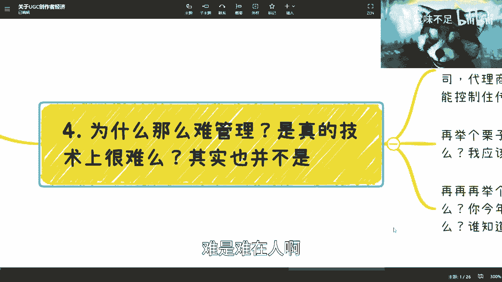

难是难在人啊，人这个东西上面，那你比如说我们举个例子，比如说啊你说我今天做了一个表情啊，我画了一幅画啊，我做了一首写了一首歌对吧，我做了一个视频啊，你说我有公司，我有经纪人，我有代理公司。

我有代理商对吧，好我整个产业链我都我都有对吧，我很牛逼是吧啊，但是你会发现只要这个东西，你今天但凡一到发到网上，你能控制它传播性吗，不能对吧，比如说我今天发到youtube发的b站上面。

这个东西还有保护吗，啊就上面有行字叫做啊，未经作者授权不能转载，有卵用啊啊我我就这句话就乱用啊，哈是吧，人家录个屏，把把把你这个水印改掉好了，你能把他怎么样，你知你甚至都不知道啊，你知道吧。

就是说首先呢就是说整个这个事情，在当下互联网的环境里面，他就是控不住的，就是你技术能保证吗，能啊，我就告诉你们能，但是当下有用吗，没有用，就是说你有屠龙之技吗，有但是你用了这个屠龙之技吧，没有对吧。

你是不是对这个龙用呢也没有对吧啊，这个是第一点，第二点呢就是我们再来举个例子啊，就比如说啊就比如说这个啊，能不能就就是就算你第一个问题能解决对吧，那么问题在于我作为一个创造者啊，我知道卖了多少吗。

我不知道，我说我应该拿多少嘛，我也不知道我我说我的比如说合作商啊，分润商啊，整个供应链产业链里面的人，知道卖多什么也不知道对吧，那有很多人就跟我讲了，他说怎么不知道呢，对吧，我们我们这个互联网很完善的。

我们有c i n m是吧，我们有o a是吧，我们有各种各样的大数据平台是吧是啊，那我就问你，我作为一个创作者，我怎么知道你平常上告诉我真的假的对吧，你就拿b站b站，你就拿微博来讲。

你说微博一1年可能给我2000块钱，那我就说那他妈我1年发了几10万几呃，几万条微博凭什么就给我2万块钱啊，不是凭什么就给我2000块钱，我他妈明显应该有20万对吧，难道那我怎么办，我就告微博去啊。

我我我我我去把他们的这个后端开发者，这个总监的脑子敲开来是吧，这不科学啊，你知道吗，就是平台这种东西它是没有可信度的啊，它是没有可信度的，那么同样的我们再再再再举个例子对吧，就算你知道分多少。

你一定拿得到吗对吧，我这个平台上显示好，陈老师，你1年拿了20万拿得到吗，20万，你给我两个亿，我也拿不到是吧，那那那然后呢就是一样的，比如说这个平台，你说规则啊，他今年跟你说。

我我是通过x的规则来分的，明年跟你说，我是根据y规则，后面跟跟你说，根据z规则，大家应该有平等的对吧，那现在问题在哪里，问题现在根本就不平等对吧，所有的规则，所有的东西其实都是平台说了算的。

创造者是什么，创造者就是个打工人啊，我就是一只鸡，我就是一只火鸡对吧。

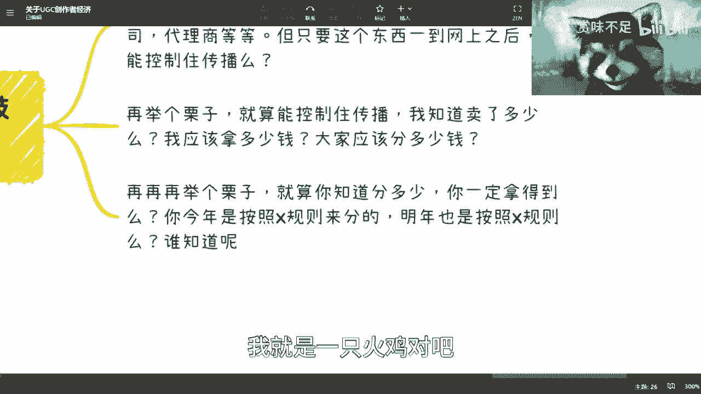

平台就是农场主是吧，就这么个情况啊，或者三体人快点来解救我啊对吧。

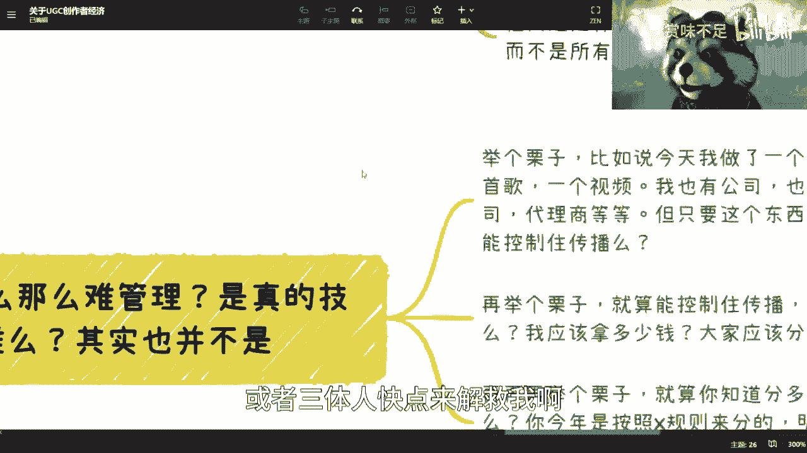

所以说所以说呢其实你如果啊不管是谁。

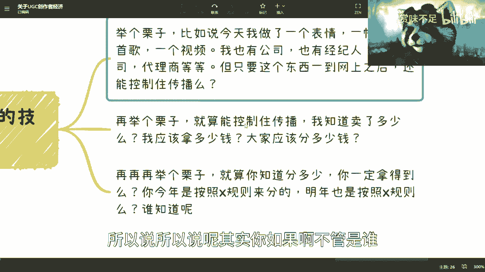

我不管今天是这个阿里巴巴也好，还是你个人也好，你要去创业也好，其实所有的商业计划书你要去做一件事情，你要去解决的是问题啊，你要去解决问题，而不是重复造轮子，因为我现在看到有非常多的平台。

要去做创造者经济，它里面一个问题都不解决，那在我看来，你只是换了一层皮好让别人看上去卧槽，你的激励机制很牛逼对吧，你能够给用户赚来带来钱，但其实核心问题，当这个平台运营了两三个月之后。

大家新鲜劲儿过了之后，你会发现它里面一个痛点都不解决，有卵用。

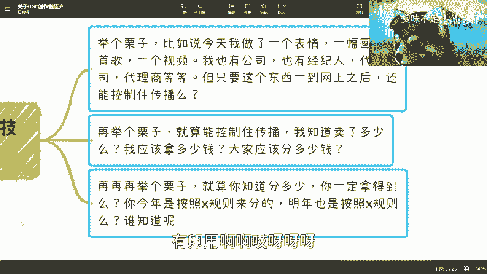

啊啊呀呀呀，我卡住了对吧，四啊五好看啊啊。

你看啊，所以创造了经济，实际其实面临的问题很多很多对吧，它是一个生态啊，它是一个生态好，那么怎么解决呢。

比如说582的解决方式，我们在这边看啊，首先你所有的东西不管是视频，一首歌对吧，还是说这个这个呃作画，你首先是要在版权局登记的，或者金融交易所登记的，有对应的鉴定证，登记证书。

哎我跟你讲这件事情很搞笑很搞笑，什么搞笑呢，就是我发现就是说我不是说嘲笑这个很多人，法盲啊对吧，就是你既然做这件事情，你就应该去了解对应的法律，我发现很多的人去做一个平台，尤其做互联网也好。

做做v82 的很多产品也好，他就会发现他跟中国的法律，他或者跟当地的法律，比如说日本啊，美国啊，他跟当地法律好像是一个平行世界，就是你做归做，他完全不care你法律对吧，但是呢你会发现你不关心吧。

好好研法律上法，从法律意义上来讲，他也没有强制需要你去登记对吧，但是你不登记，你就会就是你去做这件事情，就会让我觉得你是一个很不专业的人，就是你明明要去做一件专业的事情，你就去做对吧。

而且而且关键是什么，就是你在一个web 2的世界，你去做一件事情，你不寻求主权化法律的保护，那我请问你你寻求什么保护呢，对啊就是这种事情就很很搞笑，这个这个事情上人这是第一点啊。

第二点呢就是以平台为一个小事件来控制发行，中心化的系统来控制分润，这个事情呢也没有问题啊，我就举个例子，就比如说嗯，就比如说你说我之前举过的网易云音乐对吧，你说在网易的这个生态里面。

那么我来控制它的发行量啊，我来控制它的里面的，比如说呃这个这个售卖量，我来控制大家怎么分润，可不可以可以啊，但是问题是这个呢也是一个怎么说呢，就是说网易它只是可能控制这当中某一个节点。

就比如说他只控制它的发行量，但是啊对于我们说的，比如说呃这个这个丰润渠道啊，啊这不是丰润分销渠道啊，丰润啊，包括其他东西，他可能就都不管，都是交给下游的公司来做的。

那么其实你会发现它的数据也是不透明的对吧，就回到我们刚刚说的，我知道我能卖多少吗，我知道我能赚多少钱吗，你还是不知道对吧，这是第二个，第三个呢，当然啊他能解决一定的问题，他能解决一定的问题啊。

第三个呢就是在所有的现有平台里外面去嵌套，什么意思呢，就比如说你现在做一个新的平台啊，然后呢我说哎我把b站啊，小红书啊，抖音啊，快手啊都包起来，可不可以可以啊，你去你去做嘛，你去包嘛对吧。

然后你说我我基于对吧，b站啊，微博啊，小红书啊等各个平台外面，我自己这个叫做聚合平台，我给他们做一个新的激励模式，然后全新的这个叫什么u g c的这么一个生态，可不可以可以啊，我觉得没有问题。

但是问题还是那个，就是就是我们刚刚说的这些痛点，你还是一个都没解决，你知道吗，你只是你只是怎么说呢，就是就是我们以前举例子这么说，就我说大家都要走走，走出象牙塔，对不对，你这种行为就好像什么呢。

就好像今天你是一个俄罗斯套娃，一共套了十层对吧，然后呢一共套了十层对吧好，然后呢你在里面造第11层，然后呢你走出来啊，然后告诉大家哦，你看我牛逼吗，我走出上牙塔了是吧，就就有种这种感觉。

就是你自己套了一层皮，然后呢你你破了这层皮之后呢，你就说嗯我牛逼哎呀，就就嗯对吧，重复造轮子，而人类还是毁灭吧，是吧，然后最后一个呢，就是就是你会发现问题是什么呢，就是所有的这些这个情况啊。

就是你可以去忽悠一些不懂的人，你可以去忽悠一些资本，但是呢从本质上来讲呃，人类社会在ug c，在创造者经济上面没有很直接的进步啊，没有很直接进步，就是没有解决所有的问题。

那么这个是web 2的点啊，那么我们来看web 3，就说到创作者经济的核心就web 3。

web 3解决方式呢，在这个地方呢很多人就要跟我说n f t nt，我跟你们说啊，这个东西我先强调一下，数字资产是数字资产，n f t是n f t这个东西当下已经定性了，我跟你们说啊，你们别来杠啊。

你们自己去想，我跟你们说，n f t早就已经定性了，就是它是流动性低的一个资产，那么他是会走什么呢，就适合走lv哦，爱马仕这种奢侈品的路线，什么路线呢，就是授权授权pr联名皮啊啊联联名营销，你知道吧。

然后走这种叫做叫做数量少，这就是n f t的最终的归属归路啊，想都不要想了，我在这个地方就给你们定一下这个姓啊啊，你们回你们在各位23年可以回过头来看。

你知道吧，但是呢就是说呃web 3这边数数字资产呢，其实它有就是对于创造者经济呢，它是有一定的解决方案的，当然这个解决方案，就像我们上一次的视频里面说的，就是说跟智能合约跟别的东西都会有关联啊。

但是这个事情呢我不在这个地方地方讲过，后面再单独开一期会跟你们说数字人民币，数字货币跟智能合约怎么来解决这个问题呢，好吧，但web 3的核心是什么呢，是控制其所有源头啊，这个的思路我是认可的。

我是非常认可的哦，我是非常认可的，也就是说所有的信息链上获取哦，然后而且我认为web 2世界未来也会这么去做。

什么意思呢，我们举个例子啊，比如说呀比如说啊，比如说你比如说极客啊，极客和twitter啊，他们之前做过一件什么事情呢，就是头像，那么头像他们是怎么做的呢，他们是根据每一个人的私钥来绑定你的身份。

绑定的身份之后呢，到公链上面去获取在你这个cl下面的数字资产，然后有这个数字资产的人，可以把这个数字资产变成你在即可，我错了我错了我错了，我打错了，我打错了，我打错了，我打错了啊，我打错了对吧。

然后推特上面啊，然后作为这个极客跟推特的头像。

整个这个事情我是非常认可的，因为这件事情别的我先不说啊。

他至少解决了一个点就是什么呢，因为其实你会发现网络上传播这件事情，能控制得住吗，根本控制不住，但是有一个可能性是可以的，就是如果所有的平台，所有的地方要使用这个东西，它是都只能通过一个源头去做。

那么就可以，就比如说我今天这个视频在链上啊，在链上已经成为资产了，那么整个全网只要是互联网上面，要用我这个视频的，他去下载也好，怎么样也好，这无所谓，但是只要他要在网上传播这个视频的，他只能在链上获取。

那么这件事情就完全可以控制住，完全可以控制住，一点问题都没有啊，而且他一旦源头控制住住住了之后，你就会发现，那么他跟我的身份就是强绑定的，你们明白吧，哦那么这件事情就是，它相当于是一个多米诺骨牌。

就是当你把一个核心的牌推倒之后，后面所有的问题其实会迎刃而解啊。

那么但是这件事情呢，就是说我认为啊未来为巴尔也会往这方向发展。

因为当下的整个这个这个联盟链，和数字人民币的整个发展势头，包括大数据治理和数字资产的弱链，包括数据资产化呃，已经在有这方面的苗头了，我相信呢就是以我的智商和我的认知，能看明白的对吧。

那个上层领导肯定都看得明白啊，所以说呢那个未来一定会这么走啊，至少我是这么觉得的好吧，那么我觉得创作者经济呢。

至少在要不我把web 3上面，基本上就是这么个方向了啊，那么呃至于里面细节，我后面再出视频再来讲好吧，因为大家很多人对于智能合约啊，对于这个数字人民币没有太大认知。

你知道吧，所以说呃我得后面单独再来开啊，才会这个理解性比较好一点，那么最后呢我们来说这个点啊，为什么一开始会来说到sql pass，是因为从人类社会发展本质来讲啊。

我们会觉得其实现有社会的整个体系都是是呃，风险后置，就是我们刚刚说的嘛，只是出问题及追究嘛对吧，但是整个发展往后他不可能一直是这样子的，他一定是个风险前置的对吧，这件事情在整个数字经济我所有的内容里面。

可能这个很多次会提到这个词，就是风险前置对吧，当然你说这个风险前置，你比如说这个数值来预测来治疗，整整个通过就是数值来定义犯罪，是不是潜在犯罪，这件事情合不合理，这个事情我们以后再说。

而且我觉得这个事情有可能也有待讨论，但是不管怎么样，风险前置这个事情是一定的一定的，一定的就是一个一个一个发展趋势，因为只有风险前置，他呢才能够更好的保持住整个的这个，比如说商业环境啊对吧。

包括包括整个人类社会环境啊，包括各个方面的东西，因为你所有后知这件事情，你会发现一旦风险后置会造成什么，就是所有的什么追责啊，跟踪啊对吧，包括什么什么嗯，这个这个这个调查啊，就是他后面所付出的成本。

不管是人力啊，时间啊，物理啊，都是几何倍数增长的对吧，所以说你从某种角度来讲，你的风险前置也是大大节约了人，人类社会就地球上的资源，你知道吗。

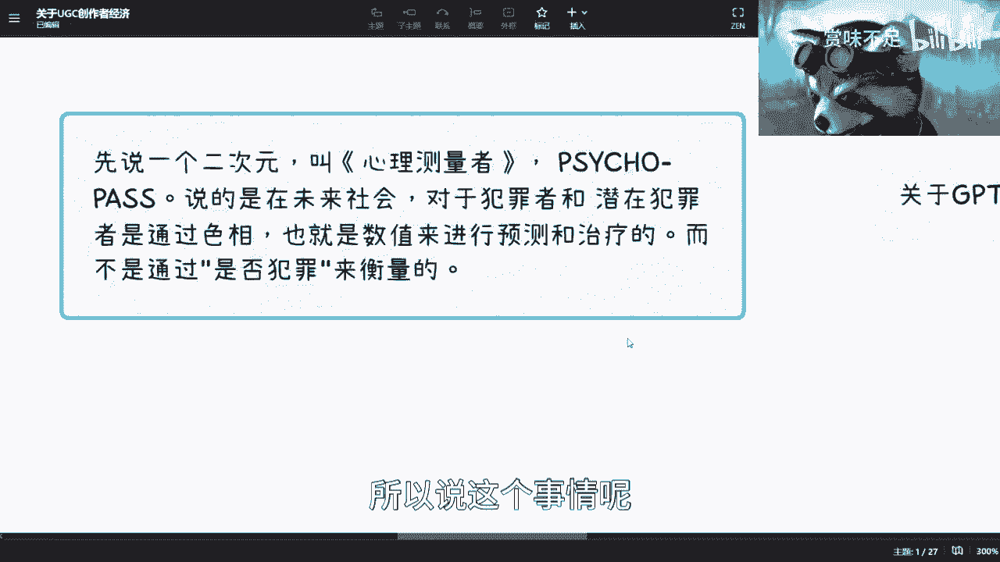

所以说这个事情呢，是一个这个避无可避的一个方向啊，所以在一开始为什么我会想到这件事情，好吧，唉我就说啊这个东西嗯难说比较难说啊。

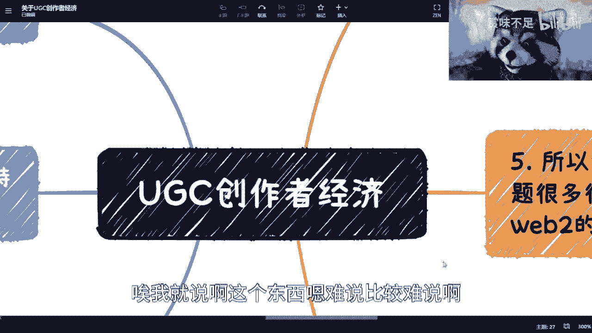

我希望大家这个看完看完。

能对这个东西能有一个本质上的了解，好吧行。

