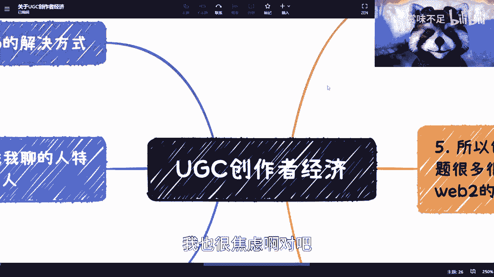
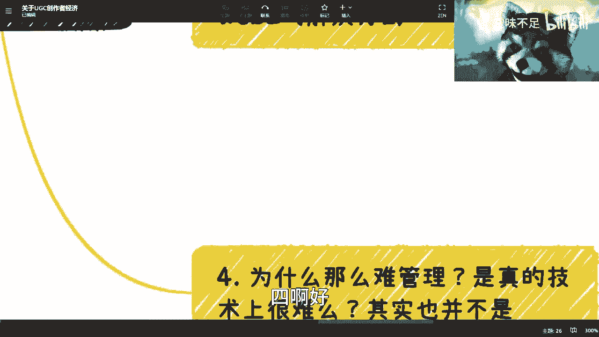
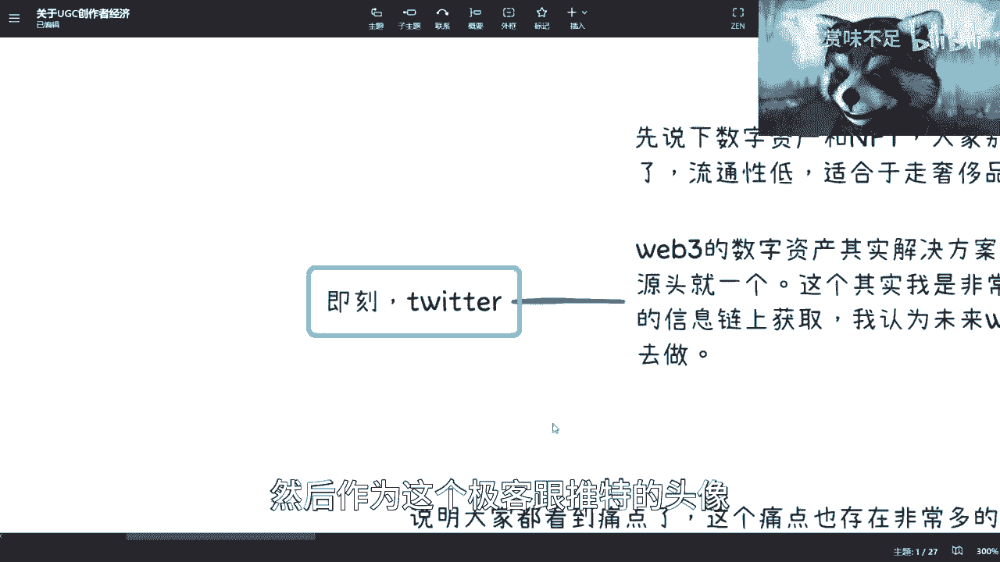

# 创作者经济全面解析 - P1 🧠💰

在本节课中，我们将要学习“创作者经济”的核心概念、当前面临的痛点以及可能的解决方案。课程将从一部动漫的启示开始，逐步剖析创作者在价值获取、激励、可持续性等方面遇到的挑战，并探讨Web2与Web3两种范式下的解决思路。

## 从《心理测量者》看未来社会 🌐

上一节我们介绍了课程概述，本节中我们来看看一个有趣的切入点。

我首先想提及一部动漫《心理测量者》。这部作品描绘了一个未来社会，其中通过一个名为“色相”的综合评估模型来预测和“治疗”潜在犯罪者。这个模型类似于现实中的信用评分系统（例如**蚂蚁信用分**），但其核心逻辑是**风险前置**——即在犯罪行为发生前进行干预，而非事后追责。

我认为这个设定符合人类社会的发展趋势。我们当前所做的许多事情，如大数据收集、模型训练、数据化衡量个人，本质上都是在构建预测系统。以GPT为例，当它的数据量足够庞大并能够进行实时分析时，下一步很可能就是进行未来预测。它基于历史数据训练，并可通过特定算法预测多种可能性路径。这类似于《流浪地球2》中的情节。至于AI是否会产生意识，这属于科幻范畴，不在本次讨论范围内。

## 创作者经济的现状与普遍痛点 😰

上一节我们从宏观视角看到了数据预测的未来，本节中我们聚焦到具体的“创作者经济”领域。

近年来，有许多人（尤其是95-00后的年轻人）与我探讨过相关内容。大家都看到了UGC（用户生成内容）领域的痛点：C端市场并不好做，创作者经济也充满挑战。

以下是当前创作者经济面临的几个核心痛点：

1.  **价值回报不对等**：创作者常常无法获得与其付出相匹配的价值回报。例如，花费大量精力制作的视频，其经济收益可能远低于预期。价值的认定并非由创作者自己决定，而是由市场和用户的数据反馈（如播放量、点赞数）来评判。一个制作精良的长视频可能不及一个简短娱乐视频受欢迎，这导致了价值感知的落差。
2.  **激励机制不足**：平台缺乏足够有效且公平的激励机制。无论是播放量收益、粉丝打赏还是其他形式的激励，都难以精准、公正地衡量不同类型创作者（如知识类与娱乐类）的贡献，并给予相应回报。
3.  **缺乏可持续产出动力**：这与前两点强相关。由于回报不确定、激励不足，加上版权保护乏力、利益分配不透明等生态问题，创作者难以获得持续创作的动力。例如，作品被轻易盗用篡改后，原作者甚至难以自证和维权。

综合来看，这些痛点的核心最终都体现在 **“钱”** 上。更深层的问题是，如何建立一个生态，让每一份创作对应的合理价值，都能准确、公平地归属到应得的创作者手中。

## 问题的本质与复杂性 🔍

上一节我们列出了创作者的具体困境，本节中我们来深入探讨这些问题的本质。

首先，必须认识到，这些痛点并非UGC独有。所有涉及个人创作者的领域，如图文、音乐、设计等，都普遍存在版权保护、利益分配、价值衡量等缺失。这是一个从创作、确权、保护、跟踪到管理的**系统性生态问题**。

其次，理解问题的复杂度至关重要。许多创业或解决方案失败，源于对问题复杂性的认知不足。创作者经济的困境并非简单地创建一个新平台或设计新规则就能解决。例如：

*   **传播不可控**：作品一旦发布到开放互联网，其传播几乎无法控制。技术上有防盗手段，但在当前环境下往往收效甚微。
*   **数据不透明**：创作者很难确切知道自己的作品产生了多少真实收益。平台提供的数据是否真实可信？分润规则是否公平且稳定？创作者通常处于被动地位，规则由平台单方面制定和修改。
*   **执行与信任缺失**：即使规则明确、收益可查，创作者能否顺利拿到应得报酬？平台是否具备足够的公信力？

因此，任何旨在解决创作者经济问题的方案，都必须直面这些深层次的系统性挑战，而非仅仅进行表面上的“模式创新”。

## Web2时代的解决尝试与局限 🏗️

上一节我们分析了问题的顽固性，本节中我们看看在现有的Web2（中心化互联网）框架下，人们是如何尝试解决的。

以下是几种常见的Web2解决方案及其局限：

1.  **版权登记**：在版权局或相关机构进行作品登记。这是法律层面的基础确权，但流程繁琐，且在网络侵权发生时，维权成本高、效果有限。
2.  **平台中心化控制**：由平台控制内容发行与分润。例如网易云音乐控制歌曲的发行和销售数据。但问题在于，**数据黑箱**依然存在，创作者无法验证数据的真实性与分润的合理性，信任依赖于平台自律。
3.  **聚合平台模式**：在现有平台（如B站、抖音）之上再构建一个聚合平台，试图提供新的激励生态。然而，这往往只是“套了一层壳”，并未触及版权保护、数据透明、利益公平分配等核心痛点，属于“重复造轮子”。

这些方法能在一定程度上改善局部体验，但无法从根本上**解决**创作者经济的系统性难题。

## Web3的解决思路与未来展望 🚀

上一节我们看到了Web2方案的乏力，本节中我们探讨以Web3（价值互联网）思维提出的新方向。

Web3的核心思路是**控制所有权源头**，并通过技术实现可信的执行。这并非单指NFT（非同质化代币），NFT目前更偏向于数字奢侈品或收藏品路径。这里指的是更广义的**数字资产**与**智能合约**。

一个可行的方向是：将创作内容在链上生成唯一的数字资产，并通过智能合约定义其使用、传播和分润规则。例如，推特和极客曾尝试将加密钱包持有的数字资产显示为头像。其启示在于：如果所有平台在调用某个作品时，都必须追溯到链上的唯一源头并进行验证，那么传播和权属就能得到有效控制。

这就像推倒了第一块多米诺骨牌：
*   **源头确权**：作品自诞生起就与创作者身份强绑定。
*   **传播可控**：任何使用行为都需要与链上源头交互，便于追踪。
*   **利益自动分配**：通过预设的智能合约，收益可以按照透明、不可篡改的规则自动分配。

我认为，未来Web2世界也可能朝这个方向发展。结合联盟链、数字人民币、数据资产化等趋势，构建一个**风险前置**的可信数字环境。这与《心理测量者》的“风险前置”逻辑内在一致：通过技术手段在事前明确规则、确认权属、约定分配，从而大幅降低事后的纠纷与维权成本，节约社会资源。

## 总结 📝

本节课中我们一起学习了创作者经济的核心脉络。

我们从《心理测量者》的“风险前置”理念出发，分析了当前创作者在价值回报、激励机制和持续动力方面面临的**系统性痛点**。这些问题的根源在于权属不清、数据不透明和信任缺失构成的**生态困境**。

我们看到，Web2时代的解决方案多在原有框架内修补，难以根治问题。而Web3则提供了一种新思路：通过**区块链技术**和**智能合约**，从源头确权，实现可信的数据流转与利益分配，本质上是将“风险后置”的管理模式转变为“**风险前置**”的自动化执行。

理解这些，有助于我们看清创作者经济未来的可能演变方向。至于智能合约、数字人民币如何具体实现这一愿景，我们将在后续课程中详细展开。