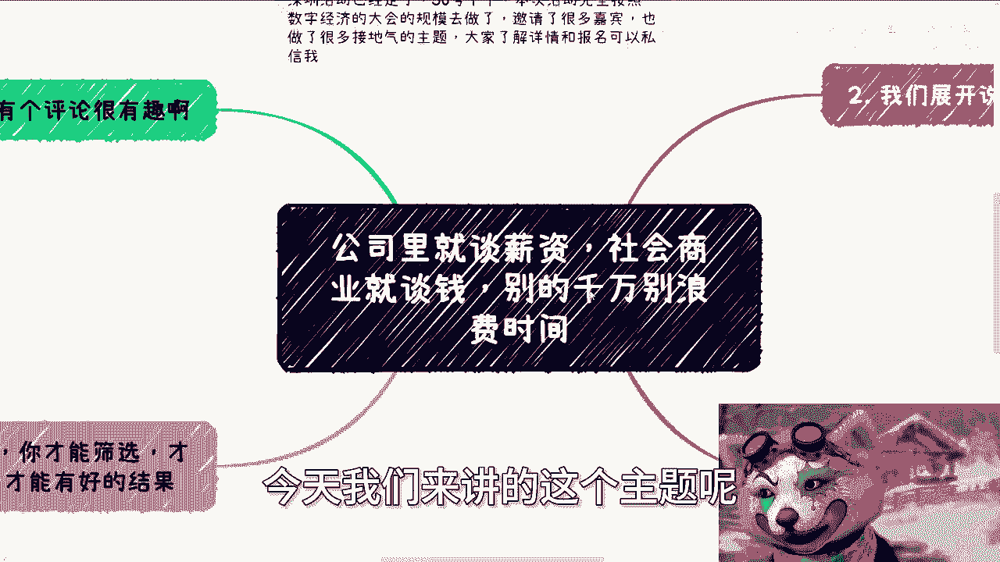

# 公司里谈薪资-社会就谈钱-别的不要bb---P1---赏味不足---BV1Ys421T75L_not

在本节课中，我们将学习一个核心原则：在职场和商业合作中，应专注于讨论薪资与金钱，避免谈论其他无关话题。这一原则能帮助你有效筛选合作伙伴，保护自身利益。

## 课程概述

本教程内容源于对一条网络评论的讨论。该评论认为，企业HR在沟通时应先发信息，而非直接打电话，否则就是不尊重。我们将以此为契机，探讨在职场和商业环境中应有的沟通态度与原则。

## 核心原则：只谈钱，不谈虚的

上一节我们介绍了课程的背景，本节中我们来看看核心观点。无论是在公司内部谈薪资，还是在社会上进行商业合作，核心原则是**直奔主题，只讨论与金钱和直接利益相关的内容**。

*   **公式**：有效沟通 = 讨论 **薪资/金钱** + 讨论 **具体工作/合作细节**
*   **无效沟通** = 讨论 **尊重/价值观/做事方式** 等非直接利益话题

如果你认为我工作没做好，我们可以讨论工作问题。除此之外，若谈论涨薪、年终奖等实际利益之外的内容，则没有讨论的必要。商业合作同理，判断对方是否靠谱的标准很简单：**对方是否直奔合作目的与利益分配进行讨论**。

## 职场中的具体应用

理解了核心原则后，我们将其应用到职场场景中。在公司里，我们与企业的关系本质是劳务合同关系，核心目的是通过工作获取报酬。

以下是职场中常见的、应避免深入讨论的非核心话题：

*   谈论“为公司好”、“激发责任心”
*   强调“尊重领导”、“不要越级汇报”
*   纠结于“打卡是否准时”等形式问题

我们进入公司是为了干活和拿钱。因此，只应关心与“干活”和“拿钱”直接相关的事务。例如，如果HR因打电话沟通而被认为“不尊重”，这本身就是一个需要被筛选掉的无效话题。我的态度是：如果你要我遵循你的价值观，请用**更高的薪资**来体现。

## 商业合作中的筛选逻辑

职场原则同样适用于更广阔的商业社会。在商业合作中，许多人容易陷入对合作方背景的过度关注，而忽略了合作本身。

以下是商业谈判中常见的干扰信息，应学会识别并过滤：

*   对方强调自己“关系很硬”、“认识大佬”
*   吹嘘过往业绩（如“曾赚多少钱”、“业务流水几十亿”）
*   标榜各种虚名（如“某某专家”、“某某协会成员”）

这些信息与“本次合作如何为你我赚钱”这一核心问题无关。一个人可能在其他方面很靠谱，但在与你合作的这个具体项目上未必靠谱。判断靠谱与否的唯一标准，是厘清**合作模式与利益分配**。

## 态度决定结果：从改变自己开始

有人可能会说，自己没有底气坚持原则，只能选择“跪舔”。本节我们来探讨这种心态的弊端。改变的关键在于**态度先行**，而非等待所谓的“实力到位”。

社会永远存在不靠谱的人与事。你能做的不是抱怨，而是**主动筛选**。如果你在20多岁时就选择忍气吞声，与不靠谱的人或公司周旋，那么这段经历并不会为你未来的“改变”积累有效资本。本质上，你只是在浪费时间。正确的做法是，**尽早树立并坚持自己的原则**，这将自动帮你过滤掉大量无效机会。

## 目标明确是成功筛选的前提

上一节我们讨论了态度的重要性，本节我们总结如何执行。目标明确是进行有效筛选、获得良好合作结果的前提。许多人误以为人际关系和项目需要慢慢铺垫、演变。

但你需要明白一个事实：**年龄和工龄的增长，并不会自动让你遇到更靠谱的人和事**。你需要积累的是在**靠谱项目**和**靠谱伙伴**身上获得的经验（尽管90%的靠谱项目也可能失败）。这些经验才是宝贵的。

以下是导致合作失败的常见原因，均源于目标不明确：

*   合作开始时不清楚项目如何赚钱。
*   只有模糊计划（如“先做流量，后变现”），但没有清晰的变现路径、客户来源和分成方案。
*   因对方“吹牛”或说“重话”而妥协，不敢追问核心问题。

合作失败后抱怨对方是“骗子”或项目“不靠谱”是徒劳的。反躬自省，**你在合作前问清楚关键问题了吗？** 如果你没有做到，那么问题同样出在你自己身上。

## 课程总结与行动建议

本节课中我们一起学习了职场与商业谈判的核心原则：**只谈钱，不谈虚的**。我们探讨了如何在公司内部坚持这一原则应对HR，也分析了在商业合作中如何用它来筛选伙伴。关键在于树立明确的目标和坚定的态度，从第一次沟通开始就直奔主题，讨论薪资、利益分配和具体执行方案。

*   **行动建议**：在下次职场沟通或商业洽谈前，明确你的核心目标（薪资数额、合作分红），并准备好直接相关问题。对于任何偏离主题的讨论，保持警惕并适时引导回正题。

---
**附：活动与咨询服务信息**
深圳线下活动已定于30号下午举行，规模与主题均经过精心设计。了解详情或报名请私信。
此外，如需关于商业规划、职业发展、股权设计、合同审核等方面的具体咨询，请整理好你的具体问题与现状，以便进行更具针对性的沟通。