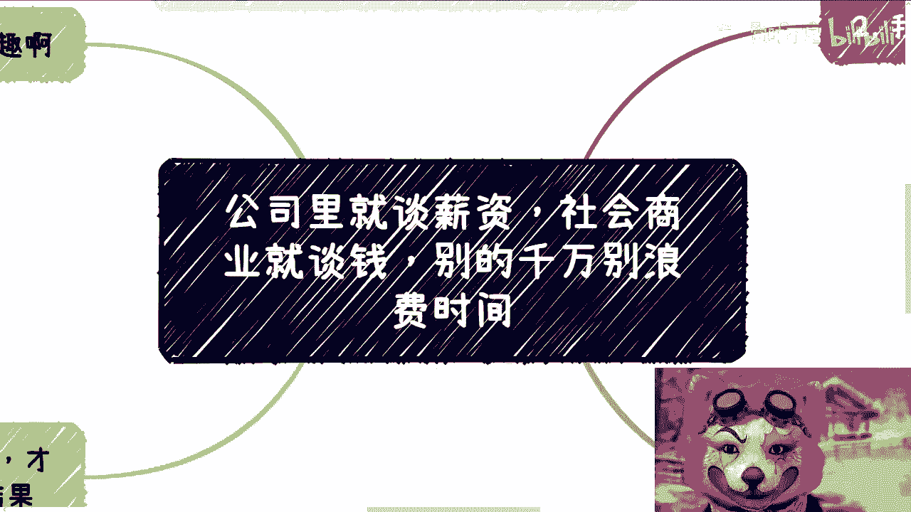
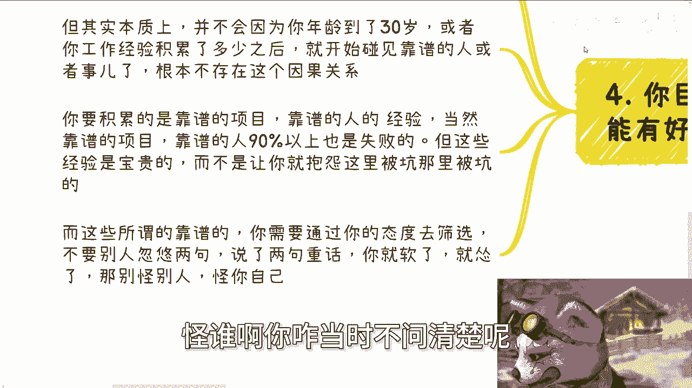
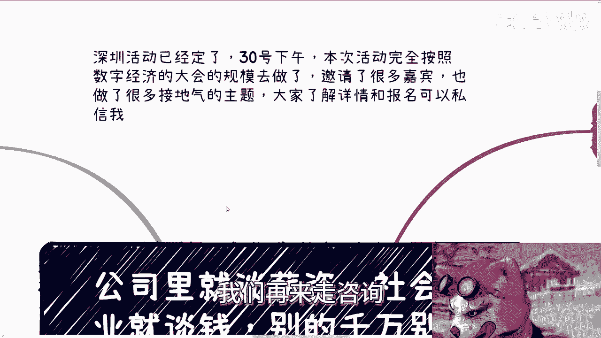

# 公司里谈薪资，社会就谈钱，别的不要bb - P1 - 赏味不足 - BV1Ys421T75L

好这个大家好啊，今天我们来讲的这个主题呢。

是跟昨天有个评论有关啊，呃呃待会我们再来说啊。

今天这个主题叫做公司里面谈薪资啊，社会商业上面就谈钱啊，别的只要不直奔主题的都别谈啊。

那么深圳活动已经定了，30号下午好吧，本次活动全部按照数字经济大会的规模，我去做的，啊邀请了很多嘉宾啊，也做了很多一些接地气的主题，好吧。

大家了解详情和报名可以私信我啊，呃首先第一啊昨天有个评论很有趣啊，就说企业里面沟通吧，啊说这个hr啊尊重不尊重的啊，要先呃信息沟通啊，然后说才能电话啊，不能直接电话啊，那么说他直接电话了就不尊重人家啊。

怎么样怎么样，那么这个让我想到了这个我曾经工作的时候，对吧啊，呃首先啊可能很多人这个对我有误解啊，就我工作了很多年啊，我写了七到8年的代码，我除了外企没有去过对吧，民企中型的企业大企业我都去过啊。

那就如我主题写的啊，我希望大家能明白，就公司里面呢就谈薪资呃，如果要聊问题呢，是我工作的不做，如果是我们工作做的不好，那没问题啊，聊就聊，但凡聊点别的啊，聊的有的没的东西啊，什么尊重啊，价值观啊。

做事方式啊，那么我觉得我的态度或者你们的态度是什么呢，就是请用掌心来砸我对吧，你要是不跟我谈涨薪啊，不跟我谈什么年终奖，或者不跟我谈什么东西，别的就免谈，有啥好谈的呢对吧。

其实你们做商业的时候就就就也一直问啊，就说哎陈老师我们怎么判断靠不靠谱也简单啊，只要对方奔着目的跟你聊的，那就是靠谱，但凡对方不奔着目的跟你聊都是扯淡对吧，就这么简单，你们仔细的去回想回想啊。

那么第二我们讲展开说说，你比如说企业里面啊，说什么为公司好啦，或者说什么你怎么负责任啦，激发你的责任心啦对吧，或者说你要尊重领导啦，不要跨级啦对吧，或者说什么啊，打卡要准时啦对吧，都他妈滚犊子啊。

那为什么，因为我们去企业是干嘛的对吧，我最朴素来讲，我们去企业是干活的，我们去企业是大家在一起干活的对吧，每个人都是拿每个人的月薪结束了，怎么滴啊，哦我们去企业是他妈为了尊重来尊重去的吗，当然不是对吧。

那你说我们去企业为的目的，就像我们刚刚说的，为了干活拿钱，那自然我们只关心干活跟拿钱对吧，你跟我谈什么尊重不尊重，有什么尊重不尊重的对吧啊你我我跟你讲，你要那个hr跟我聊，我就会跟他讲。

我来我是干活的对吧，这活有问题，我们聊没问题，不要跟我讲，有什么好跟我讲的，你要尊你要找尊重，找别人去跟我有什么关系啊，对不对，再说了哦，你觉得打电话是不尊重，我觉得打电话是尊重呀，怎么了呢，怎么了呢。

哦我我我登，我就跟你是劳务合同啊，怎么了，我他妈卖给你了啊，你我他妈不但给你干活，我我他妈还得富，还得follow你的价值观，凭什么那莫名其妙的，对不对，你要我follow，可以的呀。

你一个月给我100万，给不了，你不给不给免谈滚，对不对啊，那么社会上也是的，你别跟我说什么，你就就就就你说陈老师我们合作啊，然后我就问你，我说你们合作我们合作对吧，那么你有什么东西呢啊。

你跟我说哎我关系很硬对吧，我这里关系那里关系，然后什么啊，你们还有很多人跟我说什么，这个人是个大佬对吧，什么东西啊，以前赚过多少钱对吧，怎么什么，现在这个业务几十个亿对吧，怎么样怎么样。

然后跟我说他妈啊，这个人有有这个人是什么什么地方的，什么什么专家啊，什么东西，我跟你讲都滚犊子，为什么啊，关我吊事啊，哎我就很奇怪，你知道吗，就是每次我跟别人沟通啊，包括就是咨询的时候也是的。

我就问我说这个人跟你什么关系，这个人你对他了解多少，然后呢，就是对面那个人会自我PUA，然后来跟我说，爱陈老师这个人怎么样怎么样，很牛逼啊，怎么牛逼怎么牛逼，怎么牛逼，我就跟他讲，他怎么牛逼，关你吊事。

他怎么牛逼，关我吊事对吧，就我跟你呢要关心的是这个人跟你合作，怎么给你赚钱，怎么给我赚钱，别的我们不需要了解呀，我们了解他干嘛呢，对不对，哎妈奇了怪嘞啊，非要非要在那边说啊，这个人关系怎么样。

那个人关系怎么样啊，这个人现在年年流水多少哎，流水多少，关你吊事啊，他他妈流水100个亿也分给你，也不分给你一分钱啊，对不对，那其实就是说社会上合作很简单，你甭管他靠谱不靠谱，这个人有可能靠谱。

但是有可能这个人靠谱的人，在你这个合作case上面就不靠谱，那你怎么判断他靠不靠谱呢，对不对啊，第三有的人又要说了，那陈老师，那这个东西我们做不了对吧，他说我们没底气啊，啊我们必须跪舔，我跟你讲啊。

是这样子的，你们会发现你们的态度不坚定，你们不做出自己的原则，这个事不会改变的啊，你以为你是到某个时间点有底气吗，你以为你是到某个时间点能改变吗，不是的，是一开始你的态度就得改变，我跟你讲。

你永远会碰见，就是你要这么想，整个社会，整个人类社会永远有无数不靠谱的人，也有永永远有无数不靠谱的事情，那么能你能怎么做，你只能做筛选，对吧，你不做筛选，你碰到这些不靠谱的人，碰到这些不靠谱的事情。

然后你怪别人有什么用对吧，你抱怨说哎呀，我怎么一天到晚碰到一些烂的吧，碰到一些什么东西，你有用不了，没有用的对吧，我跟你讲，你现在软了，接受了是没问题，就是你可能不会触发很大的矛盾。

但解决不了本质问题啊，你想想看你20多岁忍忍气吞声对吧，你面对都你也没有积累，面对的都是一些，面对的都是些事情，而垃圾人跟垃圾企业，然后呢一直如此吗，那你打算什么时候改变呢。

就本质上你如果某一天未来30岁打算改变了，那么在你改变之前，就等于都在浪费你自己时间，那你为什么不早点改变呢，对不对啊，那么我跟你讲，这就是一种态度，这种态度就是一种筛选啊，你非要不没有自己的原则。

没有自己的态度，那么也就等于你非要选择各种不靠谱的人，或者不靠谱的事情去开始去合作，然后过程当中被坑，结果上面赚不到钱，紧紧接着呢，你就抱怨别人怎么样怎么样怎么样，抱怨自己怎么这么运气不好怎么样子。

但其实他妈的是你自己的态度问题啊，这跟运气有什么关系啊，对不对，你要觉得不靠谱，你直接直接就不合作，你为什么要合作呢，啊就就像我们刚刚说的，你跟对方聊就直接聊钱啊，哎钱怎么赚，我们怎么分不就结束了吗。

你直接问啊，怎么了呢，哦大家合作难道不能问吗，哎我就不明白了哦，我在企业里面啊，我是来打工的，那么我拿多少钱怎么了呢，我不能问吗，我不能聊吗，我不奔着钱来怎么了，我他妈奔着跟你hr谈恋爱来吗，对不对。

那我在社会上合作也是一样啊，那我合作我就是奔着钱来的，我怎么地我用爱发电啊，哎我就很不明白，就很多人他就不问哎，他就他就觉得哎我好像还不不太行，我好像不够强大，怎么了呢。

大家就是奔着赚钱来跟强迫插队有什么关系，你为什么一定要PUA自己呢对吧，第四啊，你目标明确，你才能筛选对吧。

你才能有好的合作，你才能有好的好的结果，就是很多人诶我最近这个对吧，就是说很多人他就不明白这个道理，觉得人跟事情啊是一个铺垫，他是一个慢慢演变的过程，但其实本质上你要这么想啊，很多所谓的事情。

他并不会因为你年龄到了30岁，或者你工作经验积累了多少之后，你说哦因为我活了多少年，因为我工作了多少时间，所以我开始碰见了靠谱的人或者靠谱的事，这他妈压根就没有这因果关系啊，啊你要积累的是什么。

是在靠谱的项目和靠谱的人身上的经验，当然你要明白一点，靠谱的项目跟靠谱的人，90%以上也是失败的，这就是事实规律啊啊但这些经验是宝贵的，而不是说让你在那边不停的抱怨，而这里被坑了，那你被坑了。

我碰到这个人是，我碰到那个项目不靠谱，有用不了没有用的对吧，就是所以说就是说这些所谓的靠谱啊，你都是需要通过你的态度去筛选的，你不要别人忽悠两句对吧，这么这么吹两句逼啊，然后说两句重话，你就软了。

你就知道哇，操是个牛逼的人，我得我我我得抱住他大腿对吧，就怂了啊，到最后一那一一地鸡毛对吧，然后怪别人啊，说这个人骗你，怎么样子怪谁啊，你咋当时不问清楚呢对吧。

我真的我我可以跟你们说，百分之百我碰到的人里面，但凡只要是合作失败的，赚不到钱的，我就会我就问他，我说那你这个项目合作的时候，你知道怎么赚钱吗，不知道对吧，就跟我说哎呀这个东西流呃，我们先做。

做了之后有流量来赚钱，那怎么赚钱呢，清楚吗，流量哪里来钱，哪里来钱，谁付你能付，你能出，你能得到多少，知道吗，不知道都都是都是你们自己的问题了，怪谁啊，哦你怪啊，骗子骗你的钱啊。

然后就说不靠谱的人跟你合作，然后弄了个不靠谱的项目，你怪别人不靠谱，那你靠谱不，这位来一样的呀对吧，你咱就反过来说，那你这么长时间每天找我合作还很多呢，哦怎么地我都去合作一遍，合作到一半浪费了我的时间。

然后我就他妈发视频跟你们说，卧槽我他妈今天碰到了一个不靠谱的，是那个项目对吧，然后我被人坑了。

那只能代表我不靠谱，对吧，其实就这么一个逻辑啊，啊好吧啊，然后那个深圳活动啊，30号的活动已经定了，然后呃你们了解详情的好吧，继续私信啊，呃然后同样的就是商业呃，呃商业规划，职业规划啊，包括什么啊。

股权啊，丰润啊，分红啊，商业计划书啊，白皮书啊，呃这个这个这个呃合同啊等等等啊，包括你们手上有什么牌，你们手上没有什么牌啊，你们希望通过跟我的沟通啊，能够给你们一些更接近于啊当下社会发展。

跟整个经济发展的接地气的一些建议的话，那么你们可以整理好问题啊，我们再来做咨询。

好吧啊行。